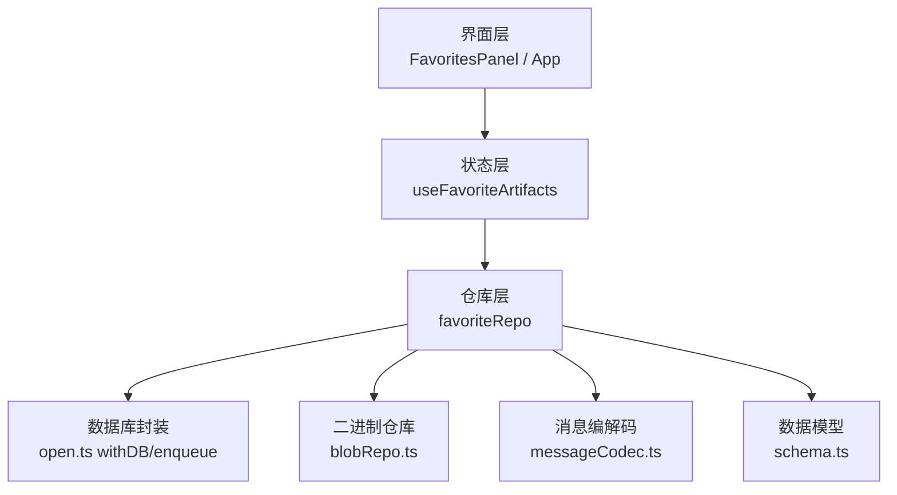
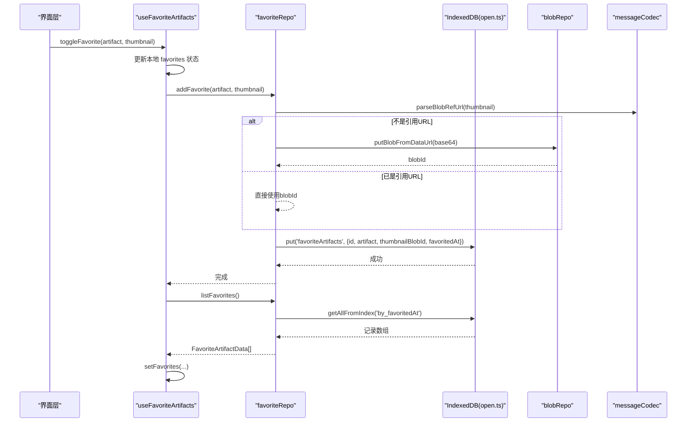
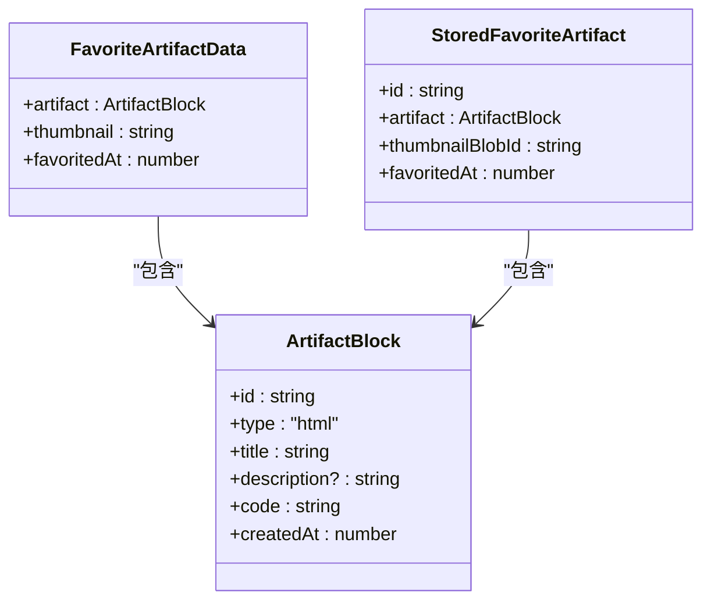
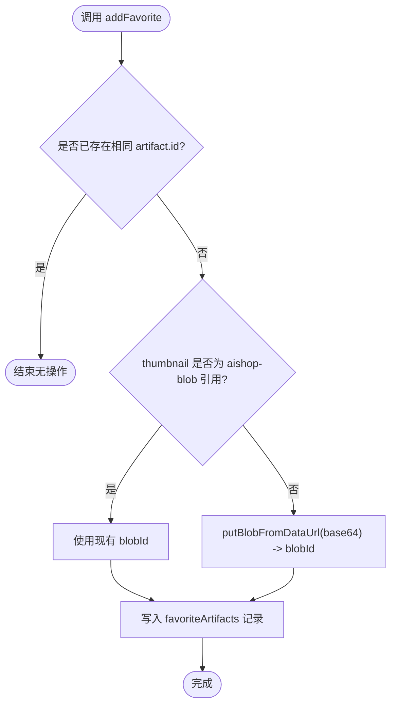
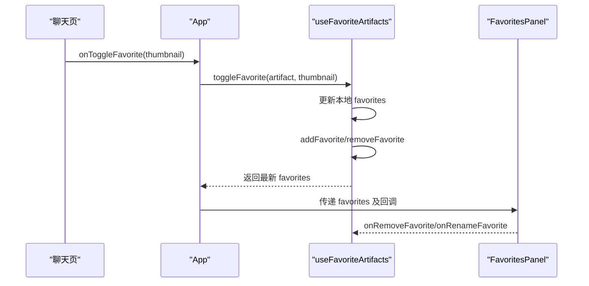
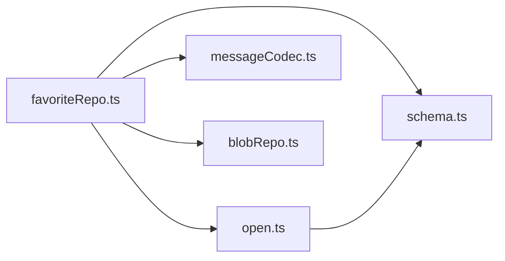

# 收藏仓库

<cite>
**本文引用的文件**
- [src/db/favoriteRepo.ts](file://src/db/favoriteRepo.ts)
- [src/hooks/useFavoriteArtifacts.ts](file://src/hooks/useFavoriteArtifacts.ts)
- [src/components/artifact/FavoritesPanel.tsx](file://src/components/artifact/FavoritesPanel.tsx)
- [src/App.tsx](file://src/App.tsx)
- [src/db/schema.ts](file://src/db/schema.ts)
- [src/db/open.ts](file://src/db/open.ts)
- [src/db/blobRepo.ts](file://src/db/blobRepo.ts)
- [src/db/messageCodec.ts](file://src/db/messageCodec.ts)
- [src/services/backup.ts](file://src/services/backup.ts)
- [src/types/index.ts](file://src/types/index.ts)
</cite>

## 目录
1. [简介](#简介)
2. [项目结构](#项目结构)
3. [核心组件](#核心组件)
4. [架构总览](#架构总览)
5. [详细组件分析](#详细组件分析)
6. [依赖关系分析](#依赖关系分析)
7. [性能与存储特性](#性能与存储特性)
8. [故障排查指南](#故障排查指南)
9. [结论](#结论)
10. [附录：数据模型与导入导出](#附录数据模型与导入导出)

## 简介
本文件系统化文档化“收藏仓库”功能，覆盖收藏数据的增删改查、数据结构设计、缩略图与二进制存储、同步与备份机制、搜索与过滤能力，以及导入导出格式。该功能将 Artifact（可执行代码块）及其缩略图持久化到 IndexedDB，并通过 React Hook 暴露给 UI 层进行展示与管理。

## 项目结构
收藏功能由以下层次组成：
- 数据层：IndexedDB schema、blob 引用计数、消息编解码、统一数据库访问封装
- 仓库层：favoriteRepo 提供 list/add/remove/rename 等 API
- 状态层：useFavoriteArtifacts Hook 管理本地 state 并协调落库
- 界面层：FavoritesPanel 展示收藏列表、预览、重命名、删除；App 路由到收藏页并与聊天页联动收藏

图表来源
- [src/components/artifact/FavoritesPanel.tsx:1-311](file://src/components/artifact/FavoritesPanel.tsx#L1-L311)
- [src/App.tsx:30-90](file://src/App.tsx#L30-L90)
- [src/hooks/useFavoriteArtifacts.ts:1-86](file://src/hooks/useFavoriteArtifacts.ts#L1-L86)
- [src/db/favoriteRepo.ts:1-84](file://src/db/favoriteRepo.ts#L1-L84)
- [src/db/open.ts:76-114](file://src/db/open.ts#L76-L114)
- [src/db/blobRepo.ts:1-168](file://src/db/blobRepo.ts#L1-L168)
- [src/db/messageCodec.ts:15-27](file://src/db/messageCodec.ts#L15-L27)
- [src/db/schema.ts:213-277](file://src/db/schema.ts#L213-L277)

章节来源
- [src/App.tsx:30-90](file://src/App.tsx#L30-L90)
- [src/components/artifact/FavoritesPanel.tsx:1-311](file://src/components/artifact/FavoritesPanel.tsx#L1-L311)
- [src/hooks/useFavoriteArtifacts.ts:1-86](file://src/hooks/useFavoriteArtifacts.ts#L1-L86)
- [src/db/favoriteRepo.ts:1-84](file://src/db/favoriteRepo.ts#L1-L84)
- [src/db/open.ts:76-114](file://src/db/open.ts#L76-L114)
- [src/db/blobRepo.ts:1-168](file://src/db/blobRepo.ts#L1-L168)
- [src/db/messageCodec.ts:15-27](file://src/db/messageCodec.ts#L15-L27)
- [src/db/schema.ts:213-277](file://src/db/schema.ts#L213-L277)

## 核心组件
- FavoriteArtifactData：收藏项在运行时的数据类型，包含 artifact、thumbnail、favoritedAt
- favoriteRepo：IndexedDB 读写封装，提供 listFavorites、addFavorite、removeFavorite、renameFavorite
- useFavoriteArtifacts：React Hook，维护 favorites 本地状态，先更新 UI 再异步落库，失败不阻断
- FavoritesPanel：收藏列表 UI，支持预览、长按菜单、重命名、删除确认
- App：集成收藏 Hook，并在聊天页中触发收藏动作

章节来源
- [src/db/favoriteRepo.ts:16-21](file://src/db/favoriteRepo.ts#L16-L21)
- [src/hooks/useFavoriteArtifacts.ts:22-86](file://src/hooks/useFavoriteArtifacts.ts#L22-L86)
- [src/components/artifact/FavoritesPanel.tsx:9-13](file://src/components/artifact/FavoritesPanel.tsx#L9-L13)
- [src/App.tsx:32-89](file://src/App.tsx#L32-L89)

## 架构总览
收藏数据流从 UI 到 IndexedDB 的完整路径如下：

图表来源
- [src/hooks/useFavoriteArtifacts.ts:34-45](file://src/hooks/useFavoriteArtifacts.ts#L34-L45)
- [src/db/favoriteRepo.ts:43-62](file://src/db/favoriteRepo.ts#L43-L62)
- [src/db/messageCodec.ts:21-27](file://src/db/messageCodec.ts#L21-L27)
- [src/db/blobRepo.ts:70-74](file://src/db/blobRepo.ts#L70-L74)
- [src/db/open.ts:76-88](file://src/db/open.ts#L76-L88)

## 详细组件分析

### 收藏数据模型与类型定义
- FavoriteArtifactData：运行时类型，包含 artifact、thumbnail（aishop-blob:<id>）、favoritedAt（收藏时间戳）
- StoredFavoriteArtifact：持久化类型，thumbnail 以 thumbnailBlobId 指向 blobs 表，避免大体积 base64 占用 localStorage
- ArtifactBlock：被收藏的代码块实体，含 id、type、title、description、code、createdAt

图表来源
- [src/db/favoriteRepo.ts:16-21](file://src/db/favoriteRepo.ts#L16-L21)
- [src/db/schema.ts:213-219](file://src/db/schema.ts#L213-L219)
- [src/types/index.ts:44-51](file://src/types/index.ts#L44-L51)

章节来源
- [src/db/favoriteRepo.ts:16-21](file://src/db/favoriteRepo.ts#L16-L21)
- [src/db/schema.ts:213-219](file://src/db/schema.ts#L213-L219)
- [src/types/index.ts:44-51](file://src/types/index.ts#L44-L51)

### 收藏操作实现
- listFavorites：按 favoritedAt 升序读取收藏列表，映射为 FavoriteArtifactData
- addFavorite：去重检查（同 artifact.id），将 base64 转为 blob 或复用引用，写入 favoriteArtifacts 表
- removeFavorite：删除记录并释放对应 blob 引用计数
- renameFavorite：事务内更新 artifact.title

图表来源
- [src/db/favoriteRepo.ts:43-62](file://src/db/favoriteRepo.ts#L43-L62)
- [src/db/messageCodec.ts:21-27](file://src/db/messageCodec.ts#L21-L27)
- [src/db/blobRepo.ts:70-74](file://src/db/blobRepo.ts#L70-L74)

章节来源
- [src/db/favoriteRepo.ts:32-84](file://src/db/favoriteRepo.ts#L32-L84)

### 状态管理与 UI 交互
- useFavoriteArtifacts：启动时加载列表；添加/删除/重命名先更新本地 state，再异步落库；isFavorite/toggleFavorite 提供便捷判断与切换
- FavoritesPanel：网格展示收藏项，支持长按弹出菜单、预览、重命名、删除确认；通过 props 接收回调
- App：在聊天页中根据当前消息的 artifact 触发收藏，并将收藏状态传递给聊天面板

图表来源
- [src/App.tsx:78-89](file://src/App.tsx#L78-L89)
- [src/hooks/useFavoriteArtifacts.ts:54-83](file://src/hooks/useFavoriteArtifacts.ts#L54-L83)
- [src/components/artifact/FavoritesPanel.tsx:9-13](file://src/components/artifact/FavoritesPanel.tsx#L9-L13)

章节来源
- [src/hooks/useFavoriteArtifacts.ts:22-86](file://src/hooks/useFavoriteArtifacts.ts#L22-L86)
- [src/components/artifact/FavoritesPanel.tsx:15-311](file://src/components/artifact/FavoritesPanel.tsx#L15-L311)
- [src/App.tsx:32-89](file://src/App.tsx#L32-L89)

### 分类与标签系统
- 当前实现未内置“分类/标签”字段；收藏项仅包含 artifact、thumbnail、favoritedAt
- 如需扩展分类/标签，可在 FavoriteArtifactData 与 StoredFavoriteArtifact 中增加相应字段，并在 UI 层提供筛选逻辑

[本节为概念性说明，不直接分析具体文件]

### 搜索与过滤
- 收藏列表目前按 favoritedAt 升序展示，未提供关键词搜索或按标签过滤
- 可在 UI 层基于 favorites 数组进行前端过滤（如按 title 模糊匹配）

[本节为概念性说明，不直接分析具体文件]

### 同步与备份机制
- 同步：schema 预留 updatedAt/syncedAt 字段用于未来服务端同步；当前收藏模块未启用云端同步
- 备份：应用提供全局备份导出/恢复（JSON 文件），但当前备份范围主要覆盖会话、消息、节点等，未包含收藏列表；收藏数据仍保存在浏览器 IndexedDB 中
- 建议：若需将收藏纳入备份，可在备份构建阶段加入收藏数据的序列化与恢复逻辑

章节来源
- [src/db/schema.ts:27-33](file://src/db/schema.ts#L27-L33)
- [src/services/backup.ts:1-198](file://src/services/backup.ts#L1-L198)

### 导入导出格式
- 当前备份文件格式为 JSON，包含 app、version、exportedAt、conversations 等字段；收藏数据不在其中
- 如需导出收藏，可扩展备份模块，将 favoriteArtifacts 表内容序列化为 JSON 并合并进备份文件；恢复时反向写入

章节来源
- [src/services/backup.ts:30-45](file://src/services/backup.ts#L30-L45)
- [src/services/backup.ts:143-171](file://src/services/backup.ts#L143-L171)

## 依赖关系分析
- favoriteRepo 依赖 open.ts 的 withDB/enqueue 保证连接健壮性与写串行化
- favoriteRepo 依赖 messageCodec.ts 的 blob 引用 URL 解析与生成
- favoriteRepo 依赖 blobRepo.ts 的 putBlobFromDataUrl/releaseBlobs 管理缩略图二进制
- schema.ts 定义 AiShopDB 中的 favoriteArtifacts 对象存储与索引 by_favoritedAt
- open.ts 在升级阶段创建 favoriteArtifacts 对象存储与索引

图表来源
- [src/db/favoriteRepo.ts:1-12](file://src/db/favoriteRepo.ts#L1-L12)
- [src/db/open.ts:14-45](file://src/db/open.ts#L14-L45)
- [src/db/messageCodec.ts:15-27](file://src/db/messageCodec.ts#L15-L27)
- [src/db/blobRepo.ts:1-12](file://src/db/blobRepo.ts#L1-L12)
- [src/db/schema.ts:213-277](file://src/db/schema.ts#L213-L277)

章节来源
- [src/db/favoriteRepo.ts:1-12](file://src/db/favoriteRepo.ts#L1-L12)
- [src/db/open.ts:14-45](file://src/db/open.ts#L14-L45)
- [src/db/messageCodec.ts:15-27](file://src/db/messageCodec.ts#L15-L27)
- [src/db/blobRepo.ts:1-12](file://src/db/blobRepo.ts#L1-L12)
- [src/db/schema.ts:213-277](file://src/db/schema.ts#L213-L277)

## 性能与存储特性
- 缩略图存储：base64 转 blob 后以内容寻址（sha-256）存储，重复图片只存一份，减少空间占用
- 引用计数：releaseBlobs 递减引用，归零后由 sweepOrphanBlobs 批量清理，避免关键路径写放大
- 索引优化：favoriteArtifacts 按 favoritedAt 建立索引，listFavorites 高效排序读取
- 并发控制：enqueue 对同一 key 的写操作串行化，避免竞态；blobs 写队列确保 refCount 一致性
- 内存压力：withDB 捕获 UnknownError 并重试一次，提升稳定性

章节来源
- [src/db/blobRepo.ts:14-68](file://src/db/blobRepo.ts#L14-L68)
- [src/db/blobRepo.ts:89-148](file://src/db/blobRepo.ts#L89-L148)
- [src/db/open.ts:76-114](file://src/db/open.ts#L76-L114)
- [src/db/schema.ts:271-277](file://src/db/schema.ts#L271-L277)

## 故障排查指南
- 收藏失败：useFavoriteArtifacts 中 catch 打印错误日志；检查 IndexedDB 连接与权限
- 缩略图无法显示：确认 thumbnail 为 aishop-blob:<id> 形式，UI 侧使用 useBlobUrl 解析；检查 blobRepo 中是否存在对应 blob
- 存储空间不足：使用 getBlobStats 查看占用与孤儿 blob；必要时触发 sweepOrphanBlobs 清理
- 备份恢复：确保备份版本兼容；恢复后页面重载以刷新内存状态

章节来源
- [src/hooks/useFavoriteArtifacts.ts:25-31](file://src/hooks/useFavoriteArtifacts.ts#L25-L31)
- [src/db/blobRepo.ts:150-168](file://src/db/blobRepo.ts#L150-L168)
- [src/services/backup.ts:185-198](file://src/services/backup.ts#L185-L198)

## 结论
收藏仓库以 IndexedDB 为核心，结合 blob 引用计数与消息编解码，实现了高效的收藏数据持久化与展示。当前实现聚焦于基础 CRUD 与 UI 交互，尚未内置分类/标签与搜索过滤，也未将收藏纳入备份范围。后续可按需扩展分类字段、前端过滤与备份集成，以满足更丰富的收藏管理能力。

## 附录：数据模型与导入导出

### 数据模型
- FavoriteArtifactData：{ artifact, thumbnail, favoritedAt }
- StoredFavoriteArtifact：{ id, artifact, thumbnailBlobId, favoritedAt }
- ArtifactBlock：{ id, type, title, description, code, createdAt }

章节来源
- [src/db/favoriteRepo.ts:16-21](file://src/db/favoriteRepo.ts#L16-L21)
- [src/db/schema.ts:213-219](file://src/db/schema.ts#L213-L219)
- [src/types/index.ts:44-51](file://src/types/index.ts#L44-L51)

### 导入导出格式
- 当前备份文件为 JSON，包含 conversations/messages/nodes 等；收藏数据未包含在内
- 如需导出收藏，建议在备份构建阶段追加 favoriteArtifacts 列表；恢复时反向写入 IndexedDB

章节来源
- [src/services/backup.ts:30-45](file://src/services/backup.ts#L30-L45)
- [src/services/backup.ts:143-171](file://src/services/backup.ts#L143-L171)