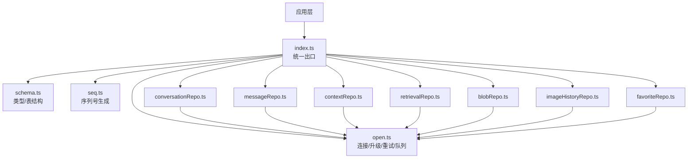
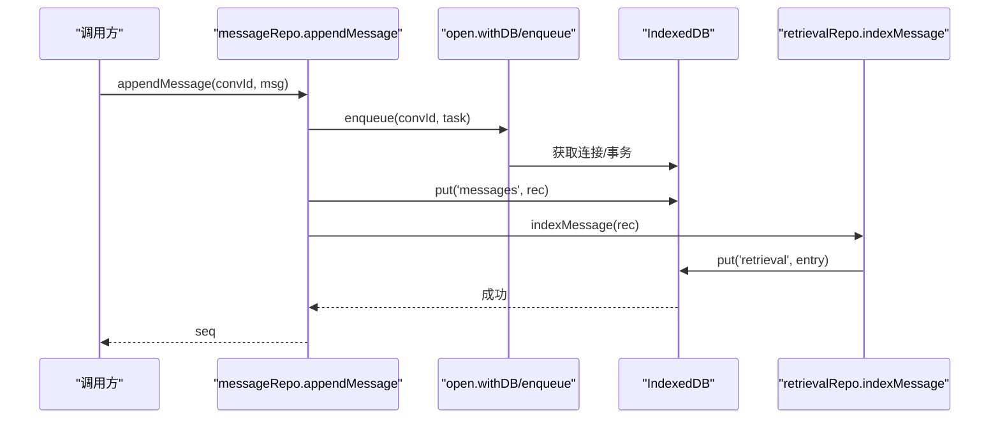
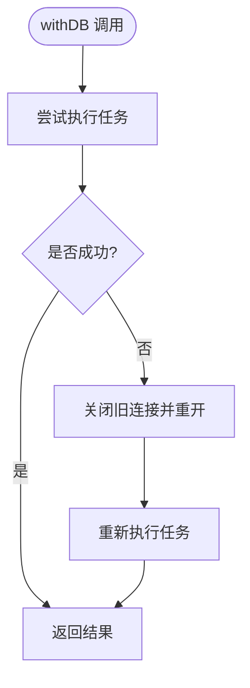
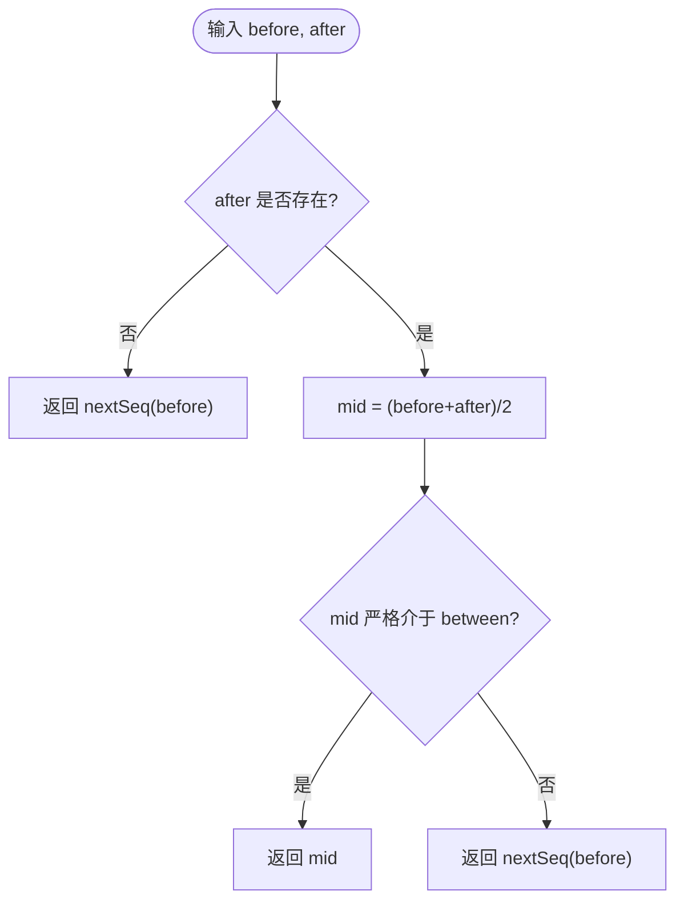
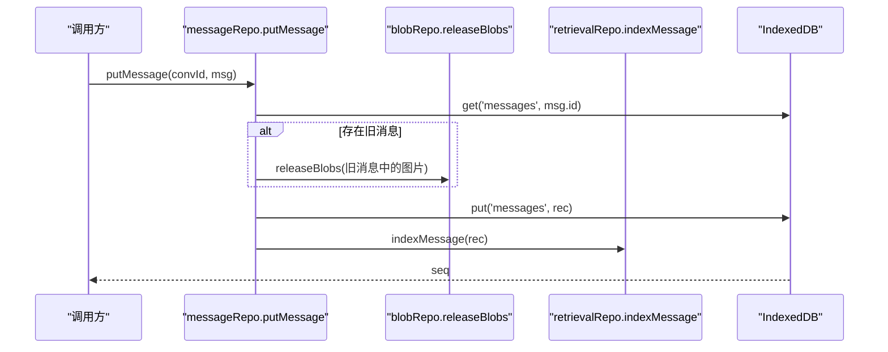
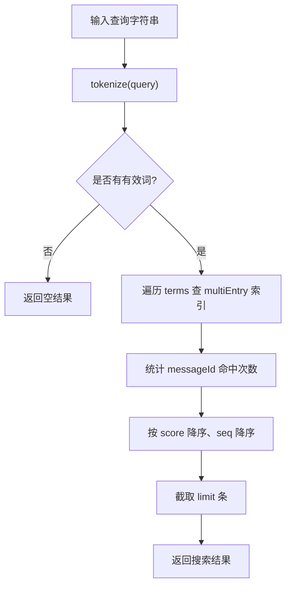
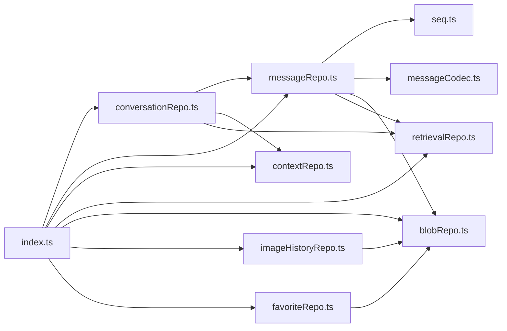
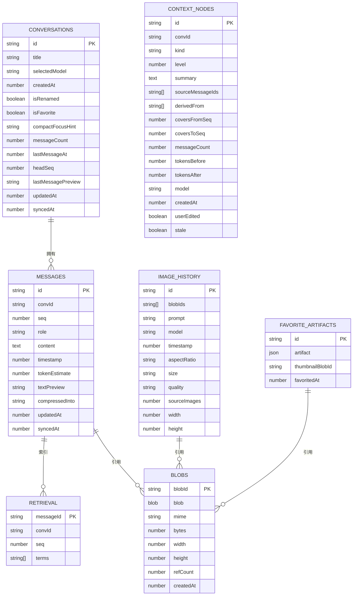

# 数据库层

<cite>
**本文引用的文件**
- [src/db/open.ts](file://src/db/open.ts)
- [src/db/schema.ts](file://src/db/schema.ts)
- [src/db/seq.ts](file://src/db/seq.ts)
- [src/db/index.ts](file://src/db/index.ts)
- [src/db/conversationRepo.ts](file://src/db/conversationRepo.ts)
- [src/db/messageRepo.ts](file://src/db/messageRepo.ts)
- [src/db/contextRepo.ts](file://src/db/contextRepo.ts)
- [src/db/favoriteRepo.ts](file://src/db/favoriteRepo.ts)
- [src/db/imageHistoryRepo.ts](file://src/db/imageHistoryRepo.ts)
- [src/db/retrievalRepo.ts](file://src/db/retrievalRepo.ts)
- [src/db/blobRepo.ts](file://src/db/blobRepo.ts)
</cite>

## 目录
1. [简介](#简介)
2. [项目结构](#项目结构)
3. [核心组件](#核心组件)
4. [架构总览](#架构总览)
5. [详细组件分析](#详细组件分析)
6. [依赖关系分析](#依赖关系分析)
7. [性能考量](#性能考量)
8. [故障排查指南](#故障排查指南)
9. [结论](#结论)
10. [附录](#附录)

## 简介
本章节面向 AIShop 的本地数据层，基于 IndexedDB 实现仓库模式。文档覆盖：
- 数据库连接与升级、写入串行化与错误恢复
- 表结构与索引设计（会话、消息、上下文、检索、二进制、收藏、图片历史）
- 各仓库的 CRUD 封装与职责边界
- 序列号生成策略与插入排序保证
- 事务处理、错误恢复与数据迁移机制
- 性能优化与调试工具使用建议

## 项目结构
数据层位于 src/db，采用“统一入口 + 领域仓库”的组织方式：
- open.ts：数据库连接、升级、withDB 重试、enqueue 队列
- schema.ts：类型定义与 DBSchema
- seq.ts：浮点排序键生成器
- index.ts：对外统一导出
- 各 repo：conversationRepo、messageRepo、contextRepo、retrievalRepo、blobRepo、imageHistoryRepo、favoriteRepo

图表来源
- [src/db/index.ts:1-97](file://src/db/index.ts#L1-L97)
- [src/db/open.ts:1-115](file://src/db/open.ts#L1-L115)
- [src/db/schema.ts:1-283](file://src/db/schema.ts#L1-L283)

章节来源
- [src/db/index.ts:1-97](file://src/db/index.ts#L1-L97)
- [src/db/open.ts:1-115](file://src/db/open.ts#L1-L115)
- [src/db/schema.ts:1-283](file://src/db/schema.ts#L1-L283)

## 核心组件
- 连接与升级：open.ts 提供 getDB/closeDB/withDB/enqueue，集中处理 Safari 内存压力导致的 UnknownError 重连、多标签页升级阻塞处理、按 key 的写操作串行化。
- 数据模型：schema.ts 定义所有实体与索引，约定原文不可变、seq 为浮点数、预留同步字段。
- 序列号：seq.ts 提供 nextSeq/seqBetween，支持在两条消息之间插入而无需重编号。
- 仓库：每个业务域一个 repo，通过 withDB 访问数据库，通过 enqueue 对同一 key 的写操作串行化。
- 统一出口：index.ts 聚合导出，屏蔽内部实现细节，便于未来接入服务端同步时仅改此层。

章节来源
- [src/db/open.ts:1-115](file://src/db/open.ts#L1-L115)
- [src/db/schema.ts:1-283](file://src/db/schema.ts#L1-L283)
- [src/db/seq.ts:1-25](file://src/db/seq.ts#L1-L25)
- [src/db/index.ts:1-97](file://src/db/index.ts#L1-L97)

## 架构总览
整体采用“仓库模式 + 内容寻址存储 + 索引化检索”的分层架构：
- 上层只依赖 index.ts 暴露的 API
- 仓库负责领域逻辑与事务编排
- open.ts 提供连接、重试、串行化
- schema.ts 约束数据结构与索引
- retrievalRepo 提供离线关键词检索
- blobRepo 提供去重与引用计数，避免重复存储

图表来源
- [src/db/messageRepo.ts:130-138](file://src/db/messageRepo.ts#L130-L138)
- [src/db/open.ts:76-114](file://src/db/open.ts#L76-L114)
- [src/db/retrievalRepo.ts:54-64](file://src/db/retrievalRepo.ts#L54-L64)

## 详细组件分析

### 数据库连接与初始化（open.ts）
- 连接管理：getDB 单例缓存 Promise；closeDB 安全关闭；withDB 失败自动重连重试一次。
- 升级策略：upgrade 中创建全部对象存储与索引；blocked/blocking/terminated 回调处理多标签页升级冲突与终止清理。
- 写入串行化：enqueue 以 key（通常为 convId）为单位排队写操作，避免流式更新交错。

图表来源
- [src/db/open.ts:76-88](file://src/db/open.ts#L76-L88)

章节来源
- [src/db/open.ts:1-115](file://src/db/open.ts#L1-L115)

### 数据模型与索引（schema.ts）
- 会话 conversations：key=id；索引 by_updatedAt、by_favorite；冗余 messageCount/lastMessageAt/headSeq/lastMessagePreview 用于列表渲染。
- 消息 messages：key=id；复合索引 by_conv_seq[convId, seq]、by_conv_time[convId, timestamp]；content 支持文本与图片引用。
- 二进制 blobs：key=blobId；refCount 引用计数；bytes/mime/尺寸等元信息。
- 上下文 contextNodes/contextPlans：key=id；索引 by_conv；节点支持层级压缩与失效重建。
- 检索 retrieval：key=messageId；索引 by_conv、terms（multiEntry）。
- 图片历史 imageHistory：key=id；索引 by_timestamp。
- 收藏 favoriteArtifacts：key=id；索引 by_favoritedAt。
- 通用 kv：key=key。

章节来源
- [src/db/schema.ts:1-283](file://src/db/schema.ts#L1-L283)

### 序列号生成器（seq.ts）
- SEQ_STEP=1000，nextSeq(headSeq) 追加新消息时步进。
- seqBetween(before, after) 计算插入位，取中点；若精度耗尽则退回追加，避免重复键。
- 优势：无需全局重编号，天然支持分支与重新生成。

图表来源
- [src/db/seq.ts:9-24](file://src/db/seq.ts#L9-L24)

章节来源
- [src/db/seq.ts:1-25](file://src/db/seq.ts#L1-L25)

### 对话记录管理（conversationRepo.ts）
- newConversationId：全局唯一 id，不依赖自增，便于未来同步。
- createConversationRecord：构造初始会话元数据。
- listConversations：读取并排序（按 lastMessageAt）。
- getConversation/putConversation/patchConversation：基本读写与局部更新。
- touchAfterMessage：消息变更后更新冗余字段（计数、headSeq、最后消息时间与预览）。
- deleteConversation/deleteConversations：级联删除消息、上下文节点、检索索引与会话本身。

章节来源
- [src/db/conversationRepo.ts:1-109](file://src/db/conversationRepo.ts#L1-L109)

### 消息存储（messageRepo.ts）
- 查询：getAllMessages/getRecentMessages/getMessagesBefore/getMessageRange/countMessages/getHeadSeq/getMessageSeq。
- 写入：appendMessage（追加）、insertMessageAfter（插入到某条之后）、putMessage（覆盖写，保留原 seq）、putMessages（批量）、markCompressed（标记压缩）。
- 删除：deleteMessage/deleteConversationMessages（同时释放引用、清理索引）。
- 关键点：
  - 所有写经 enqueue(convId) 串行化，避免流式更新交错。
  - 覆盖写时对比新旧内容的图片引用，递减不再使用的引用计数，防止 GC 泄漏。
  - 每次写入后更新检索索引。

图表来源
- [src/db/messageRepo.ts:173-201](file://src/db/messageRepo.ts#L173-L201)
- [src/db/retrievalRepo.ts:54-64](file://src/db/retrievalRepo.ts#L54-L64)

章节来源
- [src/db/messageRepo.ts:1-276](file://src/db/messageRepo.ts#L1-L276)

### 上下文管理（contextRepo.ts）
- 节点：listNodes/getNode/putNode/updateNodeSummary/markNodeStale/deleteNode。
- 计划：putPlan/listPlans/getLatestPlan。
- 删除：deleteConversationNodes 级联删除节点与计划。
- 设计要点：节点为派生物，可层层收敛；stale 标记允许按需重建而不破坏邻居。

章节来源
- [src/db/contextRepo.ts:1-99](file://src/db/contextRepo.ts#L1-L99)

### 收藏管理（favoriteRepo.ts）
- 功能：listFavorites/addFavorite/removeFavorite/renameFavorite。
- 缩略图：以 data URL 或引用形式传入，统一落库为 blob 引用；删除时释放引用。
- 去重：已存在的 artifact 重复添加视为无操作。

章节来源
- [src/db/favoriteRepo.ts:1-85](file://src/db/favoriteRepo.ts#L1-L85)

### 图像历史（imageHistoryRepo.ts）
- 目标：记录图像生成历史，支持 http 链接与 base64 data URL。
- 存储策略：http 链接直接保存；data URL 转为 blob 并建立引用计数，避免 localStorage 爆满。
- 队列：与 blob 引用计数读改写共用队列，确保一致性。

章节来源
- [src/db/imageHistoryRepo.ts:1-33](file://src/db/imageHistoryRepo.ts#L1-L33)

### 检索存储（retrievalRepo.ts）
- tokenize：中文 2-gram、拉丁按空白/标点切分，限制最大词数，过滤短词。
- indexMessage/removeFromIndex/removeConversationFromIndex：维护检索索引。
- searchMessages：按关键词检索，支持限定会话或全局搜索，按命中词数评分排序。

图表来源
- [src/db/retrievalRepo.ts:23-43](file://src/db/retrievalRepo.ts#L23-L43)
- [src/db/retrievalRepo.ts:92-128](file://src/db/retrievalRepo.ts#L92-L128)

章节来源
- [src/db/retrievalRepo.ts:1-129](file://src/db/retrievalRepo.ts#L1-L129)

### 二进制数据存储（blobRepo.ts）
- 内容寻址：blobId=sha-256，相同内容只存一份。
- 引用计数：retainBlobs/releaseBlobs 按出现次数增减，归零不立即删除，交由 sweepOrphanBlobs 批量清理。
- 辅助：readDimensions 提取图片尺寸（可选），getBlobStats 统计占用。

图表来源
- [src/db/schema.ts:184-195](file://src/db/schema.ts#L184-L195)
- [src/db/blobRepo.ts:40-168](file://src/db/blobRepo.ts#L40-L168)

章节来源
- [src/db/blobRepo.ts:1-168](file://src/db/blobRepo.ts#L1-L168)

## 依赖关系分析
- 统一入口 index.ts 将 schema、seq、open 与各仓库导出，屏蔽内部模块耦合。
- 仓库间依赖：
  - conversationRepo 依赖 messageRepo、contextRepo、retrievalRepo 做级联删除。
  - messageRepo 依赖 seq、messageCodec、blobRepo、retrievalRepo。
  - imageHistoryRepo 依赖 blobRepo、messageCodec。
  - favoriteRepo 依赖 blobRepo、messageCodec。
  - retrievalRepo 依赖 open 与 schema。
  - blobRepo 独立，被多个仓库复用。

图表来源
- [src/db/index.ts:1-97](file://src/db/index.ts#L1-L97)
- [src/db/messageRepo.ts:1-276](file://src/db/messageRepo.ts#L1-L276)
- [src/db/conversationRepo.ts:1-109](file://src/db/conversationRepo.ts#L1-L109)
- [src/db/imageHistoryRepo.ts:1-33](file://src/db/imageHistoryRepo.ts#L1-L33)
- [src/db/favoriteRepo.ts:1-85](file://src/db/favoriteRepo.ts#L1-L85)

章节来源
- [src/db/index.ts:1-97](file://src/db/index.ts#L1-L97)

## 性能考量
- 索引设计
  - messages 使用复合索引 by_conv_seq 进行高效范围查询与分页。
  - retrieval 使用 multiEntry 索引 terms 支持关键词快速匹配。
  - conversations 冗余字段减少跨 store 读取，提升列表渲染性能。
- 写入串行化
  - 通过 enqueue 按 convId 串行化写操作，避免流式输出期间的并发写竞争。
- 二进制存储
  - 内容寻址去重，降低存储空间；引用计数延迟回收，减少关键路径写放大。
- 查询优化
  - getRecentMessages/getMessagesBefore 使用游标反向扫描，避免全量加载。
  - searchMessages 限制命中数量与词数上限，控制内存与 IO。

[本节为通用性能讨论，不直接分析具体代码行]

## 故障排查指南
- 连接异常与重试
  - withDB 捕获异常后关闭旧连接并重试一次，适用于 Safari 内存压力导致的 UnknownError。
- 多标签页升级冲突
  - blocked 提示升级被其他标签页阻塞；blocking 主动关闭当前连接让路，下次访问自动重开。
- 队列与事务
  - enqueue 保证同 key 写操作顺序；事务内批量操作使用 tx.done 等待完成。
- 数据一致性
  - 覆盖写消息时按出现次数递减旧图片引用，避免 GC 泄漏。
  - 删除会话时级联清理消息、上下文节点、检索索引与引用。

章节来源
- [src/db/open.ts:46-88](file://src/db/open.ts#L46-L88)
- [src/db/messageRepo.ts:173-201](file://src/db/messageRepo.ts#L173-L201)
- [src/db/conversationRepo.ts:98-104](file://src/db/conversationRepo.ts#L98-L104)

## 结论
AIShop 的数据层以 IndexedDB 为基础，通过仓库模式清晰划分职责，结合序列化写入、内容寻址存储与索引化检索，实现了高性能、可扩展且易于维护的本地数据方案。其设计兼顾了流式输出的稳定性、长会话的性能与未来服务端同步的可扩展性。

[本节为总结性内容，不直接分析具体代码行]

## 附录
- 数据模型概览（ER 风格）

图表来源
- [src/db/schema.ts:94-283](file://src/db/schema.ts#L94-L283)