# 数据库层

<cite>
**本文引用的文件**
- [src/db/open.ts](file://src/db/open.ts)
- [src/db/schema.ts](file://src/db/schema.ts)
- [src/db/seq.ts](file://src/db/seq.ts)
- [src/db/index.ts](file://src/db/index.ts)
- [src/db/conversationRepo.ts](file://src/db/conversationRepo.ts)
- [src/db/messageRepo.ts](file://src/db/messageRepo.ts)
- [src/db/contextRepo.ts](file://src/db/contextRepo.ts)
- [src/db/favoriteRepo.ts](file://src/db/favoriteRepo.ts)
- [src/db/imageHistoryRepo.ts](file://src/db/imageHistoryRepo.ts)
- [src/db/retrievalRepo.ts](file://src/db/retrievalRepo.ts)
- [src/db/blobRepo.ts](file://src/db/blobRepo.ts)
- [src/db/roleRepo.ts](file://src/db/roleRepo.ts)
- [src/db/assetRepo.ts](file://src/db/assetRepo.ts)
- [src/db/messageCodec.ts](file://src/db/messageCodec.ts)
- [src/services/byoc/state.ts](file://src/services/byoc/state.ts)
- [src/services/byoc/incrementalSync.ts](file://src/services/byoc/incrementalSync.ts)
- [src/services/byoc/types.ts](file://src/services/byoc/types.ts)
- [src/hooks/useAssets.ts](file://src/hooks/useAssets.ts)
</cite>

## 更新摘要
**变更内容**
- 新增资产仓库（assetRepo.ts），提供统一的资产管理功能，支持 artifact、markdown、image 三种类型
- 扩展数据库 schema，新增 assets 对象存储和相关索引定义
- 实现数据迁移机制，自动将旧收藏数据迁移到新的资产系统
- 增强 BYOC 同步系统，支持资产的增量同步和墓碑跟踪
- 添加资产库的完整 CRUD 操作，包括去重策略和引用计数管理
- 优化数据库版本升级流程，确保向后兼容性

## 目录
1. [简介](#简介)
2. [项目结构](#项目结构)
3. [核心组件](#核心组件)
4. [架构总览](#架构总览)
5. [详细组件分析](#详细组件分析)
6. [资产管理系统](#资产管理系统)
7. [BYOC同步系统](#byoc同步系统)
8. [依赖关系分析](#依赖关系分析)
9. [性能考量](#性能考量)
10. [故障排查指南](#故障排查指南)
11. [结论](#结论)
12. [附录](#附录)

## 简介
本章节面向 AIShop 的本地数据层，基于 IndexedDB 实现仓库模式。文档覆盖：
- 数据库连接与升级、写入串行化与错误恢复
- 表结构与索引设计（会话、消息、上下文、检索、二进制、收藏、图片历史、角色、**资产**）
- 各仓库的 CRUD 封装与职责边界
- 序列号生成策略与插入排序保证
- **新增** 资产仓库的完整功能：统一管理 artifact/markdown/image，支持去重、引用计数和高效查询
- BYOC同步系统的墓碑跟踪和数据一致性保证
- 事务处理、错误恢复与数据迁移机制
- 性能优化与调试工具使用建议

## 项目结构
数据层位于 src/db，采用"统一入口 + 领域仓库"的组织方式：
- open.ts：数据库连接、升级、withDB 重试、enqueue 队列
- schema.ts：类型定义与 DBSchema，**新增** assets 对象存储和 SyncMeta 字段
- seq.ts：浮点排序键生成器
- index.ts：对外统一导出，**新增** 资产仓库 API
- 各 repo：conversationRepo、messageRepo、contextRepo、retrievalRepo、blobRepo、imageHistoryRepo、favoriteRepo、roleRepo、**assetRepo**
- messageCodec.ts：消息编解码器，支持同步场景

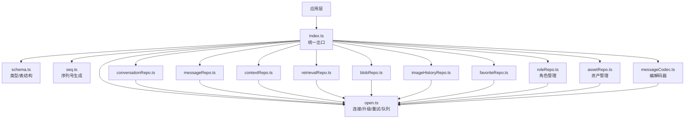

**图表来源**
- [src/db/index.ts:1-123](file://src/db/index.ts#L1-L123)
- [src/db/open.ts:1-165](file://src/db/open.ts#L1-L165)
- [src/db/schema.ts:1-358](file://src/db/schema.ts#L1-L358)

## 核心组件
- 连接与升级：open.ts 提供 getDB/closeDB/withDB/enqueue，集中处理 Safari 内存压力导致的 UnknownError 重连、多标签页升级阻塞处理、按 key 的写操作串行化。
- 数据模型：schema.ts 定义所有实体与索引，约定原文不可变、seq 为浮点数、**新增** updatedAt/syncedAt 用于云同步，**新增** StoredAsset 资产类型。
- 序列号：seq.ts 提供 nextSeq/seqBetween，支持在两条消息之间插入而无需重编号。
- 仓库：每个业务域一个 repo，通过 withDB 访问数据库，通过 enqueue 对同一 key 的写操作串行化。
- **新增** 资产仓库：assetRepo.ts 提供统一的资产管理功能，支持 artifact/markdown/image 三种类型，具备智能去重和引用计数。
- **新增** 角色仓库：roleRepo.ts 提供角色管理的完整 CRUD 操作，包括自动名称提取和高效查询。
- 编解码器：messageCodec.ts 提供消息与存盘格式之间的转换，支持 blob 引用和同步场景。
- BYOC状态管理：state.ts 处理设备ID、云端清单和本地墓碑记录。
- 统一出口：index.ts 聚合导出，屏蔽内部实现细节，便于未来接入服务端同步时仅改此层。

**章节来源**
- [src/db/open.ts:1-165](file://src/db/open.ts#L1-L165)
- [src/db/schema.ts:1-358](file://src/db/schema.ts#L1-L358)
- [src/db/seq.ts:1-25](file://src/db/seq.ts#L1-L25)
- [src/db/index.ts:1-123](file://src/db/index.ts#L1-L123)
- [src/db/assetRepo.ts:1-216](file://src/db/assetRepo.ts#L1-L216)
- [src/db/roleRepo.ts:1-72](file://src/db/roleRepo.ts#L1-L72)
- [src/db/messageCodec.ts:1-219](file://src/db/messageCodec.ts#L1-L219)
- [src/services/byoc/state.ts:1-97](file://src/services/byoc/state.ts#L1-L97)

## 架构总览
整体采用"仓库模式 + 内容寻址存储 + 索引化检索 + BYOC同步"的分层架构：
- 上层只依赖 index.ts 暴露的 API
- 仓库负责领域逻辑与事务编排
- open.ts 提供连接、重试、串行化
- schema.ts 约束数据结构与索引
- retrievalRepo 提供离线关键词检索
- blobRepo 提供去重与引用计数，避免重复存储
- **新增** assetRepo 提供统一的资产管理，支持多种资产类型的统一操作
- **新增** roleRepo 提供角色管理系统，支持用户自定义系统提示词预设
- BYOC同步系统提供增量双向同步和墓碑跟踪

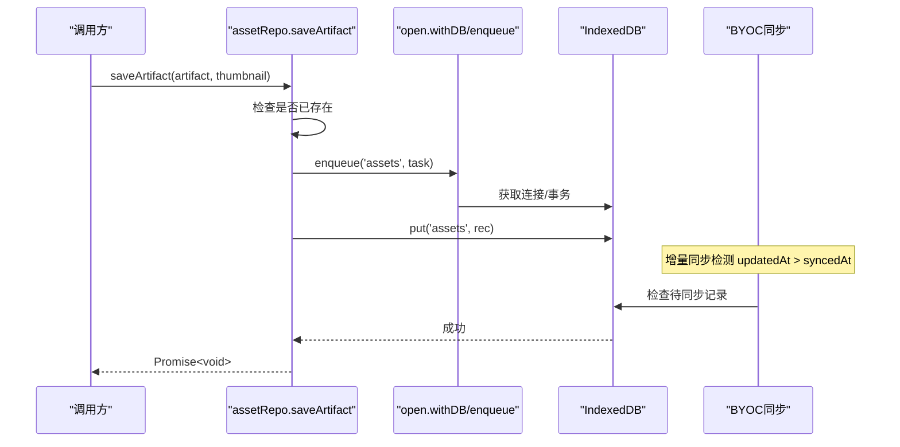

**图表来源**
- [src/db/assetRepo.ts:102-124](file://src/db/assetRepo.ts#L102-L124)
- [src/db/open.ts:149-164](file://src/db/open.ts#L149-L164)
- [src/services/byoc/incrementalSync.ts:316-335](file://src/services/byoc/incrementalSync.ts#L316-L335)

## 详细组件分析

### 数据库连接与初始化（open.ts）
- 连接管理：getDB 单例缓存 Promise；closeDB 安全关闭；withDB 失败自动重连重试一次。
- 升级策略：upgrade 中创建全部对象存储与索引；blocked/blocking/terminated 回调处理多标签页升级冲突与终止清理。
- **新增** 资产索引：assets 对象存储创建 by_createdAt 和 by_kind 索引，支持按时间和类型高效查询。
- **新增** 数据迁移：自动将旧 favoriteArtifacts 数据迁移到新的 assets 系统，保持向后兼容。
- 写入串行化：enqueue 以 key（通常为 convId）为单位排队写操作，避免流式更新交错。

**图表来源**
- [src/db/open.ts:127-138](file://src/db/open.ts#L127-L138)

**章节来源**
- [src/db/open.ts:1-165](file://src/db/open.ts#L1-L165)

### 数据模型与索引（schema.ts）
- 会话 conversations：key=id；索引 by_updatedAt、by_favorite；冗余 messageCount/lastMessageAt/headSeq/lastMessagePreview 用于列表渲染。**新增** syncedAt 字段用于同步标记。
- 消息 messages：key=id；复合索引 by_conv_seq[convId, seq]、by_conv_time[convId, timestamp]；content 支持文本与图片引用。**新增** syncedAt 字段。
- 二进制 blobs：key=blobId；refCount 引用计数；bytes/mime/尺寸等元信息。
- 上下文 contextNodes/contextPlans：key=id；索引 by_conv；节点支持层级压缩与失效重建。
- 检索 retrieval：key=messageId；索引 by_conv、terms（multiEntry）。
- 图片历史 imageHistory：key=id；索引 by_timestamp。
- 收藏 favoriteArtifacts：key=id；索引 by_favoritedAt。
- **新增** 资产 assets：key=id；索引 by_createdAt、by_kind；StoredAsset 支持 artifact/markdown/image 三种类型，继承 SyncMeta 支持同步。
- **新增** 角色 roles：key=id；索引 by_createdAt；StoredRole 继承 SyncMeta 支持同步。
- 通用 kv：key=key，**新增** BYOC同步状态存储。

**章节来源**
- [src/db/schema.ts:1-358](file://src/db/schema.ts#L1-L358)

### 序列号生成器（seq.ts）
- SEQ_STEP=1000，nextSeq(headSeq) 追加新消息时步进。
- seqBetween(before, after) 计算插入位，取中点；若精度耗尽则退回追加，避免重复键。
- 优势：无需全局重编号，天然支持分支与重新生成。

**图表来源**
- [src/db/seq.ts:9-24](file://src/db/seq.ts#L9-L24)

**章节来源**
- [src/db/seq.ts:1-25](file://src/db/seq.ts#L1-L25)

### 对话记录管理（conversationRepo.ts）
- newConversationId：全局唯一 id，不依赖自增，便于未来同步。
- createConversationRecord：构造初始会话元数据。
- listConversations：读取并排序（按 lastMessageAt）。
- getConversation/putConversation/patchConversation：基本读写与局部更新。**新增** 自动设置 syncedAt=null 标记待同步。
- touchAfterMessage：消息变更后更新冗余字段（计数、headSeq、最后消息时间与预览）。
- deleteConversation/deleteConversations：级联删除消息、上下文节点、检索索引与会话本身。

**章节来源**
- [src/db/conversationRepo.ts:1-109](file://src/db/conversationRepo.ts#L1-L109)

### 消息存储（messageRepo.ts）
- 查询：getAllMessages/getRecentMessages/getMessagesBefore/getMessageRange/countMessages/getHeadSeq/getMessageSeq。
- 写入：appendMessage（追加）、insertMessageAfter（插入到某条之后）、putMessage（覆盖写，保留原 seq）、putMessages（批量）、markCompressed（标记压缩）。
- 删除：deleteMessage/deleteConversationMessages（同时释放引用、清理索引）。
- 关键点：
  - 所有写经 enqueue(convId) 串行化，避免流式输出交错。
  - 覆盖写时对比新旧内容的图片引用，递减不再使用的引用计数，防止 GC 泄漏。
  - 每次写入后更新检索索引。
  - **新增** 支持同步场景的 toStored 转换，保留 syncedAt 字段。

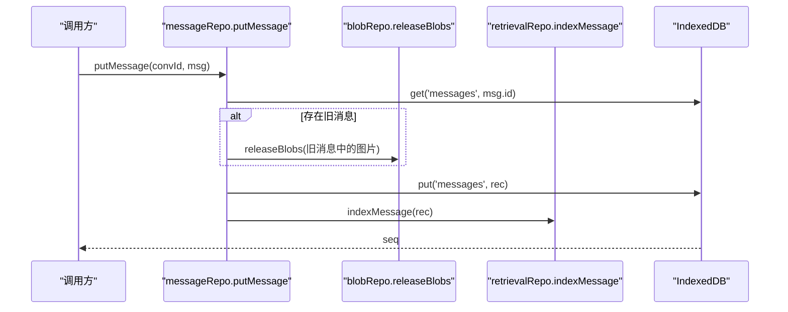

**图表来源**
- [src/db/messageRepo.ts:173-201](file://src/db/messageRepo.ts#L173-L201)
- [src/db/retrievalRepo.ts:54-64](file://src/db/retrievalRepo.ts#L54-L64)

**章节来源**
- [src/db/messageRepo.ts:1-276](file://src/db/messageRepo.ts#L1-L276)

### **新增** 资产管理系统（assetRepo.ts）
- **核心功能**：提供统一的资产管理，支持 artifact、markdown、image 三种类型
- **智能去重**：artifact 基于 artifact.id 去重，image 基于源历史 id 去重，markdown 基于 sourceRef 去重
- **引用计数**：自动管理缩略图和图片的 blob 引用计数，避免存储空间浪费
- **高效查询**：listAssets/listStoredAssets 使用 by_createdAt 索引按入库时间排序
- **数据转换**：fromStored/toStoredIds 在 UI 形态和存储形态间转换，处理 blob 引用
- **队列管理**：使用 'assets' 队列串行化资产相关写操作
- **同步支持**：StoredAsset 继承 SyncMeta，支持 BYOC 增量同步

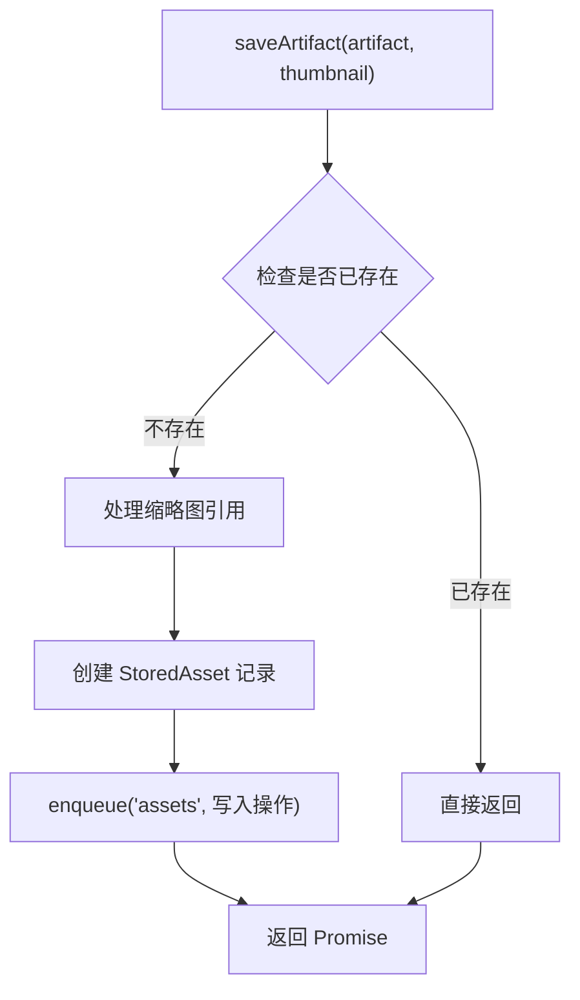

**图表来源**
- [src/db/assetRepo.ts:102-124](file://src/db/assetRepo.ts#L102-L124)

**章节来源**
- [src/db/assetRepo.ts:1-216](file://src/db/assetRepo.ts#L1-L216)

### **新增** 角色管理（roleRepo.ts）
- **核心功能**：提供用户自定义系统提示词预设的完整 CRUD 操作
- **自动名称提取**：createRole 函数从系统提示词首行智能提取角色名称，截断到 20 字符
- **高效查询**：listRoles/listStoredRoles 使用 by_createdAt 索引按创建时间升序排列
- **数据验证**：空提示词拒绝创建，确保数据质量
- **同步支持**：StoredRole 继承 SyncMeta，支持 BYOC 增量同步
- **队列管理**：使用 'roles' 队列串行化角色相关写操作

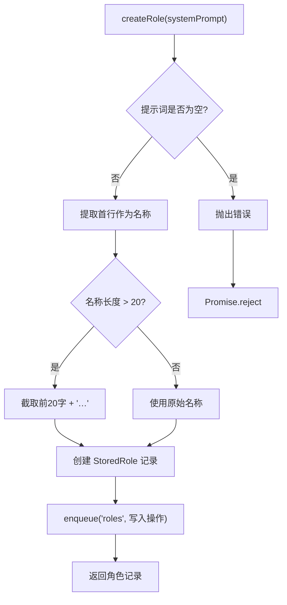

**图表来源**
- [src/db/roleRepo.ts:48-67](file://src/db/roleRepo.ts#L48-L67)

**章节来源**
- [src/db/roleRepo.ts:1-72](file://src/db/roleRepo.ts#L1-L72)

### 消息编解码器（messageCodec.ts）
- **新增** 功能：提供 Message 与 StoredMessage 之间的转换
- 支持 blob 引用：将 data URL 转换为 blob 引用，减少存储空间
- 同步支持：toStored 函数接受 syncedAt 参数，保持同步状态
- 图片处理：inlineBlobsForApi 将 blob 引用还原为 data URL 供 API 使用
- 预览生成：toPreview 提取纯文本预览，避免解析复杂内容

**章节来源**
- [src/db/messageCodec.ts:1-219](file://src/db/messageCodec.ts#L1-L219)

### 上下文管理（contextRepo.ts）
- 节点：listNodes/getNode/putNode/updateNodeSummary/markNodeStale/deleteNode。
- 计划：putPlan/listPlans/getLatestPlan。
- 删除：deleteConversationNodes 级联删除节点与计划。
- 设计要点：节点为派生物，可层层收敛；stale 标记允许按需重建而不破坏邻居。

**章节来源**
- [src/db/contextRepo.ts:1-99](file://src/db/contextRepo.ts#L1-L99)

### 收藏管理（favoriteRepo.ts）
- 功能：listFavorites/addFavorite/removeFavorite/renameFavorite。
- 缩略图：以 data URL 或引用形式传入，统一落库为 blob 引用；删除时释放引用。
- 去重：已存在的 artifact 重复添加视为无操作。

**章节来源**
- [src/db/favoriteRepo.ts:1-85](file://src/db/favoriteRepo.ts#L1-L85)

### 图像历史（imageHistoryRepo.ts）
- 目标：记录图像生成历史，支持 http 链接与 base64 data URL。
- 存储策略：http 链接直接保存；data URL 转为 blob 并建立引用计数，避免 localStorage 爆满。
- 队列：与 blob 引用计数读改写共用队列，确保一致性。

**章节来源**
- [src/db/imageHistoryRepo.ts:1-33](file://src/db/imageHistoryRepo.ts#L1-L33)

### 检索存储（retrievalRepo.ts）
- tokenize：中文 2-gram、拉丁按空白/标点切分，限制最大词数，过滤短词。
- indexMessage/removeFromIndex/removeConversationFromIndex：维护检索索引。
- searchMessages：按关键词检索，支持限定会话或全局搜索，按命中词数评分排序。

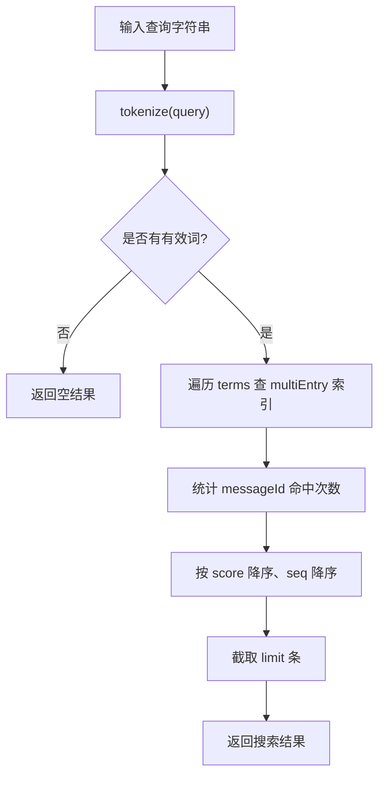

**图表来源**
- [src/db/retrievalRepo.ts:23-43](file://src/db/retrievalRepo.ts#L23-L43)
- [src/db/retrievalRepo.ts:92-128](file://src/db/retrievalRepo.ts#L92-L128)

**章节来源**
- [src/db/retrievalRepo.ts:1-129](file://src/db/retrievalRepo.ts#L1-L129)

### 二进制数据存储（blobRepo.ts）
- 内容寻址：blobId=sha-256，相同内容只存一份。
- 引用计数：retainBlobs/releaseBlobs 按出现次数增减，归零不立即删除，交由 sweepOrphanBlobs 批量清理。
- 辅助：readDimensions 提取图片尺寸（可选），getBlobStats 统计占用。

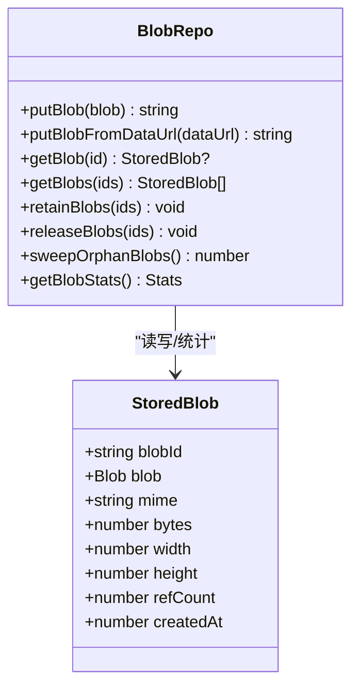

**图表来源**
- [src/db/schema.ts:197-207](file://src/db/schema.ts#L197-L207)
- [src/db/blobRepo.ts:40-168](file://src/db/blobRepo.ts#L40-L168)

**章节来源**
- [src/db/blobRepo.ts:1-168](file://src/db/blobRepo.ts#L1-L168)

## 资产管理系统

### 资产仓库（assetRepo.ts）
**新增** 统一的资产管理模块，支持三种资产类型：
- **Artifact 资产**：HTML 应用代码块，包含标题、描述、代码和创建时间
- **Markdown 资产**：纯文本内容，支持从消息中提取并保存
- **Image 资产**：图片资源，支持多个 URL 和缩略图管理

**核心特性**：
- **智能去重**：不同资产类型采用不同的去重策略，避免重复存储
- **引用计数**：自动管理缩略图和图片的 blob 引用计数
- **数据迁移**：自动将旧收藏数据迁移到新的资产系统
- **同步支持**：完整的 BYOC 增量同步支持

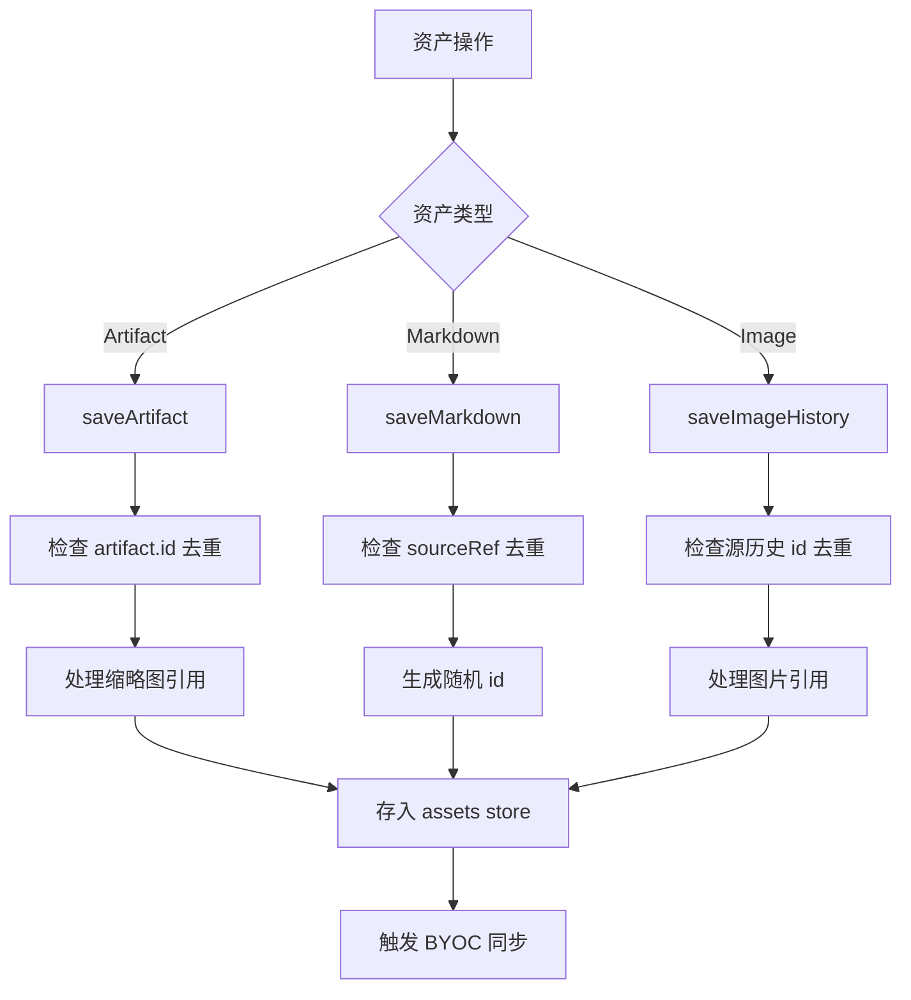

**图表来源**
- [src/db/assetRepo.ts:102-189](file://src/db/assetRepo.ts#L102-L189)

**章节来源**
- [src/db/assetRepo.ts:1-216](file://src/db/assetRepo.ts#L1-L216)

### 资产 Hook（useAssets.ts）
**新增** React Hook 提供资产状态管理和 UI 交互：
- **状态管理**：本地 state 与 IndexedDB 分离，先更新 state 再异步落库
- **防抖同步**：资产变更后 3 秒触发一次 BYOC 同步，避免频繁网络请求
- **UI 集成**：提供保存、删除、重命名、切换等操作接口
- **实时刷新**：操作完成后自动刷新资产列表

**章节来源**
- [src/hooks/useAssets.ts:1-175](file://src/hooks/useAssets.ts#L1-L175)

## BYOC同步系统

### 同步状态管理（state.ts）
**新增** BYOC同步的核心状态管理模块：
- 设备标识：getDeviceId 生成并持久化设备唯一ID
- 云端清单：getCloudManifest/setCloudManifest 管理云端同步清单缓存
- 本地墓碑：getLocalTombstones/setLocalTombstones 跟踪本地删除操作
- 同步时间：getLastSyncAt/setLastSyncAt 记录最近同步时刻
- 待同步统计：countPending 计算需要同步的数据量

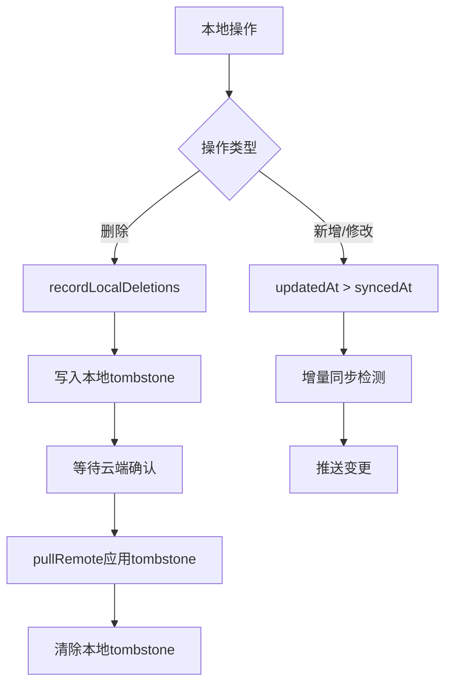

**图表来源**
- [src/services/byoc/state.ts:43-96](file://src/services/byoc/state.ts#L43-L96)

**章节来源**
- [src/services/byoc/state.ts:1-97](file://src/services/byoc/state.ts#L1-L97)

### 增量同步引擎（incrementalSync.ts）
**新增** 双向增量同步引擎，实现数据一致性保证：
- 推送流程：pushLocal 检测本地变更，上传会话、消息、blob、节点、**角色**、**资产**
- 拉取流程：pullRemote 应用云端变更，处理墓碑删除
- 墓碑机制：tombstones 记录删除操作，确保跨设备一致性
- 冲突解决：last-write-wins 策略，基于 updatedAt 比较
- 资源管理：智能 blob 引用计数，避免重复传输
- **新增** 资产同步：支持资产的创建、删除、更新操作的跨设备同步
- **新增** 数据迁移：自动将旧收藏数据转换为资产格式进行同步

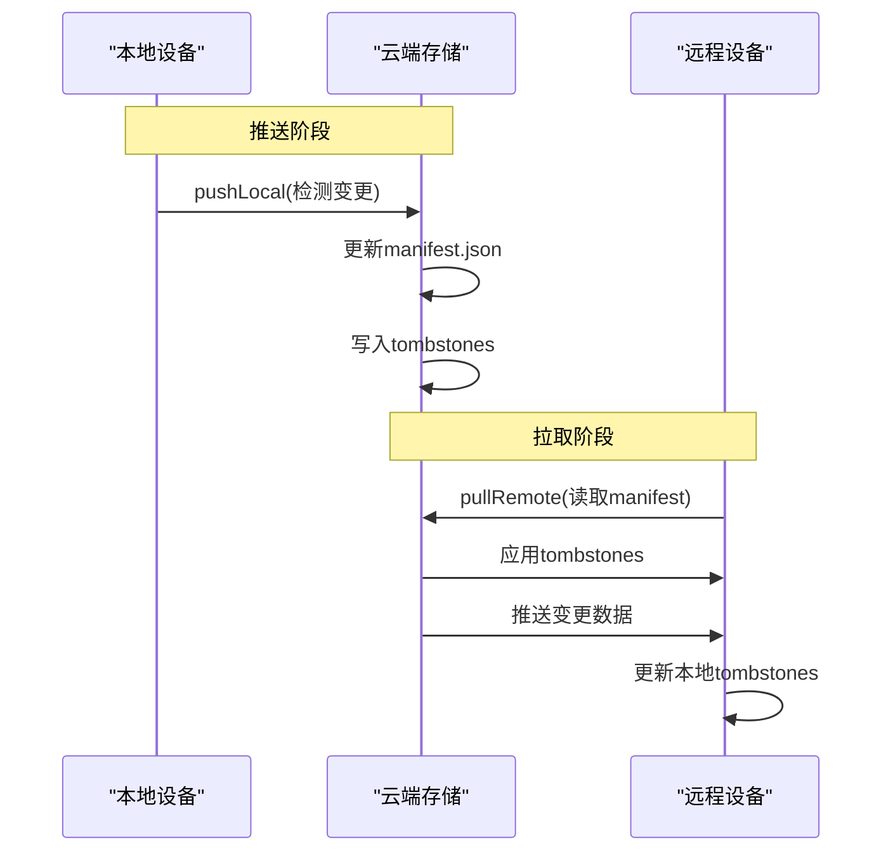

**图表来源**
- [src/services/byoc/incrementalSync.ts:139-323](file://src/services/byoc/incrementalSync.ts#L139-L323)
- [src/services/byoc/incrementalSync.ts:364-509](file://src/services/byoc/incrementalSync.ts#L364-L509)

**章节来源**
- [src/services/byoc/incrementalSync.ts:1-717](file://src/services/byoc/incrementalSync.ts#L1-L717)

### 同步类型定义（types.ts）
**新增** BYOC同步的类型定义：
- ByocConfig：同步配置，支持多种云服务提供商
- SyncManifestV1：云端同步清单，包含设备ID、更新时间、会话映射和墓碑记录
- SyncResult：同步结果统计，包含推送/拉取的各类数据量
- ProgressFn：进度回调函数类型

**章节来源**
- [src/services/byoc/types.ts:1-99](file://src/services/byoc/types.ts#L1-L99)

## 依赖关系分析
- 统一入口 index.ts 将 schema、seq、open 与各仓库导出，屏蔽内部模块耦合。
- 仓库间依赖：
  - conversationRepo 依赖 messageRepo、contextRepo、retrievalRepo 做级联删除。
  - messageRepo 依赖 seq、messageCodec、blobRepo、retrievalRepo。
  - imageHistoryRepo 依赖 blobRepo、messageCodec。
  - favoriteRepo 依赖 blobRepo、messageCodec。
  - **新增** assetRepo 依赖 blobRepo、messageCodec，被 useAssets hook 使用。
  - **新增** roleRepo 依赖 open、schema，独立于其他仓库。
  - retrievalRepo 依赖 open 与 schema。
  - blobRepo 独立，被多个仓库复用。
- **新增** BYOC同步依赖：
  - incrementalSync 依赖所有仓库进行数据同步，包括新的 assetRepo 和 roleRepo。
  - state 依赖 open 和 db 接口进行状态管理。
  - types 定义同步相关的数据结构。

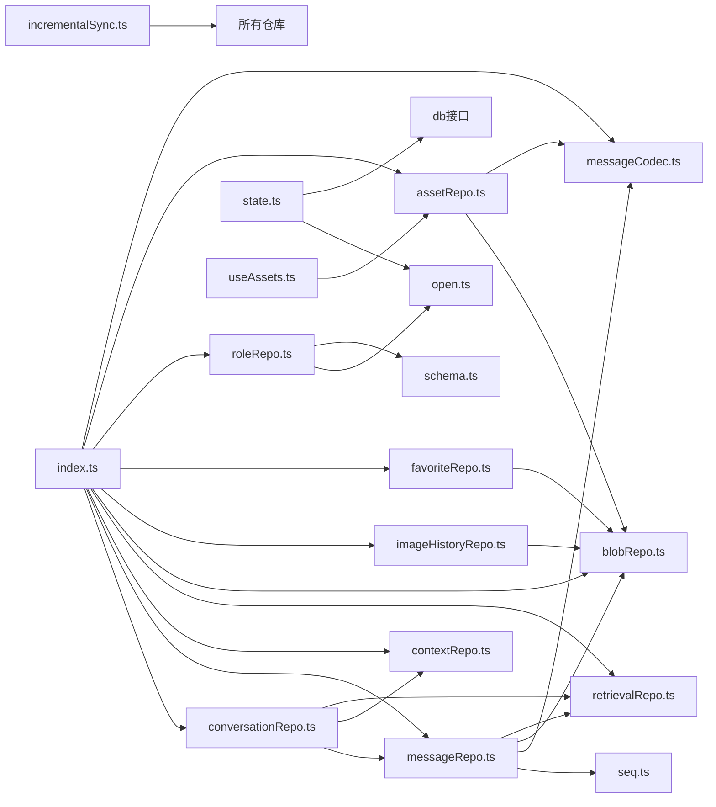

**图表来源**
- [src/db/index.ts:1-123](file://src/db/index.ts#L1-L123)
- [src/services/byoc/incrementalSync.ts:21-59](file://src/services/byoc/incrementalSync.ts#L21-L59)
- [src/services/byoc/state.ts:7-8](file://src/services/byoc/state.ts#L7-L8)

**章节来源**
- [src/db/index.ts:1-123](file://src/db/index.ts#L1-L123)

## 性能考量
- 索引设计
  - messages 使用复合索引 by_conv_seq 进行高效范围查询与分页。
  - retrieval 使用 multiEntry 索引 terms 支持关键词快速匹配。
  - conversations 冗余字段减少跨 store 读取，提升列表渲染性能。
  - **新增** assets 使用 by_createdAt 和 by_kind 索引优化资产列表查询性能。
  - **新增** roles 使用 by_createdAt 索引优化角色列表查询性能。
- 写入串行化
  - 通过 enqueue 按 convId 串行化写操作，避免流式输出期间的并发写竞争。
  - **新增** assetRepo 使用独立的 'assets' 队列，避免与其他仓库操作冲突。
  - **新增** roleRepo 使用独立的 'roles' 队列，避免与其他仓库操作冲突。
- 二进制存储
  - 内容寻址去重，降低存储空间；引用计数延迟回收，减少关键路径写放大。
- 查询优化
  - getRecentMessages/getMessagesBefore 使用游标反向扫描，避免全量加载。
  - searchMessages 限制命中数量与词数上限，控制内存与 IO。
- **新增** 同步优化
  - 增量同步仅传输变更数据，减少网络开销
  - 智能 blob 引用计数，避免重复传输
  - 并发限制，防止 S3 请求过多触发限流
  - **新增** 资产同步优化：按创建时间顺序同步，减少索引重建开销
  - **新增** 数据迁移优化：一次性迁移旧收藏数据，避免重复处理

## 故障排查指南
- 连接异常与重试
  - withDB 捕获异常后关闭旧连接并重试一次，适用于 Safari 内存压力导致的 UnknownError。
- 多标签页升级冲突
  - blocked 提示升级被其他标签页阻塞；blocking 主动关闭当前连接让路，下次访问自动重开。
- 队列与事务
  - enqueue 保证同 key 写操作顺序；事务内批量操作使用 tx.done 等待完成。
- 数据一致性
  - 覆盖写消息时按出现次数递减旧图片引用，避免 GC 泄漏。
  - 删除会话时级联清理消息、上下文节点、检索索引与引用。
- **新增** 资产相关问题排查
  - 检查资产去重逻辑是否正确处理不同资产类型
  - 验证 assets store 的 by_createdAt 和 by_kind 索引是否正确创建
  - 监控资产队列是否正常工作，避免写操作冲突
  - 检查资产同步状态，确保 syncedAt 字段正确更新
  - 验证数据迁移过程，确保旧收藏数据正确转换
- **新增** 角色相关问题排查
  - 检查角色名称提取逻辑是否正确处理空行和特殊字符
  - 验证 by_createdAt 索引是否正确创建
  - 监控角色队列是否正常工作，避免写操作冲突
  - 检查角色同步状态，确保 syncedAt 字段正确更新
- **新增** 同步问题排查
  - 检查本地 tombstones 是否正确记录删除操作
  - 验证云端 manifest 与实际数据的一致性
  - 监控 countPending 统计，确保同步队列正常推进
  - 检查设备ID生成和云端清单缓存状态
  - **新增** 检查资产同步的 blob 引用计数是否正确更新

**章节来源**
- [src/db/open.ts:96-107](file://src/db/open.ts#L96-L107)
- [src/db/messageRepo.ts:173-201](file://src/db/messageRepo.ts#L173-L201)
- [src/db/conversationRepo.ts:98-104](file://src/db/conversationRepo.ts#L98-L104)
- [src/db/assetRepo.ts:102-216](file://src/db/assetRepo.ts#L102-L216)
- [src/db/roleRepo.ts:48-71](file://src/db/roleRepo.ts#L48-L71)
- [src/services/byoc/state.ts:75-96](file://src/services/byoc/state.ts#L75-L96)

## 结论
AIShop 的数据层以 IndexedDB 为基础，通过仓库模式清晰划分职责，结合序列化写入、内容寻址存储与索引化检索，实现了高性能、可扩展且易于维护的本地数据方案。**新增的资产管理系统**为用户提供了统一的资产管理功能，支持 artifact、markdown、image 三种类型的统一操作，具备智能去重、引用计数和高效查询能力。**新增的角色仓库**为用户提供了强大的自定义系统提示词预设功能，支持自动名称提取、高效查询和完整的 CRUD 操作。**新增的 BYOC同步系统**通过增量同步和墓碑跟踪机制，确保了多设备间的数据一致性和可靠性，并支持资产数据的跨设备同步。其设计兼顾了流式输出的稳定性、长会话的性能、云同步的可扩展性以及删除操作的跨设备传播能力。

## 附录
- 数据模型概览（ER 风格）
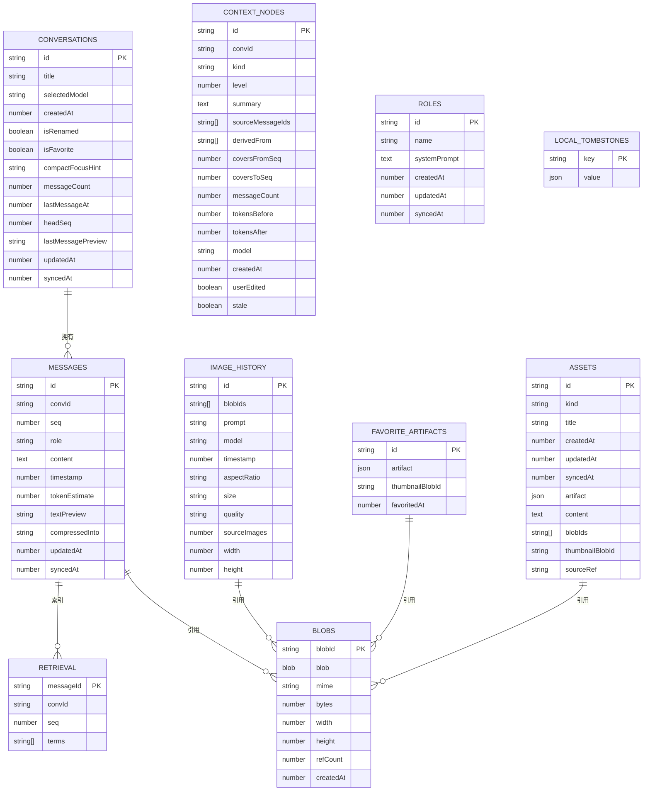

**图表来源**
- [src/db/schema.ts:108-358](file://src/db/schema.ts#L108-L358)
- [src/services/byoc/state.ts:50-54](file://src/services/byoc/state.ts#L50-L54)