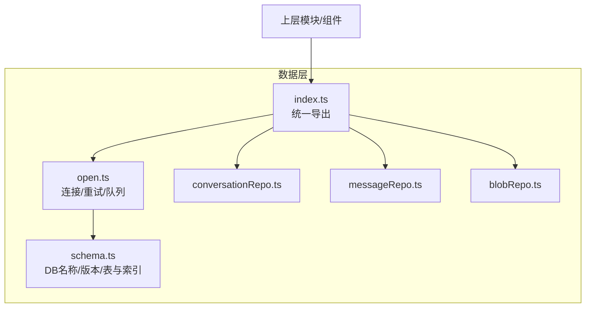
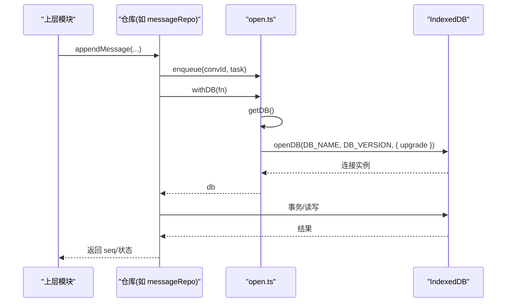
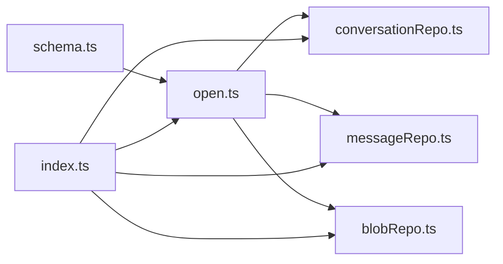

# 数据库连接管理

<cite>
**本文引用的文件**
- [src/db/open.ts](file://src/db/open.ts)
- [src/db/schema.ts](file://src/db/schema.ts)
- [src/db/index.ts](file://src/db/index.ts)
- [src/db/conversationRepo.ts](file://src/db/conversationRepo.ts)
- [src/db/messageRepo.ts](file://src/db/messageRepo.ts)
- [src/db/blobRepo.ts](file://src/db/blobRepo.ts)
- [src/components/settings/DataSettings.tsx](file://src/components/settings/DataSettings.tsx)
</cite>

## 目录
1. [简介](#简介)
2. [项目结构](#项目结构)
3. [核心组件](#核心组件)
4. [架构总览](#架构总览)
5. [详细组件分析](#详细组件分析)
6. [依赖关系分析](#依赖关系分析)
7. [性能考量](#性能考量)
8. [故障排查指南](#故障排查指南)
9. [结论](#结论)
10. [附录](#附录)

## 简介
本文件面向 IndexedDB 连接管理的实现与使用，覆盖以下主题：
- 数据库初始化流程：版本管理、表结构定义、索引创建
- open.ts 中的配置选项与连接“池”式复用
- getDB 与 closeDB 的使用方式
- 连接生命周期管理与错误处理机制（重试、阻塞、终止）
- 写入串行化策略（按会话 key 的队列）
- 性能监控与调试工具使用方法

## 项目结构
本项目将数据库相关代码集中在 src/db 目录下，采用“仓库模式”组织：open.ts 负责连接与通用能力，schema.ts 定义数据模型与索引，各 repo 文件封装具体业务表的读写。对外统一从 index.ts 暴露接口。

图表来源
- [src/db/open.ts:1-114](file://src/db/open.ts#L1-L114)
- [src/db/schema.ts:24-282](file://src/db/schema.ts#L24-L282)
- [src/db/index.ts:1-98](file://src/db/index.ts#L1-L98)

章节来源
- [src/db/open.ts:1-114](file://src/db/open.ts#L1-L114)
- [src/db/schema.ts:24-282](file://src/db/schema.ts#L24-L282)
- [src/db/index.ts:1-98](file://src/db/index.ts#L1-L98)

## 核心组件
- 连接工厂与缓存：create() 通过 idb.openDB 打开数据库，内部维护 dbPromise 单例，避免重复建立连接
- 升级回调：upgrade 中创建所有对象存储与索引，保证 schema 演进
- 连接获取：getDB() 返回已缓存的连接 Promise
- 连接关闭：closeDB() 安全关闭并清理缓存
- 操作包装：withDB() 在失败时自动重开连接并重试一次
- 写入串行化：enqueue(key, task) 按 key 串行化写操作，避免同会话并发写冲突

章节来源
- [src/db/open.ts:14-88](file://src/db/open.ts#L14-L88)
- [src/db/open.ts:90-114](file://src/db/open.ts#L90-L114)

## 架构总览
下图展示了应用对数据库访问的典型路径：上层调用仓库函数 → withDB 获取连接 → 执行事务 → 必要时触发重试或队列串行化。

图表来源
- [src/db/open.ts:60-88](file://src/db/open.ts#L60-L88)
- [src/db/messageRepo.ts:130-137](file://src/db/messageRepo.ts#L130-L137)

## 详细组件分析

### 数据库初始化与版本管理
- 数据库名与版本：DB_NAME = 'aishop'，DB_VERSION = 1
- 升级回调：在首次安装或版本变化时执行，创建全部对象存储与索引
- 阻塞处理：
  - blocked：其他标签页持有旧版本连接导致升级被阻塞，记录警告
  - blocking：当前标签页阻止了别处的升级，主动关闭自身连接以让路
  - terminated：连接被意外终止时清理缓存，便于下次重建

章节来源
- [src/db/schema.ts:24-25](file://src/db/schema.ts#L24-L25)
- [src/db/open.ts:14-58](file://src/db/open.ts#L14-L58)

### 表结构与索引设计
- conversations：主键 id；索引 by_updatedAt、by_favorite
- messages：主键 id；复合索引 by_conv_seq([convId, seq])、by_conv_time([convId, timestamp])
- blobs：主键 blobId
- contextNodes：主键 id；索引 by_conv
- contextPlans：主键 id；索引 by_conv
- retrieval：主键 messageId；索引 by_conv、terms(multiEntry)
- imageHistory：主键 id；索引 by_timestamp
- favoriteArtifacts：主键 id；索引 by_favoritedAt
- kv：主键 key

章节来源
- [src/db/open.ts:16-45](file://src/db/open.ts#L16-L45)
- [src/db/schema.ts:221-282](file://src/db/schema.ts#L221-L282)

### 连接获取与关闭
- getDB()：若不存在则创建并缓存连接 Promise，后续调用直接复用
- closeDB()：安全关闭连接并清空缓存，异常情况下忽略“已关闭”的错误

章节来源
- [src/db/open.ts:60-74](file://src/db/open.ts#L60-L74)

### 错误处理与重试策略
- withDB()：包裹任意数据库操作，捕获异常后关闭连接并重试一次
- 适用场景：Safari 内存压力下偶发 UnknownError、AbortError 等导致的连接失效

章节来源
- [src/db/open.ts:76-88](file://src/db/open.ts#L76-L88)

### 写入串行化（连接“池”式复用 + 队列）
- 连接复用：dbPromise 作为全局单例，避免频繁创建连接
- 写入队列：enqueue(key, task) 将同一 key（通常为 convId）的写任务排队串行执行，前一个失败不会阻断后续任务，并在完成后清理队列条目防止内存增长

章节来源
- [src/db/open.ts:90-114](file://src/db/open.ts#L90-L114)

### 典型使用示例（仓库层）
- 会话列表读取：listConversations 通过 withDB 读取 conversations 并按 lastMessageAt 排序
- 消息追加：appendMessage 先计算下一个 seq，再写入 messages 并建立检索索引
- 批量写入：putMessages 在同一事务中批量 put，减少事务开销

章节来源
- [src/db/conversationRepo.ts:36-39](file://src/db/conversationRepo.ts#L36-L39)
- [src/db/messageRepo.ts:130-137](file://src/db/messageRepo.ts#L130-L137)
- [src/db/messageRepo.ts:205-219](file://src/db/messageRepo.ts#L205-L219)

### 连接生命周期与事件
- 升级阶段：upgrade 中完成建表与索引
- 阻塞阶段：blocked/blocking 提供跨标签页升级协调
- 终止阶段：terminated 清理连接缓存，确保下次可重新打开

章节来源
- [src/db/open.ts:46-57](file://src/db/open.ts#L46-L57)

## 依赖关系分析
- open.ts 依赖 schema.ts 提供的 DB_NAME、DB_VERSION 与类型 AiShopDB
- 各仓库依赖 open.ts 的 withDB/enqueue/getDB/closeDB
- index.ts 统一导出 schema、seq、连接函数与各仓库 API

图表来源
- [src/db/open.ts:1-114](file://src/db/open.ts#L1-L114)
- [src/db/schema.ts:24-282](file://src/db/schema.ts#L24-L282)
- [src/db/index.ts:1-98](file://src/db/index.ts#L1-L98)

章节来源
- [src/db/open.ts:1-114](file://src/db/open.ts#L1-L114)
- [src/db/schema.ts:24-282](file://src/db/schema.ts#L24-L282)
- [src/db/index.ts:1-98](file://src/db/index.ts#L1-L98)

## 性能考量
- 连接复用：通过 dbPromise 避免重复创建连接，降低握手与升级成本
- 写入串行化：按会话 key 串行化写操作，避免流式输出期间密集更新互相穿插
- 索引优化：
  - messages 使用复合索引 by_conv_seq 支持高效范围查询与分页
  - retrieval 使用 multiEntry 索引 terms 支持关键词检索
- 事务粒度：批量写入尽量合并到单一事务，减少事务开销
- 冗余字段：conversations 中冗余 messageCount、lastMessageAt、headSeq 等，使列表渲染无需读取 messages store，提升长历史下的响应速度

章节来源
- [src/db/open.ts:90-114](file://src/db/open.ts#L90-L114)
- [src/db/messageRepo.ts:40-79](file://src/db/messageRepo.ts#L40-L79)
- [src/db/schema.ts:221-282](file://src/db/schema.ts#L221-L282)
- [src/db/conversationRepo.ts:4-6](file://src/db/conversationRepo.ts#L4-L6)

## 故障排查指南
- 常见问题定位
  - 升级被阻塞：检查是否有其他标签页持有旧版本连接，等待其释放或主动关闭
  - 连接中断：withDB 会自动重试一次；若仍失败，检查浏览器环境或存储空间是否不足
  - 写入乱序：确认写操作是否通过 enqueue 按会话 key 串行化
- 日志与线索
  - 升级阻塞时会输出警告日志，便于定位多标签页竞争
  - 重试时会输出警告日志，包含错误信息，便于追踪失败原因
- 建议实践
  - 在关键写路径使用 enqueue 包裹，避免并发写冲突
  - 对读多写少的列表使用 withDB 直接读取，减少不必要的队列开销
  - 定期清理孤立 blob，避免存储空间膨胀

章节来源
- [src/db/open.ts:46-57](file://src/db/open.ts#L46-L57)
- [src/db/open.ts:76-88](file://src/db/open.ts#L76-L88)

## 结论
该实现通过单例连接、升级回调、阻塞协调、自动重试与按 key 的写入串行化，提供了稳定高效的 IndexedDB 访问层。配合合理的索引设计与冗余字段，兼顾了长历史会话的性能与一致性。上层只需通过仓库 API 进行读写，无需关心底层连接细节。

## 附录

### getDB 与 closeDB 使用要点
- getDB()
  - 用途：获取已缓存的数据库连接 Promise
  - 注意：首次调用会触发升级；后续调用直接复用
- closeDB()
  - 用途：安全关闭连接并清理缓存
  - 注意：异常时忽略“已关闭”错误；适用于需要显式释放资源的场景

章节来源
- [src/db/open.ts:60-74](file://src/db/open.ts#L60-L74)

### 连接重试与超时
- 重试：withDB 在捕获异常后关闭连接并重试一次
- 超时：当前未实现显式超时控制；如需超时保护，可在上层为 withDB 调用添加超时包装

章节来源
- [src/db/open.ts:76-88](file://src/db/open.ts#L76-L88)

### 性能监控与调试工具
- 存储用量与统计
  - DataSettings 组件展示已使用空间、配额、图片数量与孤立字节数，可用于评估存储压力与是否需要清理
- 调试建议
  - 关注控制台中的 [db] 前缀日志，用于定位升级阻塞与重试情况
  - 结合浏览器开发者工具的 Application > IndexedDB 查看对象存储与索引使用情况

章节来源
- [src/components/settings/DataSettings.tsx:108-140](file://src/components/settings/DataSettings.tsx#L108-L140)