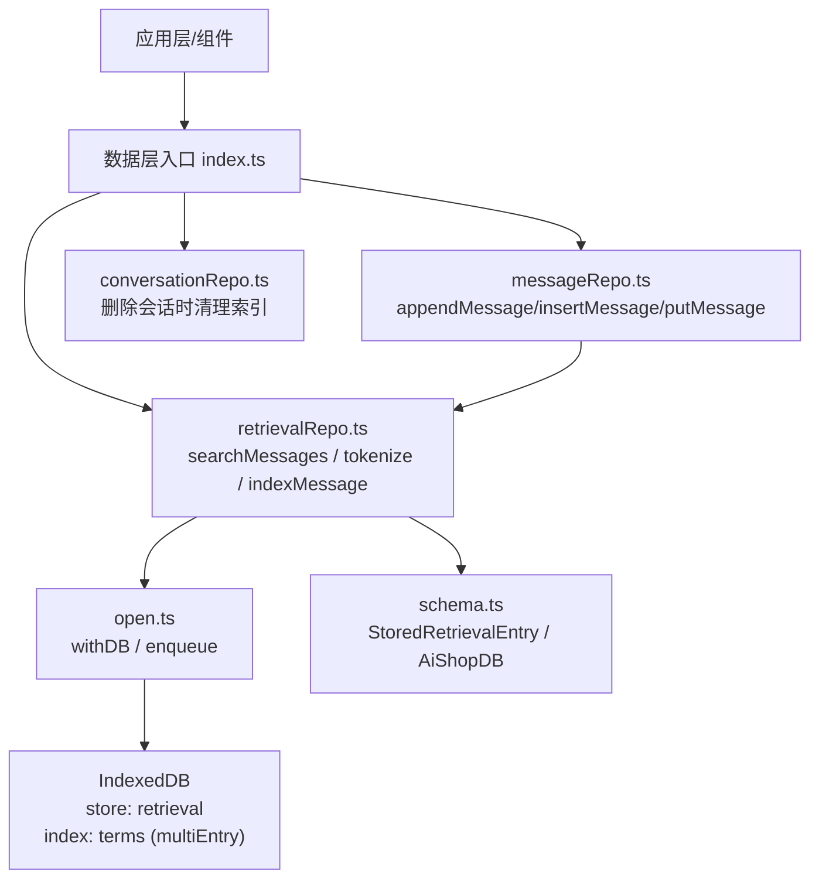
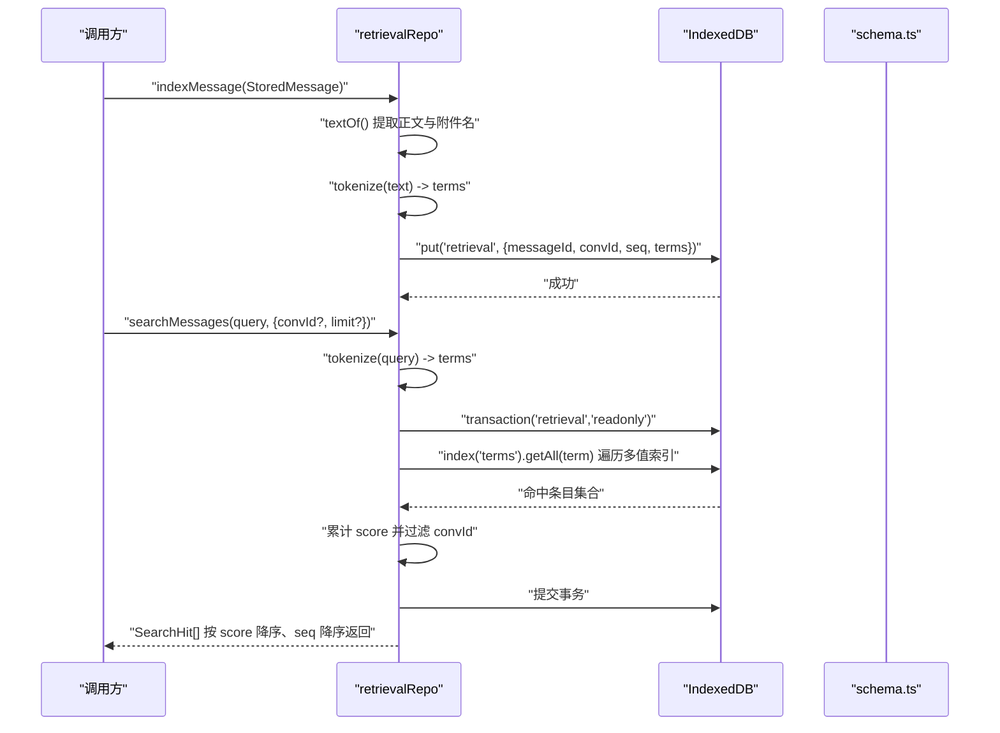
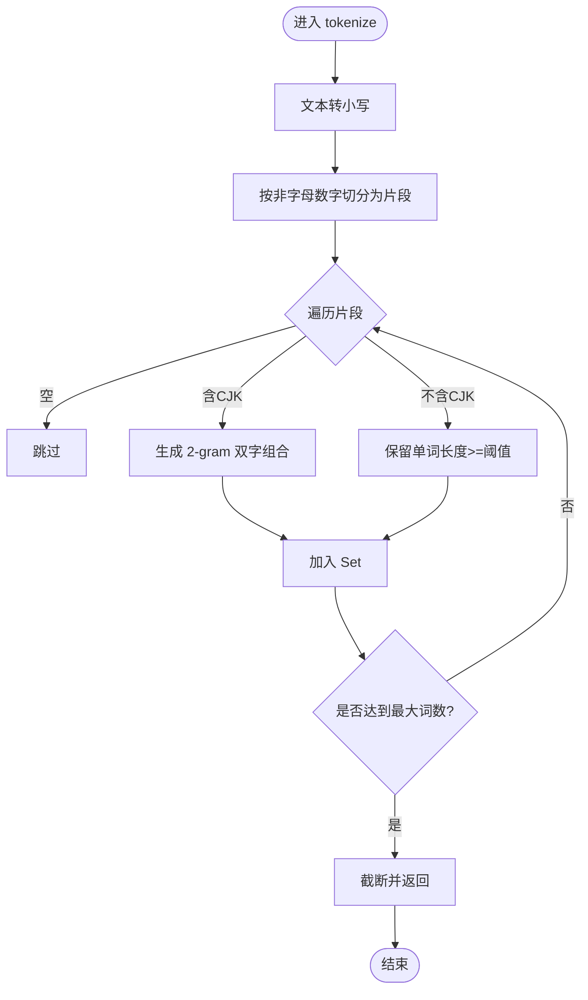
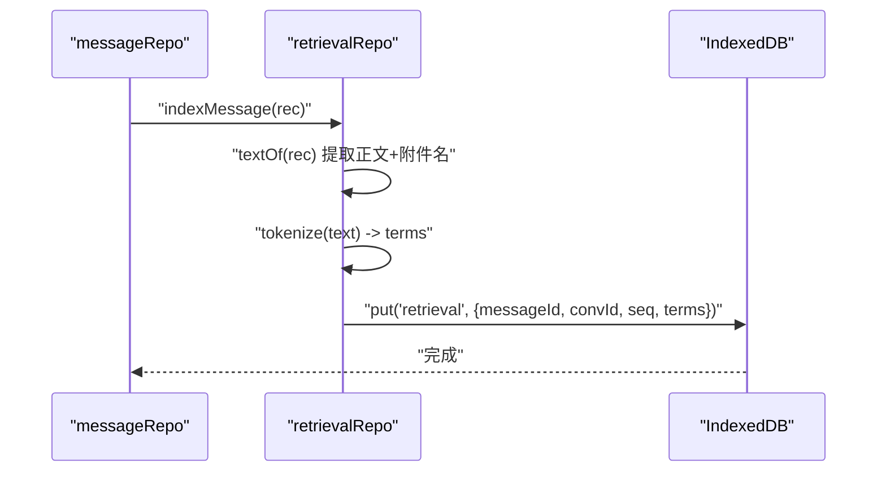
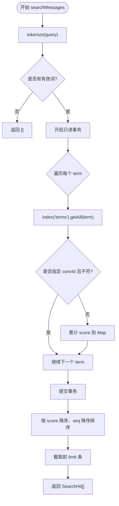
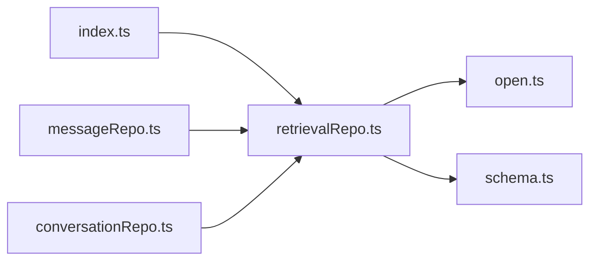

# 检索仓库

<cite>
**本文引用的文件**
- [retrievalRepo.ts](file://src/db/retrievalRepo.ts)
- [open.ts](file://src/db/open.ts)
- [schema.ts](file://src/db/schema.ts)
- [index.ts](file://src/db/index.ts)
- [messageRepo.ts](file://src/db/messageRepo.ts)
- [conversationRepo.ts](file://src/db/conversationRepo.ts)
</cite>

## 目录
1. [简介](#简介)
2. [项目结构](#项目结构)
3. [核心组件](#核心组件)
4. [架构总览](#架构总览)
5. [详细组件分析](#详细组件分析)
6. [依赖关系分析](#依赖关系分析)
7. [性能考量](#性能考量)
8. [故障排查指南](#故障排查指南)
9. [结论](#结论)
10. [附录：查询接口与使用示例](#附录：查询接口与使用示例)

## 简介
本仓库实现了一套基于 IndexedDB 的本地全文检索能力，用于在聊天记录中快速定位关键词。核心包括：
- 文本分词函数 tokenize，支持中文 2-gram 与拉丁/数字按空白或标点切分。
- 索引构建流程 indexMessage，将消息内容提取为关键词并写入 retrieval 对象存储。
- 检索函数 searchMessages，按关键词命中数进行相关性排序与评分。
- SearchHit 结果类型定义，包含 messageId、convId、seq、score 等字段。
- 数据库连接与事务封装 withDB，提供失败重试与写操作串行化保障。

该方案当前为离线关键词检索，未来可扩展 embedding 字段以支持语义检索，无需迁移 schema。

## 项目结构
检索相关代码集中在 src/db 下：
- retrievalRepo.ts：分词、索引构建、删除、检索的核心逻辑。
- open.ts：IndexedDB 连接管理、withDB 封装、按 key 的写队列串行化。
- schema.ts：数据库表结构与索引定义（含 retrieval 表的 terms 多值索引）。
- index.ts：数据层统一出口，对外暴露 searchMessages、tokenize、SearchHit。
- messageRepo.ts：消息写入时自动调用 indexMessage 构建索引。
- conversationRepo.ts：会话删除时清理对应检索索引。

图表来源
- [retrievalRepo.ts:23-128](file://src/db/retrievalRepo.ts#L23-L128)
- [open.ts:76-88](file://src/db/open.ts#L76-L88)
- [schema.ts:168-180](file://src/db/schema.ts#L168-L180)
- [schema.ts:256-263](file://src/db/schema.ts#L256-L263)
- [messageRepo.ts:130-137](file://src/db/messageRepo.ts#L130-L137)
- [conversationRepo.ts:12-12](file://src/db/conversationRepo.ts#L12-L12)

章节来源
- [retrievalRepo.ts:1-128](file://src/db/retrievalRepo.ts#L1-L128)
- [open.ts:1-115](file://src/db/open.ts#L1-L115)
- [schema.ts:168-180](file://src/db/schema.ts#L168-L180)
- [schema.ts:256-263](file://src/db/schema.ts#L256-L263)
- [index.ts:80-81](file://src/db/index.ts#L80-L81)
- [messageRepo.ts:130-200](file://src/db/messageRepo.ts#L130-L200)
- [conversationRepo.ts:12-12](file://src/db/conversationRepo.ts#L12-L12)

## 核心组件
- 分词器 tokenize：对输入文本进行规范化与小写处理，按字符类别分别切分；中文片段采用 2-gram 生成双字组合，拉丁/数字按非字母数字切分；限制单条最多保留若干词，避免长附件撑爆索引。
- 索引构建 indexMessage：从 StoredMessage 中提取正文与附件名，调用 tokenize 得到 terms，写入 retrieval 对象存储。
- 检索 searchMessages：将查询字符串分词后，遍历每个 term 的多值索引项，累计命中次数作为 score，并按 score 降序、seq 降序排序，返回前 limit 条。
- 结果类型 SearchHit：包含 messageId、convId、seq、score，score 表示命中的查询词数量，用于排序。
- 数据库封装 withDB：统一获取连接、异常时重连重试一次；配合 enqueue 实现同会话写操作串行化，避免流式更新交错。

章节来源
- [retrievalRepo.ts:23-43](file://src/db/retrievalRepo.ts#L23-L43)
- [retrievalRepo.ts:45-64](file://src/db/retrievalRepo.ts#L45-L64)
- [retrievalRepo.ts:79-128](file://src/db/retrievalRepo.ts#L79-L128)
- [open.ts:76-88](file://src/db/open.ts#L76-L88)
- [open.ts:90-114](file://src/db/open.ts#L90-L114)

## 架构总览
检索系统由“索引构建 + 关键词检索”两部分组成，依托 IndexedDB 的 multiEntry 索引加速查询。

图表来源
- [retrievalRepo.ts:54-64](file://src/db/retrievalRepo.ts#L54-L64)
- [retrievalRepo.ts:92-128](file://src/db/retrievalRepo.ts#L92-L128)
- [schema.ts:256-263](file://src/db/schema.ts#L256-L263)

## 详细组件分析

### 文本分词算法 tokenize
- 小写化与分割：按非字母数字切分，兼容 Unicode 字母与数字。
- 中文 2-gram：若片段包含中日韩字符，则生成相邻双字组合；单字也保留。
- 拉丁/数字：长度小于阈值的短词丢弃，避免无意义噪声。
- 上限控制：单条最多保留固定数量的词，防止长附件导致索引膨胀。

图表来源
- [retrievalRepo.ts:23-43](file://src/db/retrievalRepo.ts#L23-L43)

章节来源
- [retrievalRepo.ts:23-43](file://src/db/retrievalRepo.ts#L23-L43)

### 索引构建过程 indexMessage
- 文本提取 textOf：合并消息正文（字符串或多段文本）与附件名称，形成可检索的纯文本。
- 分词与落库：调用 tokenize 得到 terms，写入 retrieval 对象存储，键为 messageId，附带 convId、seq、terms。
- 触发时机：消息追加、插入、覆盖写时均会重建索引，保证一致性。

图表来源
- [retrievalRepo.ts:45-64](file://src/db/retrievalRepo.ts#L45-L64)
- [messageRepo.ts:130-200](file://src/db/messageRepo.ts#L130-L200)

章节来源
- [retrievalRepo.ts:45-64](file://src/db/retrievalRepo.ts#L45-L64)
- [messageRepo.ts:130-200](file://src/db/messageRepo.ts#L130-L200)

### 检索与相关性排序 searchMessages
- 查询分词：将用户查询按相同规则分词。
- 多值索引扫描：对每个 term 通过 terms 索引 getAll 获取所有命中条目。
- 评分机制：每命中一个 term 为该消息 score+1；支持按 convId 过滤，实现会话内搜索或全局搜索。
- 排序策略：先按 score 降序，再按 seq 降序（更晚的消息优先），最后取前 limit 条。

图表来源
- [retrievalRepo.ts:92-128](file://src/db/retrievalRepo.ts#L92-L128)

章节来源
- [retrievalRepo.ts:92-128](file://src/db/retrievalRepo.ts#L92-L128)

### SearchHit 类型与结果数据结构
- messageId：消息唯一标识。
- convId：所属会话标识。
- seq：浮点排序键，用于时间顺序比较。
- score：命中的查询词数量，用于相关性排序。

章节来源
- [retrievalRepo.ts:79-85](file://src/db/retrievalRepo.ts#L79-L85)

### 索引维护与一致性
- 新增/修改消息：在 appendMessage、insertMessageAfter、putMessage 中调用 indexMessage 重建索引。
- 删除消息：removeFromIndex 删除对应记录。
- 删除会话：removeConversationFromIndex 批量删除该会话的所有索引项。

章节来源
- [retrievalRepo.ts:66-77](file://src/db/retrievalRepo.ts#L66-L77)
- [messageRepo.ts:130-200](file://src/db/messageRepo.ts#L130-L200)
- [conversationRepo.ts:12-12](file://src/db/conversationRepo.ts#L12-L12)

## 依赖关系分析
- retrievalRepo 依赖 open.ts 的 withDB 进行数据库访问与错误恢复。
- retrievalRepo 依赖 schema.ts 的类型定义与对象存储/索引配置。
- messageRepo 在消息写入路径中集成索引构建，确保数据一致。
- conversationRepo 在会话删除时清理索引，避免脏数据。
- index.ts 统一导出检索 API，屏蔽内部实现细节。

图表来源
- [index.ts:80-81](file://src/db/index.ts#L80-L81)
- [retrievalRepo.ts:9-10](file://src/db/retrievalRepo.ts#L9-L10)
- [messageRepo.ts:17-17](file://src/db/messageRepo.ts#L17-L17)
- [conversationRepo.ts:12-12](file://src/db/conversationRepo.ts#L12-L12)

章节来源
- [index.ts:1-98](file://src/db/index.ts#L1-L98)
- [retrievalRepo.ts:1-128](file://src/db/retrievalRepo.ts#L1-L128)
- [open.ts:1-115](file://src/db/open.ts#L1-L115)
- [schema.ts:168-180](file://src/db/schema.ts#L168-L180)
- [messageRepo.ts:130-200](file://src/db/messageRepo.ts#L130-L200)
- [conversationRepo.ts:12-12](file://src/db/conversationRepo.ts#L12-L12)

## 性能考量
- 索引设计：retrieval 表使用 terms 多值索引，同一 term 可命中多条消息，提升关键词检索效率。
- 分词优化：限制单条最大词数，避免长附件导致索引过大；丢弃过短词减少噪声。
- 查询优化：使用只读事务与索引 getAll，避免全表扫描；支持按 convId 过滤缩小范围。
- 写入串行化：通过 enqueue 对同一会话的写操作排队，避免流式输出期间的密集更新互相穿插。
- 连接健壮性：withDB 在失败时自动关闭并重试一次，提高稳定性。

[本节为通用性能建议，不直接分析具体文件]

## 故障排查指南
- 连接异常：withDB 捕获异常后关闭连接并重试，适用于 Safari 内存压力导致的 UnknownError。
- 会话阻塞：升级被其他标签页阻塞时会提示，等待释放后自动重开。
- 索引不一致：确保消息写入路径始终调用 indexMessage；删除会话时调用 removeConversationFromIndex。
- 查询为空：检查 query 是否被分词为有效词；确认 retrieval 表中是否存在对应 terms。

章节来源
- [open.ts:76-88](file://src/db/open.ts#L76-L88)
- [open.ts:46-57](file://src/db/open.ts#L46-L57)
- [retrievalRepo.ts:66-77](file://src/db/retrievalRepo.ts#L66-L77)

## 结论
本检索模块以轻量、离线的关键词检索为核心，通过合理的分词策略与 IndexedDB 多值索引，实现了高效的消息定位能力。其评分与排序简单直观，易于扩展与维护。未来可在现有 schema 上增加 embedding 字段，平滑过渡到语义检索。

[本节为总结性内容，不直接分析具体文件]

## 附录：查询接口与使用示例
- 公开 API（通过数据层入口导出）：
  - searchMessages(query, opts): 执行关键词检索，返回 SearchHit[]。
  - tokenize(text): 对文本进行分词，返回词数组。
  - SearchHit 类型：包含 messageId、convId、seq、score。

- 使用示例（概念性说明）：
  - 会话内检索：传入 convId 限定范围，适合在当前对话中查找历史消息。
  - 全局检索：不传 convId，跨会话搜索，适合全局定位关键词。
  - 限制结果数量：通过 limit 参数控制返回条数，默认值为 20。

- 索引构建时机：
  - 消息追加、插入、覆盖写时自动构建索引。
  - 删除消息或会话时同步清理索引。

章节来源
- [index.ts:80-81](file://src/db/index.ts#L80-L81)
- [retrievalRepo.ts:92-128](file://src/db/retrievalRepo.ts#L92-L128)
- [retrievalRepo.ts:23-43](file://src/db/retrievalRepo.ts#L23-L43)
- [retrievalRepo.ts:79-85](file://src/db/retrievalRepo.ts#L79-L85)
- [messageRepo.ts:130-200](file://src/db/messageRepo.ts#L130-L200)
- [conversationRepo.ts:12-12](file://src/db/conversationRepo.ts#L12-L12)