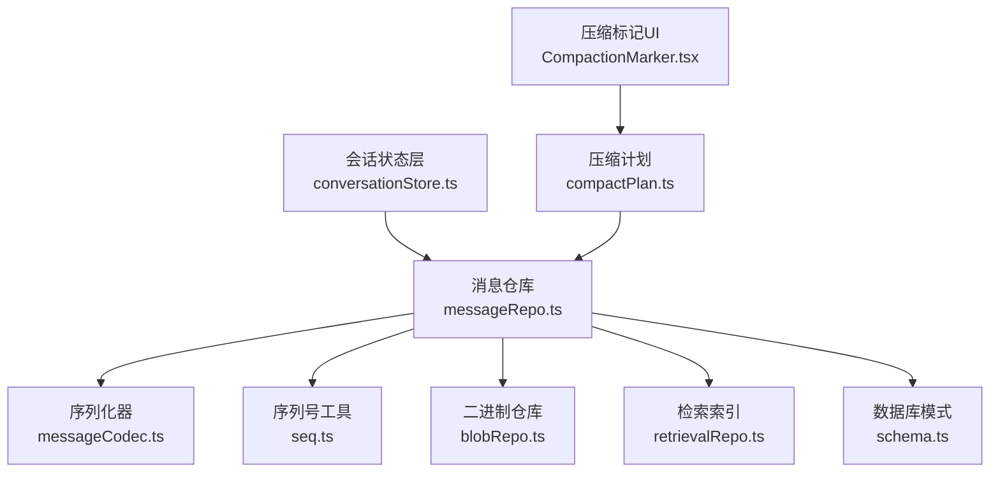
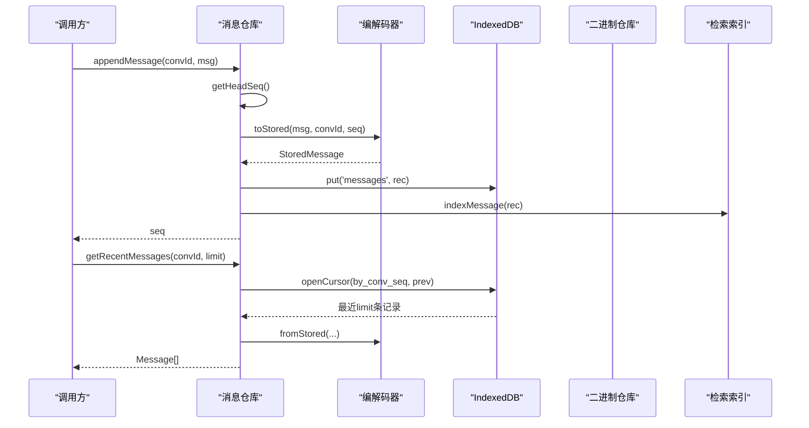
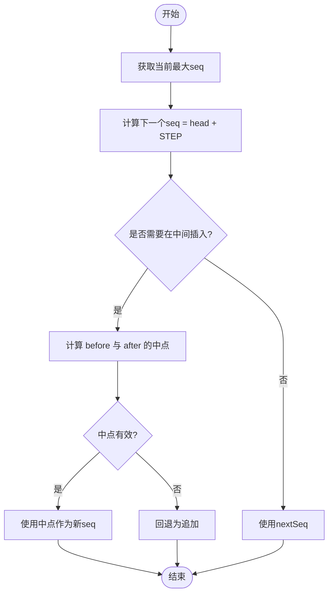
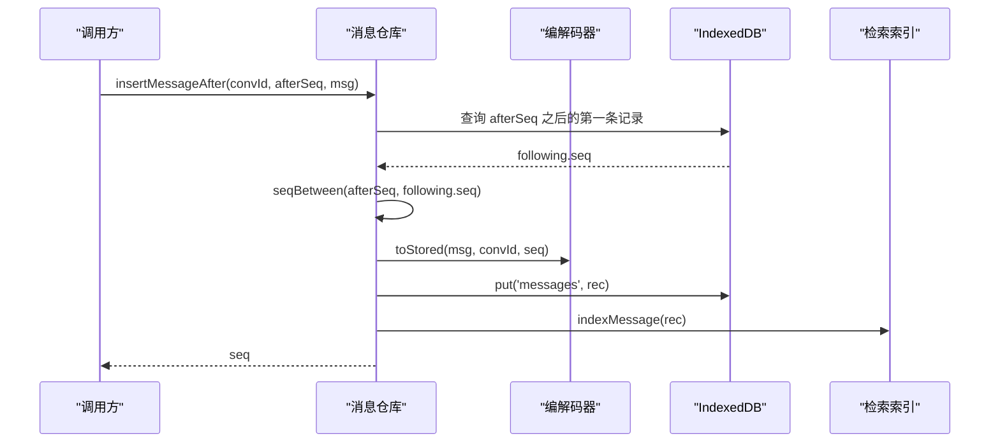
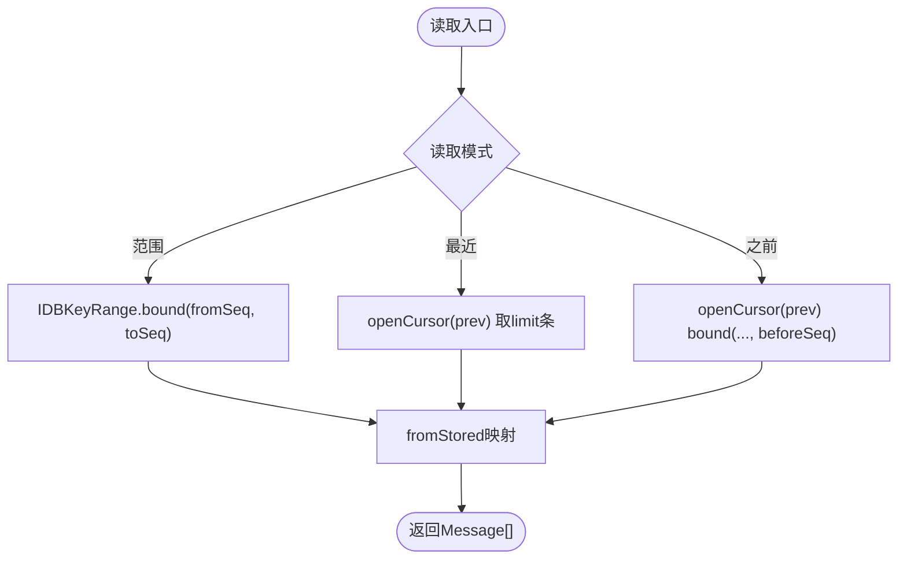
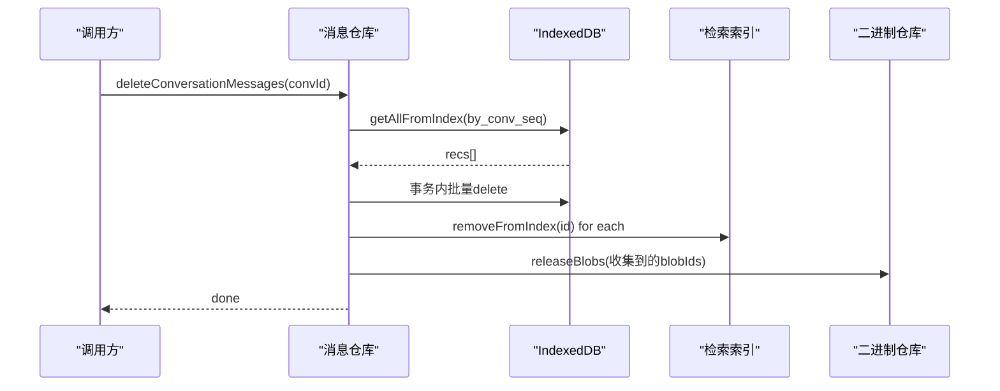
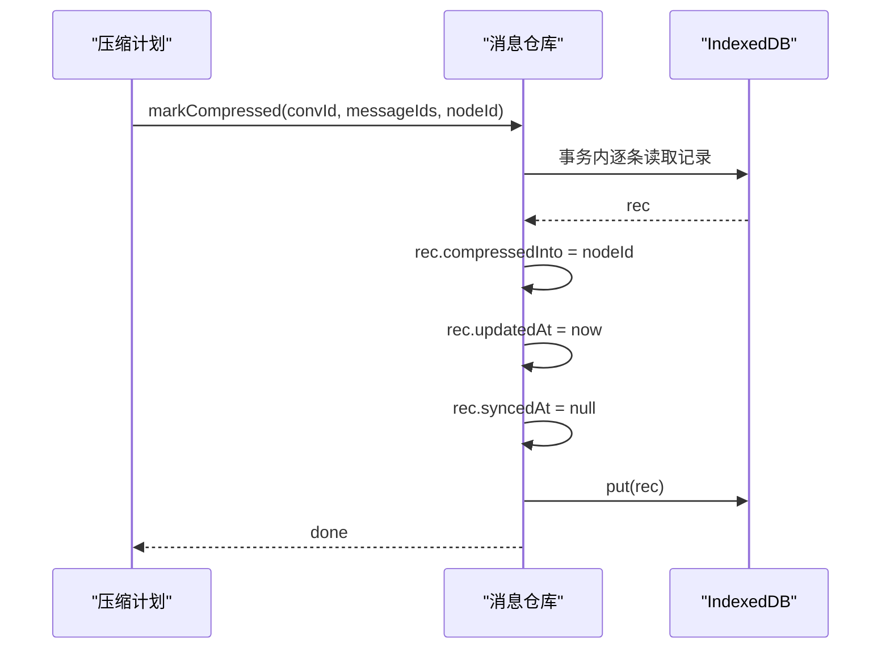
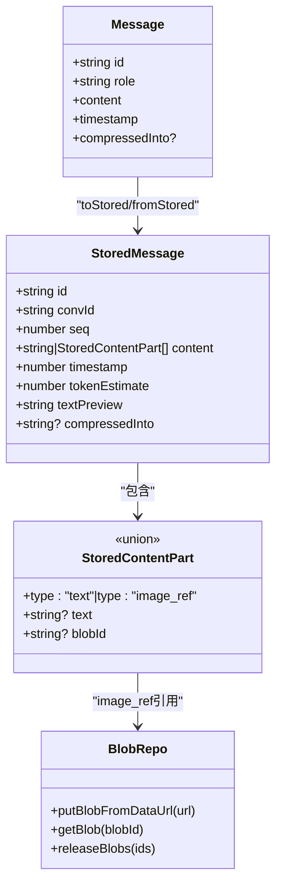
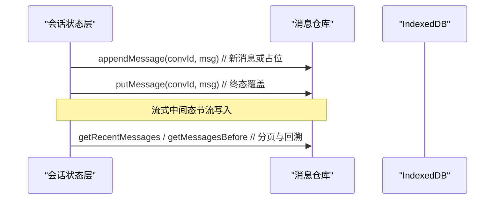
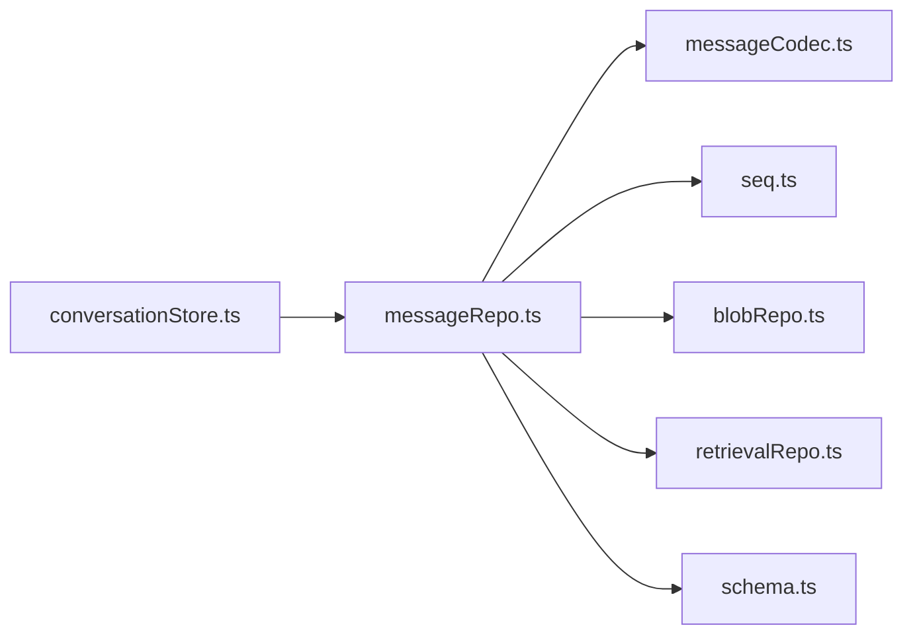

# 消息仓库

<cite>
**本文引用的文件**
- [messageRepo.ts](file://src/db/messageRepo.ts)
- [messageCodec.ts](file://src/db/messageCodec.ts)
- [seq.ts](file://src/db/seq.ts)
- [schema.ts](file://src/db/schema.ts)
- [blobRepo.ts](file://src/db/blobRepo.ts)
- [retrievalRepo.ts](file://src/db/retrievalRepo.ts)
- [conversationStore.ts](file://src/services/conversationStore.ts)
- [CompactionMarker.tsx](file://src/components/chat/CompactionMarker.tsx)
- [compactPlan.ts](file://src/utils/compactPlan.ts)
</cite>

## 目录
1. [简介](#简介)
2. [项目结构](#项目结构)
3. [核心组件](#核心组件)
4. [架构总览](#架构总览)
5. [详细组件分析](#详细组件分析)
6. [依赖关系分析](#依赖关系分析)
7. [性能考量](#性能考量)
8. [故障排查指南](#故障排查指南)
9. [结论](#结论)
10. [附录](#附录)

## 简介
本仓库实现了一个面向长对话的消息存储与检索系统，基于 IndexedDB，提供消息的追加、插入、覆盖、范围读取、分页加载、删除、批量写入以及压缩标记等能力。其设计要点包括：
- 以会话 ID 和浮点序列号（seq）作为唯一读写键，避免数组下标带来的重排成本。
- 所有写操作按会话级队列串行化，确保流式更新期间的并发安全。
- 图片等大对象通过内容寻址的二进制仓库进行去重与引用计数管理。
- 支持增量获取与分页加载，兼顾首屏性能与历史回溯体验。
- 提供压缩标记机制，将历史消息段压缩为摘要并保留原文，便于上下文管理与成本优化。

## 项目结构
消息仓库位于 src/db 目录下，围绕 messageRepo.ts 组织，配合 schema.ts 定义持久化结构，messageCodec.ts 负责运行时消息与持久化记录的编解码，seq.ts 提供序列号生成策略，blobRepo.ts 管理二进制数据，retrievalRepo.ts 维护检索索引，conversationStore.ts 协调消息变更与持久化流程。

图表来源
- [messageRepo.ts:1-276](file://src/db/messageRepo.ts#L1-L276)
- [messageCodec.ts:1-219](file://src/db/messageCodec.ts#L1-L219)
- [seq.ts:1-25](file://src/db/seq.ts#L1-L25)
- [blobRepo.ts:1-110](file://src/db/blobRepo.ts#L1-L110)
- [retrievalRepo.ts:1-200](file://src/db/retrievalRepo.ts#L1-L200)
- [schema.ts:1-283](file://src/db/schema.ts#L1-L283)
- [conversationStore.ts:200-241](file://src/services/conversationStore.ts#L200-L241)
- [CompactionMarker.tsx:1-40](file://src/components/chat/CompactionMarker.tsx#L1-L40)
- [compactPlan.ts:41-82](file://src/utils/compactPlan.ts#L41-L82)

章节来源
- [messageRepo.ts:1-276](file://src/db/messageRepo.ts#L1-L276)
- [schema.ts:1-283](file://src/db/schema.ts#L1-L283)

## 核心组件
- 消息仓库接口：提供 appendMessage、insertMessageAfter、putMessage、getMessageRange、getRecentMessages、getMessagesBefore、deleteMessage、deleteConversationMessages、putMessages、markCompressed 等方法。
- 编解码器：负责 Message 与 StoredMessage 之间的转换，处理图片引用与预览文本生成。
- 序列号生成：使用浮点排序键，支持在任意两条消息之间插入而不重编号。
- 二进制仓库：内容寻址存储，引用计数归零后延迟清理。
- 检索索引：对消息内容进行关键词索引，支持未来语义检索扩展。
- 会话状态层：协调消息变更、流式节流、持久化与增量同步。

章节来源
- [messageRepo.ts:27-100](file://src/db/messageRepo.ts#L27-L100)
- [messageCodec.ts:15-124](file://src/db/messageCodec.ts#L15-L124)
- [seq.ts:1-25](file://src/db/seq.ts#L1-L25)
- [blobRepo.ts:1-110](file://src/db/blobRepo.ts#L1-L110)
- [conversationStore.ts:204-241](file://src/services/conversationStore.ts#L204-L241)

## 架构总览
消息仓库以 IndexedDB 为核心存储，采用“会话+序列号”的二维索引进行读写。所有写操作经 enqueue 按会话串行化，避免流式更新导致的竞态。读操作通过 by_conv_seq 索引进行范围查询或反向游标分页。图片等大对象通过 blobRepo 的内容寻址存储，消息中仅保存引用。压缩标记 markCompressed 将消息段标记为已压缩，结合 UI 的 CompactionMarker 展示压缩收益。

图表来源
- [messageRepo.ts:130-138](file://src/db/messageRepo.ts#L130-L138)
- [messageRepo.ts:40-58](file://src/db/messageRepo.ts#L40-L58)
- [messageCodec.ts:164-219](file://src/db/messageCodec.ts#L164-L219)
- [retrievalRepo.ts:1-200](file://src/db/retrievalRepo.ts#L1-L200)

## 详细组件分析

### 消息序列号生成与排序机制
- 序列号采用浮点数，追加时递增固定步长，插入时在相邻两值间取中点，避免全量重编号。
- 当无法再细分（精度耗尽或边界情况）时回退到追加策略，保证键唯一性。
- 该机制使得重新生成、分支等操作无需移动后续消息，提升性能。

图表来源
- [seq.ts:1-25](file://src/db/seq.ts#L1-L25)
- [messageRepo.ts:140-165](file://src/db/messageRepo.ts#L140-L165)

章节来源
- [seq.ts:1-25](file://src/db/seq.ts#L1-L25)
- [messageRepo.ts:111-165](file://src/db/messageRepo.ts#L111-L165)

### 消息追加与插入
- appendMessage：从库中推导最新 seq，转换为存储记录并写入，同时建立检索索引。
- insertMessageAfter：在指定 seq 之后查找下一条消息的 seq，计算插入位，写入并建索引。
- putMessage：覆盖已有消息，保留原 seq；若不存在则退化为追加，避免丢消息。

图表来源
- [messageRepo.ts:140-165](file://src/db/messageRepo.ts#L140-L165)
- [messageCodec.ts:164-197](file://src/db/messageCodec.ts#L164-L197)
- [retrievalRepo.ts:1-200](file://src/db/retrievalRepo.ts#L1-L200)

章节来源
- [messageRepo.ts:124-202](file://src/db/messageRepo.ts#L124-L202)

### 消息范围读取与分页加载
- getMessageRange：按 [fromSeq, toSeq] 区间读取，适合按需加载上下文片段。
- getRecentMessages：反向游标读取最近 limit 条，返回升序，避免整段历史进入内存。
- getMessagesBefore：向上滚动加载，读取 beforeSeq 之前的 limit 条，用于历史回溯。

图表来源
- [messageRepo.ts:27-100](file://src/db/messageRepo.ts#L27-L100)

章节来源
- [messageRepo.ts:27-100](file://src/db/messageRepo.ts#L27-L100)

### 消息删除与批量操作
- deleteMessage：删除单条消息，移除索引并释放关联二进制引用。
- deleteConversationMessages：删除整个会话的消息，批量删除并释放所有关联二进制引用。
- putMessages：批量写入，按传入顺序分配 seq，事务内并行写入，随后逐个建索引。

图表来源
- [messageRepo.ts:246-275](file://src/db/messageRepo.ts#L246-L275)
- [blobRepo.ts:94-110](file://src/db/blobRepo.ts#L94-L110)

章节来源
- [messageRepo.ts:204-275](file://src/db/messageRepo.ts#L204-L275)
- [blobRepo.ts:94-110](file://src/db/blobRepo.ts#L94-L110)

### 压缩标记 markCompressed 的实现原理
- 目的：将一段历史消息标记为已压缩，指向一个上下文节点（ContextSegment），以便 API 发送时使用摘要而非原文。
- 行为：遍历目标消息 ID，设置 compressedInto 字段，更新时间戳并清空同步时间戳，表示需要重新同步。
- UI 展示：CompactionMarker 显示压缩收益（节省 tokens）与条目数，用户可展开查看摘要。

图表来源
- [messageRepo.ts:222-244](file://src/db/messageRepo.ts#L222-L244)
- [CompactionMarker.tsx:1-40](file://src/components/chat/CompactionMarker.tsx#L1-L40)
- [compactPlan.ts:41-82](file://src/utils/compactPlan.ts#L41-L82)

章节来源
- [messageRepo.ts:222-244](file://src/db/messageRepo.ts#L222-L244)
- [CompactionMarker.tsx:1-40](file://src/components/chat/CompactionMarker.tsx#L1-L40)
- [compactPlan.ts:41-82](file://src/utils/compactPlan.ts#L41-L82)

### 消息编码解码机制与二进制数据处理
- 编解码：toStored 将运行时 Message 转为 StoredMessage，图片转为 image_ref 引用；fromStored 还原为 Message。
- 图片处理：存盘时将 data URL 落盘为 blob，并只保留 blobId；读取时不立即创建 object URL，而是使用自定义协议 aishop-blob:<id>，由 UI 按需渲染并回收。
- 二进制仓库：内容寻址存储，同一份字节只存一次；引用计数归零后延迟清理，避免频繁写事务。

图表来源
- [messageCodec.ts:15-124](file://src/db/messageCodec.ts#L15-L124)
- [messageCodec.ts:164-219](file://src/db/messageCodec.ts#L164-L219)
- [blobRepo.ts:1-110](file://src/db/blobRepo.ts#L1-L110)
- [schema.ts:44-78](file://src/db/schema.ts#L44-L78)

章节来源
- [messageCodec.ts:15-124](file://src/db/messageCodec.ts#L15-L124)
- [messageCodec.ts:164-219](file://src/db/messageCodec.ts#L164-L219)
- [blobRepo.ts:1-110](file://src/db/blobRepo.ts#L1-L110)
- [schema.ts:44-78](file://src/db/schema.ts#L44-L78)

### 流式更新与增量获取策略
- 流式中间态：conversationStore 对 isStreaming 的消息进行节流写入，避免每个 chunk 都落盘。
- 终态写入：流结束时取消挂起的中间态写入，直接 putMessage 覆盖最终内容。
- 增量获取：getRecentMessages 与 getMessagesBefore 提供分页与回溯能力，减少首屏压力。

图表来源
- [conversationStore.ts:204-241](file://src/services/conversationStore.ts#L204-L241)
- [messageRepo.ts:40-79](file://src/db/messageRepo.ts#L40-L79)

章节来源
- [conversationStore.ts:204-241](file://src/services/conversationStore.ts#L204-L241)
- [messageRepo.ts:40-79](file://src/db/messageRepo.ts#L40-L79)

## 依赖关系分析
- messageRepo 依赖：
  - messageCodec：编解码与图片引用处理。
  - seq：序列号生成与插入位计算。
  - blobRepo：二进制数据的引用计数与释放。
  - retrievalRepo：消息检索索引的建立与维护。
  - schema：持久化数据结构定义。
- conversationStore 协调消息变更与持久化，确保流式更新的正确性与性能。

图表来源
- [messageRepo.ts:1-18](file://src/db/messageRepo.ts#L1-L18)
- [conversationStore.ts:204-241](file://src/services/conversationStore.ts#L204-L241)

章节来源
- [messageRepo.ts:1-18](file://src/db/messageRepo.ts#L1-L18)
- [conversationStore.ts:204-241](file://src/services/conversationStore.ts#L204-L241)

## 性能考量
- 序列号插入避免全量重编号，降低写放大。
- 反向游标读取最近消息，减少内存占用。
- 图片内容寻址与引用计数，避免重复存储与及时释放。
- 流式更新节流，减少不必要的磁盘写入。
- 批量写入使用事务并行提交，提高吞吐。

[本节为通用性能建议，不直接分析具体文件]

## 故障排查指南
- 图片丢失或无法渲染：检查 messageCodec 中的 aishop-blob 协议解析与 UI 侧 useBlobUrl 是否正确创建与回收对象 URL。
- 压缩标记无效：确认 markCompressed 是否正确设置 compressedInto 与 syncedAt 为 null，确保后续同步逻辑能识别待同步。
- 流式消息卡住：检查 conversationStore 的节流与取消逻辑，确保终态覆盖能正确触发。
- 二进制泄漏：确认 deleteMessage 与 putMessage 的引用计数增减是否匹配，避免 refCount 永远不归零。

章节来源
- [messageCodec.ts:50-79](file://src/db/messageCodec.ts#L50-L79)
- [messageRepo.ts:173-202](file://src/db/messageRepo.ts#L173-L202)
- [conversationStore.ts:204-241](file://src/services/conversationStore.ts#L204-L241)
- [blobRepo.ts:94-110](file://src/db/blobRepo.ts#L94-L110)

## 结论
消息仓库通过序列号、索引与编解码机制，实现了高效、可扩展的消息存储与检索。结合流式更新、分页加载与压缩标记，既保证了用户体验，又控制了上下文成本。二进制仓库的内容寻址与引用计数进一步提升了存储效率与资源管理能力。整体设计清晰、职责分明，具备良好的可维护性与扩展性。

[本节为总结性内容，不直接分析具体文件]

## 附录
- 关键类型定义参考：
  - Message、StoredMessage、StoredContentPart、StoredBlob 等结构见 schema.ts。
  - ContextSegment 与压缩相关字段见 types/index.ts。
- 常用方法路径：
  - 追加消息：appendMessage
  - 插入消息：insertMessageAfter
  - 覆盖消息：putMessage
  - 范围读取：getMessageRange
  - 最近消息：getRecentMessages
  - 历史回溯：getMessagesBefore
  - 删除消息：deleteMessage
  - 批量写入：putMessages
  - 压缩标记：markCompressed

[本节为补充信息，不直接分析具体文件]