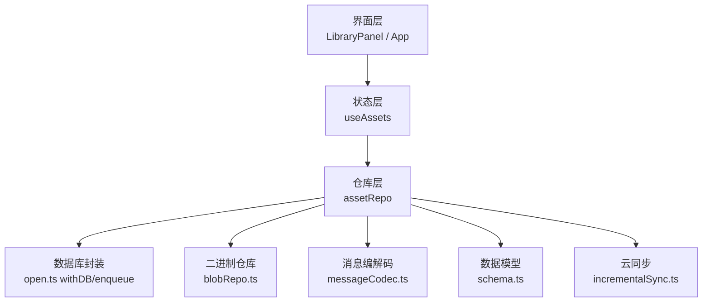
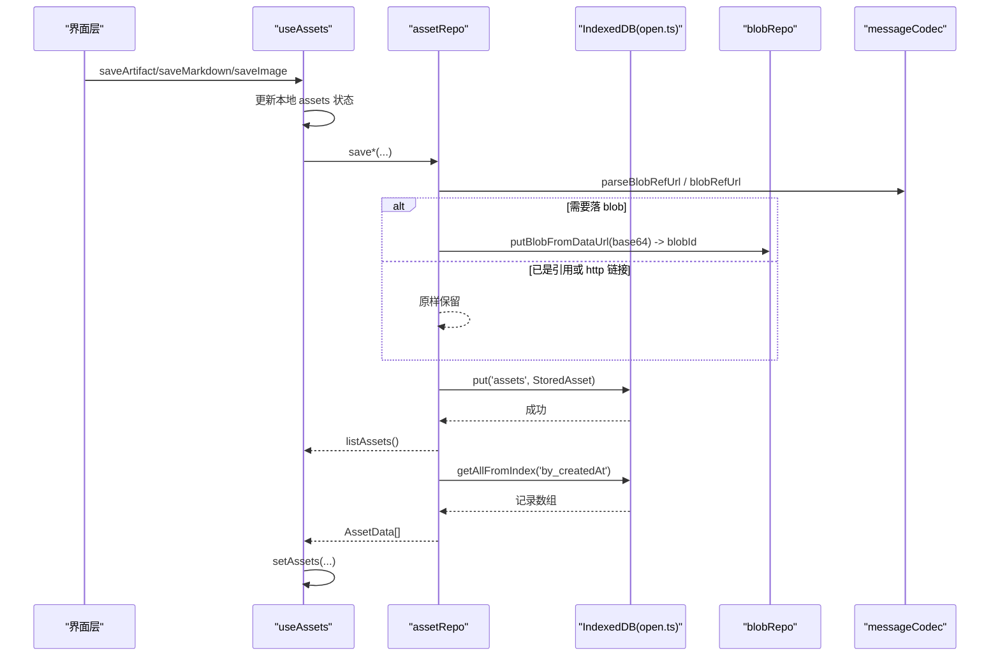
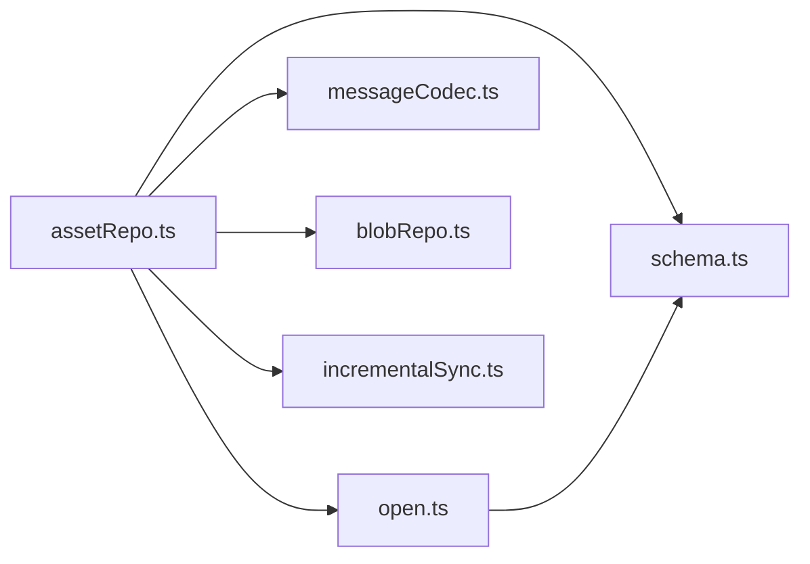

# 资产仓库

<cite>
**本文引用的文件**
- [src/db/assetRepo.ts](file://src/db/assetRepo.ts)
- [src/hooks/useAssets.ts](file://src/hooks/useAssets.ts)
- [src/components/artifact/LibraryPanel.tsx](file://src/components/artifact/LibraryPanel.tsx)
- [src/App.tsx](file://src/App.tsx)
- [src/db/schema.ts](file://src/db/schema.ts)
- [src/db/open.ts](file://src/db/open.ts)
- [src/db/blobRepo.ts](file://src/db/blobRepo.ts)
- [src/db/messageCodec.ts](file://src/db/messageCodec.ts)
- [src/services/byoc/incrementalSync.ts](file://src/services/byoc/incrementalSync.ts)
- [src/types/index.ts](file://src/types/index.ts)
</cite>

## 目录
1. [简介](#简介)
2. [项目结构](#项目结构)
3. [核心组件](#核心组件)
4. [架构总览](#架构总览)
5. [详细组件分析](#详细组件分析)
6. [依赖关系分析](#依赖关系分析)
7. [性能与存储特性](#性能与存储特性)
8. [故障排查指南](#故障排查指南)
9. [结论](#结论)
10. [附录：数据模型与迁移](#附录数据模型与迁移)

## 简介
本文件系统化文档化「我的库」资产仓库功能，覆盖三种资产（Artifact 应用、Markdown 文档、AI 生成图片）的增删改查、数据结构设计、blob 二进制存储、旧收藏数据迁移与 BYOC 云同步机制。该功能把用户主动保存的内容统一持久化到 IndexedDB 的 assets store，并通过 useAssets Hook 暴露给 UI 层展示与管理。原「收藏页」（favoriteArtifacts store + FavoritesPanel）已由本功能取代：favoriteArtifacts 仅保留为兼容镜像与迁移来源。

## 项目结构
资产功能由以下层次组成：
- 数据层：IndexedDB schema（v3）、blob 引用计数、消息编解码、统一数据库访问封装
- 仓库层：assetRepo 提供 list/save/remove/rename 等 API，按 kind 区分去重策略
- 状态层：useAssets Hook 管理本地 state 并协调落库
- 界面层：LibraryPanel 展示资产列表（筛选 + 三种预览）、长按菜单、重命名、删除；App 在聊天页/图片页触发保存

## 核心组件
- AssetData：资产在运行时的数据类型，含 id/kind/title/createdAt/artifact/content/urls/thumbnail/sourceRef
- StoredAsset：持久化类型，继承 SyncMeta（updatedAt/syncedAt），随 BYOC 增量同步跨设备
- assetRepo：IndexedDB 读写封装，提供 listAssets、saveArtifact、saveMarkdown、saveImageHistory、removeAsset、renameAsset
- useAssets：React Hook，维护 assets 本地状态，先更新 UI 再异步落库，失败不阻断
- LibraryPanel：资产列表 UI，支持 kind 筛选、三种预览（iframe / 大图 / Markdown 阅读视图）、长按菜单、重命名、删除确认
- App：集成资产 Hook，并在聊天页（artifact 保存/移除、md 保存）与图片页（图片收藏）触发保存

## 架构总览
资产数据流从 UI 到 IndexedDB 的完整路径如下：

## 详细组件分析

### 资产数据模型与类型定义
- AssetData（UI 形态）：blob 引用一律转成 `aishop-blob:<id>` 地址，thumbnail/urls 供 useBlobUrl 渲染
- StoredAsset（持久化形态）：`{ id, kind, title, createdAt, artifact?, content?, blobIds?, thumbnailBlobId?, sourceRef? }`，各 kind 使用自己的字段，其余留空：
  - artifact：artifact（含 code）+ thumbnailBlobId（缩略图 blob 引用）
  - markdown：content 纯文本内联（不占 blob）
  - image：blobIds（blob 引用或 http 上游链接，沿用 imageHistory 的约定）
- ArtifactBlock：被保存的代码块实体，含 id、type、title、description、code、createdAt

### 去重策略（按 kind 区分）
- artifact：id = artifact.id，重复保存无操作（与旧收藏一致），不悄悄换掉已有缩略图
- image：id = 源生成历史 id，重复保存无操作（一次生成整体入库）
- markdown：每次保存生成随机 id（crypto.randomUUID），但同一源消息（sourceRef = 消息 id）不重复入库

### 资产操作实现
- listAssets：按 createdAt 升序读取（与旧收藏页顺序一致：新的追加在末尾），映射为 AssetData
- saveArtifact：去重检查（同 artifact.id），thumbnail 经 parseBlobRefUrl 复用或 putBlobFromDataUrl 落库
- saveMarkdown：按 by_kind 索引扫 markdown 条目找 sourceRef 去重；返回 `{ id, alreadySaved }`；标题由 useAssets 在保存前调用小模型（generateDocumentTitle）总结，无 key/失败回退内容截取
- saveImageHistory：整个图片历史条目入库，urls 中 data: 落 blob、引用/http 原样保留
- removeAsset：删除记录 + releaseBlobs（thumbnailBlobId + blobIds 中非 http 部分），引用计数归零后由 sweepOrphanBlobs 清理
- renameAsset：事务内更新 title，artifact 同步改 artifact.title（预览头一致性），updatedAt 刷新

### 状态管理与 UI 交互
- useAssets：启动时加载列表；保存/删除/重命名先更新本地 state 再异步落库；isSaved(id) 判断是否已入库；toggleArtifact 一键收藏/移除；变更成功后防抖 3 秒触发 BYOC 同步（safeSync），删除/重命名同等待遇
- LibraryPanel：kind 筛选 chips（全部/应用/文档/图片）；三种卡片（markdown 显示 FileText + 内容摘要，其余显示 BlobImage 缩略图 + kind 标签）；PreviewBody 分发三种预览（artifact iframe / image 大图 + 下载 / markdown ReactMarkdown 阅读视图）；长按菜单（重命名/删除）与 PromptModal/ConfirmModal；状态栏避让
- App：聊天页按当前消息的 artifact 触发 toggleArtifact；MessageBubble「保存为 Markdown」下载 .md 的同时把消息纯文本存为 markdown 资产（已与「保存到我的库」合并为单一入口）；ImagePanel 图片卡片收藏按钮调 saveImage；BYOC 同步完成事件触发资产列表刷新

### 迁移机制（favoriteArtifacts → assets）
- DB v2→v3 升级：open.ts 的 upgrade 回调创建 assets store 后一次性迁移——读取 favoriteArtifacts 全量记录，转为 kind=artifact 的 StoredAsset（id/缩略图引用不变，createdAt = favoritedAt）
- 旧 store 保留不删：回退旧版本 App 时数据仍在；blob 引用计数不动
- 迁移写入必须用 `tx.objectStore()`（upgrade 事务内禁止 `db.put` 快捷方法，会新建事务抛 InvalidStateError）

### 同步与备份机制
- 同步：StoredAsset 继承 SyncMeta，随 BYOC 增量同步跨设备。云端目录 `sync/v1/assets/{id}.json + index.json`；favs 目录保留为 artifact 资产的兼容镜像（旧版本设备仍只认 favs，id 与 asset id 一致，删除 tombstone 双向对齐）；拉取侧兼容把旧 favs 对象转成资产
- 备份：应用提供全局备份导出/恢复（JSON 文件），当前备份范围未包含资产，与旧收藏行为一致

## 依赖关系分析
- assetRepo 依赖 open.ts 的 withDB/enqueue 保证连接健壮性与写串行化（统一 QUEUE = 'assets'）
- assetRepo 依赖 messageCodec.ts 的 blob 引用 URL 解析与生成
- assetRepo 依赖 blobRepo.ts 的 putBlobFromDataUrl/releaseBlobs 管理缩略图与图片二进制
- schema.ts 定义 AiShopDB 中的 assets 对象存储与索引 by_createdAt/by_kind
- open.ts 在 v2→v3 升级阶段创建 assets 对象存储并迁移 favoriteArtifacts
- incrementalSync.ts 依赖 listStoredAssets/putStoredAsset/removeAsset 做增量推拉与删除传播

## 性能与存储特性
- 二进制存储：base64 转 blob 后以内容寻址（sha-256）存储，重复图片只存一份，减少空间占用
- 引用计数：releaseBlobs 递减引用，归零后由 sweepOrphanBlobs 批量清理，避免关键路径写放大
- 索引优化：assets 按 createdAt 建立索引（列表排序），by_kind 索引用于 markdown 去重扫描（同 kind 条目少，全量扫可接受）
- 并发控制：enqueue 对 'assets' key 的写操作串行化，避免竞态；blobs 写队列确保 refCount 一致性
- 内存压力：withDB 捕获 UnknownError 并重试一次，提升稳定性

## 故障排查指南
- 保存失败：useAssets 中 catch 打印 `[useAssets]` 前缀错误日志；检查 IndexedDB 连接与权限
- 缩略图/图片无法显示：确认 thumbnail/urls 为 aishop-blob:<id> 或 http 形式，UI 侧使用 useBlobUrl 解析；检查 blobRepo 中是否存在对应 blob
- 存储空间不足：使用 getBlobStats 查看占用与孤儿 blob；必要时触发 sweepOrphanBlobs 清理
- 跨设备同步异常：确认 BYOC 配置有效；assets 目录 index.json 与 manifest.assetIds 应一致；旧设备删除 artifact 会发 favs tombstone，本端按 asset id 对齐删除

## 结论
资产仓库以 IndexedDB 为核心，结合 blob 引用计数与消息编解码，把 artifact/markdown/图片三类用户内容统一管理，并提供筛选、三种预览与云同步能力。原收藏功能已完整迁移：数据一次性迁移进 assets、UI 入口全部切换为「我的库」、BYOC 同步以 assets 为主目录并保留 favs 兼容镜像。

## 附录：数据模型与迁移

### 数据模型
- AssetData：{ id, kind, title, createdAt, artifact?, content?, urls?, thumbnail?, sourceRef? }
- StoredAsset：{ id, kind, title, createdAt, artifact?, content?, blobIds?, thumbnailBlobId?, sourceRef? } + SyncMeta
- ArtifactBlock：{ id, type, title, description, code, createdAt }
- StoredFavoriteArtifact（兼容保留）：{ id, artifact, thumbnailBlobId, favoritedAt }

### 迁移映射
- favoriteArtifacts 记录 → assets 记录：id 不变、kind='artifact'、title=artifact.title、createdAt=favoritedAt、thumbnailBlobId 不变
- 旧 store 与旧 repo（favoriteRepo）保留不删，供旧版本回退与 favs 同步镜像
