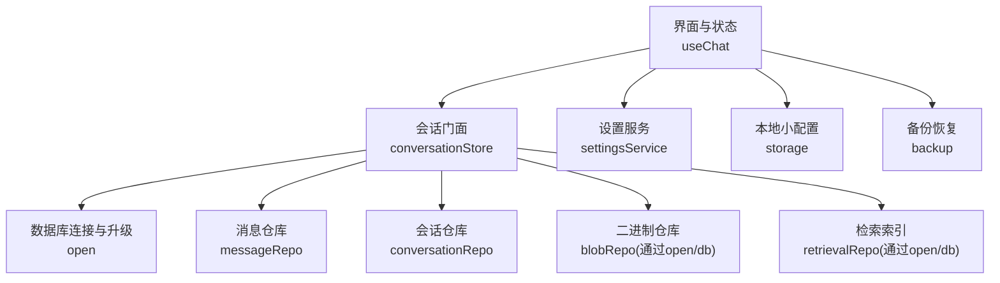
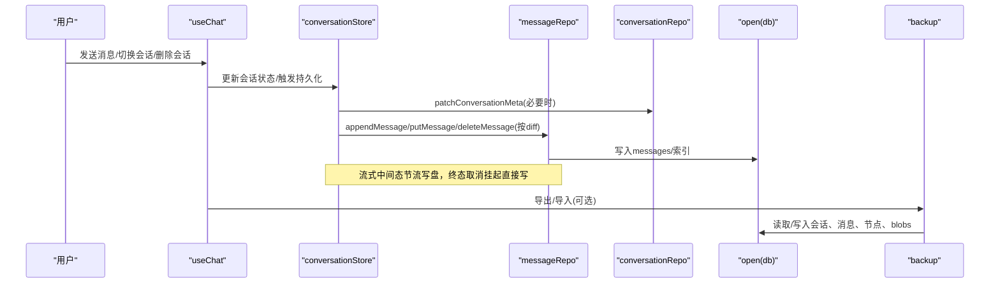
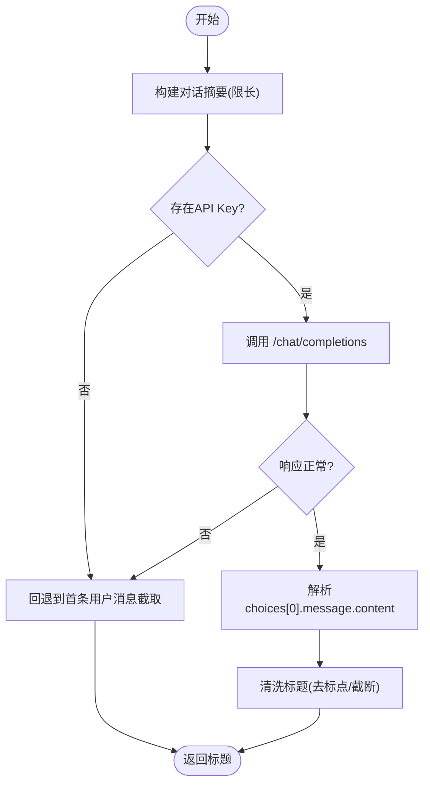
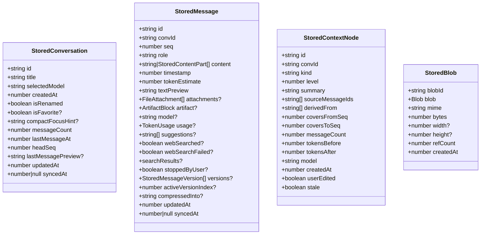
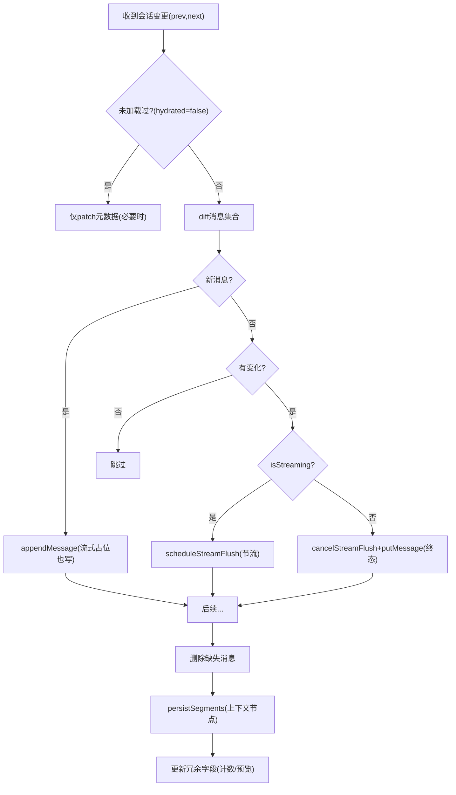
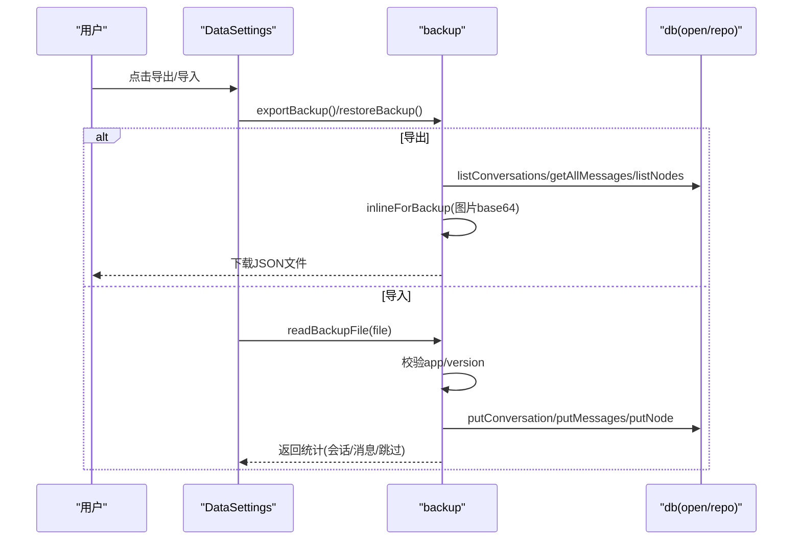
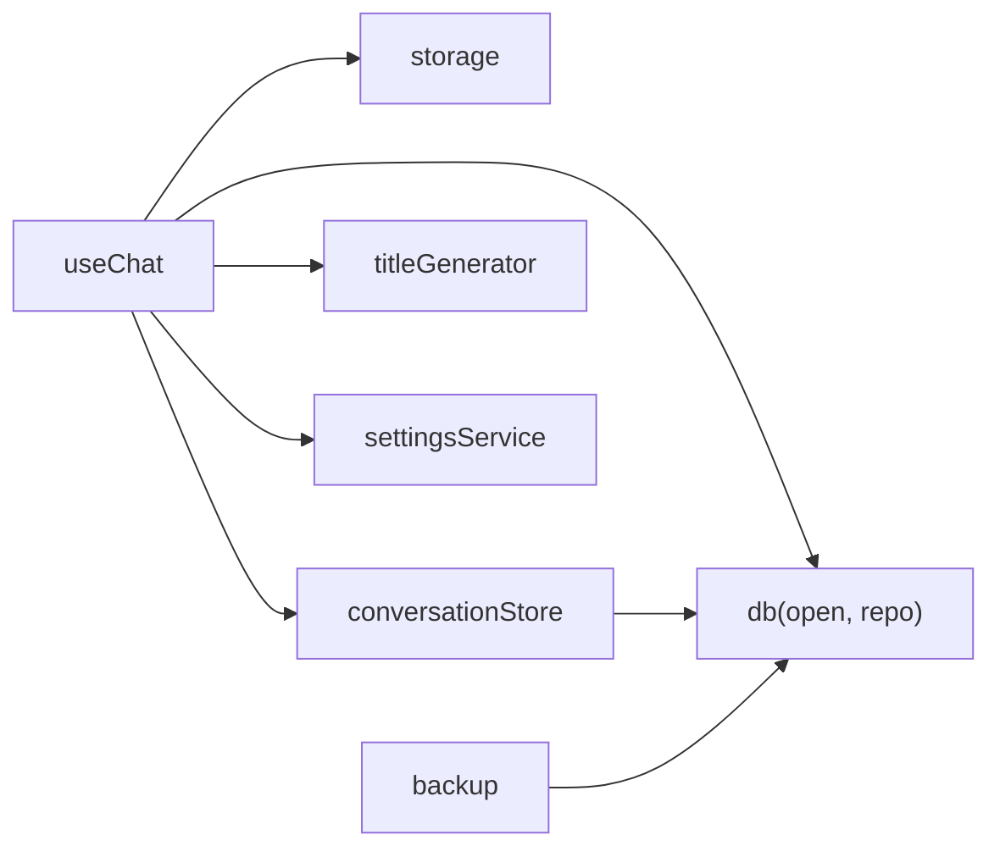

# 数据持久化

<cite>
**本文引用的文件**
- [src/services/storage.ts](file://src/services/storage.ts)
- [src/services/settingsService.ts](file://src/services/settingsService.ts)
- [src/services/titleGenerator.ts](file://src/services/titleGenerator.ts)
- [src/hooks/useChat.ts](file://src/hooks/useChat.ts)
- [src/services/conversationStore.ts](file://src/services/conversationStore.ts)
- [src/db/open.ts](file://src/db/open.ts)
- [src/db/schema.ts](file://src/db/schema.ts)
- [src/db/messageRepo.ts](file://src/db/messageRepo.ts)
- [src/db/conversationRepo.ts](file://src/db/conversationRepo.ts)
- [src/services/backup.ts](file://src/services/backup.ts)
- [src/components/settings/DataSettings.tsx](file://src/components/settings/DataSettings.tsx)
</cite>

## 目录
1. [简介](#简介)
2. [项目结构](#项目结构)
3. [核心组件](#核心组件)
4. [架构总览](#架构总览)
5. [详细组件分析](#详细组件分析)
6. [依赖关系分析](#依赖关系分析)
7. [性能考虑](#性能考虑)
8. [故障排查指南](#故障排查指南)
9. [结论](#结论)
10. [附录](#附录)

## 简介
本文件系统性梳理 AIShop 的数据持久化体系，覆盖本地存储、会话与消息的持久化、标题自动生成、数据库仓库模式、数据模型与关系映射、备份恢复与版本兼容、数据安全与隐私保护，以及性能优化建议与示例路径。目标是帮助开发者快速理解并扩展该系统的持久化能力。

## 项目结构
AIShop 的持久化由三层构成：
- 轻量配置层：使用 localStorage 保存首屏必需的小体积设置（如最近使用的模型、主题、是否启用联网搜索等）。
- 会话与消息层：基于 IndexedDB 的仓库模式，提供会话列表、消息分页加载、上下文节点、检索索引、二进制对象等能力。
- 备份恢复层：将对话、消息、上下文节点导出为自包含 JSON，支持跨设备迁移与版本兼容性校验。

图表来源
- [src/hooks/useChat.ts:152-337](file://src/hooks/useChat.ts#L152-L337)
- [src/services/conversationStore.ts:1-44](file://src/services/conversationStore.ts#L1-L44)
- [src/db/open.ts:1-74](file://src/db/open.ts#L1-L74)
- [src/db/messageRepo.ts:1-165](file://src/db/messageRepo.ts#L1-L165)
- [src/db/conversationRepo.ts:41-72](file://src/db/conversationRepo.ts#L41-L72)
- [src/services/settingsService.ts:1-101](file://src/services/settingsService.ts#L1-L101)
- [src/services/storage.ts:1-63](file://src/services/storage.ts#L1-L63)
- [src/services/backup.ts:1-257](file://src/services/backup.ts#L1-L257)

章节来源
- [src/hooks/useChat.ts:152-337](file://src/hooks/useChat.ts#L152-L337)
- [src/services/conversationStore.ts:1-44](file://src/services/conversationStore.ts#L1-L44)
- [src/db/open.ts:1-74](file://src/db/open.ts#L1-L74)

## 核心组件
- 本地存储服务（storage）：负责首屏所需的最小配置读写，避免异步导致的闪烁。
- 设置服务（settingsService）：集中管理提供商配置、API Key、压缩策略等，落盘到 localStorage。
- 标题生成服务（titleGenerator）：根据对话摘要调用 LLM 生成简短标题，含降级策略与文本清洗。
- 会话门面（conversationStore）：内存 Conversation[] 与 IndexedDB 之间的 diff 写入、流式节流、元数据更新、上下文节点同步。
- 数据库层（db/*）：以仓库模式封装 IndexedDB，提供会话、消息、上下文节点、检索索引、二进制对象等操作。
- 备份恢复（backup）：导出/导入完整会话与上下文节点，处理图片内联与恢复时的 blob 重建，进行版本兼容校验。

章节来源
- [src/services/storage.ts:1-63](file://src/services/storage.ts#L1-L63)
- [src/services/settingsService.ts:1-101](file://src/services/settingsService.ts#L1-L101)
- [src/services/titleGenerator.ts:1-78](file://src/services/titleGenerator.ts#L1-L78)
- [src/services/conversationStore.ts:1-244](file://src/services/conversationStore.ts#L1-L244)
- [src/db/open.ts:1-74](file://src/db/open.ts#L1-L74)
- [src/db/messageRepo.ts:1-165](file://src/db/messageRepo.ts#L1-L165)
- [src/db/conversationRepo.ts:41-72](file://src/db/conversationRepo.ts#L41-L72)
- [src/services/backup.ts:1-257](file://src/services/backup.ts#L1-L257)

## 架构总览
下图展示从用户操作到数据落盘的完整链路，包括流式消息的节流写盘、上下文节点与检索索引的维护，以及备份恢复入口。

图表来源
- [src/hooks/useChat.ts:195-337](file://src/hooks/useChat.ts#L195-L337)
- [src/services/conversationStore.ts:184-244](file://src/services/conversationStore.ts#L184-L244)
- [src/db/messageRepo.ts:124-165](file://src/db/messageRepo.ts#L124-L165)
- [src/db/conversationRepo.ts:41-72](file://src/db/conversationRepo.ts#L41-L72)
- [src/db/open.ts:14-57](file://src/db/open.ts#L14-L57)
- [src/services/backup.ts:101-129](file://src/services/backup.ts#L101-L129)

## 详细组件分析

### 本地存储服务（localStorage）
- 职责：保存首屏必须立即读取的配置项，如最近使用的模型、上次活跃会话 ID、是否启用联网搜索、主题等。
- 设计要点：
  - 同步读写，避免异步导致的首屏闪烁。
  - 异常捕获忽略错误，保证 UI 稳定。
- 典型用法：在 useChat 启动时恢复上次会话、在设置面板中读写主题与功能开关。

章节来源
- [src/services/storage.ts:1-63](file://src/services/storage.ts#L1-L63)
- [src/hooks/useChat.ts:195-248](file://src/hooks/useChat.ts#L195-L248)

### 设置服务（settingsService）
- 职责：统一管理提供商选择、API Key、压缩策略（阈值、热窗口大小、压缩模型），统一落盘到 localStorage。
- 设计要点：
  - 默认值合并策略，确保新增字段不影响旧配置。
  - 提供 get/set 接口，便于扩展新设置项。
- 典型用法：标题生成器获取 API Key；聊天流程读取压缩策略。

章节来源
- [src/services/settingsService.ts:1-101](file://src/services/settingsService.ts#L1-L101)
- [src/services/titleGenerator.ts:22-78](file://src/services/titleGenerator.ts#L22-L78)

### 标题自动生成服务（titleGenerator）
- 算法流程：
  - 构造摘要：取前几轮用户与 AI 内容，限制总长度。
  - 调用 LLM：使用配置的 chatBaseUrl 与 apiKey，固定模型与低温度参数。
  - 结果清洗：去除首尾空白与多余标点，截断至合理长度。
  - 降级策略：无 API Key 或请求失败时，回退到首条用户消息截取。
- 优化点：
  - 控制摘要长度与 token 上限，减少不必要开销。
  - 严格清理输出，避免标题过长或带标点。

图表来源
- [src/services/titleGenerator.ts:22-78](file://src/services/titleGenerator.ts#L22-L78)
- [src/services/settingsService.ts:60-84](file://src/services/settingsService.ts#L60-L84)

章节来源
- [src/services/titleGenerator.ts:1-78](file://src/services/titleGenerator.ts#L1-L78)

### 数据库层仓库模式（IndexedDB）
- 连接与升级（open.ts）：
  - 单例连接，自动重试 UnknownError。
  - 定义多表结构与索引：conversations、messages、blobs、contextNodes、contextPlans、retrieval、imageHistory、favoriteArtifacts、kv。
  - 处理 blocked/blocking/terminated 生命周期。
- 消息仓库（messageRepo.ts）：
  - 按 convId + seq 索引读写，避免数组下标依赖。
  - 追加、插入、分页读取（最近/更早）、删除，均经会话级队列串行化。
  - 写入后更新检索索引。
- 会话仓库（conversationRepo.ts）：
  - 会话记录增改查，支持局部 patch 元数据。
  - 冗余字段（messageCount、lastMessageAt、headSeq、lastMessagePreview）提升列表渲染性能。
- 数据模型（schema.ts）：
  - StoredMessage/StoredConversation/StoredContextNode/StoredBlob 等类型定义。
  - 约定：原文不可变、seq 浮点数、updatedAt/syncedAt 预留服务端同步。

图表来源
- [src/db/schema.ts:44-283](file://src/db/schema.ts#L44-L283)

章节来源
- [src/db/open.ts:1-74](file://src/db/open.ts#L1-L74)
- [src/db/messageRepo.ts:1-165](file://src/db/messageRepo.ts#L1-L165)
- [src/db/conversationRepo.ts:41-72](file://src/db/conversationRepo.ts#L41-L72)
- [src/db/schema.ts:1-283](file://src/db/schema.ts#L1-L283)

### 会话门面（conversationStore）
- 职责：内存 Conversation[] 与 IndexedDB 的桥接，实现 diff 写入、流式节流、元数据更新、上下文节点同步。
- 关键机制：
  - 启动时只读元数据，打开会话时按需加载最近消息与上下文节点。
  - 流式消息节流：每 1s 合并一次写盘，最终态取消挂起直接写。
  - 元数据变更检测：改名、选模型、收藏、压缩提示等变化才重写会话记录。
  - 消息变更检测：基于关键字段与内容长度判断是否需要重写。
  - 删除消息：遍历 prev 不在 next 中的消息执行删除。
  - 冗余计数与预览：新增或最后一条内容变化时更新。

图表来源
- [src/services/conversationStore.ts:184-244](file://src/services/conversationStore.ts#L184-L244)

章节来源
- [src/services/conversationStore.ts:1-244](file://src/services/conversationStore.ts#L1-L244)

### 备份与恢复（backup）
- 导出：
  - 遍历会话，拉取全部消息与上下文节点。
  - 将图片引用转换为 base64 内联，使备份文件自包含。
  - 生成 JSON 并触发下载。
- 恢复：
  - 校验应用标签与版本，防止不兼容文件。
  - 重新分配会话与消息 ID，避免覆盖现有数据。
  - 将 base64 图片还原为 blobs，重映射上下文节点引用。
  - 返回统计信息（会话数、消息数、跳过数）。
- 版本兼容：
  - BACKUP_VERSION 用于判断可恢复范围，过新版本拒绝恢复。

图表来源
- [src/services/backup.ts:101-257](file://src/services/backup.ts#L101-L257)
- [src/components/settings/DataSettings.tsx:50-98](file://src/components/settings/DataSettings.tsx#L50-L98)

章节来源
- [src/services/backup.ts:1-257](file://src/services/backup.ts#L1-L257)
- [src/components/settings/DataSettings.tsx:1-195](file://src/components/settings/DataSettings.tsx#L1-L195)

## 依赖关系分析
- useChat 依赖：
  - storage：恢复上次会话、记住模型与联网搜索开关。
  - conversationStore：会话列表、加载、持久化、历史消息加载。
  - db：删除会话、新建会话 ID、获取全部消息。
  - titleGenerator：补标题。
  - settingsService：压缩策略与提供商配置。
- conversationStore 依赖：
  - db/*：会话、消息、上下文节点、检索索引、二进制对象。
  - open：数据库连接与升级、会话级写入串行化。
- backup 依赖：
  - db：会话、消息、节点、blobs 的读写。
  - schema：类型与版本常量。

图表来源
- [src/hooks/useChat.ts:1-43](file://src/hooks/useChat.ts#L1-L43)
- [src/services/conversationStore.ts:12-37](file://src/services/conversationStore.ts#L12-L37)
- [src/services/backup.ts:13-27](file://src/services/backup.ts#L13-L27)

章节来源
- [src/hooks/useChat.ts:1-43](file://src/hooks/useChat.ts#L1-L43)
- [src/services/conversationStore.ts:12-37](file://src/services/conversationStore.ts#L12-L37)
- [src/services/backup.ts:13-27](file://src/services/backup.ts#L13-L27)

## 性能考虑
- 首屏优化：
  - 使用 localStorage 同步读取最小配置，避免异步闪烁。
  - 会话列表仅加载元数据，打开会话再按需加载最近消息。
- 写入优化：
  - 会话级队列串行化，避免流式期间密集写盘互相穿插。
  - 流式消息节流写盘（约 1s），最终态取消挂起直接写。
  - diff 写入：仅对变化的消息与元数据进行持久化。
- 查询优化：
  - 使用复合索引（convId + seq/timestamp）高效分页。
  - 冗余字段（messageCount、lastMessageAt、lastMessagePreview）减少二次读取。
- 存储优化：
  - 图片以 blob 引用存储，避免 base64 膨胀与 localStorage 容量问题。
  - 定期清理孤立 blobs，释放空间。

章节来源
- [src/services/storage.ts:1-63](file://src/services/storage.ts#L1-L63)
- [src/services/conversationStore.ts:153-183](file://src/services/conversationStore.ts#L153-L183)
- [src/db/messageRepo.ts:27-79](file://src/db/messageRepo.ts#L27-L79)
- [src/db/schema.ts:96-113](file://src/db/schema.ts#L96-L113)

## 故障排查指南
- 数据库升级被阻塞：
  - 现象：其他标签页占用旧版本连接，导致升级阻塞。
  - 处理：open.ts 会关闭当前连接，下次访问自动重开；日志提示“升级被其他标签页阻塞”。
- 流式写盘失败：
  - 现象：流式中间态写失败。
  - 处理：conversationStore 忽略中间态失败，最终态会再次写入；无需额外补偿。
- 备份恢复失败：
  - 现象：文件格式不正确或版本过新。
  - 处理：backup 抛出明确错误；检查 app 标签与 BACKUP_VERSION；确保使用最新版本应用。
- 存储空间不足：
  - 现象：iOS Safari 七天未访问可能清掉存储；系统回收也可能发生。
  - 处理：使用 DataSettings 导出备份；定期清理孤立 blobs；关注存储用量与配额。

章节来源
- [src/db/open.ts:46-57](file://src/db/open.ts#L46-L57)
- [src/services/conversationStore.ts:157-183](file://src/services/conversationStore.ts#L157-L183)
- [src/services/backup.ts:185-191](file://src/services/backup.ts#L185-L191)
- [src/components/settings/DataSettings.tsx:50-98](file://src/components/settings/DataSettings.tsx#L50-L98)

## 结论
AIShop 的数据持久化体系以“首屏轻量配置 + IndexedDB 仓库模式 + 备份恢复”为核心，兼顾性能与可靠性。通过 diff 写入、流式节流、冗余字段与索引优化，有效降低主线程压力与 IO 开销；通过备份恢复与版本兼容校验，保障数据可迁移与可恢复。建议在扩展新功能时遵循“原文不可变、seq 浮点数、冗余字段降读”的设计约定，并持续监控存储占用与性能指标。

## 附录
- 数据模型关系说明：
  - 会话（StoredConversation）与消息（StoredMessage）通过 convId 关联。
  - 上下文节点（StoredContextNode）派生自消息区间或下层节点，sourceMessageIds/derivedFrom 描述来源。
  - 二进制对象（StoredBlob）通过 blobId 被消息内容引用，refCount 归零后可被清理。
  - 检索索引（StoredRetrievalEntry）按 terms 索引消息，支持离线关键词检索。
- 安全与隐私：
  - API Key 存储在 localStorage，注意设备共享风险；可在设置中隐藏显示。
  - 备份文件包含图片 base64，体积较大且敏感，建议妥善保存与传输。
  - 恢复不会覆盖现有数据，避免误删；重复导入需手动清理。
- 示例代码路径（参考而非粘贴）：
  - 会话启动与恢复：[useChat 启动 effect:195-288](file://src/hooks/useChat.ts#L195-L288)
  - 流式消息节流写盘：[conversationStore 流式缓冲:153-183](file://src/services/conversationStore.ts#L153-L183)
  - 消息追加与插入：[messageRepo append/insert:124-165](file://src/db/messageRepo.ts#L124-L165)
  - 会话元数据局部更新：[conversationRepo patch:58-72](file://src/db/conversationRepo.ts#L58-L72)
  - 备份导出与恢复：[backup build/restore:101-257](file://src/services/backup.ts#L101-L257)
  - 设置读写：[settingsService:44-101](file://src/services/settingsService.ts#L44-L101)
  - 本地小配置：[storage:11-60](file://src/services/storage.ts#L11-L60)