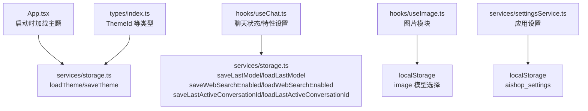
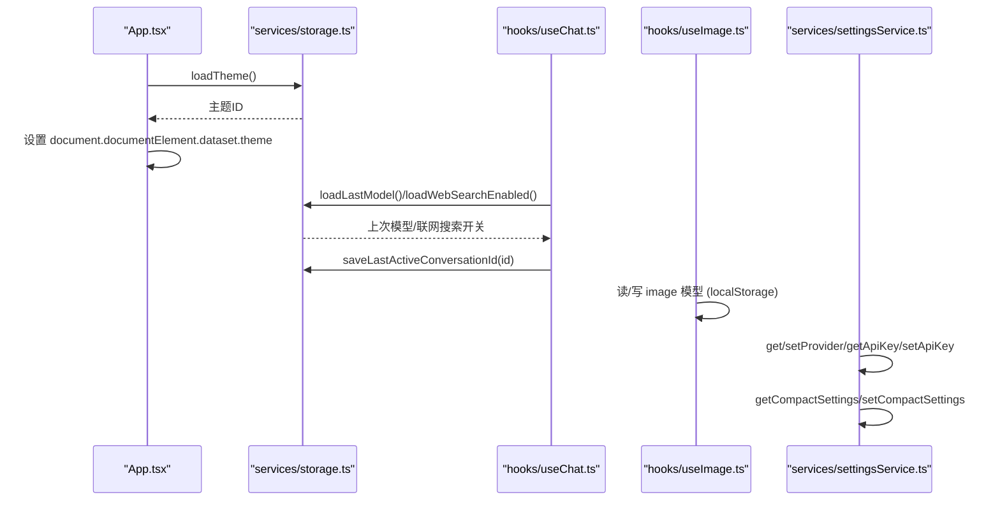
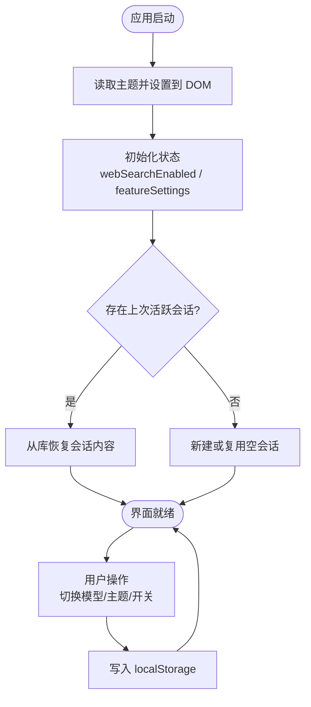
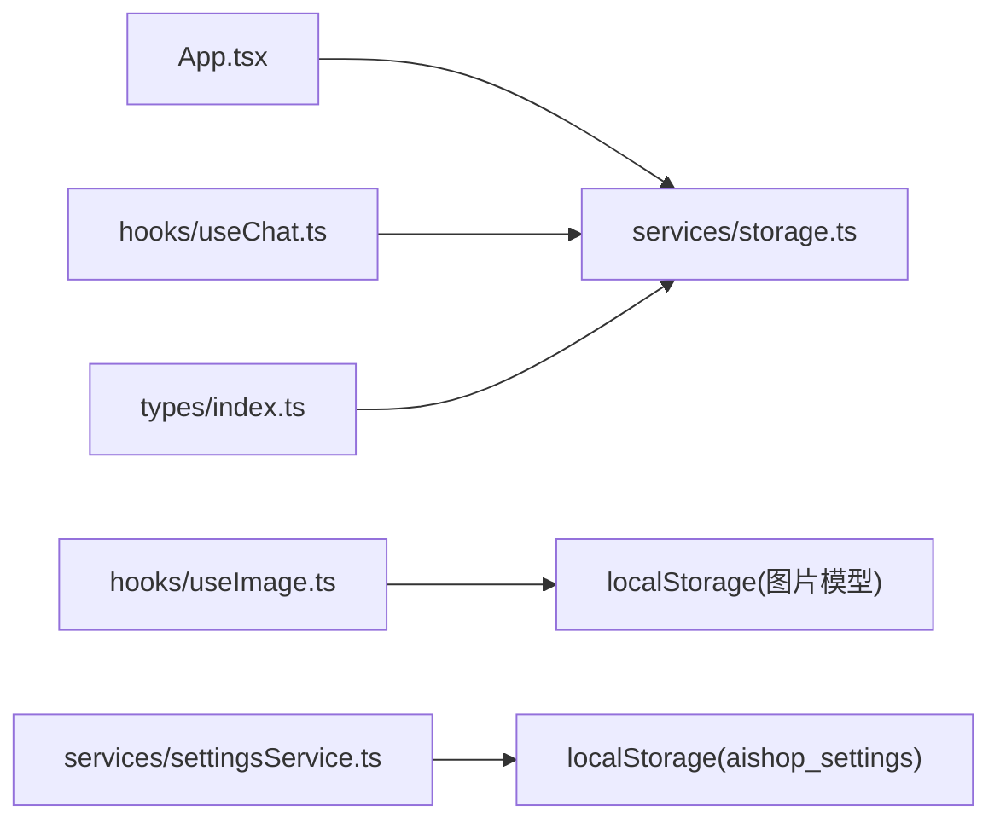

# 本地存储服务

<cite>
**本文引用的文件**
- [storage.ts](file://src/services/storage.ts)
- [App.tsx](file://src/App.tsx)
- [useChat.ts](file://src/hooks/useChat.ts)
- [useImage.ts](file://src/hooks/useImage.ts)
- [settingsService.ts](file://src/services/settingsService.ts)
- [index.ts](file://src/types/index.ts)
</cite>

## 目录
1. [简介](#简介)
2. [项目结构](#项目结构)
3. [核心组件](#核心组件)
4. [架构总览](#架构总览)
5. [详细组件分析](#详细组件分析)
6. [依赖关系分析](#依赖关系分析)
7. [性能考量](#性能考量)
8. [故障排查指南](#故障排查指南)
9. [结论](#结论)
10. [附录：API 参考与使用示例](#附录api-参考与使用示例)

## 简介
本文件面向 AIShop 的本地存储子系统，聚焦于浏览器 localStorage 的使用策略、键名规范、同步读取的重要性、错误处理与兼容性，以及完整的 API 接口说明。该子系统负责持久化首屏渲染所需的小体积设置（如最近使用的模型、主题、联网搜索开关、最后活跃会话 ID），并将大对象（会话、消息、收藏等）迁移至 IndexedDB，以避免主线程阻塞和首屏闪烁。

## 项目结构
- 本地存储的核心实现集中在 services/storage.ts，提供对关键小设置的读写封装。
- App 在启动时加载主题并申请持久化存储权限。
- useChat 钩子负责聊天相关的首屏恢复、功能开关与特性设置持久化。
- useImage 钩子在图片模块中维护模型选择等小设置。
- settingsService 管理应用级设置（提供商配置、API Key、压缩参数等）。
- types/index.ts 定义类型，包括主题标识 ThemeId 等。

图表来源
- [App.tsx:16-21](file://src/App.tsx#L16-L21)
- [storage.ts:11-60](file://src/services/storage.ts#L11-L60)
- [useChat.ts:160-172](file://src/hooks/useChat.ts#L160-L172)
- [useImage.ts:48-63](file://src/hooks/useImage.ts#L48-L63)
- [settingsService.ts:44-57](file://src/services/settingsService.ts#L44-L57)
- [index.ts:216](file://src/types/index.ts#L216)

章节来源
- [App.tsx:16-21](file://src/App.tsx#L16-L21)
- [storage.ts:1-63](file://src/services/storage.ts#L1-L63)
- [useChat.ts:160-172](file://src/hooks/useChat.ts#L160-L172)
- [useImage.ts:48-63](file://src/hooks/useImage.ts#L48-L63)
- [settingsService.ts:44-57](file://src/services/settingsService.ts#L44-L57)
- [index.ts:216](file://src/types/index.ts#L216)

## 核心组件
- storage.ts：集中管理“小体积、需要同步读取”的设置项，提供 saveLastModel、loadLastModel、saveWebSearchEnabled、loadWebSearchEnabled、saveLastActiveConversationId、loadLastActiveConversationId、loadTheme、saveTheme 等函数。
- App.tsx：应用启动时读取主题并写入 document.documentElement.dataset.theme；同时请求持久化存储。
- useChat.ts：初始化 webSearchEnabled、featureSettings 等状态，并在切换会话时保存最后活跃会话 ID。
- useImage.ts：在图片模块中直接读写 image 模型选择（独立于 chat 的 last model）。
- settingsService.ts：统一读写 aishop_settings，包含提供商配置、API Key、压缩参数等。
- types/index.ts：定义 ThemeId 等类型，约束主题取值范围。

章节来源
- [storage.ts:11-60](file://src/services/storage.ts#L11-L60)
- [App.tsx:16-21](file://src/App.tsx#L16-L21)
- [useChat.ts:160-172](file://src/hooks/useChat.ts#L160-L172)
- [useImage.ts:48-63](file://src/hooks/useImage.ts#L48-L63)
- [settingsService.ts:44-57](file://src/services/settingsService.ts#L44-L57)
- [index.ts:216](file://src/types/index.ts#L216)

## 架构总览
本地存储采用“分层 + 职责分离”的策略：
- 首屏关键小设置（模型、主题、联网搜索开关、最后活跃会话 ID）通过 localStorage 同步读写，避免首屏闪烁。
- 大对象（会话、消息、收藏、历史）迁移到 IndexedDB，异步存取，减少主线程阻塞。
- 应用设置（提供商、API Key、压缩参数）由 settingsService 统一管理，落盘为 JSON。
- 各模块按需消费上述能力，保证数据一致性与可维护性。

图表来源
- [App.tsx:16-21](file://src/App.tsx#L16-L21)
- [storage.ts:11-60](file://src/services/storage.ts#L11-L60)
- [useChat.ts:160-172](file://src/hooks/useChat.ts#L160-L172)
- [useImage.ts:48-63](file://src/hooks/useImage.ts#L48-L63)
- [settingsService.ts:59-100](file://src/services/settingsService.ts#L59-L100)

## 详细组件分析

### 存储键设计与命名约定
- 前缀规范：所有 key 以 aishop_ 开头，便于隔离与管理。
- 语义清晰：key 表达其用途，如 last_model、web_search_enabled、last_active_conversation_id、theme。
- 值类型最小化：布尔型以 '1'/'0' 字符串存储，降低序列化开销。
- 主题键：aishop_theme，默认值为 green。
- 其他：
  - aishop_last_model：最近使用的聊天模型 ID。
  - aishop_web_search_enabled：是否启用联网搜索。
  - aishop_last_active_conversation_id：最后活跃的会话 ID。
  - chat-feature-settings：聊天功能特性开关（JSON）。
  - aishop_settings：应用设置（JSON，含提供商、API Key、压缩参数等）。

章节来源
- [storage.ts:7-9](file://src/services/storage.ts#L7-L9)
- [storage.ts:40-60](file://src/services/storage.ts#L40-L60)
- [useChat.ts:160-172](file://src/hooks/useChat.ts#L160-L172)
- [settingsService.ts:35-57](file://src/services/settingsService.ts#L35-L57)

### 同步读取的重要性
- 首屏渲染期间必须同步读取主题、最近模型、联网搜索开关等，否则会出现 UI 闪烁或布局抖动。
- 因此这些关键小设置一律使用 localStorage 的同步 API（getItem/setItem）。
- 大对象（会话、消息、收藏）已迁移至 IndexedDB，避免在主线程做大量 JSON 序列化/反序列化。

章节来源
- [storage.ts:1-6](file://src/services/storage.ts#L1-L6)
- [App.tsx:16-21](file://src/App.tsx#L16-L21)
- [useChat.ts:160-172](file://src/hooks/useChat.ts#L160-L172)

### 错误处理机制
- 所有 localStorage 操作均包裹 try/catch，忽略异常，确保 UI 稳定。
- 读取失败返回安全默认值（如 null、false、green）。
- 应用启动时尝试申请持久化存储，失败不阻断流程。

章节来源
- [storage.ts:11-60](file://src/services/storage.ts#L11-L60)
- [App.tsx:23-28](file://src/App.tsx#L23-L28)

### 浏览器兼容性考虑
- localStorage 在现代浏览器普遍可用；Safari 可能拒绝持久化存储权限，需降级处理。
- 代码中对持久化存储申请失败进行静默处理，不影响基本功能。
- 主题、模型、开关等小设置基于 localStorage，兼容性好。

章节来源
- [App.tsx:23-28](file://src/App.tsx#L23-L28)

### 数据流与交互时序
- 应用启动：App 调用 loadTheme 设置主题；useChat 初始化 webSearchEnabled 与 featureSettings；必要时恢复最后活跃会话。
- 用户交互：切换模型、开启/关闭联网搜索、切换主题时，调用对应 save* 方法持久化。
- 会话切换：保存最后活跃会话 ID，以便冷启动恢复。

图表来源
- [App.tsx:16-21](file://src/App.tsx#L16-L21)
- [useChat.ts:160-172](file://src/hooks/useChat.ts#L160-L172)
- [storage.ts:11-60](file://src/services/storage.ts#L11-L60)

## 依赖关系分析
- storage.ts 被 App.tsx 与 useChat.ts 引用，用于主题与聊天相关设置。
- useImage.ts 直接操作 localStorage 维护图片模块的模型选择。
- settingsService.ts 集中管理 aishop_settings，供设置面板与相关逻辑使用。
- types/index.ts 提供 ThemeId 等类型约束，增强类型安全。

图表来源
- [App.tsx:11-21](file://src/App.tsx#L11-L21)
- [useChat.ts:160-172](file://src/hooks/useChat.ts#L160-L172)
- [useImage.ts:48-63](file://src/hooks/useImage.ts#L48-L63)
- [settingsService.ts:44-57](file://src/services/settingsService.ts#L44-L57)
- [storage.ts:11-60](file://src/services/storage.ts#L11-L60)
- [index.ts:216](file://src/types/index.ts#L216)

章节来源
- [App.tsx:11-21](file://src/App.tsx#L11-L21)
- [useChat.ts:160-172](file://src/hooks/useChat.ts#L160-L172)
- [useImage.ts:48-63](file://src/hooks/useImage.ts#L48-L63)
- [settingsService.ts:44-57](file://src/services/settingsService.ts#L44-L57)
- [storage.ts:11-60](file://src/services/storage.ts#L11-L60)
- [index.ts:216](file://src/types/index.ts#L216)

## 性能考量
- 首屏关键设置同步读取，避免闪烁。
- 大对象迁移至 IndexedDB，减少主线程阻塞。
- 会话持久化采用 diff 写入，避免每次 state 变化都整体写回。
- 布尔值以 '1'/'0' 存储，降低序列化成本。
- 在页面隐藏或离开时主动 flush 待写入，防止移动端切后台丢失长回复。

章节来源
- [storage.ts:1-6](file://src/services/storage.ts#L1-L6)
- [useChat.ts:290-319](file://src/hooks/useChat.ts#L290-L319)

## 故障排查指南
- 主题未生效：检查 loadTheme 返回值与 document.documentElement.dataset.theme 是否正确设置。
- 联网搜索开关无效：确认 saveWebSearchEnabled/loadWebSearchEnabled 是否被调用，且键值是否为 '1'/'0'。
- 会话无法恢复：检查最后活跃会话 ID 是否存在，以及从库恢复的流程是否成功。
- 设置面板修改后未刷新：确认是否触发了 aishop:feature-settings-changed 事件，useChat 是否监听并重读。
- 存储空间不足：localStorage 有配额限制，建议将大对象继续迁移至 IndexedDB。

章节来源
- [App.tsx:16-21](file://src/App.tsx#L16-L21)
- [storage.ts:40-60](file://src/services/storage.ts#L40-L60)
- [useChat.ts:315-353](file://src/hooks/useChat.ts#L315-L353)

## 结论
AIShop 的本地存储子系统通过明确的键命名、同步读取关键设置、错误兜底与兼容性处理，实现了稳定高效的用户体验。大对象迁移至 IndexedDB 避免了主线程阻塞，而小设置留在 localStorage 保证了首屏渲染的性能与一致性。遵循本文档的 API 与最佳实践，可进一步扩展与维护该子系统。

## 附录：API 参考与使用示例

### 存储 API（来自 services/storage.ts）
- saveLastModel(modelId: string): void
  - 作用：保存最近使用的聊天模型 ID。
  - 键：aishop_last_model。
  - 使用场景：切换聊天模型后调用。
- loadLastModel(): string | null
  - 作用：读取最近使用的聊天模型 ID。
  - 默认：null。
  - 使用场景：应用启动或进入聊天页时恢复。
- saveWebSearchEnabled(enabled: boolean): void
  - 作用：保存联网搜索开关。
  - 键：aishop_web_search_enabled，值为 '1' 或 '0'。
  - 使用场景：用户切换联网搜索开关时调用。
- loadWebSearchEnabled(): boolean
  - 作用：读取联网搜索开关。
  - 默认：false。
  - 使用场景：初始化 webSearchEnabled 状态。
- saveLastActiveConversationId(id: string): void
  - 作用：保存最后活跃会话 ID。
  - 键：aishop_last_active_conversation_id。
  - 使用场景：切换会话或页面隐藏时调用。
- loadLastActiveConversationId(): string | null
  - 作用：读取最后活跃会话 ID。
  - 默认：null。
  - 使用场景：应用启动时恢复上次会话。
- loadTheme(): string
  - 作用：读取主题 ID。
  - 键：aishop_theme。
  - 默认：green。
  - 使用场景：应用启动时设置主题。
- saveTheme(themeId: string): void
  - 作用：保存主题 ID。
  - 键：aishop_theme。
  - 使用场景：用户切换主题时调用。

章节来源
- [storage.ts:11-60](file://src/services/storage.ts#L11-L60)

### 使用示例（路径引用）
- 应用启动加载主题：[App.tsx:16-21](file://src/App.tsx#L16-L21)
- 初始化联网搜索开关与特性设置：[useChat.ts:160-172](file://src/hooks/useChat.ts#L160-L172)
- 保存最后活跃会话 ID：[useChat.ts:315-319](file://src/hooks/useChat.ts#L315-L319)
- 图片模块模型选择读写：[useImage.ts:48-63](file://src/hooks/useImage.ts#L48-L63)
- 应用设置读写（提供商、API Key、压缩参数）：[settingsService.ts:59-100](file://src/services/settingsService.ts#L59-L100)

### 最佳实践建议
- 新增小设置时，优先放入 storage.ts 并提供对应的 save*/load* 函数，保持统一风格。
- 键名遵循 aishop_ 前缀与语义化命名。
- 布尔值以 '1'/'0' 存储，避免 JSON 序列化开销。
- 所有 localStorage 操作包裹 try/catch，读取失败返回安全默认值。
- 首屏关键设置必须同步读取，避免闪烁。
- 大对象迁移至 IndexedDB，避免主线程阻塞。
- 主题切换后立即写入并应用到 DOM，确保即时反馈。