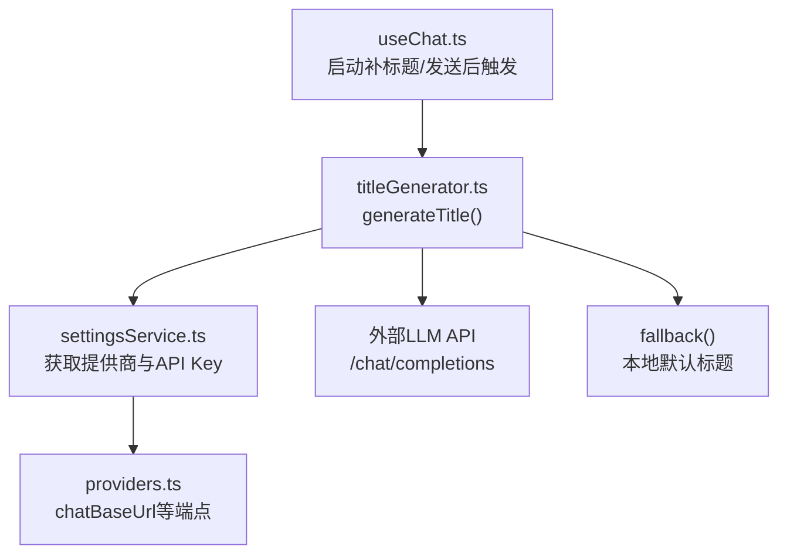
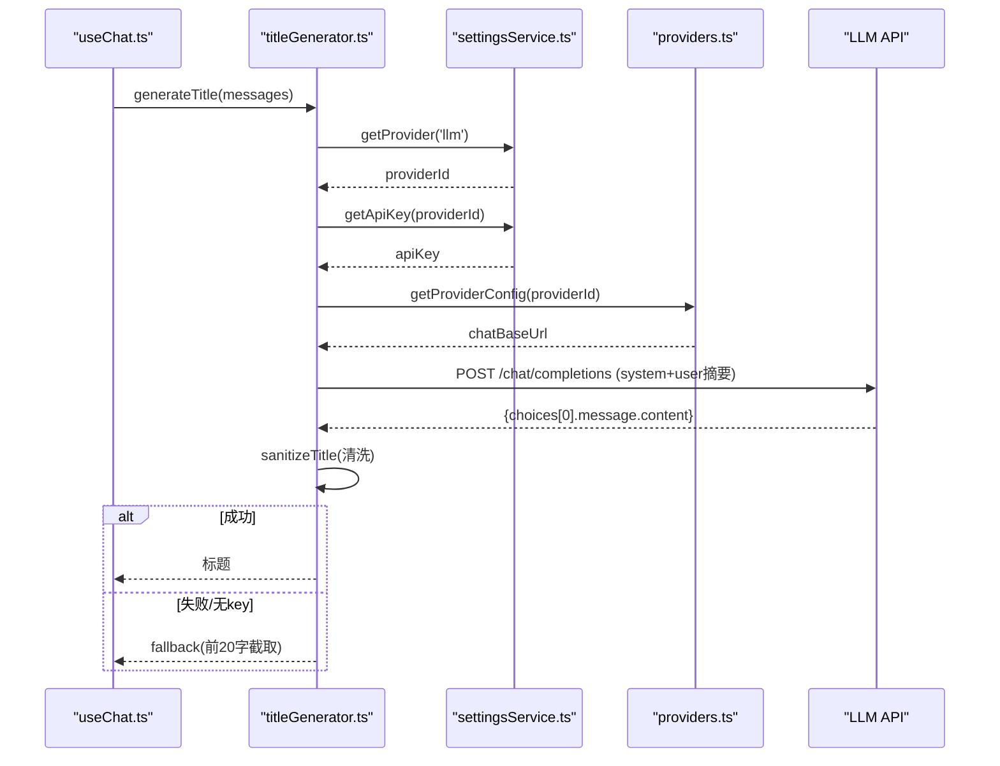
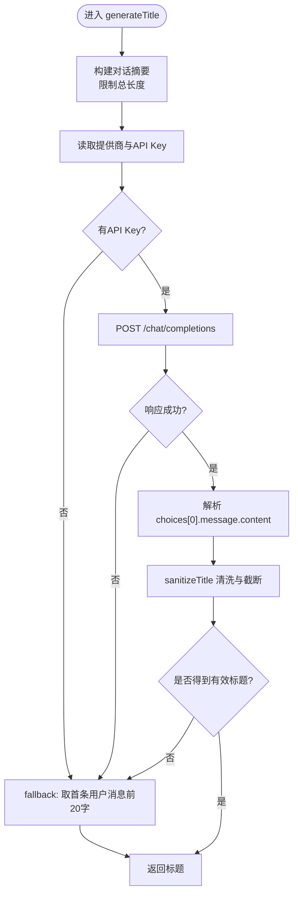
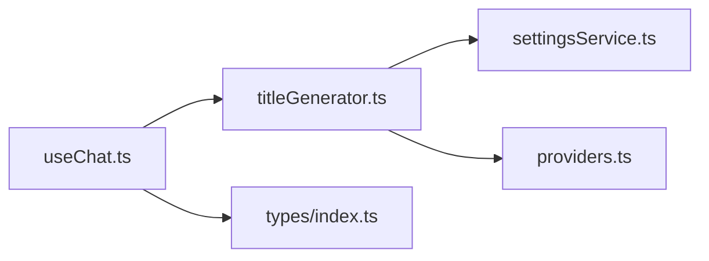

# 标题生成服务

<cite>
**本文引用的文件**
- [titleGenerator.ts](file://src/services/titleGenerator.ts)
- [useChat.ts](file://src/hooks/useChat.ts)
- [settingsService.ts](file://src/services/settingsService.ts)
- [providers.ts](file://src/config/providers.ts)
- [index.ts](file://src/types/index.ts)
- [SettingsPanel.tsx](file://src/components/settings/SettingsPanel.tsx)
</cite>

## 目录
1. [简介](#简介)
2. [项目结构](#项目结构)
3. [核心组件](#核心组件)
4. [架构总览](#架构总览)
5. [详细组件分析](#详细组件分析)
6. [依赖关系分析](#依赖关系分析)
7. [性能考虑](#性能考虑)
8. [故障排查指南](#故障排查指南)
9. [结论](#结论)
10. [附录](#附录)

## 简介
本文件面向 AIShop 的“对话标题自动生成服务”，系统性说明其算法逻辑、触发时机与调用方式、优化策略（长度控制、语义完整性、可读性）、配置项与自定义规则、错误处理与降级方案，以及性能优化与批量处理建议。文档同时提供代码级流程图与时序图，帮助读者快速理解并扩展该能力。

## 项目结构
标题生成能力由前端服务层实现，核心位于 services 目录，并在 hooks 层作为异步任务触发；配置通过 settingsService 与 providers 管理。

图表来源
- [useChat.ts:255-279](file://src/hooks/useChat.ts#L255-L279)
- [titleGenerator.ts:22-77](file://src/services/titleGenerator.ts#L22-L77)
- [settingsService.ts:59-88](file://src/services/settingsService.ts#L59-L88)
- [providers.ts:7-18](file://src/config/providers.ts#L7-L18)

章节来源
- [useChat.ts:255-279](file://src/hooks/useChat.ts#L255-L279)
- [titleGenerator.ts:22-77](file://src/services/titleGenerator.ts#L22-L77)
- [settingsService.ts:59-88](file://src/services/settingsService.ts#L59-L88)
- [providers.ts:7-18](file://src/config/providers.ts#L7-L18)

## 核心组件
- 标题生成器：封装摘要构造、LLM 请求、结果清洗与降级策略。
- 设置服务：持久化提供商选择与 API Key，并提供压缩相关设置。
- 提供商配置：集中管理各服务的 base URL 等端点信息。
- 类型定义：会话、消息、上下文片段等数据结构，支撑标题生成输入。
- 触发入口：在应用启动时补齐历史会话标题，或在发送消息后异步触发。

章节来源
- [titleGenerator.ts:22-77](file://src/services/titleGenerator.ts#L22-L77)
- [settingsService.ts:5-25](file://src/services/settingsService.ts#L5-L25)
- [providers.ts:1-18](file://src/config/providers.ts#L1-L18)
- [index.ts:143-175](file://src/types/index.ts#L143-L175)

## 架构总览
标题生成的整体流程如下：
- 触发时机：应用冷启动时扫描未命名且非用户重命名的会话，按会话消息生成标题；也可在发送消息后异步触发。
- 数据准备：将消息序列转换为“用户/AI”交替的文本摘要，限制总长度以避免过长上下文。
- 模型调用：读取当前 LLM 提供商与 API Key，拼接系统提示词与用户摘要，调用 /chat/completions。
- 结果处理：清洗标题（去空白、去首尾标点、截断至安全长度），失败或无返回时回退到本地默认标题。

图表来源
- [useChat.ts:255-279](file://src/hooks/useChat.ts#L255-L279)
- [titleGenerator.ts:22-77](file://src/services/titleGenerator.ts#L22-L77)
- [settingsService.ts:59-88](file://src/services/settingsService.ts#L59-L88)
- [providers.ts:7-18](file://src/config/providers.ts#L7-L18)

## 详细组件分析

### 标题生成器（titleGenerator.ts）
- 摘要构造：遍历消息，按角色拼接“用户/AI：内容”，遇到图片消息以占位文本替代；累计长度超过阈值即停止追加，避免超长上下文。
- 模型与端点：使用固定模型标识，动态从设置服务获取提供商与 API Key，并从提供商配置中取 chatBaseUrl。
- 请求体：包含 system 提示词（要求简短标题、不超过指定字数、不加引号与标点）与 user 摘要；限制输出 token 数与温度参数以稳定输出。
- 结果清洗：去除首尾空白与多余标点，强制截断到安全长度，确保 UI 显示稳定。
- 降级策略：当缺少 API Key、网络异常或响应解析失败时，回退为基于首条用户消息的本地默认标题。

图表来源
- [titleGenerator.ts:6-19](file://src/services/titleGenerator.ts#L6-L19)
- [titleGenerator.ts:22-77](file://src/services/titleGenerator.ts#L22-L77)

章节来源
- [titleGenerator.ts:6-19](file://src/services/titleGenerator.ts#L6-L19)
- [titleGenerator.ts:22-77](file://src/services/titleGenerator.ts#L22-L77)

### 触发时机与调用方式（useChat.ts）
- 启动补标题：应用冷启动时，扫描所有未命名且非用户重命名的会话，若存在消息则调用 generateTitle 生成标题并更新会话元数据。
- 发送后触发：在发送消息的流程中，提供 fire-and-forget 的触发函数，异步生成标题并更新会话标题（仅在会话未被用户手动重命名时生效）。
- 状态更新：标题生成成功后，仅更新对应会话的 title 与更新时间，不影响主聊天流。

章节来源
- [useChat.ts:255-279](file://src/hooks/useChat.ts#L255-L279)
- [useChat.ts:375-391](file://src/hooks/useChat.ts#L375-L391)

### 配置选项与自定义规则
- 提供商与密钥：通过设置服务维护 llm/image/video/search 四类提供商及对应 API Key；可在设置面板中修改。
- 端点配置：providers.ts 集中管理 chatBaseUrl 等端点，新增提供商只需在此注册。
- 标题模型与参数：标题生成使用固定模型标识，可通过调整系统提示词与 max_tokens、temperature 等参数影响风格与长度。
- 压缩相关设置：settingsService 暴露 compact 设置（threshold、hotWindowSize、model），虽主要用于上下文压缩，但与标题生成共享同一套提供商体系。

章节来源
- [settingsService.ts:5-25](file://src/services/settingsService.ts#L5-L25)
- [settingsService.ts:59-100](file://src/services/settingsService.ts#L59-L100)
- [providers.ts:7-18](file://src/config/providers.ts#L7-L18)
- [SettingsPanel.tsx:33-103](file://src/components/settings/SettingsPanel.tsx#L33-L103)

### 标题优化策略
- 长度控制：系统提示词要求标题不超过指定字数；服务端返回后进行二次截断，保证 UI 展示稳定。
- 语义完整性：摘要构造保留用户与 AI 的关键轮次，尽量覆盖主题线索；图片消息以占位文本替代，避免噪声。
- 可读性优化：清洗步骤去除首尾空白与多余标点，提升标题整洁度；fallback 保证在无可用服务时仍给出可识别的预览。

章节来源
- [titleGenerator.ts:22-77](file://src/services/titleGenerator.ts#L22-L77)

### 错误处理与降级方案
- 缺失 API Key：直接走 fallback，避免无效请求。
- 网络或服务异常：捕获异常并回退到本地默认标题。
- 响应解析失败：若无有效 content，同样回退。
- 静默失败：上层调用处对标题生成进行 try/catch 包裹，不阻塞主流程。

章节来源
- [titleGenerator.ts:38-77](file://src/services/titleGenerator.ts#L38-L77)
- [useChat.ts:255-279](file://src/hooks/useChat.ts#L255-L279)
- [useChat.ts:375-391](file://src/hooks/useChat.ts#L375-L391)

## 依赖关系分析
- useChat.ts 依赖 titleGenerator.ts 完成标题生成，并在启动与发送消息两个阶段触发。
- titleGenerator.ts 依赖 settingsService.ts 获取提供商与密钥，依赖 providers.ts 获取端点。
- 类型定义 index.ts 提供 Conversation、Message 等结构，用于消息摘要与状态更新。

图表来源
- [useChat.ts:255-279](file://src/hooks/useChat.ts#L255-L279)
- [titleGenerator.ts:22-77](file://src/services/titleGenerator.ts#L22-L77)
- [settingsService.ts:59-88](file://src/services/settingsService.ts#L59-L88)
- [providers.ts:7-18](file://src/config/providers.ts#L7-L18)
- [index.ts:143-175](file://src/types/index.ts#L143-L175)

章节来源
- [useChat.ts:255-279](file://src/hooks/useChat.ts#L255-L279)
- [titleGenerator.ts:22-77](file://src/services/titleGenerator.ts#L22-L77)
- [settingsService.ts:59-88](file://src/services/settingsService.ts#L59-L88)
- [providers.ts:7-18](file://src/config/providers.ts#L7-L18)
- [index.ts:143-175](file://src/types/index.ts#L143-L175)

## 性能考虑
- 摘要长度限制：在构造摘要时限制总长度，减少请求体大小与模型处理成本。
- 低温度与短输出：设置较低 temperature 与较小 max_tokens，提高标题稳定性与速度。
- 异步触发：标题生成为后台任务，不阻塞消息发送与渲染。
- 批量处理建议：
  - 启动时批量补标题：对多个会话依次调用，但需控制并发，避免瞬时过多请求。
  - 合并触发：在短时间内的多次标题生成可合并为一次，以减少重复计算。
  - 缓存策略：对相同会话的消息摘要可做短期缓存，避免重复生成。
- 资源占用：避免在主线程执行耗时操作；当前实现已采用异步与 catch 包裹，保持界面流畅。

## 故障排查指南
- 无法生成标题：检查提供商是否配置正确、API Key 是否存在；查看网络请求是否成功。
- 标题为空或异常：确认响应结构是否符合预期；必要时启用日志定位解析失败位置。
- 频繁降级：若频繁回退到默认标题，检查网络与服务可用性，或临时放宽提示词约束。
- 标题过长或格式不佳：调整系统提示词中的长度限制与清洗规则，或降低 temperature。

章节来源
- [titleGenerator.ts:38-77](file://src/services/titleGenerator.ts#L38-L77)
- [settingsService.ts:59-88](file://src/services/settingsService.ts#L59-L88)
- [providers.ts:7-18](file://src/config/providers.ts#L7-L18)

## 结论
AIShop 的标题生成服务以轻量、健壮为核心目标：通过摘要构造与 LLM 调用生成高质量标题，配合严格的清洗与降级策略，确保在各种环境下均能提供可用的会话标题。其触发机制覆盖冷启动与发送后场景，配置灵活可扩展，便于后续接入更多提供商与自定义规则。建议在批量场景下引入并发控制与缓存，进一步提升性能与稳定性。

## 附录
- 使用示例路径：
  - 启动补标题：[useChat.ts:255-279](file://src/hooks/useChat.ts#L255-L279)
  - 发送后触发：[useChat.ts:375-391](file://src/hooks/useChat.ts#L375-L391)
  - 标题生成核心：[titleGenerator.ts:22-77](file://src/services/titleGenerator.ts#L22-L77)
  - 提供商与密钥配置：[settingsService.ts:59-88](file://src/services/settingsService.ts#L59-L88)
  - 端点配置：[providers.ts:7-18](file://src/config/providers.ts#L7-L18)
- 相关类型定义：
  - 会话与消息结构：[index.ts:143-175](file://src/types/index.ts#L143-L175)
  - 上下文片段与用量：[index.ts:13-27](file://src/types/index.ts#L13-L27), [index.ts:34-42](file://src/types/index.ts#L34-L42)