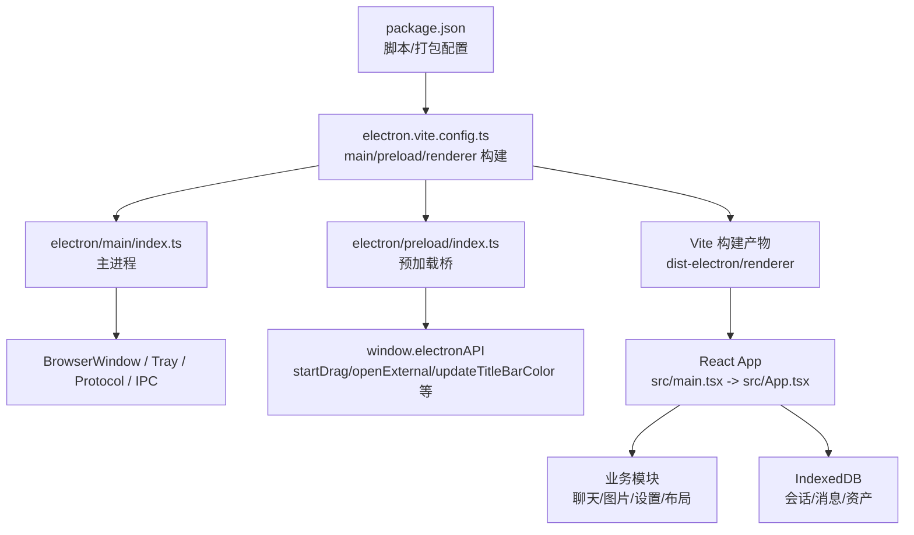
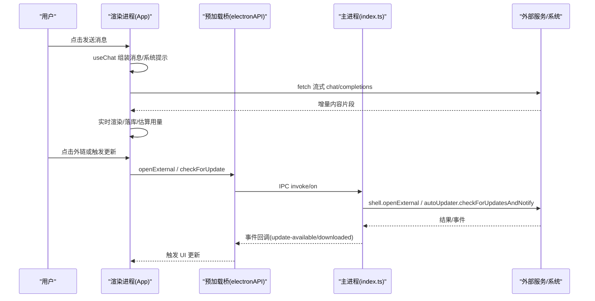
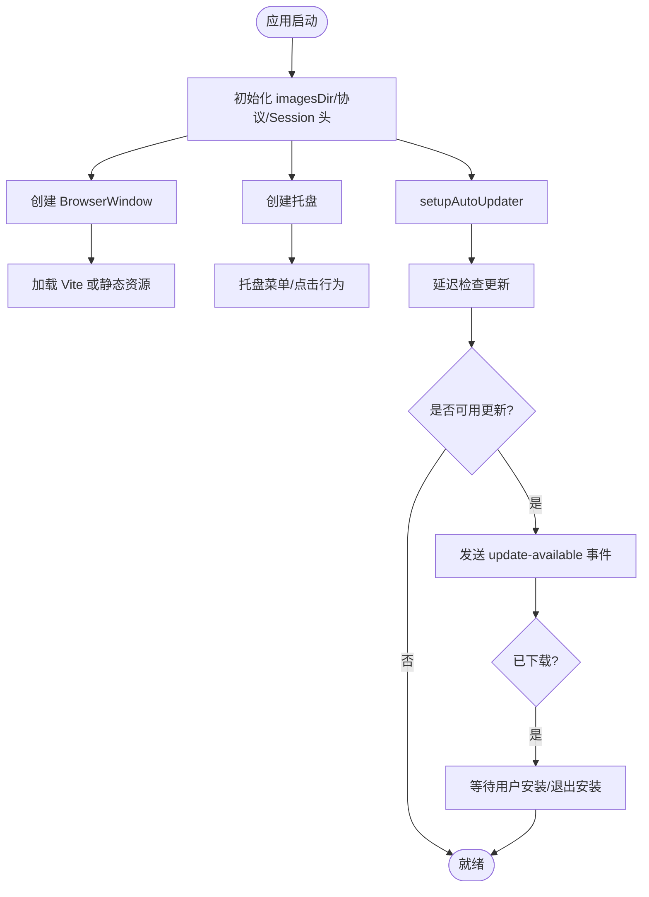
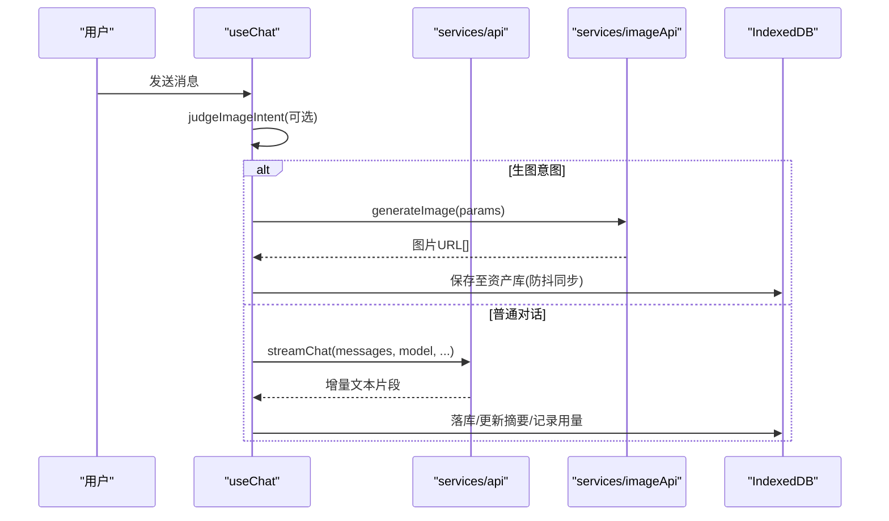
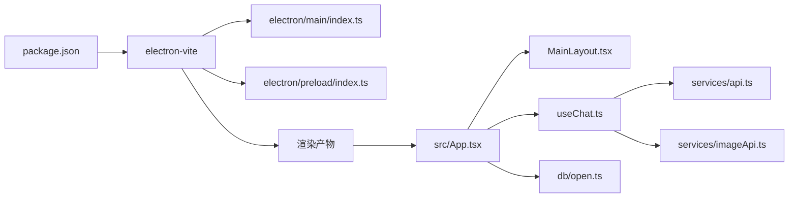

# Electron 桌面应用

<cite>
**本文引用的文件**
- [package.json](file://package.json)
- [README.md](file://README.md)
- [electron/main/index.ts](file://electron/main/index.ts)
- [electron/preload/index.ts](file://electron/preload/index.ts)
- [electron.vite.config.ts](file://electron.vite.config.ts)
- [vite.config.ts](file://vite.config.ts)
- [capacitor.config.ts](file://capacitor.config.ts)
- [src/main.tsx](file://src/main.tsx)
- [src/App.tsx](file://src/App.tsx)
- [src/services/api.ts](file://src/services/api.ts)
- [src/hooks/useChat.ts](file://src/hooks/useChat.ts)
- [src/components/layout/MainLayout.tsx](file://src/components/layout/MainLayout.tsx)
- [src/db/open.ts](file://src/db/open.ts)
</cite>

## 目录
1. [简介](#简介)
2. [项目结构](#项目结构)
3. [核心组件](#核心组件)
4. [架构总览](#架构总览)
5. [详细组件分析](#详细组件分析)
6. [依赖关系分析](#依赖关系分析)
7. [性能考量](#性能考量)
8. [故障排查指南](#故障排查指南)
9. [结论](#结论)
10. [附录](#附录)

## 简介
本项目是一个基于 React + TypeScript + Vite 的跨端 AI 助手应用，同时支持 Web、Electron 桌面与 Android（Capacitor）。在桌面端通过 Electron 提供原生能力：托盘、自动更新、本地图片拖拽、标题栏主题同步、外链打开等；在移动端通过 Capacitor 接入系统状态栏、返回键等。应用核心功能包括聊天流式对话、图片生成、资产库管理、角色与提示词配置、上下文压缩与检索、BYOC 云端同步等。

## 项目结构
- 构建与打包
  - electron-vite 将 main、preload、renderer 分别构建到 dist-electron，主入口为 dist-electron/main/index.js。
  - Vite 负责渲染层开发/构建，启用 React 与 Tailwind。
  - package.json 定义 Windows NSIS 打包与 GitHub 发布源，用于 electron-updater 自动更新。
- 运行时
  - Electron 主进程负责窗口、托盘、协议、CORS 头注入、自动更新与 IPC。
  - Preload 暴露安全 API 给渲染进程（拖拽、外链、更新、ESC 事件转发）。
  - 渲染进程使用 React 组织页面与业务逻辑，IndexedDB 持久化数据。
- 多端适配
  - 通过 useDeviceMode 与 isNativePlatform 判断运行环境，切换布局与平台能力。
  - Capacitor 配置关闭 SystemBars 自动 inset，由原生侧注入 CSS 变量处理边距。

图表来源
- [package.json:1-97](file://package.json#L1-L97)
- [electron.vite.config.ts:1-49](file://electron.vite.config.ts#L1-L49)
- [electron/main/index.ts:1-285](file://electron/main/index.ts#L1-L285)
- [electron/preload/index.ts:1-25](file://electron/preload/index.ts#L1-L25)
- [src/main.tsx:1-8](file://src/main.tsx#L1-L8)
- [src/App.tsx:1-303](file://src/App.tsx#L1-L303)

章节来源
- [package.json:1-97](file://package.json#L1-L97)
- [electron.vite.config.ts:1-49](file://electron.vite.config.ts#L1-L49)
- [vite.config.ts:1-18](file://vite.config.ts#L1-L18)
- [capacitor.config.ts:1-18](file://capacitor.config.ts#L1-L18)

## 核心组件
- 主进程（Electron）
  - 窗口与托盘：隐藏默认菜单、自定义标题栏覆盖色、最小化到托盘、点击托盘显示窗口。
  - 协议与网络：注册 local-image:// 协议读取本地图片；默认 session 注入 CORS 响应头以绕过跨域限制。
  - 自动更新：集成 electron-updater，启动后延迟检查更新，下载完成通知渲染进程。
  - IPC：open-external、update-titlebar-color、image:native-drag、app:check-update、app:install-update、app:escape。
- 预加载桥
  - 暴露 startDrag、openExternal、updateTitleBarColor、checkForUpdate、installUpdate、onUpdateAvailable、onUpdateDownloaded、onAppEscape。
- 渲染进程（React）
  - App 初始化：加载主题/模式、同步标题栏颜色、Android 状态栏样式与高度、申请持久化存储、启动 BYOC 自动同步。
  - 更新提示：监听 update-downloaded 并展示 UpdateNotification。
  - 外链处理：拦截 target="_blank" 链接交由系统浏览器打开。
  - 聊天与图片：useChat 编排流式对话、意图识别、生图流程、上下文压缩、用量统计与持久化。
  - 布局：MainLayout 根据设备形态切换桌面/移动布局，处理侧边栏手势、键盘遮挡、输入框聚焦等。
- 数据与存储
  - IndexedDB：会话、消息、Blob、上下文节点/计划、检索索引、图片历史等对象仓库与索引。
  - 连接与迁移：idb 封装，版本升级时按需创建 store 与索引，失败重连策略。

章节来源
- [electron/main/index.ts:1-285](file://electron/main/index.ts#L1-L285)
- [electron/preload/index.ts:1-25](file://electron/preload/index.ts#L1-L25)
- [src/App.tsx:1-303](file://src/App.tsx#L1-L303)
- [src/components/layout/MainLayout.tsx:1-295](file://src/components/layout/MainLayout.tsx#L1-L295)
- [src/db/open.ts:1-56](file://src/db/open.ts#L1-L56)

## 架构总览
应用采用“主进程 + 预加载桥 + 渲染进程”的经典三层架构。渲染进程通过 React 组织 UI 与业务逻辑，调用服务层进行 API 请求与数据处理，使用 IndexedDB 做本地持久化。主进程提供系统级能力并通过 IPC 暴露给渲染进程。

图表来源
- [src/hooks/useChat.ts:1-200](file://src/hooks/useChat.ts#L1-L200)
- [src/services/api.ts:1-173](file://src/services/api.ts#L1-L173)
- [electron/preload/index.ts:1-25](file://electron/preload/index.ts#L1-L25)
- [electron/main/index.ts:1-285](file://electron/main/index.ts#L1-L285)

## 详细组件分析

### 主进程：窗口、托盘、协议与自动更新
- 窗口与标题栏
  - 隐藏默认菜单，使用 titleBarOverlay 实现深色主题标题栏覆盖。
  - 开发模式加载 Vite dev server，生产模式加载打包后的 index.html。
  - 拦截 F12/Ctrl+Shift+I 打开 DevTools，Escape 转发给渲染进程。
  - 关闭按钮默认最小化到托盘，而非退出。
- 托盘
  - 动态选择图标路径（资源包内或开发目录），提供“显示主窗口/退出”菜单。
  - 点击托盘图标显示/聚焦窗口。
- 协议与网络
  - 注册 local-image:// 协议，映射到 userData/images 下的文件，通过 net.fetch 提供访问。
  - 默认 session 注入 CORS 响应头，允许跨域请求。
- 自动更新
  - 启动后延迟 3 秒检查更新，支持下载完成安装、手动检查更新。
  - 通过 IPC 向渲染进程推送 update-available 与 update-downloaded 事件。

图表来源
- [electron/main/index.ts:1-285](file://electron/main/index.ts#L1-L285)

章节来源
- [electron/main/index.ts:1-285](file://electron/main/index.ts#L1-L285)

### 预加载桥：安全暴露原生能力
- 暴露方法
  - startDrag：同步 IPC 发起原生拖拽，确保在 dragstart 时间窗口内完成。
  - openExternal：使用系统默认浏览器打开外链。
  - updateTitleBarColor：更新标题栏覆盖色以跟随主题。
  - checkForUpdate/installUpdate：触发自动更新检查与安装。
  - onUpdateAvailable/onUpdateDownloaded：订阅主进程事件。
  - onAppEscape：订阅 Escape 按键事件（即使焦点在 iframe 内部）。
- 设计要点
  - 严格使用 contextBridge，避免 nodeIntegration。
  - 对关键操作（如拖拽）使用 sendSync 保证时序。

章节来源
- [electron/preload/index.ts:1-25](file://electron/preload/index.ts#L1-L25)

### 渲染进程：应用初始化与平台能力
- 主题与状态栏
  - 启动时加载主题与亮/暗模式，设置 meta theme-color。
  - 同步 Electron 标题栏颜色；在 Android 壳中设置 StatusBar 样式与背景色，并注入状态栏高度。
- 持久化与同步
  - 申请持久化存储，降低数据被回收概率。
  - 启动 BYOC 自动同步，并在侧边栏打开时触发 safeSync。
- 更新提示与外链
  - 监听 update-downloaded 弹出更新提示。
  - 拦截 target="_blank" 链接，交给系统浏览器打开。
- 聊天图片入库
  - 扫描会话消息中的生成图片，按消息 id 去重保存到资产库，复用 saveImage 的防抖同步机制。

章节来源
- [src/App.tsx:1-303](file://src/App.tsx#L1-L303)

### 聊天与图片工作流：意图识别、流式对话与生图
- 意图分流
  - 使用轻量小模型判断是否为图片生成意图，若命中则回复确认文案并调用图片 API。
- 流式对话
  - 构造 system prompt（含角色/功能开关）、搜索上下文与消息列表，发送流式请求。
  - 解析 usage 字段，兼容不同网关命名差异；不支持 include_usage 时回退重试。
  - 流式输出期间写入串行化，避免同消息多次更新交错。
- 图片生成
  - 根据模型与参数构建请求体，直连提供商图片 API，失败抛出错误并优先取上游 detail/error。
- 上下文压缩与用量
  - 计算 token 用量与上下文占用，规划压缩策略，必要时执行压缩并更新摘要。

图表来源
- [src/hooks/useChat.ts:1-200](file://src/hooks/useChat.ts#L1-L200)
- [src/services/api.ts:1-173](file://src/services/api.ts#L1-L173)
- [src/services/imageApi.ts:140-183](file://src/services/imageApi.ts#L140-L183)
- [src/db/open.ts:1-56](file://src/db/open.ts#L1-L56)

章节来源
- [src/hooks/useChat.ts:1-200](file://src/hooks/useChat.ts#L1-L200)
- [src/services/api.ts:1-173](file://src/services/api.ts#L1-L173)
- [src/services/imageApi.ts:140-183](file://src/services/imageApi.ts#L140-L183)

### 布局与交互：桌面/移动双形态
- 设备模式
  - 通过 useDeviceMode 判断 desktop/mobile，切换 DesktopLayout/MobileLayout。
- 移动端
  - 抽屉侧边栏支持横滑手势，输入框聚焦时隐藏底部导航并滚动到可视区。
  - 处理 Android 返回键：优先消费关闭侧边栏，否则最小化到后台。
- 桌面端
  - 右侧固定历史面板，打开时主动触发一次同步。
  - ESC 关闭侧边栏，与主进程 app:escape 事件联动。

章节来源
- [src/components/layout/MainLayout.tsx:1-295](file://src/components/layout/MainLayout.tsx#L1-L295)
- [src/App.tsx:1-303](file://src/App.tsx#L1-L303)

## 依赖关系分析
- 构建依赖
  - electron-vite：统一构建 main、preload、renderer，外部化依赖提升打包速度。
  - Vite + React + Tailwind：渲染层开发与样式。
  - electron-builder：Windows NSIS 安装包与 GitHub 发布。
- 运行时依赖
  - electron-updater：自动更新。
  - idb：IndexedDB 封装，用于会话/消息/资产等持久化。
  - Capacitor：Android 壳能力（状态栏、返回键、文件系统、相机等）。
- 模块耦合
  - App 层依赖 services（api/settings/byoc/storage）、hooks（useChat/useAssets）、components（布局/聊天/图片/设置）。
  - 主进程与渲染进程通过 preload 桥解耦，仅暴露必要 API。

图表来源
- [package.json:1-97](file://package.json#L1-L97)
- [electron.vite.config.ts:1-49](file://electron.vite.config.ts#L1-L49)
- [src/App.tsx:1-303](file://src/App.tsx#L1-L303)
- [src/components/layout/MainLayout.tsx:1-295](file://src/components/layout/MainLayout.tsx#L1-L295)
- [src/hooks/useChat.ts:1-200](file://src/hooks/useChat.ts#L1-L200)
- [src/services/api.ts:1-173](file://src/services/api.ts#L1-L173)
- [src/services/imageApi.ts:140-183](file://src/services/imageApi.ts#L140-L183)
- [src/db/open.ts:1-56](file://src/db/open.ts#L1-L56)

章节来源
- [package.json:1-97](file://package.json#L1-L97)
- [electron.vite.config.ts:1-49](file://electron.vite.config.ts#L1-L49)

## 性能考量
- 流式输出与落库
  - 流式分片解析与增量渲染，减少首屏等待。
  - 数据库写入按会话串行化，避免同消息并发写导致竞争。
- 网络与缓存
  - 默认注入 CORS 头，简化跨域场景；本地图片通过 local-image:// 协议直接读取，避免重复下载。
  - 图片缩略图缓存于 _drag_thumbs，减少拖拽时的缩放开销。
- 更新与资源
  - 自动更新延迟检查，避免影响首屏加载；静默失败不阻塞主流程。
- 内存与体积
  - electron-vite externalizeDepsPlugin 将大依赖外置，减小主进程体积。
  - 按需加载与懒渲染（如侧边栏、历史面板）降低初始负载。

[本节为通用指导，不直接分析具体文件]

## 故障排查指南
- 无法打开外链
  - 检查 window.electronAPI.openExternal 是否存在（非 Electron 环境会走浏览器默认行为）。
  - 确认主进程已注册 open-external IPC。
- 自动更新无效
  - 确认 electron-updater 配置了正确的发布源（GitHub）。
  - 检查 update-available 与 update-downloaded 事件是否到达渲染进程。
- 图片拖拽失败
  - 确认 imageUrl 为 local-image:// 或 data: 前缀；HTTP URL 不支持同步拖拽。
  - 检查 imagesDir 与 _drag_thumbs 目录权限与存在性。
- 流式对话报错
  - 若网关不支持 include_usage，会自动回退重试；仍失败需检查 API Key 与网络。
  - 注意流结束残留 buffer 的处理，确保 usage 不被丢弃。
- 主题/标题栏颜色不同步
  - 确认 updateTitleBarColor 调用时机与参数正确。
  - 在 Android 壳中检查 StatusBar 样式与背景色设置。

章节来源
- [electron/main/index.ts:1-285](file://electron/main/index.ts#L1-L285)
- [electron/preload/index.ts:1-25](file://electron/preload/index.ts#L1-L25)
- [src/services/api.ts:1-173](file://src/services/api.ts#L1-L173)

## 结论
该项目以 Electron 为核心，结合 React/Vite 与 Capacitor，实现了跨端一致的 AI 助手体验。主进程提供稳定的系统级能力，渲染进程专注业务与交互，数据通过 IndexedDB 持久化，配合 BYOC 实现云端同步。整体架构清晰、职责分明，具备良好的可维护性与扩展性。后续可在以下方面持续优化：更细粒度的错误上报与监控、更多平台的适配与测试、以及针对大数据量场景的性能调优。

[本节为总结性内容，不直接分析具体文件]

## 附录
- 快速开始
  - 开发：使用 vite/electron-vite 启动开发服务器，支持热重载。
  - 构建：执行构建脚本生成 dist-electron 与 dist，再进行打包。
  - 打包：Windows 使用 NSIS，发布到 GitHub Releases 供自动更新。
- 相关文档
  - README 提供模板说明与 ESLint 扩展建议。
  - 桌面重构与 Android Capacitor 文档位于 docs/desktop-refactor。

章节来源
- [README.md:1-74](file://README.md#L1-L74)
- [package.json:1-97](file://package.json#L1-L97)