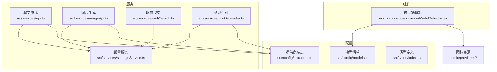
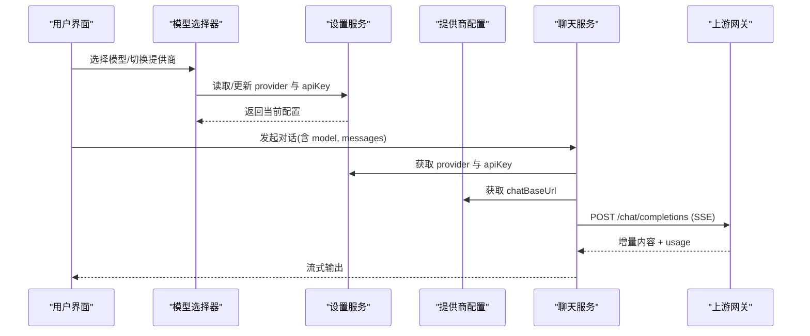
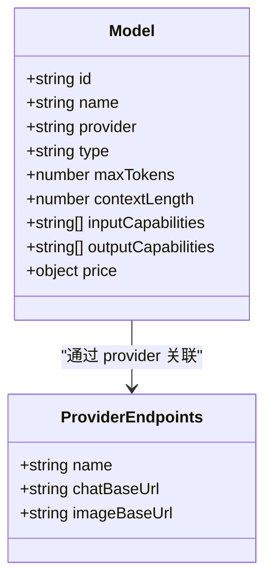
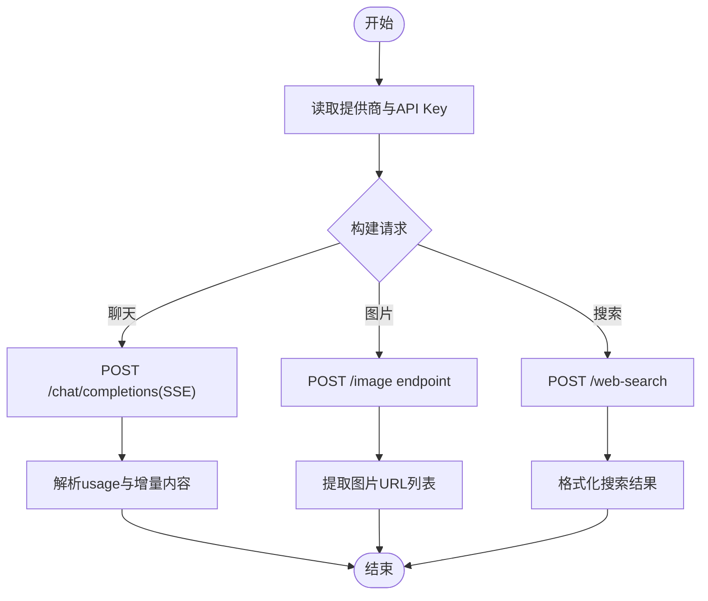
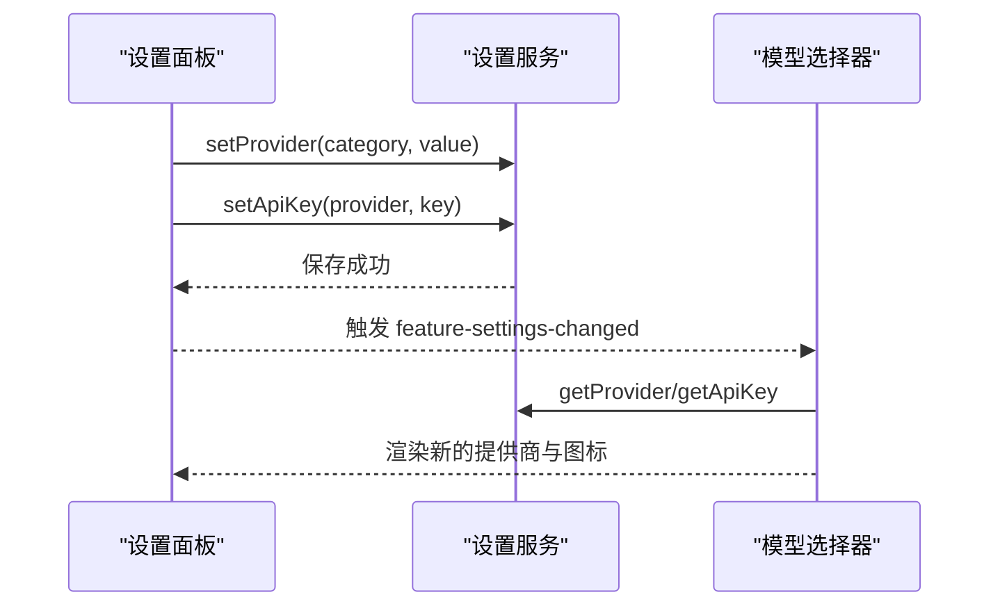
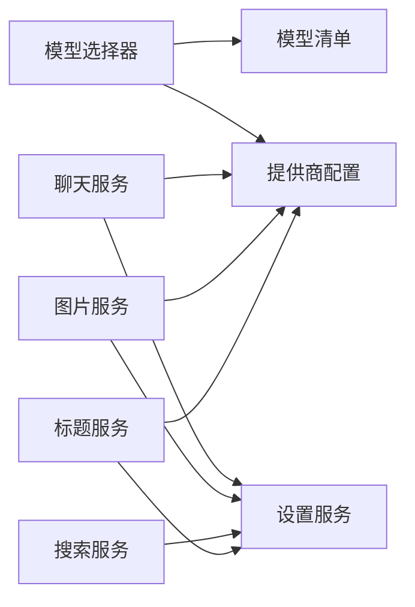

# 扩展点设计

<cite>
**本文引用的文件**
- [package.json](file://package.json)
- [README.md](file://README.md)
- [src/config/models.ts](file://src/config/models.ts)
- [src/types/index.ts](file://src/types/index.ts)
- [src/services/api.ts](file://src/services/api.ts)
- [src/services/imageApi.ts](file://src/services/imageApi.ts)
- [src/services/webSearch.ts](file://src/services/webSearch.ts)
- [src/services/titleGenerator.ts](file://src/services/titleGenerator.ts)
- [src/services/settingsService.ts](file://src/services/settingsService.ts)
- [src/config/providers.ts](file://src/config/providers.ts)
- [src/components/common/ModelSelector.tsx](file://src/components/common/ModelSelector.tsx)
- [public/providers/openai.svg](file://public/providers/openai.svg)
</cite>

## 目录
1. [简介](#简介)
2. [项目结构](#项目结构)
3. [核心组件](#核心组件)
4. [架构总览](#架构总览)
5. [详细组件分析](#详细组件分析)
6. [依赖关系分析](#依赖关系分析)
7. [性能考虑](#性能考虑)
8. [故障排查指南](#故障排查指南)
9. [结论](#结论)
10. [附录](#附录)

## 简介
本设计文档面向 AIShop 项目的可扩展性，聚焦以下目标：
- 模型配置扩展：新增、分组与选择模型的统一机制。
- API 提供商集成：LLM、图片生成、搜索等能力通过提供商配置与密钥管理进行解耦接入。
- 组件扩展机制：前端 UI 与业务逻辑的扩展点（如模型选择器、设置面板）。
- 插件化与动态加载策略：基于运行时配置与模块内映射表实现“零侵入”扩展。
- 扩展开发接口与配置规范：明确类型契约、配置项与调用约定。
- 版本兼容性与向后兼容保证：对上游响应字段、网关差异的兼容策略。
- 扩展开发指南与测试方法：提供可操作的步骤与验证方式。
- 常见扩展场景案例：新增模型、新增提供商、新增搜索引擎等。

## 项目结构
AIShop 采用模块化组织：
- 配置层：模型清单、提供商端点、类型定义。
- 服务层：聊天流式请求、图片生成、联网搜索、标题生成、设置持久化。
- 组件层：模型选择器、设置面板等 UI 扩展点。
- 资源层：各厂商图标资源。

**图示来源**
- [src/config/models.ts:1-284](file://src/config/models.ts#L1-L284)
- [src/config/providers.ts:1-19](file://src/config/providers.ts#L1-L19)
- [src/types/index.ts:109-123](file://src/types/index.ts#L109-L123)
- [src/services/api.ts:44-173](file://src/services/api.ts#L44-L173)
- [src/services/imageApi.ts:1-257](file://src/services/imageApi.ts#L1-L257)
- [src/services/webSearch.ts:1-117](file://src/services/webSearch.ts#L1-L117)
- [src/services/titleGenerator.ts:1-78](file://src/services/titleGenerator.ts#L1-L78)
- [src/services/settingsService.ts:1-101](file://src/services/settingsService.ts#L1-L101)
- [src/components/common/ModelSelector.tsx:1-320](file://src/components/common/ModelSelector.tsx#L1-L320)
- [public/providers/openai.svg](file://public/providers/openai.svg)

**章节来源**
- [package.json:1-47](file://package.json#L1-L47)
- [README.md:1-74](file://README.md#L1-L74)

## 核心组件
- 模型配置与选择
  - 模型清单集中定义，按类型（chat/image/video/music）聚合，并提供按类型查询函数。
  - 模型选择器支持按厂商分组、图标展示与紧凑模式底部弹窗。
- 提供商与端点
  - 提供商端点以键值映射形式维护，默认回退到内置提供商。
  - 设置服务负责存储与读取当前使用的提供商及对应 API Key。
- 能力服务
  - 聊天流式：统一构造消息、处理 SSE 流、解析用量、兼容不同网关字段。
  - 图片生成：按模型路由到具体 endpoint，构建请求体并兼容多种上游响应。
  - 联网搜索：根据设置路由到不同搜索引擎，统一结果格式。
  - 标题生成：复用 LLM 提供商，失败时降级为本地摘要。

**章节来源**
- [src/config/models.ts:1-284](file://src/config/models.ts#L1-L284)
- [src/components/common/ModelSelector.tsx:1-320](file://src/components/common/ModelSelector.tsx#L1-L320)
- [src/config/providers.ts:1-19](file://src/config/providers.ts#L1-L19)
- [src/services/settingsService.ts:1-101](file://src/services/settingsService.ts#L1-L101)
- [src/services/api.ts:44-173](file://src/services/api.ts#L44-L173)
- [src/services/imageApi.ts:1-257](file://src/services/imageApi.ts#L1-L257)
- [src/services/webSearch.ts:1-117](file://src/services/webSearch.ts#L1-L117)
- [src/services/titleGenerator.ts:1-78](file://src/services/titleGenerator.ts#L1-L78)

## 架构总览
系统以“配置驱动 + 服务解耦”的方式实现扩展：
- 配置驱动：模型清单、提供商端点、搜索引擎开关均通过配置或映射表扩展。
- 服务解耦：聊天、图片、搜索、标题各自独立，仅依赖设置服务与提供商配置。
- 动态加载：运行时从设置中读取提供商与密钥，无需修改核心逻辑即可切换能力源。

**图示来源**
- [src/components/common/ModelSelector.tsx:1-320](file://src/components/common/ModelSelector.tsx#L1-L320)
- [src/services/settingsService.ts:1-101](file://src/services/settingsService.ts#L1-L101)
- [src/config/providers.ts:1-19](file://src/config/providers.ts#L1-L19)
- [src/services/api.ts:44-173](file://src/services/api.ts#L44-L173)

## 详细组件分析

### 模型配置扩展
- 数据模型
  - Model 类型包含 id、name、provider、type、maxTokens、contextLength、inputCapabilities、outputCapabilities、price 等字段，用于描述模型能力与计费信息。
- 模型清单
  - CHAT_MODELS、IMAGE_MODELS 等数组集中声明可用模型；getModelsByType 提供按类型查询。
- 选择器与分组
  - 模型选择器按 PROVIDER_GROUP_MAP 分组显示，支持图标映射与紧凑模式。
- 扩展方式
  - 新增模型：在对应清单中添加条目，确保 type 与 capabilities 正确。
  - 新增分组/图标：在 PROVIDER_GROUP_MAP 与 PROVIDER_ICON_MAP 中补充映射。
  - 调整分组顺序：修改 GROUP_ORDER。

**图示来源**
- [src/types/index.ts:109-123](file://src/types/index.ts#L109-L123)
- [src/config/providers.ts:1-19](file://src/config/providers.ts#L1-L19)

**章节来源**
- [src/config/models.ts:1-284](file://src/config/models.ts#L1-L284)
- [src/components/common/ModelSelector.tsx:1-320](file://src/components/common/ModelSelector.tsx#L1-L320)
- [src/types/index.ts:109-123](file://src/types/index.ts#L109-L123)

### API 提供商集成
- 提供商配置
  - PROVIDERS 记录提供商名称与端点基址；getProviderConfig 提供默认回退。
- 设置服务
  - settingsService 管理 llm/image/video/search 四类提供商与对应 API Key，持久化至 localStorage。
- 聊天服务
  - streamChat 读取 provider 与 apiKey，拼接 baseUrl，发送 SSE 请求，兼容 include_usage 参数失败时的重试。
- 图片服务
  - generateImage 按模型映射到具体 endpoint，构建请求体并兼容多种上游响应结构。
- 搜索服务
  - searchWeb 根据设置路由到 bocha 或 tavily，统一 SearchResult 结构。
- 标题服务
  - generateTitle 复用 LLM 提供商，失败时降级为本地摘要。

**图示来源**
- [src/services/api.ts:44-173](file://src/services/api.ts#L44-L173)
- [src/services/imageApi.ts:1-257](file://src/services/imageApi.ts#L1-L257)
- [src/services/webSearch.ts:1-117](file://src/services/webSearch.ts#L1-L117)
- [src/services/titleGenerator.ts:1-78](file://src/services/titleGenerator.ts#L1-L78)
- [src/config/providers.ts:1-19](file://src/config/providers.ts#L1-L19)
- [src/services/settingsService.ts:1-101](file://src/services/settingsService.ts#L1-L101)

**章节来源**
- [src/config/providers.ts:1-19](file://src/config/providers.ts#L1-L19)
- [src/services/settingsService.ts:1-101](file://src/services/settingsService.ts#L1-L101)
- [src/services/api.ts:44-173](file://src/services/api.ts#L44-L173)
- [src/services/imageApi.ts:1-257](file://src/services/imageApi.ts#L1-L257)
- [src/services/webSearch.ts:1-117](file://src/services/webSearch.ts#L1-L117)
- [src/services/titleGenerator.ts:1-78](file://src/services/titleGenerator.ts#L1-L78)

### 组件扩展机制
- 模型选择器
  - 支持非紧凑下拉菜单与紧凑底部弹窗两种形态。
  - 通过 PROVIDER_ICON_MAP 与 PROVIDER_GROUP_MAP 控制图标与分组。
  - 事件回调 onModelChange 暴露选择变更，便于上层状态同步。
- 设置面板
  - 提供提供商切换与 API Key 输入，实时保存到设置服务。
  - 触发 feature-settings-changed 事件通知其他模块刷新。

**图示来源**
- [src/components/common/ModelSelector.tsx:1-320](file://src/components/common/ModelSelector.tsx#L1-L320)
- [src/services/settingsService.ts:1-101](file://src/services/settingsService.ts#L1-L101)

**章节来源**
- [src/components/common/ModelSelector.tsx:1-320](file://src/components/common/ModelSelector.tsx#L1-L320)

### 插件架构模式与动态加载策略
- 插件化模式
  - 提供商与模型均以“配置+映射表”的形式存在，新增能力只需扩展配置，无需改动核心流程。
- 动态加载
  - 运行时从设置服务读取当前提供商与密钥，服务层据此决定请求地址与鉴权头。
  - 图片生成按模型映射到不同 endpoint，搜索按提供商路由到不同引擎。
- 扩展点总结
  - 模型清单扩展：新增 Model 条目。
  - 提供商端点扩展：在 PROVIDERS 添加新键值。
  - 搜索引擎扩展：在 webSearch 中新增分支与适配。
  - 图标与分组扩展：在 ModelSelector 的映射表中补充。

**章节来源**
- [src/config/models.ts:1-284](file://src/config/models.ts#L1-L284)
- [src/config/providers.ts:1-19](file://src/config/providers.ts#L1-L19)
- [src/services/webSearch.ts:1-117](file://src/services/webSearch.ts#L1-L117)
- [src/services/imageApi.ts:1-257](file://src/services/imageApi.ts#L1-L257)
- [src/components/common/ModelSelector.tsx:1-320](file://src/components/common/ModelSelector.tsx#L1-L320)

## 依赖关系分析
- 低耦合高内聚
  - 服务层只依赖设置服务与提供商配置，不直接耦合具体上游实现细节。
  - 组件层通过 props 与事件与业务解耦。
- 外部依赖
  - 第三方 SDK 与库由 package.json 管理，Vite 构建工具链。
- 潜在循环依赖
  - 当前结构未发现循环导入；服务与配置单向依赖。

**图示来源**
- [src/components/common/ModelSelector.tsx:1-320](file://src/components/common/ModelSelector.tsx#L1-L320)
- [src/config/models.ts:1-284](file://src/config/models.ts#L1-L284)
- [src/config/providers.ts:1-19](file://src/config/providers.ts#L1-L19)
- [src/services/api.ts:44-173](file://src/services/api.ts#L44-L173)
- [src/services/imageApi.ts:1-257](file://src/services/imageApi.ts#L1-L257)
- [src/services/webSearch.ts:1-117](file://src/services/webSearch.ts#L1-L117)
- [src/services/titleGenerator.ts:1-78](file://src/services/titleGenerator.ts#L1-L78)
- [src/services/settingsService.ts:1-101](file://src/services/settingsService.ts#L1-L101)

**章节来源**
- [package.json:1-47](file://package.json#L1-L47)

## 性能考虑
- 流式传输
  - 聊天使用 SSE 增量输出，降低首屏延迟。
  - 图片生成设置超时与信号合并，避免长时间阻塞。
- 兼容性开销
  - 用量解析与响应结构兼容带来少量额外计算，但提升稳定性。
- 内存与网络
  - 图片在发送前按需内联，避免提前加载整段历史。
  - 搜索与标题生成失败时快速降级，减少等待。

[本节为通用指导，不直接分析具体文件]

## 故障排查指南
- 未配置 API Key
  - 现象：聊天或图片请求报错提示需配置密钥。
  - 处理：在设置面板中填写对应提供商的 API Key。
- 上游不支持 include_usage
  - 现象：首次带 usage 参数请求失败，自动重试不带 usage 的请求。
  - 处理：无需干预，已内置兼容逻辑。
- 图片生成无返回 URL
  - 现象：抛出“未返回图片地址”。
  - 处理：检查上游响应结构与 extractUrls 兼容范围。
- 搜索结果为空
  - 现象：返回空数组并打印警告。
  - 处理：确认搜索提供商 API Key 是否配置且有效。

**章节来源**
- [src/services/api.ts:57-118](file://src/services/api.ts#L57-L118)
- [src/services/imageApi.ts:149-243](file://src/services/imageApi.ts#L149-L243)
- [src/services/webSearch.ts:23-36](file://src/services/webSearch.ts#L23-L36)

## 结论
AIShop 通过“配置驱动 + 服务解耦”的架构实现了良好的可扩展性：
- 模型配置与选择机制清晰，易于新增模型与分组。
- 提供商与密钥管理解耦，支持多能力域的统一接入。
- 服务层对上游差异具备良好兼容，保障稳定性。
- 组件层提供直观的扩展点，便于 UI 与业务联动。
建议后续继续完善：
- 增加更多提供商与模型清单。
- 扩展搜索引擎与图片模型支持。
- 完善错误码与监控埋点，提升可观测性。

[本节为总结性内容，不直接分析具体文件]

## 附录

### 扩展开发接口与配置规范
- 模型类型与字段
  - 参考 Model 类型定义，确保新增模型具备必要字段与能力声明。
- 提供商配置
  - 在 PROVIDERS 中新增键值，并在设置服务中保持默认值一致。
- 搜索引擎
  - 在 webSearch 中新增分支，实现统一 SearchResult 结构。
- 图标与分组
  - 在 ModelSelector 的映射表中补充图标文件名与分组名。

**章节来源**
- [src/types/index.ts:109-123](file://src/types/index.ts#L109-L123)
- [src/config/providers.ts:1-19](file://src/config/providers.ts#L1-L19)
- [src/services/webSearch.ts:1-117](file://src/services/webSearch.ts#L1-L117)
- [src/components/common/ModelSelector.tsx:1-320](file://src/components/common/ModelSelector.tsx#L1-L320)

### 版本兼容性与向后兼容保证
- 上游字段兼容
  - 聊天用量解析兼容多种字段命名，避免因网关差异导致失败。
- 请求参数兼容
  - 当上游不支持 include_usage 时自动降级重试。
- 响应结构兼容
  - 图片生成兼容多种返回结构，提取 URL 列表。
- 设置迁移
  - 设置服务提供默认值与合并策略，保证旧配置仍可运行。

**章节来源**
- [src/services/api.ts:17-42](file://src/services/api.ts#L17-L42)
- [src/services/api.ts:102-118](file://src/services/api.ts#L102-L118)
- [src/services/imageApi.ts:25-63](file://src/services/imageApi.ts#L25-L63)
- [src/services/settingsService.ts:44-57](file://src/services/settingsService.ts#L44-L57)

### 扩展开发指南与测试方法
- 新增模型
  - 在模型清单中添加条目，确保 type 与 capabilities 正确；在 ModelSelector 中补充图标与分组。
- 新增提供商
  - 在 PROVIDERS 中添加端点；在设置服务中保持默认值；在各服务中通过 getProviderConfig 获取基址。
- 新增搜索引擎
  - 在 webSearch 中新增分支，实现统一 SearchResult；在设置面板中提供选项。
- 测试方法
  - 单元测试：针对 parseUsage、extractUrls、formatSearchResultsForContext 等纯函数编写用例。
  - 集成测试：模拟上游响应，验证流式解析与错误降级。
  - 端到端测试：在设置面板切换提供商与密钥，验证聊天与图片功能。

**章节来源**
- [src/config/models.ts:1-284](file://src/config/models.ts#L1-L284)
- [src/config/providers.ts:1-19](file://src/config/providers.ts#L1-L19)
- [src/services/webSearch.ts:107-117](file://src/services/webSearch.ts#L107-L117)
- [src/services/api.ts:17-42](file://src/services/api.ts#L17-L42)
- [src/services/imageApi.ts:25-63](file://src/services/imageApi.ts#L25-L63)

### 常见扩展场景实现案例
- 新增聊天模型
  - 在模型清单中添加条目，设置 provider、type、capabilities 与价格信息；在 ModelSelector 中补充图标与分组。
- 新增图片模型
  - 在 IMAGE_ENDPOINTS 中新增模型到 endpoint 的映射；在 buildImageRequestBody 中适配请求体；在 extractUrls 中兼容响应。
- 新增搜索引擎
  - 在 webSearch 中新增分支，实现统一 SearchResult；在设置面板中提供选项；在 settingsService 中保持默认值。
- 新增提供商端点
  - 在 PROVIDERS 中添加新键值；在各服务中通过 getProviderConfig 获取基址；在设置面板中提供选项。

**章节来源**
- [src/config/models.ts:1-284](file://src/config/models.ts#L1-L284)
- [src/services/imageApi.ts:6-19](file://src/services/imageApi.ts#L6-L19)
- [src/services/imageApi.ts:66-143](file://src/services/imageApi.ts#L66-L143)
- [src/services/webSearch.ts:23-36](file://src/services/webSearch.ts#L23-L36)
- [src/config/providers.ts:7-13](file://src/config/providers.ts#L7-L13)