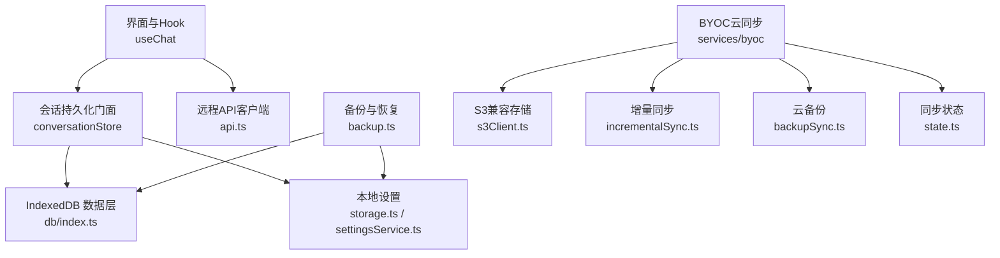
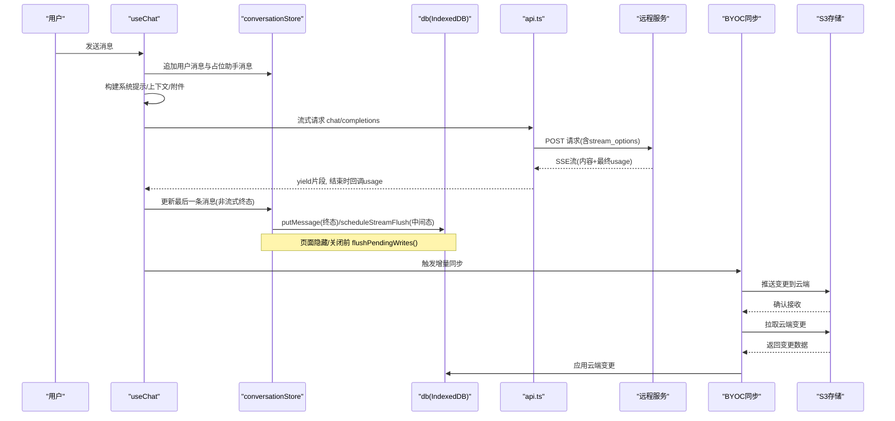
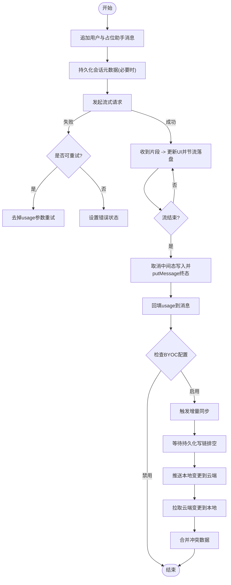
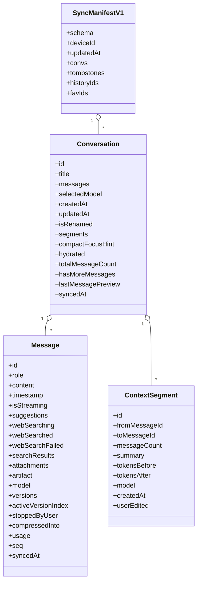
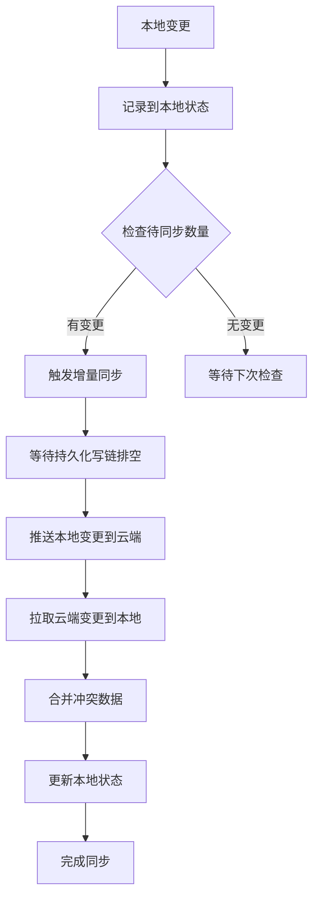
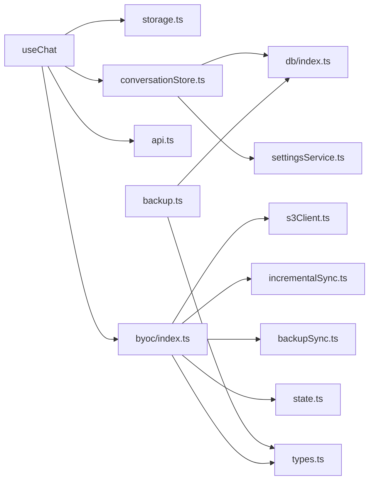

# 数据同步机制

<cite>
**本文引用的文件**
- [src/services/storage.ts](file://src/services/storage.ts)
- [src/services/settingsService.ts](file://src/services/settingsService.ts)
- [src/services/conversationStore.ts](file://src/services/conversationStore.ts)
- [src/db/index.ts](file://src/db/index.ts)
- [src/hooks/useChat.ts](file://src/hooks/useChat.ts)
- [src/services/api.ts](file://src/services/api.ts)
- [src/types/index.ts](file://src/types/index.ts)
- [src/services/backup.ts](file://src/services/backup.ts)
- [src/config/version.ts](file://src/config/version.ts)
- [src/services/byoc/index.ts](file://src/services/byoc/index.ts)
- [src/services/byoc/incrementalSync.ts](file://src/services/byoc/incrementalSync.ts)
- [src/services/byoc/backupSync.ts](file://src/services/byoc/backupSync.ts)
- [src/services/byoc/state.ts](file://src/services/byoc/state.ts)
- [src/services/byoc/types.ts](file://src/services/byoc/types.ts)
- [src/services/byoc/s3Client.ts](file://src/services/byoc/s3Client.ts)
- [src/components/settings/ByocSettings.tsx](file://src/components/settings/ByocSettings.tsx)
- [src/App.tsx](file://src/App.tsx)
</cite>

## 更新摘要
**变更内容**
- 修复了BYOC自动同步竞态条件问题，增强了流式保护机制
- 改进了会话合并逻辑，现在优先使用内存中的会话而非数据库快照，防止同步操作期间流式状态丢失
- 优化了持久化写链处理，确保在同步前等待队列排空
- 增强了流式中间态的保护机制，避免被数据库快照覆盖导致UI显示异常

## 目录
1. [简介](#简介)
2. [项目结构](#项目结构)
3. [核心组件](#核心组件)
4. [架构总览](#架构总览)
5. [详细组件分析](#详细组件分析)
6. [依赖关系分析](#依赖关系分析)
7. [性能考量](#性能考量)
8. [故障排查指南](#故障排查指南)
9. [结论](#结论)
10. [附录](#附录)

## 简介
本文件面向 AIShop 项目的"数据同步机制"，聚焦本地存储与远程数据的一致性保证、会话数据的持久化策略与版本管理、数据冲突解决算法与同步触发条件、离线模式支持、数据迁移与备份恢复，以及数据完整性验证与同步状态监控方法。文档以代码级实现为依据，提供可视化图示与可操作建议，帮助读者理解并扩展该机制。

**更新** 新增了BYOC（Bring Your Own Cloud）云同步能力，支持用户自带S3兼容存储服务，实现跨设备的数据同步与协作。最新改进包括修复自动同步竞态条件和增强流式保护机制。

## 项目结构
AIShop 的数据层采用"内存会话 + IndexedDB 持久化 + 可选远程服务"的分层设计：
- 内存会话由 React Hook 维护，负责 UI 渲染与交互。
- 持久化通过 services/conversationStore 将内存会话与 db/* 的 IndexedDB 进行 diff 写入，避免全量覆盖导致的卡顿。
- 设置与首屏关键配置使用 localStorage（轻量、同步）。
- 远程调用通过 services/api 发起流式请求，并在完成后回填用量等元信息。
- 备份与恢复通过 services/backup 实现跨设备、抗浏览器清理的离线能力。
- **新增** BYOC云同步通过 services/byoc 提供增量同步、全量备份、自动调度等功能。

**图表来源**
- [src/hooks/useChat.ts:152-337](file://src/hooks/useChat.ts#L152-L337)
- [src/services/conversationStore.ts:1-114](file://src/services/conversationStore.ts#L1-L114)
- [src/db/index.ts:1-98](file://src/db/index.ts#L1-L98)
- [src/services/storage.ts:1-63](file://src/services/storage.ts#L1-L63)
- [src/services/settingsService.ts:1-101](file://src/services/settingsService.ts#L1-L101)
- [src/services/api.ts:44-173](file://src/services/api.ts#L44-L173)
- [src/services/backup.ts:101-257](file://src/services/backup.ts#L101-L257)
- [src/services/byoc/index.ts:1-211](file://src/services/byoc/index.ts#L1-L211)

**章节来源**
- [src/hooks/useChat.ts:152-337](file://src/hooks/useChat.ts#L152-L337)
- [src/services/conversationStore.ts:1-114](file://src/services/conversationStore.ts#L1-L114)
- [src/db/index.ts:1-98](file://src/db/index.ts#L1-L98)
- [src/services/storage.ts:1-63](file://src/services/storage.ts#L1-L63)
- [src/services/settingsService.ts:1-101](file://src/services/settingsService.ts#L1-L101)
- [src/services/api.ts:44-173](file://src/services/api.ts#L44-L173)
- [src/services/backup.ts:101-257](file://src/services/backup.ts#L101-L257)
- [src/services/byoc/index.ts:1-211](file://src/services/byoc/index.ts#L1-L211)

## 核心组件
- 会话持久化门面（conversationStore）：负责会话列表加载、按需水合、消息增量写入、压缩区间同步、流式落盘节流与页面关闭时强制刷盘。
- 数据层（db/index.ts）：统一导出 IndexedDB 相关能力，包括会话、消息、上下文节点、Blob 等。
- 本地设置（storage.ts、settingsService.ts）：保存模型选择、搜索开关、主题、提供商与密钥、压缩阈值等。
- 远程客户端（api.ts）：流式对话请求、用量解析、失败重试与错误处理。
- 备份与恢复（backup.ts）：导出为自包含 JSON（图片内联 base64），恢复时重建会话、消息与上下文节点，并做版本校验。
- **新增** BYOC云同步（byoc/index.ts）：统一的云同步入口，提供增量同步、全量备份、自动调度等功能。
- **新增** 增量同步引擎（incrementalSync.ts）：基于时间戳的双向同步，支持冲突解决和墓碑传播。
- **新增** 云备份层（backupSync.ts）：复用现有备份格式推送到云端。
- **新增** 同步状态管理（state.ts）：管理设备ID、清单缓存、本地墓碑等状态。
- **新增** S3客户端（s3Client.ts）：纯前端SigV4签名，零依赖访问S3兼容存储。
- **新增** 类型定义（types.ts）：BYOC配置、同步结果、进度回调等类型。
- **新增** 设置界面（ByocSettings.tsx）：用户配置云存储连接参数。

**章节来源**
- [src/services/conversationStore.ts:1-348](file://src/services/conversationStore.ts#L1-L348)
- [src/db/index.ts:1-98](file://src/db/index.ts#L1-L98)
- [src/services/storage.ts:1-63](file://src/services/storage.ts#L1-L63)
- [src/services/settingsService.ts:1-101](file://src/services/settingsService.ts#L1-L101)
- [src/services/api.ts:44-173](file://src/services/api.ts#L44-L173)
- [src/services/backup.ts:101-257](file://src/services/backup.ts#L101-L257)
- [src/services/byoc/index.ts:1-211](file://src/services/byoc/index.ts#L1-L211)
- [src/services/byoc/incrementalSync.ts:1-656](file://src/services/byoc/incrementalSync.ts#L1-L656)
- [src/services/byoc/backupSync.ts:1-69](file://src/services/byoc/backupSync.ts#L1-L69)
- [src/services/byoc/state.ts:1-97](file://src/services/byoc/state.ts#L1-L97)
- [src/services/byoc/types.ts:1-99](file://src/services/byoc/types.ts#L1-L99)
- [src/services/byoc/s3Client.ts:1-291](file://src/services/byoc/s3Client.ts#L1-L291)
- [src/components/settings/ByocSettings.tsx:1-180](file://src/components/settings/ByocSettings.tsx#L1-L180)

## 架构总览
下图展示从用户输入到本地持久化与远程调用的完整流程，以及新增的BYOC云同步流程。

**图表来源**
- [src/hooks/useChat.ts:494-783](file://src/hooks/useChat.ts#L494-L783)
- [src/services/conversationStore.ts:153-257](file://src/services/conversationStore.ts#L153-L257)
- [src/services/api.ts:44-173](file://src/services/api.ts#L44-L173)
- [src/services/byoc/index.ts:89-123](file://src/services/byoc/index.ts#L89-L123)
- [src/services/byoc/incrementalSync.ts:139-323](file://src/services/byoc/incrementalSync.ts#L139-L323)

## 详细组件分析

### 本地存储与远程数据一致性保证
- 一致性目标：确保 UI 显示、IndexedDB 与远程服务返回的用量/结果保持一致；在网络异常或中断时不丢失用户输入与最终回答。
- 关键策略：
  - 先写本地再发请求：用户消息与占位助手消息立即进入内存并触发持久化，避免进程被杀导致丢失提问。
  - 流式中间态节流落盘：按 1s 间隔合并写入，降低 I/O 压力；页面隐藏/关闭时强制刷盘。
  - 终态覆盖：流结束后取消挂起的中间态写入，直接 putMessage 最终内容，保证幂等。
  - 用量回填：远程响应结束回调真实 usage，写入消息元信息，便于后续成本统计与缓存命中率评估。
  - 失败回退：当网关不支持 stream_options 时自动重试不带 usage 的请求，确保对话不中断。
  - **新增** BYOC云同步：基于时间戳的双向同步，支持冲突解决和墓碑传播，确保多设备数据一致性。
  - **更新** 竞态条件修复：在自动同步前等待持久化写链排空，避免读取中间态数据。

**图表来源**
- [src/services/conversationStore.ts:153-257](file://src/services/conversationStore.ts#L153-L257)
- [src/services/api.ts:84-173](file://src/services/api.ts#L84-L173)
- [src/hooks/useChat.ts:678-740](file://src/hooks/useChat.ts#L678-L740)
- [src/services/byoc/index.ts:89-123](file://src/services/byoc/index.ts#L89-L123)

**章节来源**
- [src/services/conversationStore.ts:153-257](file://src/services/conversationStore.ts#L153-L257)
- [src/services/api.ts:84-173](file://src/services/api.ts#L84-L173)
- [src/hooks/useChat.ts:678-740](file://src/hooks/useChat.ts#L678-L740)
- [src/services/byoc/index.ts:89-123](file://src/services/byoc/index.ts#L89-L123)

### 会话数据的持久化策略与版本管理
- 启动恢复：读取会话列表（仅元数据），优先恢复上次停留的会话；若有效则水合最近消息与上下文节点。
- 增量写入：比较前后两版 Conversation，仅对变化的消息执行 append/put/delete；未加载的会话不参与 diff。
- 压缩区间同步：新增/修改/撤销 ContextSegment 时，同步到 contextNodes，并标记原文 compressedInto。
- 版本兼容：备份文件带版本号，恢复时校验应用标签与版本上限，防止不兼容数据破坏现有库。
- **新增** BYOC版本管理：云端清单记录每个会话的最后更新时间戳，用于判断是否需要拉取变更。
- **更新** 内存优先策略：在会话合并时优先使用内存中的会话数据，防止流式状态丢失。

**图表来源**
- [src/types/index.ts:13-175](file://src/types/index.ts#L13-L175)
- [src/services/byoc/types.ts:61-78](file://src/services/byoc/types.ts#L61-L78)

**章节来源**
- [src/hooks/useChat.ts:195-337](file://src/hooks/useChat.ts#L195-L337)
- [src/services/conversationStore.ts:64-114](file://src/services/conversationStore.ts#L64-L114)
- [src/services/conversationStore.ts:184-336](file://src/services/conversationStore.ts#L184-L336)
- [src/services/backup.ts:185-247](file://src/services/backup.ts#L185-L247)
- [src/services/byoc/types.ts:61-78](file://src/services/byoc/types.ts#L61-L78)

### 数据冲突解决算法与同步触发条件
- 冲突场景：多端或多标签页同时编辑同一会话；网络抖动导致部分写入失败；流式中间态与终态竞争。
- 解决策略：
  - 基于消息 id 的幂等写入：putMessage 以消息 id 为主键，重复写入不会造成重复记录。
  - 差异对比：persistConversation 通过 messageChanged 判断是否需要重写，减少并发冲突面。
  - 流式中间态去抖：scheduleStreamFlush 合并短时间内的多次写入，避免争用。
  - 终态覆盖：流结束后 cancelStreamFlush 并直接 putMessage，保证最终一致。
  - **新增** BYOC冲突解决：
    - 会话元数据：last-write-wins（updatedAt 大者胜）
    - 消息数据：按 msgId 去重，updatedAt 大者胜
    - 删除操作：通过墓碑（tombstone）机制传播删除
    - 序列号冲突：检测并调整 seq 避免覆盖
  - **更新** 竞态条件防护：在同步前等待持久化写链完成，避免读取中间态数据。
- 触发条件：
  - 会话元数据变化（标题、模型、收藏、焦点提示）触发 patchConversationMeta。
  - 新增/删除/更新消息触发 append/put/delete。
  - 压缩区间变更触发 persistSegments。
  - 页面隐藏/关闭触发 flushPendingWrites。
  - **新增** BYOC触发：
    - 变更后自动同步（3秒防抖）：会话/消息/角色变更（useChat）与我的库资产变更（useAssets 保存/删除/重命名）
    - 60秒周期轮询
    - 页面可见性变化
    - 手动触发同步

**章节来源**
- [src/services/conversationStore.ts:116-257](file://src/services/conversationStore.ts#L116-L257)
- [src/services/conversationStore.ts:288-348](file://src/services/conversationStore.ts#L288-L348)
- [src/services/byoc/incrementalSync.ts:196-323](file://src/services/byoc/incrementalSync.ts#L196-L323)
- [src/services/byoc/incrementalSync.ts:443-582](file://src/services/byoc/incrementalSync.ts#L443-L582)
- [src/hooks/useChat.ts:410-433](file://src/hooks/useChat.ts#L410-L433)

### 离线模式支持
- 完全离线可用：所有核心读写在 IndexedDB，无需网络即可浏览历史、继续对话（若无远程模型则无法生成新回复）。
- 流式保护：即使切后台或崩溃，也能保留用户提问与已落盘的中间态片段。
- 备份独立：备份文件自包含（图片内联 base64），可在无网络环境下导出/导入。
- **新增** BYOC离线支持：
  - 本地状态缓存：设备ID、云端清单、本地墓碑等状态存储在IndexedDB
  - 待同步队列：记录需要推送的变更，网络恢复后自动同步
  - 断点续传：支持中断后的增量同步

**章节来源**
- [src/services/conversationStore.ts:153-257](file://src/services/conversationStore.ts#L153-L257)
- [src/services/backup.ts:101-171](file://src/services/backup.ts#L101-L171)
- [src/services/byoc/state.ts:22-97](file://src/services/byoc/state.ts#L22-L97)

### 数据迁移与备份恢复
- 备份格式：app 标签、version、exportedAt、conversations（meta + messages + nodes），图片以 data URL 内联。
- 恢复流程：校验 app 与 version；为每条消息与新会话分配新 id；重映射 sourceMessageIds 与 derivedFrom；批量写入消息与节点。
- 兼容性：版本过新拒绝恢复；缺失字段跳过并计数 skipped。
- **新增** BYOC备份恢复：
  - 全量备份：复用现有备份格式推送到云端，支持时间戳命名
  - 增量同步：基于时间戳的差异同步，只传输变更数据
  - 云端清单：维护完整的对象索引，支持快速定位和恢复

**章节来源**
- [src/services/backup.ts:30-45](file://src/services/backup.ts#L30-L45)
- [src/services/backup.ts:185-257](file://src/services/backup.ts#L185-L257)
- [src/services/byoc/backupSync.ts:33-68](file://src/services/byoc/backupSync.ts#L33-L68)
- [src/services/byoc/incrementalSync.ts:139-323](file://src/services/byoc/incrementalSync.ts#L139-L323)

### 数据完整性验证
- 本地校验：
  - 备份文件结构校验（app、version、conversations 数组）。
  - 恢复时对缺失字段进行跳过与计数。
- 远程校验：
  - usage 解析兜底：兼容不同网关字段命名，取不到则忽略，不影响主流程。
  - 失败重试：不支持 stream_options 时自动降级重试。
- 运行时校验：
  - 流式分片解析失败跳过，避免阻塞。
  - 页面隐藏/关闭前强制刷盘，降低数据丢失风险。
- **新增** BYOC完整性验证：
  - 云端清单校验：验证 schema、deviceId、updatedAt 等关键字段
  - 对象存在性检查：HEAD请求探测对象是否存在
  - 内容寻址去重：基于blobId的内容哈希，避免重复传输
  - 序列号冲突检测：检测并调整消息seq避免覆盖

**章节来源**
- [src/services/api.ts:17-42](file://src/services/api.ts#L17-L42)
- [src/services/api.ts:102-118](file://src/services/api.ts#L102-L118)
- [src/services/api.ts:129-173](file://src/services/api.ts#L129-L173)
- [src/services/backup.ts:185-257](file://src/services/backup.ts#L185-L257)
- [src/services/byoc/incrementalSync.ts:80-90](file://src/services/byoc/incrementalSync.ts#L80-L90)
- [src/services/byoc/incrementalSync.ts:584-611](file://src/services/byoc/incrementalSync.ts#L584-L611)

### 同步状态监控
- 指标建议：
  - 流式落盘次数与延迟（scheduleStreamFlush 触发频率）。
  - 终态覆盖成功率（cancelStreamFlush 后 putMessage 成功比例）。
  - 用量回填成功率（onUsage 回调触发比例）。
  - 备份/恢复耗时与大小（buildBackup/exportBackup/restoreBackup）。
- 观测点：
  - useChat 中 setIsLoading/error 状态切换。
  - conversationStore 中 flushPendingWrites 调用时机。
  - api.ts 中 parseUsage 与重试逻辑分支。
- **新增** BYOC监控指标：
  - 同步状态：lastSyncAt、pending数量、设备ID
  - 同步统计：pushed/pulled/deleted的会话、消息、blob数量
  - 云端清单：manifest更新频率、tombstone数量
  - 网络状态：S3连接状态、请求成功率

**章节来源**
- [src/hooks/useChat.ts:562-783](file://src/hooks/useChat.ts#L562-L783)
- [src/services/conversationStore.ts:153-257](file://src/services/conversationStore.ts#L153-L257)
- [src/services/api.ts:102-173](file://src/services/api.ts#L102-L173)
- [src/services/byoc/index.ts:156-164](file://src/services/byoc/index.ts#L156-L164)
- [src/services/byoc/state.ts:85-97](file://src/services/byoc/state.ts#L85-L97)

### BYOC云同步机制详解
**新增** BYOC（Bring Your Own Cloud）云同步机制提供了强大的跨设备数据同步能力：

#### 核心特性
- **双向同步**：支持本地到云端和云端到本地的数据同步
- **增量同步**：基于时间戳的差异同步，只传输变更数据
- **冲突解决**：基于时间戳的last-write-wins策略
- **墓碑传播**：通过tombstone机制传播删除操作
- **内容寻址**：基于blobId的去重存储，避免重复传输
- **自动调度**：支持定时同步、事件触发等多种同步方式

#### 同步流程

**图表来源**
- [src/services/byoc/incrementalSync.ts:139-323](file://src/services/byoc/incrementalSync.ts#L139-L323)
- [src/services/byoc/incrementalSync.ts:364-509](file://src/services/byoc/incrementalSync.ts#L364-L509)

#### 存储布局
云端采用清晰的目录结构组织数据：
- `sync/v1/manifest.json`：云端目录，每轮推送整体重写
- `sync/v1/convs/{convId}.json`：会话元数据
- `sync/v1/msgs/{convId}/{msgId}.json`：单条消息
- `sync/v1/nodes/{convId}/{nodeId}.json`：上下文节点
- `sync/v1/blobs/{sha256}`：二进制原样（内容寻址）
- `sync/v1/history/{id}.json`：图片生成历史
- `sync/v1/favs/{id}.json`：收藏数据

#### 安全模型
- **直连模式**：AccessKey/SecretKey只存在于用户浏览器本地
- **现场签名**：每次请求现场签名，密钥不出设备
- **HTTPS传输**：所有数据传输走HTTPS加密通道
- **私有桶**：要求用户配置私有桶，确保数据安全

**章节来源**
- [src/services/byoc/index.ts:1-239](file://src/services/byoc/index.ts#L1-L239)
- [src/services/byoc/incrementalSync.ts:1-734](file://src/services/byoc/incrementalSync.ts#L1-L734)
- [src/services/byoc/backupSync.ts:1-69](file://src/services/byoc/backupSync.ts#L1-L69)
- [src/services/byoc/state.ts:1-103](file://src/services/byoc/state.ts#L1-L103)
- [src/services/byoc/types.ts:1-99](file://src/services/byoc/types.ts#L1-L99)
- [src/services/byoc/s3Client.ts:1-291](file://src/services/byoc/s3Client.ts#L1-L291)

## 依赖关系分析
- useChat 依赖：
  - storage.ts：读取/保存模型、搜索开关、上次活跃会话。
  - conversationStore.ts：会话列表、水合、持久化、压缩区间同步。
  - api.ts：流式对话与用量回调。
  - types/index.ts：数据结构契约。
  - **新增** byoc：BYOC云同步功能。
- conversationStore 依赖：
  - db/index.ts：IndexedDB 封装（会话、消息、节点、Blob）。
  - settingsService.ts：压缩阈值、热窗口等设置。
- backup 依赖：
  - db/index.ts：读取/写入会话、消息、节点、Blob。
  - types/index.ts：Message/Content 结构。
- **新增** BYOC依赖：
  - s3Client.ts：S3兼容存储客户端
  - incrementalSync.ts：增量同步引擎
  - backupSync.ts：云备份层
  - state.ts：同步状态管理
  - types.ts：类型定义

**图表来源**
- [src/hooks/useChat.ts:1-43](file://src/hooks/useChat.ts#L1-L43)
- [src/services/conversationStore.ts:1-38](file://src/services/conversationStore.ts#L1-L38)
- [src/services/api.ts:1-6](file://src/services/api.ts#L1-L6)
- [src/services/backup.ts:13-28](file://src/services/backup.ts#L13-L28)
- [src/services/byoc/index.ts:13-24](file://src/services/byoc/index.ts#L13-L24)
- [src/types/index.ts:1-107](file://src/types/index.ts#L1-L107)

**章节来源**
- [src/hooks/useChat.ts:1-43](file://src/hooks/useChat.ts#L1-L43)
- [src/services/conversationStore.ts:1-38](file://src/services/conversationStore.ts#L1-L38)
- [src/services/api.ts:1-6](file://src/services/api.ts#L1-L6)
- [src/services/backup.ts:13-28](file://src/services/backup.ts#L13-L28)
- [src/services/byoc/index.ts:13-24](file://src/services/byoc/index.ts#L13-L24)
- [src/types/index.ts:1-107](file://src/types/index.ts#L1-L107)

## 性能考量
- 避免全量覆盖：diff 后定向写入，显著降低流式输出时的卡顿。
- 流式节流：1s 合并写入，减少 IndexedDB 写入风暴。
- 按需加载：会话列表只读元数据，打开时才水合最近消息与节点。
- 用量回填：仅在流结束时回调一次，避免频繁计算。
- 备份体积：图片内联 base64 会增大文件体积，适合离线归档而非高频同步。
- **新增** BYOC性能优化：
  - 增量同步：只传输变更数据，大幅减少网络开销
  - 内容寻址：基于blobId去重，避免重复传输相同内容
  - 并发控制：限制S3请求并发数，避免触发限流
  - 批处理：批量处理消息、节点等操作，减少数据库事务
  - 懒加载：按需拉取云端数据，避免一次性下载全部数据
- **更新** 竞态条件优化：通过持久化写链确保同步操作的原子性，避免中间态数据被读取。

## 故障排查指南
- 流式输出卡死或丢字：
  - 检查 scheduleStreamFlush 是否被正确调度与清除。
  - 确认页面隐藏/关闭时 flushPendingWrites 是否执行。
- 用量未回填：
  - 检查 parseUsage 是否能识别当前网关的 usage 字段。
  - 确认 onUsage 回调是否在 finally 中执行。
- 备份恢复失败：
  - 校验备份文件的 app 与 version。
  - 查看 restoreBackup 的 skipped 计数定位缺失字段。
- 网络错误：
  - 关注 api.ts 中的 4xx 重试逻辑与错误文本匹配。
  - 确认 Authorization 头与 baseUrl 配置。
- **新增** BYOC故障排查：
  - 连接问题：检查Endpoint、Bucket、AccessKey/SecretKey配置
  - CORS问题：确认桶的CORS配置允许本应用域名
  - 权限问题：检查桶的访问权限和IAM策略
  - 同步问题：查看同步状态和待同步数量
  - 冲突问题：检查时间戳和序列号冲突情况
- **更新** 竞态条件问题：
  - 检查持久化写链是否正确排队
  - 确认自动同步前是否等待flushPendingWrites完成
  - 验证内存会话与数据库快照的合并逻辑

**章节来源**
- [src/services/conversationStore.ts:153-257](file://src/services/conversationStore.ts#L153-L257)
- [src/services/conversationStore.ts:338-348](file://src/services/conversationStore.ts#L338-L348)
- [src/services/api.ts:102-173](file://src/services/api.ts#L102-L173)
- [src/services/backup.ts:185-257](file://src/services/backup.ts#L185-L257)
- [src/services/byoc/s3Client.ts:167-228](file://src/services/byoc/s3Client.ts#L167-L228)
- [src/services/byoc/index.ts:172-184](file://src/services/byoc/index.ts#L172-L184)

## 结论
AIShop 的数据同步机制以"内存会话 + IndexedDB 增量持久化 + 流式节流"为核心，结合备份恢复与严格的版本校验，实现了高可靠、低开销的本地数据一致性保障。远程侧通过流式接口与用量回填完成状态对齐，并通过失败重试提升鲁棒性。该方案天然支持离线模式，并为未来引入服务端同步预留了清晰的边界（db/index.ts 作为唯一入口）。

**更新** 新增的BYOC云同步机制进一步增强了跨设备数据同步能力，通过增量同步、冲突解决、墓碑传播等高级功能，实现了多设备间的高效数据同步。最新改进修复了自动同步竞态条件问题，通过增强的流式保护机制和优化的会话合并逻辑，确保在同步操作期间不会丢失流式状态。基于时间戳的冲突解决策略确保了数据一致性，而内容寻址的去重机制则大幅提升了同步效率。整个BYOC方案采用纯前端SigV4签名，无需后端服务支持，用户可以轻松集成各种S3兼容存储服务。

## 附录
- 应用版本信息：可通过 config/version.ts 获取构建时注入的版本号与构建时间，用于调试与追踪。
- **新增** BYOC配置示例：
  - 腾讯云COS：endpoint为cos.ap-guangzhou.myqcloud.com，region为ap-guangzhou
  - 阿里云OSS：endpoint为oss-cn-hangzhou.aliyuncs.com，region为cn-hangzhou
  - Cloudflare R2：endpoint为账户ID.r2.cloudflarestorage.com，region为auto
  - MinIO：endpoint为自建服务地址，pathStyle为true
  - Backblaze B2：endpoint为s3.us-west-004.backblazeb2.com，region为us-west-004

**章节来源**
- [src/config/version.ts:1-17](file://src/config/version.ts#L1-L17)
- [src/services/byoc/types.ts:44-53](file://src/services/byoc/types.ts#L44-L53)
- [src/components/settings/ByocSettings.tsx:29-36](file://src/components/settings/ByocSettings.tsx#L29-L36)