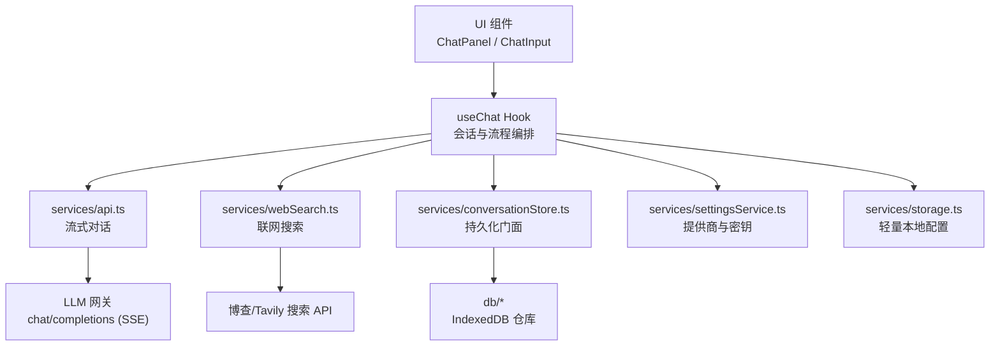
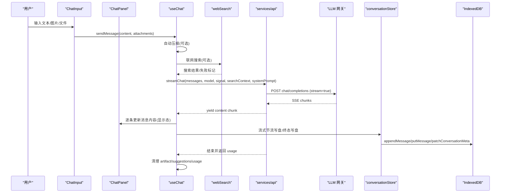
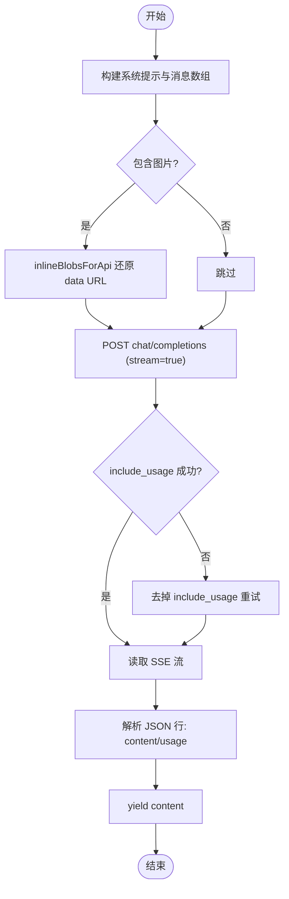
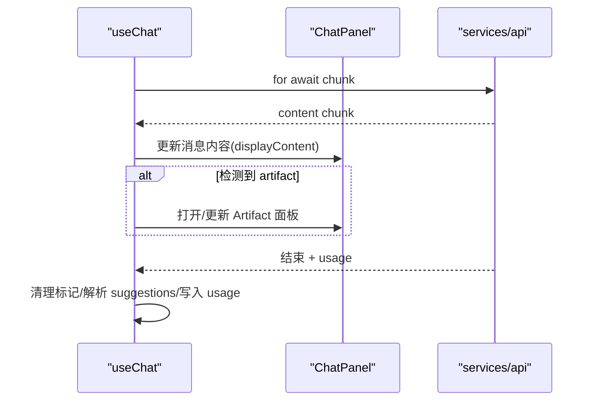
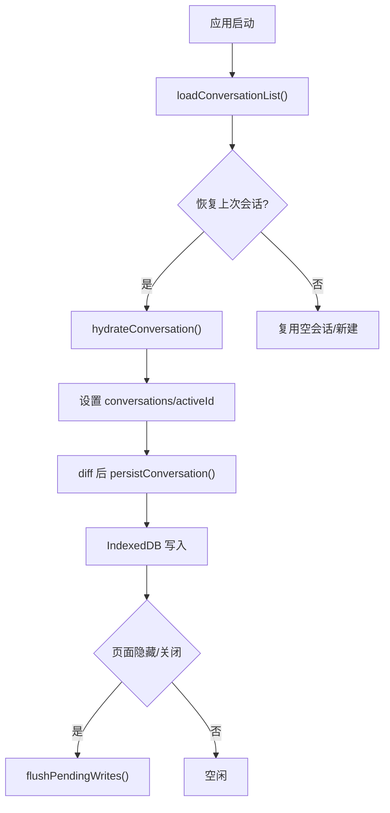
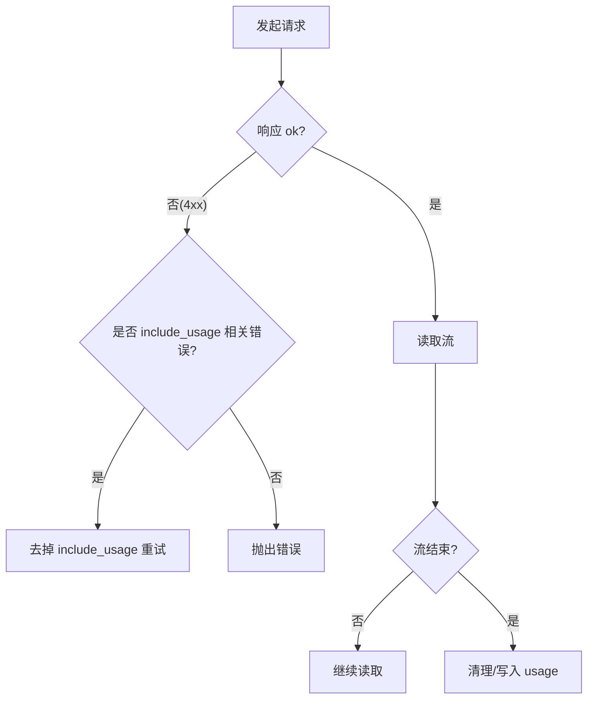
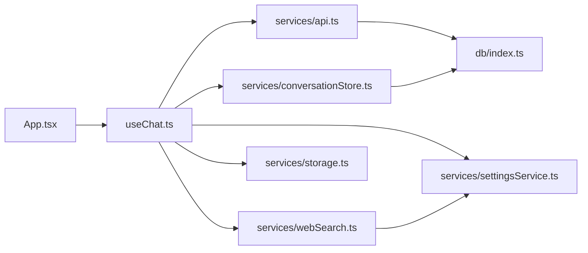

# 数据流设计

<cite>
**本文引用的文件**
- [App.tsx](file://src/App.tsx)
- [ChatPanel.tsx](file://src/components/chat/ChatPanel.tsx)
- [ChatInput.tsx](file://src/components/chat/ChatInput.tsx)
- [useChat.ts](file://src/hooks/useChat.ts)
- [api.ts](file://src/services/api.ts)
- [webSearch.ts](file://src/services/webSearch.ts)
- [conversationStore.ts](file://src/services/conversationStore.ts)
- [storage.ts](file://src/services/storage.ts)
- [settingsService.ts](file://src/services/settingsService.ts)
- [db/index.ts](file://src/db/index.ts)
- [db/open.ts](file://src/db/open.ts)
- [types/index.ts](file://src/types/index.ts)
</cite>

## 目录
1. [简介](#简介)
2. [项目结构](#项目结构)
3. [核心组件](#核心组件)
4. [架构总览](#架构总览)
5. [详细组件分析](#详细组件分析)
6. [依赖关系分析](#依赖关系分析)
7. [性能考量](#性能考量)
8. [故障排查指南](#故障排查指南)
9. [结论](#结论)
10. [附录](#附录)

## 简介
本文件面向 AIShop 的数据流设计，聚焦“用户输入到 AI 响应”的完整流转过程，覆盖请求构建、流式响应解析、本地存储与远程 API 同步、数据验证与转换、缓存策略、错误处理与重试机制、数据一致性保证、调试方法与性能优化建议。文档以代码级事实为依据，通过图示帮助读者理解复杂交互。

## 项目结构
AIShop 采用前端 React + IndexedDB 的架构：
- UI 层：App、聊天面板、输入框等组件负责用户交互与状态展示。
- 业务逻辑层：useChat Hook 聚合会话管理、压缩、联网搜索、流式对话等流程。
- 服务层：API 调用（流式）、设置与密钥管理、Web 搜索、持久化门面。
- 数据层：IndexedDB 多仓库（会话、消息、上下文节点、Blobs、收藏等），提供连接管理与写入串行化。

图表来源
- [useChat.ts:494-783](file://src/hooks/useChat.ts#L494-L783)
- [api.ts:44-172](file://src/services/api.ts#L44-L172)
- [webSearch.ts:23-117](file://src/services/webSearch.ts#L23-L117)
- [conversationStore.ts:190-348](file://src/services/conversationStore.ts#L190-L348)
- [db/open.ts:14-57](file://src/db/open.ts#L14-L57)
- [settingsService.ts:59-100](file://src/services/settingsService.ts#L59-L100)
- [storage.ts:11-60](file://src/services/storage.ts#L11-L60)

章节来源
- [App.tsx:16-147](file://src/App.tsx#L16-L147)
- [ChatPanel.tsx:18-623](file://src/components/chat/ChatPanel.tsx#L18-L623)
- [ChatInput.tsx:21-467](file://src/components/chat/ChatInput.tsx#L21-L467)

## 核心组件
- 输入与渲染
  - ChatInput：接收文本、图片、文件附件，支持引用消息与联网搜索开关，提交后回调 useChat.sendMessage。
  - ChatPanel：消息列表、折叠浏览、搜索定位、上下文摘要查看、Artifact 预览联动。
- 流程编排
  - useChat：启动加载会话、自动压缩、发送消息、流式更新、用量统计、标题生成、搜索集成、持久化触发。
- 数据访问
  - services/api.ts：构建系统提示与消息、流式 SSE 读取、用量解析、失败重试。
  - services/webSearch.ts：统一搜索入口，路由至博查或 Tavily，格式化搜索结果。
  - services/conversationStore.ts：会话与消息的增量持久化、流式落盘节流、压缩区间同步。
  - db/*：IndexedDB 连接、仓库操作、Blob 编解码、上下文节点等。
- 配置与存储
  - services/settingsService.ts：提供商选择、API Key 管理、压缩参数。
  - services/storage.ts：首屏快速读写的轻量本地存储（主题、上次模型、上次会话、搜索开关）。

章节来源
- [ChatInput.tsx:70-118](file://src/components/chat/ChatInput.tsx#L70-L118)
- [ChatPanel.tsx:434-623](file://src/components/chat/ChatPanel.tsx#L434-L623)
- [useChat.ts:152-333](file://src/hooks/useChat.ts#L152-L333)
- [api.ts:44-172](file://src/services/api.ts#L44-L172)
- [webSearch.ts:23-117](file://src/services/webSearch.ts#L23-L117)
- [conversationStore.ts:190-348](file://src/services/conversationStore.ts#L190-L348)
- [settingsService.ts:59-100](file://src/services/settingsService.ts#L59-L100)
- [storage.ts:11-60](file://src/services/storage.ts#L11-L60)

## 架构总览
从用户输入到 AI 响应的端到端数据流如下：

图表来源
- [ChatInput.tsx:70-118](file://src/components/chat/ChatInput.tsx#L70-L118)
- [useChat.ts:494-783](file://src/hooks/useChat.ts#L494-L783)
- [webSearch.ts:23-117](file://src/services/webSearch.ts#L23-L117)
- [api.ts:44-172](file://src/services/api.ts#L44-L172)
- [conversationStore.ts:190-348](file://src/services/conversationStore.ts#L190-L348)

## 详细组件分析

### 请求构建与发送
- 系统提示与上下文
  - 使用 buildSystemPrompt 组合基础提示与上下文信息；当开启 Artifact 时追加特定指令。
  - 若启用联网搜索，将搜索结果格式化为 system 上下文注入。
- 消息组装与图片内联
  - 将历史消息与当前用户消息合并为 API 消息数组；图片以 aishop-blob:<id> 引用存在，发送前通过 inlineBlobsForApi 还原为 data URL，避免模型无法读取引用。
- 流式请求与用量
  - 使用 fetch 发起 SSE 流；优先带 include_usage 参数，若网关不支持则捕获 4xx 并去掉该参数重试一次。
  - 逐行解析 SSE，提取 delta.content 与 usage，最终回调 onUsage。

图表来源
- [useChat.ts:494-783](file://src/hooks/useChat.ts#L494-L783)
- [api.ts:44-172](file://src/services/api.ts#L44-L172)

章节来源
- [useChat.ts:494-783](file://src/hooks/useChat.ts#L494-L783)
- [api.ts:44-172](file://src/services/api.ts#L44-L172)

### 流式响应解析与 UI 更新
- 实时显示
  - 每收到一个 content chunk，立即更新最后一条 assistant 消息的 displayContent，保持滚动吸底。
- Artifact 流式预览
  - 当检测到 artifact 标记时，打开全屏预览面板并逐步更新代码；流结束后关闭并切换到预览模式。
- 最终态整理
  - 流结束后去除 artifact 标记、清理过度反引号、解析 suggestions，并写入真实 usage。

图表来源
- [useChat.ts:678-740](file://src/hooks/useChat.ts#L678-L740)
- [ChatPanel.tsx:369-406](file://src/components/chat/ChatPanel.tsx#L369-L406)

章节来源
- [useChat.ts:678-740](file://src/hooks/useChat.ts#L678-L740)
- [ChatPanel.tsx:369-406](file://src/components/chat/ChatPanel.tsx#L369-L406)

### 本地存储与远程 API 同步
- 启动恢复
  - 读取会话列表（仅元数据），尝试恢复上次活跃会话；若无效则复用空会话或新建。
  - 按需加载最近消息与上下文节点，标记 hydrated 以避免误判消息为空。
- 增量持久化
  - 比较前后 Conversation，仅对变化的消息进行 append/put/delete；未加载会话只写元数据。
  - 流式期间按 1s 节流写盘，页面隐藏/关闭前强制 flushPendingWrites 防止丢失长回复。
- 压缩区间同步
  - 将 ContextSegment 同步为 contextNodes，并维护原文 compressedInto 标记；撤销压缩时删除节点并清标记。
- 轻量配置
  - 主题、上次模型、上次会话、搜索开关等通过 storage.ts 读写 localStorage，确保首屏无闪烁。

图表来源
- [useChat.ts:195-333](file://src/hooks/useChat.ts#L195-L333)
- [conversationStore.ts:190-348](file://src/services/conversationStore.ts#L190-L348)
- [db/open.ts:14-57](file://src/db/open.ts#L14-L57)

章节来源
- [useChat.ts:195-333](file://src/hooks/useChat.ts#L195-L333)
- [conversationStore.ts:190-348](file://src/services/conversationStore.ts#L190-L348)
- [storage.ts:11-60](file://src/services/storage.ts#L11-L60)

### 数据验证、转换与缓存策略
- 数据验证
  - 类型定义集中在 types/index.ts，约束 Message、Conversation、TokenUsage、ContextSegment 等。
  - API 用量字段兼容多种网关命名，逐个兜底解析。
- 数据转换
  - 图片引用转 data URL；消息内容去除 artifact 标记与过度反引号；搜索结果格式化为系统上下文。
- 缓存策略
  - 本地：localStorage 保存轻量配置；IndexedDB 持久化会话、消息、上下文节点、Blobs、收藏等。
  - 远程：通过 include_usage 获取 cached_tokens 与 cache_write_tokens，用于成本与命中率核对；压缩会改写 prompt 前缀，可能破坏缓存折扣，因此阈值保守且避免频繁小压缩。

章节来源
- [types/index.ts:1-252](file://src/types/index.ts#L1-L252)
- [api.ts:17-42](file://src/services/api.ts#L17-L42)
- [settingsService.ts:27-33](file://src/services/settingsService.ts#L27-L33)

### 错误处理与重试机制
- 网络与网关错误
  - 若 include_usage 不被支持，捕获 4xx 并去掉该参数重试一次；其他错误抛出明确信息。
  - AbortError 表示用户主动停止，更新消息状态为已停止而非失败。
- 搜索失败
  - 搜索异常或空结果时标记 webSearchFailed，不影响主对话流程。
- 持久化失败
  - 流式中间态写失败可忽略，最终态会再次写入；页面隐藏/关闭前强制 flush 降低丢失风险。

图表来源
- [api.ts:102-118](file://src/services/api.ts#L102-L118)
- [useChat.ts:741-780](file://src/hooks/useChat.ts#L741-L780)

章节来源
- [api.ts:102-118](file://src/services/api.ts#L102-L118)
- [useChat.ts:741-780](file://src/hooks/useChat.ts#L741-L780)

### 数据流图与一致性保证
- 数据流图
  - 见“架构总览”中的序列图，涵盖输入、搜索、流式响应、持久化的全链路。
- 一致性保证
  - 会话与消息 diff 后定向写，避免覆盖未加载会话的空 messages。
  - 流式写盘节流 + 页面隐藏强制 flush，保障移动端切后台不丢长回复。
  - 压缩区间与原文标记分离：segment 作为派生视图，原文保留，compressedInto 标记由专用路径写入，避免重写整条消息带来的开销。
  - 数据库连接在 Safari 内存压力下失败时重开并重试一次；同会话写入串行化，避免流式更新穿插。

章节来源
- [conversationStore.ts:190-348](file://src/services/conversationStore.ts#L190-L348)
- [db/open.ts:14-57](file://src/db/open.ts#L14-L57)

## 依赖关系分析
- 组件依赖
  - App 组合 MainLayout、ChatPanel、ImagePanel、SettingsPanel 等，并通过 useChat 暴露能力。
  - ChatPanel 依赖 useArtifact、useStickToBottom、useFoldGesture 等钩子，以及 MessageBubble、CompactionMarker、ContextSummarySheet。
  - ChatInput 依赖 fileParser，处理拖拽与粘贴图片。
- 服务依赖
  - useChat 依赖 api、webSearch、conversationStore、settingsService、storage、titleGenerator、contextCompactor、buildApiMessages、compactPlan、tokenEstimate、migrateSummary、conversationView。
  - api 依赖 settingsService、providers 配置、db.inlineBlobsForApi。
  - webSearch 依赖 settingsService 获取搜索提供商与 API Key。
  - conversationStore 依赖 db 的多仓库接口。

图表来源
- [App.tsx:16-147](file://src/App.tsx#L16-L147)
- [useChat.ts:1-43](file://src/hooks/useChat.ts#L1-L43)
- [api.ts:1-6](file://src/services/api.ts#L1-L6)
- [webSearch.ts:1-2](file://src/services/webSearch.ts#L1-L2)
- [conversationStore.ts:12-37](file://src/services/conversationStore.ts#L12-L37)
- [db/index.ts:1-98](file://src/db/index.ts#L1-L98)

章节来源
- [App.tsx:16-147](file://src/App.tsx#L16-L147)
- [useChat.ts:1-43](file://src/hooks/useChat.ts#L1-L43)
- [api.ts:1-6](file://src/services/api.ts#L1-L6)
- [webSearch.ts:1-2](file://src/services/webSearch.ts#L1-L2)
- [conversationStore.ts:12-37](file://src/services/conversationStore.ts#L12-L37)
- [db/index.ts:1-98](file://src/db/index.ts#L1-L98)

## 性能考量
- 流式体验
  - 逐 chunk 更新 UI，减少等待感；滚动吸底与折叠动画优化长对话浏览。
- 持久化优化
  - diff 后定向写，避免全量序列化；流式节流 1s 写盘；页面隐藏强制 flush。
- 压缩策略
  - 保守阈值（0.7）与热窗口（16 条）平衡成本与用户体验；避免频繁小压缩破坏缓存折扣。
- 资源管理
  - Blob 存储与回收；上下文节点索引提升查询效率；Safari 内存压力下的数据库连接重连。

[本节为通用指导，不直接分析具体文件]

## 故障排查指南
- 常见问题定位
  - 无 API Key：检查 settingsService 中 llm 提供商与对应 key 是否配置。
  - include_usage 不支持：观察 4xx 错误文本，确认是否自动重试。
  - 搜索失败：检查 webSearch 提供商与 key，关注 webSearchFailed 标志。
  - 数据丢失：确认页面隐藏/关闭前 flushPendingWrites 是否执行；检查 IndexedDB 连接是否正常。
- 调试方法
  - 控制台日志：search provider、Bocha/Tavily 错误、数据库升级阻塞警告。
  - 断点位置：sendMessage 流程、streamChat 解析、persistConversation 差异判断、flushPendingWrites。
  - 指标观察：usage.cached_tokens、cache_write_tokens 变化，评估压缩对缓存的影响。

章节来源
- [api.ts:102-118](file://src/services/api.ts#L102-L118)
- [webSearch.ts:23-117](file://src/services/webSearch.ts#L23-L117)
- [conversationStore.ts:153-182](file://src/services/conversationStore.ts#L153-L182)
- [db/open.ts:46-57](file://src/db/open.ts#L46-L57)

## 结论
AIShop 的数据流以 useChat 为核心编排，结合流式 API、联网搜索与 IndexedDB 持久化，实现了低延迟、高可靠的用户体验。通过 diff 写盘、节流 flush、压缩区间同步与连接重连等机制，保障了数据一致性与稳定性。建议在后续迭代中持续监控 usage 指标与压缩收益，进一步优化阈值与缓存策略。

[本节为总结性内容，不直接分析具体文件]

## 附录
- 关键类型参考
  - Message、Conversation、TokenUsage、ContextSegment、FileAttachment 等定义位于 types/index.ts。
- 入口与配置
  - App.tsx 组合界面与全局状态；settingsService.ts 管理提供商与压缩参数；storage.ts 管理轻量本地配置。

章节来源
- [types/index.ts:1-252](file://src/types/index.ts#L1-L252)
- [App.tsx:16-147](file://src/App.tsx#L16-L147)
- [settingsService.ts:59-100](file://src/services/settingsService.ts#L59-L100)
- [storage.ts:11-60](file://src/services/storage.ts#L11-L60)