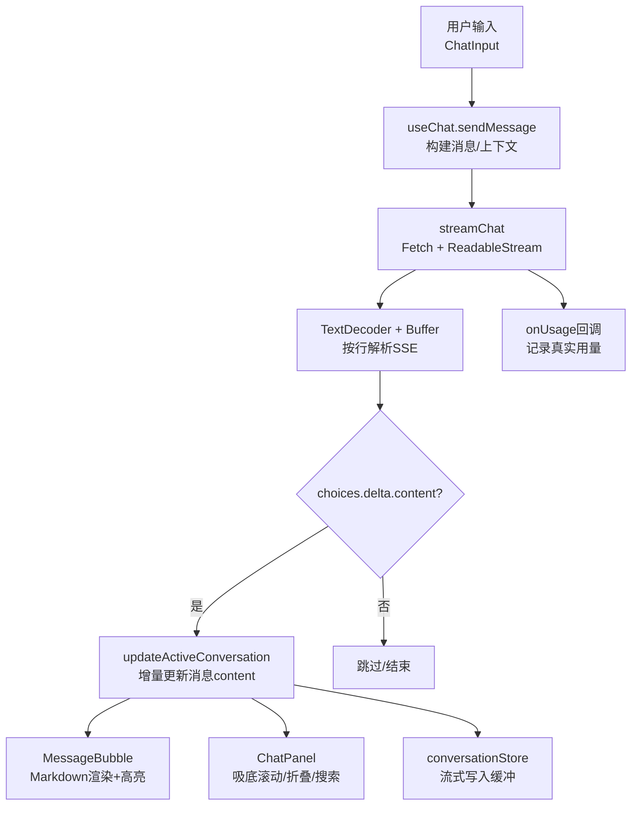
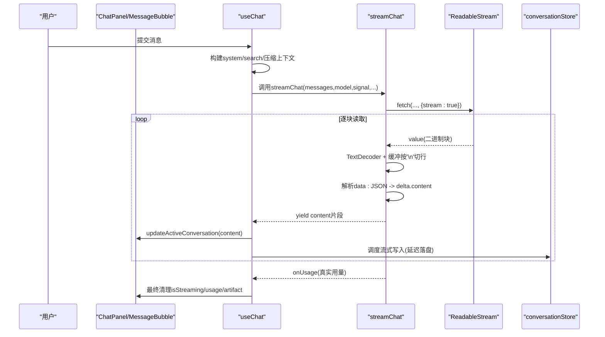
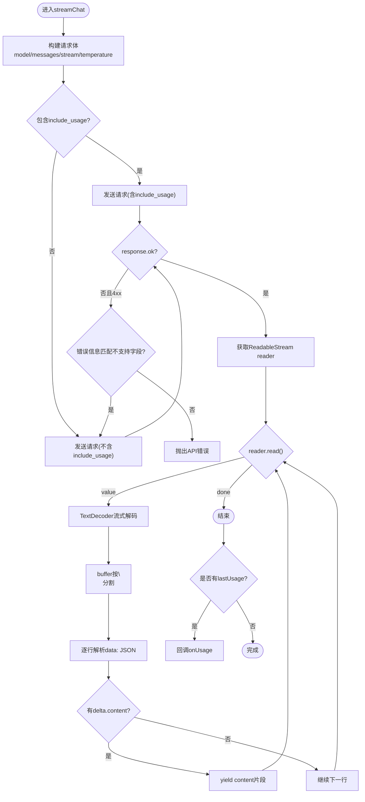
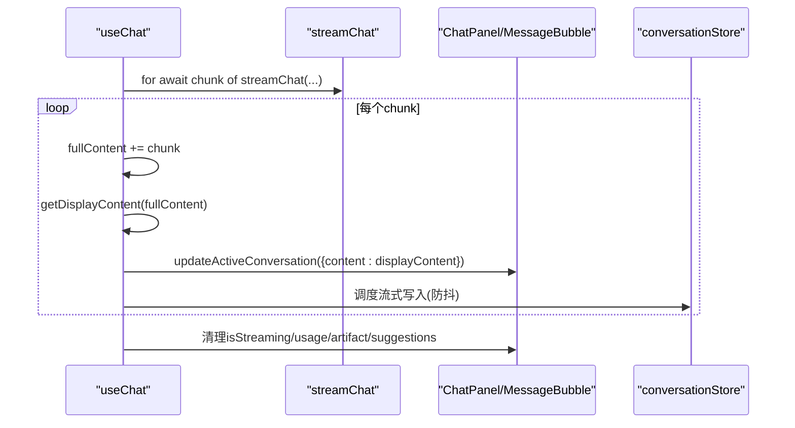
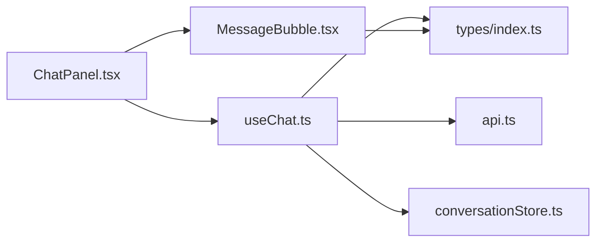

# 流式响应处理

<cite>
**本文引用的文件**
- [src/services/api.ts](file://src/services/api.ts)
- [src/hooks/useChat.ts](file://src/hooks/useChat.ts)
- [src/components/chat/MessageBubble.tsx](file://src/components/chat/MessageBubble.tsx)
- [src/components/chat/ChatPanel.tsx](file://src/components/chat/ChatPanel.tsx)
- [src/types/index.ts](file://src/types/index.ts)
- [src/services/conversationStore.ts](file://src/services/conversationStore.ts)
- [package.json](file://package.json)
</cite>

## 目录
1. [简介](#简介)
2. [项目结构](#项目结构)
3. [核心组件](#核心组件)
4. [架构总览](#架构总览)
5. [详细组件分析](#详细组件分析)
6. [依赖关系分析](#依赖关系分析)
7. [性能考量](#性能考量)
8. [故障排查指南](#故障排查指南)
9. [结论](#结论)
10. [附录](#附录)

## 简介
本文件面向 AIShop 项目的“流式响应处理”，聚焦于服务器端流式响应的接收、解析与实时渲染机制，解释 SSE（Server-Sent Events）协议的使用与数据分块处理策略；描述增量内容更新的用户界面实现与状态同步方案；并给出流中断恢复、错误处理与用户体验优化建议，以及调试工具与性能监控方法。

## 项目结构
AIShop 的流式能力由前端 React 应用直接通过 Fetch API 消费后端 LLM 网关返回的流式 JSON Lines 数据（SSE 风格），并在 UI 层进行增量渲染。关键路径如下：
- 服务层：封装流式请求、读取、解码、行级解析与用量提取。
- Hook 层：编排发送消息、流式迭代、UI 状态更新、搜索上下文注入、压缩策略等。
- UI 层：消息气泡、聊天面板、Artifact 预览面板等负责增量展示与交互。
- 持久化层：对高频流式写入做缓冲与落盘，避免阻塞主线程。

图表来源
- [src/services/api.ts:44-172](file://src/services/api.ts#L44-L172)
- [src/hooks/useChat.ts:494-783](file://src/hooks/useChat.ts#L494-L783)
- [src/components/chat/MessageBubble.tsx:538-612](file://src/components/chat/MessageBubble.tsx#L538-L612)
- [src/components/chat/ChatPanel.tsx:478-559](file://src/components/chat/ChatPanel.tsx#L478-L559)
- [src/services/conversationStore.ts:128-155](file://src/services/conversationStore.ts#L128-L155)

章节来源
- [src/services/api.ts:44-172](file://src/services/api.ts#L44-L172)
- [src/hooks/useChat.ts:494-783](file://src/hooks/useChat.ts#L494-L783)
- [src/components/chat/MessageBubble.tsx:538-612](file://src/components/chat/MessageBubble.tsx#L538-L612)
- [src/components/chat/ChatPanel.tsx:478-559](file://src/components/chat/ChatPanel.tsx#L478-L559)
- [src/services/conversationStore.ts:128-155](file://src/services/conversationStore.ts#L128-L155)

## 核心组件
- 流式客户端（streamChat）：发起带 stream=true 的请求，使用 ReadableStream 逐块读取，按行解析 SSE data: 行，抽取 choices.delta.content 增量文本，并在最后回调真实用量。
- 会话 Hook（useChat）：组装系统提示、联网搜索结果、压缩区间，驱动流式迭代，实时更新消息 content，处理 artifact 流式预览、搜索状态、用量统计与错误分支。
- 消息气泡（MessageBubble）：将增量文本以 Markdown 渲染，支持代码高亮、数学公式、引用按钮、搜索高亮、流式光标动画等。
- 聊天面板（ChatPanel）：管理滚动定位、折叠浏览、对话内搜索、Artifact 面板联动与自动预览切换。
- 持久化（conversationStore）：对流式消息进行去重与节流写库，页面隐藏时强制落盘，防止丢失长回复。

章节来源
- [src/services/api.ts:44-172](file://src/services/api.ts#L44-L172)
- [src/hooks/useChat.ts:494-783](file://src/hooks/useChat.ts#L494-L783)
- [src/components/chat/MessageBubble.tsx:538-612](file://src/components/chat/MessageBubble.tsx#L538-L612)
- [src/components/chat/ChatPanel.tsx:478-559](file://src/components/chat/ChatPanel.tsx#L478-L559)
- [src/services/conversationStore.ts:128-155](file://src/services/conversationStore.ts#L128-L155)

## 架构总览
下图展示了从用户输入到流式渲染的端到端流程，包括 SSE 解析、增量更新、用量回传与持久化。

图表来源
- [src/services/api.ts:84-172](file://src/services/api.ts#L84-L172)
- [src/hooks/useChat.ts:678-740](file://src/hooks/useChat.ts#L678-L740)
- [src/services/conversationStore.ts:153-155](file://src/services/conversationStore.ts#L153-L155)

## 详细组件分析

### 流式客户端：streamChat（SSE 接收与解析）
- 请求构造：设置 Authorization、Content-Type，携带 model、messages、stream=true、temperature，并尝试 include_usage 获取真实用量。
- 兼容性重试：若网关不支持 include_usage 返回 4xx，则去掉该参数重试一次，确保流式对话不因此失败。
- 流式读取：使用 response.body.getReader() 与 TextDecoder 流式解码，维护 buffer 按换行符拆分，逐行处理。
- SSE 解析：过滤 data: 前缀，解析 JSON，抽取 choices[0].delta.content 增量文本；遇到 [DONE] 或空 choices 且含 usage 时记录用量。
- 结尾兜底：循环结束后检查残留 buffer，确保最后一行被处理，避免用量丢失。
- 错误处理：网络/HTTP 错误抛出异常；JSON 解析失败跳过残缺行，保证鲁棒性。

图表来源
- [src/services/api.ts:84-172](file://src/services/api.ts#L84-L172)

章节来源
- [src/services/api.ts:84-172](file://src/services/api.ts#L84-L172)

### 会话 Hook：useChat（增量更新与状态同步）
- 上下文准备：根据模型与功能开关构建 system prompt，必要时附加联网搜索结果作为 system 上下文。
- 流式迭代：for await 遍历 streamChat 返回的增量片段，累加 fullContent，计算 displayContent（去除中间态标记），并立即更新当前 assistant 消息的 content。
- Artifact 流式预览：当开启 artifact 功能时，检测流式 artifact 标记，动态打开/更新预览面板，结束时切换到最终版本。
- 用量与收尾：流结束后清理 isStreaming，解析 suggestions、artifact，写入真实 usage，并持久化。
- 错误与取消：捕获 AbortError 标记 stoppedByUser；其他错误显示友好提示并停止流式状态。

图表来源
- [src/hooks/useChat.ts:678-740](file://src/hooks/useChat.ts#L678-L740)
- [src/services/conversationStore.ts:153-155](file://src/services/conversationStore.ts#L153-L155)

章节来源
- [src/hooks/useChat.ts:678-740](file://src/hooks/useChat.ts#L678-L740)

### 消息气泡：MessageBubble（实时渲染与交互）
- 增量渲染：AI 消息在 isStreaming 为真时持续追加 Markdown 内容，末尾显示脉冲光标指示生成中。
- 代码与公式：使用 highlight.js 与 KaTeX 渲染代码与数学公式，支持复制与语言识别。
- 引用与链接：将搜索结果引用标识转换为可点击按钮，普通链接在新窗口打开。
- 搜索高亮：在渲染后通过 DOM TreeWalker 对文本节点包裹高亮标签，支持跳转与计数。
- 长按菜单：移动端长按弹出操作菜单（如复制），并锁定背景滚动避免误触。

章节来源
- [src/components/chat/MessageBubble.tsx:538-612](file://src/components/chat/MessageBubble.tsx#L538-L612)
- [src/components/chat/MessageBubble.tsx:218-300](file://src/components/chat/MessageBubble.tsx#L218-L300)

### 聊天面板：ChatPanel（滚动、折叠与预览联动）
- 吸底滚动：流式追内容时保持底部可见，支持手动上滑查看历史。
- 折叠浏览：手势触发折叠，平滑过渡并保持锚点位置，展开时平滑滚动至目标消息。
- 对话内搜索：实时计算命中项，支持上下跳转与高亮定位。
- Artifact 面板：检测到流式 artifact 时打开并增量更新代码，结束时切换到最终预览。

章节来源
- [src/components/chat/ChatPanel.tsx:478-559](file://src/components/chat/ChatPanel.tsx#L478-L559)
- [src/components/chat/ChatPanel.tsx:369-406](file://src/components/chat/ChatPanel.tsx#L369-L406)

### 类型与数据结构
- Message：承载角色、内容、时间戳、流式标志、附件、artifact、多版本、用量等。
- TokenUsage：来自网关的真实用量，用于成本核对与缓存命中率分析。
- ContextSegment：压缩区间摘要，影响 API payload 但不影响渲染。
- ChatFeatureSettings：功能开关（artifact、自动压缩）。

章节来源
- [src/types/index.ts:34-107](file://src/types/index.ts#L34-L107)

## 依赖关系分析
- 模块耦合：
  - useChat 强依赖 streamChat 提供增量数据，同时依赖 conversationStore 做持久化。
  - MessageBubble 依赖 react-markdown、highlight.js、katex 进行渲染。
  - ChatPanel 依赖 useStickToBottom、useFoldGesture 等自定义 hooks 提升体验。
- 外部依赖：
  - package.json 声明了 React、Vite、Tailwind、highlight.js、katex、idb 等。
- 潜在循环：
  - 无直接循环依赖；useChat 与 components 通过 props/state 解耦。

图表来源
- [src/hooks/useChat.ts:1-41](file://src/hooks/useChat.ts#L1-L41)
- [src/services/api.ts:1-6](file://src/services/api.ts#L1-L6)
- [src/components/chat/MessageBubble.tsx:1-19](file://src/components/chat/MessageBubble.tsx#L1-L19)
- [src/components/chat/ChatPanel.tsx:1-16](file://src/components/chat/ChatPanel.tsx#L1-L16)
- [src/types/index.ts:1-107](file://src/types/index.ts#L1-L107)

章节来源
- [package.json:12-30](file://package.json#L12-L30)

## 性能考量
- 流式写入缓冲：conversationStore 对高频流式消息进行去重与延迟落盘，避免每次增量都写库导致卡顿。
- 增量渲染：仅更新最新 assistant 消息的 content，减少重渲染范围。
- Markdown 渲染开销：ReactMarkdown 在流式期间频繁渲染，建议在长回复场景下考虑虚拟滚动或分段渲染。
- 图片与附件：消息中的图片以 aishop-blob:<id> 引用，按需转为 data URL，避免提前加载全部历史图片。
- 用量统计：仅在 finally 中回调一次真实用量，减少重复计算。

章节来源
- [src/services/conversationStore.ts:128-155](file://src/services/conversationStore.ts#L128-L155)
- [src/services/api.ts:169-172](file://src/services/api.ts#L169-L172)

## 故障排查指南
- 常见错误
  - 网关不支持 include_usage：已内置兼容逻辑，自动重试不带该参数的请求。
  - 网络/HTTP 错误：抛出统一错误信息，UI 显示失败提示。
  - JSON 解析失败：跳过残缺行，不影响后续流式输出。
- 流中断恢复
  - 使用 AbortController 支持用户主动停止生成，并标记 stoppedByUser。
  - 页面隐藏/关闭前强制 flushPendingWrites，避免安卓冷启动丢失长回复。
- 调试建议
  - 浏览器开发者工具 Network 面板：查看 SSE 流式响应与 data 行。
  - Console 日志：关注 [useChat] 启动与持久化错误。
  - 指标收集：在 streamChat 中增加每块大小、耗时、行数统计，便于评估吞吐与延迟。
- 用户体验优化
  - 流式光标与加载提示：MessageBubble 在空内容时显示加载点。
  - 触觉反馈：开始与结束生成时触发振动，增强感知。
  - 折叠与搜索：帮助快速定位长回复与关键词。

章节来源
- [src/services/api.ts:102-118](file://src/services/api.ts#L102-L118)
- [src/hooks/useChat.ts:741-783](file://src/hooks/useChat.ts#L741-L783)
- [src/components/chat/MessageBubble.tsx:608-612](file://src/components/chat/MessageBubble.tsx#L608-L612)
- [src/services/conversationStore.ts:338-347](file://src/services/conversationStore.ts#L338-L347)

## 结论
AIShop 通过前端直连 LLM 网关的流式接口，实现了低延迟、渐进式的对话体验。streamChat 负责稳健地接收与解析 SSE 数据，useChat 协调上下文、流式迭代与状态同步，MessageBubble 与 ChatPanel 提供流畅的渲染与交互。配合持久化缓冲与错误处理，系统在复杂网络与设备环境下仍能提供稳定体验。未来可进一步引入虚拟滚动、增量 Diff 与更细粒度的性能埋点，以应对超长对话与高并发场景。

## 附录
- 关键实现路径参考
  - 流式客户端：[src/services/api.ts:44-172](file://src/services/api.ts#L44-L172)
  - 会话 Hook：[src/hooks/useChat.ts:494-783](file://src/hooks/useChat.ts#L494-L783)
  - 消息气泡：[src/components/chat/MessageBubble.tsx:538-612](file://src/components/chat/MessageBubble.tsx#L538-L612)
  - 聊天面板：[src/components/chat/ChatPanel.tsx:478-559](file://src/components/chat/ChatPanel.tsx#L478-L559)
  - 持久化缓冲：[src/services/conversationStore.ts:128-155](file://src/services/conversationStore.ts#L128-L155)
  - 类型定义：[src/types/index.ts:34-107](file://src/types/index.ts#L34-L107)
  - 依赖清单：[package.json:12-30](file://package.json#L12-L30)