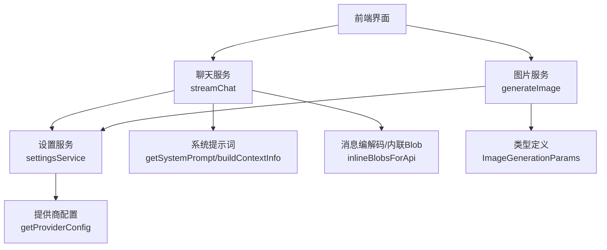
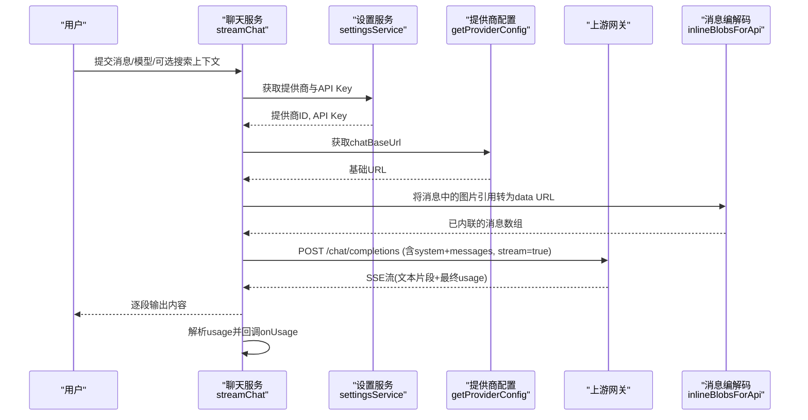
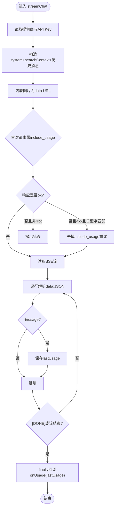
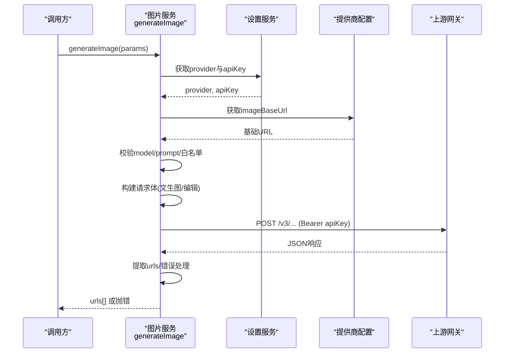
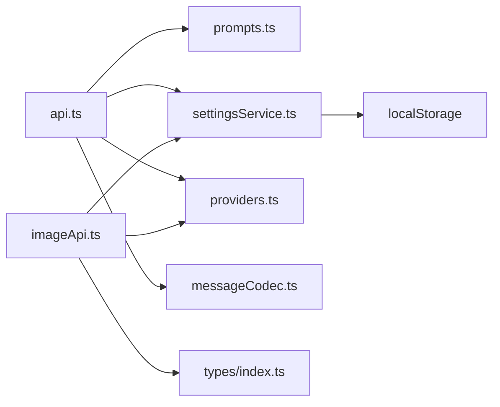

# 请求处理流程

<cite>
**本文引用的文件**
- [src/services/api.ts](file://src/services/api.ts)
- [src/services/imageApi.ts](file://src/services/imageApi.ts)
- [src/config/providers.ts](file://src/config/providers.ts)
- [src/config/models.ts](file://src/config/models.ts)
- [src/config/prompts.ts](file://src/config/prompts.ts)
- [src/services/settingsService.ts](file://src/services/settingsService.ts)
- [src/types/index.ts](file://src/types/index.ts)
- [src/db/blobRepo.ts](file://src/db/blobRepo.ts)
- [src/db/messageCodec.ts](file://src/db/messageCodec.ts)
</cite>

## 目录
1. [简介](#简介)
2. [项目结构](#项目结构)
3. [核心组件](#核心组件)
4. [架构总览](#架构总览)
5. [详细组件分析](#详细组件分析)
6. [依赖关系分析](#依赖关系分析)
7. [性能考虑](#性能考虑)
8. [故障排查指南](#故障排查指南)
9. [结论](#结论)
10. [附录](#附录)

## 简介
本文件面向 AIShop 前端，系统化说明“用户输入消息到 API 请求”的完整处理链路：从消息格式化、系统提示词注入、图片内容内联处理，到多提供商配置与 API Key 管理；并解释流式请求构建过程、错误重试策略、参数校验、超时与网络异常处理。最后提供调试方法与性能优化建议，帮助开发者快速定位问题与优化体验。

## 项目结构
AIShop 的请求处理由“服务层 + 配置层 + 存储/编解码层”组成：
- 服务层：聊天流式请求（api.ts）、图片生成请求（imageApi.ts）
- 配置层：提供商端点（providers.ts）、模型清单（models.ts）、系统提示词（prompts.ts）
- 设置与类型：设置服务（settingsService.ts）、类型定义（types/index.ts）
- 数据与编解码：IndexedDB Blob 仓库（blobRepo.ts）、消息编解码（messageCodec.ts）

图表来源
- [src/services/api.ts:44-172](file://src/services/api.ts#L44-L172)
- [src/services/imageApi.ts:149-243](file://src/services/imageApi.ts#L149-L243)
- [src/config/providers.ts:1-19](file://src/config/providers.ts#L1-L19)
- [src/config/prompts.ts:1-93](file://src/config/prompts.ts#L1-L93)
- [src/services/settingsService.ts:59-100](file://src/services/settingsService.ts#L59-L100)
- [src/types/index.ts:177-187](file://src/types/index.ts#L177-L187)

章节来源
- [src/services/api.ts:44-172](file://src/services/api.ts#L44-L172)
- [src/services/imageApi.ts:149-243](file://src/services/imageApi.ts#L149-L243)
- [src/config/providers.ts:1-19](file://src/config/providers.ts#L1-L19)
- [src/config/prompts.ts:1-93](file://src/config/prompts.ts#L1-L93)
- [src/services/settingsService.ts:59-100](file://src/services/settingsService.ts#L59-L100)
- [src/types/index.ts:177-187](file://src/types/index.ts#L177-L187)

## 核心组件
- 聊天流式请求：负责消息组装、系统提示词注入、图片内联、流式读取、用量解析与失败回退。
- 图片生成请求：负责参数校验、端点选择、请求体构建、超时控制、错误提取与 URL 统一抽取。
- 提供商与密钥：通过 settingsService 获取当前提供商与 API Key，通过 providers.ts 解析基础地址。
- 系统提示词：集中管理默认行为与上下文信息，支持扩展。
- 类型与模型：统一 Message、TokenUsage、ImageGenerationParams 等类型，以及各能力模型清单。

章节来源
- [src/services/api.ts:44-172](file://src/services/api.ts#L44-L172)
- [src/services/imageApi.ts:149-243](file://src/services/imageApi.ts#L149-L243)
- [src/config/providers.ts:1-19](file://src/config/providers.ts#L1-L19)
- [src/config/prompts.ts:1-93](file://src/config/prompts.ts#L1-L93)
- [src/types/index.ts:1-107](file://src/types/index.ts#L1-L107)
- [src/config/models.ts:1-284](file://src/config/models.ts#L1-L284)

## 架构总览
下图展示从用户输入到上游网关的端到端流程，包括流式响应与用量收集。

图表来源
- [src/services/api.ts:44-172](file://src/services/api.ts#L44-L172)
- [src/config/providers.ts:1-19](file://src/config/providers.ts#L1-L19)
- [src/services/settingsService.ts:59-100](file://src/services/settingsService.ts#L59-L100)

## 详细组件分析

### 聊天流式请求（streamChat）
- 消息格式化与系统提示词注入
  - 首条 system 消息使用 getSystemPrompt()，可被外部传入的 systemPrompt 覆盖。
  - 若存在 searchContext，会追加一条 system 消息作为检索上下文。
  - 历史消息按原顺序保留，避免压缩区间产生的 system 消息错位或丢失。
- 图片内容内联处理
  - 调用 inlineBlobsForApi 将 IndexedDB 中的 aishop-blob:<id> 引用转换为 data URL，确保模型可读。
  - 延迟到发送前才内联，避免提前加载整段历史的图片占用内存。
- 流式请求构建与重试
  - 首次请求携带 include_usage 以获取真实用量；若网关不支持（4xx且包含特定关键字），自动去掉该参数重试一次。
  - 非 4xx 的错误直接抛出，包含状态码与响应体。
- 流式读取与用量收集
  - 使用 ReadableStream 分块读取，按行解析 data: JSON 片段，跳过残缺 JSON。
  - 每个 chunk 都检查 usage，最终在 finally 中回调 onUsage。
- 取消与信号
  - 支持 AbortSignal，便于上层取消对话。

图表来源
- [src/services/api.ts:44-172](file://src/services/api.ts#L44-L172)

章节来源
- [src/services/api.ts:44-172](file://src/services/api.ts#L44-L172)
- [src/config/prompts.ts:1-93](file://src/config/prompts.ts#L1-L93)
- [src/db/messageCodec.ts](file://src/db/messageCodec.ts)

### 图片生成请求（generateImage）
- 参数校验
  - 必填字段：model、prompt；未提供则立即抛出错误。
  - 模型白名单：仅支持 gpt-image-2、gemini-3.1-flash、gemini-3-pro。
- 端点选择与请求体构建
  - 根据 model 映射到 textToImage 或 edit 路径。
  - 编辑模式：
    - GPT Image 2：image 字段为字符串，需保证 base64 带 data URI 前缀，否则上游可能挂起。
    - Gemini：区分 image_urls（http(s)）与 image_base64s（裸 base64）。
  - 文生图：按模型要求设置 size、aspect_ratio、output_format、quality 等。
- 超时与取消
  - 内置 120 秒超时；支持合并外部 AbortSignal，区分“用户取消”和“超时”。
- 错误处理
  - 非 2xx：优先解析 detail/error.message，拼接友好错误信息。
  - 成功但无图片 URL：抛出“未返回图片地址”。
- 响应统一
  - extractUrls 兼容多种上游格式（base_resp+image_urls、images/data 列表、b64_json 转 data URL）。

图表来源
- [src/services/imageApi.ts:149-243](file://src/services/imageApi.ts#L149-L243)
- [src/services/settingsService.ts:59-100](file://src/services/settingsService.ts#L59-L100)
- [src/config/providers.ts:1-19](file://src/config/providers.ts#L1-L19)

章节来源
- [src/services/imageApi.ts:149-243](file://src/services/imageApi.ts#L149-L243)
- [src/types/index.ts:177-187](file://src/types/index.ts#L177-L187)

### 多提供商配置机制与 API Key 管理
- 提供商选择
  - 通过 settingsService.getProvider('llm'|'image') 获取当前类别的提供商 ID。
  - getProviderConfig(providerId) 返回对应 chatBaseUrl/imageBaseUrl。
- API Key 存取
  - settingsService.getApiKey(provider) 读取本地存储的密钥。
  - setApiKey 增删改键值，持久化到 localStorage。
- 默认值
  - 未配置时回退到默认提供商 fastapi。

章节来源
- [src/services/settingsService.ts:59-100](file://src/services/settingsService.ts#L59-L100)
- [src/config/providers.ts:1-19](file://src/config/providers.ts#L1-L19)

### 系统提示词注入与上下文信息
- 默认系统提示词
  - BASE_SYSTEM_PROMPT 规定回复格式、反引号与公式使用规范、末尾建议格式等。
  - ARTIFACT_PROMPT 定义网页生成能力与移动端适配要求。
  - SYSTEM_PROMPTS.default 组合两者。
- 上下文信息
  - buildContextInfo 动态注入时间、时区、语言、设备、当前模型等信息，供模型参考。
- 注入时机
  - streamChat 在消息数组最前面插入 system 消息；searchContext 作为额外 system 插入。

章节来源
- [src/config/prompts.ts:1-93](file://src/config/prompts.ts#L1-L93)
- [src/services/api.ts:61-67](file://src/services/api.ts#L61-L67)

### 图片内容内联处理（IndexedDB → data URL）
- 设计动机
  - 消息中的图片以 aishop-blob:<id> 引用形式存在，模型无法直接读取，需在发送前转为 data URL。
  - 延迟到发送前内联，避免提前加载整段历史图片导致内存压力。
- 实现要点
  - inlineBlobsForApi 遍历消息内容，识别并替换为 data URL。
  - blobRepo 提供内容寻址存储与引用计数，减少重复存储与内存占用。

章节来源
- [src/services/api.ts:69-82](file://src/services/api.ts#L69-L82)
- [src/db/blobRepo.ts:1-167](file://src/db/blobRepo.ts#L1-L167)
- [src/db/messageCodec.ts](file://src/db/messageCodec.ts)

### 流式请求构建与错误重试策略
- 流式构建
  - 使用 fetch + ReadableStream，按行解析 data: JSON，yield 增量内容。
  - 每次 chunk 均检查 usage，最终回调 onUsage。
- 重试策略
  - 首次请求携带 include_usage；若网关不支持（4xx且包含 stream_options/include_usage/unknown/unsupported/invalid），自动去掉该参数重试一次。
  - 其他 4xx/5xx 直接抛错，不重试。
- 取消与超时
  - 聊天流支持 AbortSignal；图片生成内置 120s 超时并可合并外部信号。

章节来源
- [src/services/api.ts:84-172](file://src/services/api.ts#L84-L172)
- [src/services/imageApi.ts:183-216](file://src/services/imageApi.ts#L183-L216)

### 请求参数验证、超时处理与网络异常处理
- 参数验证
  - 图片生成：校验 model、prompt、模型白名单；编辑模式按模型差异构建请求体。
  - 聊天：messages 必须存在；systemPrompt 可覆盖默认。
- 超时处理
  - 图片生成：AbortController 120s 超时；区分用户取消与超时。
  - 聊天：依赖上层 AbortSignal 控制。
- 网络异常
  - 非 2xx：解析 detail/error.message，抛出友好错误。
  - 流式：对残缺 JSON 行进行容错跳过。

章节来源
- [src/services/imageApi.ts:161-243](file://src/services/imageApi.ts#L161-L243)
- [src/services/api.ts:102-172](file://src/services/api.ts#L102-L172)

## 依赖关系分析

图表来源
- [src/services/api.ts:1-172](file://src/services/api.ts#L1-L172)
- [src/services/imageApi.ts:1-257](file://src/services/imageApi.ts#L1-L257)
- [src/config/providers.ts:1-19](file://src/config/providers.ts#L1-L19)
- [src/config/prompts.ts:1-93](file://src/config/prompts.ts#L1-L93)
- [src/services/settingsService.ts:1-101](file://src/services/settingsService.ts#L1-L101)
- [src/types/index.ts:1-252](file://src/types/index.ts#L1-L252)

章节来源
- [src/services/api.ts:1-172](file://src/services/api.ts#L1-L172)
- [src/services/imageApi.ts:1-257](file://src/services/imageApi.ts#L1-L257)
- [src/config/providers.ts:1-19](file://src/config/providers.ts#L1-L19)
- [src/config/prompts.ts:1-93](file://src/config/prompts.ts#L1-L93)
- [src/services/settingsService.ts:1-101](file://src/services/settingsService.ts#L1-L101)
- [src/types/index.ts:1-252](file://src/types/index.ts#L1-L252)

## 性能考虑
- 延迟内联图片
  - 仅在发送前将 IndexedDB 中的图片引用转为 data URL，避免提前加载整段历史造成内存峰值。
- 流式增量渲染
  - 使用 ReadableStream 逐段 yield 内容，降低首屏等待时间，提升交互流畅度。
- 用量统计与缓存折扣
  - 通过 include_usage 获取真实用量，结合 cachedTokens 评估缓存命中率与成本。
- 并发与队列
  - 图片生成支持并发队列与任务重试（PendingImageTask），避免瞬时风暴。
- 超时与取消
  - 图片生成 120s 超时，防止长耗时阻塞；聊天流支持取消，及时释放资源。
- 模型选择
  - 根据 CHAT_MODELS/IMAGE_MODELS 的能力与价格选择合适的模型，平衡质量与成本。

章节来源
- [src/services/api.ts:44-172](file://src/services/api.ts#L44-L172)
- [src/services/imageApi.ts:149-243](file://src/services/imageApi.ts#L149-L243)
- [src/config/models.ts:1-284](file://src/config/models.ts#L1-L284)

## 故障排查指南
- 常见错误与定位
  - 未配置 API Key：检查 settingsService 的 apiKeys 是否写入成功。
  - 4xx 且包含 stream_options/include_usage：会自动重试不带 include_usage 的请求；若仍失败，查看上游文档是否支持该特性。
  - 图片生成超时：确认上游耗时是否在 120s 内；必要时调整业务侧超时或分批重试。
  - 未返回图片地址：检查 extractUrls 是否能解析上游响应结构。
- 调试方法
  - 浏览器网络面板：查看请求头 Authorization、请求体 messages、响应体 SSE 流。
  - 控制台日志：打印 lastUsage、错误堆栈与上游 detail。
  - 本地存储：检查 localStorage 中 aishop_settings 的 providers 与 apiKeys。
- 恢复策略
  - 聊天：去掉 include_usage 重试；必要时切换提供商或模型。
  - 图片：更换模型或尺寸/质量参数；重试失败任务。

章节来源
- [src/services/api.ts:102-172](file://src/services/api.ts#L102-L172)
- [src/services/imageApi.ts:183-243](file://src/services/imageApi.ts#L183-L243)
- [src/services/settingsService.ts:59-100](file://src/services/settingsService.ts#L59-L100)

## 结论
AIShop 的请求处理采用清晰的分层设计与稳健的错误处理机制：聊天流式请求通过系统提示词注入与图片内联保障模型可用性与用户体验；图片生成请求通过参数校验、超时控制与响应统一提升稳定性。配合提供商配置与 API Key 管理，系统具备良好的可扩展性与可维护性。建议在生产环境结合用量统计与模型选择策略，持续优化成本与性能。

## 附录
- 关键类型
  - Message、MessageContent、TokenUsage、ImageGenerationParams 等定义于 types/index.ts。
- 模型清单
  - CHAT_MODELS、IMAGE_MODELS 定义了可用模型及其能力与价格，便于前端展示与选择。

章节来源
- [src/types/index.ts:1-252](file://src/types/index.ts#L1-L252)
- [src/config/models.ts:1-284](file://src/config/models.ts#L1-L284)