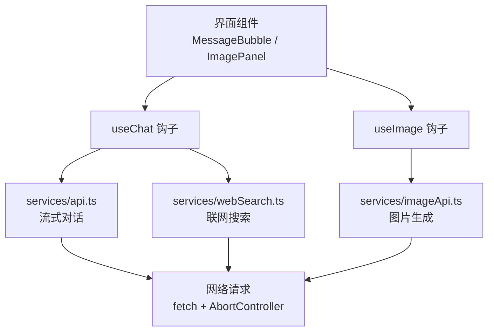
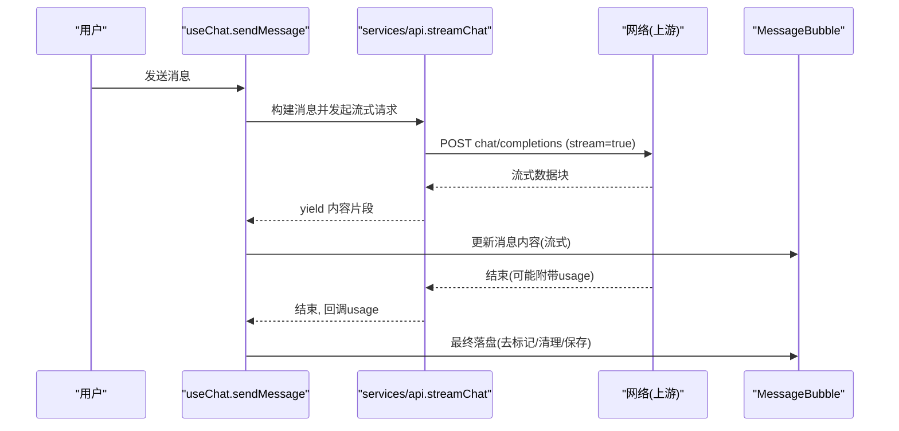
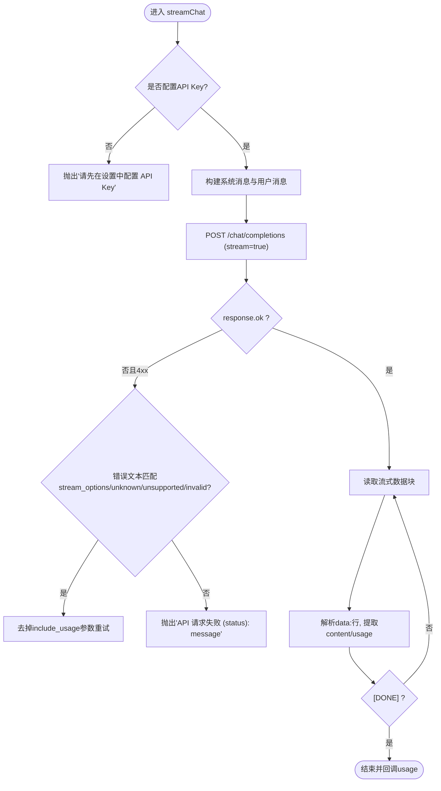
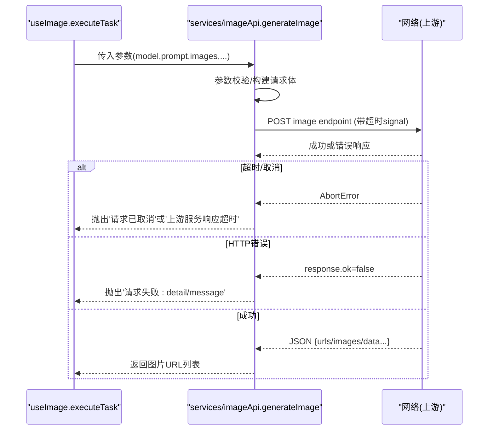
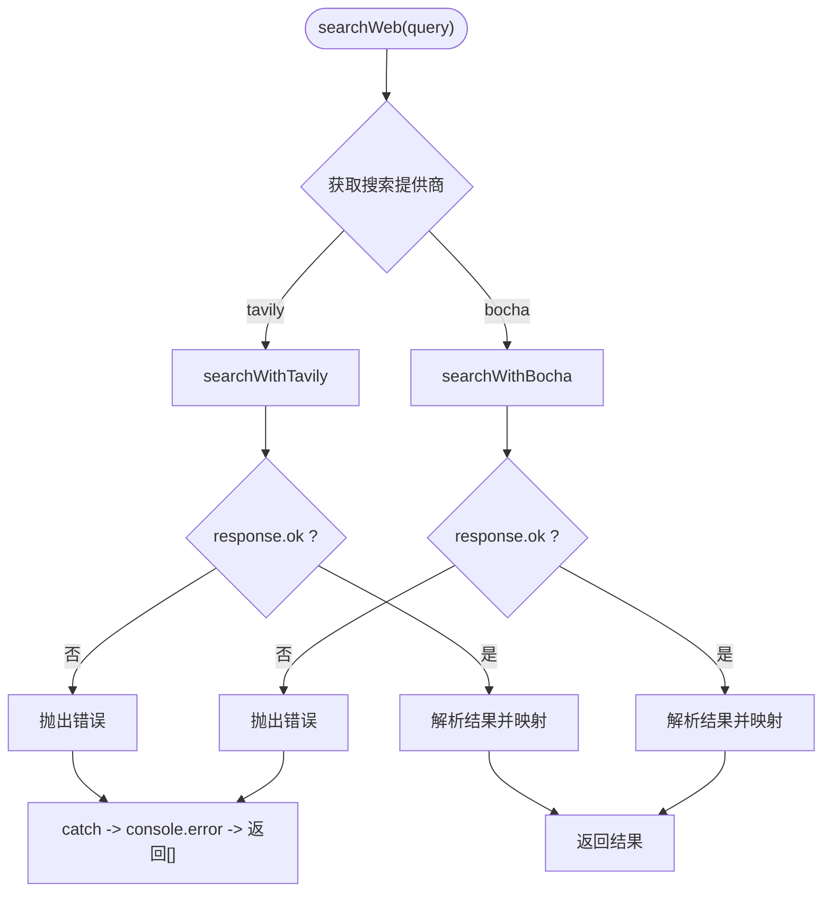
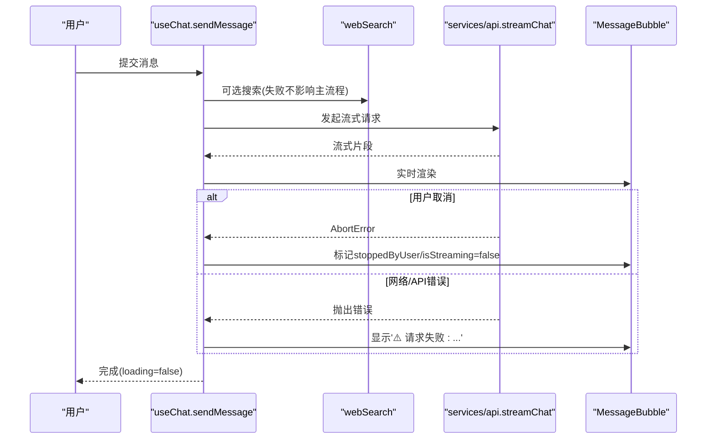
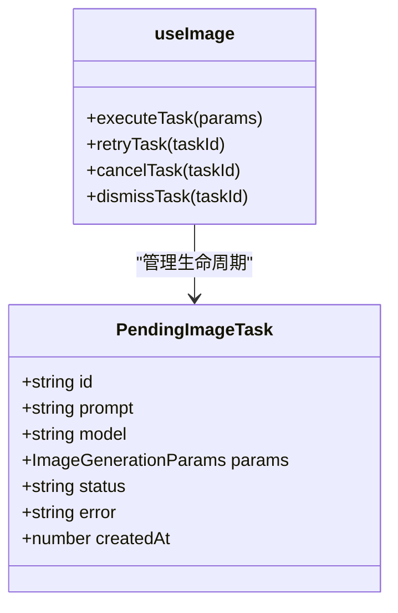
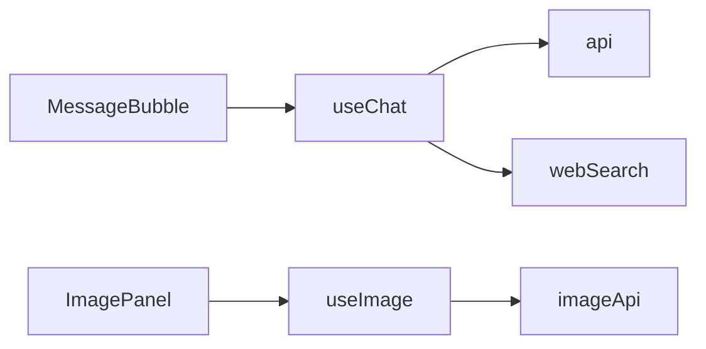

# 错误处理与重试

<cite>
**本文引用的文件**
- [src/services/api.ts](file://src/services/api.ts)
- [src/services/imageApi.ts](file://src/services/imageApi.ts)
- [src/services/webSearch.ts](file://src/services/webSearch.ts)
- [src/hooks/useChat.ts](file://src/hooks/useChat.ts)
- [src/hooks/useImage.ts](file://src/hooks/useImage.ts)
- [src/components/image/ImagePanel.tsx](file://src/components/image/ImagePanel.tsx)
- [src/components/chat/MessageBubble.tsx](file://src/components/chat/MessageBubble.tsx)
- [src/types/index.ts](file://src/types/index.ts)
</cite>

## 目录
1. [简介](#简介)
2. [项目结构](#项目结构)
3. [核心组件](#核心组件)
4. [架构总览](#架构总览)
5. [详细组件分析](#详细组件分析)
6. [依赖关系分析](#依赖关系分析)
7. [性能考量](#性能考量)
8. [故障排查指南](#故障排查指南)
9. [结论](#结论)
10. [附录](#附录)

## 简介
本文件面向 AIShop 项目的错误处理与重试机制，系统化梳理网络异常、API 错误、用户输入错误的统一处理策略；说明流式对话与图片生成的超时控制、取消机制与前端重试能力；并给出错误日志记录、用户友好提示与故障恢复建议。文档同时提供错误诊断方法与调试技巧，帮助快速定位问题。

## 项目结构
AIShop 的错误处理主要分布在以下层次：
- 服务层（services）：封装对外部 API 的调用、超时控制、错误解析与抛出。
- Hook 层（hooks）：编排业务流程，捕获服务层错误，更新 UI 状态，提供重试入口。
- 组件层（components）：展示错误信息、提供重试/关闭等交互。
- 类型定义（types）：描述消息、任务、用量等数据结构，支撑错误上下文传递。

图表来源
- [src/services/api.ts:44-173](file://src/services/api.ts#L44-L173)
- [src/services/imageApi.ts:149-243](file://src/services/imageApi.ts#L149-L243)
- [src/services/webSearch.ts:23-36](file://src/services/webSearch.ts#L23-L36)
- [src/hooks/useChat.ts:494-783](file://src/hooks/useChat.ts#L494-L783)
- [src/hooks/useImage.ts:275-356](file://src/hooks/useImage.ts#L275-L356)

章节来源
- [src/services/api.ts:44-173](file://src/services/api.ts#L44-L173)
- [src/services/imageApi.ts:149-243](file://src/services/imageApi.ts#L149-L243)
- [src/services/webSearch.ts:23-36](file://src/services/webSearch.ts#L23-L36)
- [src/hooks/useChat.ts:494-783](file://src/hooks/useChat.ts#L494-L783)
- [src/hooks/useImage.ts:275-356](file://src/hooks/useImage.ts#L275-L356)

## 核心组件
- 流式对话服务（api.ts）：负责构建消息、发送流式请求、解析 usage、兼容网关差异、在特定 4xx 情况下自动重试一次。
- 图片生成服务（imageApi.ts）：负责参数校验、模型路由、请求体构建、超时控制、错误响应解析、URL 提取。
- 联网搜索服务（webSearch.ts）：根据设置选择搜索引擎，统一返回结果或空数组，失败时降级为无搜索结果。
- 聊天 Hook（useChat.ts）：组织发送流程（压缩、搜索、流式输出）、捕获错误、更新消息状态、支持用户取消。
- 图片 Hook（useImage.ts）：管理并发队列、任务生命周期、错误态、重试与取消。
- 组件层：MessageBubble 展示 AI 回复与错误提示；ImagePanel 展示图片历史与待处理任务（含错误卡片）。

章节来源
- [src/services/api.ts:44-173](file://src/services/api.ts#L44-L173)
- [src/services/imageApi.ts:149-243](file://src/services/imageApi.ts#L149-L243)
- [src/services/webSearch.ts:23-36](file://src/services/webSearch.ts#L23-L36)
- [src/hooks/useChat.ts:494-783](file://src/hooks/useChat.ts#L494-L783)
- [src/hooks/useImage.ts:275-356](file://src/hooks/useImage.ts#L275-L356)
- [src/components/chat/MessageBubble.tsx:327-800](file://src/components/chat/MessageBubble.tsx#L327-L800)
- [src/components/image/ImagePanel.tsx:703-731](file://src/components/image/ImagePanel.tsx#L703-L731)

## 架构总览
错误处理贯穿“服务层抛错 → Hook 层捕获 → 组件层呈现”的链路。关键路径如下：
- 对话流：useChat.sendMessage → services/api.streamChat → fetch 流式响应 → 解析 chunk → 回调 usage → 更新消息。
- 图片生成：useImage.executeTask → services/imageApi.generateImage → fetch 带超时 → 解析响应 → 写入历史。
- 联网搜索：useChat.sendMessage → services/webSearch.searchWeb → 选择引擎 → 返回结果或空数组。

图表来源
- [src/hooks/useChat.ts:494-783](file://src/hooks/useChat.ts#L494-L783)
- [src/services/api.ts:44-173](file://src/services/api.ts#L44-L173)
- [src/components/chat/MessageBubble.tsx:327-800](file://src/components/chat/MessageBubble.tsx#L327-L800)

## 详细组件分析

### 流式对话错误处理（api.ts）
- 配置校验：若未配置 LLM API Key，直接抛出明确错误。
- 兼容性重试：当网关不支持 stream_options/include_usage 时，会收到 4xx，代码会识别相关错误文本并去掉该参数重试一次，避免因为可选功能导致主流程失败。
- 非 2xx 响应：读取响应体，构造包含状态码与原始信息的错误消息并抛出。
- 流式读取：使用 ReadableStream 逐行解析 data: 行，跳过残缺 JSON，收集 usage，并在结束时回调。
- 资源释放：finally 中确保即使异常也会尝试回调 usage。

图表来源
- [src/services/api.ts:44-173](file://src/services/api.ts#L44-L173)

章节来源
- [src/services/api.ts:44-173](file://src/services/api.ts#L44-L173)

### 图片生成错误处理（imageApi.ts）
- 参数校验：缺失 model/prompt、不支持的模型都会立即抛出错误。
- 超时控制：使用 AbortController 设置 120s 超时，并与外部 signal 合并，区分“用户取消”和“内部超时”。
- 网络异常：捕获 AbortError 或其他异常，抛出清晰的用户可理解错误。
- HTTP 错误：解析响应体中的 detail/error.message，组合成可读错误消息抛出。
- 结果校验：若未返回图片地址，抛出“未返回图片地址”。

图表来源
- [src/services/imageApi.ts:149-243](file://src/services/imageApi.ts#L149-L243)
- [src/hooks/useImage.ts:275-356](file://src/hooks/useImage.ts#L275-L356)

章节来源
- [src/services/imageApi.ts:149-243](file://src/services/imageApi.ts#L149-L243)
- [src/hooks/useImage.ts:275-356](file://src/hooks/useImage.ts#L275-L356)

### 联网搜索错误处理（webSearch.ts）
- 提供商选择：根据设置选择 bocha 或 tavily。
- 失败降级：任一搜索失败均捕获异常并返回空数组，不阻断主流程。
- 结果格式化：将不同引擎的结果统一为 SearchResult 结构，便于后续注入上下文。

图表来源
- [src/services/webSearch.ts:23-36](file://src/services/webSearch.ts#L23-L36)
- [src/services/webSearch.ts:41-69](file://src/services/webSearch.ts#L41-L69)
- [src/services/webSearch.ts:74-105](file://src/services/webSearch.ts#L74-L105)

章节来源
- [src/services/webSearch.ts:23-36](file://src/services/webSearch.ts#L23-L36)
- [src/services/webSearch.ts:41-69](file://src/services/webSearch.ts#L41-L69)
- [src/services/webSearch.ts:74-105](file://src/services/webSearch.ts#L74-L105)

### 聊天 Hook 错误处理（useChat.ts）
- 发送前准备：检查压缩水位、构建消息、可选联网搜索。
- 流式消费：迭代 streamChat 产出内容，实时更新消息。
- 错误分支：
  - AbortError：视为用户主动停止，更新消息状态（保留已有内容或清空），不显示错误。
  - 其他错误：设置全局 error 状态，并将最后一条 assistant 消息内容改为“⚠️ 请求失败: ...”，同时清除 isStreaming。
- 收尾：finally 中重置 loading 与 abort controller。

图表来源
- [src/hooks/useChat.ts:494-783](file://src/hooks/useChat.ts#L494-L783)
- [src/components/chat/MessageBubble.tsx:327-800](file://src/components/chat/MessageBubble.tsx#L327-L800)

章节来源
- [src/hooks/useChat.ts:494-783](file://src/hooks/useChat.ts#L494-L783)
- [src/components/chat/MessageBubble.tsx:327-800](file://src/components/chat/MessageBubble.tsx#L327-L800)

### 图片 Hook 错误处理与重试（useImage.ts）
- 任务队列：每个任务独立 AbortController，支持取消与超时。
- 错误分类：
  - AbortError 且控制器仍存在：判定为超时，任务状态设为 error，错误信息“请求超时，请稍后重试”。
  - AbortError 且控制器不存在：判定为用户手动取消，移除任务。
  - 其他错误：任务状态设为 error，错误信息为具体消息。
- 重试机制：提供 retryTask，基于原参数重新执行 executeTask。
- UI 集成：ImagePanel 渲染 ErrorCard，提供“重试”和“关闭”按钮。

图表来源
- [src/types/index.ts:205-214](file://src/types/index.ts#L205-L214)
- [src/hooks/useImage.ts:275-356](file://src/hooks/useImage.ts#L275-L356)
- [src/hooks/useImage.ts:389-412](file://src/hooks/useImage.ts#L389-L412)
- [src/components/image/ImagePanel.tsx:703-731](file://src/components/image/ImagePanel.tsx#L703-L731)

章节来源
- [src/types/index.ts:205-214](file://src/types/index.ts#L205-L214)
- [src/hooks/useImage.ts:275-356](file://src/hooks/useImage.ts#L275-L356)
- [src/hooks/useImage.ts:389-412](file://src/hooks/useImage.ts#L389-L412)
- [src/components/image/ImagePanel.tsx:703-731](file://src/components/image/ImagePanel.tsx#L703-L731)

## 依赖关系分析
- 耦合点：
  - useChat 依赖 services/api 与 services/webSearch，对错误进行上层聚合与 UI 同步。
  - useImage 依赖 services/imageApi，对任务级错误进行细粒度管理与重试。
  - 组件层仅关注展示与交互，不直接处理网络细节。
- 外部依赖：
  - fetch 与 AbortController 用于网络请求与取消/超时控制。
  - 上游 API 的响应格式差异通过解析适配（如 usage、图片 URL 字段）。
- 循环依赖：未发现明显循环依赖，服务层与 Hook 层职责清晰。

图表来源
- [src/hooks/useChat.ts:494-783](file://src/hooks/useChat.ts#L494-L783)
- [src/hooks/useImage.ts:275-356](file://src/hooks/useImage.ts#L275-L356)
- [src/services/api.ts:44-173](file://src/services/api.ts#L44-L173)
- [src/services/imageApi.ts:149-243](file://src/services/imageApi.ts#L149-L243)
- [src/services/webSearch.ts:23-36](file://src/services/webSearch.ts#L23-L36)

章节来源
- [src/hooks/useChat.ts:494-783](file://src/hooks/useChat.ts#L494-L783)
- [src/hooks/useImage.ts:275-356](file://src/hooks/useImage.ts#L275-L356)
- [src/services/api.ts:44-173](file://src/services/api.ts#L44-L173)
- [src/services/imageApi.ts:149-243](file://src/services/imageApi.ts#L149-L243)
- [src/services/webSearch.ts:23-36](file://src/services/webSearch.ts#L23-L36)

## 性能考量
- 流式处理：按行解析 data: 块，避免等待完整响应，提升首字速度。
- 超时控制：图片生成设置 120s 超时，防止长时间挂起影响体验。
- 降级策略：联网搜索失败不影响主流程；网关不支持 include_usage 时自动重试一次。
- 内存管理：流结束后及时释放 reader，避免泄漏。

[本节为通用指导，不直接分析具体文件]

## 故障排查指南
- 常见问题定位
  - 未配置 API Key：服务层直接抛出明确错误，需在设置中补齐。
  - 网关不支持 include_usage：出现 4xx 时会自动重试一次；若仍失败，查看上游错误文本。
  - 图片生成超时：任务状态变为 error，错误信息为“请求超时，请稍后重试”，可点击重试。
  - 用户取消：AbortError 被识别为取消，不会显示错误，消息标记 stoppedByUser。
- 日志与调试
  - 搜索服务：console.log 打印当前搜索提供商；console.error 记录失败原因。
  - 图片服务：console.error 记录加载历史失败、保存历史失败等。
  - 聊天 Hook：启动加载失败、持久化失败等均有 console.error。
- 恢复策略
  - 联网搜索失败：继续正常对话，不阻塞。
  - 图片生成失败：提供重试入口，允许用户再次尝试。
  - 流式对话失败：显示友好提示，允许用户重新发送。

章节来源
- [src/services/webSearch.ts:23-36](file://src/services/webSearch.ts#L23-L36)
- [src/hooks/useImage.ts:143-150](file://src/hooks/useImage.ts#L143-L150)
- [src/hooks/useImage.ts:332-336](file://src/hooks/useImage.ts#L332-L336)
- [src/hooks/useChat.ts:195-288](file://src/hooks/useChat.ts#L195-L288)
- [src/hooks/useChat.ts:741-783](file://src/hooks/useChat.ts#L741-L783)

## 结论
AIShop 的错误处理遵循“服务层抛错、Hook 层捕获、组件层呈现”的分层原则，针对网络异常、API 错误与用户输入错误提供了统一的捕获与处理策略。流式对话具备兼容性重试能力，图片生成具备超时控制与用户取消能力，并提供任务级重试。联网搜索采用失败降级策略，保证主流程稳定。整体设计兼顾用户体验与健壮性，便于扩展与维护。

[本节为总结，不直接分析具体文件]

## 附录
- 错误分类速查
  - 配置类错误：缺少 API Key，需引导用户到设置页补齐。
  - 网络类错误：超时、连接失败，提示“请求失败/超时”，支持重试。
  - API 类错误：上游返回 4xx/5xx，解析 detail 或 error.message 展示给用户。
  - 用户操作类错误：取消生成、输入为空等，UI 即时反馈。
- 重试策略现状与建议
  - 现状：对话流在特定 4xx 下自动重试一次；图片生成提供用户触发重试。
  - 建议：可扩展指数退避重试（例如最多 3 次，间隔递增），并结合错误类型决定是否重试（如 4xx 通常不重试，5xx/网络错误可重试）。
- 日志规范建议
  - 统一错误对象包装，包含时间戳、模块名、错误码、堆栈摘要。
  - 敏感信息脱敏（如 API Key、用户输入中的隐私内容）。
  - 分级日志（info/warn/error），便于生产环境过滤。

[本节为通用指导，不直接分析具体文件]