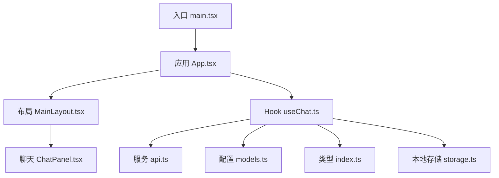
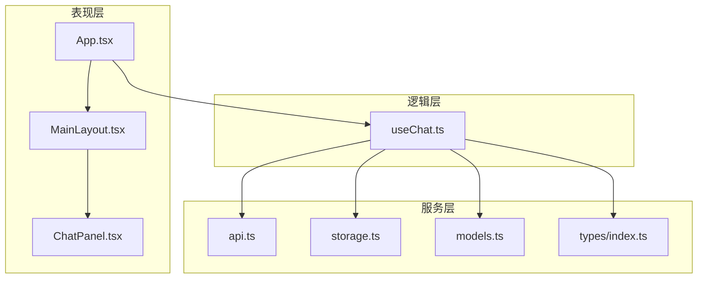
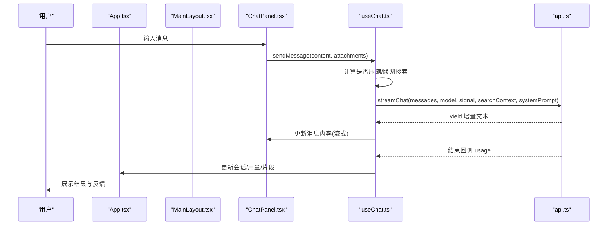
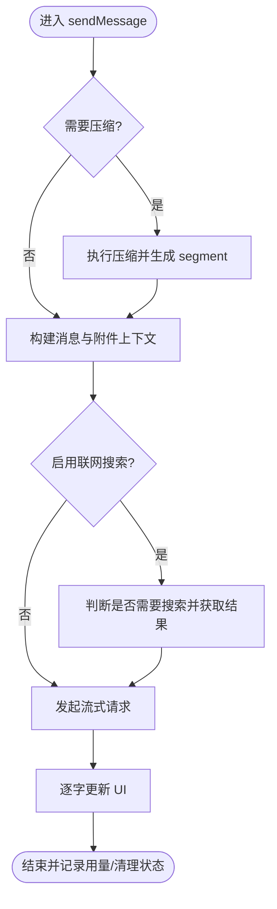
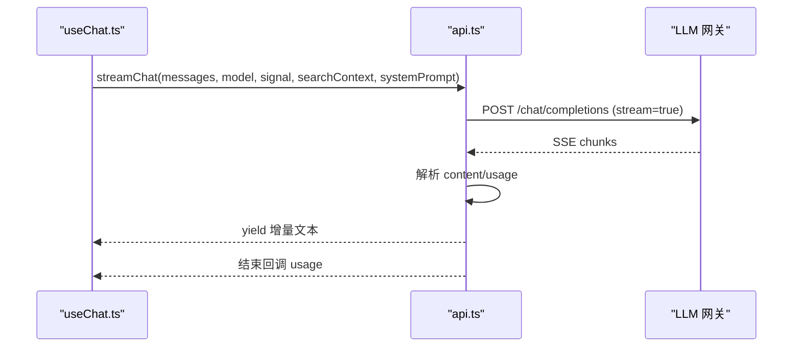
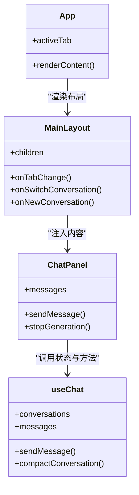
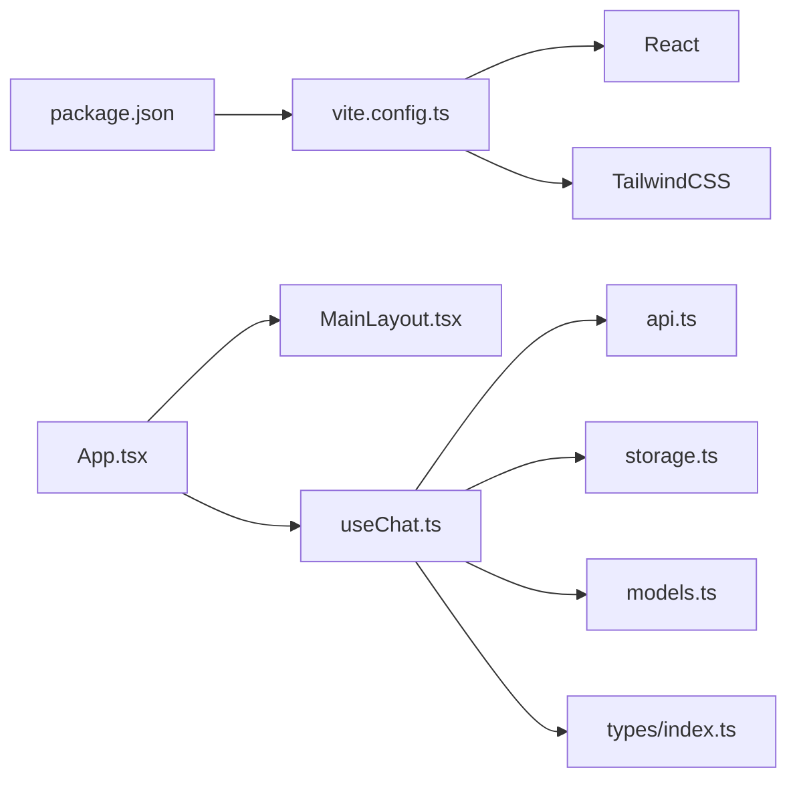

# 整体架构概览

<cite>
**本文引用的文件**
- [package.json](file://package.json)
- [vite.config.ts](file://vite.config.ts)
- [README.md](file://README.md)
- [src/main.tsx](file://src/main.tsx)
- [src/App.tsx](file://src/App.tsx)
- [src/components/layout/MainLayout.tsx](file://src/components/layout/MainLayout.tsx)
- [src/hooks/useChat.ts](file://src/hooks/useChat.ts)
- [src/services/api.ts](file://src/services/api.ts)
- [src/config/models.ts](file://src/config/models.ts)
- [src/types/index.ts](file://src/types/index.ts)
- [src/components/chat/ChatPanel.tsx](file://src/components/chat/ChatPanel.tsx)
- [src/services/storage.ts](file://src/services/storage.ts)
</cite>

## 目录
1. [简介](#简介)
2. [项目结构](#项目结构)
3. [核心组件](#核心组件)
4. [架构总览](#架构总览)
5. [详细组件分析](#详细组件分析)
6. [依赖关系分析](#依赖关系分析)
7. [性能考量](#性能考量)
8. [故障排查指南](#故障排查指南)
9. [结论](#结论)
10. [附录](#附录)

## 简介
本文件面向 AIShop 项目的整体架构，聚焦高层设计模式与工程实践。项目采用 React + TypeScript + Vite 的前端技术栈，围绕“对话式 AI”能力构建多模态工作区（聊天、图像、收藏、设置等）。系统以 Hook 模式组织状态与副作用，通过分层架构将 UI、业务逻辑、数据持久化与外部 API 解耦；同时提供上下文压缩、联网搜索、Artifact 流式渲染等高级特性。文档将说明启动流程、模块划分、数据流向、可扩展性与插件机制，并给出架构图表与最佳实践建议。

## 项目结构
AIShop 采用按职责分层的目录组织：
- src/components：UI 组件（布局、聊天面板、图像面板、通用组件等）
- src/hooks：可复用的状态与副作用封装（如 useChat）
- src/services：对外部服务与本地存储的封装（API 调用、IndexedDB、设置、标题生成、网络搜索等）
- src/config：配置项（模型列表、提示词等）
- src/types：类型定义
- 根级配置：Vite、ESLint、TypeScript 配置与包管理

图表来源
- [src/main.tsx:1-8](file://src/main.tsx#L1-L8)
- [src/App.tsx:1-147](file://src/App.tsx#L1-L147)
- [src/components/layout/MainLayout.tsx:1-205](file://src/components/layout/MainLayout.tsx#L1-L205)
- [src/hooks/useChat.ts:1-800](file://src/hooks/useChat.ts#L1-L800)
- [src/services/api.ts:1-173](file://src/services/api.ts#L1-L173)
- [src/config/models.ts:1-284](file://src/config/models.ts#L1-L284)
- [src/types/index.ts:1-252](file://src/types/index.ts#L1-L252)
- [src/services/storage.ts:1-63](file://src/services/storage.ts#L1-L63)

章节来源
- [package.json:1-47](file://package.json#L1-L47)
- [vite.config.ts:1-18](file://vite.config.ts#L1-L18)
- [README.md:1-74](file://README.md#L1-L74)

## 核心组件
- 应用容器 App：负责主题初始化、持久化存储申请、标签页切换、聚合各功能面板与全局状态透传。
- 布局 MainLayout：统一侧边栏、顶部导航、底部导航与内容区域，处理手势与键盘交互。
- 聊天 Hook useChat：封装会话生命周期、消息发送、流式响应、上下文压缩、联网搜索、Artifact 流式解析与持久化策略。
- API 服务 api：封装流式请求、用量解析、错误重试与 Blob 内联。
- 模型配置 models：集中声明支持的模型元信息（提供商、能力、价格、上下文长度等）。
- 类型定义 types：贯穿全项目的数据结构契约（Message、Conversation、Model、TokenUsage 等）。
- 存储 storage：轻量同步读写（主题、最后模型、上次会话、联网开关）。

章节来源
- [src/App.tsx:1-147](file://src/App.tsx#L1-L147)
- [src/components/layout/MainLayout.tsx:1-205](file://src/components/layout/MainLayout.tsx#L1-L205)
- [src/hooks/useChat.ts:1-800](file://src/hooks/useChat.ts#L1-L800)
- [src/services/api.ts:1-173](file://src/services/api.ts#L1-L173)
- [src/config/models.ts:1-284](file://src/config/models.ts#L1-L284)
- [src/types/index.ts:1-252](file://src/types/index.ts#L1-L252)
- [src/services/storage.ts:1-63](file://src/services/storage.ts#L1-L63)

## 架构总览
AIShop 采用“组件化 + Hook 模式 + 分层架构”的设计：
- 组件层：React 函数组件，关注 UI 与用户交互
- 逻辑层：自定义 Hook（useChat）封装复杂状态机与副作用
- 服务层：api、storage、webSearch、titleGenerator 等，屏蔽外部细节
- 配置与类型：models、types，作为稳定契约与扩展点

图表来源
- [src/App.tsx:1-147](file://src/App.tsx#L1-L147)
- [src/components/layout/MainLayout.tsx:1-205](file://src/components/layout/MainLayout.tsx#L1-L205)
- [src/components/chat/ChatPanel.tsx:1-200](file://src/components/chat/ChatPanel.tsx#L1-L200)
- [src/hooks/useChat.ts:1-800](file://src/hooks/useChat.ts#L1-L800)
- [src/services/api.ts:1-173](file://src/services/api.ts#L1-L173)
- [src/services/storage.ts:1-63](file://src/services/storage.ts#L1-L63)
- [src/config/models.ts:1-284](file://src/config/models.ts#L1-L284)
- [src/types/index.ts:1-252](file://src/types/index.ts#L1-L252)

## 详细组件分析

### 启动流程与数据流
- 入口渲染：main.tsx 创建根节点并挂载 App
- 应用初始化：App 加载主题、申请持久化存储、初始化标签页与 Hook 状态
- 会话恢复：useChat 在启动时读取会话列表，优先恢复上次会话的消息与片段
- 发送消息：用户输入后，useChat 组装消息、可选联网搜索、调用流式 API，逐字更新 UI
- 用量与压缩：流结束时记录真实用量；接近上下文上限时自动压缩历史为摘要段

图表来源
- [src/main.tsx:1-8](file://src/main.tsx#L1-L8)
- [src/App.tsx:1-147](file://src/App.tsx#L1-L147)
- [src/components/layout/MainLayout.tsx:1-205](file://src/components/layout/MainLayout.tsx#L1-L205)
- [src/components/chat/ChatPanel.tsx:1-200](file://src/components/chat/ChatPanel.tsx#L1-L200)
- [src/hooks/useChat.ts:1-800](file://src/hooks/useChat.ts#L1-L800)
- [src/services/api.ts:1-173](file://src/services/api.ts#L1-L173)

章节来源
- [src/main.tsx:1-8](file://src/main.tsx#L1-L8)
- [src/App.tsx:1-147](file://src/App.tsx#L1-L147)
- [src/hooks/useChat.ts:1-800](file://src/hooks/useChat.ts#L1-L800)
- [src/services/api.ts:1-173](file://src/services/api.ts#L1-L173)

### 聊天与会话状态机（useChat）
- 启动阶段：加载会话列表、恢复上次会话、补齐缺失标题
- 持久化：diff 写入 IndexedDB，避免全量写盘卡顿
- 发送阶段：构造消息、可选联网搜索、流式接收、Artifact 检测、用量记录
- 压缩阶段：基于阈值与热窗口计划压缩区间，生成摘要段，支持撤销与编辑
- 错误处理：AbortError 取消、网络错误降级与回退

图表来源
- [src/hooks/useChat.ts:1-800](file://src/hooks/useChat.ts#L1-L800)

章节来源
- [src/hooks/useChat.ts:1-800](file://src/hooks/useChat.ts#L1-L800)

### 流式 API 调用（api.ts）
- 动态选择提供商与密钥，拼接系统提示与搜索上下文
- 将图片引用还原为 data URL 后发送
- 使用 fetch + ReadableStream 解析 SSE，提取内容与用量
- 对不支持 include_usage 的网关进行参数回退重试

图表来源
- [src/services/api.ts:1-173](file://src/services/api.ts#L1-L173)
- [src/hooks/useChat.ts:1-800](file://src/hooks/useChat.ts#L1-L800)

章节来源
- [src/services/api.ts:1-173](file://src/services/api.ts#L1-L173)

### 组件交互关系
- App 作为顶层容器，持有 activeTab 与全局设置，向 MainLayout 传递会话、模型、联网开关、压缩状态等
- MainLayout 负责侧边栏、顶栏、底栏与内容区，将具体面板（聊天、图像、收藏、设置）注入 children
- ChatPanel 消费 useChat 暴露的方法与状态，实现消息展示、搜索、折叠浏览、Artifact 预览等

图表来源
- [src/App.tsx:1-147](file://src/App.tsx#L1-L147)
- [src/components/layout/MainLayout.tsx:1-205](file://src/components/layout/MainLayout.tsx#L1-L205)
- [src/components/chat/ChatPanel.tsx:1-200](file://src/components/chat/ChatPanel.tsx#L1-L200)
- [src/hooks/useChat.ts:1-800](file://src/hooks/useChat.ts#L1-L800)

章节来源
- [src/App.tsx:1-147](file://src/App.tsx#L1-L147)
- [src/components/layout/MainLayout.tsx:1-205](file://src/components/layout/MainLayout.tsx#L1-L205)
- [src/components/chat/ChatPanel.tsx:1-200](file://src/components/chat/ChatPanel.tsx#L1-L200)
- [src/hooks/useChat.ts:1-800](file://src/hooks/useChat.ts#L1-L800)

## 依赖关系分析
- 构建与工具链：Vite + React 插件 + TailwindCSS，提供快速开发与生产构建
- 运行时依赖：React、DOM、Markdown/KaTeX 渲染、IndexedDB、PDF/XLSX 解析、触感反馈等
- 模块耦合：
  - App 依赖 MainLayout、各功能面板与 useChat
  - useChat 依赖 api、storage、models、types 及多个 utils（压缩、估算、视图工具）
  - api 依赖 settingsService、providers 配置与 db 工具
  - 类型与配置作为稳定契约，降低耦合度

图表来源
- [package.json:1-47](file://package.json#L1-L47)
- [vite.config.ts:1-18](file://vite.config.ts#L1-L18)
- [src/App.tsx:1-147](file://src/App.tsx#L1-L147)
- [src/components/layout/MainLayout.tsx:1-205](file://src/components/layout/MainLayout.tsx#L1-L205)
- [src/hooks/useChat.ts:1-800](file://src/hooks/useChat.ts#L1-L800)
- [src/services/api.ts:1-173](file://src/services/api.ts#L1-L173)
- [src/services/storage.ts:1-63](file://src/services/storage.ts#L1-L63)
- [src/config/models.ts:1-284](file://src/config/models.ts#L1-L284)
- [src/types/index.ts:1-252](file://src/types/index.ts#L1-L252)

章节来源
- [package.json:1-47](file://package.json#L1-L47)
- [vite.config.ts:1-18](file://vite.config.ts#L1-L18)

## 性能考量
- 流式渲染：使用异步生成器逐字推送，减少首屏等待时间
- 增量持久化：对比前后快照仅写入变化部分，避免大会话全量写盘导致的卡顿
- 上下文压缩：根据阈值与热窗口智能压缩历史，控制上下文规模与成本
- 图片内联：仅在发送前将 IndexedDB 引用转为 data URL，避免提前占用内存
- 移动端体验：触觉反馈与滚动锚点优化，提升交互流畅度

[本节为通用性能讨论，不直接分析具体文件]

## 故障排查指南
- 联网失败或网关不支持 include_usage：api 会自动去掉该参数重试，若仍失败则抛出明确错误信息
- 用户主动停止：AbortError 被捕获并更新消息状态为已停止
- 启动加载失败：useChat 捕获异常并设置错误提示，同时保证界面可用
- 本地存储异常：storage 层 try/catch 忽略异常，确保不影响主流程

章节来源
- [src/services/api.ts:1-173](file://src/services/api.ts#L1-L173)
- [src/hooks/useChat.ts:1-800](file://src/hooks/useChat.ts#L1-L800)
- [src/services/storage.ts:1-63](file://src/services/storage.ts#L1-L63)

## 结论
AIShop 通过清晰的层次划分与 Hook 模式，实现了高内聚、低耦合的可维护前端架构。React + TypeScript + Vite 的组合提供了强大的类型安全、快速开发与构建能力；结合上下文压缩、联网搜索与 Artifact 流式渲染，满足现代 AI 应用的交互需求。系统在可扩展性方面具备良好基础：模型配置集中、类型契约清晰、服务层抽象完善，便于后续引入更多提供商与功能模块。

[本节为总结性内容，不直接分析具体文件]

## 附录

### 技术选型理由
- React：组件化与生态成熟，适合复杂交互与状态管理
- TypeScript：类型安全提升开发效率与可维护性
- Vite：极速开发与构建，插件体系丰富（React、Tailwind）
- TailwindCSS：原子化样式，快速构建一致 UI
- IndexedDB：大容量本地存储，支撑长会话与历史消息

章节来源
- [package.json:1-47](file://package.json#L1-L47)
- [vite.config.ts:1-18](file://vite.config.ts#L1-L18)
- [README.md:1-74](file://README.md#L1-L74)

### 系统边界定义
- 前端边界：浏览器环境，依赖 Web API（fetch、IndexedDB、navigator.vibrate）
- 后端边界：LLM 网关（OpenAI/Anthropic/Google/xAI/DeepSeek/智谱/Moonshot/Alibaba/ByteDance/Xiaomi），通过统一接口访问
- 数据边界：本地存储（localStorage/IndexedDB）与远程 API 之间的数据流转

[本节为概念性描述，不直接分析具体文件]

### 可扩展性与插件机制
- 模型扩展：在 models 中新增 Model 条目即可接入新提供商或模型
- 功能扩展：通过新增 Hook 与服务模块，并在 App/MainLayout 中集成
- 配置扩展：settingsService 与 providers 配置可作为插件化入口，支持多提供商切换
- 类型契约：types 中的 Message/Conversation/Model 等结构为新功能提供稳定扩展点

章节来源
- [src/config/models.ts:1-284](file://src/config/models.ts#L1-L284)
- [src/types/index.ts:1-252](file://src/types/index.ts#L1-L252)
- [src/App.tsx:1-147](file://src/App.tsx#L1-L147)
- [src/components/layout/MainLayout.tsx:1-205](file://src/components/layout/MainLayout.tsx#L1-L205)