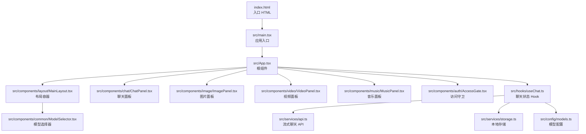
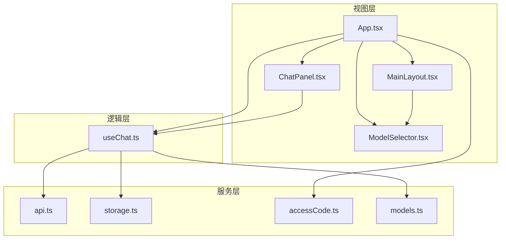
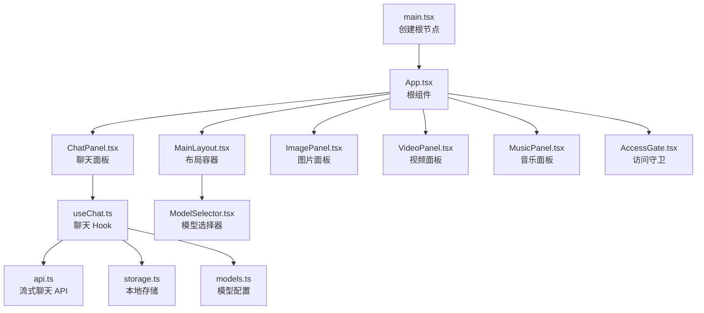
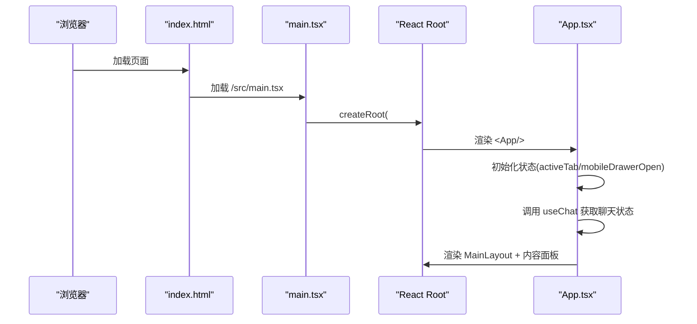

# 整体架构概览

<cite>
**本文档引用的文件**
- [main.tsx](file://src/main.tsx)
- [App.tsx](file://src/App.tsx)
- [index.html](file://index.html)
- [package.json](file://package.json)
- [vite.config.ts](file://vite.config.ts)
- [README.md](file://README.md)
- [MainLayout.tsx](file://src/components/layout/MainLayout.tsx)
- [ChatPanel.tsx](file://src/components/chat/ChatPanel.tsx)
- [ModelSelector.tsx](file://src/components/common/ModelSelector.tsx)
- [useChat.ts](file://src/hooks/useChat.ts)
- [api.ts](file://src/services/api.ts)
- [models.ts](file://src/config/models.ts)
- [storage.ts](file://src/services/storage.ts)
- [accessCode.ts](file://src/services/accessCode.ts)
- [index.ts](file://src/types/index.ts)
</cite>

## 目录
1. [引言](#引言)
2. [项目结构](#项目结构)
3. [核心组件](#核心组件)
4. [架构总览](#架构总览)
5. [详细组件分析](#详细组件分析)
6. [依赖关系分析](#依赖关系分析)
7. [性能考虑](#性能考虑)
8. [故障排除指南](#故障排除指南)
9. [结论](#结论)

## 引言
本项目采用 React 19 + TypeScript + Vite 技术栈构建的单页应用(SPA)，围绕多模态 AI 创作能力（聊天、图片、视频、音乐）进行模块化组织。应用通过 Hook 抽象状态与业务逻辑，配合组件化设计实现清晰的职责分离与可维护性。技术选型强调开发体验、类型安全与构建效率，结合 TailwindCSS 实现快速样式迭代。

## 项目结构
项目采用按功能域分层的目录组织方式：
- src：源代码根目录
  - components：UI 组件库，按功能域拆分（auth、chat、common、image、layout、music、video）
  - hooks：自定义 Hook，封装业务逻辑与状态管理
  - services：API 调用、本地存储、工具函数等横切关注点
  - config：静态配置（如模型列表）
  - types：全局 TypeScript 类型定义
  - assets：静态资源
- api：后端接口（Edge Function 代理）
- public：公共资源（如提供商图标）

**图表来源**
- [index.html:1-14](file://index.html#L1-L14)
- [main.tsx:1-11](file://src/main.tsx#L1-L11)
- [App.tsx:1-67](file://src/App.tsx#L1-L67)
- [MainLayout.tsx:1-227](file://src/components/layout/MainLayout.tsx#L1-L227)
- [ChatPanel.tsx:1-354](file://src/components/chat/ChatPanel.tsx#L1-L354)
- [ModelSelector.tsx:1-173](file://src/components/common/ModelSelector.tsx#L1-L173)
- [useChat.ts:1-370](file://src/hooks/useChat.ts#L1-L370)
- [api.ts:1-83](file://src/services/api.ts#L1-L83)
- [storage.ts:1-66](file://src/services/storage.ts#L1-L66)
- [models.ts:1-228](file://src/config/models.ts#L1-L228)

**章节来源**
- [index.html:1-14](file://index.html#L1-L14)
- [main.tsx:1-11](file://src/main.tsx#L1-L11)
- [App.tsx:1-67](file://src/App.tsx#L1-L67)

## 核心组件
- 应用入口与渲染
  - main.tsx：创建根节点并渲染 App，启用 React StrictMode
  - index.html：提供挂载点 #root
- 根组件 App
  - 维护活动标签页状态与移动端抽屉状态
  - 通过 useChat Hook 获取聊天状态与操作方法
  - 根据 activeTab 渲染对应功能面板
  - 通过 MainLayout 提供统一布局与侧边栏
- 布局系统 MainLayout
  - 桌面端：左侧 Sidebar + 主内容区
  - 移动端：顶部模型选择器 + 主内容 + 底部 Tab + 左侧抽屉（聊天）
  - 响应式检测与键盘事件处理
- 聊天面板 ChatPanel
  - 消息列表渲染与自动滚动
  - 导出 Markdown/JSON 会话
  - 拖拽导入 .aishop.json
  - 发送消息与停止生成
- 模型选择器 ModelSelector
  - 固定位置弹出菜单，支持上下自适应定位
  - Provider 图标映射与紧凑模式
- 自定义 Hook useChat
  - 会话持久化（localStorage）
  - 流式聊天（AsyncGenerator）
  - Web 搜索集成与上下文拼接
  - 标题自动生成与会话管理
- 服务层
  - api.ts：流式聊天 API 封装
  - storage.ts：会话与偏好存储
  - accessCode.ts：访问码校验与鉴权头注入
  - models.ts：多模型配置与查询

**章节来源**
- [main.tsx:1-11](file://src/main.tsx#L1-L11)
- [App.tsx:1-67](file://src/App.tsx#L1-L67)
- [MainLayout.tsx:1-227](file://src/components/layout/MainLayout.tsx#L1-L227)
- [ChatPanel.tsx:1-354](file://src/components/chat/ChatPanel.tsx#L1-L354)
- [ModelSelector.tsx:1-173](file://src/components/common/ModelSelector.tsx#L1-L173)
- [useChat.ts:1-370](file://src/hooks/useChat.ts#L1-L370)
- [api.ts:1-83](file://src/services/api.ts#L1-L83)
- [storage.ts:1-66](file://src/services/storage.ts#L1-L66)
- [accessCode.ts:1-113](file://src/services/accessCode.ts#L1-L113)
- [models.ts:1-228](file://src/config/models.ts#L1-L228)

## 架构总览
应用采用“组件化 + Hook 抽象 + 服务层”的分层架构：
- 视图层：React 组件负责 UI 渲染与用户交互
- 逻辑层：自定义 Hook 将状态与副作用抽象为可复用单元
- 服务层：封装 API、存储与工具函数，隔离跨域与本地持久化细节
- 配置层：集中管理模型与静态资源

**图表来源**
- [App.tsx:1-67](file://src/App.tsx#L1-L67)
- [MainLayout.tsx:1-227](file://src/components/layout/MainLayout.tsx#L1-L227)
- [ChatPanel.tsx:1-354](file://src/components/chat/ChatPanel.tsx#L1-L354)
- [ModelSelector.tsx:1-173](file://src/components/common/ModelSelector.tsx#L1-L173)
- [useChat.ts:1-370](file://src/hooks/useChat.ts#L1-L370)
- [api.ts:1-83](file://src/services/api.ts#L1-L83)
- [storage.ts:1-66](file://src/services/storage.ts#L1-L66)
- [accessCode.ts:1-113](file://src/services/accessCode.ts#L1-L113)
- [models.ts:1-228](file://src/config/models.ts#L1-L228)

## 详细组件分析

### 组件层次与数据流

**图表来源**
- [main.tsx:1-11](file://src/main.tsx#L1-L11)
- [App.tsx:1-67](file://src/App.tsx#L1-L67)
- [MainLayout.tsx:1-227](file://src/components/layout/MainLayout.tsx#L1-L227)
- [ChatPanel.tsx:1-354](file://src/components/chat/ChatPanel.tsx#L1-L354)
- [ModelSelector.tsx:1-173](file://src/components/common/ModelSelector.tsx#L1-L173)
- [useChat.ts:1-370](file://src/hooks/useChat.ts#L1-L370)
- [api.ts:1-83](file://src/services/api.ts#L1-L83)
- [storage.ts:1-66](file://src/services/storage.ts#L1-L66)
- [models.ts:1-228](file://src/config/models.ts#L1-L228)

### 组件间通信机制
- Props 传递
  - App 向 MainLayout 传递活动标签页、会话列表与回调
  - MainLayout 向 ChatPanel 传递消息、加载状态与发送/停止方法
  - ModelSelector 接收模型列表与当前选中模型，并通过回调更新
- 事件冒泡与回调
  - ChatPanel 通过 onSend/onStop/onImportConversation 等回调向上游传递
  - MainLayout 在移动端抽屉中通过回调同步会话切换与新建
- 状态提升
  - useChat 将会话状态与操作方法提升至 App，实现跨组件共享
  - 访问码状态通过 authedFetch 注入请求头并在 401 时广播事件

**章节来源**
- [App.tsx:1-67](file://src/App.tsx#L1-L67)
- [MainLayout.tsx:1-227](file://src/components/layout/MainLayout.tsx#L1-L227)
- [ChatPanel.tsx:1-354](file://src/components/chat/ChatPanel.tsx#L1-L354)
- [ModelSelector.tsx:1-173](file://src/components/common/ModelSelector.tsx#L1-L173)
- [useChat.ts:1-370](file://src/hooks/useChat.ts#L1-L370)
- [accessCode.ts:1-113](file://src/services/accessCode.ts#L1-L113)

### 生命周期与内存管理
- 组件生命周期
  - useChat 中通过 useEffect 执行会话持久化与清理
  - MainLayout 使用 useIsDesktop 响应式检测与事件监听注册/清理
  - ChatPanel 管理滚动位置与导出菜单的点击外部关闭事件
- 内存管理策略
  - 使用 AbortController 控制流式请求取消，避免悬挂请求
  - 对 Blob URL 使用 URL.revokeObjectURL 及时释放
  - 通过 useCallback 优化回调稳定性，减少不必要的重渲染
  - localStorage 存储采用 try/catch 防止异常影响主流程

**章节来源**
- [useChat.ts:1-370](file://src/hooks/useChat.ts#L1-L370)
- [MainLayout.tsx:1-227](file://src/components/layout/MainLayout.tsx#L1-L227)
- [ChatPanel.tsx:1-354](file://src/components/chat/ChatPanel.tsx#L1-L354)

### 启动流程（从 main.tsx 到 App.tsx）

**图表来源**
- [index.html:1-14](file://index.html#L1-L14)
- [main.tsx:1-11](file://src/main.tsx#L1-L11)
- [App.tsx:1-67](file://src/App.tsx#L1-L67)

## 依赖关系分析
- 构建与开发工具
  - Vite：快速开发服务器与打包工具
  - @vitejs/plugin-react：React HMR 与编译支持
  - TailwindCSS：原子化样式框架
  - TypeScript：类型安全保障
- 运行时依赖
  - React 19：最新特性与并发能力
  - lucide-react：图标库
  - highlight.js、react-markdown、remark-gfm：Markdown 渲染与语法高亮
- 开发依赖
  - ESLint 及 React 特定插件：代码质量与规范

**章节来源**
- [package.json:1-40](file://package.json#L1-L40)
- [vite.config.ts:1-11](file://vite.config.ts#L1-L11)
- [README.md:1-74](file://README.md#L1-L74)

## 性能考虑
- 构建与运行时优化
  - Vite 提供快速冷启动与热更新，适合快速迭代
  - React 19 与 React Compiler（模板未启用）提升渲染性能
  - TailwindCSS 按需引入，减少 CSS 体积
- 业务性能
  - 流式响应：使用 AsyncGenerator 逐步渲染，降低首帧延迟
  - 会话持久化：localStorage 减少初始化成本
  - 模型选择器使用 Portal 渲染，避免层级嵌套导致的重绘
- 内存与资源
  - 及时释放 Blob URL 与事件监听
  - 使用 AbortController 取消不再需要的请求

## 故障排除指南
- 访问码相关
  - 401 未授权：authedFetch 会清除本地访问码并广播事件，确保 AccessGate 能够捕获并引导登录
  - 校验失败：probeAccessCode 与 verifyAccessCode 提供探测与验证能力，包含限速反馈
- 聊天流式响应
  - 请求中断：stopGeneration 使用 AbortController 取消，确保状态一致
  - 解析异常：streamChat 对异常 JSON 进行跳过处理，保证稳定性
- 本地存储
  - 存储失败：storage.ts 对异常进行捕获，避免影响主流程
- 导出与导入
  - 导出：检查消息列表非空与 Blob 支持
  - 导入：校验 .aishop.json 格式与版本字段

**章节来源**
- [accessCode.ts:1-113](file://src/services/accessCode.ts#L1-L113)
- [api.ts:1-83](file://src/services/api.ts#L1-L83)
- [storage.ts:1-66](file://src/services/storage.ts#L1-L66)
- [ChatPanel.tsx:1-354](file://src/components/chat/ChatPanel.tsx#L1-L354)

## 结论
本项目通过 React 19 + TypeScript + Vite 的组合，实现了高性能、可维护的多模态 AI 创作平台前端架构。组件化设计与 Hook 抽象使得状态与业务逻辑清晰分离，服务层封装了 API 与存储细节，配合响应式布局与流式渲染，提供了良好的用户体验与开发体验。未来可在以下方面持续优化：启用 React Compiler、完善错误边界、扩展测试覆盖、引入缓存策略等。