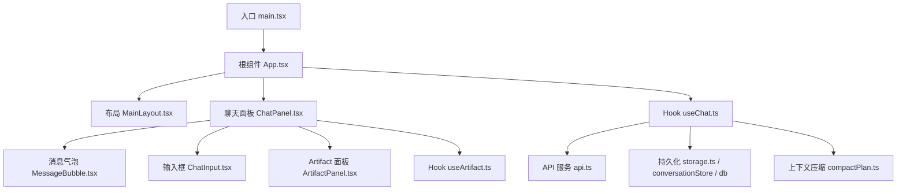
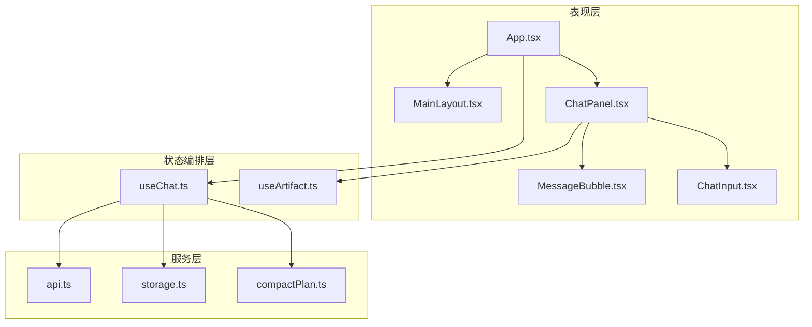
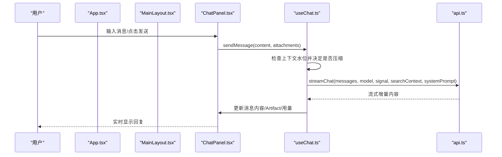
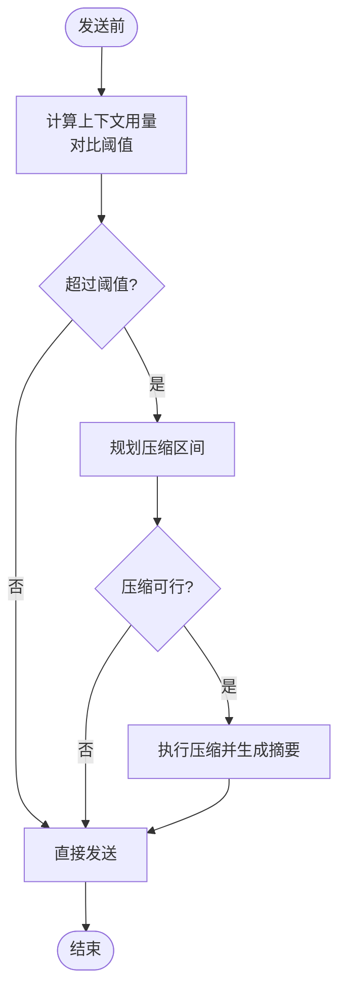
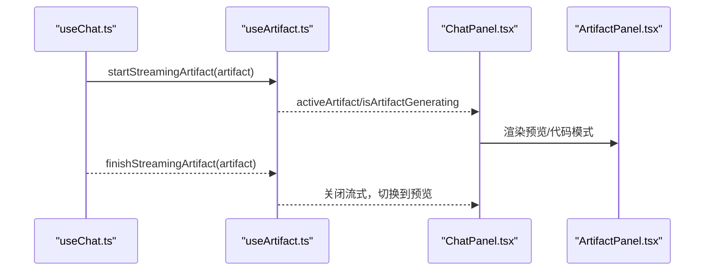
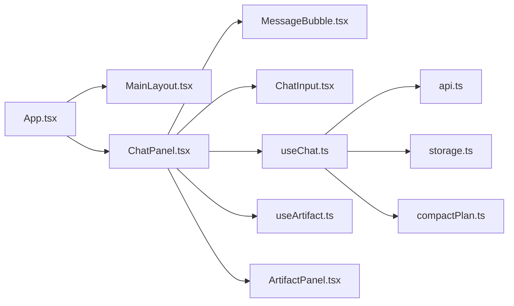
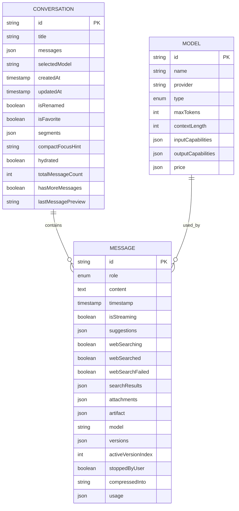

# 架构设计

<cite>
**本文引用的文件**
- [src/App.tsx](file://src/App.tsx)
- [src/main.tsx](file://src/main.tsx)
- [src/hooks/useChat.ts](file://src/hooks/useChat.ts)
- [src/services/api.ts](file://src/services/api.ts)
- [src/components/layout/MainLayout.tsx](file://src/components/layout/MainLayout.tsx)
- [src/components/chat/ChatPanel.tsx](file://src/components/chat/ChatPanel.tsx)
- [src/components/chat/MessageBubble.tsx](file://src/components/chat/MessageBubble.tsx)
- [src/components/chat/ChatInput.tsx](file://src/components/chat/ChatInput.tsx)
- [src/types/index.ts](file://src/types/index.ts)
- [src/config/models.ts](file://src/config/models.ts)
- [src/services/storage.ts](file://src/services/storage.ts)
- [src/utils/compactPlan.ts](file://src/utils/compactPlan.ts)
- [src/components/chat/CompactionMarker.tsx](file://src/components/chat/CompactionMarker.tsx)
- [src/components/artifact/ArtifactPanel.tsx](file://src/components/artifact/ArtifactPanel.tsx)
- [src/hooks/useArtifact.ts](file://src/hooks/useArtifact.ts)
</cite>

## 目录
1. [简介](#简介)
2. [项目结构](#项目结构)
3. [核心组件](#核心组件)
4. [架构总览](#架构总览)
5. [详细组件分析](#详细组件分析)
6. [依赖关系分析](#依赖关系分析)
7. [性能考量](#性能考量)
8. [故障排查指南](#故障排查指南)
9. [结论](#结论)
10. [附录](#附录)

## 简介
本架构文档面向 AIShop 前端应用，系统性阐述其整体架构模式与关键设计决策。重点包括：
- 组件化设计与分层架构（UI、状态管理、服务层、持久化）
- Hook 模式在业务编排中的使用
- 应用根组件 App.tsx 的结构与状态管理机制
- 数据流：从用户输入到 AI 响应的完整处理流程
- 系统边界、组件交互关系与依赖关系
- 可扩展性：插件式模型配置、API 扩展点
- 性能优化策略与最佳实践

## 项目结构
AIShop 采用 React + TypeScript + Vite 的前端工程组织方式，按“功能域 + 层次”混合划分：
- UI 层：components（布局、聊天、图像、设置等）
- 状态与编排：hooks（useChat、useArtifact 等）
- 服务层：services（API 调用、存储、搜索、标题生成等）
- 类型与配置：types、config（模型清单、提示词等）
- 工具与持久化：utils、db（IndexedDB）、storage（localStorage）

图表来源
- [src/main.tsx:1-8](file://src/main.tsx#L1-L8)
- [src/App.tsx:1-147](file://src/App.tsx#L1-L147)
- [src/components/layout/MainLayout.tsx:1-205](file://src/components/layout/MainLayout.tsx#L1-L205)
- [src/components/chat/ChatPanel.tsx:1-623](file://src/components/chat/ChatPanel.tsx#L1-L623)
- [src/components/chat/MessageBubble.tsx:1-800](file://src/components/chat/MessageBubble.tsx#L1-L800)
- [src/components/chat/ChatInput.tsx:1-467](file://src/components/chat/ChatInput.tsx#L1-L467)
- [src/hooks/useChat.ts:1-800](file://src/hooks/useChat.ts#L1-L800)
- [src/services/api.ts:1-173](file://src/services/api.ts#L1-L173)
- [src/utils/compactPlan.ts:41-127](file://src/utils/compactPlan.ts#L41-L127)
- [src/components/artifact/ArtifactPanel.tsx:1-265](file://src/components/artifact/ArtifactPanel.tsx#L1-L265)
- [src/hooks/useArtifact.ts:83-131](file://src/hooks/useArtifact.ts#L83-L131)

章节来源
- [src/main.tsx:1-8](file://src/main.tsx#L1-L8)
- [src/App.tsx:1-147](file://src/App.tsx#L1-L147)

## 核心组件
- 根组件 App.tsx：负责主题初始化、持久化存储申请、标签页切换、会话选择与全局状态透传；将聊天、图像、收藏、设置等面板挂载到主布局中。
- 布局 MainLayout.tsx：提供侧边栏、顶部导航、底部导航、手势滑出/收起、输入聚焦时隐藏底部栏等通用壳。
- 聊天面板 ChatPanel.tsx：承载消息列表、折叠浏览、对话内搜索、上下文摘要查看、Artifact 流式预览、滚动定位等复杂交互。
- 消息气泡 MessageBubble.tsx：渲染文本、图片、代码高亮、引用标记、版本导航、长按菜单、搜索高亮等。
- 输入框 ChatInput.tsx：支持文本、图片粘贴、拖拽上传、文件解析、引用消息、联网搜索开关。
- Hook useChat.ts：会话与消息状态中枢，封装发送、停止、自动压缩、标题生成、用量统计、持久化等。
- API 服务 api.ts：基于 fetch 的流式聊天接口封装，含 usage 解析、错误重试、SSE 解析。
- 上下文压缩 compactPlan.ts：计算可压缩区间、可行性判断、用量估算。
- Artifact 相关：ArtifactPanel.tsx 与 useArtifact.ts 实现 HTML 产物流式生成与预览。

章节来源
- [src/App.tsx:1-147](file://src/App.tsx#L1-L147)
- [src/components/layout/MainLayout.tsx:1-205](file://src/components/layout/MainLayout.tsx#L1-L205)
- [src/components/chat/ChatPanel.tsx:1-623](file://src/components/chat/ChatPanel.tsx#L1-L623)
- [src/components/chat/MessageBubble.tsx:1-800](file://src/components/chat/MessageBubble.tsx#L1-L800)
- [src/components/chat/ChatInput.tsx:1-467](file://src/components/chat/ChatInput.tsx#L1-L467)
- [src/hooks/useChat.ts:1-800](file://src/hooks/useChat.ts#L1-L800)
- [src/services/api.ts:1-173](file://src/services/api.ts#L1-L173)
- [src/utils/compactPlan.ts:41-127](file://src/utils/compactPlan.ts#L41-L127)
- [src/components/artifact/ArtifactPanel.tsx:1-265](file://src/components/artifact/ArtifactPanel.tsx#L1-L265)
- [src/hooks/useArtifact.ts:83-131](file://src/hooks/useArtifact.ts#L83-L131)

## 架构总览
AIShop 采用“组件化 + Hook 编排 + 分层服务”的架构：
- 表现层（Components）：纯展示与交互，通过 props 接收状态与回调，保持无副作用。
- 状态编排层（Hooks）：集中管理会话、消息、压缩、设置等状态，协调 UI 与服务。
- 服务层（Services）：封装网络请求、本地存储、搜索、标题生成等能力。
- 数据与配置（Types/Config）：统一类型定义与模型清单，保证前后端契约一致。

图表来源
- [src/App.tsx:1-147](file://src/App.tsx#L1-L147)
- [src/components/layout/MainLayout.tsx:1-205](file://src/components/layout/MainLayout.tsx#L1-L205)
- [src/components/chat/ChatPanel.tsx:1-623](file://src/components/chat/ChatPanel.tsx#L1-L623)
- [src/components/chat/MessageBubble.tsx:1-800](file://src/components/chat/MessageBubble.tsx#L1-L800)
- [src/components/chat/ChatInput.tsx:1-467](file://src/components/chat/ChatInput.tsx#L1-L467)
- [src/hooks/useChat.ts:1-800](file://src/hooks/useChat.ts#L1-L800)
- [src/hooks/useArtifact.ts:83-131](file://src/hooks/useArtifact.ts#L83-L131)
- [src/services/api.ts:1-173](file://src/services/api.ts#L1-L173)
- [src/services/storage.ts:1-63](file://src/services/storage.ts#L1-L63)
- [src/utils/compactPlan.ts:41-127](file://src/utils/compactPlan.ts#L41-L127)

## 详细组件分析

### 应用根组件 App.tsx 与状态管理
- 职责：
  - 启动时加载主题并申请持久化存储
  - 维护当前标签页 activeTab，渲染对应面板
  - 通过 useChat 获取会话与消息状态，向 MainLayout 和 ChatPanel 传递操作回调
  - 处理“立即压缩”反馈与片段查看跳转
- 状态管理要点：
  - 使用 React useState/useEffect 管理轻量 UI 状态
  - 复杂会话逻辑委托给 useChat Hook，避免在组件内散落副作用
  - 通过 props 将状态与回调下钻至子组件，维持单向数据流

图表来源
- [src/App.tsx:1-147](file://src/App.tsx#L1-L147)
- [src/components/chat/ChatPanel.tsx:1-623](file://src/components/chat/ChatPanel.tsx#L1-L623)
- [src/hooks/useChat.ts:494-783](file://src/hooks/useChat.ts#L494-L783)
- [src/services/api.ts:44-173](file://src/services/api.ts#L44-L173)

章节来源
- [src/App.tsx:1-147](file://src/App.tsx#L1-L147)

### 聊天面板 ChatPanel.tsx
- 职责：
  - 消息列表渲染、折叠浏览模式、对话内搜索、上下文摘要查看
  - 流式 Artifact 预览控制、滚动定位与吸底行为
  - 将发送、停止、设置变更等操作回调透传给 useChat
- 交互细节：
  - 折叠态锚点计算与平滑滚动，避免惯性导致的空白
  - 搜索高亮在 Markdown 渲染后通过 DOM 遍历注入 mark 节点
  - 上下文摘要区段打开/编辑/删除联动

章节来源
- [src/components/chat/ChatPanel.tsx:1-623](file://src/components/chat/ChatPanel.tsx#L1-L623)

### 消息气泡 MessageBubble.tsx
- 职责：
  - 渲染用户/AI 消息，支持多模态内容（文本、图片）
  - 代码块语法高亮、复制、引用标记转链接、版本导航
  - 长按上下文菜单（复制、折叠、查找），移动端适配
- 性能与体验：
  - 对 Markdown 进行后处理以支持搜索高亮
  - 针对长消息的折叠与定位，减少重排重绘

章节来源
- [src/components/chat/MessageBubble.tsx:1-800](file://src/components/chat/MessageBubble.tsx#L1-L800)

### 输入框 ChatInput.tsx
- 职责：
  - 文本输入、图片粘贴、拖拽上传、文件解析与预览
  - 引用消息拼接、联网搜索开关
  - 发送/停止按钮状态控制，失焦与键盘弹出体验优化
- 约束：
  - 文件大小与数量限制，格式白名单校验

章节来源
- [src/components/chat/ChatInput.tsx:1-467](file://src/components/chat/ChatInput.tsx#L1-L467)

### 上下文压缩与用量
- 压缩计划：
  - planCompaction 选择冷区间，跳过受保护消息与已压缩段落
  - isCompactionViable 评估压缩后是否仍满足目标模型上下文限制
- 触发时机：
  - 发送前根据阈值与真实用量判断是否自动压缩
  - 用户手动“立即压缩”，并在消息流中插入压缩标记
- 展示：
  - CompactionMarker 显示节省 token 数与是否被编辑过

图表来源
- [src/utils/compactPlan.ts:41-127](file://src/utils/compactPlan.ts#L41-L127)
- [src/hooks/useChat.ts:503-537](file://src/hooks/useChat.ts#L503-L537)
- [src/components/chat/CompactionMarker.tsx:1-40](file://src/components/chat/CompactionMarker.tsx#L1-L40)

章节来源
- [src/utils/compactPlan.ts:41-127](file://src/utils/compactPlan.ts#L41-L127)
- [src/hooks/useChat.ts:403-486](file://src/hooks/useChat.ts#L403-L486)
- [src/components/chat/CompactionMarker.tsx:1-40](file://src/components/chat/CompactionMarker.tsx#L1-L40)

### Artifact 流式预览
- 流程：
  - useChat 检测流式 artifact 标记，调用 useArtifact 开启流式模式
  - ChatPanel 监听 streamingArtifact 变化，驱动 ArtifactPanel 进入预览
  - 流结束时关闭流式状态并切换到预览模式
- 安全与体验：
  - iframe sandbox 限制脚本权限
  - 代码模式自动滚动到底部，预览模式支持刷新与下载

图表来源
- [src/hooks/useChat.ts:699-711](file://src/hooks/useChat.ts#L699-L711)
- [src/hooks/useArtifact.ts:95-131](file://src/hooks/useArtifact.ts#L95-L131)
- [src/components/chat/ChatPanel.tsx:369-406](file://src/components/chat/ChatPanel.tsx#L369-L406)
- [src/components/artifact/ArtifactPanel.tsx:66-120](file://src/components/artifact/ArtifactPanel.tsx#L66-L120)

章节来源
- [src/hooks/useArtifact.ts:95-131](file://src/hooks/useArtifact.ts#L95-L131)
- [src/components/artifact/ArtifactPanel.tsx:66-120](file://src/components/artifact/ArtifactPanel.tsx#L66-L120)

## 依赖关系分析
- 组件耦合：
  - App.tsx 仅负责路由级装配与全局状态透传，低耦合
  - ChatPanel 依赖 useChat、useArtifact 以及若干工具函数，承担主要交互编排
  - MessageBubble 与 ChatInput 为纯展示与输入，依赖较少
- 服务依赖：
  - useChat 依赖 api.ts（流式请求）、storage.ts（轻量设置）、conversationStore/db（持久化）、compactPlan.ts（压缩策略）
  - api.ts 依赖 settingsService 与 providers 配置，解耦具体网关实现
- 外部依赖：
  - React 生态（hooks、DOM API）
  - 第三方库：highlight.js、react-markdown、katex、html2canvas、idb 等

图表来源
- [src/App.tsx:1-147](file://src/App.tsx#L1-L147)
- [src/components/layout/MainLayout.tsx:1-205](file://src/components/layout/MainLayout.tsx#L1-L205)
- [src/components/chat/ChatPanel.tsx:1-623](file://src/components/chat/ChatPanel.tsx#L1-L623)
- [src/components/chat/MessageBubble.tsx:1-800](file://src/components/chat/MessageBubble.tsx#L1-L800)
- [src/components/chat/ChatInput.tsx:1-467](file://src/components/chat/ChatInput.tsx#L1-L467)
- [src/hooks/useChat.ts:1-800](file://src/hooks/useChat.ts#L1-L800)
- [src/services/api.ts:1-173](file://src/services/api.ts#L1-L173)
- [src/services/storage.ts:1-63](file://src/services/storage.ts#L1-L63)
- [src/utils/compactPlan.ts:41-127](file://src/utils/compactPlan.ts#L41-L127)
- [src/hooks/useArtifact.ts:83-131](file://src/hooks/useArtifact.ts#L83-L131)
- [src/components/artifact/ArtifactPanel.tsx:1-265](file://src/components/artifact/ArtifactPanel.tsx#L1-L265)

章节来源
- [src/hooks/useChat.ts:1-800](file://src/hooks/useChat.ts#L1-L800)
- [src/services/api.ts:1-173](file://src/services/api.ts#L1-L173)

## 性能考量
- 流式渲染：
  - 使用 SSE 流式输出，逐字更新 UI，降低首屏等待时间
  - 对 Markdown 与公式渲染进行按需处理，避免阻塞
- 上下文压缩：
  - 自动压缩冷区间，减少上下文长度，提升响应速度与成本效率
  - 压缩前可行性评估，避免无效调用破坏缓存
- 持久化优化：
  - 会话与消息落盘 IndexedDB，小体积设置用 localStorage 同步读取
  - 启动时只加载元数据，按需水合消息，减少初始 IO
- 滚动与动画：
  - 折叠/展开时使用 rAF 钉住滚动位置，避免惯性导致空白
  - 使用 transform/opacity 做动画，减少重排
- 资源与内存：
  - 图片以 aishop-blob 引用存在 IndexedDB，发送前再 inline 为 data URL，避免提前占内存
  - 代码高亮与预览按需启用，必要时懒加载

[本节为通用性能指导，不直接分析具体文件]

## 故障排查指南
- API 请求失败：
  - 检查是否在设置中配置了 API Key
  - 若网关不支持 include_usage，会自动降级重试
  - 错误信息会回写到最后一条 assistant 消息或全局 error 状态
- 流式中断：
  - 用户主动停止会中止 AbortController，并标记 stoppedByUser
  - 页面隐藏或切后台时会 flush 挂起写入，防止丢失长回复
- 压缩异常：
  - 若压缩不可行（如热窗口过大或模型上下文过小），不会执行压缩
  - 用户可手动查看/编辑/撤销压缩段，恢复原文
- 搜索高亮失效：
  - 确保 Markdown 容器已渲染完成后再注入 mark 节点
  - 代码块内部跳过高亮，避免破坏语法高亮结构

章节来源
- [src/services/api.ts:102-118](file://src/services/api.ts#L102-L118)
- [src/hooks/useChat.ts:741-780](file://src/hooks/useChat.ts#L741-L780)
- [src/components/chat/MessageBubble.tsx:256-300](file://src/components/chat/MessageBubble.tsx#L256-L300)
- [src/utils/compactPlan.ts:80-106](file://src/utils/compactPlan.ts#L80-L106)

## 结论
AIShop 通过清晰的组件分层与 Hook 编排，实现了高内聚、低耦合的前端架构。核心优势包括：
- 流式交互与上下文压缩结合，兼顾体验与成本
- 模块化服务与配置，便于接入多厂商模型与网关
- 完善的持久化与错误处理，保障稳定性
- 丰富的交互细节（折叠、搜索、Artifact 预览）提升可用性

建议后续扩展：
- 引入更多模型与提供商，通过配置中心统一管理
- 增强离线能力与缓存策略，进一步提升弱网体验
- 完善监控与埋点，量化压缩收益与用户行为

[本节为总结性内容，不直接分析具体文件]

## 附录
- 数据模型概览（节选）
  - Message：角色、内容、时间戳、附件、版本、用量等
  - Conversation：会话元数据、消息数组、压缩段、是否已水合等
  - Model：模型 ID、名称、提供商、能力、价格等
  - TokenUsage：prompt/completion/total/cached/cacheWrite tokens

图表来源
- [src/types/index.ts:84-175](file://src/types/index.ts#L84-L175)
- [src/types/index.ts:109-123](file://src/types/index.ts#L109-L123)

章节来源
- [src/types/index.ts:84-175](file://src/types/index.ts#L84-L175)
- [src/config/models.ts:1-284](file://src/config/models.ts#L1-L284)