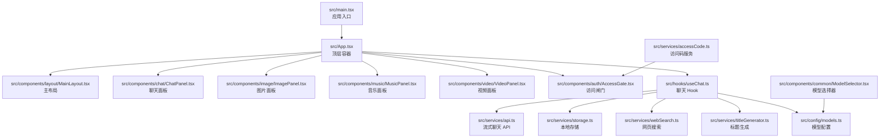
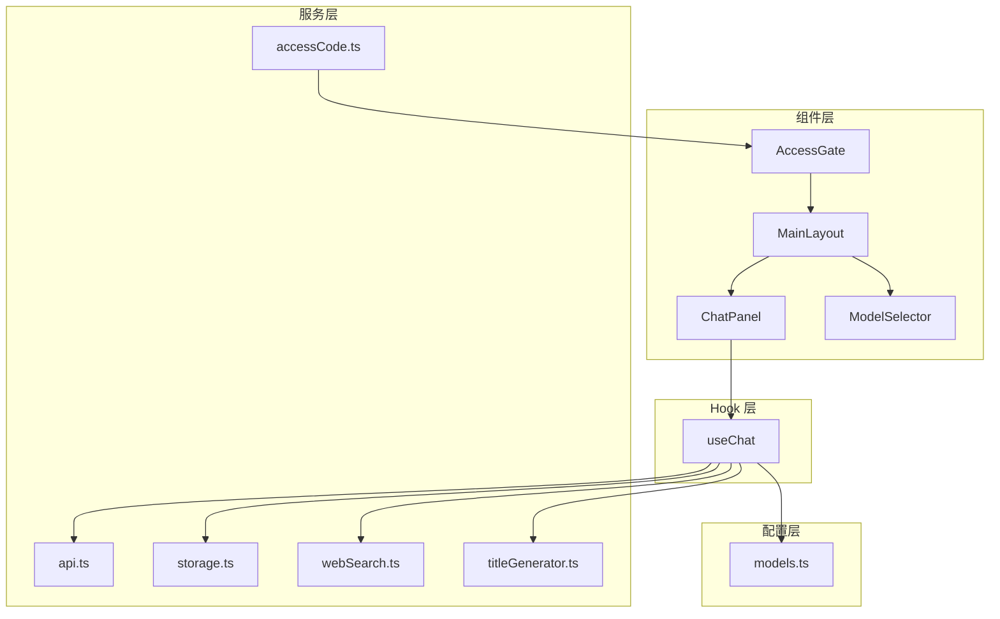
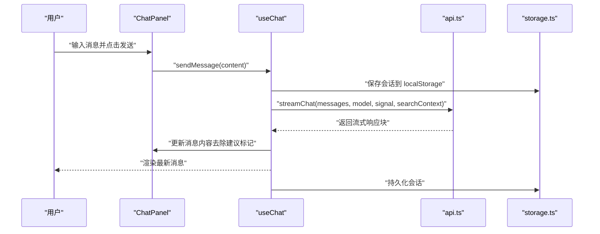
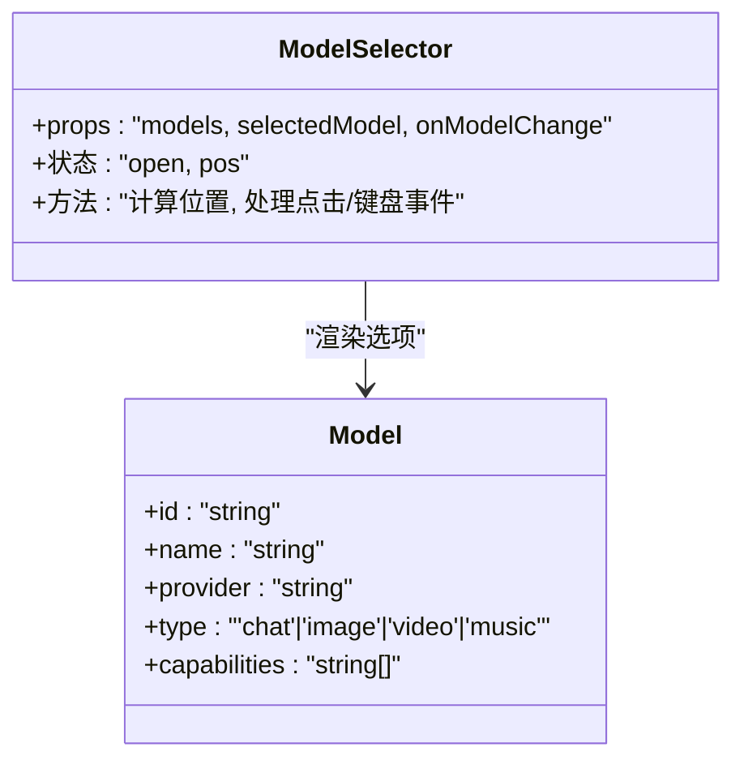
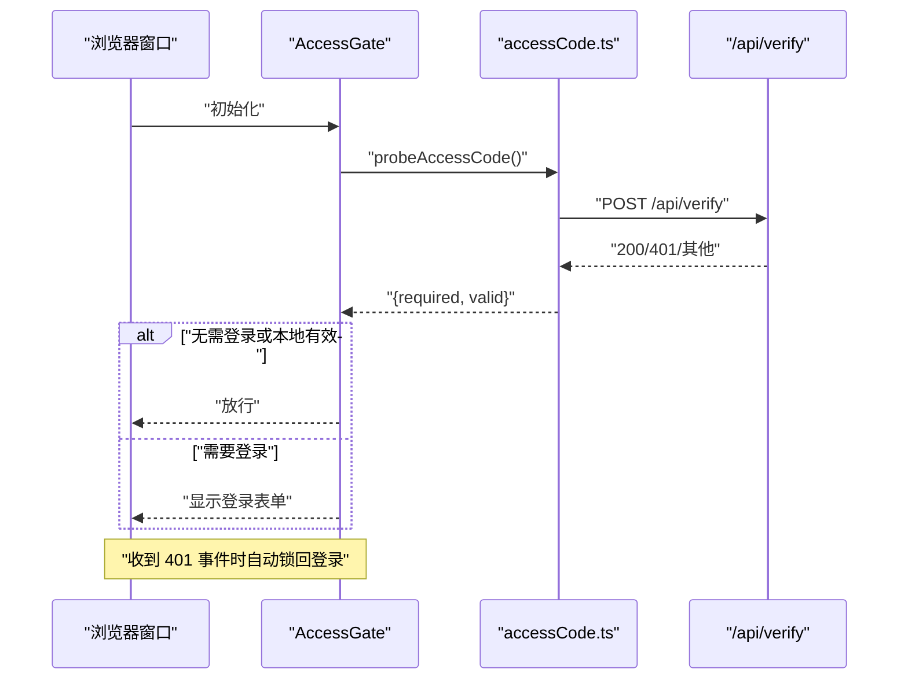
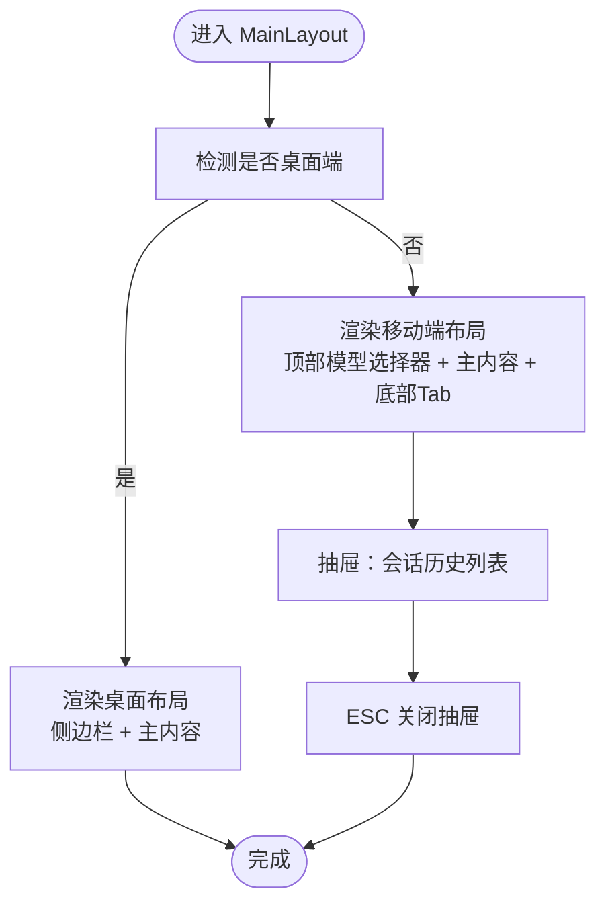
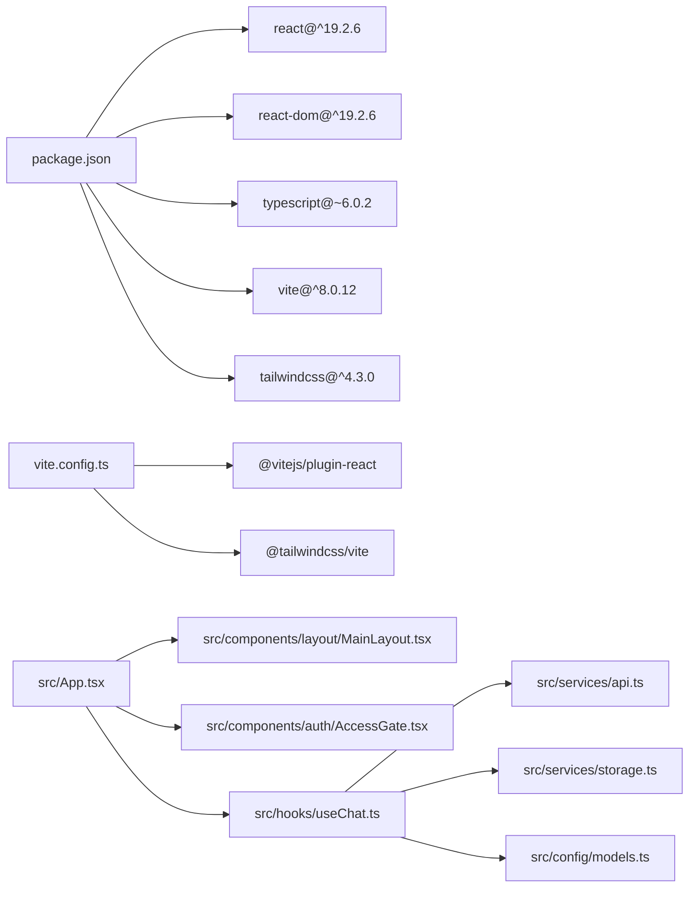

# 架构设计

<cite>
**本文引用的文件**
- [README.md](file://README.md)
- [package.json](file://package.json)
- [vite.config.ts](file://vite.config.ts)
- [src/main.tsx](file://src/main.tsx)
- [src/App.tsx](file://src/App.tsx)
- [src/components/layout/MainLayout.tsx](file://src/components/layout/MainLayout.tsx)
- [src/components/layout/Sidebar.tsx](file://src/components/layout/Sidebar.tsx)
- [src/components/chat/ChatPanel.tsx](file://src/components/chat/ChatPanel.tsx)
- [src/components/common/ModelSelector.tsx](file://src/components/common/ModelSelector.tsx)
- [src/components/auth/AccessGate.tsx](file://src/components/auth/AccessGate.tsx)
- [src/hooks/useChat.ts](file://src/hooks/useChat.ts)
- [src/services/api.ts](file://src/services/api.ts)
- [src/services/storage.ts](file://src/services/storage.ts)
- [src/services/accessCode.ts](file://src/services/accessCode.ts)
- [src/types/index.ts](file://src/types/index.ts)
- [src/config/models.ts](file://src/config/models.ts)
</cite>

## 目录
1. [简介](#简介)
2. [项目结构](#项目结构)
3. [核心组件](#核心组件)
4. [架构总览](#架构总览)
5. [详细组件分析](#详细组件分析)
6. [依赖分析](#依赖分析)
7. [性能考虑](#性能考虑)
8. [故障排查指南](#故障排查指南)
9. [结论](#结论)
10. [附录](#附录)

## 简介
本文件为 AIShop 的前端架构设计文档，系统采用 React 19 + TypeScript + Vite 技术栈，围绕组件化设计、Hook 模式与分层架构展开。应用通过自定义 Hook 管理会话与状态，通过服务层封装 API 与本地持久化，通过配置层统一模型与提示词，通过布局与通用组件实现一致的交互体验。文档将从整体架构、目录组织、核心理念、技术选型、组件交互、横切关注点等方面进行系统性阐述，并辅以架构图与组件关系图，帮助开发者快速理解与扩展系统。

## 项目结构
项目采用“按功能域分层 + 组件化”的目录组织方式：
- src/main.tsx：应用入口，挂载根组件
- src/App.tsx：顶层容器，负责路由态与全局状态协调
- src/components：按功能域划分的 UI 组件，包含 layout、chat、image、music、video、common、auth 等
- src/hooks：自定义 Hook，封装业务逻辑与状态管理
- src/services：服务层，封装 API、存储、鉴权、搜索等横切能力
- src/config：配置层，集中管理模型、提示词等静态配置
- src/types：类型定义，统一数据结构与接口约束
- vite.config.ts：构建与开发服务器配置
- package.json：依赖与脚本定义

**图表来源**
- [src/main.tsx:1-11](file://src/main.tsx#L1-L11)
- [src/App.tsx:1-74](file://src/App.tsx#L1-L74)
- [src/components/layout/MainLayout.tsx:1-227](file://src/components/layout/MainLayout.tsx#L1-L227)
- [src/components/chat/ChatPanel.tsx:1-369](file://src/components/chat/ChatPanel.tsx#L1-L369)
- [src/components/common/ModelSelector.tsx:1-168](file://src/components/common/ModelSelector.tsx#L1-L168)
- [src/components/auth/AccessGate.tsx:1-150](file://src/components/auth/AccessGate.tsx#L1-L150)
- [src/hooks/useChat.ts:1-370](file://src/hooks/useChat.ts#L1-L370)
- [src/services/api.ts:1-83](file://src/services/api.ts#L1-L83)
- [src/services/storage.ts:1-66](file://src/services/storage.ts#L1-L66)
- [src/services/accessCode.ts:1-113](file://src/services/accessCode.ts#L1-L113)
- [src/config/models.ts:1-228](file://src/config/models.ts#L1-L228)

**章节来源**
- [src/main.tsx:1-11](file://src/main.tsx#L1-L11)
- [src/App.tsx:1-74](file://src/App.tsx#L1-L74)
- [vite.config.ts:1-11](file://vite.config.ts#L1-L11)
- [package.json:1-40](file://package.json#L1-L40)

## 核心组件
- 应用入口与顶层容器
  - 入口文件负责渲染根组件，顶层容器负责维护活动标签页、移动端抽屉状态、以及将全局状态传递给子组件。
- 主布局组件
  - 负责桌面端与移动端的差异化布局，提供侧边栏、会话列表、底部 Tab、抽屉等交互。
- 聊天面板与输入组件
  - 聊天面板负责消息渲染、导出、拖拽导入、滚动行为控制；输入组件负责发送消息、停止生成、模型切换、联网搜索开关。
- 模型选择器
  - 提供模型下拉菜单，支持根据 Provider 动态加载图标，支持固定定位与自适应布局。
- 访问闸门
  - 在启动时探测访问码状态，必要时弹出登录界面；监听 401 事件自动锁回登录。

**章节来源**
- [src/App.tsx:11-71](file://src/App.tsx#L11-L71)
- [src/components/layout/MainLayout.tsx:45-226](file://src/components/layout/MainLayout.tsx#L45-L226)
- [src/components/chat/ChatPanel.tsx:34-368](file://src/components/chat/ChatPanel.tsx#L34-L368)
- [src/components/common/ModelSelector.tsx:42-167](file://src/components/common/ModelSelector.tsx#L42-L167)
- [src/components/auth/AccessGate.tsx:23-149](file://src/components/auth/AccessGate.tsx#L23-L149)

## 架构总览
系统采用“组件层 + Hook 层 + 服务层 + 配置层”的分层架构：
- 组件层：负责 UI 呈现与用户交互，按功能域拆分，复用性强。
- Hook 层：封装业务逻辑与状态，如 useChat，统一管理消息、会话、模型、联网搜索等。
- 服务层：封装 API 调用、本地存储、鉴权、搜索、标题生成等横切能力。
- 配置层：集中管理模型列表、提示词等静态配置。
- 类型层：统一数据结构，确保各层之间契约清晰。

**图表来源**
- [src/components/layout/MainLayout.tsx:1-227](file://src/components/layout/MainLayout.tsx#L1-L227)
- [src/components/chat/ChatPanel.tsx:1-369](file://src/components/chat/ChatPanel.tsx#L1-L369)
- [src/components/common/ModelSelector.tsx:1-168](file://src/components/common/ModelSelector.tsx#L1-L168)
- [src/components/auth/AccessGate.tsx:1-150](file://src/components/auth/AccessGate.tsx#L1-L150)
- [src/hooks/useChat.ts:1-370](file://src/hooks/useChat.ts#L1-L370)
- [src/services/api.ts:1-83](file://src/services/api.ts#L1-L83)
- [src/services/storage.ts:1-66](file://src/services/storage.ts#L1-L66)
- [src/services/accessCode.ts:1-113](file://src/services/accessCode.ts#L1-L113)
- [src/config/models.ts:1-228](file://src/config/models.ts#L1-L228)

## 详细组件分析

### 组件 A：聊天面板与消息流
聊天面板负责消息渲染、导出、拖拽导入、滚动行为控制；消息流通过 useChat 的 sendMessage 实现，支持联网搜索与流式输出。

**图表来源**
- [src/components/chat/ChatPanel.tsx:13-46](file://src/components/chat/ChatPanel.tsx#L13-L46)
- [src/hooks/useChat.ts:135-250](file://src/hooks/useChat.ts#L135-L250)
- [src/services/api.ts:13-82](file://src/services/api.ts#L13-L82)
- [src/services/storage.ts:19-25](file://src/services/storage.ts#L19-L25)

**章节来源**
- [src/components/chat/ChatPanel.tsx:34-368](file://src/components/chat/ChatPanel.tsx#L34-L368)
- [src/hooks/useChat.ts:69-370](file://src/hooks/useChat.ts#L69-L370)
- [src/services/api.ts:1-83](file://src/services/api.ts#L1-L83)
- [src/services/storage.ts:1-66](file://src/services/storage.ts#L1-L66)

### 组件 B：模型选择器
模型选择器根据 Provider 动态加载图标，支持固定定位与自适应布局，保证在复杂祖先容器中仍能正确显示。

**图表来源**
- [src/components/common/ModelSelector.tsx:42-167](file://src/components/common/ModelSelector.tsx#L42-L167)
- [src/config/models.ts:25-38](file://src/config/models.ts#L25-L38)

**章节来源**
- [src/components/common/ModelSelector.tsx:1-168](file://src/components/common/ModelSelector.tsx#L1-L168)
- [src/config/models.ts:1-228](file://src/config/models.ts#L1-L228)

### 组件 C：访问闸门与鉴权
访问闸门在启动时探测访问码状态，必要时弹出登录界面；监听 401 事件自动锁回登录。

**图表来源**
- [src/components/auth/AccessGate.tsx:23-149](file://src/components/auth/AccessGate.tsx#L23-L149)
- [src/services/accessCode.ts:66-110](file://src/services/accessCode.ts#L66-L110)

**章节来源**
- [src/components/auth/AccessGate.tsx:1-150](file://src/components/auth/AccessGate.tsx#L1-L150)
- [src/services/accessCode.ts:1-113](file://src/services/accessCode.ts#L1-L113)

### 组件 D：主布局与移动端抽屉
主布局根据屏幕宽度切换桌面端与移动端布局，移动端提供底部 Tab 与左侧抽屉，支持 ESC 关闭抽屉。

**图表来源**
- [src/components/layout/MainLayout.tsx:84-225](file://src/components/layout/MainLayout.tsx#L84-L225)

**章节来源**
- [src/components/layout/MainLayout.tsx:1-227](file://src/components/layout/MainLayout.tsx#L1-L227)

## 依赖分析
- 技术栈依赖
  - React 19 与 React DOM：提供组件化与状态管理基础
  - TypeScript：提供类型安全与更好的开发体验
  - Vite：提供快速开发与构建能力
  - TailwindCSS：提供原子化样式工具
- 组件间依赖
  - App 依赖 MainLayout、AccessGate、useChat
  - MainLayout 依赖 Sidebar、ConversationList、ModelSelector
  - ChatPanel 依赖 MessageBubble、ChatInput
  - useChat 依赖 api、storage、webSearch、titleGenerator、models
  - AccessGate 依赖 accessCode

**图表来源**
- [package.json:12-38](file://package.json#L12-L38)
- [vite.config.ts:1-11](file://vite.config.ts#L1-L11)
- [src/App.tsx:1-10](file://src/App.tsx#L1-L10)
- [src/hooks/useChat.ts:1-16](file://src/hooks/useChat.ts#L1-L16)
- [src/services/api.ts:1-3](file://src/services/api.ts#L1-L3)
- [src/services/storage.ts:1-5](file://src/services/storage.ts#L1-L5)
- [src/config/models.ts:1](file://src/config/models.ts#L1)

**章节来源**
- [package.json:1-40](file://package.json#L1-L40)
- [vite.config.ts:1-11](file://vite.config.ts#L1-L11)

## 性能考虑
- 组件渲染优化
  - 使用 useCallback 与 useMemo 避免不必要的重渲染（例如 useChat 中的消息更新、模型切换回调）
  - ChatPanel 中通过滚动阈值与自动滚动标志减少滚动抖动
- 数据流优化
  - 流式响应通过增量更新，避免一次性大对象渲染
  - 建议在消息列表中引入虚拟滚动以提升长对话性能
- 存储与缓存
  - 本地存储采用异步写入策略，避免阻塞主线程
  - 建议对模型列表与会话列表增加缓存与去重策略
- 构建与打包
  - Vite 提供快速热更新与按需编译，建议开启生产构建的代码分割与 Tree Shaking

## 故障排查指南
- 访问码相关
  - 若出现 401，检查本地存储的访问码是否正确；服务端返回 429 时需等待限速冷却
  - 登录失效会触发 Unauthorized 事件，自动锁回登录界面
- 网络与流式响应
  - 流式响应解析失败时会跳过异常片段；若长时间无响应，检查网络与服务端代理配置
- 本地存储
  - localStorage 写入失败时会静默忽略，建议在 UI 中提供手动清理入口
- 模型选择
  - 若模型不可用，检查模型配置与 Provider 图标资源路径

**章节来源**
- [src/services/accessCode.ts:37-110](file://src/services/accessCode.ts#L37-L110)
- [src/services/api.ts:48-82](file://src/services/api.ts#L48-L82)
- [src/services/storage.ts:19-25](file://src/services/storage.ts#L19-L25)
- [src/components/common/ModelSelector.tsx:26-29](file://src/components/common/ModelSelector.tsx#L26-L29)

## 结论
AIShop 采用清晰的分层架构与组件化设计，结合自定义 Hook 实现业务逻辑复用，通过服务层统一处理 API、存储与鉴权，配合配置层集中管理模型与提示词，形成高内聚、低耦合的前端体系。React 19、TypeScript 与 Vite 的组合提供了良好的开发体验与性能表现。后续可在消息列表引入虚拟滚动、增强错误提示与日志上报、完善国际化与无障碍支持等方面持续演进。

## 附录
- 目录组织原则
  - src/components：按功能域划分，组件职责单一，便于复用与测试
  - src/hooks：封装业务逻辑，避免在组件中直接处理副作用
  - src/services：抽象网络与本地能力，提供稳定接口契约
  - src/config：集中静态配置，便于统一管理与替换
  - src/types：统一数据结构，降低层间耦合
- 核心设计理念
  - 组件复用：通过 props 与 Hook 解耦，提高可复用性
  - 状态管理：集中于 Hook，避免全局状态污染
  - 数据流设计：自顶向下传递状态，事件向上冒泡
  - 错误处理：在服务层与组件层分别处理网络错误与 UI 错误
- 技术选型理由
  - React 19：提供并发特性与更优的开发体验
  - TypeScript：提升代码质量与可维护性
  - Vite：快速开发与构建，支持插件生态
  - TailwindCSS：原子化样式，提升 UI 开发效率