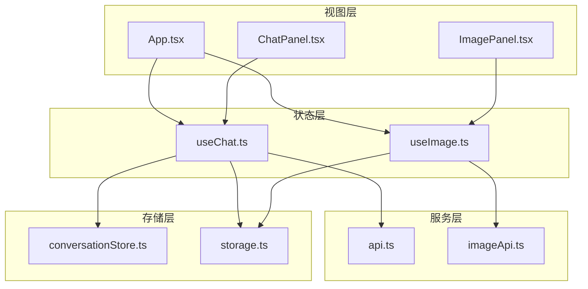
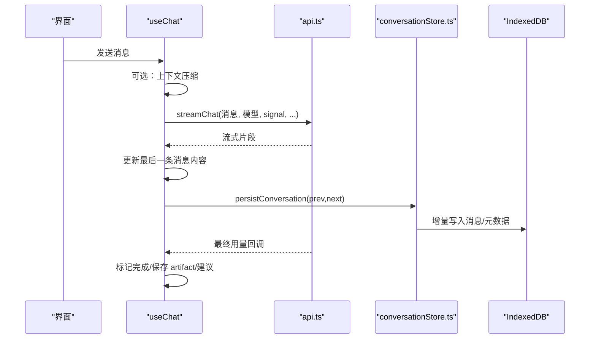
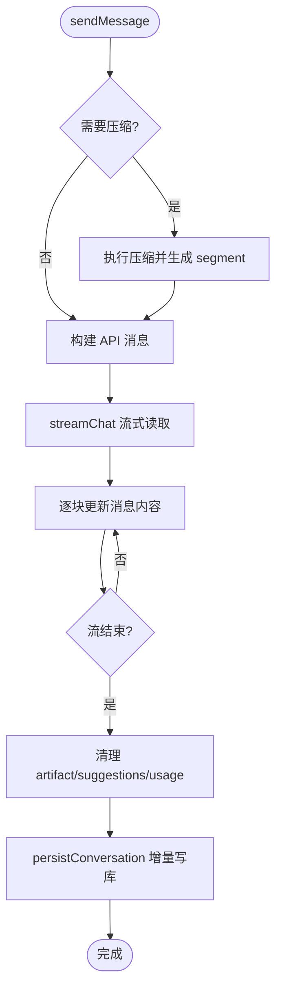
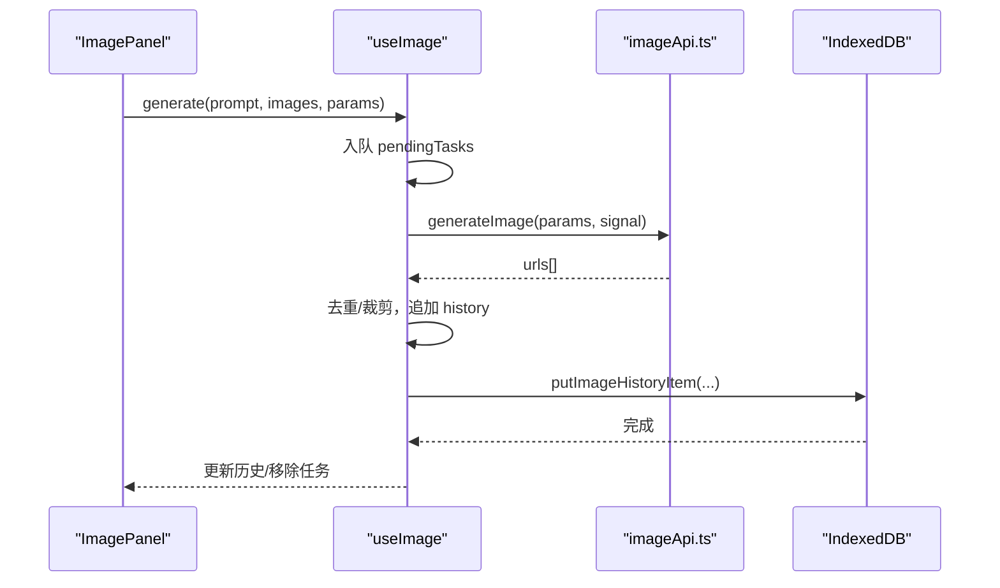
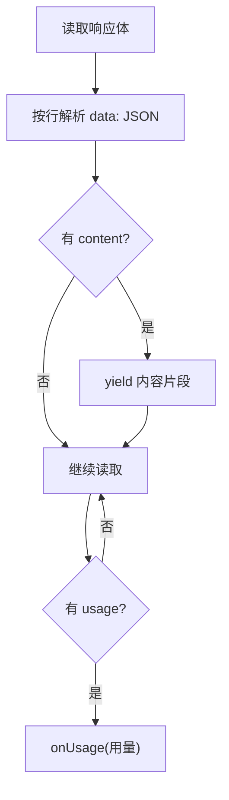
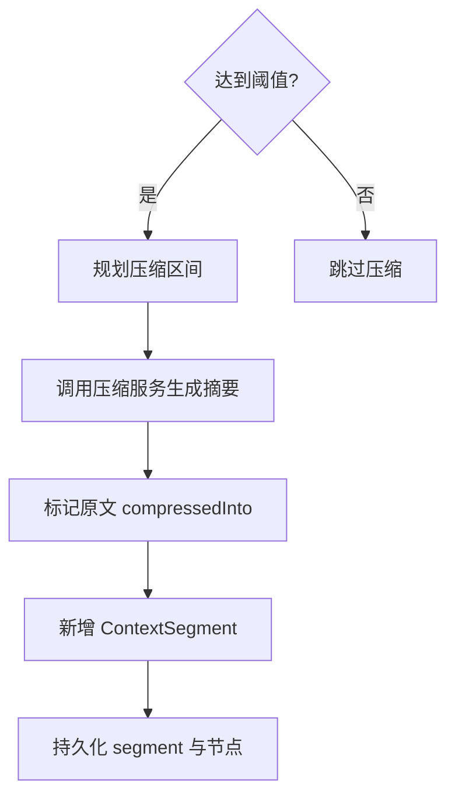
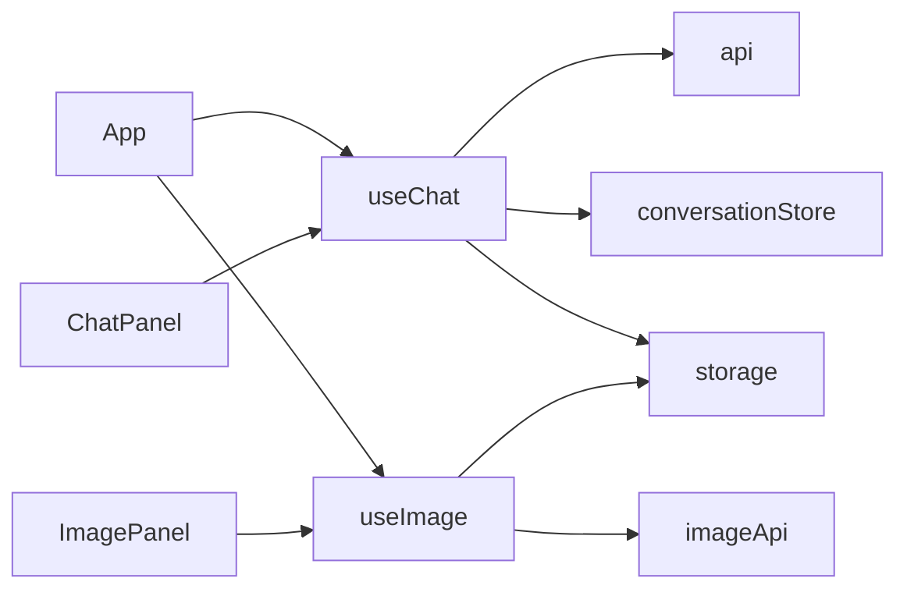

# 状态管理架构

<cite>
**本文引用的文件**
- [useChat.ts](file://src/hooks/useChat.ts)
- [useImage.ts](file://src/hooks/useImage.ts)
- [api.ts](file://src/services/api.ts)
- [imageApi.ts](file://src/services/imageApi.ts)
- [conversationStore.ts](file://src/services/conversationStore.ts)
- [storage.ts](file://src/services/storage.ts)
- [App.tsx](file://src/App.tsx)
- [ChatPanel.tsx](file://src/components/chat/ChatPanel.tsx)
- [ImagePanel.tsx](file://src/components/image/ImagePanel.tsx)
- [index.ts（类型定义）](file://src/types/index.ts)
</cite>

## 目录
1. [简介](#简介)
2. [项目结构](#项目结构)
3. [核心组件](#核心组件)
4. [架构总览](#架构总览)
5. [详细组件分析](#详细组件分析)
6. [依赖关系分析](#依赖关系分析)
7. [性能考量](#性能考量)
8. [故障排查指南](#故障排查指南)
9. [结论](#结论)
10. [附录](#附录)

## 简介
本文件面向 AIShop 项目的状态管理架构，聚焦基于 React Hooks 的状态管理模式，系统梳理 useChat、useImage 等自定义 Hook 的设计原理与职责边界；说明全局状态与局部状态的划分策略、状态同步机制；解释流式数据处理、异步状态管理与错误状态处理；文档化状态持久化方案与数据迁移策略；并给出状态调试工具与性能监控方法、最佳实践与常见问题解决方案。

## 项目结构
AIShop 采用“Hook 驱动 + 服务层 + 存储层”的分层组织：
- 视图层：App 与功能面板（ChatPanel、ImagePanel）仅负责渲染与用户交互。
- 状态层：useChat、useImage 等 Hook 封装业务状态与副作用，暴露最小 API 给 UI。
- 服务层：api.ts、imageApi.ts 负责网络请求、协议适配与错误解析。
- 存储层：conversationStore.ts 提供会话与消息的增量持久化；storage.ts 管理小体积设置项；IndexedDB 用于历史消息与图片资源。

图表来源
- [App.tsx:30-126](file://src/App.tsx#L30-L126)
- [ChatPanel.tsx:49-70](file://src/components/chat/ChatPanel.tsx#L49-L70)
- [ImagePanel.tsx:369-395](file://src/components/image/ImagePanel.tsx#L369-L395)
- [useChat.ts:152-179](file://src/hooks/useChat.ts#L152-L179)
- [useImage.ts:123-139](file://src/hooks/useImage.ts#L123-L139)
- [api.ts:44-173](file://src/services/api.ts#L44-L173)
- [imageApi.ts:149-243](file://src/services/imageApi.ts#L149-L243)
- [conversationStore.ts:1-11](file://src/services/conversationStore.ts#L1-L11)
- [storage.ts:1-63](file://src/services/storage.ts#L1-L63)

章节来源
- [App.tsx:30-126](file://src/App.tsx#L30-L126)
- [useChat.ts:152-179](file://src/hooks/useChat.ts#L152-L179)
- [useImage.ts:123-139](file://src/hooks/useImage.ts#L123-L139)
- [conversationStore.ts:1-11](file://src/services/conversationStore.ts#L1-L11)
- [storage.ts:1-63](file://src/services/storage.ts#L1-L63)

## 核心组件
- useChat：管理对话列表、当前会话、消息流、上下文压缩、联网搜索、Artifact 流式预览、模型选择与设置持久化。
- useImage：管理图片生成参数、上传图、并发任务队列、历史结果与 IndexedDB 持久化。
- 服务层：
  - api.ts：流式聊天请求、SSE 解析、用量回传、兼容不同网关 usage 字段。
  - imageApi.ts：多模型图片生成请求、超时控制、错误信息提取、URL 归一化。
- 存储层：
  - conversationStore.ts：会话与消息的增量持久化、流式节流落盘、压缩区间同步。
  - storage.ts：小体积设置的同步读写（模型、上次会话、联网开关、主题）。

章节来源
- [useChat.ts:152-179](file://src/hooks/useChat.ts#L152-L179)
- [useImage.ts:123-139](file://src/hooks/useImage.ts#L123-L139)
- [api.ts:44-173](file://src/services/api.ts#L44-L173)
- [imageApi.ts:149-243](file://src/services/imageApi.ts#L149-L243)
- [conversationStore.ts:114-257](file://src/services/conversationStore.ts#L114-L257)
- [storage.ts:1-63](file://src/services/storage.ts#L1-L63)

## 架构总览
整体状态流向遵循“UI 触发 Hook → Hook 调用服务 → 服务访问存储/网络 → 状态更新回推 UI”的单向数据流。关键特性：
- 流式数据：使用 AsyncGenerator 逐块更新消息内容，避免阻塞主线程。
- 增量持久化：通过 diff 对比前后状态，仅写入变化部分，降低 I/O 压力。
- 并发与取消：图片生成使用独立 AbortController，支持手动取消与超时。
- 上下文压缩：按阈值自动压缩历史消息，生成摘要段，减少上下文占用。

图表来源
- [useChat.ts:494-783](file://src/hooks/useChat.ts#L494-L783)
- [api.ts:44-173](file://src/services/api.ts#L44-L173)
- [conversationStore.ts:190-257](file://src/services/conversationStore.ts#L190-L257)

## 详细组件分析

### useChat：对话状态与流式处理
- 状态设计
  - 会话列表与活跃会话：conversations、activeId，启动时从存储恢复上次会话。
  - 消息与流式：messages、isStreaming、artifact 流式预览。
  - 设置与能力：featureSettings、webSearchEnabled、compactSettings。
  - 错误与加载：error、isLoading。
- 生命周期与副作用
  - 启动 effect：加载会话列表、恢复上次会话、补齐标题。
  - 持久化 effect：diff 后定向写入，避免全量序列化。
  - 页面隐藏/关闭前 flushPendingWrites，防止移动端丢失长回复。
- 发送消息流程
  - 可选压缩：根据阈值与可行性判断是否压缩冷区间。
  - 构建 API 消息：合并附件文本、压缩段、联网搜索结果。
  - 流式接收：逐块更新显示内容，检测 Artifact 流式片段。
  - 结束处理：清理 artifact 标记、解析 suggestions、记录真实用量。
- 错误与取消
  - AbortError：标记 stoppedByUser，保留已有内容。
  - 其他错误：设置 error，并在消息中提示失败原因。

图表来源
- [useChat.ts:494-783](file://src/hooks/useChat.ts#L494-L783)
- [conversationStore.ts:190-257](file://src/services/conversationStore.ts#L190-L257)

章节来源
- [useChat.ts:152-179](file://src/hooks/useChat.ts#L152-L179)
- [useChat.ts:195-337](file://src/hooks/useChat.ts#L195-L337)
- [useChat.ts:494-783](file://src/hooks/useChat.ts#L494-L783)
- [conversationStore.ts:190-257](file://src/services/conversationStore.ts#L190-L257)

### useImage：图片生成与并发队列
- 状态设计
  - 模型与参数：selectedModel、aspectRatio、size、quality。
  - 上传图：uploadedImages，受模型最大上传数限制。
  - 任务队列：pendingTasks（loading/error），支持重试、取消、关闭错误卡片。
  - 历史：history，来自 IndexedDB，异步加载。
- 生命周期与副作用
  - 启动 effect：加载历史，回填缺失的宽高以优化瀑布流布局。
  - 卸载清理：中止所有进行中的控制器。
- 生成流程
  - 参数校验与构造：根据模型差异组装请求体。
  - 并发控制：每个任务独立 AbortController，支持外部取消与内部超时。
  - 成功路径：去重与裁剪返回数量，追加到历史并落库，替换 base64 为 blob 引用释放内存。
  - 失败路径：区分取消与超时，设置错误状态并提供重试。

图表来源
- [useImage.ts:274-356](file://src/hooks/useImage.ts#L274-L356)
- [imageApi.ts:149-243](file://src/services/imageApi.ts#L149-L243)

章节来源
- [useImage.ts:123-139](file://src/hooks/useImage.ts#L123-L139)
- [useImage.ts:274-356](file://src/hooks/useImage.ts#L274-L356)
- [imageApi.ts:149-243](file://src/services/imageApi.ts#L149-L243)

### 流式数据处理与用量回传
- 流式协议：SSE 格式，逐行解析 data: JSON，抽取 delta.content 与 usage。
- 用量兼容：对不同网关 usage 字段做兜底解析，确保成本统计可用。
- 回传时机：流结束时调用 onUsage 回调，供上层记录真实用量。

图表来源
- [api.ts:120-173](file://src/services/api.ts#L120-L173)

章节来源
- [api.ts:44-173](file://src/services/api.ts#L44-L173)

### 上下文压缩与摘要
- 触发条件：接近上下文上限且可压缩时自动压缩。
- 压缩过程：选取冷区间，生成摘要段，标记原文 compressedInto。
- 持久化：将 segment 同步到 contextNodes，并维护 sourceMessageIds 与 token 统计。
- 撤销与编辑：支持撤销压缩与用户编辑摘要，编辑后不再被自动重压。

图表来源
- [useChat.ts:402-450](file://src/hooks/useChat.ts#L402-L450)
- [conversationStore.ts:295-336](file://src/services/conversationStore.ts#L295-L336)

章节来源
- [useChat.ts:402-450](file://src/hooks/useChat.ts#L402-L450)
- [conversationStore.ts:295-336](file://src/services/conversationStore.ts#L295-L336)

### 全局状态与局部状态划分
- 全局状态（跨组件共享）
  - 会话列表与活跃会话：由 useChat 管理，通过 App 注入到侧栏与面板。
  - 图片历史与任务队列：由 useImage 管理，ImagePanel 消费。
- 局部状态（组件内）
  - 输入框、折叠浏览模式、搜索高亮、Artifact 面板可见性等，均在 ChatPanel/ImagePanel 内维护。
- 状态同步机制
  - 通过 props 向下传递，事件回调向上冒泡；Hook 作为单一事实源，避免分散状态。

章节来源
- [App.tsx:30-126](file://src/App.tsx#L30-L126)
- [ChatPanel.tsx:49-70](file://src/components/chat/ChatPanel.tsx#L49-L70)
- [ImagePanel.tsx:369-395](file://src/components/image/ImagePanel.tsx#L369-L395)

### 状态持久化与数据迁移
- 小体积设置：localStorage 同步读写（模型、上次会话、联网开关、主题）。
- 会话与消息：IndexedDB 增量持久化，启动时只加载元数据，按需 hydrate。
- 流式节流：中间态按 1s 节流落盘，页面隐藏/关闭前强制 flush。
- 迁移策略：
  - 摘要迁移：在启动或压缩相关逻辑中处理旧版摘要结构。
  - 尺寸回填：历史图片缺失宽高时，首次加载计算并写回库。

章节来源
- [storage.ts:1-63](file://src/services/storage.ts#L1-L63)
- [conversationStore.ts:64-112](file://src/services/conversationStore.ts#L64-L112)
- [conversationStore.ts:153-182](file://src/services/conversationStore.ts#L153-L182)
- [conversationStore.ts:338-348](file://src/services/conversationStore.ts#L338-L348)
- [useImage.ts:152-194](file://src/hooks/useImage.ts#L152-L194)

### 错误状态处理
- 网络错误：统一抛出 Error，上层捕获并设置 error 或消息提示。
- 取消请求：AbortError 区分用户取消与超时，分别处理状态。
- 上游错误：解析 detail/error.message，拼接友好提示。
- 本地错误：如 Canvas 不可用、图片加载失败，捕获并降级处理。

章节来源
- [api.ts:102-118](file://src/services/api.ts#L102-L118)
- [imageApi.ts:183-243](file://src/services/imageApi.ts#L183-L243)
- [useChat.ts:741-783](file://src/hooks/useChat.ts#L741-L783)
- [useImage.ts:336-356](file://src/hooks/useImage.ts#L336-L356)

## 依赖关系分析
- 耦合与内聚
  - useChat 与 conversationStore 强耦合于会话/消息领域模型；与 api.ts 解耦于网络协议。
  - useImage 与 imageApi 解耦于上游接口差异；与 IndexedDB 通过 db 抽象隔离。
- 外部依赖
  - 提供商配置：settingsService、providers 配置决定 BaseUrl 与鉴权。
  - 浏览器 API：Fetch、SSE Reader、Canvas、IndexedDB、LocalStorage。
- 循环依赖
  - 未发现直接循环导入；Hook 与服务层单向依赖。

图表来源
- [useChat.ts:1-43](file://src/hooks/useChat.ts#L1-L43)
- [useImage.ts:1-14](file://src/hooks/useImage.ts#L1-L14)
- [api.ts:1-6](file://src/services/api.ts#L1-L6)
- [imageApi.ts:1-4](file://src/services/imageApi.ts#L1-L4)
- [conversationStore.ts:12-37](file://src/services/conversationStore.ts#L12-L37)
- [storage.ts:1-63](file://src/services/storage.ts#L1-L63)

章节来源
- [useChat.ts:1-43](file://src/hooks/useChat.ts#L1-L43)
- [useImage.ts:1-14](file://src/hooks/useImage.ts#L1-L14)
- [api.ts:1-6](file://src/services/api.ts#L1-L6)
- [imageApi.ts:1-4](file://src/services/imageApi.ts#L1-L4)
- [conversationStore.ts:12-37](file://src/services/conversationStore.ts#L12-L37)
- [storage.ts:1-63](file://src/services/storage.ts#L1-L63)

## 性能考量
- 流式渲染：SSE 逐块推送，避免整包等待，提升首字延迟。
- 增量持久化：diff 比较关键字段与长度，减少 JSON 序列化与 I/O。
- 流式节流：1s 间隔批量落盘，降低频繁写库开销。
- 内存优化：图片生成成功后将 base64 替换为 blob 引用，及时释放内存。
- 滚动与布局：折叠/展开时锁定滚动位置，避免重排抖动；懒加载更早消息。
- 并发控制：图片任务独立控制器，避免相互阻塞。

[本节为通用指导，不直接分析具体文件]

## 故障排查指南
- 无法获取用量
  - 检查网关是否支持 include_usage；若不支持，api.ts 会自动降级重试。
- 流式中断或丢内容
  - 确认页面隐藏/关闭前已调用 flushPendingWrites；检查流缓冲与换行解析。
- 图片生成超时
  - 默认 120s 超时；检查网络与上游服务；查看错误详情中的 detail/message。
- 上下文压缩无效
  - 检查阈值与热窗口设置；确认 isCompactionViable 判定通过；查看 segment 是否持久化。
- 历史未恢复
  - 检查 lastActiveConversationId 是否保存；确认 hydrateConversation 是否成功加载。

章节来源
- [api.ts:102-118](file://src/services/api.ts#L102-L118)
- [conversationStore.ts:338-348](file://src/services/conversationStore.ts#L338-L348)
- [imageApi.ts:183-243](file://src/services/imageApi.ts#L183-L243)
- [useChat.ts:402-450](file://src/hooks/useChat.ts#L402-L450)
- [useChat.ts:195-288](file://src/hooks/useChat.ts#L195-L288)

## 结论
AIShop 的状态管理以 Hook 为核心，结合服务层与存储层实现清晰的职责分离与高效的数据流。通过流式处理、增量持久化、并发控制与上下文压缩，兼顾了用户体验与性能。建议在扩展新功能时遵循相同分层与单向数据流原则，保持状态的可预测性与可维护性。

[本节为总结，不直接分析具体文件]

## 附录
- 类型契约
  - Message、Conversation、ContextSegment、TokenUsage、ImageGenerationParams、PendingImageTask 等类型定义位于 types/index.ts，作为状态与接口的稳定契约。
- 调试建议
  - 在 useChat 与 useImage 的关键路径添加日志（如压缩决策、流式 chunk、任务状态变更）。
  - 利用浏览器开发者工具的 Network 面板观察 SSE 流与图片请求。
  - 通过 IndexedDB 查看会话与消息的持久化结果，验证增量写入是否正确。

章节来源
- [index.ts（类型定义）:1-252](file://src/types/index.ts#L1-L252)