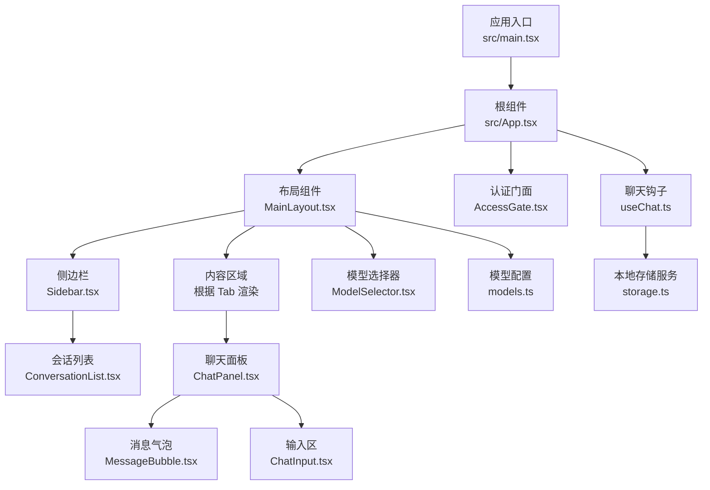
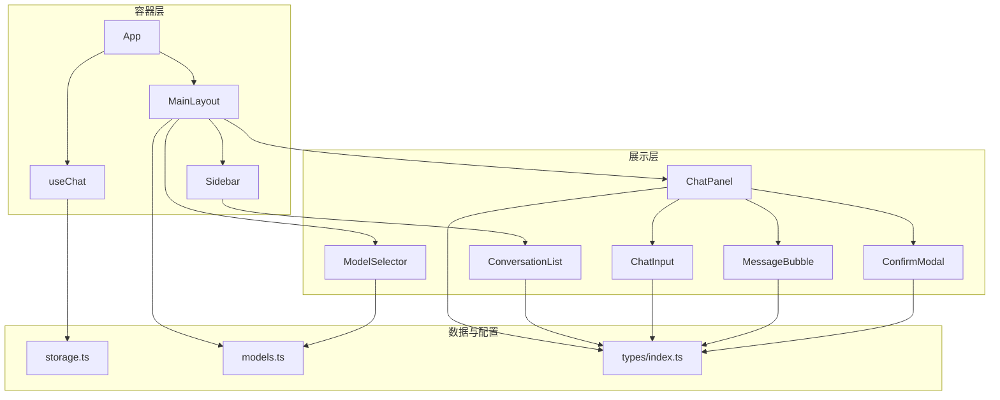
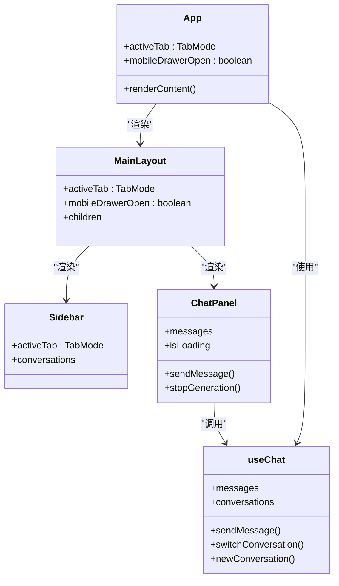
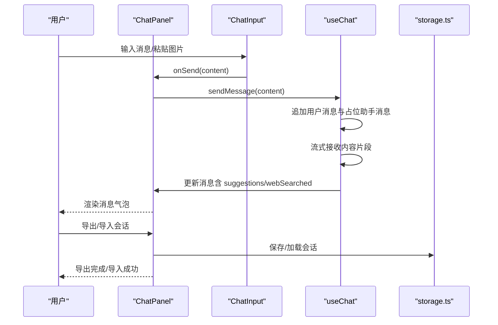
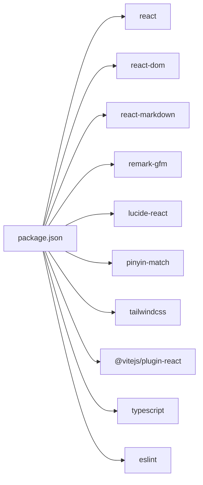

# 组件架构设计

<cite>
**本文引用的文件**
- [src/App.tsx](file://src/App.tsx)
- [src/main.tsx](file://src/main.tsx)
- [src/components/layout/MainLayout.tsx](file://src/components/layout/MainLayout.tsx)
- [src/components/layout/Sidebar.tsx](file://src/components/layout/Sidebar.tsx)
- [src/hooks/useChat.ts](file://src/hooks/useChat.ts)
- [src/components/chat/ChatPanel.tsx](file://src/components/chat/ChatPanel.tsx)
- [src/components/chat/ConversationList.tsx](file://src/components/chat/ConversationList.tsx)
- [src/components/common/ModelSelector.tsx](file://src/components/common/ModelSelector.tsx)
- [src/components/chat/ChatInput.tsx](file://src/components/chat/ChatInput.tsx)
- [src/components/chat/MessageBubble.tsx](file://src/components/chat/MessageBubble.tsx)
- [src/components/common/ConfirmModal.tsx](file://src/components/common/ConfirmModal.tsx)
- [src/types/index.ts](file://src/types/index.ts)
- [src/services/storage.ts](file://src/services/storage.ts)
- [src/config/models.ts](file://src/config/models.ts)
- [package.json](file://package.json)
</cite>

## 目录
1. [简介](#简介)
2. [项目结构](#项目结构)
3. [核心组件](#核心组件)
4. [架构总览](#架构总览)
5. [详细组件分析](#详细组件分析)
6. [依赖分析](#依赖分析)
7. [性能考虑](#性能考虑)
8. [故障排查指南](#故障排查指南)
9. [结论](#结论)
10. [附录](#附录)

## 简介
本文件面向 AIShop 项目的前端组件架构，围绕基于 React 的组件化设计进行系统性梳理。重点涵盖：
- 函数组件与类组件的使用原则与边界
- 从根组件 App 到布局组件 MainLayout，再到功能组件的层次化组织
- 职责分离与高内聚低耦合的设计实践
- 组件间通信模式（父子、兄弟、跨层级）
- 可复用组件的设计策略
- 生命周期管理与性能优化
- 组件关系图与数据流图，帮助开发者快速理解依赖关系

## 项目结构
AIShop 采用“按功能域分层”的目录组织方式：
- 根组件与入口：src/main.tsx、src/App.tsx
- 布局层：src/components/layout/MainLayout.tsx、Sidebar.tsx
- 功能域组件：chat、image、video、music 等子目录
- 通用组件：common 子目录（如 ModelSelector、ConfirmModal）
- 类型定义：src/types/index.ts
- 数据与状态：hooks/useChat.ts、services/storage.ts
- 配置：config/models.ts

图表来源
- [src/main.tsx:1-11](file://src/main.tsx#L1-L11)
- [src/App.tsx:11-67](file://src/App.tsx#L11-L67)
- [src/components/layout/MainLayout.tsx:45-227](file://src/components/layout/MainLayout.tsx#L45-L227)
- [src/components/layout/Sidebar.tsx:48-197](file://src/components/layout/Sidebar.tsx#L48-L197)
- [src/components/chat/ChatPanel.tsx:27-354](file://src/components/chat/ChatPanel.tsx#L27-L354)
- [src/components/chat/MessageBubble.tsx:12-124](file://src/components/chat/MessageBubble.tsx#L12-L124)
- [src/components/chat/ChatInput.tsx:11-211](file://src/components/chat/ChatInput.tsx#L11-L211)
- [src/components/chat/ConversationList.tsx:16-171](file://src/components/chat/ConversationList.tsx#L16-L171)
- [src/components/common/ModelSelector.tsx:43-173](file://src/components/common/ModelSelector.tsx#L43-L173)
- [src/hooks/useChat.ts:69-370](file://src/hooks/useChat.ts#L69-L370)
- [src/services/storage.ts:7-66](file://src/services/storage.ts#L7-L66)
- [src/config/models.ts:3-228](file://src/config/models.ts#L3-L228)

章节来源
- [src/main.tsx:1-11](file://src/main.tsx#L1-L11)
- [src/App.tsx:11-67](file://src/App.tsx#L11-L67)

## 核心组件
- 根组件 App：负责顶层状态（活动 Tab、移动端抽屉开关）、通过 useChat 提供聊天能力，并将内容渲染委托给 MainLayout 与各功能面板。
- 布局组件 MainLayout：统一承载头部、侧边栏、主内容区、底部 Tab 与移动端抽屉，处理响应式与设备差异。
- 侧边栏 Sidebar：承载功能导航与聊天会话列表，支持宽度拖拽与折叠。
- 聊天面板 ChatPanel：渲染消息、处理导出、拖拽导入、自动滚动与输入交互。
- 通用组件 ModelSelector、ConfirmModal：提供可复用的 UI 交互能力。
- 钩子 useChat：封装聊天状态、消息流式渲染、会话持久化、联网搜索等业务逻辑。

章节来源
- [src/App.tsx:11-67](file://src/App.tsx#L11-L67)
- [src/components/layout/MainLayout.tsx:45-227](file://src/components/layout/MainLayout.tsx#L45-L227)
- [src/components/layout/Sidebar.tsx:48-197](file://src/components/layout/Sidebar.tsx#L48-L197)
- [src/components/chat/ChatPanel.tsx:27-354](file://src/components/chat/ChatPanel.tsx#L27-L354)
- [src/components/common/ModelSelector.tsx:43-173](file://src/components/common/ModelSelector.tsx#L43-L173)
- [src/components/common/ConfirmModal.tsx:23-131](file://src/components/common/ConfirmModal.tsx#L23-L131)
- [src/hooks/useChat.ts:69-370](file://src/hooks/useChat.ts#L69-L370)

## 架构总览
AIShop 采用“容器-展示”分层与“单一职责”原则：
- 容器层：App、MainLayout、Sidebar、useChat 等负责状态聚合与业务编排
- 展示层：ChatPanel、MessageBubble、ChatInput、ModelSelector、ConfirmModal 等负责 UI 呈现与用户交互
- 通信：自上而下的 props 传递为主，必要时通过回调函数向下广播事件
- 复用：通用组件（ModelSelector、ConfirmModal）与配置（models.ts）提升跨模块一致性

图表来源
- [src/App.tsx:11-67](file://src/App.tsx#L11-L67)
- [src/components/layout/MainLayout.tsx:45-227](file://src/components/layout/MainLayout.tsx#L45-L227)
- [src/components/layout/Sidebar.tsx:48-197](file://src/components/layout/Sidebar.tsx#L48-L197)
- [src/hooks/useChat.ts:69-370](file://src/hooks/useChat.ts#L69-L370)
- [src/components/chat/ChatPanel.tsx:27-354](file://src/components/chat/ChatPanel.tsx#L27-L354)
- [src/components/chat/MessageBubble.tsx:12-124](file://src/components/chat/MessageBubble.tsx#L12-L124)
- [src/components/chat/ChatInput.tsx:11-211](file://src/components/chat/ChatInput.tsx#L11-L211)
- [src/components/chat/ConversationList.tsx:16-171](file://src/components/chat/ConversationList.tsx#L16-L171)
- [src/components/common/ModelSelector.tsx:43-173](file://src/components/common/ModelSelector.tsx#L43-L173)
- [src/components/common/ConfirmModal.tsx:23-131](file://src/components/common/ConfirmModal.tsx#L23-L131)
- [src/services/storage.ts:7-66](file://src/services/storage.ts#L7-L66)
- [src/config/models.ts:3-228](file://src/config/models.ts#L3-L228)
- [src/types/index.ts:1-103](file://src/types/index.ts#L1-L103)

## 详细组件分析

### 组件层次与职责分离
- 根组件 App：集中管理活动 Tab、移动端抽屉状态、访问控制与聊天钩子，通过 renderContent 将不同功能面板注入 MainLayout。
- 布局组件 MainLayout：承担响应式布局、移动端抽屉、桌面端侧边栏、顶部模型选择器与底部 Tab，负责跨层级状态同步（如 Tab 切换时自动收起抽屉）。
- 侧边栏 Sidebar：承载导航与聊天会话列表，支持宽度拖拽与折叠，仅在聊天模式下展示会话管理。
- 聊天面板 ChatPanel：负责消息渲染、自动滚动、导出与导入、输入区集成，以及与 useChat 的双向交互。
- 通用组件：ModelSelector 提供模型选择弹窗；ConfirmModal 提供确认对话框，二者均通过 props 与回调解耦。

图表来源
- [src/App.tsx:11-67](file://src/App.tsx#L11-L67)
- [src/components/layout/MainLayout.tsx:45-227](file://src/components/layout/MainLayout.tsx#L45-L227)
- [src/components/layout/Sidebar.tsx:48-197](file://src/components/layout/Sidebar.tsx#L48-L197)
- [src/components/chat/ChatPanel.tsx:27-354](file://src/components/chat/ChatPanel.tsx#L27-L354)
- [src/hooks/useChat.ts:69-370](file://src/hooks/useChat.ts#L69-L370)

章节来源
- [src/App.tsx:11-67](file://src/App.tsx#L11-L67)
- [src/components/layout/MainLayout.tsx:45-227](file://src/components/layout/MainLayout.tsx#L45-L227)
- [src/components/layout/Sidebar.tsx:48-197](file://src/components/layout/Sidebar.tsx#L48-L197)
- [src/components/chat/ChatPanel.tsx:27-354](file://src/components/chat/ChatPanel.tsx#L27-L354)
- [src/hooks/useChat.ts:69-370](file://src/hooks/useChat.ts#L69-L370)

### 组件通信模式
- 父子通信（自上而下）：App -> MainLayout -> Sidebar/ChatPanel；MainLayout -> ModelSelector；ChatPanel -> MessageBubble/ChatInput。
- 回调通信（自下而上）：Sidebar/ChatPanel/ConversationList 通过回调向上通知 App 或 useChat 更新状态。
- 跨层级通信（上下文/属性透传）：App 将聊天钩子与会话状态透传至 MainLayout，再由 MainLayout 传递给 Sidebar 与 ChatPanel。
- 全局配置共享：MainLayout 与 ModelSelector 从 models.ts 读取模型配置，确保 UI 与业务一致。

图表来源
- [src/components/chat/ChatPanel.tsx:27-354](file://src/components/chat/ChatPanel.tsx#L27-L354)
- [src/components/chat/ChatInput.tsx:11-211](file://src/components/chat/ChatInput.tsx#L11-L211)
- [src/hooks/useChat.ts:69-370](file://src/hooks/useChat.ts#L69-L370)
- [src/services/storage.ts:7-66](file://src/services/storage.ts#L7-L66)

章节来源
- [src/components/chat/ChatPanel.tsx:27-354](file://src/components/chat/ChatPanel.tsx#L27-L354)
- [src/components/chat/ChatInput.tsx:11-211](file://src/components/chat/ChatInput.tsx#L11-L211)
- [src/hooks/useChat.ts:69-370](file://src/hooks/useChat.ts#L69-L370)
- [src/services/storage.ts:7-66](file://src/services/storage.ts#L7-L66)

### 复用策略与设计原则
- 通用组件：ModelSelector、ConfirmModal 通过 props 驱动行为，支持紧凑/非紧凑模式与多主题变体，可在不同布局中复用。
- 配置驱动：models.ts 提供统一模型清单与类型约束，UI 与业务逻辑通过类型安全的方式共享配置。
- 钩子抽象：useChat 将聊天状态、持久化、联网搜索、流式渲染等复杂逻辑收敛于单一接口，降低上层组件复杂度。
- 响应式与设备适配：MainLayout 与 Sidebar 通过媒体查询与拖拽交互适配桌面与移动端，减少重复代码。

章节来源
- [src/components/common/ModelSelector.tsx:43-173](file://src/components/common/ModelSelector.tsx#L43-L173)
- [src/components/common/ConfirmModal.tsx:23-131](file://src/components/common/ConfirmModal.tsx#L23-L131)
- [src/config/models.ts:3-228](file://src/config/models.ts#L3-L228)
- [src/hooks/useChat.ts:69-370](file://src/hooks/useChat.ts#L69-L370)
- [src/components/layout/MainLayout.tsx:45-227](file://src/components/layout/MainLayout.tsx#L45-L227)
- [src/components/layout/Sidebar.tsx:48-197](file://src/components/layout/Sidebar.tsx#L48-L197)

### 生命周期管理与性能优化
- 状态持久化：useChat 在 conversations 变更时自动保存到 localStorage，避免刷新丢失；模型与联网搜索开关同样持久化。
- 自动滚动：ChatPanel 使用 ref 与滚动位置判断，仅在用户靠近底部时自动滚动，减少不必要的重排。
- 流式渲染：useChat 通过流式迭代更新消息内容，同时隐藏中间标记，保证用户体验。
- 事件去抖与防抖：Sidebar 拖拽宽度计算使用 clamp 与节流式更新，避免频繁写入 localStorage。
- 条件渲染：MainLayout 根据设备与 Tab 动态决定渲染内容，减少无效节点。

章节来源
- [src/hooks/useChat.ts:69-370](file://src/hooks/useChat.ts#L69-L370)
- [src/services/storage.ts:7-66](file://src/services/storage.ts#L7-L66)
- [src/components/chat/ChatPanel.tsx:27-354](file://src/components/chat/ChatPanel.tsx#L27-L354)
- [src/components/layout/Sidebar.tsx:48-197](file://src/components/layout/Sidebar.tsx#L48-L197)

## 依赖分析
- React 生态：react、react-dom、react-markdown、remark-gfm、lucide-react、pinyin-match、tailwindcss
- 开发工具：@vitejs/plugin-react、typescript、eslint、@types/react 等

图表来源
- [package.json:12-38](file://package.json#L12-L38)

章节来源
- [package.json:12-38](file://package.json#L12-L38)

## 性能考虑
- 渲染优化：ChatPanel 使用消息列表的稳定 key 与条件渲染，避免无关节点重绘。
- 存储优化：Sidebar 宽度与 useChat 状态写入 localStorage 时进行节流与最小化写入。
- 网络优化：useChat 支持可选联网搜索，失败时降级提示，避免阻塞主流程。
- UI 交互：ConfirmModal 使用 requestAnimationFrame 控制进入/退出动画，减少主线程压力。

## 故障排查指南
- 会话导入失败：检查 .aishop.json 文件格式与字段完整性，确保 app 与 version 字段正确。
- 模型选择异常：确认 models.ts 中存在对应模型 ID，且 ModelSelector 接收到的 selectedModel 在模型列表中。
- 聊天消息不显示：检查 useChat 的 messages 数组与 isStreaming 标记，确保流式更新逻辑正常执行。
- 本地存储读写：若 localStorage 异常，useChat 与 storage.ts 会捕获错误并回退到默认值。

章节来源
- [src/components/chat/ChatPanel.tsx:156-206](file://src/components/chat/ChatPanel.tsx#L156-L206)
- [src/components/common/ModelSelector.tsx:43-173](file://src/components/common/ModelSelector.tsx#L43-L173)
- [src/hooks/useChat.ts:69-370](file://src/hooks/useChat.ts#L69-L370)
- [src/services/storage.ts:7-66](file://src/services/storage.ts#L7-L66)

## 结论
AIShop 的组件架构以函数组件为核心，结合自上而下的 props 与回调通信，实现了清晰的职责分离与良好的可复用性。通过 useChat 钩子与通用组件，系统在保持简洁的同时具备扩展性与一致性。建议后续进一步引入 Context 以简化深层 props 传递，并完善 TypeScript 类型覆盖，持续提升可维护性与开发体验。

## 附录
- 类型定义：Message、Conversation、Model、TabMode 等类型在 types/index.ts 中集中声明，确保跨模块一致。
- 模型配置：models.ts 提供聊天/图像/视频/音乐模型清单，支持按类型检索与 UI 展示。

章节来源
- [src/types/index.ts:1-103](file://src/types/index.ts#L1-L103)
- [src/config/models.ts:3-228](file://src/config/models.ts#L3-L228)