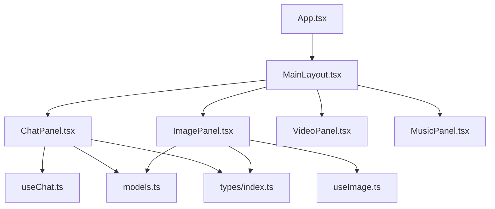
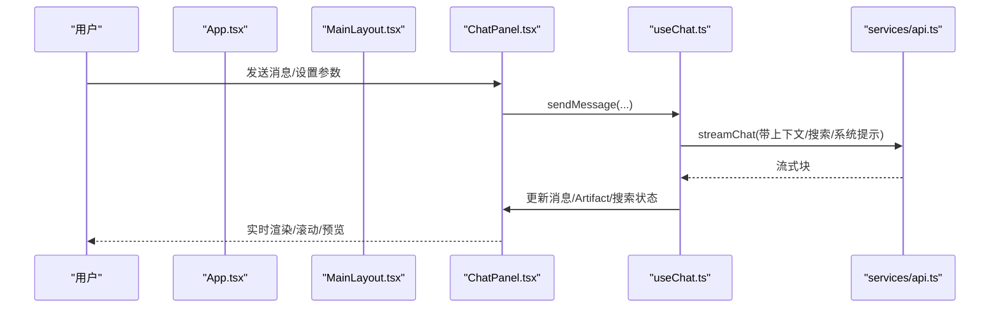
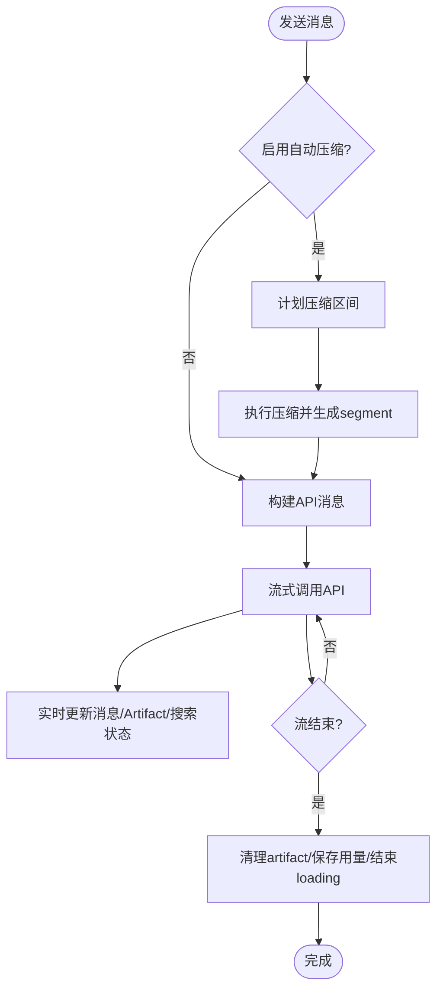
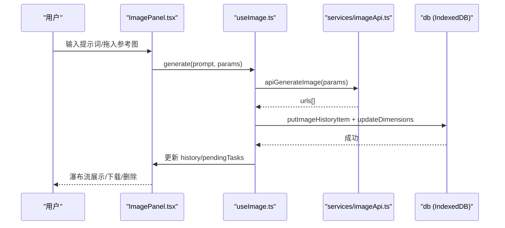
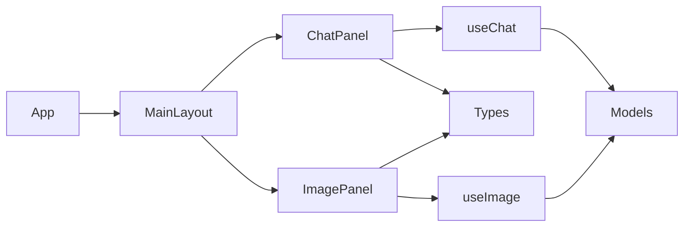

# 功能面板组件

<cite>
**本文引用的文件**
- [App.tsx](file://src/App.tsx)
- [MainLayout.tsx](file://src/components/layout/MainLayout.tsx)
- [ChatPanel.tsx](file://src/components/chat/ChatPanel.tsx)
- [ImagePanel.tsx](file://src/components/image/ImagePanel.tsx)
- [VideoPanel.tsx](file://src/components/video/VideoPanel.tsx)
- [MusicPanel.tsx](file://src/components/music/MusicPanel.tsx)
- [useChat.ts](file://src/hooks/useChat.ts)
- [useImage.ts](file://src/hooks/useImage.ts)
- [models.ts](file://src/config/models.ts)
- [index.ts](file://src/types/index.ts)
</cite>

## 目录
1. [简介](#简介)
2. [项目结构](#项目结构)
3. [核心组件](#核心组件)
4. [架构总览](#架构总览)
5. [详细组件分析](#详细组件分析)
6. [依赖关系分析](#依赖关系分析)
7. [性能考量](#性能考量)
8. [故障排查指南](#故障排查指南)
9. [结论](#结论)
10. [附录：开发指南与集成示例](#附录开发指南与集成示例)

## 简介
本设计文档围绕 AIShop 的功能面板组件展开，重点解析 ChatPanel、ImagePanel、VideoPanel、MusicPanel 的架构模式、状态管理、数据流与用户交互逻辑。文档同时说明面板间的通信机制、共享状态、事件传递方式，并总结扩展性设计与插件化能力、错误处理与加载反馈机制，最后提供面向新面板的开发指南与集成示例。

## 项目结构
- 应用入口 App 负责路由切换（Tab）与全局状态注入，将聊天相关的会话、消息、压缩片段等通过 props 下发到 ChatPanel；图片面板独立维护自身状态。
- 布局 MainLayout 提供侧边栏、顶栏、底栏以及手势交互，承载各面板内容区。
- 聊天面板 ChatPanel 使用 useChat hook 管理对话、流式输出、上下文压缩、Artifact 流式预览等。
- 图片面板 ImagePanel 使用 useImage hook 管理模型选择、上传参考图、生成队列、历史瀑布流展示。
- VideoPanel、MusicPanel 当前为占位实现，预留扩展点。

图表来源
- [App.tsx:58-95](file://src/App.tsx#L58-L95)
- [MainLayout.tsx:120-200](file://src/components/layout/MainLayout.tsx#L120-L200)
- [ChatPanel.tsx:18-70](file://src/components/chat/ChatPanel.tsx#L18-L70)
- [ImagePanel.tsx:369-396](file://src/components/image/ImagePanel.tsx#L369-L396)
- [useChat.ts:152-179](file://src/hooks/useChat.ts#L152-L179)
- [useImage.ts:123-150](file://src/hooks/useImage.ts#L123-L150)
- [models.ts:237-284](file://src/config/models.ts#L237-L284)
- [index.ts:125-175](file://src/types/index.ts#L125-L175)

章节来源
- [App.tsx:58-95](file://src/App.tsx#L58-L95)
- [MainLayout.tsx:120-200](file://src/components/layout/MainLayout.tsx#L120-L200)

## 核心组件
- ChatPanel：对话输入、消息渲染、折叠浏览、搜索、上下文压缩区间标记、Artifact 流式预览、版本对比与切换、联网搜索状态。
- ImagePanel：模型选择、比例/尺寸/质量参数、拖拽上传参考图、并发任务队列、瀑布流历史展示、下载与删除。
- VideoPanel、MusicPanel：占位视图，等待后续接入具体业务。

章节来源
- [ChatPanel.tsx:18-70](file://src/components/chat/ChatPanel.tsx#L18-L70)
- [ImagePanel.tsx:369-396](file://src/components/image/ImagePanel.tsx#L369-L396)
- [VideoPanel.tsx:1-8](file://src/components/video/VideoPanel.tsx#L1-L8)
- [MusicPanel.tsx:1-8](file://src/components/music/MusicPanel.tsx#L1-L8)

## 架构总览
- 状态分层：
  - 应用级：App 持有 activeTab、会话列表与选中会话、压缩 toast 与 segment 打开请求等。
  - 面板级：ChatPanel 与 ImagePanel 各自维护本地 UI 状态（如搜索、折叠、上传错误）。
  - Hook 级：useChat 管理会话持久化、流式响应、上下文压缩、Artifact 流；useImage 管理图片生成队列与历史。
- 数据流：
  - 聊天：用户输入 → useChat.sendMessage → 构建 API 消息（含压缩片段）→ 流式返回 → 更新消息与 Artifact → 触发 UI 滚动与预览。
  - 图片：用户提交 → useImage.generate → executeTask → apiGenerateImage → 成功写入历史并落库 → 失败进入 pending 错误卡片。
- 通信机制：
  - 父子组件通过 props 与回调进行单向数据流。
  - 跨面板共享由 App 集中分发（如 top bar 的模型选择、联网搜索开关、上下文压缩操作）。
  - 事件驱动：App 通过 openSegmentIdRequest 向 ChatPanel 发起“查看摘要”动作，完成后再回调 onOpenSegmentIdRequestHandled 清理。

图表来源
- [App.tsx:60-84](file://src/App.tsx#L60-L84)
- [ChatPanel.tsx:49-70](file://src/components/chat/ChatPanel.tsx#L49-L70)
- [useChat.ts:494-783](file://src/hooks/useChat.ts#L494-L783)

章节来源
- [App.tsx:60-84](file://src/App.tsx#L60-L84)
- [ChatPanel.tsx:49-70](file://src/components/chat/ChatPanel.tsx#L49-L70)
- [useChat.ts:494-783](file://src/hooks/useChat.ts#L494-L783)

## 详细组件分析

### ChatPanel 组件
- 状态管理
  - 本地 UI：折叠态、搜索框、高亮匹配、回到底部按钮显隐、引用消息、Artifact 自动预览信号。
  - 外部状态：messages、isLoading、featureSettings、segments、openSegmentIdRequest 等由父组件传入。
- 数据流处理
  - 发送消息前根据 featureSettings.autoCompactEnabled 与阈值判断是否执行上下文压缩，并将生成的 segment 应用到本次请求。
  - 流式输出时实时更新最后一条 assistant 消息内容，并在检测到 artifact 时开启流式预览。
  - 联网搜索：在发送前可选地调用搜索服务，将结果注入上下文，并在消息中标记 webSearching/webSearched/searchResults/webSearchFailed。
- 用户交互
  - 折叠浏览：支持连续甩动触发折叠动画，锚定最近用户消息保持滚动位置稳定。
  - 对话内搜索：实时计算匹配项，支持跳转与高亮定位。
  - 版本对比与切换：对 assistant 消息提供 compareWithModel 与 switchVersion。
  - Artifact 全屏预览：流式代码更新完成后自动切换到预览模式。
- 错误处理与反馈
  - 流式异常捕获：AbortError 表示用户取消；其他错误显示失败信息并停止流式。
  - 触觉反馈：开始与结束生成时触发振动。
  - 压缩结果 Toast：由 App 层统一展示，并可点击跳转到对应 segment 摘要面板。

图表来源
- [useChat.ts:494-783](file://src/hooks/useChat.ts#L494-L783)
- [ChatPanel.tsx:357-415](file://src/components/chat/ChatPanel.tsx#L357-L415)

章节来源
- [ChatPanel.tsx:18-70](file://src/components/chat/ChatPanel.tsx#L18-L70)
- [ChatPanel.tsx:357-415](file://src/components/chat/ChatPanel.tsx#L357-L415)
- [useChat.ts:494-783](file://src/hooks/useChat.ts#L494-L783)

### ImagePanel 组件
- 状态管理
  - 本地 UI：prompt、上传错误、拖拽状态、输入区域焦点。
  - Hook 状态：selectedModel、uploadedImages、aspectRatio、size、quality、pendingTasks、history。
- 数据流处理
  - 生成流程：generate → executeTask → apiGenerateImage → 成功后追加历史并落库，失败进入 pending 错误卡片。
  - 并发队列：每个任务拥有独立 AbortController，支持重试、取消、关闭错误卡片。
  - 历史回填：启动时从 IndexedDB 加载历史，并对缺失宽高进行回填以优化瀑布流布局。
- 用户交互
  - 拖拽上传：支持外部文件与内部照片墙图片拖入作为参考图，包含 CORS 回退策略。
  - 参数选择：按模型动态提供比例、尺寸、质量选项；GPT 模型使用尺寸+质量，Google 模型使用比例+尺寸。
  - 下载与删除：支持下载图片（Blob URL 临时创建与回收）、删除历史记录。
- 错误处理与反馈
  - 网络/超时：区分手动取消与超时，分别移除或置错。
  - 文件过大：超过 50MB 的文件被忽略并提示。
  - 拖拽失败：无法加载的图片给出错误提示。

图表来源
- [ImagePanel.tsx:369-396](file://src/components/image/ImagePanel.tsx#L369-L396)
- [useImage.ts:274-356](file://src/hooks/useImage.ts#L274-L356)
- [useImage.ts:358-427](file://src/hooks/useImage.ts#L358-L427)

章节来源
- [ImagePanel.tsx:369-396](file://src/components/image/ImagePanel.tsx#L369-L396)
- [useImage.ts:274-356](file://src/hooks/useImage.ts#L274-L356)
- [useImage.ts:358-427](file://src/hooks/useImage.ts#L358-L427)

### VideoPanel 与 MusicPanel
- 当前为占位实现，仅显示“即将上线”。
- 扩展建议：遵循 ImagePanel 的 Hook 抽象（useVideo/useMusic），将模型配置、参数选择、任务队列、历史展示与下载/播放控制模块化；通过 App 的 Tab 路由无缝接入。

章节来源
- [VideoPanel.tsx:1-8](file://src/components/video/VideoPanel.tsx#L1-L8)
- [MusicPanel.tsx:1-8](file://src/components/music/MusicPanel.tsx#L1-L8)

## 依赖关系分析
- 组件依赖
  - ChatPanel 依赖 useChat、MessageBubble、ChatInput、ArtifactPanel、ContextSummarySheet 等子组件与工具。
  - ImagePanel 依赖 useImage、MasonryPhotoWall、PhotoCard、ModelSelector 等。
- Hook 依赖
  - useChat 依赖 services/api、services/conversationStore、services/webSearch、utils/compactPlan、utils/tokenEstimate 等。
  - useImage 依赖 services/imageApi、db（IndexedDB）。
- 类型与配置
  - types/index.ts 定义 Message、Conversation、ImageGenerationParams、PendingImageTask 等核心类型。
  - config/models.ts 提供 CHAT_MODELS、IMAGE_MODELS、VIDEO_MODELS、MUSIC_MODELS 及 getModelsByType。

图表来源
- [ChatPanel.tsx:1-16](file://src/components/chat/ChatPanel.tsx#L1-L16)
- [ImagePanel.tsx:1-20](file://src/components/image/ImagePanel.tsx#L1-L20)
- [useChat.ts:1-42](file://src/hooks/useChat.ts#L1-L42)
- [useImage.ts:1-14](file://src/hooks/useImage.ts#L1-L14)
- [models.ts:237-284](file://src/config/models.ts#L237-L284)
- [index.ts:125-214](file://src/types/index.ts#L125-L214)

章节来源
- [ChatPanel.tsx:1-16](file://src/components/chat/ChatPanel.tsx#L1-L16)
- [ImagePanel.tsx:1-20](file://src/components/image/ImagePanel.tsx#L1-L20)
- [useChat.ts:1-42](file://src/hooks/useChat.ts#L1-L42)
- [useImage.ts:1-14](file://src/hooks/useImage.ts#L1-L14)
- [models.ts:237-284](file://src/config/models.ts#L237-L284)
- [index.ts:125-214](file://src/types/index.ts#L125-L214)

## 性能考量
- 聊天面板
  - 流式渲染：逐字更新避免整段重绘；使用 ResizeObserver + rAF 缓动保持吸底滚动。
  - 折叠动画：使用 transform/opacity 减少布局抖动；通过 pinScroll 冻结滚动防止惯性覆盖。
  - 上下文压缩：仅在阈值触发且可行时执行，避免频繁压缩影响体验。
- 图片面板
  - 并发队列：每个任务独立 AbortController，避免阻塞；成功/失败后及时清理。
  - 历史回填：按需获取图片宽高，优先读取已存储尺寸，减少解码开销。
  - 大文件防护：限制最大文件大小，避免浏览器卡顿。
- 通用
  - 持久化 diff：useChat 仅写变化部分，避免全量落盘导致主线程阻塞。
  - 主题与存储：启动时加载主题与持久化存储申请，降低数据回收概率。

[本节为通用指导，不直接分析具体文件]

## 故障排查指南
- 聊天面板
  - 流式中断：检查 AbortError 分支，确认 stopGeneration 是否正确调用；查看错误消息并提示用户。
  - 压缩失败：确认 compactConversation 返回值与 isCompactionViable 判断；必要时降级为不压缩继续发送。
  - 搜索无结果：检查 searchQuery 与 matches 计算逻辑；确保 getPlainText 正确提取文本。
- 图片面板
  - 拖拽失败：检查 CORS 与 fetch 回退；确认 data URI/blob URL/http URL 分支处理。
  - 生成失败：查看 pendingTasks 的错误信息；支持重试与取消；确认 apiGenerateImage 返回与异常。
  - 历史未显示：确认 IndexedDB 写入与 listImageHistory 回调；检查宽高回填是否成功。
- 通用
  - 模型配置：确认 models.ts 中对应模型的 type 与 capabilities 与实际接口一致。
  - 类型错误：核对 types/index.ts 中的 Message、ImageGenerationParams 等字段是否与后端一致。

章节来源
- [useChat.ts:741-783](file://src/hooks/useChat.ts#L741-L783)
- [useChat.ts:402-450](file://src/hooks/useChat.ts#L402-L450)
- [ImagePanel.tsx:438-571](file://src/components/image/ImagePanel.tsx#L438-L571)
- [useImage.ts:336-356](file://src/hooks/useImage.ts#L336-L356)

## 结论
AIShop 的功能面板采用清晰的层级架构：App 负责路由与全局状态分发，MainLayout 提供布局与交互容器，各面板通过独立的 Hook 管理领域状态与数据流。ChatPanel 与 ImagePanel 实现了完整的用户交互、错误处理与性能优化，VideoPanel 与 MusicPanel 预留扩展点。整体设计具备良好的扩展性与可维护性，便于新增面板与复用通用能力。

[本节为总结，不直接分析具体文件]

## 附录：开发指南与集成示例

### 新增面板开发步骤
- 创建面板组件
  - 在 src/components/{feature}/FeaturePanel.tsx 中实现基础 UI。
  - 若需要复杂状态与数据流，创建对应的 Hook（如 useFeature.ts），封装 API 调用、队列、历史与持久化。
- 注册模型与类型
  - 在 config/models.ts 中添加对应 Model 条目（type 为 video/music）。
  - 在 types/index.ts 中补充必要的请求参数与数据结构。
- 接入路由
  - 在 App.tsx 的 renderContent 中增加 case 分支，返回 FeaturePanel。
  - 如需共享状态（如模型选择、联网搜索），通过 props 从 App 传入。
- 布局适配
  - MainLayout 已提供 children 插槽，无需额外适配。
  - 若需顶部工具栏或底部导航联动，参照 ChatPanel 与 ImagePanel 的用法。

章节来源
- [App.tsx:58-95](file://src/App.tsx#L58-L95)
- [models.ts:272-284](file://src/config/models.ts#L272-L284)
- [index.ts:125-175](file://src/types/index.ts#L125-L175)

### 面板间通信与共享状态
- 通过 App 集中管理并下发：
  - 模型选择：App 将 models、selectedModel、onModelChange 传递给 TopNavBar，再透传到 ChatPanel。
  - 联网搜索：App 将 webSearchEnabled 与 onWebSearchToggle 传递给 ChatPanel。
  - 上下文压缩：App 提供 onCompactActive、segments、onOpenSegment、onDeleteSegment。
- 事件驱动：
  - App 通过 openSegmentIdRequest 通知 ChatPanel 打开指定 segment 摘要面板，完成后回调 onOpenSegmentIdRequestHandled 清理。

章节来源
- [App.tsx:40-84](file://src/App.tsx#L40-L84)
- [MainLayout.tsx:174-197](file://src/components/layout/MainLayout.tsx#L174-L197)
- [ChatPanel.tsx:178-185](file://src/components/chat/ChatPanel.tsx#L178-L185)

### 错误处理与用户反馈
- 聊天面板
  - 流式错误：catch 分支设置 error 并更新消息内容；AbortError 特殊处理为用户取消。
  - 压缩反馈：App 层 Toast 展示压缩结果，并提供“查看”操作跳转至 segment 摘要。
- 图片面板
  - 任务错误：pendingTasks 中记录错误信息，支持重试与关闭。
  - 上传错误：uploadError 状态用于提示超大文件或拖拽失败。
- 通用
  - 触觉反馈：useChat 在开始与结束生成时触发振动，提升交互感知。

章节来源
- [useChat.ts:741-783](file://src/hooks/useChat.ts#L741-L783)
- [App.tsx:40-56](file://src/App.tsx#L40-L56)
- [ImagePanel.tsx:740-754](file://src/components/image/ImagePanel.tsx#L740-L754)
- [useImage.ts:336-356](file://src/hooks/useImage.ts#L336-L356)

### 扩展性设计与插件化
- 模型配置化：通过 models.ts 的 getModelsByType 统一管理不同能力的模型，便于新增视频/音乐模型。
- Hook 抽象：useChat 与 useImage 展示了如何将领域逻辑下沉到 Hook，面板仅关注 UI 与交互。
- 组件解耦：ChatPanel 与 ImagePanel 均通过 props 接收外部能力（如模型选择、搜索开关），便于替换或扩展。
- 事件总线：App 通过 openSegmentIdRequest 与回调实现跨面板事件传递，避免紧耦合。

章节来源
- [models.ts:275-284](file://src/config/models.ts#L275-L284)
- [useChat.ts:152-179](file://src/hooks/useChat.ts#L152-L179)
- [useImage.ts:123-150](file://src/hooks/useImage.ts#L123-L150)
- [App.tsx:40-84](file://src/App.tsx#L40-L84)