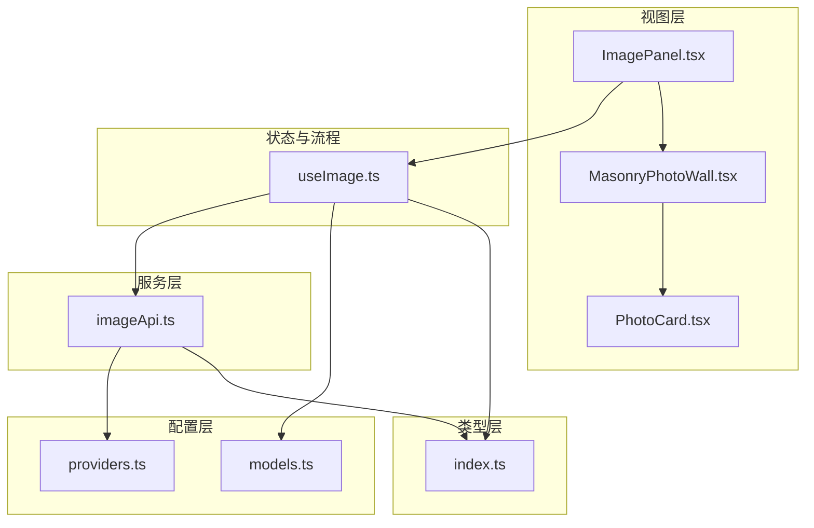
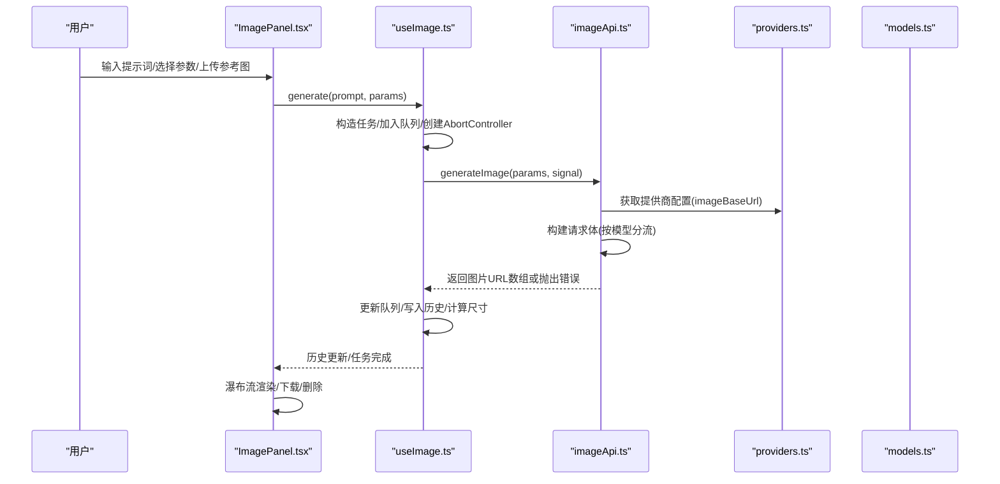
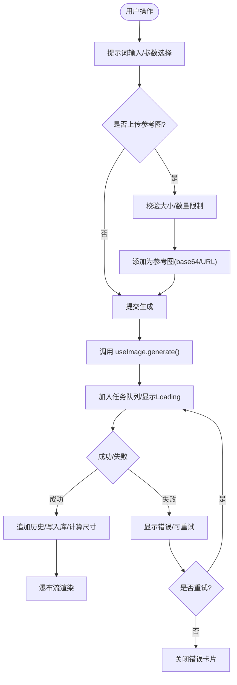
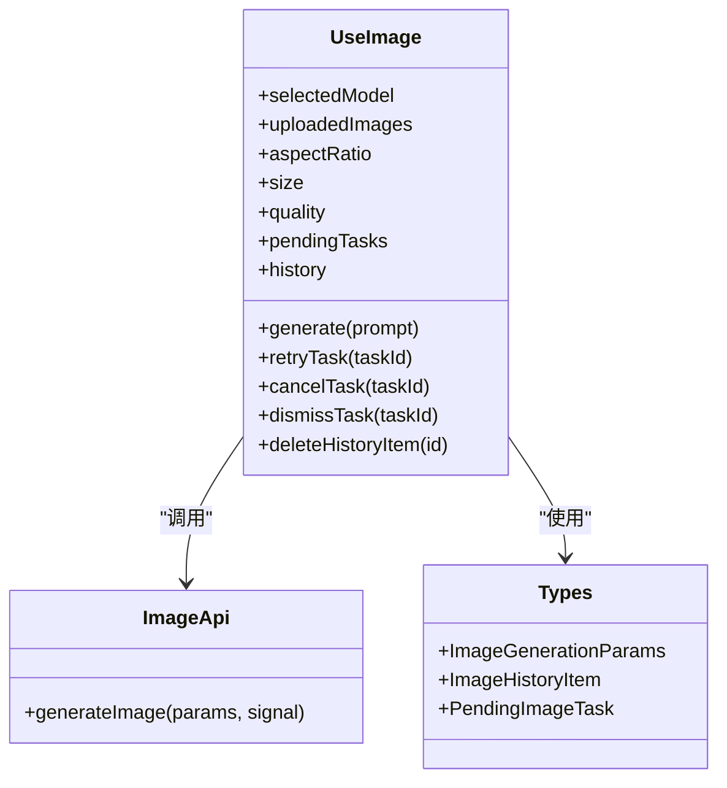
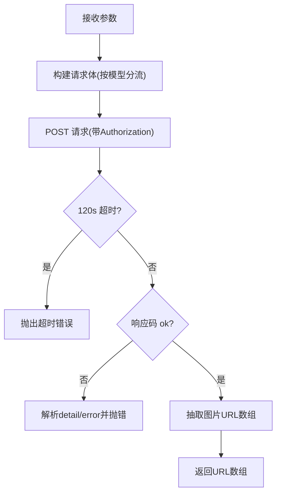
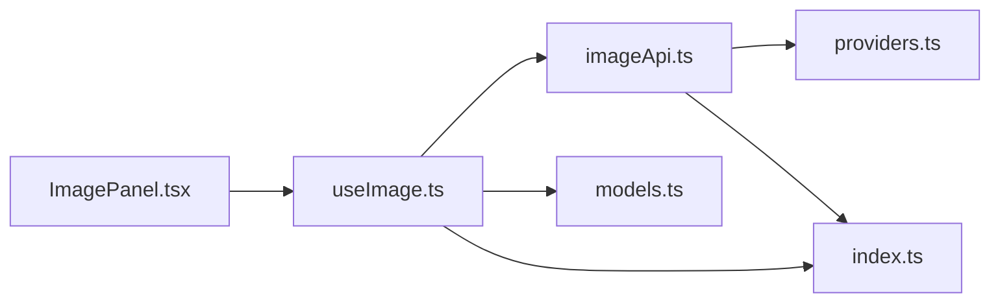

# 图像生成功能面板

<cite>
**本文引用的文件**
- [ImagePanel.tsx](file://src/components/image/ImagePanel.tsx)
- [useImage.ts](file://src/hooks/useImage.ts)
- [imageApi.ts](file://src/services/imageApi.ts)
- [models.ts](file://src/config/models.ts)
- [providers.ts](file://src/config/providers.ts)
- [index.ts](file://src/types/index.ts)
- [MasonryPhotoWall.tsx](file://src/components/image/MasonryPhotoWall.tsx)
- [PhotoCard.tsx](file://src/components/image/PhotoCard.tsx)
</cite>

## 目录
1. [简介](#简介)
2. [项目结构](#项目结构)
3. [核心组件](#核心组件)
4. [架构总览](#架构总览)
5. [详细组件分析](#详细组件分析)
6. [依赖关系分析](#依赖关系分析)
7. [性能考量](#性能考量)
8. [故障排查指南](#故障排查指南)
9. [结论](#结论)
10. [附录](#附录)

## 简介
本技术文档聚焦 AIShop 项目的“图像生成功能面板”，围绕 ImagePanel 组件的设计模式与实现细节，系统阐述文本到图像生成、图像编辑、批量处理等能力；深入解析状态管理（任务队列、进度跟踪、历史记录）；说明与后端 API 的集成方式（参数配置、错误处理、响应处理）；文档化用户界面交互（提示词输入、参数调整、图片预览）；并提供性能优化策略（并发控制、缓存机制、资源管理）以及开发最佳实践。

## 项目结构
图像生成功能由以下关键模块构成：
- 视图层：ImagePanel 主面板，负责 UI 布局、拖拽上传、提示词输入、参数选择、瀑布流展示与下载等。
- 状态与流程：useImage Hook，封装模型切换、参数派生、任务队列、历史持久化、重试/取消等。
- 服务层：imageApi 统一封装上游多提供商的图片生成接口，负责请求体构建、超时控制、错误归一化、URL 提取。
- 配置层：models 定义可用图像模型；providers 提供提供商基础 URL。
- 类型层：types 定义请求参数、历史项、待处理任务等数据结构。
- 展示层：MasonryPhotoWall 瀑布流布局；PhotoCard 卡片渲染（含加载/错误态）。

图表来源
- [ImagePanel.tsx:369-776](file://src/components/image/ImagePanel.tsx#L369-L776)
- [useImage.ts:123-469](file://src/hooks/useImage.ts#L123-L469)
- [imageApi.ts:149-243](file://src/services/imageApi.ts#L149-L243)
- [models.ts:237-271](file://src/config/models.ts#L237-L271)
- [providers.ts:1-18](file://src/config/providers.ts#L1-L18)
- [index.ts:177-214](file://src/types/index.ts#L177-L214)

章节来源
- [ImagePanel.tsx:369-776](file://src/components/image/ImagePanel.tsx#L369-L776)
- [useImage.ts:123-469](file://src/hooks/useImage.ts#L123-L469)
- [imageApi.ts:149-243](file://src/services/imageApi.ts#L149-L243)
- [models.ts:237-271](file://src/config/models.ts#L237-L271)
- [providers.ts:1-18](file://src/config/providers.ts#L1-L18)
- [index.ts:177-214](file://src/types/index.ts#L177-L214)

## 核心组件
- ImagePanel：承载完整的图像生成工作区，包括提示词输入、参考图上传（支持拖拽）、模型/尺寸/比例/质量选择、瀑布流结果展示、下载与删除、错误提示等。
- useImage：集中管理图像生成的业务状态与流程，包括：
  - 模型选择与默认参数派生
  - 上传图片管理与压缩
  - 任务队列与并发控制（AbortController）
  - 历史数据读写（IndexedDB）与维度回填
  - 重试、取消、关闭错误卡片
- imageApi：统一对接上游图像生成 API，负责：
  - 根据模型选择端点
  - 构建不同模型的请求体（GPT Image 2 / Gemini）
  - 超时控制与错误归一化
  - 兼容多种响应结构并抽取图片 URL

章节来源
- [ImagePanel.tsx:369-776](file://src/components/image/ImagePanel.tsx#L369-L776)
- [useImage.ts:123-469](file://src/hooks/useImage.ts#L123-L469)
- [imageApi.ts:149-243](file://src/services/imageApi.ts#L149-L243)

## 架构总览
下图展示了从用户操作到最终结果展示的端到端调用链，涵盖 UI、状态、服务与配置层。

图表来源
- [ImagePanel.tsx:603-635](file://src/components/image/ImagePanel.tsx#L603-L635)
- [useImage.ts:275-356](file://src/hooks/useImage.ts#L275-L356)
- [imageApi.ts:149-243](file://src/services/imageApi.ts#L149-L243)
- [providers.ts:1-18](file://src/config/providers.ts#L1-L18)
- [models.ts:237-271](file://src/config/models.ts#L237-L271)

## 详细组件分析

### ImagePanel 组件
- 职责与职责边界
  - 负责用户交互：提示词输入、Enter 提交、拖拽上传、参数选择、下载与删除。
  - 通过 useImage 暴露的状态与方法驱动生成流程与历史展示。
  - 使用 MasonryPhotoWall 进行瀑布流布局，PhotoCard 渲染具体卡片内容。
- 关键交互
  - 拖拽上传：支持外部文件与内部照片墙图片拖入作为参考图，包含大小校验与错误提示。
  - 提示词输入：自动高度自适应，防抖防止重复提交。
  - 参数选择：浮动下拉与九宫格比例选择器，动态适配模型能力。
  - 下载：将 IndexedDB 中的 blob 引用转换为临时 object URL 后触发下载，并在完成后释放内存。
- 状态映射
  - 将 history 扁平化为 FlatCard，再转为 PhotoItem 供瀑布流使用。
  - pendingTasks 映射为 LoadingCard/ErrorCard，支持取消、重试、关闭。

图表来源
- [ImagePanel.tsx:413-571](file://src/components/image/ImagePanel.tsx#L413-L571)
- [ImagePanel.tsx:603-731](file://src/components/image/ImagePanel.tsx#L603-L731)
- [useImage.ts:275-356](file://src/hooks/useImage.ts#L275-L356)

章节来源
- [ImagePanel.tsx:369-776](file://src/components/image/ImagePanel.tsx#L369-L776)
- [MasonryPhotoWall.tsx:1-111](file://src/components/image/MasonryPhotoWall.tsx#L1-L111)
- [PhotoCard.tsx:1-47](file://src/components/image/PhotoCard.tsx#L1-L47)

### useImage Hook（状态与流程）
- 模型与参数
  - 根据模型动态设置默认宽高比、尺寸、质量选项与最大上传数量。
  - 对 GPT 与 Google 系列模型分别处理参数差异。
- 上传图片管理
  - 压缩图片至 base64（最大边长 1024px，JPEG 质量 0.85），避免过大传输。
  - 限制上传数量，超出则裁剪。
- 任务队列与并发控制
  - 每个任务分配唯一 taskId 与 AbortController，支持手动取消与超时取消。
  - 成功时移除任务并追加历史；失败时进入 error 态，支持重试。
- 历史与持久化
  - 启动时异步加载历史，并对缺失宽高进行回填（优先从 IndexedDB 读取已记录尺寸）。
  - 成功后写入 IndexedDB，并将内存中 base64 替换为 blob 引用以节省内存。
- 对外接口
  - generate、retryTask、cancelTask、dismissTask、deleteHistoryItem、clearHistory 等。

图表来源
- [useImage.ts:123-469](file://src/hooks/useImage.ts#L123-L469)
- [imageApi.ts:149-243](file://src/services/imageApi.ts#L149-L243)
- [index.ts:177-214](file://src/types/index.ts#L177-L214)

章节来源
- [useImage.ts:123-469](file://src/hooks/useImage.ts#L123-L469)
- [index.ts:177-214](file://src/types/index.ts#L177-L214)

### imageApi 服务（API 集成）
- 端点路由
  - 根据模型选择 textToImage 或 edit 端点路径。
- 请求体构建
  - GPT Image 2：编辑模式仅支持单张参考图，base64 需带 data URI 前缀；非编辑模式仅 prompt。
  - Gemini：编辑模式区分 image_urls 与 image_base64s；非编辑模式支持 aspect_ratio。
- 超时与错误
  - 内置 120 秒超时；合并外部取消信号与超时信号。
  - 非 2xx 响应时解析 detail/error 字段，统一抛出错误消息。
- 响应解析
  - 兼容 Gemini 自定义协议与 OpenAI 兼容结构，抽取图片 URL 数组。

图表来源
- [imageApi.ts:66-143](file://src/services/imageApi.ts#L66-L143)
- [imageApi.ts:149-243](file://src/services/imageApi.ts#L149-L243)

章节来源
- [imageApi.ts:66-143](file://src/services/imageApi.ts#L66-L143)
- [imageApi.ts:149-243](file://src/services/imageApi.ts#L149-L243)

### 瀑布流与卡片（MasonryPhotoWall 与 PhotoCard）
- MasonryPhotoWall
  - 列式瀑布流布局，响应式列数，最短列优先算法，占位高度防抖动，预留无限滚动扩展点。
- PhotoCard
  - 支持加载中、错误态与正常图片渲染；hover 覆盖层提供下载、删除等操作；支持拖拽结束回调用于将历史图片拖回输入区作为参考图。

章节来源
- [MasonryPhotoWall.tsx:1-111](file://src/components/image/MasonryPhotoWall.tsx#L1-L111)
- [PhotoCard.tsx:1-47](file://src/components/image/PhotoCard.tsx#L1-L47)

## 依赖关系分析
- 组件耦合
  - ImagePanel 依赖 useImage 提供的状态与方法，解耦了 UI 与业务逻辑。
  - useImage 依赖 imageApi 进行网络请求，依赖 models 与 providers 进行配置，依赖 types 进行类型约束。
- 外部依赖
  - 通过 providers 获取 imageBaseUrl，结合模型端点映射发起请求。
  - 通过 types 保证参数与历史数据结构一致性。
- 潜在循环依赖
  - 当前结构清晰，无直接循环依赖；UI 与状态分离良好。

图表来源
- [ImagePanel.tsx:369-776](file://src/components/image/ImagePanel.tsx#L369-L776)
- [useImage.ts:123-469](file://src/hooks/useImage.ts#L123-L469)
- [imageApi.ts:149-243](file://src/services/imageApi.ts#L149-L243)
- [models.ts:237-271](file://src/config/models.ts#L237-L271)
- [providers.ts:1-18](file://src/config/providers.ts#L1-L18)
- [index.ts:177-214](file://src/types/index.ts#L177-L214)

章节来源
- [ImagePanel.tsx:369-776](file://src/components/image/ImagePanel.tsx#L369-L776)
- [useImage.ts:123-469](file://src/hooks/useImage.ts#L123-L469)
- [imageApi.ts:149-243](file://src/services/imageApi.ts#L149-L243)
- [models.ts:237-271](file://src/config/models.ts#L237-L271)
- [providers.ts:1-18](file://src/config/providers.ts#L1-L18)
- [index.ts:177-214](file://src/types/index.ts#L177-L214)

## 性能考量
- 并发控制
  - 使用 AbortController 管理每个任务的取消与超时，避免资源泄漏。
  - 任务队列采用追加策略，保持 UI 稳定性。
- 缓存机制
  - 历史数据持久化到 IndexedDB，减少重复请求与内存占用。
  - 图片尺寸在入库时记录，避免每次重新解码计算。
- 资源管理
  - 下载时使用临时 object URL，并在完成后延迟释放，避免下载失败。
  - 上传图片压缩至合理大小，降低传输与处理开销。
- 渲染优化
  - 瀑布流布局使用占位高度，避免重排抖动。
  - 懒加载与虚拟滚动可扩展（代码已预留 onNearEnd 钩子）。

[本节为通用性能指导，不直接分析具体文件]

## 故障排查指南
- 常见错误与定位
  - 未配置 API Key：检查提供商设置，确保 image 提供商已配置密钥。
  - 不支持的模型：确认模型 ID 是否在 IMAGE_ENDPOINTS 映射中。
  - 请求超时：检查上游服务状态与网络状况，必要时延长超时或重试。
  - 响应无图片 URL：检查上游响应结构，确认 extractUrls 是否能正确解析。
- 调试建议
  - 查看控制台日志，关注 useImage 与 imageApi 的错误信息。
  - 检查浏览器网络面板，确认请求头 Authorization 与请求体是否符合预期。
  - 对于 CORS 问题，尝试使用本地代理或调整跨域策略。

章节来源
- [imageApi.ts:149-243](file://src/services/imageApi.ts#L149-L243)
- [useImage.ts:275-356](file://src/hooks/useImage.ts#L275-L356)

## 结论
AIShop 图像生成功能面板通过清晰的组件分层与状态管理，实现了文本到图像生成、图像编辑与批量处理的完整流程。ImagePanel 专注于 UI 交互，useImage 负责业务状态与流程编排，imageApi 统一对接上游服务并处理异常。整体架构具备良好的可扩展性与可维护性，适合持续迭代与功能增强。

[本节为总结性内容，不直接分析具体文件]

## 附录
- 开发最佳实践
  - 新增模型时，需在 models 与 imageApi 中补充端点映射与请求体构建逻辑。
  - 保持参数派生与有效值校验，避免脏值导致请求失败。
  - 合理使用 IndexedDB 存储历史与图片，注意内存释放与版本迁移。
  - 在 UI 层提供明确的错误提示与重试入口，提升用户体验。
- 扩展建议
  - 引入虚拟滚动以提升大量图片时的滚动性能。
  - 增加图片预览放大与批处理操作（批量下载、批量删除）。
  - 增加生成参数模板与常用提示词收藏。

[本节为通用指导，不直接分析具体文件]