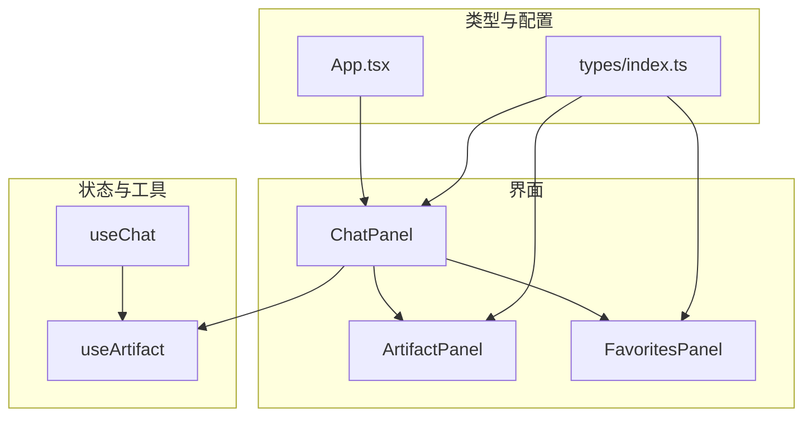
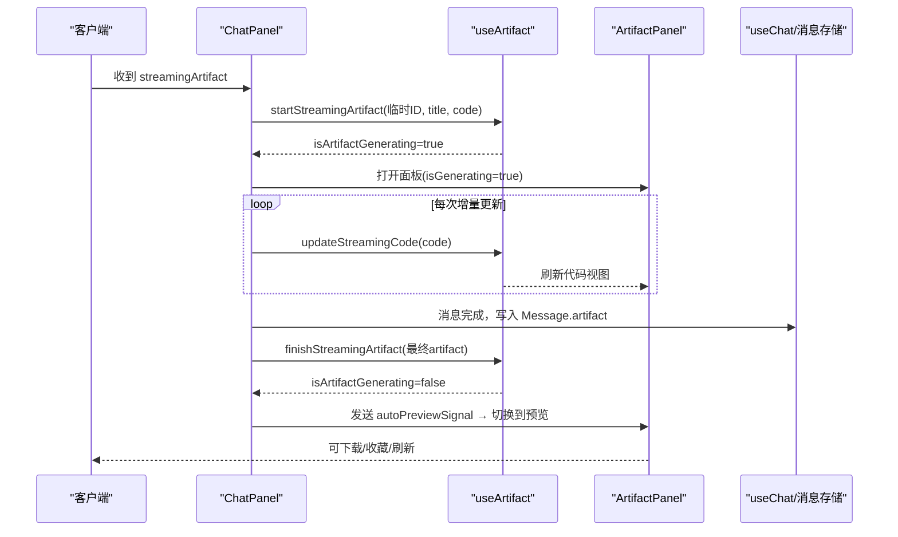
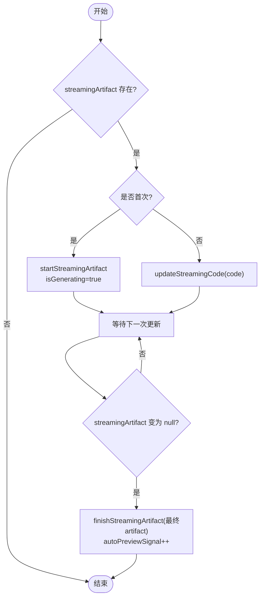
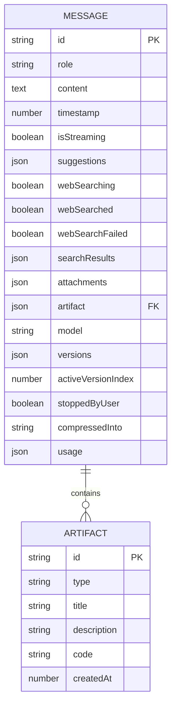
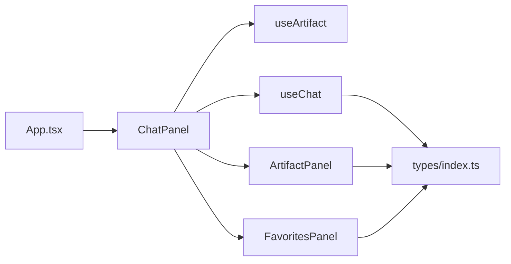

# Artifact 集成

<cite>
**本文引用的文件**
- [ArtifactPanel.tsx](file://src/components/artifact/ArtifactPanel.tsx)
- [ChatPanel.tsx](file://src/components/chat/ChatPanel.tsx)
- [useArtifact.ts](file://src/hooks/useArtifact.ts)
- [index.ts（类型定义）](file://src/types/index.ts)
- [useChat.ts](file://src/hooks/useChat.ts)
- [App.tsx](file://src/App.tsx)
- [FavoritesPanel.tsx](file://src/components/artifact/FavoritesPanel.tsx)
</cite>

## 目录
1. [简介](#简介)
2. [项目结构](#项目结构)
3. [核心组件](#核心组件)
4. [架构总览](#架构总览)
5. [详细组件分析](#详细组件分析)
6. [依赖关系分析](#依赖关系分析)
7. [性能考量](#性能考量)
8. [故障排查指南](#故障排查指南)
9. [结论](#结论)
10. [附录：扩展与规范](#附录：扩展与规范)

## 简介
本技术文档聚焦 AIShop 项目的 Artifact 集成功能，围绕“流式 Artifact 处理机制”展开，覆盖从开始流式传输到最终完成的完整生命周期；解释与聊天界面的集成方式（自动打开面板、消息关联、状态同步）；文档化 Artifact 数据格式（HTML 代码结构、元数据定义、版本管理）；说明错误处理策略（流式中断恢复、解析失败处理、资源清理）；并提供 Artifact 类型的扩展指南与自定义开发规范。

## 项目结构
Artifact 功能由以下关键模块协作完成：
- 展示层：ArtifactPanel（预览/代码模式切换、下载、收藏缩略图捕获）
- 会话层：ChatPanel（监听 streamingArtifact、驱动面板打开/关闭、状态同步）
- 状态与解析：useArtifact（流式状态管理、内容解析工具）
- 类型定义：types/index.ts（ArtifactBlock、Message 等）
- 对话流程：useChat（构建系统提示、解析并落盘 artifact）
- 入口与开关：App.tsx（全局 featureSettings 控制）
- 收藏管理：FavoritesPanel（收藏列表、预览、重命名、删除）

图表来源
- [ChatPanel.tsx:357-406](file://src/components/chat/ChatPanel.tsx#L357-L406)
- [ArtifactPanel.tsx:66-266](file://src/components/artifact/ArtifactPanel.tsx#L66-L266)
- [useArtifact.ts:95-132](file://src/hooks/useArtifact.ts#L95-L132)
- [useChat.ts:720-740](file://src/hooks/useChat.ts#L720-L740)
- [index.ts:44-51](file://src/types/index.ts#L44-L51)
- [App.tsx:124-125](file://src/App.tsx#L124-L125)

章节来源
- [ChatPanel.tsx:357-406](file://src/components/chat/ChatPanel.tsx#L357-L406)
- [ArtifactPanel.tsx:66-266](file://src/components/artifact/ArtifactPanel.tsx#L66-L266)
- [useArtifact.ts:95-132](file://src/hooks/useArtifact.ts#L95-L132)
- [useChat.ts:720-740](file://src/hooks/useChat.ts#L720-L740)
- [index.ts:44-51](file://src/types/index.ts#L44-L51)
- [App.tsx:124-125](file://src/App.tsx#L124-L125)

## 核心组件
- ArtifactPanel：负责 HTML 预览、代码高亮显示、下载、收藏截图、流式生成中的模式锁定与完成后自动切回预览。
- ChatPanel：监听 streamingArtifact，驱动面板打开/关闭，维护 isArtifactGenerating 与 autoPreviewSignal，完成时从消息中解析或复用已存在的 artifact。
- useArtifact：提供 parseArtifactFromContent、extractStreamingArtifact、isArtifactStreaming 等解析工具，以及 activeArtifact、isArtifactGenerating 的状态管理与方法。
- types/index.ts：定义 ArtifactBlock、Message.artifact、MessageVersion.artifact 等数据结构。
- useChat：在消息完成时解析并写入 Message.artifact，同时剥离 artifact 标记用于文本显示。
- App.tsx：通过 featureSettings.artifactEnabled 控制是否启用 Artifact 能力。
- FavoritesPanel：收藏列表与预览，支持重命名、删除、长按菜单等交互。

章节来源
- [ArtifactPanel.tsx:66-266](file://src/components/artifact/ArtifactPanel.tsx#L66-L266)
- [ChatPanel.tsx:357-406](file://src/components/chat/ChatPanel.tsx#L357-L406)
- [useArtifact.ts:11-90](file://src/hooks/useArtifact.ts#L11-L90)
- [index.ts:44-107](file://src/types/index.ts#L44-L107)
- [useChat.ts:720-740](file://src/hooks/useChat.ts#L720-L740)
- [App.tsx:124-125](file://src/App.tsx#L124-L125)
- [FavoritesPanel.tsx:15-312](file://src/components/artifact/FavoritesPanel.tsx#L15-L312)

## 架构总览
下图展示了 Artifact 从流式输出到最终展示的端到端流程，包括聊天侧的触发、状态迁移、UI 渲染与收藏持久化。

图表来源
- [ChatPanel.tsx:370-406](file://src/components/chat/ChatPanel.tsx#L370-L406)
- [useArtifact.ts:105-120](file://src/hooks/useArtifact.ts#L105-L120)
- [useChat.ts:720-740](file://src/hooks/useChat.ts#L720-L740)
- [ArtifactPanel.tsx:73-93](file://src/components/artifact/ArtifactPanel.tsx#L73-L93)

## 详细组件分析

### 流式 Artifact 处理机制
- 开始流式：当检测到 streamingArtifact 非空且首次出现时，调用 startStreamingArtifact 创建临时 artifact（id 以 streaming_ 开头），并设置 isArtifactGenerating=true。
- 增量更新：后续 streamingArtifact.code 变化时调用 updateStreamingCode，实时刷新预览 iframe 或代码视图。
- 结束流式：当 streamingArtifact 变为 null，优先使用最后一条消息的 Message.artifact；若不存在则尝试从 content 中解析；若仍无，则保持当前 activeArtifact 但标记为完成。随后发送 autoPreviewSignal，使面板自动切换到预览模式。

图表来源
- [ChatPanel.tsx:370-406](file://src/components/chat/ChatPanel.tsx#L370-L406)
- [useArtifact.ts:105-120](file://src/hooks/useArtifact.ts#L105-L120)

章节来源
- [ChatPanel.tsx:370-406](file://src/components/chat/ChatPanel.tsx#L370-L406)
- [useArtifact.ts:105-120](file://src/hooks/useArtifact.ts#L105-L120)

### 面板状态管理与预览模式切换
- 流式期间强制代码模式：isGenerating=true 时，面板始终处于代码模式，避免不完整的 HTML 导致预览异常。
- 流式结束后自动预览：autoPreviewSignal 递增时，面板切换到预览模式。
- 代码区域自动滚动：流式过程中，代码容器跟随新内容滚动到底部，提升可读性。
- 刷新与下载：预览模式下支持刷新 iframe；任意模式下支持下载 HTML 文件。

章节来源
- [ArtifactPanel.tsx:73-114](file://src/components/artifact/ArtifactPanel.tsx#L73-L114)
- [ArtifactPanel.tsx:223-251](file://src/components/artifact/ArtifactPanel.tsx#L223-L251)

### 与聊天界面的集成
- 自动打开面板：首次检测到 streamingArtifact 即打开面板并开始流式。
- 消息关联：消息完成时，将解析出的 artifact 写入 Message.artifact，便于后续查看与分享。
- 状态同步：通过 isArtifactGenerating 和 autoPreviewSignal 协调面板行为，确保流式与预览的一致性。
- 会话切换清理：切换会话时关闭面板，避免跨会话状态污染。

章节来源
- [ChatPanel.tsx:357-406](file://src/components/chat/ChatPanel.tsx#L357-L406)
- [useChat.ts:720-740](file://src/hooks/useChat.ts#L720-L740)

### Artifact 数据格式与版本管理
- ArtifactBlock：包含 id、type（当前固定为 html）、title、description（可选）、code、createdAt。
- 消息关联：Message 与 MessageVersion 均支持 artifact 字段，便于多版本场景下的独立追踪。
- 解析协议：使用特定标记包裹 artifact 内容，支持从完整文本中提取标题与代码块。

图表来源
- [index.ts:44-107](file://src/types/index.ts#L44-L107)

章节来源
- [index.ts:44-107](file://src/types/index.ts#L44-L107)
- [useArtifact.ts:11-43](file://src/hooks/useArtifact.ts#L11-L43)

### 收藏与缩略图
- 收藏触发：在预览模式下点击收藏，尝试从 iframe 捕获缩略图（html2canvas），成功后上传/保存；若不可用则降级为无缩略图收藏。
- 收藏列表：FavoritesPanel 提供网格展示、预览、重命名、删除等操作。
- 资源清理：收藏截图完成后释放相关状态，避免内存泄漏。

章节来源
- [ArtifactPanel.tsx:145-179](file://src/components/artifact/ArtifactPanel.tsx#L145-L179)
- [FavoritesPanel.tsx:85-149](file://src/components/artifact/FavoritesPanel.tsx#L85-L149)
- [FavoritesPanel.tsx:170-275](file://src/components/artifact/FavoritesPanel.tsx#L170-L275)

## 依赖关系分析
- ChatPanel 依赖 useArtifact 进行状态管理与解析，依赖 ArtifactPanel 进行 UI 渲染。
- useChat 在消息完成时解析并写入 Message.artifact，供 ChatPanel 在流式结束时消费。
- App.tsx 通过 featureSettings 控制是否启用 Artifact 能力，影响输入与模型选择器的可见性。
- FavoritesPanel 依赖本地存储（如 IndexedDB）与 BlobImage 组件进行缩略图展示。

图表来源
- [App.tsx:124-125](file://src/App.tsx#L124-L125)
- [ChatPanel.tsx:357-406](file://src/components/chat/ChatPanel.tsx#L357-L406)
- [useChat.ts:720-740](file://src/hooks/useChat.ts#L720-L740)
- [index.ts:44-107](file://src/types/index.ts#L44-L107)

章节来源
- [App.tsx:124-125](file://src/App.tsx#L124-L125)
- [ChatPanel.tsx:357-406](file://src/components/chat/ChatPanel.tsx#L357-L406)
- [useChat.ts:720-740](file://src/hooks/useChat.ts#L720-L740)
- [index.ts:44-107](file://src/types/index.ts#L44-L107)

## 性能考量
- 流式渲染优化：代码模式在高频率更新下保持轻量渲染，预览模式仅在流式结束后自动切换，减少不必要的重绘。
- 缩略图捕获：使用 html2canvas 限制尺寸与质量，裁剪为正方形并压缩，降低内存占用与网络传输成本。
- 滚动与布局：代码区域自动滚动采用 ref 直接操作 scrollTop，避免频繁 reflow。
- 沙箱隔离：iframe 使用 sandbox 限制权限，仅开放必要能力，提高安全性与稳定性。

[本节为通用指导，无需具体文件引用]

## 故障排查指南
- 流式中断恢复：
  - 用户停止生成时，useChat 会标记 stoppedByUser 并清除 isStreaming；ChatPanel 在流式结束时仍会尝试从消息中解析 artifact，保证最终态一致。
  - 若解析失败，保持当前 activeArtifact 并标记完成，避免面板状态不一致。
- 解析失败处理：
  - 若 content 不包含约定的标记或缺少 CODE_MARKER，parseArtifactFromContent 返回 null；此时应回退到已有 artifact 或忽略。
- 资源清理：
  - 切换会话时关闭面板，防止残留状态。
  - 收藏截图失败时降级为无缩略图，并记录错误日志以便定位。

章节来源
- [useChat.ts:741-780](file://src/hooks/useChat.ts#L741-L780)
- [ChatPanel.tsx:386-406](file://src/components/chat/ChatPanel.tsx#L386-L406)
- [ArtifactPanel.tsx:151-166](file://src/components/artifact/ArtifactPanel.tsx#L151-L166)

## 结论
AIShop 的 Artifact 集成通过清晰的职责划分与稳健的状态机设计，实现了从流式生成到最终预览的无缝体验。ChatPanel 作为中枢协调器，结合 useArtifact 的解析与状态管理，确保了面板的自动打开、实时更新与完成后的平滑切换。类型系统与消息关联保证了数据的可追溯性与可扩展性。配合收藏与下载能力，形成了完整的 Artifact 工作流。

[本节为总结性内容，无需具体文件引用]

## 附录：扩展与规范
- 扩展 Artifact 类型：
  - 在 types/index.ts 中扩展 ArtifactBlock.type 枚举，并在解析逻辑中增加对应分支。
  - 在 useArtifact 的解析函数中新增对应标记与提取规则。
  - 在 ArtifactPanel 中根据 type 渲染不同预览组件（例如图片、视频、音频）。
- 自定义开发规范：
  - 所有 Artifact 必须遵循约定标记格式，确保解析稳定。
  - 预览环境需使用 iframe sandbox 限制权限，仅开放必要能力。
  - 流式更新应避免在预览模式下高频重绘，必要时延迟至流式结束。
  - 错误处理需覆盖解析失败、截图失败、网络异常等场景，并提供降级方案。
  - 收藏缩略图需考虑跨域与性能，必要时提供缓存与重试机制。

[本节为通用指导，无需具体文件引用]