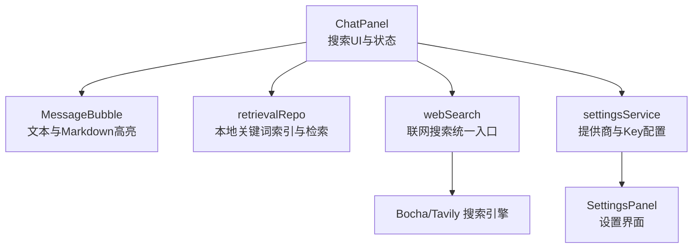
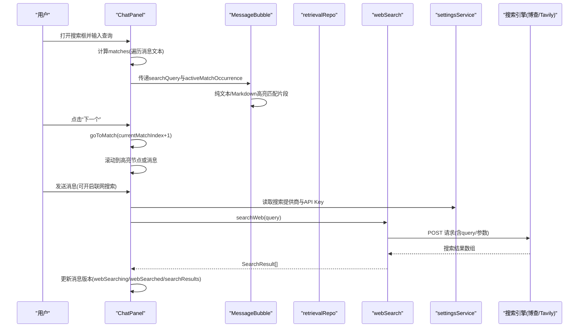
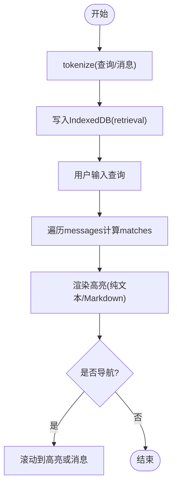
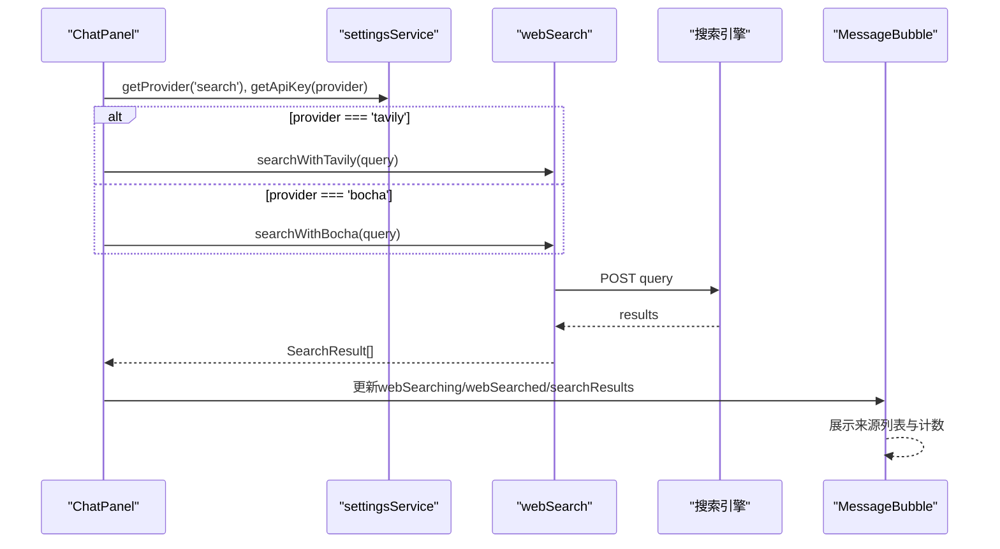
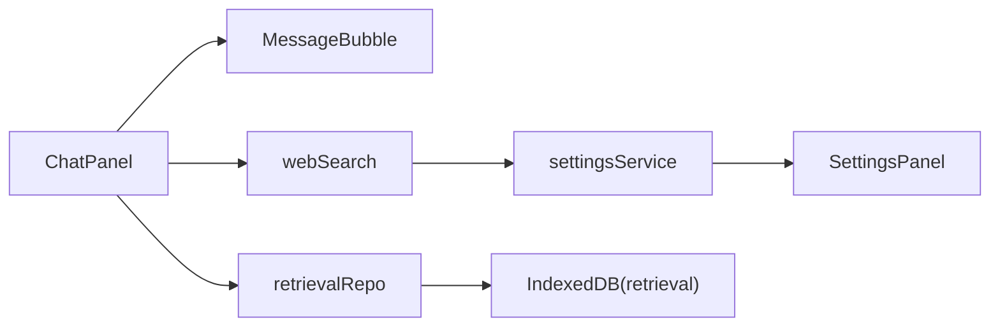

# 对话内搜索功能

<cite>
**本文引用的文件**
- [ChatPanel.tsx](file://src/components/chat/ChatPanel.tsx)
- [MessageBubble.tsx](file://src/components/chat/MessageBubble.tsx)
- [webSearch.ts](file://src/services/webSearch.ts)
- [retrievalRepo.ts](file://src/db/retrievalRepo.ts)
- [settingsService.ts](file://src/services/settingsService.ts)
- [SettingsPanel.tsx](file://src/components/settings/SettingsPanel.tsx)
- [useBlobUrl.ts](file://src/hooks/useBlobUrl.ts)
</cite>

## 目录
1. [简介](#简介)
2. [项目结构](#项目结构)
3. [核心组件](#核心组件)
4. [架构总览](#架构总览)
5. [详细组件分析](#详细组件分析)
6. [依赖关系分析](#依赖关系分析)
7. [性能考量](#性能考量)
8. [故障排查指南](#故障排查指南)
9. [结论](#结论)
10. [附录：配置与扩展](#附录：配置与扩展)

## 简介
本技术文档围绕 AIShop 项目的“对话内搜索”能力，系统性梳理以下方面：
- 搜索算法实现：全文检索、关键词匹配、搜索结果高亮。
- 搜索状态管理：搜索框开关、查询词处理、结果索引维护。
- 用户交互逻辑：搜索导航、结果跳转、搜索关闭等。
- 性能优化：防抖策略、增量搜索、内存管理。
- 可视化展示：匹配计数、当前位置指示、高亮效果。
- 配置选项与自定义扩展：提供商选择、API Key 管理、扩展新搜索引擎。

## 项目结构
对话内搜索涉及前端 UI、消息渲染、本地检索索引以及联网搜索服务四个层面：
- 聊天面板与气泡：负责搜索栏 UI、匹配计算、滚动定位与高亮渲染。
- 本地检索索引：基于 IndexedDB 的关键词索引，支持会话内或全局检索。
- 联网搜索服务：统一入口根据设置路由到博查或 Tavily 搜索引擎。
- 设置与配置：提供搜索提供商切换与 API Key 管理。

图表来源
- [ChatPanel.tsx:113-176](file://src/components/chat/ChatPanel.tsx#L113-L176)
- [MessageBubble.tsx:218-300](file://src/components/chat/MessageBubble.tsx#L218-L300)
- [retrievalRepo.ts:23-43](file://src/db/retrievalRepo.ts#L23-L43)
- [webSearch.ts:23-36](file://src/services/webSearch.ts#L23-L36)
- [settingsService.ts:59-84](file://src/services/settingsService.ts#L59-L84)
- [SettingsPanel.tsx:13-28](file://src/components/settings/SettingsPanel.tsx#L13-L28)

章节来源
- [ChatPanel.tsx:113-176](file://src/components/chat/ChatPanel.tsx#L113-L176)
- [MessageBubble.tsx:218-300](file://src/components/chat/MessageBubble.tsx#L218-L300)
- [retrievalRepo.ts:23-43](file://src/db/retrievalRepo.ts#L23-L43)
- [webSearch.ts:23-36](file://src/services/webSearch.ts#L23-L36)
- [settingsService.ts:59-84](file://src/services/settingsService.ts#L59-L84)
- [SettingsPanel.tsx:13-28](file://src/components/settings/SettingsPanel.tsx#L13-L28)

## 核心组件
- ChatPanel：承载搜索输入、匹配计算、当前命中索引、导航与关闭逻辑；将搜索状态传递给 MessageBubble 以进行高亮。
- MessageBubble：对纯文本与 Markdown 内容分别实现高亮；在 Markdown 渲染后通过 DOM TreeWalker 包裹匹配片段为 <mark>，并区分当前激活项。
- retrievalRepo：提供 tokenize（中文 2-gram + 拉丁分词）、indexMessage、searchMessages 等能力，构建本地关键词索引并返回按命中数排序的结果。
- webSearch：统一联网搜索入口，依据 settingsService 选择的提供商调用博查或 Tavily，并将结果格式化为上下文供 AI 回答使用。
- settingsService / SettingsPanel：持久化存储提供商与 API Key，并提供设置界面修改。

章节来源
- [ChatPanel.tsx:113-176](file://src/components/chat/ChatPanel.tsx#L113-L176)
- [MessageBubble.tsx:218-300](file://src/components/chat/MessageBubble.tsx#L218-L300)
- [retrievalRepo.ts:23-43](file://src/db/retrievalRepo.ts#L23-L43)
- [webSearch.ts:23-36](file://src/services/webSearch.ts#L23-L36)
- [settingsService.ts:59-84](file://src/services/settingsService.ts#L59-L84)
- [SettingsPanel.tsx:13-28](file://src/components/settings/SettingsPanel.tsx#L13-L28)

## 架构总览
对话内搜索由两条路径组成：
- 本地全文检索：基于 IndexedDB 的关键词索引，适合历史消息快速定位。
- 联网搜索：在发送消息时可选触发，获取外部参考资料并注入上下文。

图表来源
- [ChatPanel.tsx:113-176](file://src/components/chat/ChatPanel.tsx#L113-L176)
- [MessageBubble.tsx:218-300](file://src/components/chat/MessageBubble.tsx#L218-L300)
- [webSearch.ts:23-36](file://src/services/webSearch.ts#L23-L36)
- [settingsService.ts:59-84](file://src/services/settingsService.ts#L59-L84)

## 详细组件分析

### 搜索算法实现
- 本地关键词切分与索引
  - tokenize：对输入文本进行分词，中文采用 2-gram 滑动窗口，拉丁字母与数字按空白/标点切分；限制最大词条数，避免长附件撑爆索引。
  - indexMessage：将消息内容与附件名组合成文本，生成 terms 并写入 IndexedDB 的 retrieval 表。
  - searchMessages：对查询词也进行 tokenize，遍历每个 term 的多值索引，累计命中 score，并按 score 与 seq 排序返回 Top N。
- 前端实时匹配
  - ChatPanel 使用 useMemo 对 messages 进行全量遍历，提取每段消息的纯文本，统计所有匹配位置，形成 { messageId, occurrence } 列表。
  - 当查询变化时，重置当前命中索引为 0，保证从第一个匹配开始。
- 高亮渲染
  - 纯文本分支：直接扫描字符串，用 React 节点包裹匹配片段为 <mark>，并标记当前激活项。
  - Markdown 分支：ReactMarkdown 渲染完成后，使用 TreeWalker 遍历文本节点，跳过 code/pre 内部，包裹匹配片段为 <mark>，并应用 active 样式。

图表来源
- [retrievalRepo.ts:23-43](file://src/db/retrievalRepo.ts#L23-L43)
- [retrievalRepo.ts:54-68](file://src/db/retrievalRepo.ts#L54-L68)
- [retrievalRepo.ts:92-128](file://src/db/retrievalRepo.ts#L92-L128)
- [ChatPanel.tsx:118-141](file://src/components/chat/ChatPanel.tsx#L118-L141)
- [MessageBubble.tsx:218-300](file://src/components/chat/MessageBubble.tsx#L218-L300)

章节来源
- [retrievalRepo.ts:23-43](file://src/db/retrievalRepo.ts#L23-L43)
- [retrievalRepo.ts:54-68](file://src/db/retrievalRepo.ts#L54-L68)
- [retrievalRepo.ts:92-128](file://src/db/retrievalRepo.ts#L92-L128)
- [ChatPanel.tsx:118-141](file://src/components/chat/ChatPanel.tsx#L118-L141)
- [MessageBubble.tsx:218-300](file://src/components/chat/MessageBubble.tsx#L218-L300)

### 搜索状态管理
- 搜索框开关
  - ChatPanel 维护 searchOpen、searchQuery、currentMatchIndex 三个状态。
  - 提供 closeSearch 清空查询并关闭搜索栏；Esc 键监听关闭搜索。
- 查询词处理
  - 查询词去空白并转小写，用于大小写不敏感匹配。
  - 每次查询变化时，重置 currentMatchIndex 为 0，确保从首个匹配开始。
- 结果索引维护
  - 本地索引：indexMessage 在消息入库时建立；removeFromIndex/removeConversationFromIndex 支持删除单条或整会话索引。
  - 在线搜索结果：webSearch 返回的数据被格式化并附加到消息版本中，用于引用与展示。

章节来源
- [ChatPanel.tsx:113-176](file://src/components/chat/ChatPanel.tsx#L113-L176)
- [retrievalRepo.ts:54-77](file://src/db/retrievalRepo.ts#L54-L77)
- [webSearch.ts:107-116](file://src/services/webSearch.ts#L107-L116)

### 用户交互逻辑
- 搜索导航
  - 输入框回车或点击“下一个”按钮，调用 goToMatch(currentMatchIndex + 1)，循环遍历 matches。
  - 优先尝试滚动到高亮片段（.search-highlight-active），否则回退到滚动到消息容器并闪烁提示。
- 结果跳转
  - 对于联网搜索结果，MessageBubble 顶部显示“已搜索N个来源”，点击可展开/折叠来源列表；每条来源可点击打开外链。
- 搜索关闭
  - 点击关闭按钮或 Esc 键触发 closeSearch；发送新消息时也会自动关闭搜索。

章节来源
- [ChatPanel.tsx:143-176](file://src/components/chat/ChatPanel.tsx#L143-L176)
- [MessageBubble.tsx:812-859](file://src/components/chat/MessageBubble.tsx#L812-L859)

### 搜索结果高亮与可视化
- 匹配计数
  - 搜索栏右侧显示“当前第X个/共Y个”，帮助用户定位。
- 当前位置指示
  - 当前激活的高亮片段添加 .search-highlight-active 类，便于视觉聚焦。
- 高亮效果
  - 纯文本：直接插入 <mark> 节点。
  - Markdown：渲染后用 TreeWalker 包裹文本节点，跳过代码块，避免破坏语法高亮。

章节来源
- [ChatPanel.tsx:439-476](file://src/components/chat/ChatPanel.tsx#L439-L476)
- [MessageBubble.tsx:218-300](file://src/components/chat/MessageBubble.tsx#L218-L300)

### 联网搜索流程
- 触发时机：发送消息时，若启用联网搜索，则先执行搜索，再将结果作为上下文注入。
- 提供商路由：根据 settingsService 的配置选择博查或 Tavily。
- 结果处理：将搜索结果转换为结构化数据，并在消息中展示来源数量与详情；同时格式化上下文供模型回答使用。

图表来源
- [webSearch.ts:23-36](file://src/services/webSearch.ts#L23-L36)
- [webSearch.ts:41-69](file://src/services/webSearch.ts#L41-L69)
- [webSearch.ts:74-105](file://src/services/webSearch.ts#L74-L105)
- [MessageBubble.tsx:812-859](file://src/components/chat/MessageBubble.tsx#L812-L859)

章节来源
- [webSearch.ts:23-36](file://src/services/webSearch.ts#L23-L36)
- [webSearch.ts:41-69](file://src/services/webSearch.ts#L41-L69)
- [webSearch.ts:74-105](file://src/services/webSearch.ts#L74-L105)
- [MessageBubble.tsx:812-859](file://src/components/chat/MessageBubble.tsx#L812-L859)

## 依赖关系分析
- ChatPanel 依赖 MessageBubble 进行高亮渲染，依赖 retrievalRepo 进行本地检索（可扩展），依赖 webSearch 进行联网搜索。
- webSearch 依赖 settingsService 获取提供商与 API Key。
- retrievalRepo 依赖 IndexedDB 的 retrieval 表与 terms 多值索引。
- SettingsPanel 暴露搜索提供商与 API Key 的设置入口，影响 webSearch 的行为。

图表来源
- [ChatPanel.tsx:113-176](file://src/components/chat/ChatPanel.tsx#L113-L176)
- [MessageBubble.tsx:218-300](file://src/components/chat/MessageBubble.tsx#L218-L300)
- [webSearch.ts:23-36](file://src/services/webSearch.ts#L23-L36)
- [settingsService.ts:59-84](file://src/services/settingsService.ts#L59-L84)
- [retrievalRepo.ts:92-128](file://src/db/retrievalRepo.ts#L92-L128)

章节来源
- [ChatPanel.tsx:113-176](file://src/components/chat/ChatPanel.tsx#L113-L176)
- [MessageBubble.tsx:218-300](file://src/components/chat/MessageBubble.tsx#L218-L300)
- [webSearch.ts:23-36](file://src/services/webSearch.ts#L23-L36)
- [settingsService.ts:59-84](file://src/services/settingsService.ts#L59-L84)
- [retrievalRepo.ts:92-128](file://src/db/retrievalRepo.ts#L92-L128)

## 性能考量
- 防抖处理
  - 当前 ChatPanel 对搜索输入未做显式防抖，建议在高频率输入场景下增加防抖（如 200-300ms）以减少重复计算与重渲染。
- 增量搜索
  - 使用 useMemo 缓存 matches 计算，依赖 messages 与 searchQuery 变化触发，避免不必要的重新计算。
- 内存管理
  - Markdown 高亮通过 TreeWalker 操作 DOM，注意及时清理旧高亮（unwrapSearchHighlights）以避免累积。
  - 图片等资源通过 useBlobUrl 管理对象 URL 引用计数，归零时释放内存，防止泄漏。
- 索引规模控制
  - retrievalRepo 限制每条消息最多保留 80 个词条，避免长附件导致索引膨胀。
- 网络请求优化
  - webSearch 统一入口捕获异常并返回空结果，避免阻塞主流程；可根据需要增加重试与超时控制。

章节来源
- [ChatPanel.tsx:118-141](file://src/components/chat/ChatPanel.tsx#L118-L141)
- [MessageBubble.tsx:256-300](file://src/components/chat/MessageBubble.tsx#L256-L300)
- [useBlobUrl.ts:30-61](file://src/hooks/useBlobUrl.ts#L30-L61)
- [retrievalRepo.ts:12-15](file://src/db/retrievalRepo.ts#L12-L15)
- [webSearch.ts:23-36](file://src/services/webSearch.ts#L23-L36)

## 故障排查指南
- 搜索无结果
  - 检查本地索引是否建立：确认 indexMessage 已调用；必要时移除并重建索引。
  - 检查查询词是否过短或被过滤：tokenize 会忽略长度小于 MIN_TERM_LEN 的词。
- 高亮不生效
  - Markdown 分支需等待渲染完成后再执行 highlightTextNodes；若内容频繁变化，确保 useEffect 依赖正确。
  - 代码块内的匹配会被跳过，这是预期行为，避免破坏语法高亮。
- 联网搜索失败
  - 检查提供商 API Key 是否配置；查看控制台错误日志。
  - 网络错误或空结果会被捕获并返回空数组，消息状态会标记为失败。
- 内存占用过高
  - 检查是否存在大量未释放的对象 URL；确认 useBlobUrl 的 release 逻辑正常触发。
  - 减少单次渲染的消息数量或分页加载，降低 DOM 操作压力。

章节来源
- [retrievalRepo.ts:23-43](file://src/db/retrievalRepo.ts#L23-L43)
- [MessageBubble.tsx:256-300](file://src/components/chat/MessageBubble.tsx#L256-L300)
- [webSearch.ts:23-36](file://src/services/webSearch.ts#L23-L36)
- [useBlobUrl.ts:30-61](file://src/hooks/useBlobUrl.ts#L30-L61)

## 结论
AIShop 的对话内搜索功能通过本地关键词索引与联网搜索相结合，提供了高效、直观的消息定位与信息补充能力。其实现兼顾了用户体验与性能优化，具备清晰的配置扩展点。未来可在防抖、语义检索、结果排序等方面进一步增强。

## 附录：配置与扩展
- 搜索提供商配置
  - 在设置面板中选择“联网搜索”提供商（博查或 Tavily），并配置对应 API Key。
  - 默认提供商为博查，可通过 settingsService 动态切换。
- 自定义搜索引擎
  - 在 webSearch.ts 中添加新的搜索函数，并在统一入口中根据提供商名称路由。
  - 保持返回数据结构一致（name/url/snippet/siteName），以便上层复用。
- 本地索引扩展
  - 可在 retrievalRepo 中增加语义向量字段，逐步过渡到混合检索（关键词 + 语义）。
  - 调整 tokenize 策略以适应更多语言或领域术语。

章节来源
- [SettingsPanel.tsx:13-28](file://src/components/settings/SettingsPanel.tsx#L13-L28)
- [settingsService.ts:59-84](file://src/services/settingsService.ts#L59-L84)
- [webSearch.ts:23-36](file://src/services/webSearch.ts#L23-L36)
- [retrievalRepo.ts:23-43](file://src/db/retrievalRepo.ts#L23-L43)