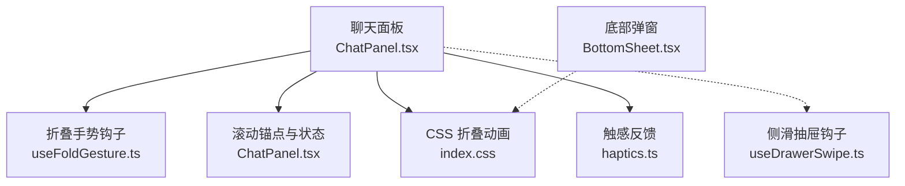
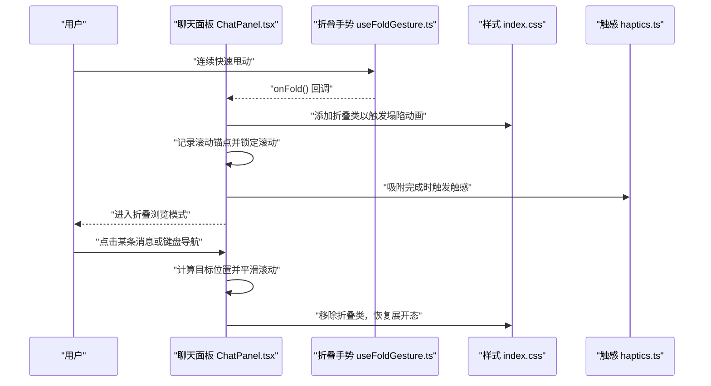
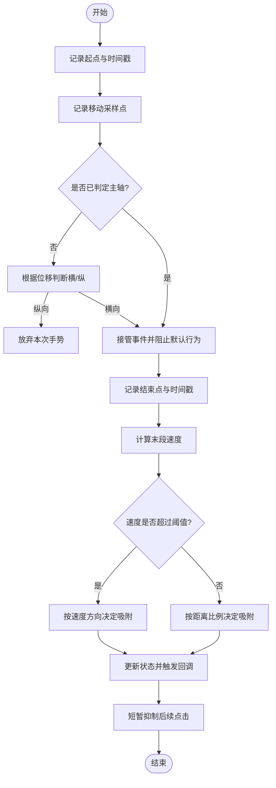
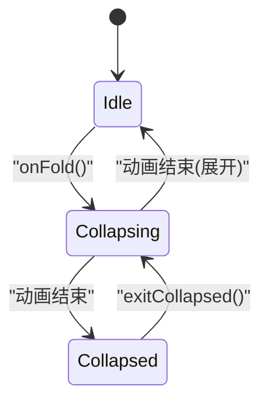
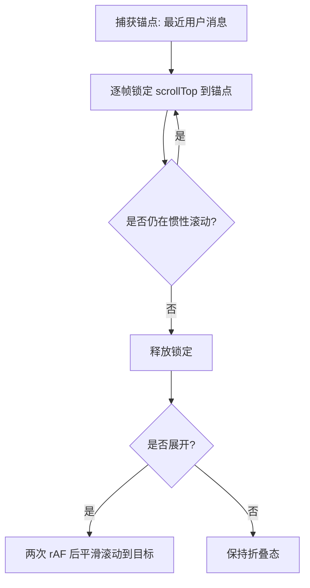
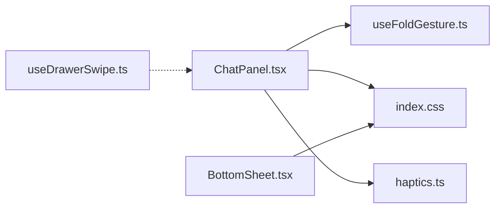

# 折叠浏览模式

<cite>
**本文引用的文件**
- [ChatPanel.tsx](file://src/components/chat/ChatPanel.tsx)
- [useFoldGesture.ts](file://src/hooks/useFoldGesture.ts)
- [useDrawerSwipe.ts](file://src/hooks/useDrawerSwipe.ts)
- [BottomSheet.tsx](file://src/components/common/BottomSheet.tsx)
- [index.css](file://src/index.css)
- [haptics.ts](file://src/utils/haptics.ts)
</cite>

## 目录
1. [简介](#简介)
2. [项目结构](#项目结构)
3. [核心组件](#核心组件)
4. [架构总览](#架构总览)
5. [详细组件分析](#详细组件分析)
6. [依赖关系分析](#依赖关系分析)
7. [性能考量](#性能考量)
8. [故障排查指南](#故障排查指南)
9. [结论](#结论)
10. [附录：手势配置与扩展](#附录手势配置与扩展)

## 简介
本技术文档围绕 AIShop 项目的“折叠浏览模式”展开，系统梳理从手势识别、状态管理、动画协调到滚动锚点与视口定位的完整实现。重点包括：
- 连续甩动手势检测与吸附判定（速度优先、距离兜底）
- 折叠/展开状态机与动画阶段控制
- 滚动位置锁定与惯性滚动处理
- 折叠后的交互逻辑（点击展开、键盘导航、平滑滚动）
- CSS 动画与 JavaScript 协调、性能优化策略
- 手势配置的自定义选项与扩展指南

## 项目结构
折叠浏览模式主要涉及以下模块：
- 聊天面板：承载消息列表、折叠状态、滚动锚点与交互入口
- 手势钩子：封装连续甩动检测与折叠触发
- 侧滑抽屉钩子：提供横向滑动吸附能力（可复用至折叠入口区域）
- 底部弹窗：演示拖拽关闭与过渡动画
- 全局样式：定义折叠动画、提示动画与高亮闪烁等
- 触感反馈：在关键吸附/切换时提供触觉提示

图表来源
- [ChatPanel.tsx:73-205](file://src/components/chat/ChatPanel.tsx#L73-L205)
- [useFoldGesture.ts:1-218](file://src/hooks/useFoldGesture.ts#L1-L218)
- [index.css:177-249](file://src/index.css#L177-L249)
- [haptics.ts:1-31](file://src/utils/haptics.ts#L1-L31)

章节来源
- [ChatPanel.tsx:73-205](file://src/components/chat/ChatPanel.tsx#L73-L205)
- [index.css:177-249](file://src/index.css#L177-L249)

## 核心组件
- 聊天面板（ChatPanel.tsx）
  - 维护折叠状态 isCollapsed、折叠阶段 foldPhase
  - 计算并锁定滚动锚点，处理折叠/展开时的滚动落位与平滑滚动
  - 集成连续甩动手势触发折叠，并在吸附完成时调用触感反馈
- 折叠手势钩子（useFoldGesture.ts）
  - 基于触摸采样计算末段速度，采用速度优先、距离兜底的吸附策略
  - 支持方向锁、忽略目标区域判断、防误触与点击抑制
- 侧滑抽屉钩子（useDrawerSwipe.ts）
  - 提供通用横向滑动吸附能力，可作为折叠入口区域的扩展基础
- 底部弹窗（BottomSheet.tsx）
  - 展示拖拽关闭、过渡动画与 ESC 关闭等交互，体现手势与动画协调范式
- 全局样式（index.css）
  - 定义折叠塌陷动画、折叠态提示动画、消息定位高亮闪烁等
- 触感反馈（haptics.ts）
  - 在吸附/切换时提供轻量触感，增强操作确认感

章节来源
- [ChatPanel.tsx:73-205](file://src/components/chat/ChatPanel.tsx#L73-L205)
- [useFoldGesture.ts:1-218](file://src/hooks/useFoldGesture.ts#L1-L218)
- [useDrawerSwipe.ts:1-218](file://src/hooks/useDrawerSwipe.ts#L1-L218)
- [BottomSheet.tsx:1-177](file://src/components/common/BottomSheet.tsx#L1-L177)
- [index.css:177-249](file://src/index.css#L177-L249)
- [haptics.ts:1-31](file://src/utils/haptics.ts#L1-L31)

## 架构总览
折叠浏览模式的总体流程如下：
- 用户在聊天区域进行连续快速甩动
- 手势钩子检测到有效甩动后回调折叠入口
- 聊天面板播放塌陷动画，随后切换到折叠态 DOM
- 通过滚动锚点锁定当前视口位置，避免惯性滚动导致的空白屏
- 折叠态下支持点击展开、键盘导航与平滑滚动回到目标消息

图表来源
- [ChatPanel.tsx:200-343](file://src/components/chat/ChatPanel.tsx#L200-L343)
- [useFoldGesture.ts:107-192](file://src/hooks/useFoldGesture.ts#L107-L192)
- [index.css:177-249](file://src/index.css#L177-L249)
- [haptics.ts:1-31](file://src/utils/haptics.ts#L1-L31)

## 详细组件分析

### 折叠手势识别与吸附
- 连续甩动检测
  - 使用触摸采样窗口计算末段速度，超过阈值即视为甩动
  - 方向锁确保仅在水平方向接管，避免与纵向滚动冲突
  - 忽略目标区域判断防止输入框、可编辑区与横向滚动元素抢走手势
- 吸附判定
  - 速度优先：当末段速度超过阈值，直接按方向决定打开/关闭
  - 距离兜底：低速情况下依据当前位移比例决定是否吸附
- 点击抑制
  - 手势结束后短暂屏蔽 click，避免遮罩或相邻控件误触发

图表来源
- [useFoldGesture.ts:107-192](file://src/hooks/useFoldGesture.ts#L107-L192)

章节来源
- [useFoldGesture.ts:107-192](file://src/hooks/useFoldGesture.ts#L107-L192)

### 折叠状态管理与动画阶段
- 状态机
  - idle：空闲态，允许手势触发折叠
  - collapsing：正在播放塌陷动画，尚未替换为折叠态 DOM
  - collapsed：已进入折叠浏览模式，仅显示摘要行
- 动画阶段控制
  - 先添加折叠类触发 CSS 塌陷动画
  - 动画结束后切换 DOM 为折叠态，保持滚动锚点不变
  - 退出折叠时先在原地落位，再平滑滚动到目标消息

图表来源
- [ChatPanel.tsx:73-95](file://src/components/chat/ChatPanel.tsx#L73-L95)
- [ChatPanel.tsx:276-297](file://src/components/chat/ChatPanel.tsx#L276-L297)

章节来源
- [ChatPanel.tsx:73-95](file://src/components/chat/ChatPanel.tsx#L73-L95)
- [ChatPanel.tsx:276-297](file://src/components/chat/ChatPanel.tsx#L276-L297)

### 滚动锚点计算与视口定位
- 锚点选择
  - 选择离视口顶部最近的用户消息作为锚点，因其高度在折叠前后稳定
- 锚点锁定
  - 在惯性滚动期间逐帧将 scrollTop 钉回锚点计算值，避免空白屏
- 平滑滚动
  - 展开时先原地落位，再二次 rAF 后平滑滚动到目标消息，确保可见过程

图表来源
- [ChatPanel.tsx:212-228](file://src/components/chat/ChatPanel.tsx#L212-L228)
- [ChatPanel.tsx:235-249](file://src/components/chat/ChatPanel.tsx#L235-L249)
- [ChatPanel.tsx:311-343](file://src/components/chat/ChatPanel.tsx#L311-L343)

章节来源
- [ChatPanel.tsx:212-228](file://src/components/chat/ChatPanel.tsx#L212-L228)
- [ChatPanel.tsx:235-249](file://src/components/chat/ChatPanel.tsx#L235-L249)
- [ChatPanel.tsx:311-343](file://src/components/chat/ChatPanel.tsx#L311-L343)

### 折叠后的交互逻辑
- 点击展开
  - 点击折叠态的消息行，记录目标消息 ID，触发展开流程
- 键盘导航
  - 支持 Esc 关闭搜索、Tab 聚焦折叠气泡、Enter 展开等
- 平滑滚动
  - 展开后通过 scrollIntoView({ behavior: 'smooth', block: 'center' }) 定位到目标消息
  - 配合高亮闪烁提升定位感知

章节来源
- [ChatPanel.tsx:102-105](file://src/components/chat/ChatPanel.tsx#L102-L105)
- [ChatPanel.tsx:167-174](file://src/components/chat/ChatPanel.tsx#L167-L174)
- [index.css:251-264](file://src/index.css#L251-L264)

### 折叠动画实现与性能优化
- CSS 动画
  - 塌陷动画：对 AI 回复气泡进行 scaleY 与透明度变化，用户气泡轻微让位
  - 折叠行入场：摘要行从上方淡入并缩放到位
  - 提示动画：折叠提示从上方滑入
  - 高亮闪烁：定位目标消息时背景渐隐提示
- JavaScript 协调
  - 在动画期间禁用过渡，拖动中关闭 CSS transition
  - 使用 requestAnimationFrame 进行两帧落位，确保渲染顺序正确
- 性能优化
  - 避免 onScroll 高频重绘，改用 rAF 节流
  - 长对话中谨慎使用 will-change，避免大量元素提层导致卡顿
  - 触感反馈仅在吸附完成时触发，减少不必要开销

章节来源
- [index.css:177-249](file://src/index.css#L177-L249)
- [ChatPanel.tsx:212-228](file://src/components/chat/ChatPanel.tsx#L212-L228)
- [ChatPanel.tsx:336-343](file://src/components/chat/ChatPanel.tsx#L336-L343)
- [BottomSheet.tsx:86-137](file://src/components/common/BottomSheet.tsx#L86-L137)

## 依赖关系分析
- ChatPanel.tsx 依赖 useFoldGesture.ts 提供手势触发
- ChatPanel.tsx 依赖 index.css 提供的折叠动画类
- ChatPanel.tsx 依赖 haptics.ts 提供触感反馈
- BottomSheet.tsx 演示了手势与动画协调的通用模式
- useDrawerSwipe.ts 提供横向滑动吸附，可复用至折叠入口区域

图表来源
- [ChatPanel.tsx:73-205](file://src/components/chat/ChatPanel.tsx#L73-L205)
- [useFoldGesture.ts:1-218](file://src/hooks/useFoldGesture.ts#L1-L218)
- [index.css:177-249](file://src/index.css#L177-L249)
- [haptics.ts:1-31](file://src/utils/haptics.ts#L1-L31)
- [BottomSheet.tsx:1-177](file://src/components/common/BottomSheet.tsx#L1-L177)
- [useDrawerSwipe.ts:1-218](file://src/hooks/useDrawerSwipe.ts#L1-L218)

章节来源
- [ChatPanel.tsx:73-205](file://src/components/chat/ChatPanel.tsx#L73-L205)
- [useFoldGesture.ts:1-218](file://src/hooks/useFoldGesture.ts#L1-L218)
- [index.css:177-249](file://src/index.css#L177-L249)
- [haptics.ts:1-31](file://src/utils/haptics.ts#L1-L31)
- [BottomSheet.tsx:1-177](file://src/components/common/BottomSheet.tsx#L1-L177)
- [useDrawerSwipe.ts:1-218](file://src/hooks/useDrawerSwipe.ts#L1-L218)

## 性能考量
- 避免在 onScroll 中进行昂贵计算，改用 rAF 节流与锚点锁定
- 长对话中谨慎使用 will-change，避免大量元素提升合成层
- 触感反馈仅在关键节点触发，减少不必要的系统调用
- 手势监听使用 passive:false 仅在必要时阻止默认行为，降低滚动冲突

[本节为通用指导，不直接分析具体文件]

## 故障排查指南
- 手势误触发
  - 检查 shouldIgnoreTarget 是否正确排除输入框与横向滚动区域
  - 确认方向锁与有效方向判断是否生效
- 滚动空白屏
  - 确认锚点捕获与锁定逻辑是否在折叠/展开时正确执行
  - 检查惯性滚动期间是否持续调用 pinScroll
- 动画卡顿
  - 避免在折叠过程中启用过多 will-change
  - 确保拖动中关闭 CSS transition，松开后再恢复
- 触感无响应
  - 确认在用户手势栈内调用 haptic
  - iOS 平台需确保隐藏 switch 存在且未被遮挡

章节来源
- [useFoldGesture.ts:44-67](file://src/hooks/useFoldGesture.ts#L44-L67)
- [ChatPanel.tsx:212-228](file://src/components/chat/ChatPanel.tsx#L212-L228)
- [index.css:194-198](file://src/index.css#L194-L198)
- [haptics.ts:1-31](file://src/utils/haptics.ts#L1-L31)

## 结论
折叠浏览模式通过手势识别、状态机与动画协调，实现了流畅的折叠/展开体验。其核心在于：
- 精确的手势检测与吸附策略
- 稳定的滚动锚点与惯性滚动处理
- 合理的动画阶段控制与性能优化
- 完善的交互与无障碍支持

该方案具备良好的可扩展性，可复用于其他需要手势与动画协调的场景。

[本节为总结，不直接分析具体文件]

## 附录：手势配置与扩展
- 折叠手势配置项
  - 速度阈值：调整 FLING_VELOCITY 以改变甩动灵敏度
  - 距离阈值：调整 OPEN_RATIO/CLOSE_RATIO 以改变吸附距离要求
  - 方向锁：调整 AXIS_LOCK_PX 与 HORIZONTAL_BIAS 以改善斜向误判
  - 忽略区域：通过 data-swipe-ignore 属性屏蔽特定浮层或控件
- 扩展建议
  - 复用 useDrawerSwipe.ts 的横向吸附能力，为折叠入口区域提供统一手势
  - 在 BottomSheet.tsx 的基础上扩展更多手势组合（如双指缩放）
  - 结合 haptics.ts 在不同平台提供更丰富的触感反馈

章节来源
- [useFoldGesture.ts:19-32](file://src/hooks/useFoldGesture.ts#L19-L32)
- [useDrawerSwipe.ts:34-42](file://src/hooks/useDrawerSwipe.ts#L34-L42)
- [BottomSheet.tsx:67-137](file://src/components/common/BottomSheet.tsx#L67-L137)
- [haptics.ts:1-31](file://src/utils/haptics.ts#L1-L31)