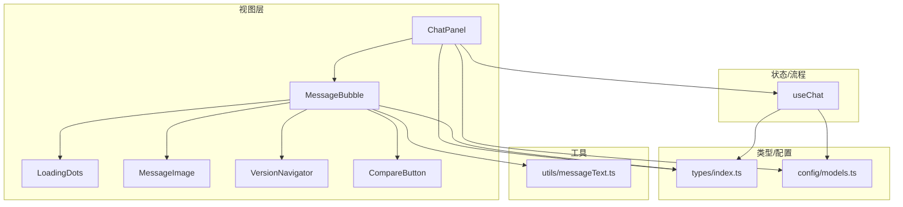
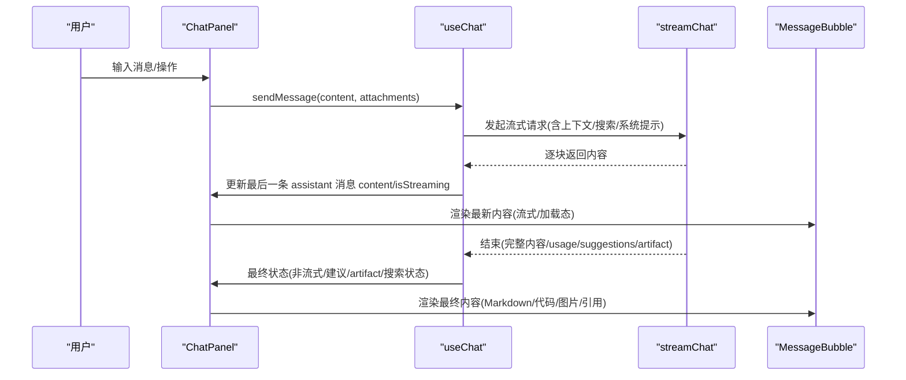
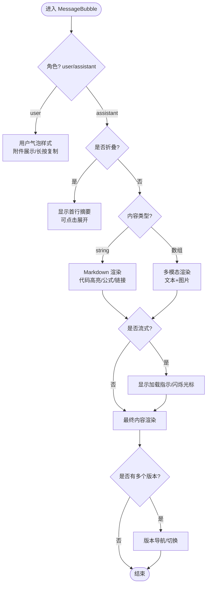
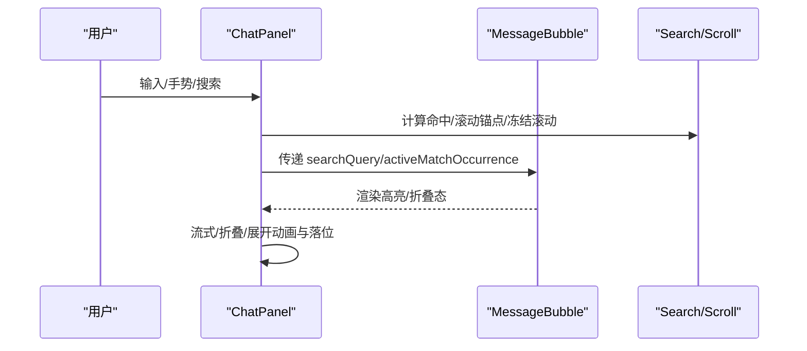
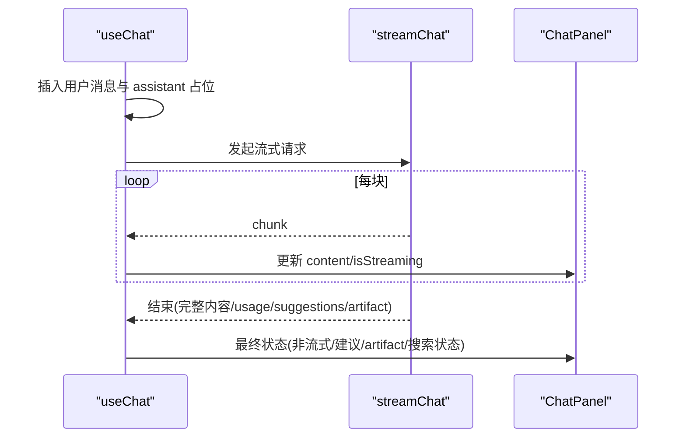
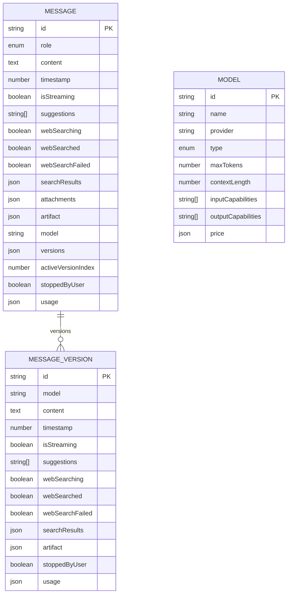
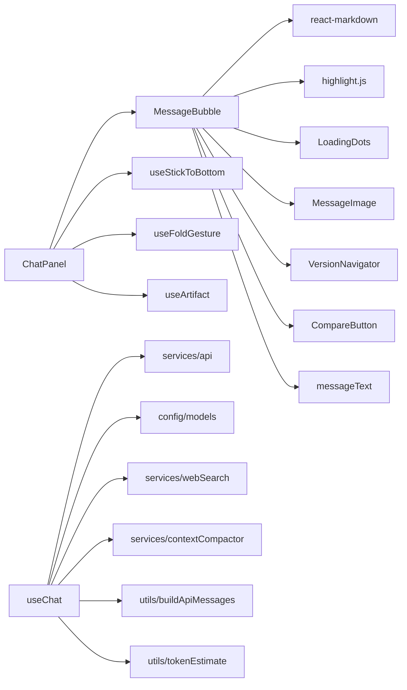

# 消息渲染系统

<cite>
**本文引用的文件**
- [MessageBubble.tsx](file://src/components/chat/MessageBubble.tsx)
- [ChatPanel.tsx](file://src/components/chat/ChatPanel.tsx)
- [useChat.ts](file://src/hooks/useChat.ts)
- [index.ts（类型定义）](file://src/types/index.ts)
- [models.ts（模型配置）](file://src/config/models.ts)
- [LoadingDots.tsx](file://src/components/chat/LoadingDots.tsx)
- [MessageImage.tsx](file://src/components/chat/MessageImage.tsx)
- [VersionNavigator.tsx](file://src/components/chat/VersionNavigator.tsx)
- [CompareButton.tsx](file://src/components/chat/CompareButton.tsx)
- [messageText.ts](file://src/utils/messageText.ts)
</cite>

## 目录
1. [简介](#简介)
2. [项目结构](#项目结构)
3. [核心组件与职责](#核心组件与职责)
4. [架构总览](#架构总览)
5. [详细组件分析](#详细组件分析)
6. [依赖关系分析](#依赖关系分析)
7. [性能考量](#性能考量)
8. [故障排查指南](#故障排查指南)
9. [结论](#结论)
10. [附录：扩展指南](#附录：扩展指南)

## 简介
本技术文档聚焦 AIShop 项目的消息渲染系统，围绕 MessageBubble 组件展开，系统性说明以下能力：
- 消息类型识别：用户消息、AI 回复的差异化渲染
- Markdown 渲染：支持 GFM、数学公式、代码高亮、链接处理
- 图片显示：多模态内容中的图片渲染与占位/失败态
- 消息状态管理：流式响应显示、加载状态、错误状态、联网搜索状态
- 版本控制机制：同一消息的多版本展示、切换与比较
- 交互功能：引用消息、重新生成、模型对比、折叠浏览、对话内搜索
- 性能优化：滚动定位、动画与布局稳定、内存与渲染优化策略
- 扩展指南：如何新增消息类型与渲染逻辑

## 项目结构
消息渲染系统由“数据层（types + hooks）— 视图层（components）— 工具层（utils）”构成。关键文件组织如下：
- 类型与配置：Message、MessageVersion、Model 等数据结构；模型列表与分组
- 状态与流程：useChat 负责发送消息、流式更新、压缩上下文、联网搜索、错误处理
- 视图组件：
  - ChatPanel：消息列表容器、折叠模式、滚动定位、搜索 UI、Artifact 面板集成
  - MessageBubble：单条消息气泡，承载 Markdown、代码块、图片、版本导航、长按菜单、搜索高亮
  - LoadingDots：流式加载指示器
  - MessageImage：消息内图片渲染封装
  - VersionNavigator：多版本切换导航
  - CompareButton：模型对比入口与弹出菜单
- 工具函数：纯文本提取、首行摘要等

图表来源
- [ChatPanel.tsx:497-558](file://src/components/chat/ChatPanel.tsx#L497-L558)
- [MessageBubble.tsx:303-327](file://src/components/chat/MessageBubble.tsx#L303-L327)
- [useChat.ts:494-783](file://src/hooks/useChat.ts#L494-L783)
- [index.ts:84-107](file://src/types/index.ts#L84-L107)
- [models.ts:3-235](file://src/config/models.ts#L3-L235)

章节来源
- [ChatPanel.tsx:497-558](file://src/components/chat/ChatPanel.tsx#L497-L558)
- [MessageBubble.tsx:303-327](file://src/components/chat/MessageBubble.tsx#L303-L327)
- [useChat.ts:494-783](file://src/hooks/useChat.ts#L494-L783)
- [index.ts:84-107](file://src/types/index.ts#L84-L107)
- [models.ts:3-235](file://src/config/models.ts#L3-L235)

## 核心组件与职责
- MessageBubble：单条消息渲染的核心，负责：
  - 区分用户/AI 消息并应用不同样式与交互
  - Markdown 渲染（GFM、数学公式）、代码块高亮与复制
  - 多模态内容（文本+图片）渲染
  - 流式输出时的加载指示与闪烁光标
  - 联网搜索结果的引用标记与跳转
  - 折叠浏览模式（仅显示首行摘要）
  - 长按上下文菜单（复制、查找、折叠等）
  - 版本导航与模型对比入口
- ChatPanel：消息列表容器，负责：
  - 消息列表渲染与滚动定位（吸底、回到底部）
  - 折叠/展开手势与动画、锚点保持
  - 对话内搜索（关键词匹配、高亮、跳转）
  - Artifact 面板联动（流式预览与完成态）
  - 上下文压缩区间标记与摘要面板
- useChat：消息生命周期与状态管理，负责：
  - 发送消息、构建 API 请求、流式接收与增量更新
  - 联网搜索判断与结果注入
  - 错误与取消处理（AbortError）
  - 建议项解析、Artifact 流式检测与清理
  - 上下文压缩与水位控制（触发时机与影响）

章节来源
- [MessageBubble.tsx:303-327](file://src/components/chat/MessageBubble.tsx#L303-L327)
- [ChatPanel.tsx:497-558](file://src/components/chat/ChatPanel.tsx#L497-L558)
- [useChat.ts:494-783](file://src/hooks/useChat.ts#L494-L783)

## 架构总览
消息渲染系统的整体数据流与控制流如下：

图表来源
- [useChat.ts:682-740](file://src/hooks/useChat.ts#L682-L740)
- [ChatPanel.tsx:497-558](file://src/components/chat/ChatPanel.tsx#L497-L558)
- [MessageBubble.tsx:538-644](file://src/components/chat/MessageBubble.tsx#L538-L644)

章节来源
- [useChat.ts:682-740](file://src/hooks/useChat.ts#L682-L740)
- [ChatPanel.tsx:497-558](file://src/components/chat/ChatPanel.tsx#L497-L558)
- [MessageBubble.tsx:538-644](file://src/components/chat/MessageBubble.tsx#L538-L644)

## 详细组件分析

### MessageBubble 组件分析
MessageBubble 是消息渲染的核心，承担多种渲染分支与交互逻辑。

- 消息类型识别
  - 通过 message.role 判断用户/AI 消息，分别渲染不同气泡样式与行为
  - AI 消息在空内容且流式时显示加载指示（LoadingDots），否则显示 Markdown 内容
- Markdown 渲染
  - 使用 ReactMarkdown + remark-gfm + remark-math + rehype-katex 实现富文本、表格、数学公式
  - 自定义 code/pre 节点以接入 highlight.js 进行语法高亮，并提供复制按钮
  - 链接统一在新窗口打开，避免页面跳转
- 代码高亮与复制
  - CodeBlock 子组件根据语言标识或自动检测进行高亮，提供一键复制与成功/失败反馈
- 图片显示
  - 多模态内容中 type=image_url 的图片通过 MessageImage 渲染，包含占位与不可用态
- 联网搜索与引用
  - 将搜索结果注入为 [N] 引用标记，并在 Markdown 中渲染为可点击的来源按钮
  - 支持搜索高亮：对纯文本与 Markdown 渲染后的 DOM 进行 TreeWalker 遍历包裹 <mark>
- 折叠浏览模式
  - collapsed=true 且非流式时，仅显示第一行摘要，减少长回复占用空间
- 长按上下文菜单
  - 支持复制、查找、折叠等操作；菜单位置自适应视口，避免溢出
- 版本控制与模型对比
  - 当存在 versions 时，通过 VersionNavigator 切换当前版本，读取 activeVersionIndex
  - 提供 CompareButton 用于选择其他模型进行比较，生成新版本并存入 versions

图表来源
- [MessageBubble.tsx:327-507](file://src/components/chat/MessageBubble.tsx#L327-L507)
- [MessageBubble.tsx:538-644](file://src/components/chat/MessageBubble.tsx#L538-L644)
- [MessageBubble.tsx:731-751](file://src/components/chat/MessageBubble.tsx#L731-L751)
- [MessageBubble.tsx:794-800](file://src/components/chat/MessageBubble.tsx#L794-L800)

章节来源
- [MessageBubble.tsx:327-507](file://src/components/chat/MessageBubble.tsx#L327-L507)
- [MessageBubble.tsx:538-644](file://src/components/chat/MessageBubble.tsx#L538-L644)
- [MessageBubble.tsx:731-751](file://src/components/chat/MessageBubble.tsx#L731-L751)
- [MessageBubble.tsx:794-800](file://src/components/chat/MessageBubble.tsx#L794-L800)

### ChatPanel 组件分析
ChatPanel 作为消息列表容器，负责：
- 消息列表渲染与滚动定位（吸底、回到底部、折叠后平滑滚动）
- 对话内搜索：计算命中位置、高亮、跳转到对应片段
- 折叠/展开手势：捕获锚点消息、冻结滚动、动画过渡、落位恢复
- Artifact 面板联动：流式开始/更新/完成，自动预览信号
- 上下文压缩区间标记与摘要面板

图表来源
- [ChatPanel.tsx:113-176](file://src/components/chat/ChatPanel.tsx#L113-L176)
- [ChatPanel.tsx:230-353](file://src/components/chat/ChatPanel.tsx#L230-L353)
- [ChatPanel.tsx:497-558](file://src/components/chat/ChatPanel.tsx#L497-L558)

章节来源
- [ChatPanel.tsx:113-176](file://src/components/chat/ChatPanel.tsx#L113-L176)
- [ChatPanel.tsx:230-353](file://src/components/chat/ChatPanel.tsx#L230-L353)
- [ChatPanel.tsx:497-558](file://src/components/chat/ChatPanel.tsx#L497-L558)

### useChat 状态管理与流程
- 发送消息：插入用户消息与占位的 assistant 消息，设置 isStreaming
- 流式更新：逐块拼接内容，调用 getDisplayContent 隐藏中间标记，更新消息 content
- 联网搜索：根据问题判断是否需要搜索，立即显示“正在搜索”，完成后更新 webSearched/searchResults/webSearchFailed
- 结束处理：去除 artifact 标记、清理反引号、解析 suggestions、记录 usage
- 错误与取消：AbortError 时标记 stoppedByUser，其他错误写入提示内容

图表来源
- [useChat.ts:539-560](file://src/hooks/useChat.ts#L539-L560)
- [useChat.ts:682-740](file://src/hooks/useChat.ts#L682-L740)
- [useChat.ts:741-780](file://src/hooks/useChat.ts#L741-L780)

章节来源
- [useChat.ts:539-560](file://src/hooks/useChat.ts#L539-L560)
- [useChat.ts:682-740](file://src/hooks/useChat.ts#L682-L740)
- [useChat.ts:741-780](file://src/hooks/useChat.ts#L741-L780)

### 类型与数据模型
- Message：消息主体，包含 role、content、timestamp、isStreaming、suggestions、webSearching/webSearched/webSearchFailed、searchResults、attachments、artifact、model、versions、activeVersionIndex、stoppedByUser、usage 等
- MessageVersion：消息版本，包含 model、content、timestamp、isStreaming、suggestions、webSearching/webSearched/webSearchFailed、searchResults、artifact、stoppedByUser、usage
- Model：模型元信息，provider、type、capabilities、price 等

图表来源
- [index.ts:67-107](file://src/types/index.ts#L67-L107)
- [index.ts:109-123](file://src/types/index.ts#L109-L123)

章节来源
- [index.ts:67-107](file://src/types/index.ts#L67-L107)
- [index.ts:109-123](file://src/types/index.ts#L109-L123)

## 依赖关系分析
- MessageBubble 依赖：
  - react-markdown、remark-gfm、remark-math、rehype-katex：Markdown 与公式渲染
  - highlight.js：代码高亮
  - LoadingDots：加载指示
  - MessageImage：图片渲染
  - VersionNavigator：版本导航
  - CompareButton：模型对比
  - utils/messageText：纯文本提取与首行摘要
- ChatPanel 依赖：
  - useStickToBottom：滚动定位
  - useFoldGesture：折叠手势
  - useArtifact：Artifact 面板状态
  - MessageBubble：消息渲染
  - ContextSummarySheet：上下文摘要面板
- useChat 依赖：
  - services/api：流式请求
  - config/models：模型配置
  - services/webSearch：联网搜索
  - services/contextCompactor：上下文压缩
  - utils/buildApiMessages：构建 API 消息体
  - utils/tokenEstimate：token 估算与用量统计

图表来源
- [MessageBubble.tsx:1-19](file://src/components/chat/MessageBubble.tsx#L1-L19)
- [ChatPanel.tsx:1-16](file://src/components/chat/ChatPanel.tsx#L1-L16)
- [useChat.ts:1-42](file://src/hooks/useChat.ts#L1-L42)

章节来源
- [MessageBubble.tsx:1-19](file://src/components/chat/MessageBubble.tsx#L1-L19)
- [ChatPanel.tsx:1-16](file://src/components/chat/ChatPanel.tsx#L1-L16)
- [useChat.ts:1-42](file://src/hooks/useChat.ts#L1-L42)

## 性能考量
- 流式渲染与状态更新
  - 使用增量更新 content 与 isStreaming，避免整段重绘；getDisplayContent 隐藏中间标记，提升用户体验
- 滚动与布局稳定性
  - 折叠/展开时使用锚点消息与 rAF 锁定 scrollTop，避免惯性滚动导致的空白与跳变
  - 使用 useLayoutEffect 在绘制前落位，避免闪烁
- 搜索高亮
  - 对 Markdown 渲染后的 DOM 使用 TreeWalker 遍历文本节点，跳过 code/pre 内部，避免破坏代码高亮结构
- 图片与内存
  - MessageImage 使用 BlobImage 封装，提供占位与失败态，避免大图阻塞与内存泄漏
- 上下文压缩
  - 接近上限时自动压缩历史，减少 token 消耗与渲染压力；压缩区间末尾追加标记与摘要面板

[本节为通用性能讨论，不直接分析具体文件]

## 故障排查指南
- 流式中断与错误
  - AbortError：用户取消生成，消息标记 stoppedByUser，保留已有内容
  - 其他错误：写入提示内容，停止流式状态
- 联网搜索失败
  - webSearchFailed=true，显示失败状态；无结果时同样标记失败
- 图片不可用
  - MessageImage 提供 fallback 提示“图片已不可用”，避免空白占位
- 折叠模式异常
  - 检查锚点消息是否存在、滚动锁定是否正确释放、动画时长与 CSS 类名是否一致

章节来源
- [useChat.ts:741-780](file://src/hooks/useChat.ts#L741-L780)
- [MessageImage.tsx:15-36](file://src/components/chat/MessageImage.tsx#L15-L36)
- [ChatPanel.tsx:230-353](file://src/components/chat/ChatPanel.tsx#L230-L353)

## 结论
AIShop 的消息渲染系统以 MessageBubble 为核心，结合 ChatPanel 的列表管理与 useChat 的状态流程，实现了完整的消息渲染、流式更新、版本控制、模型对比、联网搜索、折叠浏览与对话内搜索等功能。系统在性能与用户体验方面做了大量优化，包括滚动定位、动画稳定、搜索高亮与内存管理。未来可通过扩展 MessageBubble 的渲染分支与 useChat 的流程，进一步丰富消息类型与交互能力。

[本节为总结性内容，不直接分析具体文件]

## 附录：扩展指南
- 添加新的消息类型
  - 在 types/index.ts 中扩展 MessageContent 或新增类型接口
  - 在 MessageBubble 的 renderContent 中增加分支处理新类型的渲染逻辑
  - 如需特殊交互（如图片编辑、视频播放），引入相应组件并复用现有模式
- 扩展 Markdown 渲染
  - 在 ReactMarkdown 的 components 中添加自定义节点处理（如自定义表格、嵌入组件）
  - 注意避免破坏代码高亮的 dangerouslySetInnerHTML 结构
- 扩展版本控制
  - 在 MessageVersion 中扩展字段（如 usage、artifact 等）
  - 在 MessageBubble 中读取 activeVersion 并渲染对应内容
  - 在 CompareButton 中调整推荐逻辑与分组显示
- 扩展联网搜索
  - 在 useChat 中增强 judgeSearchNeed 的判断规则
  - 在 MessageBubble 中扩展引用标记的样式与交互（如更多来源信息）
- 扩展折叠浏览
  - 在 ChatPanel 中调整折叠手势阈值与动画时长
  - 在 MessageBubble 中定制折叠态的摘要展示逻辑（如智能摘要）

[本节为概念性指导，不直接分析具体文件]