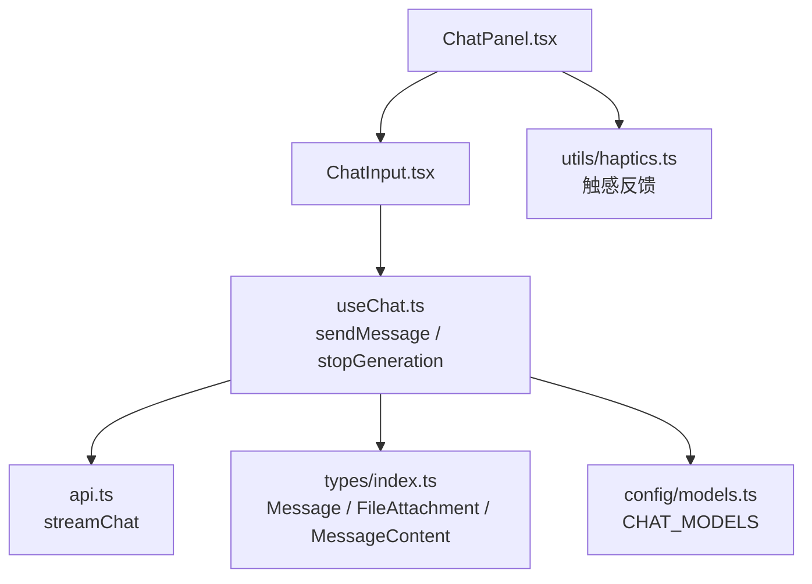
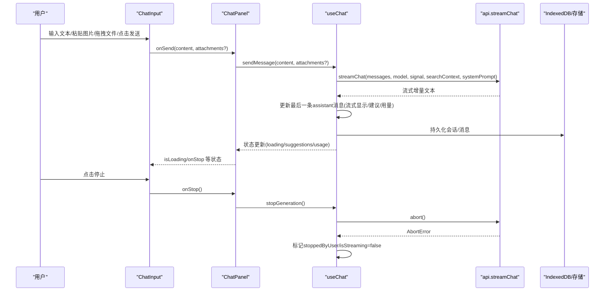
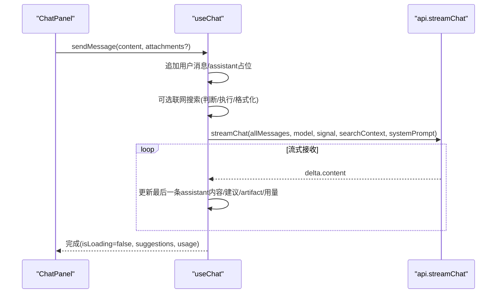
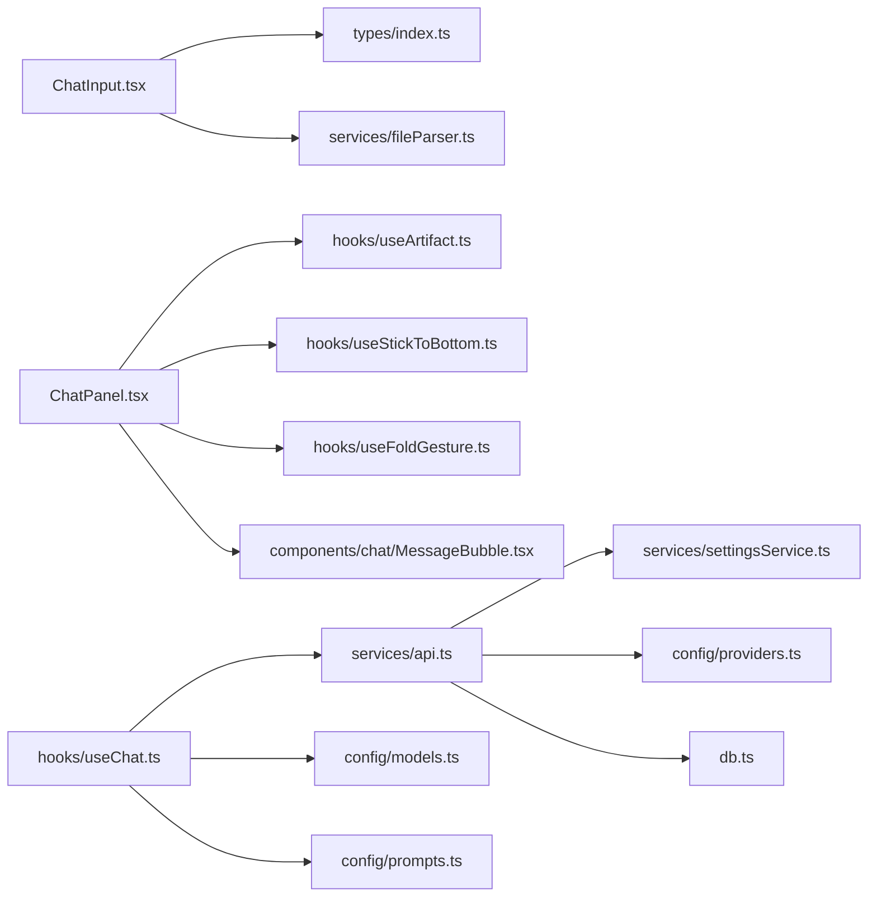

```mermaid
flowchart TD
Start(["进入 ChatInput"]) --> Init["初始化状态<br/>text/images/files/focus"]
Init --> Input{"用户输入?"}
Input --> |文本| TextChange["handleTextChange<br/>自动高度"]
Input --> |粘贴图片| PasteImg["handlePaste<br/>base64 追加"]
Input --> |拖拽/选择文件| ProcessFiles["processFiles<br/>图片/解析文件"]
TextChange --> HasContent{"hasContent?"}
PasteImg --> HasContent
ProcessFiles --> HasContent
HasContent --> |是| EnableSend["启用发送按钮"]
HasContent --> |否| DisableSend["禁用发送按钮"]
EnableSend --> SendClick{"点击发送?"}
DisableSend --> End(["等待输入"])
SendClick --> |是| BuildMsg["构建 attachments/引用拼接"]
BuildMsg --> Emit["onSend(content, attachments)"]
Emit --> Reset["清空输入/失焦"]
Reset --> End
```

# 聊天输入组件

<cite>
**本文引用的文件**
- [ChatInput.tsx](file://src/components/chat/ChatInput.tsx)
- [ChatPanel.tsx](file://src/components/chat/ChatPanel.tsx)
- [useChat.ts](file://src/hooks/useChat.ts)
- [api.ts](file://src/services/api.ts)
- [index.ts（类型定义）](file://src/types/index.ts)
- [models.ts](file://src/config/models.ts)
- [haptics.ts](file://src/utils/haptics.ts)
</cite>

## 目录
1. [简介](#简介)
2. [项目结构](#项目结构)
3. [核心组件](#核心组件)
4. [架构总览](#架构总览)
5. [详细组件分析](#详细组件分析)
6. [依赖关系分析](#依赖关系分析)
7. [性能考量](#性能考量)
8. [故障排查指南](#故障排查指南)
9. [结论](#结论)
10. [附录：配置与扩展接口](#附录：配置与扩展接口)

## 简介
本技术文档聚焦 AIShop 项目的“聊天输入组件”（ChatInput），围绕其多模态输入、智能提示词建议、快捷操作按钮、输入状态管理、用户交互逻辑、与父组件通信机制、键盘快捷键、无障碍访问以及移动端适配等维度进行系统化说明。同时给出与发送流程、停止生成、新建会话等关键操作的序列图，帮助读者快速理解并扩展该组件。

## 项目结构
聊天输入组件位于 chat 模块中，作为 ChatPanel 的子组件被渲染；消息发送与流式响应由 useChat 钩子统一管理，并通过 api 服务调用后端模型。类型定义集中在 types/index.ts，模型列表在 config/models.ts，触感反馈在 utils/haptics.ts。

图表来源
- [ChatPanel.tsx:583-595](file://src/components/chat/ChatPanel.tsx#L583-L595)
- [ChatInput.tsx:21-33](file://src/components/chat/ChatInput.tsx#L21-L33)
- [useChat.ts:494-783](file://src/hooks/useChat.ts#L494-L783)
- [api.ts:44-172](file://src/services/api.ts#L44-L172)
- [index.ts:53-107](file://src/types/index.ts#L53-L107)
- [models.ts:3-235](file://src/config/models.ts#L3-L235)
- [haptics.ts:1-59](file://src/utils/haptics.ts#L1-L59)

章节来源
- [ChatPanel.tsx:583-595](file://src/components/chat/ChatPanel.tsx#L583-L595)
- [ChatInput.tsx:21-33](file://src/components/chat/ChatInput.tsx#L21-L33)

## 核心组件
- ChatInput：负责文本输入、图片粘贴/拖拽上传、文件解析与预览、引用消息展示、联网搜索开关、发送/停止按钮、展开/收起态切换、自动高度调整、焦点管理与激活态通知。
- ChatPanel：承载消息列表、搜索、折叠浏览模式、Artifact 面板、上下文摘要面板，并将发送/停止等回调透传给 ChatInput。
- useChat：集中管理会话、消息、流式请求、压缩策略、联网搜索、提示词建议解析、停止生成、错误处理等。
- api：封装流式对话请求、SSE 解析、用量统计、错误重试。
- types：统一消息、附件、内容块、会话、模型等数据结构。
- models：提供可用聊天模型清单及能力描述。
- haptics：跨平台触感反馈工具。

章节来源
- [ChatInput.tsx:1-467](file://src/components/chat/ChatInput.tsx#L1-L467)
- [ChatPanel.tsx:1-623](file://src/components/chat/ChatPanel.tsx#L1-L623)
- [useChat.ts:1-800](file://src/hooks/useChat.ts#L1-L800)
- [api.ts:1-173](file://src/services/api.ts#L1-L173)
- [index.ts:1-252](file://src/types/index.ts#L1-L252)
- [models.ts:1-284](file://src/config/models.ts#L1-L284)
- [haptics.ts:1-59](file://src/utils/haptics.ts#L1-L59)

## 架构总览
ChatInput 通过 props 与父组件 ChatPanel 通信，将用户输入（文本、图片、文件、引用消息）组装为 onSend 回调；ChatPanel 将其转发给 useChat.sendMessage，后者构建系统提示词、可选联网搜索结果、上下文压缩视图，调用 api.streamChat 获取流式输出，并在本地更新消息状态、提示词建议、artifact 等。

图表来源
- [ChatInput.tsx:70-118](file://src/components/chat/ChatInput.tsx#L70-L118)
- [ChatPanel.tsx:583-595](file://src/components/chat/ChatPanel.tsx#L583-L595)
- [useChat.ts:494-783](file://src/hooks/useChat.ts#L494-L783)
- [api.ts:44-172](file://src/services/api.ts#L44-L172)

## 详细组件分析

### ChatInput 组件分析
- 多模态输入支持
  - 文本：textarea 自动高度、占位符、粘贴图片识别与 base64 转换。
  - 图片：支持粘贴、拖拽、选择器上传；限制最大数量与大小；预览与删除。
  - 文件：支持多种格式（txt/md/pdf/csv/json/doc/docx/pptx/ppt/rtf/odt/odp/ods/xlsx/xls），解析为文本内容并附带元数据（名称、大小、是否截断）。
- 智能提示词建议
  - 由 useChat 在消息完成后解析 <<<SUGGESTIONS>>>...<<<END_SUGGESTIONS>>> 或半闭合标记，提取建议数组，供上层展示与一键续写。
- 快捷操作按钮
  - 发送按钮：当存在文本/图片/文件或引用消息时启用；发送后清空输入并失焦。
  - 停止生成：在 loading 状态下显示红色方块按钮，调用父组件 onStop。
  - 联网搜索开关：Globe 图标切换，状态同步至父组件。
  - 附件添加：Plus 按钮触发隐藏 input[type=file]。
- 引用消息
  - 顶部展示引用缩略条，包含原文片段与关闭按钮；发送时将引用内容以引用格式拼接到正文前。
- 输入状态管理
  - 文本、图片、文件、引用消息状态分别维护；hasContent 用于控制发送按钮可用性。
  - 焦点与激活态：isFocused 控制展开态布局；onActiveChange 通知父组件当前输入是否处于激活态，用于隐藏“回到底部”等 UI。
  - 自动高度：根据内容动态调整 textarea 高度，上限固定。
  - 光标位置跟踪：使用 useRef 指向 textarea，发送后主动 blur 关闭键盘。
- 用户体验优化
  - 拖拽上传遮罩提示、文件格式校验、大小限制、总数限制。
  - 移动端：展开态自动聚焦、发送后失焦；结合父组件的滚动与折叠手势提升体验。
  - 无障碍：按钮具备 title 提示；搜索区域使用 aria-label；可聚焦元素具备合理 tabindex。
- 与父组件通信
  - onSend：传递 content（字符串或多媒体内容数组）与 attachments（可选）。
  - isLoading/onStop：受控于父组件，用于切换发送/停止按钮。
  - quotedMessage/onRemoveQuote：引用消息双向绑定。
  - featureSettings/onFeatureSettingsChange：功能开关（如 artifact、自动压缩）透传。
  - webSearchEnabled/onWebSearchEnabledChange：联网搜索开关。
  - onActiveChange：输入框激活态变化通知。

图表来源
- [ChatInput.tsx:34-45](file://src/components/chat/ChatInput.tsx#L34-L45)
- [ChatInput.tsx:70-118](file://src/components/chat/ChatInput.tsx#L70-L118)
- [ChatInput.tsx:120-185](file://src/components/chat/ChatInput.tsx#L120-L185)
- [ChatInput.tsx:187-228](file://src/components/chat/ChatInput.tsx#L187-L228)
- [ChatInput.tsx:230-248](file://src/components/chat/ChatInput.tsx#L230-L248)

章节来源
- [ChatInput.tsx:1-467](file://src/components/chat/ChatInput.tsx#L1-L467)

### ChatPanel 与 useChat 协作
- ChatPanel 将 onSend 包装为 sendMessage(...args)，并在发送时关闭搜索面板；将 isLoading、onStop、quotedMessage、featureSettings、webSearchEnabled 等透传给 ChatInput。
- useChat.sendMessage：
  - 构造用户消息与 assistant 占位消息，追加到会话。
  - 可选联网搜索：基于问题判断是否需要搜索，若需要则调用 searchWeb 并格式化结果注入上下文。
  - 构建系统提示词与上下文压缩视图，调用 api.streamChat 获取流式增量。
  - 实时更新最后一条 assistant 消息内容、建议、artifact、用量等。
  - 异常处理：AbortError 标记 stoppedByUser；其他错误设置错误信息并停止流。
  - 触觉反馈：开始与结束各一次短振动。
- 停止生成：调用 AbortController.abort，立即更新 UI 状态。

图表来源
- [useChat.ts:494-783](file://src/hooks/useChat.ts#L494-L783)
- [api.ts:44-172](file://src/services/api.ts#L44-L172)

章节来源
- [ChatPanel.tsx:583-595](file://src/components/chat/ChatPanel.tsx#L583-L595)
- [useChat.ts:494-783](file://src/hooks/useChat.ts#L494-L783)

### 数据模型与类型
- MessageContent：支持 text 与 image_url 两种内容块，用于多模态消息。
- FileAttachment：记录文件名、大小、文本内容与是否截断，用于向模型附加文件上下文。
- Message：包含角色、内容、时间戳、流式标志、建议、联网搜索状态、附件、artifact、用量等。
- Conversation：会话级元数据与消息列表、压缩区间、摘要等。
- Model：模型能力、价格、上下文长度等。

章节来源
- [index.ts:53-107](file://src/types/index.ts#L53-L107)
- [index.ts:143-175](file://src/types/index.ts#L143-L175)
- [index.ts:109-123](file://src/types/index.ts#L109-L123)

### 用户交互逻辑
- 发送消息：校验 hasContent，构建 attachments，拼接引用内容，调用 onSend；发送后清空输入并失焦。
- 停止生成：点击停止按钮触发父组件 onStop，useChat 中止请求并更新状态。
- 新建会话：由父组件提供 onNewConversation，可在需要时从 ChatInput 触发（当前未直接暴露按钮，但可通过父组件集成）。
- 引用消息：选中某条助手消息后，输入区顶部显示引用条，发送时自动插入引用段落。
- 联网搜索：点击 Globe 图标切换开关，状态同步至父组件；useChat 根据问题判断是否需要搜索并注入上下文。

章节来源
- [ChatInput.tsx:70-118](file://src/components/chat/ChatInput.tsx#L70-L118)
- [ChatInput.tsx:351-400](file://src/components/chat/ChatInput.tsx#L351-L400)
- [useChat.ts:621-676](file://src/hooks/useChat.ts#L621-L676)

### 键盘快捷键与无障碍
- 键盘快捷键：当前 ChatInput 未内置全局快捷键；搜索面板支持 Esc 关闭、Enter 跳转下一个匹配项。
- 无障碍：按钮具备 title；搜索区域使用 aria-label；可聚焦元素具备合理 tabindex；输入框 placeholder 清晰。
- 移动端适配：展开态自动聚焦、发送后失焦；折叠浏览模式与吸底滚动由父组件处理；触感反馈在发送开始与结束时触发。

章节来源
- [ChatPanel.tsx:166-174](file://src/components/chat/ChatPanel.tsx#L166-L174)
- [ChatPanel.tsx:562-578](file://src/components/chat/ChatPanel.tsx#L562-L578)
- [useChat.ts:564-569](file://src/hooks/useChat.ts#L564-L569)
- [useChat.ts:713-718](file://src/hooks/useChat.ts#L713-L718)
- [haptics.ts:1-59](file://src/utils/haptics.ts#L1-L59)

### 与父组件的通信机制
- 事件传递：onSend、onStop、onNewConversation、onRemoveQuote、onFeatureSettingsChange、onWebSearchEnabledChange、onActiveChange。
- 状态同步：isLoading、quotedMessage、featureSettings、webSearchEnabled 等通过 props 双向同步。
- 父组件职责：ChatPanel 负责消息列表、搜索、折叠、Artifact、上下文摘要等；ChatInput 专注输入与附件管理。

章节来源
- [ChatInput.tsx:6-19](file://src/components/chat/ChatInput.tsx#L6-L19)
- [ChatPanel.tsx:18-47](file://src/components/chat/ChatPanel.tsx#L18-L47)
- [ChatPanel.tsx:583-595](file://src/components/chat/ChatPanel.tsx#L583-L595)

## 依赖关系分析
- ChatInput 依赖 types 中的 MessageContent、FileAttachment、Message、ChatFeatureSettings；依赖 services/fileParser（在当前仓库结构中未找到具体实现，但组件内已引入并使用 parseFile）。
- ChatPanel 依赖 useArtifact、useStickToBottom、useFoldGesture、MessageBubble、CompactionMarker、ContextSummarySheet 等。
- useChat 依赖 api.streamChat、config/prompts、services/storage、services/conversationStore、db、titleGenerator、webSearch、settingsService、contextCompactor、buildApiMessages、compactPlan、tokenEstimate、contextSummary、conversationView 等。
- api 依赖 settingsService、config/providers、db.inlineBlobsForApi。

图表来源
- [ChatInput.tsx:1-5](file://src/components/chat/ChatInput.tsx#L1-L5)
- [ChatPanel.tsx:1-16](file://src/components/chat/ChatPanel.tsx#L1-L16)
- [useChat.ts:1-42](file://src/hooks/useChat.ts#L1-L42)
- [api.ts:1-6](file://src/services/api.ts#L1-L6)

章节来源
- [ChatInput.tsx:1-5](file://src/components/chat/ChatInput.tsx#L1-L5)
- [ChatPanel.tsx:1-16](file://src/components/chat/ChatPanel.tsx#L1-L16)
- [useChat.ts:1-42](file://src/hooks/useChat.ts#L1-L42)
- [api.ts:1-6](file://src/services/api.ts#L1-L6)

## 性能考量
- 流式渲染：useChat 逐字更新最后一条 assistant 消息，避免整段重绘；对 artifact 与 suggestions 的解析在流结束后进行，减少中间状态开销。
- 上下文压缩：在接近上下文上限时自动压缩历史，降低 token 消耗与延迟；压缩失败不阻塞发送。
- 图片与文件：图片转为 base64 仅用于预览与发送；大文件解析异步进行，失败时提示用户。
- 持久化：使用 diff 写入 IndexedDB，避免频繁全量落盘导致卡顿；页面隐藏时强制 flushPendingWrites。
- 移动端：发送前后触发触感反馈，增强交互感知；展开态自动聚焦与发送后失焦改善输入体验。

[本节为通用性能讨论，不直接分析具体文件]

## 故障排查指南
- 无法发送：检查 hasContent（文本/图片/文件/引用）是否为真；确认 isLoading 为 false；检查 onSend 是否正确透传。
- 图片粘贴无效：确认浏览器剪贴板包含 image/* 类型；检查 FileReader 是否成功读取 base64。
- 文件解析失败：检查文件格式是否在允许列表；确认 parseFile 实现可用；查看 alert 提示信息。
- 停止生成无效：确认 AbortController.signal 正确传入 streamChat；检查 useChat.stopGeneration 是否被调用。
- 联网搜索无结果：检查 webSearchEnabled 开关；确认 judgeSearchNeed 判断逻辑；查看 searchWeb 返回与错误处理。
- 流式输出异常：检查 api.streamChat 的 SSE 解析；确认 include_usage 参数兼容性；查看错误重试逻辑。

章节来源
- [ChatInput.tsx:70-118](file://src/components/chat/ChatInput.tsx#L70-L118)
- [ChatInput.tsx:128-185](file://src/components/chat/ChatInput.tsx#L128-L185)
- [useChat.ts:741-780](file://src/hooks/useChat.ts#L741-L780)
- [api.ts:102-118](file://src/services/api.ts#L102-L118)

## 结论
ChatInput 作为 AIShop 的聊天输入入口，提供了完善的文本、图片、文件多模态输入能力，结合 useChat 的流式响应、上下文压缩、联网搜索与提示词建议，形成高效且友好的对话体验。通过清晰的 props 接口与状态管理，组件具备良好的可复用性与可扩展性。建议在后续迭代中补充全局快捷键、更丰富的无障碍属性与更细粒度的错误提示，以提升整体用户体验。

[本节为总结性内容，不直接分析具体文件]

## 附录：配置与扩展接口
- ChatInput Props
  - onSend：发送回调，接收 content（字符串或多媒体内容数组）与可选 attachments。
  - isLoading：加载状态，控制发送/停止按钮显示。
  - onStop：停止生成回调。
  - onNewConversation：新建会话回调（可由父组件集成）。
  - quotedMessage/onRemoveQuote：引用消息双向绑定。
  - featureSettings/onFeatureSettingsChange：功能开关（artifact、自动压缩）。
  - webSearchEnabled/onWebSearchEnabledChange：联网搜索开关。
  - onActiveChange：输入框激活态变化通知。
- 扩展点
  - 自定义文件解析：替换 services/fileParser.parseFile 实现以支持更多格式。
  - 自定义提示词建议：修改 useChat 中的 parseSuggestions 与 getDisplayContent 逻辑。
  - 自定义联网搜索：替换 services/webSearch.searchWeb 与 judgeSearchNeed。
  - 自定义模型配置：在 config/models.ts 中添加新模型与能力。
  - 自定义触感反馈：在 utils/haptics.ts 中扩展平台兼容逻辑。

章节来源
- [ChatInput.tsx:6-19](file://src/components/chat/ChatInput.tsx#L6-L19)
- [useChat.ts:93-150](file://src/hooks/useChat.ts#L93-L150)
- [models.ts:3-235](file://src/config/models.ts#L3-L235)
- [haptics.ts:1-59](file://src/utils/haptics.ts#L1-L59)