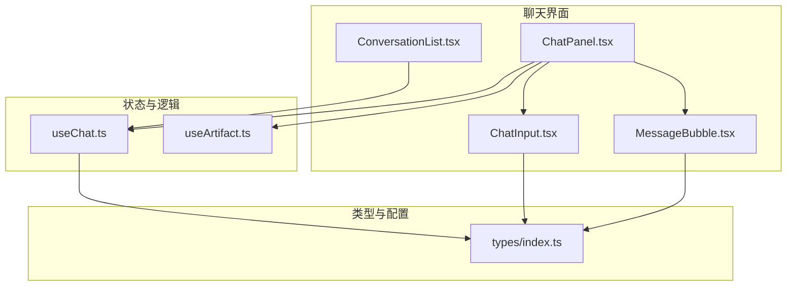
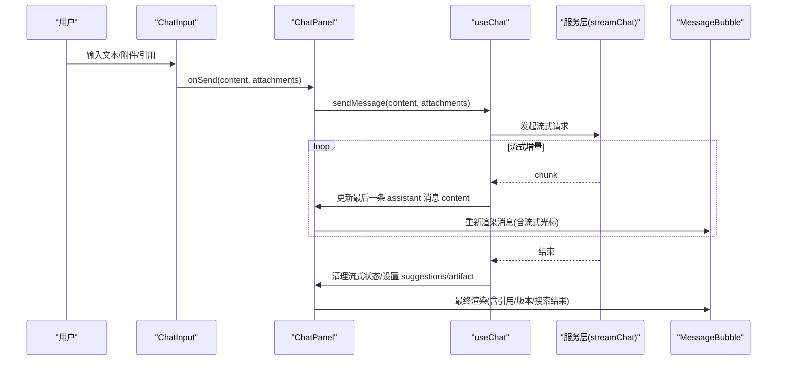
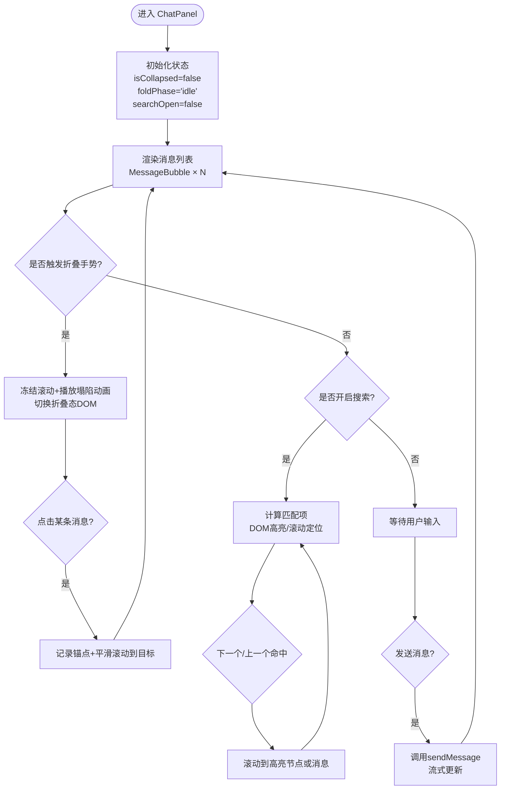
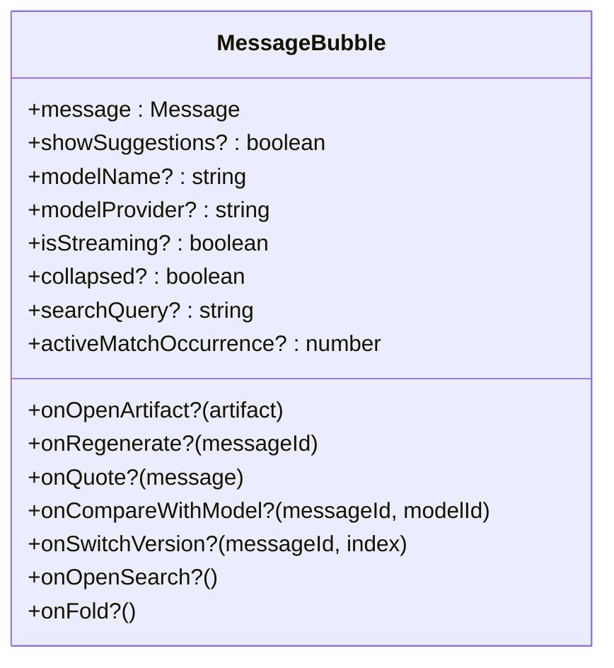
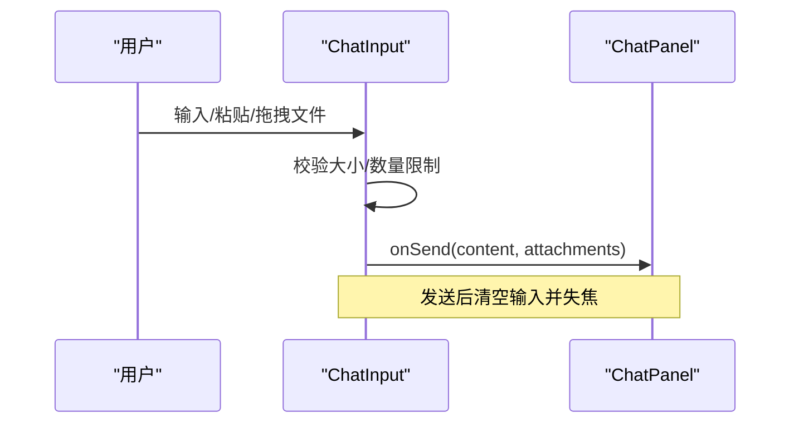
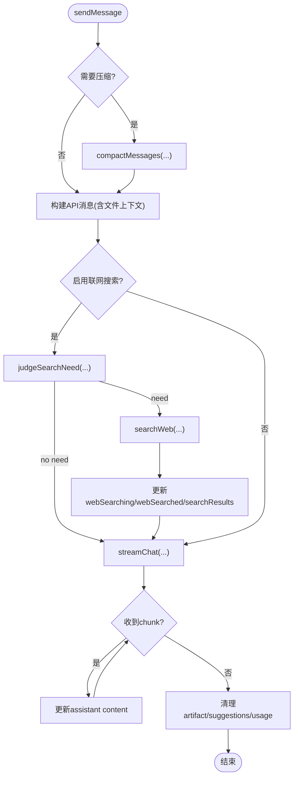
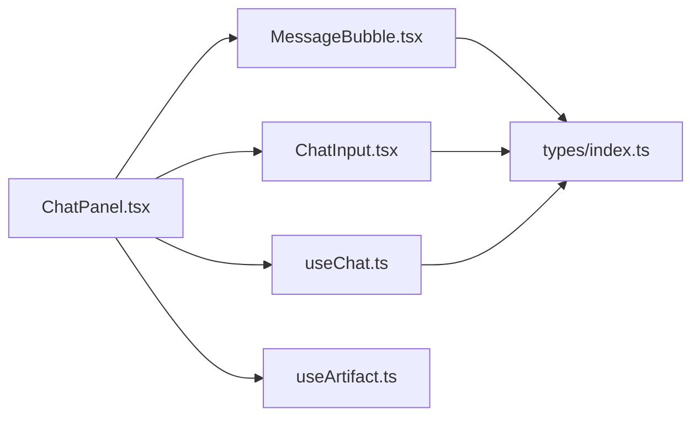

# 聊天面板组件

<cite>
**本文引用的文件**
- [ChatPanel.tsx](file://src/components/chat/ChatPanel.tsx)
- [MessageBubble.tsx](file://src/components/chat/MessageBubble.tsx)
- [ChatInput.tsx](file://src/components/chat/ChatInput.tsx)
- [useChat.ts](file://src/hooks/useChat.ts)
- [index.ts（类型定义）](file://src/types/index.ts)
- [ConversationList.tsx](file://src/components/chat/ConversationList.tsx)
- [useArtifact.ts](file://src/hooks/useArtifact.ts)
</cite>

## 目录
1. [简介](#简介)
2. [项目结构](#项目结构)
3. [核心组件](#核心组件)
4. [架构总览](#架构总览)
5. [详细组件分析](#详细组件分析)
6. [依赖关系分析](#依赖关系分析)
7. [性能考量](#性能考量)
8. [故障排查指南](#故障排查指南)
9. [结论](#结论)
10. [附录：扩展与集成示例](#附录扩展与集成示例)

## 简介
本技术文档围绕 AIShop 项目的聊天面板组件展开，重点解析 ChatPanel 的架构设计、消息渲染、流式响应处理、折叠浏览模式、对话内搜索等关键能力；详细说明状态管理（消息列表、加载、搜索、折叠）、用户交互（发送、停止生成、会话切换）、与子组件通信（MessageBubble、ChatInput），并给出错误处理、性能优化、用户体验设计与扩展集成建议。

## 项目结构
聊天面板相关代码集中在 src/components/chat 与 src/hooks 中，配合类型定义与服务层完成端到端的数据流与交互。

图表来源
- [ChatPanel.tsx:1-16](file://src/components/chat/ChatPanel.tsx#L1-L16)
- [MessageBubble.tsx:1-20](file://src/components/chat/MessageBubble.tsx#L1-L20)
- [ChatInput.tsx:1-19](file://src/components/chat/ChatInput.tsx#L1-L19)
- [useChat.ts:1-42](file://src/hooks/useChat.ts#L1-L42)
- [useArtifact.ts:92-131](file://src/hooks/useArtifact.ts#L92-L131)
- [index.ts:84-107](file://src/types/index.ts#L84-L107)

章节来源
- [ChatPanel.tsx:1-16](file://src/components/chat/ChatPanel.tsx#L1-L16)
- [useChat.ts:152-179](file://src/hooks/useChat.ts#L152-L179)
- [index.ts:84-107](file://src/types/index.ts#L84-L107)

## 核心组件
- ChatPanel：聊天面板容器，负责消息列表渲染、折叠浏览模式、对话内搜索、滚动定位、流式 Artifact 面板联动、上下文摘要面板等。
- MessageBubble：单条消息气泡，支持 Markdown/数学公式/代码高亮、引用来源跳转、复制、长按菜单、版本导航、折叠态展示、搜索高亮等。
- ChatInput：输入框，支持文本、图片粘贴/拖拽上传、文件解析、引用消息、联网搜索开关、发送/停止生成按钮。
- useChat：聊天状态与业务逻辑 Hook，封装消息发送、流式更新、上下文压缩、联网搜索、标题生成、持久化等。
- useArtifact：Artifact 流式预览与全屏面板的状态管理。

章节来源
- [ChatPanel.tsx:18-70](file://src/components/chat/ChatPanel.tsx#L18-L70)
- [MessageBubble.tsx:303-327](file://src/components/chat/MessageBubble.tsx#L303-L327)
- [ChatInput.tsx:6-19](file://src/components/chat/ChatInput.tsx#L6-L19)
- [useChat.ts:152-179](file://src/hooks/useChat.ts#L152-L179)
- [useArtifact.ts:92-131](file://src/hooks/useArtifact.ts#L92-L131)

## 架构总览
ChatPanel 作为视图层容器，组合 MessageBubble 与 ChatInput，并通过 useChat 提供的 sendMessage/stopGeneration 等能力驱动数据流。消息渲染由 MessageBubble 完成，支持多内容类型与搜索高亮。流式响应在 useChat 中通过流式 API 逐步更新消息内容，同时检测 Artifact 流式片段以驱动全屏预览。折叠浏览模式与对话内搜索在 ChatPanel 中实现，结合手势与 DOM 操作保证流畅体验。

图表来源
- [ChatInput.tsx:70-118](file://src/components/chat/ChatInput.tsx#L70-L118)
- [ChatPanel.tsx:483-595](file://src/components/chat/ChatPanel.tsx#L483-L595)
- [useChat.ts:494-783](file://src/hooks/useChat.ts#L494-L783)
- [MessageBubble.tsx:538-644](file://src/components/chat/MessageBubble.tsx#L538-L644)

## 详细组件分析

### ChatPanel：消息渲染、流式响应、折叠浏览、对话内搜索
- 消息渲染
  - 遍历 messages，计算当前模型信息，渲染 MessageBubble，并在末尾追加上下文压缩标记（若存在）。
  - 使用 messageRefs 维护每条消息 DOM 引用，用于折叠/展开时的滚动锚点定位与搜索高亮定位。
- 流式响应处理
  - 通过 useStickToBottom 自动跟随最新内容滚动；当用户主动上滑时显示“回到底部”按钮。
  - 监听 streamingArtifact 变化，控制 Artifact 面板打开/更新/关闭。
- 折叠浏览模式
  - 通过 useFoldGesture 检测快速甩动手势触发折叠；折叠期间冻结滚动，播放塌陷动画后切换为折叠态 DOM。
  - 折叠态下 AI 回复仅显示首行摘要，点击可平滑展开并居中目标消息。
- 对话内搜索
  - 顶部搜索栏支持关键词匹配、命中计数、上下跳转；对 Markdown 内容采用 DOM TreeWalker 进行高亮包裹，避免破坏代码块。
  - 搜索命中项滚动到视口顶部，非命中则滚动到对应消息。
- 状态管理
  - isCollapsed/foldPhase：折叠状态与动画阶段。
  - searchOpen/searchQuery/currentMatchIndex：搜索开关、关键词、当前命中索引。
  - isLoading：由父级传入，控制流式状态。
  - quotedMessage：引用消息状态，传递给 ChatInput。
- 与子组件通信
  - 向 MessageBubble 传递 collapsed、searchQuery、activeMatchOccurrence、onFold、onOpenSearch 等回调。
  - 向 ChatInput 传递 onSend、isLoading、onStop、quotedMessage、featureSettings、webSearchEnabled 等。

图表来源
- [ChatPanel.tsx:71-111](file://src/components/chat/ChatPanel.tsx#L71-L111)
- [ChatPanel.tsx:113-184](file://src/components/chat/ChatPanel.tsx#L113-L184)
- [ChatPanel.tsx:192-205](file://src/components/chat/ChatPanel.tsx#L192-L205)
- [ChatPanel.tsx:235-353](file://src/components/chat/ChatPanel.tsx#L235-L353)
- [ChatPanel.tsx:434-595](file://src/components/chat/ChatPanel.tsx#L434-L595)

章节来源
- [ChatPanel.tsx:18-70](file://src/components/chat/ChatPanel.tsx#L18-L70)
- [ChatPanel.tsx:113-184](file://src/components/chat/ChatPanel.tsx#L113-L184)
- [ChatPanel.tsx:192-353](file://src/components/chat/ChatPanel.tsx#L192-L353)
- [ChatPanel.tsx:434-595](file://src/components/chat/ChatPanel.tsx#L434-L595)

### MessageBubble：消息渲染与交互
- 内容渲染
  - 字符串内容：Markdown + 数学公式 + 代码高亮；链接统一在新窗口打开；引用标识转为圆形数字按钮并跳转到来源。
  - 多段内容：按 type 分别渲染文本与图片（图片走 MessageImage 以处理 IndexedDB blob URL）。
- 搜索高亮
  - 用户消息：纯文本分支直接插入 <mark> 标签。
  - AI 消息：ReactMarkdown 渲染完成后通过 TreeWalker 遍历文本节点包裹 <mark>，跳过 code/pre 内部。
- 交互
  - 长按上下文菜单：基于指针事件与 Portal，自适应位置，锁定背景滚动。
  - 复制功能：优先现代 Clipboard API，失败降级到 execCommand 方案。
  - 版本导航：支持多模型回答版本切换。
  - 折叠态：AI 回复仅显示首行摘要，点击展开。
- 流式状态
  - 空内容且正在流式输出时显示加载指示器。

图表来源
- [MessageBubble.tsx:303-327](file://src/components/chat/MessageBubble.tsx#L303-L327)

章节来源
- [MessageBubble.tsx:218-300](file://src/components/chat/MessageBubble.tsx#L218-L300)
- [MessageBubble.tsx:538-644](file://src/components/chat/MessageBubble.tsx#L538-L644)
- [MessageBubble.tsx:647-729](file://src/components/chat/MessageBubble.tsx#L647-L729)
- [MessageBubble.tsx:731-751](file://src/components/chat/MessageBubble.tsx#L731-L751)

### ChatInput：输入与附件处理
- 输入与预览
  - 支持文本、图片粘贴、拖拽上传、文件选择；图片与文件预览区域可删除。
  - 引用消息缩略图显示，发送后自动移除引用。
- 发送逻辑
  - 构建 attachments 元数据；拼接引用内容；有图片时构造 MessageContent[] 发送。
  - 发送后清空输入并失焦。
- 联网搜索开关
  - 切换 webSearchEnabled，传递给父组件。
- 激活态通知
  - 通过 onActiveChange 通知父组件输入框是否处于激活态，用于隐藏“回到底部”按钮等。

图表来源
- [ChatInput.tsx:70-118](file://src/components/chat/ChatInput.tsx#L70-L118)
- [ChatInput.tsx:154-228](file://src/components/chat/ChatInput.tsx#L154-L228)
- [ChatInput.tsx:250-467](file://src/components/chat/ChatInput.tsx#L250-L467)

章节来源
- [ChatInput.tsx:6-19](file://src/components/chat/ChatInput.tsx#L6-L19)
- [ChatInput.tsx:70-118](file://src/components/chat/ChatInput.tsx#L70-L118)
- [ChatInput.tsx:154-228](file://src/components/chat/ChatInput.tsx#L154-L228)
- [ChatInput.tsx:250-467](file://src/components/chat/ChatInput.tsx#L250-L467)

### useChat：消息发送、流式更新、上下文压缩、联网搜索
- 启动与会话恢复
  - 读取会话列表，优先恢复上次停留的会话；未找到则复用空会话或新建。
  - 补齐缺失标题。
- 消息发送流程
  - 发送前检查上下文水位，必要时触发压缩；构建 API 消息（含文件上下文）。
  - 可选联网搜索：判断是否需要搜索，获取结果并注入上下文。
  - 流式接收：逐块更新最后一条 assistant 消息 content，并检测 Artifact 流式片段。
  - 流式结束：清理 artifact 标记、去除多余反引号、解析 suggestions、写入 usage。
- 停止生成
  - 中止请求，更新最后一条 assistant 消息状态（保留内容或标记取消）。
- 持久化
  - 差异写入会话，避免全量序列化卡顿；后台可见性变化时立即落盘。

图表来源
- [useChat.ts:494-783](file://src/hooks/useChat.ts#L494-L783)

章节来源
- [useChat.ts:152-179](file://src/hooks/useChat.ts#L152-L179)
- [useChat.ts:494-783](file://src/hooks/useChat.ts#L494-L783)

## 依赖关系分析
- ChatPanel 依赖：
  - MessageBubble：消息渲染与交互。
  - ChatInput：输入与附件处理。
  - useChat：消息发送、流式更新、上下文压缩、联网搜索。
  - useArtifact：Artifact 流式预览与全屏面板状态。
  - 类型定义 types/index.ts：Message、Conversation、ContextSegment 等。
- MessageBubble 依赖：
  - ReactMarkdown、remark-gfm、remark-math、rehype-katex：Markdown/数学公式渲染。
  - highlight.js：代码高亮。
  - 工具函数 getPlainText/firstLineOf：提取纯文本与首行。
- ChatInput 依赖：
  - fileParser：文件解析与文本提取。
  - 类型定义 types/index.ts：MessageContent、FileAttachment、ChatFeatureSettings。

图表来源
- [ChatPanel.tsx:1-16](file://src/components/chat/ChatPanel.tsx#L1-L16)
- [MessageBubble.tsx:1-20](file://src/components/chat/MessageBubble.tsx#L1-L20)
- [ChatInput.tsx:1-19](file://src/components/chat/ChatInput.tsx#L1-L19)
- [useChat.ts:1-42](file://src/hooks/useChat.ts#L1-L42)
- [useArtifact.ts:92-131](file://src/hooks/useArtifact.ts#L92-L131)
- [index.ts:84-107](file://src/types/index.ts#L84-L107)

章节来源
- [ChatPanel.tsx:1-16](file://src/components/chat/ChatPanel.tsx#L1-L16)
- [MessageBubble.tsx:1-20](file://src/components/chat/MessageBubble.tsx#L1-L20)
- [ChatInput.tsx:1-19](file://src/components/chat/ChatInput.tsx#L1-L19)
- [useChat.ts:1-42](file://src/hooks/useChat.ts#L1-L42)
- [useArtifact.ts:92-131](file://src/hooks/useArtifact.ts#L92-L131)
- [index.ts:84-107](file://src/types/index.ts#L84-L107)

## 性能考量
- 流式渲染
  - 使用 useStickToBottom 的 ResizeObserver + rAF 缓动，避免频繁重排导致的卡顿。
  - 流式过程中仅更新最后一条 assistant 消息 content，减少重渲染范围。
- 搜索高亮
  - 对 Markdown 内容采用 DOM TreeWalker 后处理，避免在渲染前插入 <mark> 破坏语法；跳过 code/pre 内部，防止打断代码高亮。
- 折叠动画
  - 折叠期间冻结滚动（pinScroll 逐帧压回 scrollTop），避免惯性滚动覆盖导致空白屏；使用 useLayoutEffect 在绘制前落位，避免闪烁。
- 持久化
  - 使用 diff 写入会话，避免每次 state 变化都全量序列化；后台可见性变化时立即落盘，防止数据丢失。
- 附件处理
  - 图片与文件限制大小与数量，避免过大输入影响性能；图片使用 IndexedDB blob URL 按需加载与释放。

[本节提供通用指导，不直接分析具体文件]

## 故障排查指南
- 流式中断/取消
  - 现象：用户点击停止生成后，消息仍显示加载中。
  - 排查：确认 stopGeneration 是否正确调用 abortController.abort()，并更新最后一条 assistant 消息的 stoppedByUser 与 isStreaming 状态。
  - 参考路径：[useChat.ts:785-800](file://src/hooks/useChat.ts#L785-L800)
- 联网搜索失败
  - 现象：消息中标记“联网搜索失败”。
  - 排查：检查 judgeSearchNeed 与 searchWeb 调用是否抛出异常；确认 webSearchFailed 标志已正确设置。
  - 参考路径：[useChat.ts:621-676](file://src/hooks/useChat.ts#L621-L676)
- 搜索高亮不生效
  - 现象：对话内搜索无高亮或高亮错位。
  - 排查：确认 Markdown 渲染完成后执行 highlightTextNodes；确保跳过 code/pre 内部；检查 activeMatchOccurrence 是否正确传递。
  - 参考路径：[MessageBubble.tsx:256-300](file://src/components/chat/MessageBubble.tsx#L256-L300)
- 折叠模式滚动异常
  - 现象：折叠/展开后滚动位置错乱或空白屏。
  - 排查：确认 captureFoldAnchor 与 anchorTop 计算正确；检查 pinScroll 是否在动画期间冻结滚动；useLayoutEffect 中是否正确落位。
  - 参考路径：[ChatPanel.tsx:235-353](file://src/components/chat/ChatPanel.tsx#L235-L353)

章节来源
- [useChat.ts:621-676](file://src/hooks/useChat.ts#L621-L676)
- [useChat.ts:785-800](file://src/hooks/useChat.ts#L785-L800)
- [MessageBubble.tsx:256-300](file://src/components/chat/MessageBubble.tsx#L256-L300)
- [ChatPanel.tsx:235-353](file://src/components/chat/ChatPanel.tsx#L235-L353)

## 结论
ChatPanel 通过组合 MessageBubble 与 ChatInput，结合 useChat 的流式更新与上下文管理能力，实现了高性能、可交互的聊天界面。折叠浏览模式与对话内搜索提升了长对话的可读性与检索效率；Artifact 流式预览增强了可视化体验。整体架构清晰、职责分明，便于扩展与维护。

[本节总结性内容，不直接分析具体文件]

## 附录：扩展与集成示例
- 扩展消息类型
  - 在 types/index.ts 中扩展 MessageContent 或新增消息角色，并在 MessageBubble 中增加对应渲染分支。
  - 参考路径：[index.ts:53-57](file://src/types/index.ts#L53-L57)
- 集成新的联网搜索源
  - 在 useChat.ts 中替换 searchWeb 实现，保持返回格式一致；确保 webSearching/webSearched/searchResults 状态同步。
  - 参考路径：[useChat.ts:621-676](file://src/hooks/useChat.ts#L621-L676)
- 自定义折叠手势阈值
  - 调整 useFoldGesture 的配置参数（如速度、距离），或在 ChatPanel 中自定义手势检测逻辑。
  - 参考路径：[ChatPanel.tsx:200-205](file://src/components/chat/ChatPanel.tsx#L200-L205)
- 集成新模型比较
  - 在 MessageBubble 中扩展 CompareButton 行为，调用 compareWithModel 回调；在 useChat 中实现多版本生成逻辑。
  - 参考路径：[MessageBubble.tsx:793-800](file://src/components/chat/MessageBubble.tsx#L793-L800)

章节来源
- [index.ts:53-57](file://src/types/index.ts#L53-L57)
- [useChat.ts:621-676](file://src/hooks/useChat.ts#L621-L676)
- [ChatPanel.tsx:200-205](file://src/components/chat/ChatPanel.tsx#L200-L205)
- [MessageBubble.tsx:793-800](file://src/components/chat/MessageBubble.tsx#L793-L800)