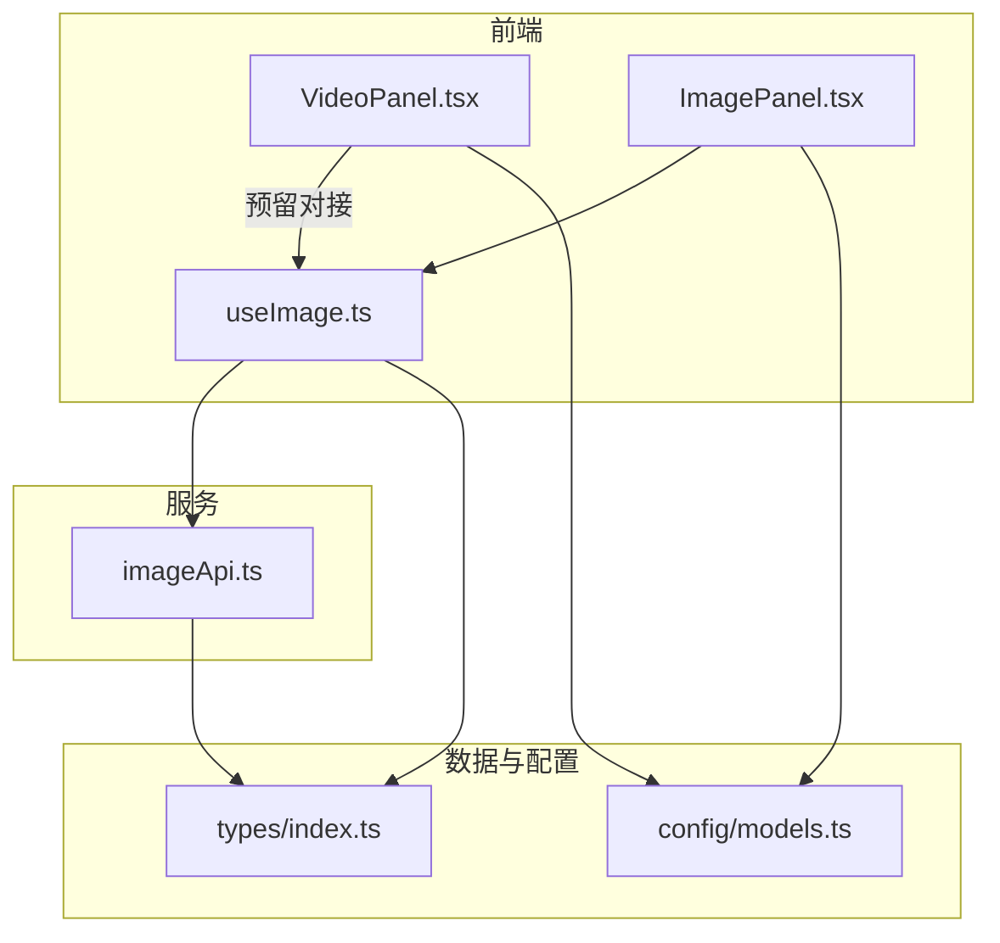
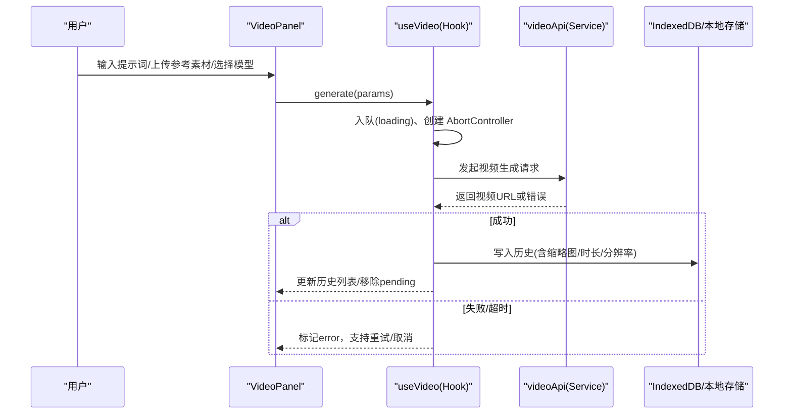
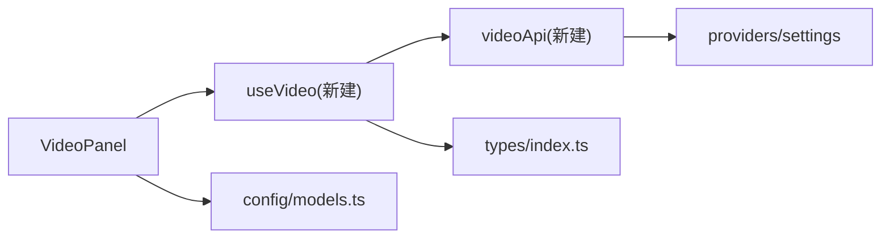

# 视频处理面板

<cite>
**本文引用的文件**
- [VideoPanel.tsx](file://src/components/video/VideoPanel.tsx)
- [ImagePanel.tsx](file://src/components/image/ImagePanel.tsx)
- [useImage.ts](file://src/hooks/useImage.ts)
- [imageApi.ts](file://src/services/imageApi.ts)
- [index.ts（类型定义）](file://src/types/index.ts)
- [models.ts（模型配置）](file://src/config/models.ts)
- [README.md](file://README.md)
- [需求文档.md](file://需求文档.md)
</cite>

## 目录
1. [简介](#简介)
2. [项目结构](#项目结构)
3. [核心组件](#核心组件)
4. [架构总览](#架构总览)
5. [详细组件分析](#详细组件分析)
6. [依赖关系分析](#依赖关系分析)
7. [性能考虑](#性能考虑)
8. [故障排查指南](#故障排查指南)
9. [结论](#结论)
10. [附录：未来扩展与开发指南](#附录未来扩展与开发指南)

## 简介
本技术文档面向 AIShop 项目的“视频处理面板”功能，目标是基于现有图片生成能力与通用架构，设计并文档化 VideoPanel 的架构、状态管理、API 集成点与扩展机制，说明与图像生成功能的协作关系和数据流转，并提供未来功能扩展（视频编解码、特效处理、格式转换等）的开发指南与性能优化建议。

当前仓库中 VideoPanel 为占位实现，显示“即将上线”。但项目已具备完善的图片生成链路（UI + Hook + API + 类型 + 模型配置），可复用其模式快速落地视频面板。

**章节来源**
- [VideoPanel.tsx:1-8](file://src/components/video/VideoPanel.tsx#L1-L8)
- [README.md:1-74](file://README.md#L1-L74)
- [需求文档.md:1-33](file://需求文档.md#L1-L33)

## 项目结构
- 组件层
  - 视频：src/components/video/VideoPanel.tsx（占位）
  - 图片：src/components/image/ImagePanel.tsx（完整实现，可作为视频面板参考）
- 状态与业务逻辑
  - src/hooks/useImage.ts（图片生成的状态机、并发队列、历史持久化）
- 服务层
  - src/services/imageApi.ts（多上游适配、请求构建、超时与错误处理）
- 类型与配置
  - src/types/index.ts（MediaItem、ImageGenerationParams、PendingImageTask 等）
  - src/config/models.ts（模型枚举与分组）
- 其他
  - README.md、需求文档.md（项目背景与界面要求）

**图表来源**
- [VideoPanel.tsx:1-8](file://src/components/video/VideoPanel.tsx#L1-L8)
- [ImagePanel.tsx:1-800](file://src/components/image/ImagePanel.tsx#L1-L800)
- [useImage.ts:123-469](file://src/hooks/useImage.ts#L123-L469)
- [imageApi.ts:1-257](file://src/services/imageApi.ts#L1-L257)
- [index.ts:177-214](file://src/types/index.ts#L177-L214)
- [models.ts:237-284](file://src/config/models.ts#L237-L284)

**章节来源**
- [VideoPanel.tsx:1-8](file://src/components/video/VideoPanel.tsx#L1-L8)
- [ImagePanel.tsx:1-800](file://src/components/image/ImagePanel.tsx#L1-L800)
- [useImage.ts:123-469](file://src/hooks/useImage.ts#L123-L469)
- [imageApi.ts:1-257](file://src/services/imageApi.ts#L1-L257)
- [index.ts:177-214](file://src/types/index.ts#L177-L214)
- [models.ts:237-284](file://src/config/models.ts#L237-L284)

## 核心组件
- VideoPanel（占位）
  - 职责：展示视频面板入口与提示文案；预留后续接入视频生成流程的挂载点。
  - 现状：仅渲染“即将上线”，无状态与交互。
- ImagePanel（参考实现）
  - 职责：提供文本输入、参考图上传、模型选择、参数设置、照片墙展示、下载与删除等。
  - 关键能力：拖拽上传、瀑布流布局、并发任务队列、历史持久化、错误重试与取消。
- useImage（Hook）
  - 职责：封装图片生成全流程的状态机（loading/error/success）、并发控制、参数派生、本地存储与 IndexedDB 历史读写。
  - 关键点：AbortController 取消、超时处理、尺寸回填、去重与限制返回数量。
- imageApi（服务）
  - 职责：根据模型路由到不同上游端点，构建请求体，统一解析响应，处理超时与错误信息。
  - 关键点：兼容多种上游响应结构、合并信号、超时控制、错误消息提取。

**章节来源**
- [VideoPanel.tsx:1-8](file://src/components/video/VideoPanel.tsx#L1-L8)
- [ImagePanel.tsx:1-800](file://src/components/image/ImagePanel.tsx#L1-L800)
- [useImage.ts:123-469](file://src/hooks/useImage.ts#L123-L469)
- [imageApi.ts:1-257](file://src/services/imageApi.ts#L1-L257)

## 架构总览
视频面板将沿用“组件 + Hook + Service + 类型/配置”的分层架构：
- 组件层：VideoPanel 负责 UI 与用户交互（输入、参数、播放/预览、下载）。
- Hook 层：useVideo（新建）负责状态管理、并发队列、历史持久化、媒体资源管理（Blob URL、缓存）。
- 服务层：videoApi（新建）负责调用视频生成 API、构建请求、解析响应、超时与错误处理。
- 类型/配置：在 types 中新增视频相关类型，在 models 中注册视频模型。

**图表来源**
- [useImage.ts:274-356](file://src/hooks/useImage.ts#L274-L356)
- [imageApi.ts:149-243](file://src/services/imageApi.ts#L149-L243)

**章节来源**
- [useImage.ts:274-356](file://src/hooks/useImage.ts#L274-L356)
- [imageApi.ts:149-243](file://src/services/imageApi.ts#L149-L243)

## 详细组件分析

### VideoPanel 组件（占位）
- 当前行为：居中显示“即将上线”提示。
- 预留接口：
  - 输入区：提示词输入框、参考素材上传（图片/视频片段/音频）、模型选择下拉。
  - 参数区：分辨率、帧率、时长、质量、风格等。
  - 结果区：视频卡片（封面/时长/分辨率）、播放/暂停、进度条、下载按钮。
  - 任务区：pending/loading/error 卡片，支持重试、取消、关闭。
- 与 ImagePanel 的复用策略：
  - 复用 UI 模式（浮动选择器、九宫格比例选择器等）与交互模式（拖拽、键盘快捷键）。
  - 复用 Hook 模式（并发队列、历史持久化、错误处理）。
  - 复用 Service 模式（模型路由、请求构建、超时与错误处理）。

**章节来源**
- [VideoPanel.tsx:1-8](file://src/components/video/VideoPanel.tsx#L1-L8)
- [ImagePanel.tsx:94-367](file://src/components/image/ImagePanel.tsx#L94-L367)

### 与图像生成功能的协作关系
- 共享类型与配置
  - MediaItem 已包含 type: 'image' | 'video' | 'audio'，可用于统一媒体卡片展示。
  - 模型配置中 VIDEO_MODELS 已预留空数组，便于后续扩展。
- 数据流转差异
  - 图片：base64/data URI/http URL → 服务端 → 返回 URL 列表 → 本地 IndexedDB 存储 Blob 引用。
  - 视频：参考素材（图片/视频片段/音频）→ 服务端 → 返回视频 URL → 本地存储缩略图/元数据（时长、分辨率、码率）。
- 复用点
  - 并发队列、AbortController、超时控制、错误提示、重试/取消、历史持久化、下载逻辑。

**章节来源**
- [index.ts:134-141](file://src/types/index.ts#L134-L141)
- [models.ts:272-284](file://src/config/models.ts#L272-L284)
- [useImage.ts:274-356](file://src/hooks/useImage.ts#L274-L356)
- [imageApi.ts:149-243](file://src/services/imageApi.ts#L149-L243)

### 状态管理与并发控制（参考 useImage）
- 状态字段
  - selectedModel、uploadedImages、aspectRatio、size、quality、pendingTasks、history。
- 并发队列
  - pendingTasks 维护 loading/error 任务；每个任务独立 AbortController。
- 生命周期
  - 启动加载历史；组件卸载清理控制器；切换模型重置参数与裁剪超量上传。
- 派生属性
  - effectiveAspectRatio/effectiveSize 保证选项一致性；isEditMode/maxUploadCount 动态计算。

**章节来源**
- [useImage.ts:123-214](file://src/hooks/useImage.ts#L123-L214)
- [useImage.ts:248-273](file://src/hooks/useImage.ts#L248-L273)
- [useImage.ts:274-356](file://src/hooks/useImage.ts#L274-L356)

### API 集成点与服务层（参考 imageApi）
- 模型路由
  - 通过 IMAGE_ENDPOINTS 映射到具体端点；视频需新增 VIDEO_ENDPOINTS。
- 请求构建
  - buildImageRequestBody 按模型与编辑模式构造请求体；视频需新增 buildVideoRequestBody。
- 响应解析
  - extractUrls 兼容多种上游结构；视频需新增 extractVideoUrl 处理视频 URL。
- 超时与错误
  - 120s 超时；合并外部 signal 与内部超时；错误消息优先取 detail/error。

**章节来源**
- [imageApi.ts:6-19](file://src/services/imageApi.ts#L6-L19)
- [imageApi.ts:66-143](file://src/services/imageApi.ts#L66-L143)
- [imageApi.ts:149-243](file://src/services/imageApi.ts#L149-L243)

## 依赖关系分析
- 组件依赖
  - VideoPanel 依赖 useVideo（新建）与 videoApi（新建）。
  - 复用 ImagePanel 的 UI 组件（如浮动选择器、九宫格比例选择器）与交互模式。
- Hook 依赖
  - useVideo 依赖 videoApi、类型定义、本地存储（IndexedDB/Blob URL 管理）。
- 服务依赖
  - videoApi 依赖 settingsService、providers 配置、类型定义。
- 类型与配置
  - 新增视频相关类型（VideoGenerationParams、VideoHistoryItem、PendingVideoTask）。
  - 在 models.ts 中注册视频模型。

**图表来源**
- [useImage.ts:123-469](file://src/hooks/useImage.ts#L123-L469)
- [imageApi.ts:1-257](file://src/services/imageApi.ts#L1-L257)
- [models.ts:272-284](file://src/config/models.ts#L272-L284)

**章节来源**
- [useImage.ts:123-469](file://src/hooks/useImage.ts#L123-L469)
- [imageApi.ts:1-257](file://src/services/imageApi.ts#L1-L257)
- [models.ts:272-284](file://src/config/models.ts#L272-L284)

## 性能考虑
- 并发与取消
  - 使用 AbortController 支持任务取消与超时，避免内存泄漏与无效请求。
- 资源管理
  - 视频缩略图与封面图懒加载；长视频仅缓存缩略图，实际播放按需拉流。
  - Blob URL 引用计数管理，及时释放以节省内存。
- 网络与超时
  - 合理设置超时时间（视频生成通常更长），区分用户取消与服务超时。
- 渲染优化
  - 瀑布流/虚拟滚动减少 DOM 节点；占位高度避免抖动。
- 压缩与转码
  - 上传前对参考素材进行压缩与格式标准化；服务端返回统一格式以减少前端处理。

[本节为通用指导，不直接分析具体文件]

## 故障排查指南
- 常见错误
  - 未配置 API Key：检查设置项是否已配置视频 API Key。
  - 不支持的模型：确认 models.ts 中已注册对应视频模型。
  - 请求超时：检查网络与服务端响应时间，必要时调整超时阈值。
  - 未返回视频地址：检查服务端响应结构与解析逻辑。
- 调试建议
  - 打印请求体与响应体，确认字段是否符合上游要求。
  - 使用浏览器开发者工具观察网络请求与错误堆栈。
  - 检查 IndexedDB 中历史条目是否正确写入。

**章节来源**
- [imageApi.ts:149-243](file://src/services/imageApi.ts#L149-L243)
- [useImage.ts:336-356](file://src/hooks/useImage.ts#L336-L356)

## 结论
VideoPanel 当前为占位实现，但项目已具备完善的图片生成架构与最佳实践。通过复用 ImagePanel 的 UI 模式与 useImage 的状态管理、并发控制、历史持久化，以及 imageApi 的多上游适配与错误处理，可以快速落地视频面板。未来只需新增视频类型、模型配置与服务层适配，即可实现完整的视频生成与处理能力。

[本节为总结性内容，不直接分析具体文件]

## 附录：未来扩展与开发指南

### 新增类型与配置
- 在 types/index.ts 中新增：
  - VideoGenerationParams（提示词、参考素材、分辨率、帧率、时长、质量、输出格式、数量）
  - VideoHistoryItem（视频 URL、缩略图、时长、分辨率、帧率、质量、来源素材数）
  - PendingVideoTask（任务 ID、提示词、模型、参数、状态、错误、创建时间）
- 在 config/models.ts 中注册视频模型至 VIDEO_MODELS。

**章节来源**
- [index.ts:177-214](file://src/types/index.ts#L177-L214)
- [models.ts:272-284](file://src/config/models.ts#L272-L284)

### 新建 Hook：useVideo
- 职责
  - 管理视频生成状态（loading/error/success）、并发队列、历史持久化、媒体资源管理。
- 关键方法
  - generate(params)：组装参数并触发执行。
  - executeTask(params)：入队、创建 AbortController、调用 videoApi、处理成功/失败。
  - retryTask/cancelTask/dismissTask：任务管理。
  - deleteHistoryItem/clearHistory：历史管理。
- 与 useImage 的复用
  - 并发队列、AbortController、超时处理、错误提示、重试/取消、历史持久化。

**章节来源**
- [useImage.ts:274-469](file://src/hooks/useImage.ts#L274-L469)

### 新建 Service：videoApi
- 职责
  - 根据模型路由到视频端点，构建请求体，解析响应，处理超时与错误。
- 关键函数
  - buildVideoRequestBody(model, prompt, assets, params)：按模型与模式构造请求体。
  - extractVideoUrl(payload)：从响应中提取视频 URL。
  - generateVideo(params, signal)：发起请求，合并信号，超时控制，错误处理。

**章节来源**
- [imageApi.ts:66-143](file://src/services/imageApi.ts#L66-L143)
- [imageApi.ts:149-243](file://src/services/imageApi.ts#L149-L243)

### 视频生成技术实现方案
- 输入素材
  - 图片：作为参考图或风格迁移输入。
  - 视频片段：用于续写、转场、风格化。
  - 音频：用于音画同步、配音生成。
- 输出格式
  - MP4/H.264（兼容性最佳）、WebM/VP9（Web 友好）、MOV（专业工作流）。
- 参数控制
  - 分辨率（720p/1080p/4K）、帧率（24/30/60fps）、时长（秒）、质量（低/中/高）、码率（自适应/固定）。
- 服务端集成
  - 多上游适配：不同提供商的视频生成 API。
  - 统一响应解析：提取视频 URL、缩略图、元数据。

[本节为概念性内容，不直接分析具体文件]

### 与图像生成功能的协作关系
- 共用 UI 模式：浮动选择器、九宫格比例选择器、拖拽上传、键盘快捷键。
- 共用状态管理：并发队列、AbortController、超时处理、错误提示、重试/取消。
- 共用数据持久化：IndexedDB 存储历史与缩略图，Blob URL 管理媒体资源。
- 数据流转差异：视频增加时长、分辨率、帧率、码率等元数据；图片侧重宽高比与尺寸。

**章节来源**
- [ImagePanel.tsx:94-367](file://src/components/image/ImagePanel.tsx#L94-L367)
- [useImage.ts:274-469](file://src/hooks/useImage.ts#L274-L469)

### 扩展机制
- 插件化上游适配：新增视频提供商时，仅需扩展 VIDEO_ENDPOINTS 与 buildVideoRequestBody。
- 可扩展参数：通过类型定义与 UI 控件动态扩展参数（如特效、滤镜、转场）。
- 可插拔处理链：视频后处理（编解码、特效、格式转换）可通过中间件式管道集成。

[本节为概念性内容，不直接分析具体文件]

### 视频编解码、特效处理、格式转换集成方案
- 编解码
  - 前端：使用 MediaRecorder、Canvas、WebCodecs（实验性）进行录制与转码。
  - 后端：FFmpeg 或云服务商转码服务，支持 H.264/HEVC/AV1。
- 特效处理
  - 前端：WebGL/WebGPU 实现实时滤镜与特效。
  - 后端：OpenCV、TensorFlow.js、ONNX Runtime 实现 AI 特效。
- 格式转换
  - 前端：MediaSource Extensions (MSE) 实现流式播放与转封装。
  - 后端：FFmpeg 批量转码，支持多格式输出。

[本节为概念性内容，不直接分析具体文件]

### 性能优化建议
- 前端
  - 懒加载与虚拟滚动：减少首屏渲染压力。
  - 缩略图缓存：IndexedDB 存储缩略图，减少重复请求。
  - 分片上传：大文件分片上传，提升稳定性。
- 后端
  - 异步任务队列：Celery/RabbitMQ 处理耗时任务。
  - 缓存策略：CDN 缓存视频与缩略图，降低带宽成本。
  - 自适应码率：根据网络状况动态调整码率。

[本节为通用指导，不直接分析具体文件]

### 用户体验设计建议
- 明确反馈
  - 任务状态：loading 动画、进度条、剩余时间估算。
  - 错误提示：清晰描述错误原因与解决建议。
- 便捷操作
  - 快捷键：Enter 发送、Esc 取消、Ctrl+Z 撤销。
  - 拖拽上传：支持拖拽图片/视频/音频到输入区。
- 可访问性
  - 键盘导航：Tab 顺序合理，焦点可见。
  - 屏幕阅读器：为媒体元素添加 aria-label。

[本节为通用指导，不直接分析具体文件]