# 资产库管理系统

<cite>
**本文引用的文件**
- [README.md](file://README.md)
- [package.json](file://package.json)
- [src/main.tsx](file://src/main.tsx)
- [src/App.tsx](file://src/App.tsx)
- [src/components/layout/MainLayout.tsx](file://src/components/layout/MainLayout.tsx)
- [src/components/artifact/LibraryPanel.tsx](file://src/components/artifact/LibraryPanel.tsx)
- [src/hooks/useAssets.ts](file://src/hooks/useAssets.ts)
- [src/services/api.ts](file://src/services/api.ts)
- [src/types/index.ts](file://src/types/index.ts)
- [src/db/index.ts](file://src/db/index.ts)
- [src/db/open.ts](file://src/db/open.ts)
- [src/services/byoc/index.ts](file://src/services/byoc/index.ts)
- [electron/main/index.ts](file://electron/main/index.ts)
- [需求文档.md](file://需求文档.md)
</cite>

## 目录
1. [简介](#简介)
2. [项目结构](#项目结构)
3. [核心组件](#核心组件)
4. [架构总览](#架构总览)
5. [详细组件分析](#详细组件分析)
6. [依赖关系分析](#依赖关系分析)
7. [性能考量](#性能考量)
8. [故障排查指南](#故障排查指南)
9. [结论](#结论)
10. [附录](#附录)

## 简介
本项目是一个基于 React + TypeScript + Vite 的跨端 AI 综合应用，支持聊天、图像生成/编辑、视频与音乐等多模态能力，并提供“我的库”资产库管理。应用采用无后端设计，数据本地持久化（IndexedDB），并可选通过 BYOC（自带云存储）实现增量同步与全量备份。桌面端使用 Electron 提供原生体验（托盘、自动更新、外部链接打开等），移动端通过 Capacitor 适配 Android/iOS。

## 项目结构
- 前端入口：src/main.tsx 渲染 App；App 负责主题、平台能力初始化、路由与状态装配。
- 布局层：MainLayout 根据设备模式切换桌面/移动布局，承载侧边栏、顶栏、底部导航与内容区。
- 功能模块：聊天、图片、视频、音乐、设置、资产库等以组件形式组织在 src/components。
- 数据层：src/db 统一导出 IndexedDB 操作（会话、消息、上下文、资产、角色、图片历史等）。
- 服务层：API 流式调用、BYOC 同步、设置、搜索、标题生成等。
- 类型定义：src/types 集中定义消息、模型、资产、用量等数据结构。
- 桌面端：electron/main 提供窗口、托盘、自动更新、IPC 桥接等。

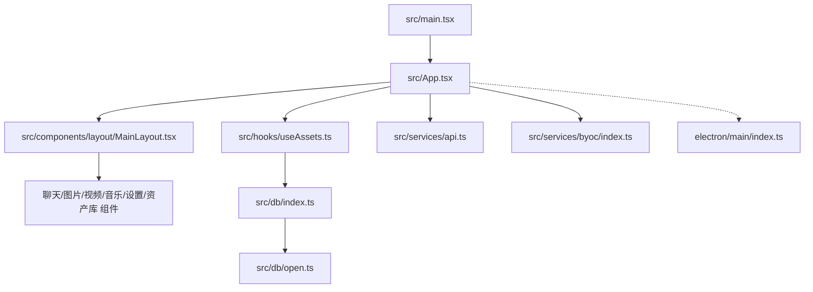

图表来源
- [src/main.tsx:1-8](file://src/main.tsx#L1-L8)
- [src/App.tsx:1-303](file://src/App.tsx#L1-L303)
- [src/components/layout/MainLayout.tsx:1-295](file://src/components/layout/MainLayout.tsx#L1-L295)
- [src/hooks/useAssets.ts:1-175](file://src/hooks/useAssets.ts#L1-L175)
- [src/services/api.ts:1-173](file://src/services/api.ts#L1-L173)
- [src/services/byoc/index.ts:1-249](file://src/services/byoc/index.ts#L1-L249)
- [src/db/index.ts:1-123](file://src/db/index.ts#L1-L123)
- [src/db/open.ts:1-90](file://src/db/open.ts#L1-L90)
- [electron/main/index.ts:1-285](file://electron/main/index.ts#L1-L285)

章节来源
- [README.md:1-74](file://README.md#L1-L74)
- [package.json:1-97](file://package.json#L1-L97)
- [需求文档.md:1-55](file://需求文档.md#L1-L55)

## 核心组件
- 应用启动与平台适配：App 中完成主题/模式加载、Electron/Android 能力初始化、持久化存储申请、BYOC 自动同步调度、外链处理、更新提示等。
- 布局系统：MainLayout 提供移动端抽屉侧边栏与桌面双栏布局，统一处理输入框聚焦、键盘遮挡、横滑手势、返回键等。
- 资产库：LibraryPanel 提供资产筛选、预览（HTML 应用/Markdown/图片）、重命名、删除、下载等功能。
- 资产 Hook：useAssets 统一管理资产的增删改查与 3 秒防抖的 BYOC 同步。
- API 流式对话：api.ts 实现流式请求、usage 解析、失败重试、blob 内联等。
- BYOC 同步：byoc/index.ts 提供配置校验、连通性测试、增量同步、全量备份/恢复、自动调度与事件通知。
- 数据库：db/index.ts 统一导出各仓库方法；open.ts 封装连接、迁移、写入串行化与错误恢复。

章节来源
- [src/App.tsx:25-142](file://src/App.tsx#L25-L142)
- [src/components/layout/MainLayout.tsx:59-295](file://src/components/layout/MainLayout.tsx#L59-L295)
- [src/components/artifact/LibraryPanel.tsx:164-534](file://src/components/artifact/LibraryPanel.tsx#L164-L534)
- [src/hooks/useAssets.ts:24-175](file://src/hooks/useAssets.ts#L24-L175)
- [src/services/api.ts:44-173](file://src/services/api.ts#L44-L173)
- [src/services/byoc/index.ts:33-249](file://src/services/byoc/index.ts#L33-L249)
- [src/db/index.ts:1-123](file://src/db/index.ts#L1-L123)
- [src/db/open.ts:1-90](file://src/db/open.ts#L1-L90)

## 架构总览
应用采用分层架构：UI 层（React 组件）→ 状态与业务 Hook → 服务层（API、BYOC、设置、搜索等）→ 数据层（IndexedDB 仓库）→ 平台能力（Electron/Capacitor）。

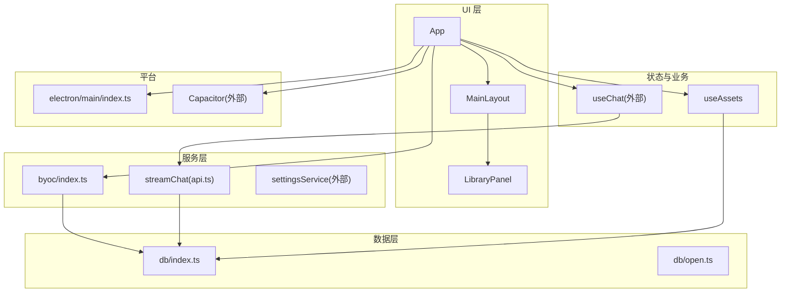

图表来源
- [src/App.tsx:1-303](file://src/App.tsx#L1-L303)
- [src/components/layout/MainLayout.tsx:1-295](file://src/components/layout/MainLayout.tsx#L1-L295)
- [src/components/artifact/LibraryPanel.tsx:1-534](file://src/components/artifact/LibraryPanel.tsx#L1-L534)
- [src/hooks/useAssets.ts:1-175](file://src/hooks/useAssets.ts#L1-L175)
- [src/services/api.ts:1-173](file://src/services/api.ts#L1-L173)
- [src/services/byoc/index.ts:1-249](file://src/services/byoc/index.ts#L1-L249)
- [src/db/index.ts:1-123](file://src/db/index.ts#L1-L123)
- [src/db/open.ts:1-90](file://src/db/open.ts#L1-L90)
- [electron/main/index.ts:1-285](file://electron/main/index.ts#L1-L285)

## 详细组件分析

### 应用启动与平台适配（App）
- 主题与模式：读取本地主题与明暗模式，设置 CSS 变量与 Electron 标题栏颜色，Android 状态栏样式与高度注入。
- 平台能力：注册 Android 返回键事件，申请持久化存储，启动 BYOC 自动同步。
- 更新与外链：Electron 下监听更新下载完成，拦截 target=_blank 外链交由系统浏览器打开。
- 聊天图片入库：扫描会话消息中的生成图片，去重后调用 useAssets.saveImage 入“我的库”，触发 BYOC 同步。
- 同步刷新：监听 BYOC_SYNC_DONE_EVENT 刷新会话、角色与资产列表。

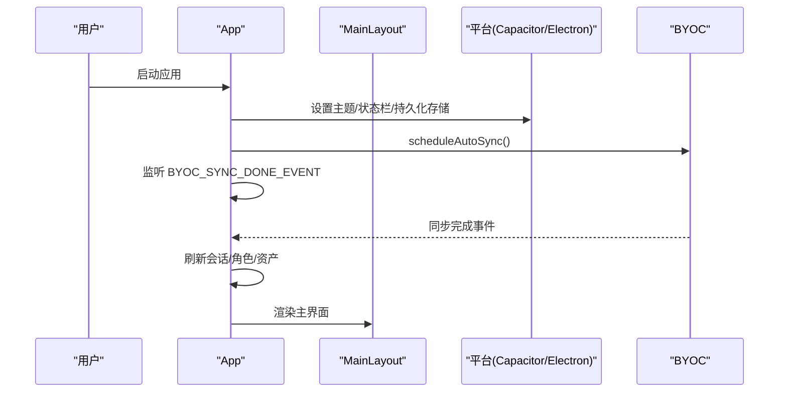

图表来源
- [src/App.tsx:25-142](file://src/App.tsx#L25-L142)
- [src/services/byoc/index.ts:210-249](file://src/services/byoc/index.ts#L210-L249)

章节来源
- [src/App.tsx:25-142](file://src/App.tsx#L25-L142)

### 布局系统（MainLayout）
- 移动端：抽屉侧边栏+顶部导航+底部导航，支持横滑拉出/收起、ESC 关闭、输入框聚焦时隐藏底部栏、键盘遮挡滚动、原生壳 edge-to-edge 适配。
- 桌面端：左右分栏，右侧可展开历史记录面板。
- 透传能力：模型选择、联网搜索开关、Artifact 开关、角色选择、上下文占用指示、压缩控制、片段查看/删除等。

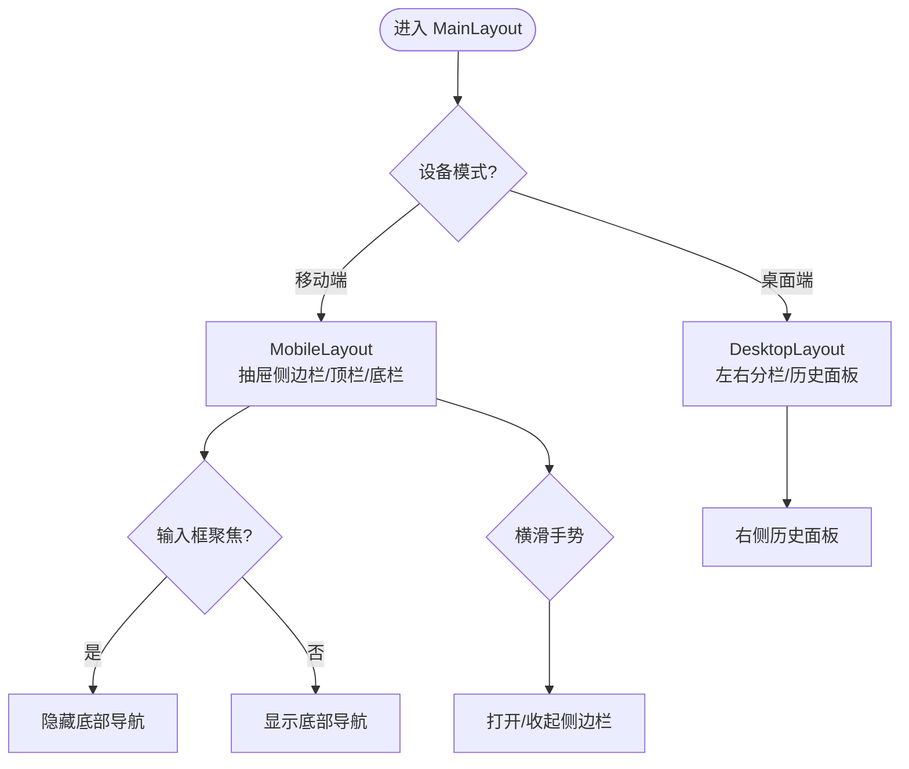

图表来源
- [src/components/layout/MainLayout.tsx:59-295](file://src/components/layout/MainLayout.tsx#L59-L295)

章节来源
- [src/components/layout/MainLayout.tsx:59-295](file://src/components/layout/MainLayout.tsx#L59-L295)

### 资产库（LibraryPanel）
- 资产类型：应用（artifact HTML）、文档（markdown）、图片。
- 筛选与网格展示：按 kind 过滤，响应式网格布局。
- 预览模式：artifact 用 iframe 安全沙箱执行；markdown 使用 Markdown 渲染；图片大图展示。
- 交互：长按弹出菜单（重命名/删除），悬浮移除按钮，桌面端沉浸式预览与 Esc 退出。
- 下载：aishop-blob 引用先取 blob 再创建临时 URL 下载。

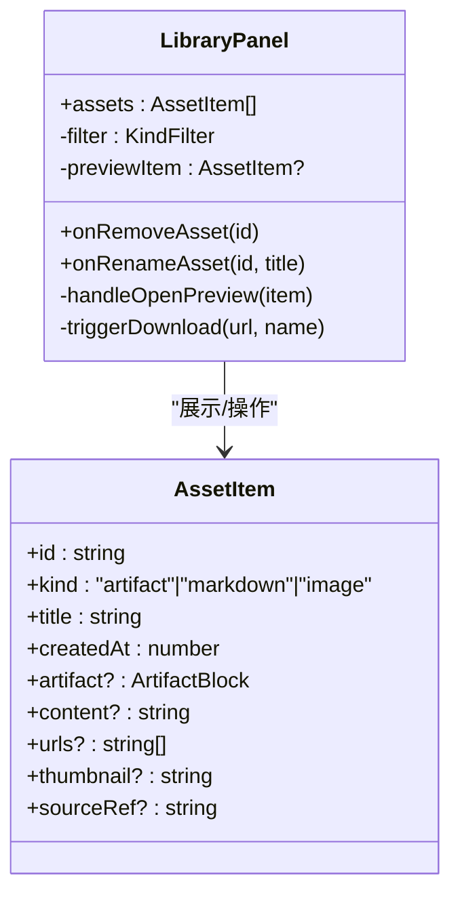

图表来源
- [src/components/artifact/LibraryPanel.tsx:164-534](file://src/components/artifact/LibraryPanel.tsx#L164-L534)
- [src/types/index.ts:143-167](file://src/types/index.ts#L143-L167)

章节来源
- [src/components/artifact/LibraryPanel.tsx:164-534](file://src/components/artifact/LibraryPanel.tsx#L164-L534)
- [src/types/index.ts:143-167](file://src/types/index.ts#L143-L167)

### 资产 Hook（useAssets）
- 状态管理：维护 assets 列表，首次加载 listAssets。
- 保存流程：先更新本地 state，再异步落库，成功后刷新并 3 秒防抖触发 safeSync。
- Markdown 保存：检测是否已存在源消息，避免重复；调用标题生成器生成标题后落库。
- 图片保存：从图片历史项构造资产条目并入库。
- 删除/重命名：即时更新 UI，异步落库并触发同步。

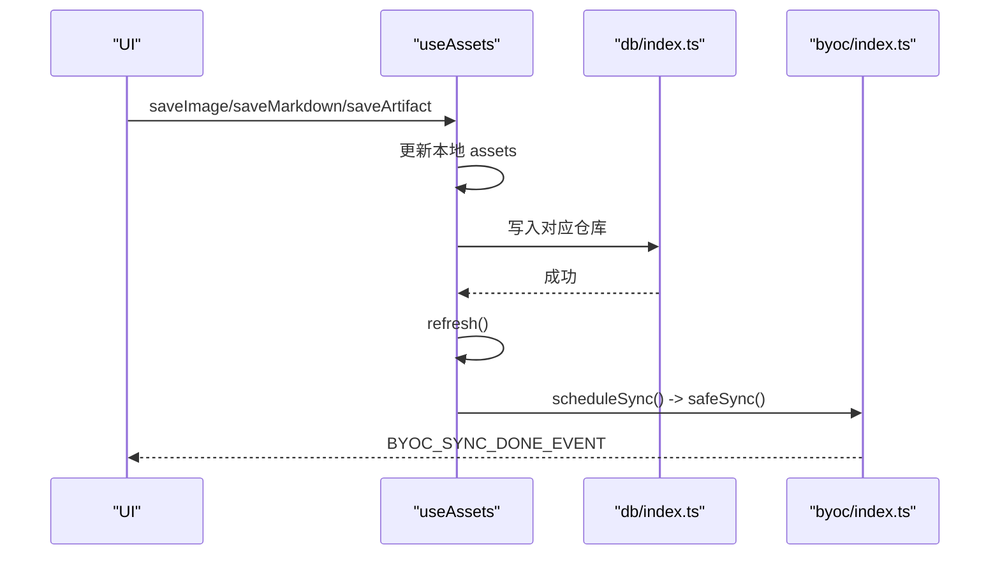

图表来源
- [src/hooks/useAssets.ts:24-175](file://src/hooks/useAssets.ts#L24-L175)
- [src/services/byoc/index.ts:185-198](file://src/services/byoc/index.ts#L185-L198)

章节来源
- [src/hooks/useAssets.ts:24-175](file://src/hooks/useAssets.ts#L24-L175)

### 流式对话 API（api.ts）
- 构建消息：插入 system 提示词与搜索上下文，将消息中的 aishop-blob 引用还原为 data URL。
- 发送请求：POST chat/completions，开启 stream，尝试 include_usage 获取真实用量，不支持则降级重试。
- 流式解析：逐行解析 SSE，提取 delta.content 与 usage，yield 内容片段，结束时回调用量。
- 错误处理：非 2xx 且包含特定字段时去掉 usage 参数重试；其他错误抛出。

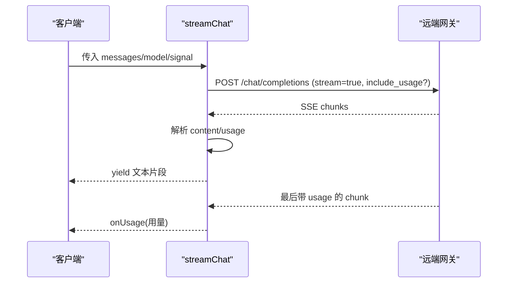

图表来源
- [src/services/api.ts:44-173](file://src/services/api.ts#L44-L173)

章节来源
- [src/services/api.ts:44-173](file://src/services/api.ts#L44-L173)

### BYOC 同步（byoc/index.ts）
- 配置校验与连通性测试：endpoint/bucket/accessKey/secretKey 必填，listObjects 验证网络与权限。
- 增量同步：先拉后推，合并统计；多标签页通过 Web Locks 串行。
- 删除传播：记录本地 tombstone，确保删除能同步到云端。
- 自动调度：启动延迟拉取、60 秒轮询待同步量、前台可见时拉取、bfcache 恢复兜底。
- 事件：BYOC_STATUS_EVENT、BYOC_SYNC_DONE_EVENT、SETTINGS_SYNCED_EVENT。

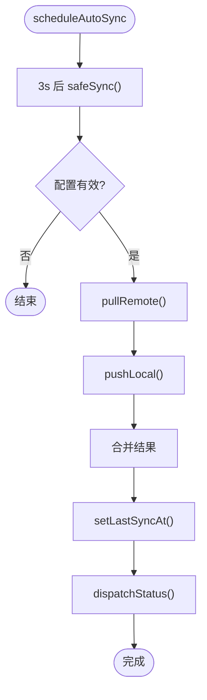

图表来源
- [src/services/byoc/index.ts:210-249](file://src/services/byoc/index.ts#L210-L249)
- [src/services/byoc/index.ts:103-137](file://src/services/byoc/index.ts#L103-L137)

章节来源
- [src/services/byoc/index.ts:33-249](file://src/services/byoc/index.ts#L33-L249)

### 数据库（db/index.ts, db/open.ts）
- 统一出口：集中导出会话、消息、上下文、检索、图片历史、收藏、资产、角色等仓库方法。
- 连接与迁移：openDB 初始化对象仓库与索引，版本升级时迁移旧收藏至资产表。
- 写入串行化：同会话消息写入串行，避免流式输出期间并发写冲突；Safari IDB 异常重连重试。

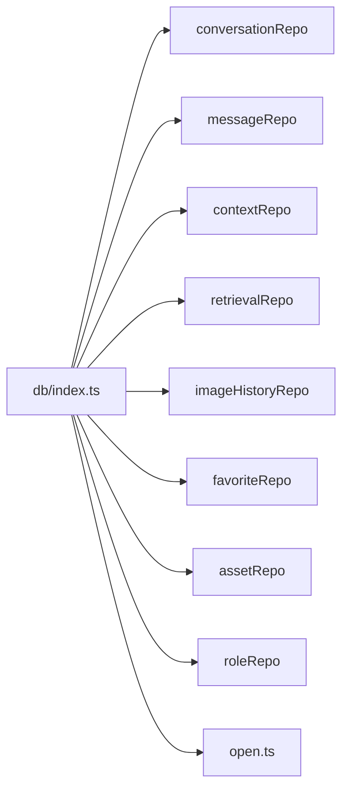

图表来源
- [src/db/index.ts:1-123](file://src/db/index.ts#L1-L123)
- [src/db/open.ts:1-90](file://src/db/open.ts#L1-L90)

章节来源
- [src/db/index.ts:1-123](file://src/db/index.ts#L1-L123)
- [src/db/open.ts:1-90](file://src/db/open.ts#L1-L90)

### 桌面端（electron/main/index.ts）
- 窗口与托盘：隐藏默认菜单，自定义标题栏覆盖色，最小化到托盘，点击托盘显示/聚焦。
- 自动更新：检查/下载/安装更新，渲染进程通过 IPC 触发。
- 外部链接：openExternal 打开系统默认浏览器。
- 拖拽：支持图片原生拖拽到桌面，生成缩略图作为 drag visual。
- 协议与 CORS：注册 local-image:// 协议，添加跨域响应头。

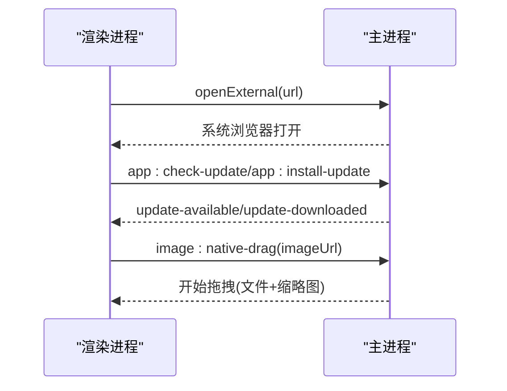

图表来源
- [electron/main/index.ts:80-146](file://electron/main/index.ts#L80-L146)
- [electron/main/index.ts:236-274](file://electron/main/index.ts#L236-L274)

章节来源
- [electron/main/index.ts:1-285](file://electron/main/index.ts#L1-L285)

## 依赖关系分析
- 组件耦合：App 聚合各 Hook 与服务，MainLayout 仅关注布局与交互，LibraryPanel 专注资产展示与操作，职责清晰。
- 数据流向：UI → Hook/Service → DB；BYOC 在写路径后触发异步同步，事件驱动 UI 刷新。
- 外部依赖：Vite/React/TypeScript、Tailwind、IDB、Capacitor、Electron、electron-updater 等。
- 潜在循环：当前未发现循环依赖；db/index.ts 作为唯一数据出口，降低耦合。

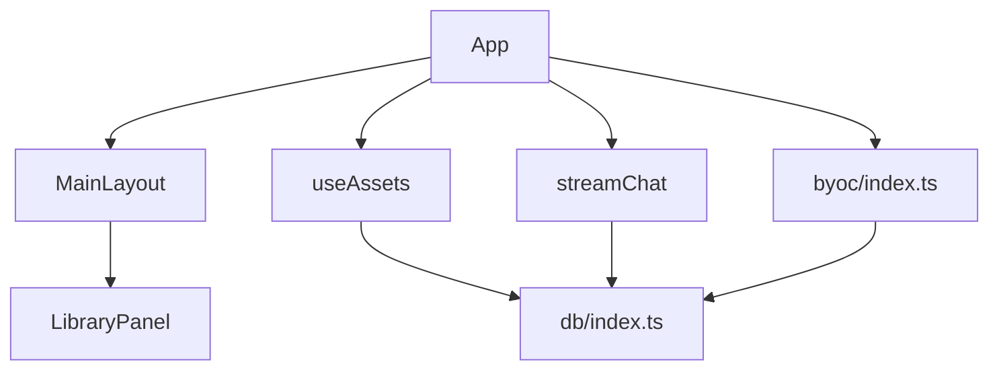

图表来源
- [src/App.tsx:1-303](file://src/App.tsx#L1-L303)
- [src/components/layout/MainLayout.tsx:1-295](file://src/components/layout/MainLayout.tsx#L1-L295)
- [src/components/artifact/LibraryPanel.tsx:1-534](file://src/components/artifact/LibraryPanel.tsx#L1-L534)
- [src/hooks/useAssets.ts:1-175](file://src/hooks/useAssets.ts#L1-L175)
- [src/services/api.ts:1-173](file://src/services/api.ts#L1-L173)
- [src/services/byoc/index.ts:1-249](file://src/services/byoc/index.ts#L1-L249)
- [src/db/index.ts:1-123](file://src/db/index.ts#L1-L123)

章节来源
- [package.json:1-97](file://package.json#L1-L97)

## 性能考量
- 流式输出：SSE 逐块解析，减少首屏等待；usage 仅在末尾或特定 chunk 出现，需逐行检查。
- 写入串行化：同会话消息写入串行，避免流式更新竞争；Safari IDB 异常自动重连。
- 资源内联：发送前将 aishop-blob 转为 data URL，避免模型无法读取本地引用；按需内联，避免整段历史内存膨胀。
- 同步节流：资产变更后 3 秒防抖触发 BYOC 同步，降低频繁网络请求。
- 自动同步：60 秒轮询待同步量，前台可见时拉取，兼顾实时性与能耗。
- 图片拖拽：Electron 下生成缩略图作为 drag visual，提升用户体验。

[本节为通用性能建议，不直接分析具体文件]

## 故障排查指南
- API 请求失败：检查 provider 配置与 API Key；若网关不支持 include_usage，会自动降级重试；确认网络与 CORS。
- BYOC 同步失败：校验 endpoint/bucket/accessKey/secretKey；使用 testConnection 验证连通性；查看 pending 数量与 lastSyncAt。
- 数据库异常：Safari IDB UnknownError 会重开连接重试；如仍失败，检查对象仓库与索引是否存在。
- 图片无法下载：确认 aishop-blob 引用对应的 blob 存在；Electron 下检查 local-image 协议与文件路径。
- 更新不可用：开发环境无发布源会静默失败；生产环境检查 electron-updater 配置与 GitHub Release。

章节来源
- [src/services/api.ts:102-118](file://src/services/api.ts#L102-L118)
- [src/services/byoc/index.ts:42-56](file://src/services/byoc/index.ts#L42-L56)
- [src/db/open.ts:1-90](file://src/db/open.ts#L1-L90)
- [electron/main/index.ts:208-223](file://electron/main/index.ts#L208-L223)
- [electron/main/index.ts:236-274](file://electron/main/index.ts#L236-L274)

## 结论
本系统以 React + Vite 为核心，结合 IndexedDB 本地持久化与 BYOC 可选云同步，实现了聊天、图像、视频、音乐等多模态能力的统一入口，并通过“我的库”提供资产沉淀与管理。Electron 与 Capacitor 使应用具备跨端原生体验。整体架构清晰、职责分离良好，具备良好的扩展性与可维护性。

[本节为总结性内容，不直接分析具体文件]

## 附录
- 技术栈概览：React、TypeScript、Vite、Tailwind、IDB、Capacitor、Electron、electron-updater。
- 关键脚本：dev/build/lint/preview、dev:electron/build:electron/package:win。
- 目标产物：Windows NSIS 安装包，图标资源打包。

章节来源
- [package.json:36-95](file://package.json#L36-L95)