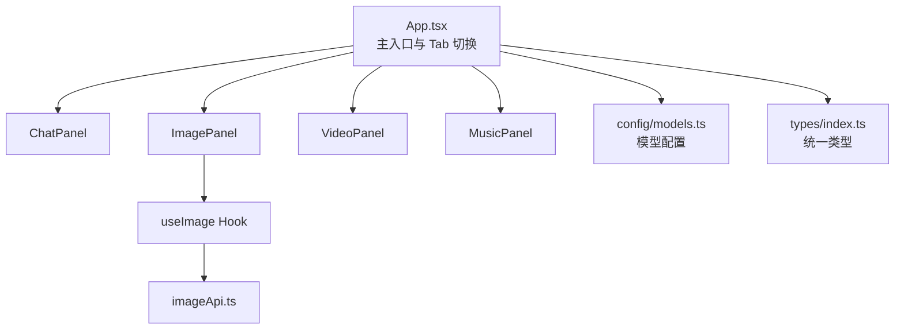
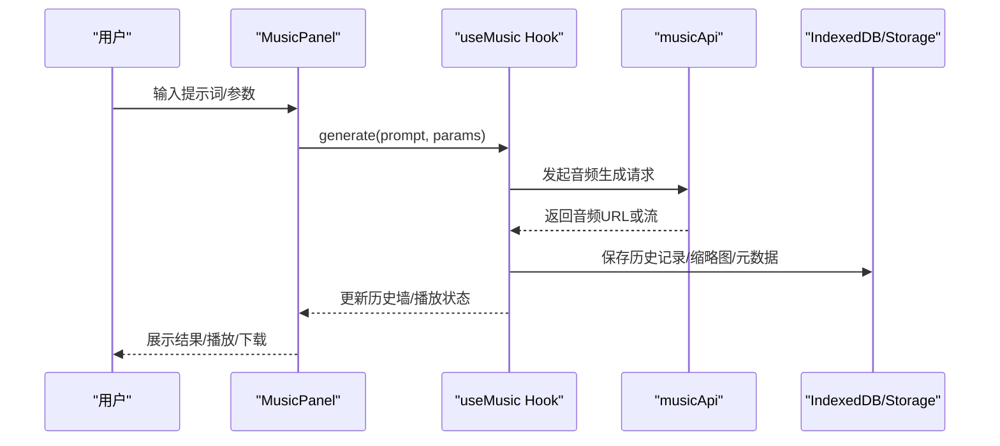
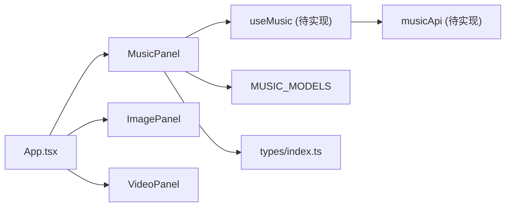

# 音乐创作面板

<cite>
**本文引用的文件**
- [MusicPanel.tsx](file://src/components/music/MusicPanel.tsx)
- [App.tsx](file://src/App.tsx)
- [models.ts](file://src/config/models.ts)
- [types/index.ts](file://src/types/index.ts)
- [api.ts](file://src/services/api.ts)
- [imageApi.ts](file://src/services/imageApi.ts)
- [useImage.ts](file://src/hooks/useImage.ts)
- [ImagePanel.tsx](file://src/components/image/ImagePanel.tsx)
- [VideoPanel.tsx](file://src/components/video/VideoPanel.tsx)
- [需求文档.md](file://需求文档.md)
</cite>

## 目录
1. [简介](#简介)
2. [项目结构](#项目结构)
3. [核心组件](#核心组件)
4. [架构总览](#架构总览)
5. [详细组件分析](#详细组件分析)
6. [依赖关系分析](#依赖关系分析)
7. [性能考虑](#性能考虑)
8. [故障排查指南](#故障排查指南)
9. [结论](#结论)
10. [附录：未来扩展与最佳实践](#附录未来扩展与最佳实践)

## 简介
本技术文档面向 AIShop 项目的“音乐创作面板”（MusicPanel），基于现有代码库对组件架构、预留接口、状态管理、API 集成点与扩展机制进行系统化说明，并结合图片/视频面板的实现模式，给出音频生成方案、多媒体模块整体设计思路以及未来功能扩展的开发指南。

## 项目结构
AIShop 采用前端模块化组织方式：
- 路由与页面挂载：由 App 根据 activeTab 切换不同功能面板（聊天、图片、视频、收藏、设置等）。当前 MusicPanel 已存在但处于占位状态。
- 配置层：模型列表按类型划分（chat/image/video/music），为各面板提供模型选择能力。
- 服务层：统一的 API 调用封装（如 chat 流式请求、图片生成），可类比扩展至音频生成。
- 类型定义：集中定义消息、媒体项、用量等数据结构，便于跨模块复用。
- UI 组件：以功能域划分（chat/image/video/music），每个面板负责自身交互与展示。

图表来源
- [App.tsx:58-95](file://src/App.tsx#L58-L95)
- [models.ts:275-283](file://src/config/models.ts#L275-L283)
- [types/index.ts:134-141](file://src/types/index.ts#L134-L141)

章节来源
- [App.tsx:58-95](file://src/App.tsx#L58-L95)
- [models.ts:275-283](file://src/config/models.ts#L275-L283)
- [types/index.ts:134-141](file://src/types/index.ts#L134-L141)

## 核心组件
- MusicPanel：当前为占位组件，仅显示“即将上线”。后续将承载音频生成、播放、下载、历史管理等能力。
- App：负责 Tab 切换与全局状态（主题、持久化存储申请等），并预留了 music 的渲染分支位置（当前未注册到 switch）。
- 模型配置：MUSIC_MODELS 已预留为空数组，getModelsByType 支持 music 类型。
- 类型系统：MediaItem.type 包含 'audio'，可用于统一表示音频产物；MessageVersion 等结构也可用于记录音频任务上下文。

章节来源
- [MusicPanel.tsx:1-7](file://src/components/music/MusicPanel.tsx#L1-L7)
- [App.tsx:58-95](file://src/App.tsx#L58-L95)
- [models.ts:272-283](file://src/config/models.ts#L272-L283)
- [types/index.ts:134-141](file://src/types/index.ts#L134-L141)

## 架构总览
音乐面板的架构应遵循“面板 + Hook + Service + 类型”的分层模式，与图片面板保持一致：
- 面板层（MusicPanel）：负责 UI 交互（输入、参数选择、结果展示、下载、历史浏览）。
- Hook 层（useMusic）：封装状态管理、并发队列、本地持久化（IndexedDB）、与后端 API 的交互。
- 服务层（musicApi）：封装音频生成 API 的请求构建、响应解析、错误处理、超时控制。
- 类型层（types）：统一 MediaItem、AudioHistoryItem、PendingAudioTask 等类型。

图表来源
- [useImage.ts:274-356](file://src/hooks/useImage.ts#L274-L356)
- [imageApi.ts:149-243](file://src/services/imageApi.ts#L149-L243)
- [types/index.ts:134-141](file://src/types/index.ts#L134-L141)

## 详细组件分析

### MusicPanel 组件现状与扩展点
- 现状：纯占位组件，无业务逻辑。
- 扩展点：
  - 接入模型选择器（复用 ModelSelector），从 MUSIC_MODELS 获取可用模型。
  - 实现输入区（提示词、时长、风格、采样率等参数）。
  - 实现音频墙（参考 ImagePanel 的照片墙模式），支持播放、下载、删除。
  - 实现并发任务队列（loading/error/retry/cancel），参考 useImage 的任务管理。
  - 实现 IndexedDB 持久化（历史、缩略图、元数据）。

章节来源
- [MusicPanel.tsx:1-7](file://src/components/music/MusicPanel.tsx#L1-L7)
- [ImagePanel.tsx:369-800](file://src/components/image/ImagePanel.tsx#L369-L800)
- [useImage.ts:274-469](file://src/hooks/useImage.ts#L274-L469)

### 状态管理与并发队列
- 建议状态字段：
  - selectedModel：当前选中的音乐模型
  - uploadedInputs：上传的参考音频/文本（可选）
  - aspectRatio/size/quality：映射为音频相关参数（如时长、格式、质量）
  - pendingTasks：待处理/失败任务队列
  - history：历史音频列表
- 并发控制：
  - 使用 AbortController 管理取消与超时
  - 任务完成后写入历史并落库，避免内存泄漏
- 参考实现：useImage 的 executeTask/generate/retryTask/cancelTask/dimensions 回填

章节来源
- [useImage.ts:123-469](file://src/hooks/useImage.ts#L123-L469)

### API 集成点与服务封装
- 音频生成 API 建议：
  - 建立 musicApi.ts，参照 imageApi.ts 的结构：
    - 模型到端点的映射表
    - 请求体构建函数（兼容多上游）
    - 响应解析（提取音频 URL 或 base64）
    - 错误处理与超时控制
- 鉴权与配置：
  - 通过 settingsService.getProvider/getApiKey 获取配置
  - 使用 getProviderConfig 拼接基础 URL
- 流式输出（可选）：
  - 若上游支持流式音频片段，可参考 api.ts 的 streamChat 模式，逐步推送片段并合并播放

章节来源
- [imageApi.ts:1-257](file://src/services/imageApi.ts#L1-L257)
- [api.ts:44-173](file://src/services/api.ts#L44-L173)

### 与多媒体模块的整体设计
- 统一类型：MediaItem.type 包含 'audio'，用于统一历史与展示
- 统一存储：IndexedDB 存放二进制资源（音频文件、缩略图），URL 以 aishop-blob:<id> 引用
- 统一下载：参考 ImagePanel 的 triggerDownload，先取 blob 再生成临时 object URL 触发下载
- 统一展示：音频墙卡片支持播放、下载、删除，与照片墙一致

章节来源
- [types/index.ts:134-141](file://src/types/index.ts#L134-L141)
- [ImagePanel.tsx:66-92](file://src/components/image/ImagePanel.tsx#L66-L92)

## 依赖关系分析
- MusicPanel 依赖：
  - 模型配置（MUSIC_MODELS）
  - 类型定义（MediaItem、MessageVersion 等）
  - 服务层（musicApi，待实现）
  - Hook（useMusic，待实现）
- 与 App 的关系：
  - App 需将 music 纳入 Tab 切换（当前未在 renderContent 中处理 music）
- 与图片/视频面板的关系：
  - 复用 UI 模式（输入区、结果墙、下载、历史）
  - 复用 Hook 模式（并发队列、持久化、错误处理）

图表来源
- [App.tsx:58-95](file://src/App.tsx#L58-L95)
- [models.ts:272-283](file://src/config/models.ts#L272-L283)
- [types/index.ts:134-141](file://src/types/index.ts#L134-L141)

章节来源
- [App.tsx:58-95](file://src/App.tsx#L58-L95)
- [models.ts:272-283](file://src/config/models.ts#L272-L283)
- [types/index.ts:134-141](file://src/types/index.ts#L134-L141)

## 性能考虑
- 音频文件处理：
  - 优先使用流式传输与分段加载，避免一次性加载大文件
  - 使用 Web Audio API 进行实时分析与可视化（频谱、波形）
- 缓存策略：
  - 对常用音频片段进行浏览器缓存（Cache API 或 IndexedDB）
  - 缩略图与元数据分离存储，减少主线程压力
- 并发控制：
  - 限制同时进行的生成任务数量，避免阻塞 UI
  - 使用 AbortController 及时释放资源
- 渲染优化：
  - 虚拟滚动或分页加载历史音频
  - 懒加载音频播放器实例，按需创建与销毁

[本节为通用性能建议，不直接分析具体文件]

## 故障排查指南
- API 请求失败：
  - 检查 API Key 是否配置正确
  - 查看网络请求状态码与响应体，定位上游错误
  - 区分超时与取消：AbortError 时区分手动取消与超时
- 音频无法播放：
  - 检查 MIME 类型与编码格式是否受浏览器支持
  - 确认 URL 是否为有效 blob/data URI
- 下载失败：
  - 确保先获取 blob 再生成临时 URL
  - 注意临时 URL 的撤销时机，避免过早释放导致下载失败
- 历史数据不一致：
  - 检查 IndexedDB 读写是否成功
  - 确认 URL 引用格式（aishop-blob:<id>）是否正确

章节来源
- [imageApi.ts:183-243](file://src/services/imageApi.ts#L183-L243)
- [api.ts:102-173](file://src/services/api.ts#L102-L173)
- [ImagePanel.tsx:66-92](file://src/components/image/ImagePanel.tsx#L66-L92)

## 结论
MusicPanel 当前为占位组件，但项目已具备完善的架构基础与可扩展性。通过借鉴 ImagePanel 的实现模式，可以快速构建功能完整的音乐创作面板。建议优先实现 useMusic Hook 与 musicApi 服务，完善类型定义与持久化逻辑，再逐步丰富 UI 交互与高级功能。

[本节为总结性内容，不直接分析具体文件]

## 附录：未来扩展与最佳实践

### 音频合成与音效处理
- 音频合成：
  - 使用 Web Audio API 的 OscillatorNode、GainNode 等节点进行实时合成
  - 结合 MIDI 事件驱动音符生成，支持音阶、节奏、和弦
- 音效处理：
  - 使用 ConvolverNode 实现混响效果
  - 使用 BiquadFilterNode 实现均衡器与滤波器
  - 使用 DynamicsCompressorNode 控制动态范围
- 格式转换：
  - 使用 MediaRecorder 录制音频流并导出为 WAV/MP3
  - 使用 OfflineAudioContext 进行离线渲染与批量处理

### 集成方案
- 服务层：
  - 在 musicApi.ts 中封装音频生成 API，支持多种上游模型
  - 实现请求重试、超时控制、错误上报
- Hook 层：
  - 在 useMusic.ts 中管理状态、并发队列、持久化
  - 提供 generate、retry、cancel、download 等对外接口
- 组件层：
  - 在 MusicPanel.tsx 中实现输入区、参数选择、结果展示、下载按钮
  - 复用 ImagePanel 的 UI 模式，保持体验一致性

### 最佳实践
- 用户体验：
  - 提供进度反馈与错误提示
  - 支持取消与重试操作
  - 提供预览与下载功能
- 性能优化：
  - 使用 Web Worker 处理耗时计算
  - 合理使用缓存策略，减少重复请求
  - 优化音频解码与播放性能
- 安全性：
  - 验证用户输入，防止恶意代码注入
  - 安全处理外部音频源，避免 XSS 攻击
  - 定期清理临时文件与缓存

[本节为概念性指导，不直接分析具体文件]