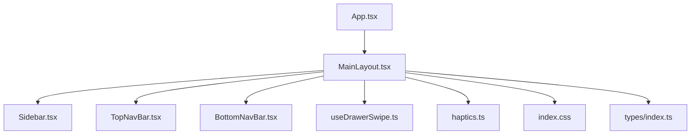
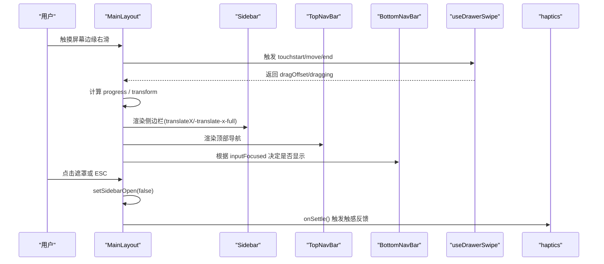
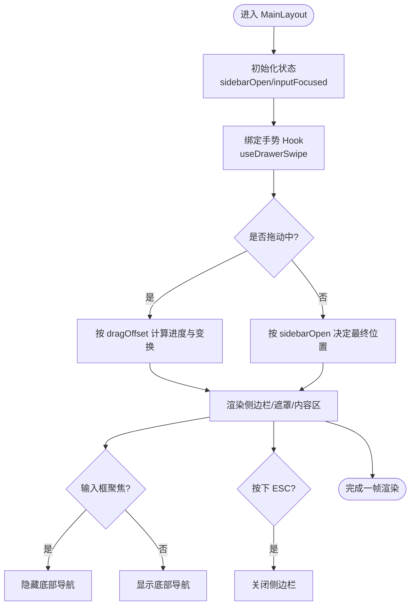
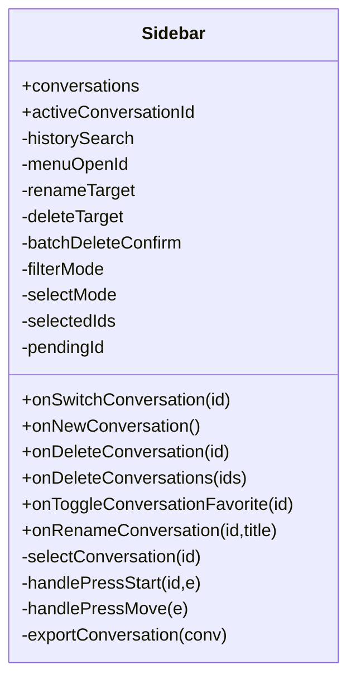
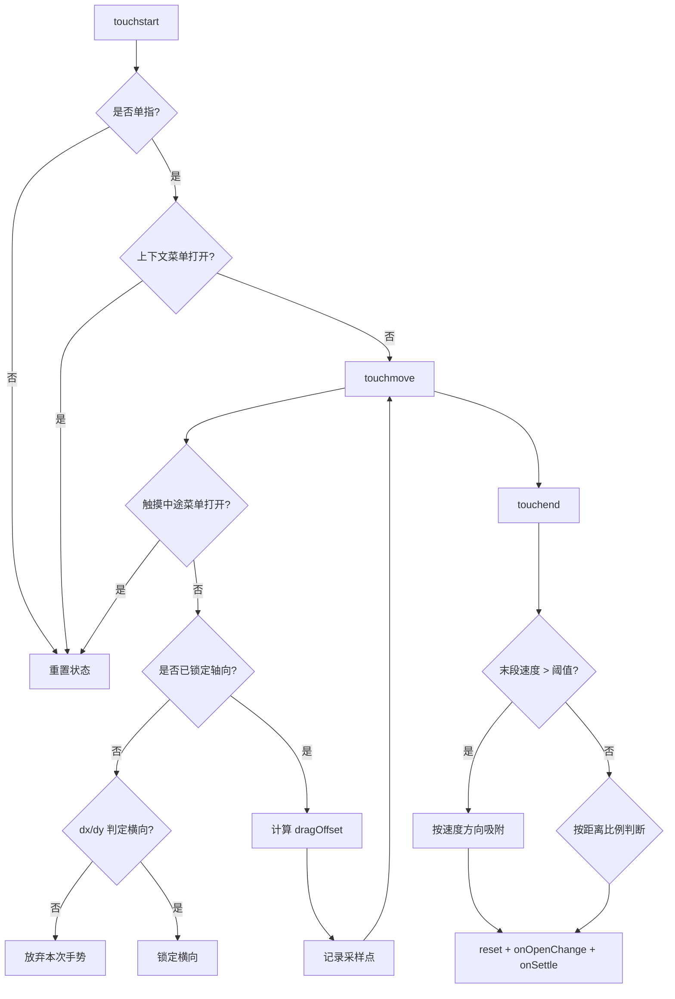
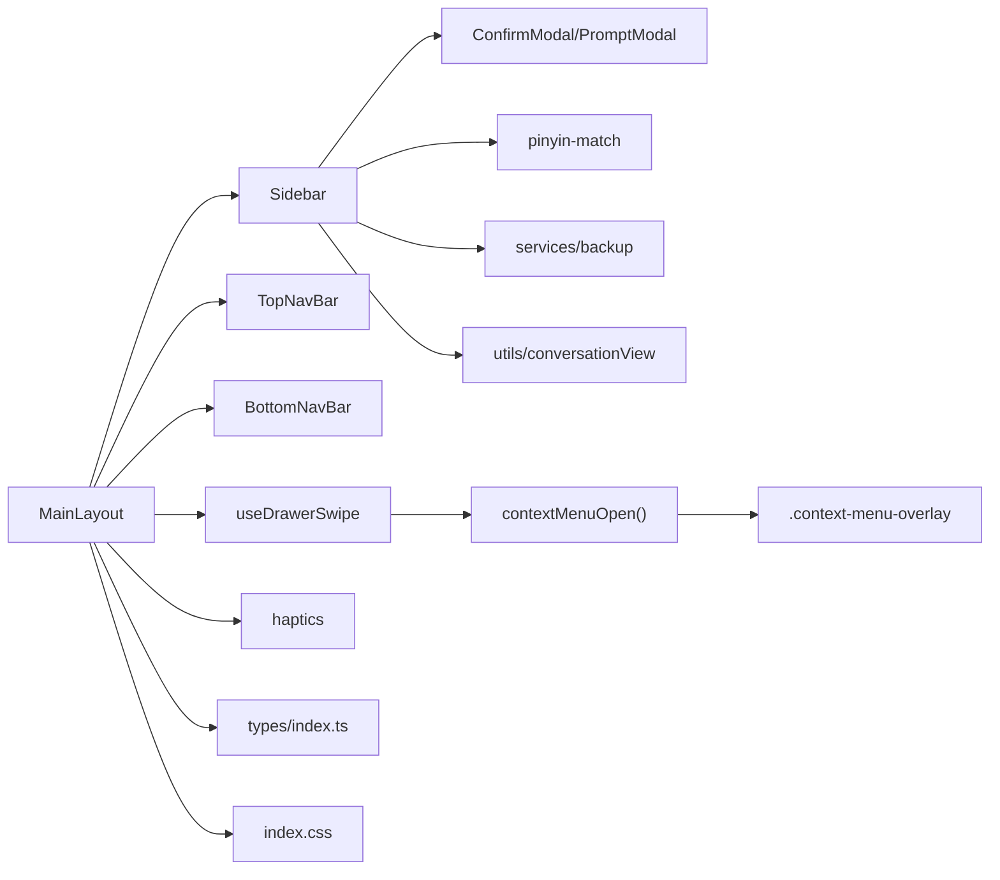

# 布局组件设计

<cite>
**本文引用的文件**
- [MainLayout.tsx](file://src/components/layout/MainLayout.tsx)
- [Sidebar.tsx](file://src/components/layout/Sidebar.tsx)
- [TopNavBar.tsx](file://src/components/layout/TopNavBar.tsx)
- [BottomNavBar.tsx](file://src/components/layout/BottomNavBar.tsx)
- [useDrawerSwipe.ts](file://src/hooks/useDrawerSwipe.ts)
- [haptics.ts](file://src/utils/haptics.ts)
- [index.css](file://src/index.css)
- [App.tsx](file://src/App.tsx)
- [types/index.ts](file://src/types/index.ts)
- [MessageBubble.tsx](file://src/components/chat/MessageBubble.tsx)
</cite>

## 更新摘要
**所做更改**
- 更新了 useDrawerSwipe 钩子的防御性编程实现，防止抽屉滑动手势干扰上下文菜单交互
- 在 touchstart 和 touchmove 处理器中添加了 contextMenuOpen() 检查
- 增强了手势冲突检测机制，确保上下文菜单打开时禁用抽屉滑动
- 更新了手势处理流程图和相关章节

## 目录
1. [简介](#简介)
2. [项目结构](#项目结构)
3. [核心组件](#核心组件)
4. [架构总览](#架构总览)
5. [详细组件分析](#详细组件分析)
6. [依赖关系分析](#依赖关系分析)
7. [性能考量](#性能考量)
8. [故障排查指南](#故障排查指南)
9. [结论](#结论)
10. [附录：Props 与事件契约](#附录props-与事件契约)

## 简介
本设计文档聚焦 AIShop 的布局体系，围绕 MainLayout、Sidebar、TopNavBar、BottomNavBar 四大核心布局组件展开，系统性说明响应式布局策略、移动端适配方案、手势交互实现（侧边栏抽屉、滑动手势、长按上下文菜单）、状态管理机制、无障碍与键盘导航、样式系统以及最佳实践与性能优化建议。目标是帮助开发者快速理解并扩展布局层，同时保证在移动端获得流畅、可访问且一致的体验。

## 项目结构
布局相关代码集中在 src/components/layout 下，配合 hooks 与 utils 提供手势与触感能力，全局样式通过 index.css 统一主题与动画。应用入口 App.tsx 将布局与业务面板组合，类型定义集中于 types/index.ts。

图表来源
- [App.tsx:97-128](file://src/App.tsx#L97-L128)
- [MainLayout.tsx:1-205](file://src/components/layout/MainLayout.tsx#L1-L205)
- [Sidebar.tsx:1-557](file://src/components/layout/Sidebar.tsx#L1-L557)
- [TopNavBar.tsx:1-168](file://src/components/layout/TopNavBar.tsx#L1-L168)
- [BottomNavBar.tsx:1-38](file://src/components/layout/BottomNavBar.tsx#L1-L38)
- [useDrawerSwipe.ts:1-240](file://src/hooks/useDrawerSwipe.ts#L1-L240)
- [haptics.ts:1-60](file://src/utils/haptics.ts#L1-L60)
- [index.css:1-382](file://src/index.css#L1-L382)
- [types/index.ts:125-175](file://src/types/index.ts#L125-L175)

章节来源
- [App.tsx:97-128](file://src/App.tsx#L97-L128)
- [MainLayout.tsx:1-205](file://src/components/layout/MainLayout.tsx#L1-L205)

## 核心组件
- MainLayout：整体布局容器，管理侧边栏打开状态、输入框聚焦隐藏底部导航、ESC 关闭侧边栏、冻结视口高度避免键盘弹起抖动、横向滑动手势驱动抽屉开关与遮罩透明度、渲染 TopNavBar/BotomNavBar 与内容区。
- Sidebar：会话列表、搜索过滤、时间分组、批量选择与删除、长按上下文菜单（Portal + 自适应定位）、重命名与确认弹窗、导出功能。
- TopNavBar：汉堡菜单、模型选择器、上下文用量环与详情面板、新建对话按钮。
- BottomNavBar：底部 Tab 切换（对话/收藏/我的），支持安全区域适配。

章节来源
- [MainLayout.tsx:45-205](file://src/components/layout/MainLayout.tsx#L45-L205)
- [Sidebar.tsx:29-557](file://src/components/layout/Sidebar.tsx#L29-L557)
- [TopNavBar.tsx:34-168](file://src/components/layout/TopNavBar.tsx#L34-L168)
- [BottomNavBar.tsx:15-38](file://src/components/layout/BottomNavBar.tsx#L15-L38)

## 架构总览
布局采用"容器 + 子面板"的分层模式：
- 容器 MainLayout 负责全局状态（侧边栏开闭、输入聚焦、手势）与布局结构。
- 子面板 Sidebar/TopNavBar/BottomNavBar 各自维护局部 UI 状态（如菜单、面板、Tab）。
- 手势由自定义 Hook useDrawerSwipe 抽象，封装原生 TouchEvent 监听、主轴判定、速度/距离吸附逻辑。
- 样式系统基于 Tailwind 与 CSS 变量主题，统一颜色、滚动条、动画与响应式行为。

图表来源
- [MainLayout.tsx:108-171](file://src/components/layout/MainLayout.tsx#L108-L171)
- [useDrawerSwipe.ts:107-197](file://src/hooks/useDrawerSwipe.ts#L107-L197)
- [haptics.ts:49-59](file://src/utils/haptics.ts#L49-L59)

## 详细组件分析

### MainLayout：布局中枢与手势集成
- 职责
  - 管理侧边栏打开状态与手势驱动的位移。
  - 处理输入框聚焦时隐藏底部导航，避免遮挡输入。
  - 监听 ESC 关闭侧边栏，提升键盘可达性。
  - 冻结初始视口高度，防止键盘弹出导致 dvh 变化引起的页面收缩。
  - 通过遮罩透明度与 translateX 联动，提供平滑过渡。
- 关键实现要点
  - 使用 useDrawerSwipe 获取 dragging/dragOffset/shouldSuppressClick，并在拖动中禁用 CSS transition 以保证跟手。
  - 遮罩层在拖拽过程中阻止点击穿透，避免误关。
  - 顶部导航仅在传入 models 等必要 props 时渲染，保持按需加载。
  - 主内容区 data-swipe-ignore 用于在特定 Tab 屏蔽手势接管。
- 无障碍与键盘
  - ESC 关闭侧边栏。
  - 输入聚焦时隐藏底部导航，减少遮挡。
- 性能
  - 冻结视口高度避免重排。
  - 拖动期间仅更新 transform，减少布局抖动。

图表来源
- [MainLayout.tsx:74-118](file://src/components/layout/MainLayout.tsx#L74-L118)
- [MainLayout.tsx:120-201](file://src/components/layout/MainLayout.tsx#L120-L201)

章节来源
- [MainLayout.tsx:74-201](file://src/components/layout/MainLayout.tsx#L74-201)

### Sidebar：会话管理与上下文菜单
- 职责
  - 会话列表展示、搜索过滤（含拼音匹配）、时间分组。
  - 批量选择与删除、收藏切换、导出、重命名。
  - 长按上下文菜单（Portal 到 body，固定定位，自适应可视区域）。
- 关键实现要点
  - 延迟切换：点击项先本地高亮，短暂停顿后真正切换，提升反馈感。
  - 长按菜单：记录指针坐标，Portal 渲染菜单与遮罩，useLayoutEffect 计算位置，避免被 overflow 裁剪。
  - 筛选与分组：排除空会话，支持"所有/收藏"切换；按今天/昨天/本月/更早分组。
  - 批量操作：进入选择模式后可多选，确认后批量删除。
- 无障碍与键盘
  - 按钮具备 title 提示。
  - 菜单通过 Portal 与遮罩管理焦点外点击关闭。
- 性能
  - 使用 useMemo 缓存过滤与分组结果。
  - 列表项避免不必要的重渲染。

图表来源
- [Sidebar.tsx:12-25](file://src/components/layout/Sidebar.tsx#L12-L25)
- [Sidebar.tsx:29-80](file://src/components/layout/Sidebar.tsx#L29-L80)
- [Sidebar.tsx:109-205](file://src/components/layout/Sidebar.tsx#L109-L205)
- [Sidebar.tsx:220-263](file://src/components/layout/Sidebar.tsx#L220-L263)
- [Sidebar.tsx:267-281](file://src/components/layout/Sidebar.tsx#L267-L281)
- [Sidebar.tsx:283-557](file://src/components/layout/Sidebar.tsx#L283-L557)

章节来源
- [Sidebar.tsx:29-557](file://src/components/layout/Sidebar.tsx#L29-L557)

### TopNavBar：导航与上下文用量
- 职责
  - 左侧：汉堡菜单、模型选择器、上下文用量环。
  - 右侧：新建对话按钮（受 canCreateNewConversation 控制）。
  - 上下文用量环点击打开详情面板，支持压缩与查看片段。
- 关键实现要点
  - 面板打开时通过遮罩与 Esc 关闭，确保焦点外点击可关闭。
  - ContextRing key 随 conversationId 变化重置填充动画。
- 无障碍与键盘
  - 按钮具备 title 与可点击态。
  - Esc 关闭面板。
- 性能
  - 条件渲染 ContextPanel 与遮罩，减少无关渲染。

章节来源
- [TopNavBar.tsx:34-168](file://src/components/layout/TopNavBar.tsx#L34-L168)

### BottomNavBar：底部 Tab 导航
- 职责
  - 展示三个主要 Tab：对话、收藏、我的。
  - 当前激活项高亮，点击切换 activeTab。
- 关键实现要点
  - 使用 safe-area-inset-bottom 适配刘海屏/底部横条。
  - 图标填充区分激活态。
- 无障碍与键盘
  - 按钮元素默认可聚焦，适合键盘导航。

章节来源
- [BottomNavBar.tsx:15-38](file://src/components/layout/BottomNavBar.tsx#L15-L38)

### 手势与抽屉：useDrawerSwipe

**已更新** 增强了防御性编程以防止抽屉滑动手势与上下文菜单交互冲突

- 职责
  - 监听 touchstart/touchmove/touchend，实现左右滑动拉出/收起侧边栏。
  - 主轴锁定：首次位移超过阈值判定为横向才接管，纵向则放弃本次手势。
  - 速度优先、距离兜底：末段速度超过阈值直接按方向吸附，否则按打开/关闭比例判断。
  - 忽略目标：输入框、可编辑区域、横向可滚动元素不接管，避免冲突。
  - **新增** 上下文菜单冲突检测：当检测到 .context-menu-overlay 存在时立即重置手势逻辑。
  - 防抖点击：手势结束后短时间内吞掉 click，避免遮罩误关。
- 关键实现要点
  - passive: false 的 touchmove 以调用 preventDefault 阻止页面滚动。
  - 使用 ref 保存 open/onOpenChange/onSettle，避免 effect 频繁解绑。
  - 暴露 dragging/dragOffset/shouldSuppressClick 供父组件驱动 UI。
  - **新增** contextMenuOpen() 辅助函数：查询 .context-menu-overlay 类是否存在。
  - **新增** touchstart 处理器中的防御检查：如果上下文菜单已打开，立即重置手势。
  - **新增** touchmove 处理器中的防御检查：如果触摸中途弹出上下文菜单，放弃本次手势。

图表来源
- [useDrawerSwipe.ts:107-197](file://src/hooks/useDrawerSwipe.ts#L107-L197)
- [useDrawerSwipe.ts:117-140](file://src/hooks/useDrawerSwipe.ts#L117-L140)

章节来源
- [useDrawerSwipe.ts:1-240](file://src/hooks/useDrawerSwipe.ts#L1-L240)

### 触感反馈：haptics
- 职责
  - 在 Android/Chrome 上调用 navigator.vibrate。
  - 在 iOS Safari 上通过隐藏的 switch + label 触发系统触感引擎。
  - 异常捕获，失败静默降级，不影响主流程。
- 使用场景
  - 侧边栏吸附完成时触发一次轻触感，增强交互反馈。

章节来源
- [haptics.ts:1-60](file://src/utils/haptics.ts#L1-L60)

### 上下文菜单系统
- 职责
  - 提供统一的上下文菜单遮罩机制，使用 .context-menu-overlay 类标识。
  - 支持多种场景：Sidebar 会话菜单、MessageBubble 消息菜单、TopNavBar 面板遮罩等。
  - 通过 createPortal 挂载到 document.body，避免被祖先元素的 overflow 裁剪。
- 关键实现要点
  - 遮罩元素添加 touch-none 和 overscroll-none 类，防止手势冲突。
  - 提供 onTouchMove={e => e.preventDefault()} 阻止背景滚动。
  - 支持点击任意位置关闭菜单。
  - 与 useDrawerSwipe 的防御性检查协同工作，确保手势优先级正确。

章节来源
- [Sidebar.tsx:470-478](file://src/components/layout/Sidebar.tsx#L470-L478)
- [MessageBubble.tsx:735-745](file://src/components/chat/MessageBubble.tsx#L735-L745)
- [TopNavBar.tsx:152-159](file://src/components/layout/TopNavBar.tsx#L152-L159)

## 依赖关系分析
- MainLayout 依赖
  - Sidebar：渲染侧边栏并传递会话数据与回调。
  - TopNavBar：渲染顶部导航，传递模型、用量、片段等。
  - BottomNavBar：渲染底部导航，传递 activeTab 与切换回调。
  - useDrawerSwipe：提供手势驱动的状态与 API。
  - haptics：在吸附完成时触发触感。
  - types/index.ts：TabMode、Conversation、Model、ContextSegment 等类型。
- Sidebar 依赖
  - ConfirmModal/PromptModal：通用弹窗。
  - pinyin-match：拼音搜索。
  - services/backup：导出会话。
  - utils/conversationView：消息预览与空会话判断。
- 样式依赖
  - index.css：主题变量、滚动条、动画、安全区域等。

图表来源
- [MainLayout.tsx:1-205](file://src/components/layout/MainLayout.tsx#L1-L205)
- [Sidebar.tsx:1-557](file://src/components/layout/Sidebar.tsx#L1-L557)
- [TopNavBar.tsx:1-168](file://src/components/layout/TopNavBar.tsx#L1-L168)
- [BottomNavBar.tsx:1-38](file://src/components/layout/BottomNavBar.tsx#L1-L38)
- [useDrawerSwipe.ts:1-240](file://src/hooks/useDrawerSwipe.ts#L1-L240)
- [haptics.ts:1-60](file://src/utils/haptics.ts#L1-L60)
- [types/index.ts:125-175](file://src/types/index.ts#L125-L175)
- [index.css:1-382](file://src/index.css#L1-L382)

章节来源
- [MainLayout.tsx:1-205](file://src/components/layout/MainLayout.tsx#L1-L205)
- [Sidebar.tsx:1-557](file://src/components/layout/Sidebar.tsx#L1-L557)

## 性能考量
- 手势与渲染
  - 拖动期间禁用 CSS transition，改用实时 transform，降低重绘成本。
  - 使用 ref 同步最新回调，避免 effect 重复绑定监听。
  - 遮罩与侧边栏使用绝对定位与 transform，避免触发布局。
  - **新增** 上下文菜单检测使用轻量级 DOM 查询，避免性能开销。
- 列表与状态
  - 使用 useMemo 缓存过滤与分组结果，减少重复计算。
  - 延迟切换会话，先本地高亮再执行切换，提升感知流畅度。
- 键盘与视口
  - 冻结初始视口高度，避免键盘弹出导致的页面收缩与重排。
  - 输入聚焦时隐藏底部导航，减少遮挡与重绘。
- 动画与主题
  - 使用 CSS 变量与 Tailwind 类名，减少内联样式复杂度。
  - 动画尽量使用 transform/opacity，利用 GPU 加速。

[本节为通用性能建议，不直接分析具体文件]

## 故障排查指南
- 侧边栏无法拉出
  - 检查是否在输入框/可编辑区域开始手势，会被忽略。
  - 检查父容器是否设置了会阻止滚动的样式或属性。
  - 确认 useDrawerSwipe.enabled 未被关闭。
  - **新增** 检查是否有上下文菜单打开，会阻止手势接管。
- 遮罩点击无效或误关
  - 手势结束后的短时间内会吞掉 click，属正常防抖。
  - 若仍误关，检查 shouldSuppressClick 的使用时机。
- 长按菜单位置错乱或被裁剪
  - 确认菜单通过 createPortal 挂载到 document.body。
  - 检查 useLayoutEffect 是否正确读取 visualViewport 与 offset。
- 底部导航遮挡输入
  - 确认 inputFocused 状态正确切换，必要时增加延迟隐藏。
- 触感无反馈
  - 检查是否在用户手势栈内调用 haptic。
  - iOS 上需确保未被浏览器拦截，异常会被静默捕获。
- **新增** 手势与上下文菜单冲突
  - 确认上下文菜单使用了 .context-menu-overlay 类。
  - 检查 useDrawerSwipe 是否正确检测到上下文菜单状态。
  - 验证 touchstart 和 touchmove 处理器中的防御检查是否生效。

章节来源
- [useDrawerSwipe.ts:44-67](file://src/hooks/useDrawerSwipe.ts#L44-L67)
- [useDrawerSwipe.ts:107-197](file://src/hooks/useDrawerSwipe.ts#L107-L197)
- [useDrawerSwipe.ts:117-140](file://src/hooks/useDrawerSwipe.ts#L117-L140)
- [Sidebar.tsx:148-205](file://src/components/layout/Sidebar.tsx#L148-L205)
- [MainLayout.tsx:78-103](file://src/components/layout/MainLayout.tsx#L78-L103)
- [haptics.ts:49-59](file://src/utils/haptics.ts#L49-L59)

## 结论
AIShop 的布局组件以 MainLayout 为核心，结合 Sidebar、TopNavBar、BottomNavBar 形成完整的移动端布局体系。通过 useDrawerSwipe 实现高性能的手势交互，配合 haptics 提供触觉反馈；样式系统基于主题变量与 Tailwind，保证一致性与可维护性。**最新的防御性编程改进确保了抽屉滑动手势与上下文菜单之间的良好兼容性**，避免了手势冲突问题。整体架构清晰、职责明确，具备良好的可扩展性与可访问性。建议在新增布局特性时遵循现有模式：将手势与状态下沉至 Hook/工具函数，UI 组件保持纯展示与局部状态管理，并通过 Props 接口进行松耦合通信。

[本节为总结性内容，不直接分析具体文件]

## 附录：Props 与事件契约
- MainLayoutProps
  - activeTab、onTabChange：当前标签页与切换回调。
  - children：内容区域。
  - conversations、activeConversationId、onSwitchConversation、onNewConversation、canCreateNewConversation、onDeleteConversation、onDeleteConversations、onToggleConversationFavorite、onRenameConversation：会话管理。
  - models、selectedModel、onModelChange：模型选择。
  - webSearchEnabled、onWebSearchToggle：联网搜索开关。
  - artifactEnabled、onArtifactToggle：Artifact 开关。
  - realUsage、contextLimit、isCompacting、isAwaitingUsage、onCompactActive、segments、onOpenSegment、onDeleteSegment：上下文用量与片段管理。
- SidebarProps
  - conversations、activeConversationId、onSwitchConversation、onNewConversation、onDeleteConversation、onDeleteConversations、onToggleConversationFavorite、onRenameConversation。
- TopNavBarProps
  - onToggleSidebar、models、selectedModel、onModelChange、onNewConversation、canCreateNewConversation、webSearchEnabled、onWebSearchToggle、artifactEnabled、onArtifactToggle、realUsage、contextLimit、isCompacting、isAwaitingUsage、onCompactActive、segments、onOpenSegment、onDeleteSegment、conversationId。
- BottomNavBarProps
  - activeTab、onTabChange。

章节来源
- [MainLayout.tsx:10-43](file://src/components/layout/MainLayout.tsx#L10-L43)
- [Sidebar.tsx:12-21](file://src/components/layout/Sidebar.tsx#L12-L21)
- [TopNavBar.tsx:9-32](file://src/components/layout/TopNavBar.tsx#L9-L32)
- [BottomNavBar.tsx:4-7](file://src/components/layout/BottomNavBar.tsx#L4-L7)