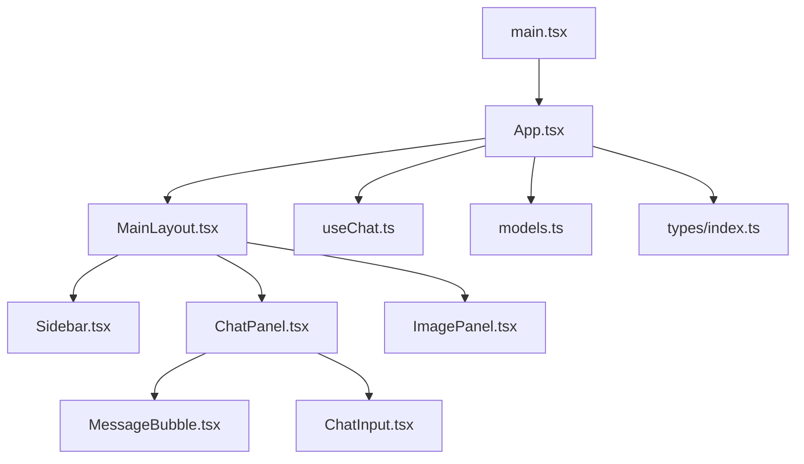
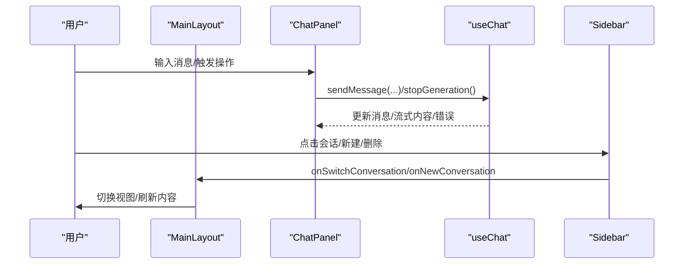
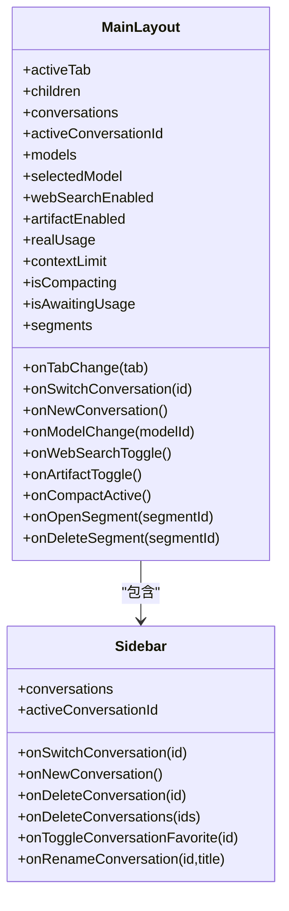
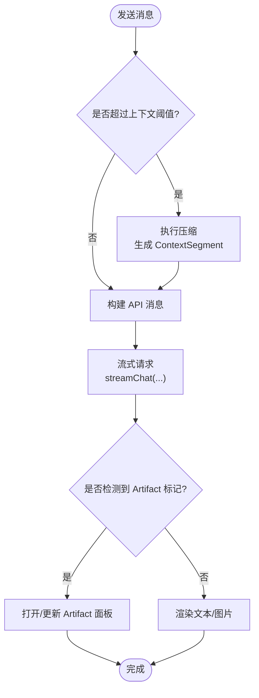
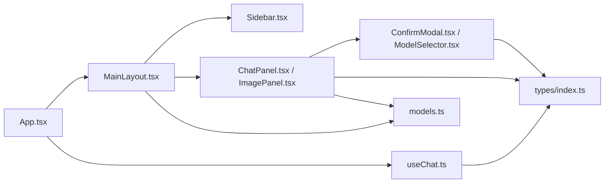

# 组件架构设计

<cite>
**本文引用的文件**
- [main.tsx](file://src/main.tsx)
- [App.tsx](file://src/App.tsx)
- [MainLayout.tsx](file://src/components/layout/MainLayout.tsx)
- [Sidebar.tsx](file://src/components/layout/Sidebar.tsx)
- [ChatPanel.tsx](file://src/components/chat/ChatPanel.tsx)
- [MessageBubble.tsx](file://src/components/chat/MessageBubble.tsx)
- [ChatInput.tsx](file://src/components/chat/ChatInput.tsx)
- [ImagePanel.tsx](file://src/components/image/ImagePanel.tsx)
- [ConfirmModal.tsx](file://src/components/common/ConfirmModal.tsx)
- [ModelSelector.tsx](file://src/components/common/ModelSelector.tsx)
- [useChat.ts](file://src/hooks/useChat.ts)
- [models.ts](file://src/config/models.ts)
- [index.ts](file://src/types/index.ts)
</cite>

## 目录
1. [简介](#简介)
2. [项目结构](#项目结构)
3. [核心组件](#核心组件)
4. [架构总览](#架构总览)
5. [详细组件分析](#详细组件分析)
6. [依赖关系分析](#依赖关系分析)
7. [性能考量](#性能考量)
8. [故障排查指南](#故障排查指南)
9. [结论](#结论)
10. [附录](#附录)

## 简介
本文件面向 AIShop 项目的组件架构设计，聚焦于布局组件、功能面板组件与通用组件的层次结构与协作方式。文档说明组件间的通信机制、状态提升与数据传递策略，解释组件复用与组合模式的应用，并文档化接口设计（Props）、事件处理机制、生命周期管理与性能优化策略。最后提供组件开发指南与最佳实践，帮助团队在现有架构上高效扩展与维护。

## 项目结构
AIShop 采用“按功能域组织”的前端结构：
- 入口与根应用：main.tsx 挂载 App；App 负责全局路由态（Tab）与跨面板共享状态（会话、收藏等）。
- 布局层：MainLayout 提供侧边栏、顶部导航、底部导航与内容区；Sidebar 管理会话列表与操作。
- 功能面板：ChatPanel（聊天）、ImagePanel（图片生成）等作为独立业务视图。
- 通用组件：ConfirmModal、ModelSelector 等可复用的 UI 能力。
- 类型与配置：types/index.ts 定义统一数据结构；config/models.ts 集中模型元数据。
- 状态与逻辑：hooks/useChat.ts 封装聊天流程、持久化、压缩与联网搜索等复杂逻辑。

图表来源
- [main.tsx:1-8](file://src/main.tsx#L1-L8)
- [App.tsx:1-147](file://src/App.tsx#L1-L147)
- [MainLayout.tsx:1-205](file://src/components/layout/MainLayout.tsx#L1-L205)
- [Sidebar.tsx:1-557](file://src/components/layout/Sidebar.tsx#L1-L557)
- [ChatPanel.tsx:1-623](file://src/components/chat/ChatPanel.tsx#L1-L623)
- [MessageBubble.tsx:1-800](file://src/components/chat/MessageBubble.tsx#L1-L800)
- [ChatInput.tsx:1-467](file://src/components/chat/ChatInput.tsx#L1-L467)
- [ImagePanel.tsx:1-800](file://src/components/image/ImagePanel.tsx#L1-L800)
- [useChat.ts:1-800](file://src/hooks/useChat.ts#L1-L800)
- [models.ts:1-284](file://src/config/models.ts#L1-L284)
- [index.ts:1-252](file://src/types/index.ts#L1-L252)

章节来源
- [main.tsx:1-8](file://src/main.tsx#L1-L8)
- [App.tsx:1-147](file://src/App.tsx#L1-L147)

## 核心组件
- 布局组件
  - MainLayout：承载侧边栏、顶栏、底栏与主内容区；通过 props 暴露 Tab 切换、会话管理、模型选择、上下文用量与片段管理等能力。
  - Sidebar：会话列表、搜索、筛选、批量操作、长按菜单、重命名与删除确认等。
- 功能面板组件
  - ChatPanel：消息流渲染、折叠浏览、对话内搜索、Artifact 流式预览、上下文摘要编辑、滚动定位与交互。
  - ImagePanel：图片生成工作区，含参数选择、拖拽上传、瀑布流展示、任务队列与历史管理。
- 通用组件
  - MessageBubble：消息气泡，支持 Markdown、代码高亮、引用链接、多版本切换、折叠态、长按菜单与复制。
  - ChatInput：输入框、附件与图片粘贴/拖拽、引用消息、联网搜索开关、发送/停止控制。
  - ConfirmModal：通用确认弹窗，Portal 到 body，ESC 关闭与动画过渡。
  - ModelSelector：模型选择器，支持分组、下拉或底部抽屉两种形态。

章节来源
- [MainLayout.tsx:10-43](file://src/components/layout/MainLayout.tsx#L10-L43)
- [Sidebar.tsx:12-21](file://src/components/layout/Sidebar.tsx#L12-L21)
- [ChatPanel.tsx:18-47](file://src/components/chat/ChatPanel.tsx#L18-L47)
- [MessageBubble.tsx:303-325](file://src/components/chat/MessageBubble.tsx#L303-L325)
- [ChatInput.tsx:6-19](file://src/components/chat/ChatInput.tsx#L6-L19)
- [ConfirmModal.tsx:7-16](file://src/components/common/ConfirmModal.tsx#L7-L16)
- [ModelSelector.tsx:7-16](file://src/components/common/ModelSelector.tsx#L7-L16)

## 架构总览
整体采用“状态提升 + Hook 抽象”的模式：
- App 持有 Tab 与跨面板共享状态（如会话、收藏），通过 props 下发给布局与面板。
- useChat 封装聊天领域状态与副作用（启动加载、持久化、压缩、联网搜索、流式输出、错误处理）。
- 布局与面板通过回调函数将用户操作冒泡至 App 或 Hook，实现单向数据流。
- 通用弹窗与选择器使用 Portal 脱离父级 transform/overflow 影响，保证定位与层级正确。

图表来源
- [App.tsx:58-128](file://src/App.tsx#L58-L128)
- [ChatPanel.tsx:494-783](file://src/components/chat/ChatPanel.tsx#L494-L783)
- [useChat.ts:494-783](file://src/hooks/useChat.ts#L494-L783)
- [Sidebar.tsx:72-80](file://src/components/layout/Sidebar.tsx#L72-L80)
- [MainLayout.tsx:137-197](file://src/components/layout/MainLayout.tsx#L137-L197)

## 详细组件分析

### 布局组件：MainLayout 与 Sidebar
- 职责
  - MainLayout：管理侧边栏展开/收起、输入聚焦时隐藏底部导航、横滑手势打开侧边栏、顶栏模型选择与上下文用量、片段管理与遮罩交互。
  - Sidebar：会话列表分组、搜索与拼音匹配、收藏筛选、批量选择与删除、长按上下文菜单（导出/编辑标题/收藏/删除）、重命名与确认弹窗。
- 通信与状态
  - 通过 props 接收会话列表与当前会话 ID，回调 onSwitchConversation/onNewConversation 等由 App 或 useChat 处理。
  - 使用 createPortal 将菜单与弹窗挂载到 body，避免被祖先容器裁剪。
- 关键交互
  - 横滑手势：useDrawerSwipe 计算进度与过渡，结合 haptic 触觉反馈。
  - 长按菜单：基于指针事件与视觉视口尺寸自适应定位，必要时内部滚动。

图表来源
- [MainLayout.tsx:10-43](file://src/components/layout/MainLayout.tsx#L10-L43)
- [Sidebar.tsx:12-21](file://src/components/layout/Sidebar.tsx#L12-L21)

章节来源
- [MainLayout.tsx:74-205](file://src/components/layout/MainLayout.tsx#L74-L205)
- [Sidebar.tsx:28-557](file://src/components/layout/Sidebar.tsx#L28-L557)

### 聊天面板：ChatPanel、MessageBubble、ChatInput
- 职责
  - ChatPanel：消息列表渲染、折叠浏览模式、对话内搜索、Artifact 流式预览、上下文摘要查看/编辑、滚动定位与回到底部按钮。
  - MessageBubble：单条消息渲染，支持 Markdown、数学公式、代码高亮、引用链接、多版本切换、折叠态、长按菜单与复制。
  - ChatInput：文本输入、图片/文件粘贴与拖拽、引用消息、联网搜索开关、发送/停止控制。
- 通信与状态
  - 通过 props 接收 messages、isLoading、sendMessage、stopGeneration 等，调用 useChat 提供的能力。
  - 使用 useStickToBottom、useFoldGesture、useArtifact 等 Hook 管理滚动、折叠与 Artifact 状态。
- 关键交互
  - 折叠浏览：快速甩动触发塌陷动画，锁定滚动位置，进入折叠态后点击展开并平滑定位。
  - 搜索高亮：对纯文本与 Markdown 分别处理，DOM 后处理包裹 mark 节点，支持跳转与计数。
  - 流式 Artifact：检测标记，打开全屏预览面板，结束时自动切换到预览模式。

图表来源
- [useChat.ts:494-783](file://src/hooks/useChat.ts#L494-L783)
- [ChatPanel.tsx:357-406](file://src/components/chat/ChatPanel.tsx#L357-L406)
- [MessageBubble.tsx:538-644](file://src/components/chat/MessageBubble.tsx#L538-L644)

章节来源
- [ChatPanel.tsx:18-623](file://src/components/chat/ChatPanel.tsx#L18-L623)
- [MessageBubble.tsx:303-800](file://src/components/chat/MessageBubble.tsx#L303-L800)
- [ChatInput.tsx:6-467](file://src/components/chat/ChatInput.tsx#L6-L467)

### 图片面板：ImagePanel
- 职责
  - 提供图片生成参数选择（比例、尺寸、质量）、参考图上传（拖拽/粘贴/文件）、瀑布流展示、任务队列与历史记录管理。
- 通信与状态
  - 使用 useImage Hook 管理选中模型、上传图像、参数、任务与历史；通过本地状态管理输入与错误提示。
- 关键交互
  - 拖拽上传：支持外部图片与照片墙中的已生成图片拖入作为参考图。
  - 下载：将 IndexedDB 中的 blob 转为临时 URL 进行下载，完成后释放。

章节来源
- [ImagePanel.tsx:1-800](file://src/components/image/ImagePanel.tsx#L1-L800)

### 通用组件：ConfirmModal、ModelSelector
- ConfirmModal
  - 通过 createPortal 挂载到 body，支持 ESC 关闭、背景滚动禁用、进入/退出动画。
  - Props：open、title、message、confirmText、cancelText、variant、onConfirm、onCancel。
- ModelSelector
  - 支持分组显示、下拉菜单或底部抽屉（compact 模式），动态计算弹出位置以避免溢出。
  - Props：models、selectedModel、onModelChange、compact、webSearchEnabled、onWebSearchToggle、artifactEnabled、onArtifactToggle。

章节来源
- [ConfirmModal.tsx:7-135](file://src/components/common/ConfirmModal.tsx#L7-L135)
- [ModelSelector.tsx:7-320](file://src/components/common/ModelSelector.tsx#L7-L320)

## 依赖关系分析
- 组件耦合
  - App 依赖 MainLayout 与各功能面板，并通过 useChat 管理聊天状态。
  - ChatPanel 依赖 MessageBubble、ChatInput 与多个 Hook（useArtifact、useStickToBottom、useFoldGesture）。
  - Sidebar 依赖通用弹窗（ConfirmModal、PromptModal）与服务（备份导出）。
- 外部依赖
  - types/index.ts 定义统一数据结构（Message、Conversation、ContextSegment、Model 等）。
  - config/models.ts 集中模型元数据，供各面板与选择器使用。
- 潜在循环
  - 组件间通过 props 与回调解耦，未见直接循环导入；Hook 与类型定义保持单向依赖。

图表来源
- [App.tsx:1-147](file://src/App.tsx#L1-L147)
- [MainLayout.tsx:1-205](file://src/components/layout/MainLayout.tsx#L1-L205)
- [useChat.ts:1-800](file://src/hooks/useChat.ts#L1-L800)
- [types/index.ts:1-252](file://src/types/index.ts#L1-L252)
- [models.ts:1-284](file://src/config/models.ts#L1-L284)

章节来源
- [App.tsx:1-147](file://src/App.tsx#L1-L147)
- [useChat.ts:1-800](file://src/hooks/useChat.ts#L1-L800)
- [types/index.ts:1-252](file://src/types/index.ts#L1-L252)
- [models.ts:1-284](file://src/config/models.ts#L1-L284)

## 性能考量
- 渲染优化
  - 折叠浏览模式减少长回复渲染成本；搜索高亮仅在必要时进行 DOM 后处理。
  - 使用 useMemo 计算过滤与会话分组，避免重复计算。
- 滚动与动画
  - 使用 requestAnimationFrame 钉住滚动位置，避免惯性滚动导致的闪烁。
  - 折叠/展开动画期间冻结滚动，确保锚点定位准确。
- 网络与持久化
  - 流式输出逐步更新 UI，减少一次性大对象写入。
  - 持久化采用 diff 写入，避免全量序列化导致卡顿。
- 内存管理
  - 临时 Object URL 在下载后及时释放；Blob 引用按需解析。
  - 弹窗与菜单使用 Portal 并延迟卸载，配合动画完成后再移除 DOM。

[本节为通用指导，不直接分析具体文件]

## 故障排查指南
- 常见问题
  - 侧边栏菜单被裁剪：确认使用 createPortal 挂载到 body，并使用 useLayoutEffect 计算位置。
  - 折叠态滚动错位：检查锚点捕获与 rAF 钉住滚动逻辑，确保动画结束后恢复。
  - 流式 Artifact 未显示：检查标记检测与面板打开/更新逻辑，确认结束信号触发完成。
  - 弹窗无法关闭：确认 ESC 监听与外部点击关闭逻辑生效，避免被祖先 transform 影响。
- 调试建议
  - 在关键回调中打印日志（如发送消息、压缩、流式结束）。
  - 使用浏览器开发者工具观察 DOM 树与样式变化，验证 Portal 层级与定位。
  - 针对移动端，使用 visualViewport 测量真实可视区域，避免键盘弹起导致的布局问题。

章节来源
- [Sidebar.tsx:148-205](file://src/components/layout/Sidebar.tsx#L148-L205)
- [ChatPanel.tsx:230-353](file://src/components/chat/ChatPanel.tsx#L230-L353)
- [ConfirmModal.tsx:50-66](file://src/components/common/ConfirmModal.tsx#L50-L66)

## 结论
AIShop 的组件架构以 App 为中心，通过 MainLayout 组织布局，功能面板按域拆分，通用组件提供可复用能力。状态提升与 Hook 抽象实现了清晰的单向数据流与职责分离。组件间通过 props 与回调通信，Portal 与手势处理保证了良好的交互体验。结合折叠浏览、流式渲染与持久化优化，系统在性能与可用性方面达到平衡。遵循本文档的接口规范与最佳实践，可高效扩展新功能并保持架构一致性。

## 附录
- 组件接口设计要点
  - Props 明确类型与可选性，使用 TypeScript 约束数据结构。
  - 事件回调命名清晰（如 onXxxChange），避免隐式副作用。
  - 复杂状态下沉至 Hook，组件仅关注渲染与交互。
- 组合模式与复用策略
  - 将通用能力（弹窗、选择器、消息气泡）抽象为独立组件，通过 props 配置行为。
  - 使用组合而非继承，便于灵活拼装与测试。
- 生命周期管理
  - 使用 useEffect/useLayoutEffect 管理副作用与绘制同步。
  - 清理定时器、事件监听与动画帧，避免内存泄漏。
- 最佳实践
  - 优先使用受控组件与单向数据流。
  - 对长列表与复杂渲染进行虚拟化或懒加载。
  - 对用户操作提供即时反馈（如触觉、Toast、占位符）。

[本节为通用指导，不直接分析具体文件]