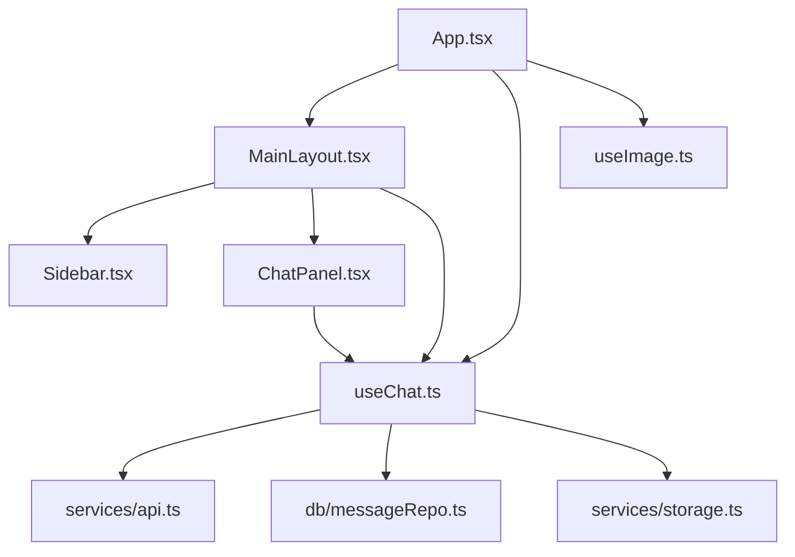
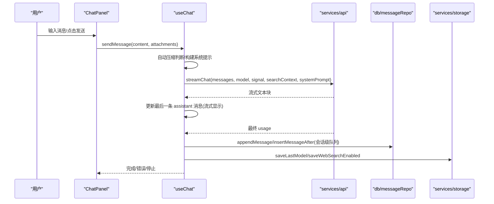
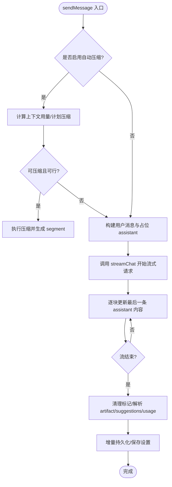
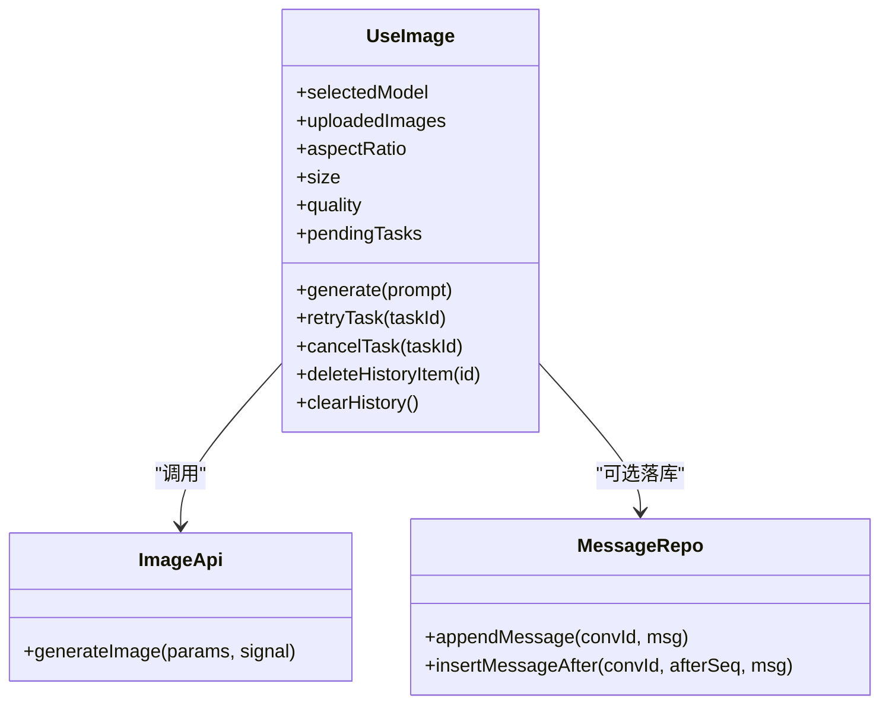
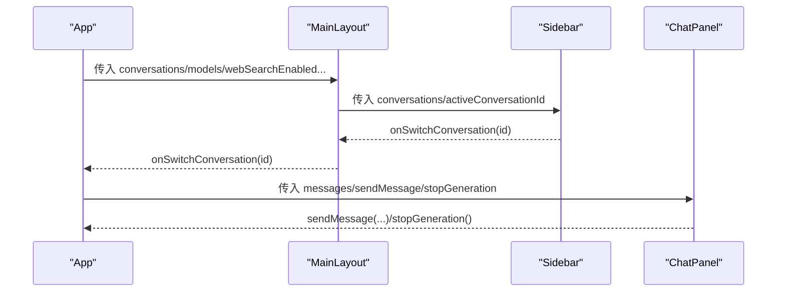
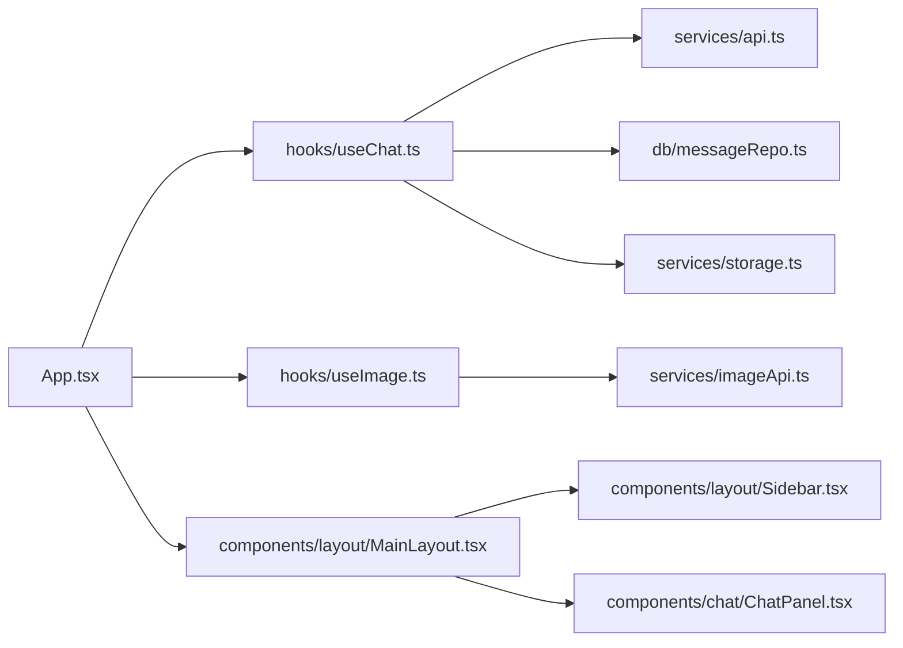

# 组件通信机制

<cite>
**本文引用的文件**
- [src/App.tsx](file://src/App.tsx)
- [src/main.tsx](file://src/main.tsx)
- [src/hooks/useChat.ts](file://src/hooks/useChat.ts)
- [src/hooks/useImage.ts](file://src/hooks/useImage.ts)
- [src/components/layout/MainLayout.tsx](file://src/components/layout/MainLayout.tsx)
- [src/components/layout/Sidebar.tsx](file://src/components/layout/Sidebar.tsx)
- [src/components/chat/ChatPanel.tsx](file://src/components/chat/ChatPanel.tsx)
- [src/services/api.ts](file://src/services/api.ts)
- [src/types/index.ts](file://src/types/index.ts)
- [src/services/storage.ts](file://src/services/storage.ts)
- [src/db/messageRepo.ts](file://src/db/messageRepo.ts)
</cite>

## 目录
1. [简介](#简介)
2. [项目结构](#项目结构)
3. [核心组件](#核心组件)
4. [架构总览](#架构总览)
5. [详细组件分析](#详细组件分析)
6. [依赖关系分析](#依赖关系分析)
7. [性能考量](#性能考量)
8. [故障排查指南](#故障排查指南)
9. [结论](#结论)
10. [附录](#附录)

## 简介
本设计文档聚焦 AIShop 项目的组件通信机制，围绕数据传递、状态同步与事件处理模式展开。重点说明：
- 自定义 Hook 的设计模式（useChat、useImage）
- 状态提升策略（App 作为状态中心，通过 props 向子组件下发）
- 上下文使用（基于 React Context 的替代方案：props + 全局 Hook + 持久化存储）
- 消息队列、事件总线与解耦通信（IndexedDB 会话级队列、浏览器事件与 localStorage 广播）
- 组件生命周期管理、副作用处理与性能优化（流式渲染、增量持久化、并发控制）
- 异步操作处理、错误边界与调试工具（AbortController、重试、日志）
- 组件通信最佳实践与设计原则

## 项目结构
AIShop 采用“Hook 驱动 + 状态提升”的架构：
- App 作为根容器，集中持有会话、模型、设置等全局状态，并通过 props 将状态与回调传递给布局与业务面板。
- 业务逻辑封装在自定义 Hook 中（如 useChat、useImage），负责与 IndexedDB、API、本地存储交互。
- UI 组件保持“展示型”，通过 props 接收数据和回调，避免直接访问全局状态。
- 跨层通信主要依靠：
  - Props 向下传递数据与回调
  - 自定义 Hook 暴露统一 API
  - 浏览器事件与 localStorage 实现轻量解耦通知
  - IndexedDB 会话级队列保证并发安全

图表来源
- [src/App.tsx:16-147](file://src/App.tsx#L16-L147)
- [src/components/layout/MainLayout.tsx:45-205](file://src/components/layout/MainLayout.tsx#L45-L205)
- [src/components/chat/ChatPanel.tsx:18-70](file://src/components/chat/ChatPanel.tsx#L18-L70)
- [src/hooks/useChat.ts:152-179](file://src/hooks/useChat.ts#L152-L179)
- [src/services/api.ts:44-173](file://src/services/api.ts#L44-L173)
- [src/db/messageRepo.ts:124-165](file://src/db/messageRepo.ts#L124-L165)

章节来源
- [src/App.tsx:16-147](file://src/App.tsx#L16-L147)
- [src/components/layout/MainLayout.tsx:45-205](file://src/components/layout/MainLayout.tsx#L45-L205)
- [src/components/chat/ChatPanel.tsx:18-70](file://src/components/chat/ChatPanel.tsx#L18-L70)
- [src/hooks/useChat.ts:152-179](file://src/hooks/useChat.ts#L152-L179)
- [src/services/api.ts:44-173](file://src/services/api.ts#L44-L173)
- [src/db/messageRepo.ts:124-165](file://src/db/messageRepo.ts#L124-L165)

## 核心组件
- App：应用入口，维护 activeTab、主题、压缩 toast 等全局状态；通过 useChat/useAssets 获取聊天与「我的库」资产状态并下传给 MainLayout 与具体面板。
- MainLayout：布局容器，承载侧边栏、顶栏、内容区与底部导航；通过 props 接收会话列表、模型选择、搜索开关、上下文占用等信息。
- Sidebar：会话列表与操作菜单；通过回调触发切换、重命名、收藏、删除等操作。
- ChatPanel：聊天界面，负责消息渲染、折叠浏览、搜索、Artifact 预览、上下文摘要编辑等；通过 sendMessage/stopGeneration 与 useChat 交互。
- useChat：聊天领域核心 Hook，封装会话加载、消息发送、流式响应、自动压缩、持久化、联网搜索、用量统计等。
- useImage：图片生成 Hook，封装模型参数、上传、并发队列、历史管理与 IndexedDB 落库。
- services/api：流式聊天接口封装，解析 usage，处理网关兼容性与错误。
- db/messageRepo：消息仓库，按会话级队列串行化写操作，避免流式期间密集更新冲突。
- services/storage：小体积同步读写设置（模型、上次会话、搜索开关、主题）。

章节来源
- [src/App.tsx:16-147](file://src/App.tsx#L16-L147)
- [src/components/layout/MainLayout.tsx:45-205](file://src/components/layout/MainLayout.tsx#L45-L205)
- [src/components/layout/Sidebar.tsx:29-557](file://src/components/layout/Sidebar.tsx#L29-L557)
- [src/components/chat/ChatPanel.tsx:18-70](file://src/components/chat/ChatPanel.tsx#L18-L70)
- [src/hooks/useChat.ts:152-179](file://src/hooks/useChat.ts#L152-L179)
- [src/hooks/useImage.ts:123-469](file://src/hooks/useImage.ts#L123-L469)
- [src/services/api.ts:44-173](file://src/services/api.ts#L44-L173)
- [src/db/messageRepo.ts:124-165](file://src/db/messageRepo.ts#L124-L165)
- [src/services/storage.ts:1-63](file://src/services/storage.ts#L1-L63)

## 架构总览
AIShop 的通信架构以“状态提升 + Hook 抽象 + 持久化 + 事件广播”为核心：
- 状态提升：App 持有会话与功能开关，通过 props 向 MainLayout 与面板下发；面板通过回调向上提交变更。
- Hook 抽象：useChat/useImage 封装复杂副作用与状态机，对外暴露稳定 API。
- 持久化：会话与消息落库 IndexedDB；小设置用 localStorage；启动时恢复上次会话。
- 事件广播：通过 window 事件与 localStorage 实现跨模块通知（如 feature-settings-changed）。
- 并发控制：消息写入经会话级队列串行化；图片生成使用任务队列与 AbortController 取消。

图表来源
- [src/components/chat/ChatPanel.tsx:49-70](file://src/components/chat/ChatPanel.tsx#L49-L70)
- [src/hooks/useChat.ts:494-783](file://src/hooks/useChat.ts#L494-L783)
- [src/services/api.ts:44-173](file://src/services/api.ts#L44-L173)
- [src/db/messageRepo.ts:124-165](file://src/db/messageRepo.ts#L124-L165)
- [src/services/storage.ts:11-52](file://src/services/storage.ts#L11-L52)

## 详细组件分析

### 自定义 Hook：useChat
- 职责：会话初始化、消息发送、流式渲染、自动压缩、持久化、联网搜索、用量统计、上下文摘要管理。
- 关键模式：
  - 启动恢复：读取会话列表，优先恢复上次停留会话，按需 hydrate 消息。
  - 增量持久化：diff 变化后定向写入，避免全量写盘卡顿。
  - 流式更新：逐块追加到 last assistant 消息，完成后清理标记并解析 artifact/suggestions。
  - 自动压缩：根据阈值与 hot window 规划压缩区间，生成 segment 并标记被压缩消息。
  - 并发控制：AbortController 支持取消；失败时回退状态。
  - 事件监听：监听 aishop:feature-settings-changed 同步设置变更。

图表来源
- [src/hooks/useChat.ts:494-783](file://src/hooks/useChat.ts#L494-L783)
- [src/hooks/useChat.ts:402-450](file://src/hooks/useChat.ts#L402-L450)
- [src/services/api.ts:44-173](file://src/services/api.ts#L44-L173)

章节来源
- [src/hooks/useChat.ts:152-179](file://src/hooks/useChat.ts#L152-L179)
- [src/hooks/useChat.ts:494-783](file://src/hooks/useChat.ts#L494-L783)
- [src/hooks/useChat.ts:402-450](file://src/hooks/useChat.ts#L402-L450)
- [src/services/api.ts:44-173](file://src/services/api.ts#L44-L173)

### 自定义 Hook：useImage
- 职责：模型参数管理、图片上传与压缩、并发任务队列、历史管理、IndexedDB 落库。
- 关键模式：
  - 并发队列：pendingTasks 管理 loading/error 状态；每个任务独立 AbortController。
  - 参数派生：根据模型动态计算有效宽高比/尺寸/质量选项。
  - 历史回填：启动时加载历史，缺失宽高时从 blob 或 URL 推断并写回。
  - 失败处理：区分超时与手动取消，提供重试与关闭能力。

图表来源
- [src/hooks/useImage.ts:123-469](file://src/hooks/useImage.ts#L123-L469)
- [src/services/imageApi.ts:181-256](file://src/services/imageApi.ts#L181-L256)
- [src/db/messageRepo.ts:124-165](file://src/db/messageRepo.ts#L124-L165)

章节来源
- [src/hooks/useImage.ts:123-469](file://src/hooks/useImage.ts#L123-L469)
- [src/services/imageApi.ts:181-256](file://src/services/imageApi.ts#L181-L256)
- [src/db/messageRepo.ts:124-165](file://src/db/messageRepo.ts#L124-L165)

### 布局与侧边栏通信
- MainLayout：通过 props 接收会话列表、模型选择、搜索开关、上下文占用等；内部维护侧边栏打开状态与手势。
- Sidebar：通过回调触发 onSwitchConversation/onNewConversation/onToggleConversationFavorite/onRenameConversation/onDeleteConversation 等；长按弹出上下文菜单（portal 到 body）。
- 通信方式：父组件持有状态，子组件通过回调上报变更；弹窗使用 createPortal 脱离裁剪容器。

图表来源
- [src/App.tsx:97-128](file://src/App.tsx#L97-L128)
- [src/components/layout/MainLayout.tsx:45-205](file://src/components/layout/MainLayout.tsx#L45-L205)
- [src/components/layout/Sidebar.tsx:29-557](file://src/components/layout/Sidebar.tsx#L29-L557)
- [src/components/chat/ChatPanel.tsx:49-70](file://src/components/chat/ChatPanel.tsx#L49-L70)

章节来源
- [src/App.tsx:97-128](file://src/App.tsx#L97-L128)
- [src/components/layout/MainLayout.tsx:45-205](file://src/components/layout/MainLayout.tsx#L45-L205)
- [src/components/layout/Sidebar.tsx:29-557](file://src/components/layout/Sidebar.tsx#L29-L557)
- [src/components/chat/ChatPanel.tsx:49-70](file://src/components/chat/ChatPanel.tsx#L49-L70)

### 事件总线与解耦通信
- 浏览器事件：useChat 监听 window 'aishop:feature-settings-changed' 以同步设置变更，实现设置面板与聊天模块的解耦。
- localStorage 广播：小体积设置项通过 localStorage 同步读写，配合事件实现跨组件通知。
- 优势：避免强耦合引用，便于扩展与测试。

章节来源
- [src/hooks/useChat.ts:340-353](file://src/hooks/useChat.ts#L340-L353)
- [src/services/storage.ts:1-63](file://src/services/storage.ts#L1-L63)

### 消息队列与会话级串行化
- 消息写入经 db/messageRepo 的会话级队列 enqueue 串行化，避免流式期间密集更新导致的数据竞争。
- 插入与追加均返回 seq，确保顺序一致与分支插入正确性。

章节来源
- [src/db/messageRepo.ts:124-165](file://src/db/messageRepo.ts#L124-L165)

### 类型契约与数据模型
- Message/Conversation/TokenUsage/ContextSegment 等类型定义清晰，支撑流式、压缩、用量统计等功能。
- 多版本消息（versions）与活跃版本索引支持多模型比较与切换。

章节来源
- [src/types/index.ts:1-252](file://src/types/index.ts#L1-L252)

## 依赖关系分析
- App 依赖 useChat/useImage 提供的状态与行为，通过 props 注入到 MainLayout 与面板。
- MainLayout 依赖 Sidebar/TopNavBar/BottomNavBar，组合布局与交互。
- ChatPanel 依赖 useChat 的 sendMessage/stopGeneration，以及 Artifact 相关 Hook。
- useChat 依赖 services/api、db/messageRepo、services/storage、utils/tokenEstimate 等。
- useImage 依赖 services/imageApi、db 历史仓库、localStorage。

图表来源
- [src/App.tsx:16-147](file://src/App.tsx#L16-L147)
- [src/components/layout/MainLayout.tsx:45-205](file://src/components/layout/MainLayout.tsx#L45-L205)
- [src/components/chat/ChatPanel.tsx:18-70](file://src/components/chat/ChatPanel.tsx#L18-L70)
- [src/hooks/useChat.ts:152-179](file://src/hooks/useChat.ts#L152-L179)
- [src/hooks/useImage.ts:123-469](file://src/hooks/useImage.ts#L123-L469)
- [src/services/api.ts:44-173](file://src/services/api.ts#L44-L173)
- [src/db/messageRepo.ts:124-165](file://src/db/messageRepo.ts#L124-L165)
- [src/services/storage.ts:1-63](file://src/services/storage.ts#L1-L63)

章节来源
- [src/App.tsx:16-147](file://src/App.tsx#L16-L147)
- [src/components/layout/MainLayout.tsx:45-205](file://src/components/layout/MainLayout.tsx#L45-L205)
- [src/components/chat/ChatPanel.tsx:18-70](file://src/components/chat/ChatPanel.tsx#L18-L70)
- [src/hooks/useChat.ts:152-179](file://src/hooks/useChat.ts#L152-L179)
- [src/hooks/useImage.ts:123-469](file://src/hooks/useImage.ts#L123-L469)
- [src/services/api.ts:44-173](file://src/services/api.ts#L44-L173)
- [src/db/messageRepo.ts:124-165](file://src/db/messageRepo.ts#L124-L165)
- [src/services/storage.ts:1-63](file://src/services/storage.ts#L1-L63)

## 性能考量
- 流式渲染：逐块更新最后一条 assistant 消息，减少重渲染范围。
- 增量持久化：diff 变化后定向写入，避免全量 JSON 序列化开销。
- 并发控制：消息写入经会话级队列串行化；图片生成使用任务队列与 AbortController。
- 内存管理：object URL 引用计数与及时释放；长会话避免一次性加载过多资源。
- 计算属性：useMemo/useCallback 减少不必要的重建与渲染。

[本节为通用性能指导，不直接分析具体文件]

## 故障排查指南
- 流式请求失败：检查 API Key 配置与网关兼容性；捕获 4xx 并降级重试（去掉 include_usage）。
- 取消生成：确认 AbortController 信号正确传递；处理 AbortError 并更新 UI 状态。
- 持久化失败：检查 IndexedDB 写入异常与快照清理；必要时回滚 state。
- 设置不同步：确认 aishop:feature-settings-changed 事件监听与 localStorage 读写正常。
- 图片加载失败：检查 Blob 引用与 URL 释放；提供 fallback 与重试入口。

章节来源
- [src/services/api.ts:102-118](file://src/services/api.ts#L102-L118)
- [src/hooks/useChat.ts:741-783](file://src/hooks/useChat.ts#L741-L783)
- [src/hooks/useImage.ts:336-356](file://src/hooks/useImage.ts#L336-L356)
- [src/hooks/useChat.ts:340-353](file://src/hooks/useChat.ts#L340-L353)

## 结论
AIShop 通过“状态提升 + Hook 抽象 + 持久化 + 事件广播”的通信机制，实现了高内聚、低耦合的组件协作：
- 数据流向清晰：App 持有状态，子组件仅消费与上报。
- 副作用集中：useChat/useImage 封装复杂逻辑，便于测试与维护。
- 并发与安全：会话级队列与 AbortController 保障稳定性。
- 可扩展性：事件总线与 localStorage 广播支持跨模块解耦。
建议继续遵循上述原则，逐步引入更细粒度的错误边界与调试工具，进一步提升健壮性与可观测性。

[本节为总结，不直接分析具体文件]

## 附录
- 最佳实践
  - 使用自定义 Hook 封装副作用与状态机，对外暴露稳定 API。
  - 通过 props 与回调实现单向数据流，避免组件间直接耦合。
  - 对高频更新使用增量持久化与计算属性优化性能。
  - 使用 AbortController 管理异步取消，妥善处理错误与边界情况。
  - 利用浏览器事件与 localStorage 实现轻量解耦通信。
- 设计原则
  - 单一职责：每个 Hook/组件专注一个领域。
  - 可测试性：隔离副作用，便于单元测试与集成测试。
  - 可维护性：清晰的类型契约与数据模型，降低理解成本。
  - 可扩展性：事件总线与插件化设计，便于功能扩展。

[本节为通用指导，不直接分析具体文件]