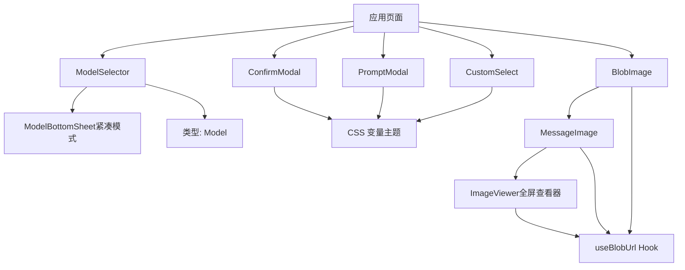
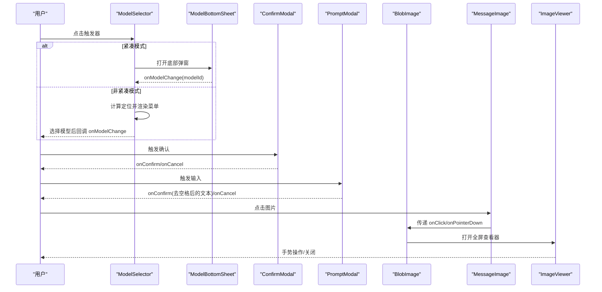
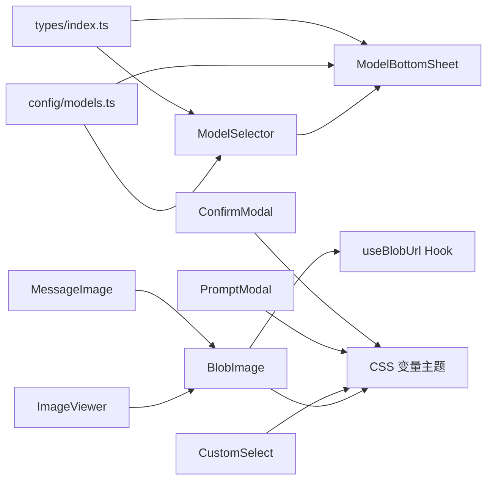

# 通用组件库

<cite>
**本文引用的文件**
- [ModelSelector.tsx](file://src/components/common/ModelSelector.tsx)
- [ConfirmModal.tsx](file://src/components/common/ConfirmModal.tsx)
- [PromptModal.tsx](file://src/components/common/PromptModal.tsx)
- [CustomSelect.tsx](file://src/components/common/CustomSelect.tsx)
- [ModelBottomSheet.tsx](file://src/components/common/ModelBottomSheet.tsx)
- [BlobImage.tsx](file://src/components/common/BlobImage.tsx)
- [MessageImage.tsx](file://src/components/chat/MessageImage.tsx)
- [ImageViewer.tsx](file://src/components/common/ImageViewer.tsx)
- [models.ts](file://src/config/models.ts)
- [index.ts](file://src/types/index.ts)
</cite>

## 更新摘要
**所做更改**
- 新增 BlobImage 组件的点击和指针事件处理器功能说明
- 更新 MessageImage 组件章节，详细说明长按与点击区分逻辑及全屏查看器集成
- 新增 ImageViewer 全屏查看器组件的详细分析
- 增强图片交互体验的实现细节说明
- 更新使用示例和最佳实践部分

## 目录
1. [简介](#简介)
2. [项目结构](#项目结构)
3. [核心组件](#核心组件)
4. [架构总览](#架构总览)
5. [详细组件分析](#详细组件分析)
6. [依赖关系分析](#依赖关系分析)
7. [性能考量](#性能考量)
8. [故障排查指南](#故障排查指南)
9. [结论](#结论)
10. [附录](#附录)

## 简介
本设计文档聚焦 AIShop 项目的通用组件库，围绕 ModelSelector、ConfirmModal、PromptModal、CustomSelect 与 BlobImage 等可复用组件展开。文档从 API 设计、Props 规范、事件处理机制、样式定制与主题支持、响应式设计、组合模式与扩展点、测试策略、文档生成与维护等方面进行全面说明，并提供使用示例与最佳实践，帮助团队在项目中稳定、一致地复用这些组件。

**最新更新**：BlobImage 组件已增强以支持点击和指针事件处理器，启用新的交互行为以满足全屏查看器集成的需求。

## 项目结构
通用组件位于 src/components/common 目录下，配合类型定义 src/types/index.ts 与模型配置 src/config/models.ts 共同构成可复用的 UI 能力。ModelSelector 在非紧凑模式下渲染下拉菜单，在紧凑模式下通过 ModelBottomSheet 提供移动端友好的底部弹窗体验；ConfirmModal 与 PromptModal 基于 createPortal 挂载到 body，确保层级与动画一致性；CustomSelect 提供自绘下拉选择器以统一外观；BlobImage 提供增强的图片加载能力，支持自定义占位符、回退内容和加载完成回调，现已支持点击和指针事件处理。

**图表来源**
- [ModelSelector.tsx:69-330](file://src/components/common/ModelSelector.tsx#L69-L330)
- [ModelBottomSheet.tsx:128-671](file://src/components/common/ModelBottomSheet.tsx#L128-L671)
- [ConfirmModal.tsx:24-135](file://src/components/common/ConfirmModal.tsx#L24-L135)
- [PromptModal.tsx:19-169](file://src/components/common/PromptModal.tsx#L19-L169)
- [CustomSelect.tsx:18-81](file://src/components/common/CustomSelect.tsx#L18-L81)
- [BlobImage.tsx:25-65](file://src/components/common/BlobImage.tsx#L25-L65)
- [MessageImage.tsx:21-58](file://src/components/chat/MessageImage.tsx#L21-L58)
- [ImageViewer.tsx:111-258](file://src/components/common/ImageViewer.tsx#L111-L258)

## 核心组件
本节概述各组件的职责、API 设计与交互要点。

- ModelSelector：模型选择器，支持分组展示、图标映射、定位计算、ESC/外部点击关闭、紧凑模式切换为底部弹窗。
- ConfirmModal：确认对话框，支持多语义变体、过渡动画、ESC 关闭、背景滚动锁定。
- PromptModal：输入提示框，支持初始值同步、自动聚焦、Enter 提交、长度限制、禁用态控制。
- CustomSelect：自定义下拉选择器，统一外观，支持外部点击/ESC 关闭、选中项高亮。
- BlobImage：增强的图片显示组件，支持 IndexedDB 图片、自定义占位符、回退内容、加载完成回调，现已支持点击和指针事件处理器。
- MessageImage：聊天消息中的图片显示组件，基于 BlobImage 构建，实现长按与点击区分逻辑。
- ImageViewer：图片全屏查看器，支持手势缩放、平移、双击缩放、下滑关闭等丰富交互。

**章节来源**
- [ModelSelector.tsx:69-330](file://src/components/common/ModelSelector.tsx#L69-L330)
- [ConfirmModal.tsx:24-135](file://src/components/common/ConfirmModal.tsx#L24-L135)
- [PromptModal.tsx:19-169](file://src/components/common/PromptModal.tsx#L19-L169)
- [CustomSelect.tsx:18-81](file://src/components/common/CustomSelect.tsx#L18-L81)
- [BlobImage.tsx:25-65](file://src/components/common/BlobImage.tsx#L25-L65)
- [MessageImage.tsx:21-58](file://src/components/chat/MessageImage.tsx#L21-L58)
- [ImageViewer.tsx:111-258](file://src/components/common/ImageViewer.tsx#L111-L258)

## 架构总览
组件采用"受控 + 内部状态"的混合模式：
- 受控属性：如 open、value、selectedModel 等由父组件管理，保证数据流清晰。
- 内部状态：如 visible、open、pos 等用于驱动动画、定位、交互反馈。
- Portal 挂载：弹窗类组件通过 createPortal 挂载至 document.body，避免祖先 transform 导致的包含块问题。
- 主题与样式：广泛使用 CSS 变量（如 --color-accent、--color-bg-elevated），便于主题切换与暗色模式适配。
- 响应式：ModelSelector 根据 compact 切换为底部弹窗；ModelBottomSheet 提供推荐视图与全部模型视图的滑动切换。
- 图片处理：BlobImage 提供统一的图片加载体验，支持多种状态处理和回调机制，现已支持丰富的交互事件。

**图表来源**
- [ModelSelector.tsx:69-330](file://src/components/common/ModelSelector.tsx#L69-L330)
- [ModelBottomSheet.tsx:128-671](file://src/components/common/ModelBottomSheet.tsx#L128-L671)
- [ConfirmModal.tsx:24-135](file://src/components/common/ConfirmModal.tsx#L24-L135)
- [PromptModal.tsx:19-169](file://src/components/common/PromptModal.tsx#L19-L169)
- [BlobImage.tsx:25-65](file://src/components/common/BlobImage.tsx#L25-L65)
- [MessageImage.tsx:21-58](file://src/components/chat/MessageImage.tsx#L21-L58)
- [ImageViewer.tsx:111-258](file://src/components/common/ImageViewer.tsx#L111-L258)

## 详细组件分析

### ModelSelector
职责与特性
- 支持按厂商分组显示模型，内置 provider 图标映射与深色图标背景适配。
- 非紧凑模式：固定定位的下拉菜单，自动计算 top/bottom 位置与最大高度，支持 ESC 与外部点击关闭。
- 紧凑模式：切换为 ModelBottomSheet，提供推荐模型与全部模型的滑动切换，同时暴露联网搜索与 Artifact 开关。

API 与 Props
- models: 模型列表，类型为 Model[]。
- selectedModel: 当前选中的模型 id。
- onModelChange: 选择模型时的回调，传入 modelId。
- compact: 是否启用紧凑模式。
- webSearchEnabled / artifactEnabled: 紧凑模式下的高级功能开关。
- onWebSearchToggle / onArtifactToggle: 对应开关的回调。

事件与交互
- 打开/关闭：toggle 控制 open 与动画可见性；compact 模式直接打开底部弹窗。
- 定位：useLayoutEffect 中测量按钮尺寸与视口空间，动态设置 placement、top/bottom、left、width、maxHeight。
- 键盘与点击：监听 ESC 与 mousedown 实现外部点击关闭。
- 动画：进入时 requestAnimationFrame 触发可见；关闭时延迟卸载 DOM 以播放退出动画。

样式与主题
- 使用 CSS 变量进行主题化，如 --color-accent、--color-bg-elevated、--color-text-secondary。
- 紧凑模式使用全圆角、无边框风格；非紧凑模式使用边框与 hover 效果。

响应式与组合
- compact 模式通过 ModelBottomSheet 提供移动端友好体验。
- 与 types.Model 和 config.models.ts 的数据结构紧密耦合，便于扩展新模型与厂商。

**章节来源**
- [ModelSelector.tsx:69-330](file://src/components/common/ModelSelector.tsx#L69-L330)
- [ModelBottomSheet.tsx:128-671](file://src/components/common/ModelBottomSheet.tsx#L128-L671)
- [models.ts:1-284](file://src/config/models.ts#L1-L284)
- [index.ts:109-123](file://src/types/index.ts#L109-L123)

### ConfirmModal
职责与特性
- 标准确认对话框，支持 danger/warning/info 三种语义变体。
- 通过 createPortal 挂载至 body，避免包含块问题。
- 具备进入/退出过渡动画，ESC 关闭，背景滚动锁定。

API 与 Props
- open: 控制显示隐藏。
- title/message: 标题与消息内容。
- confirmText/cancelText: 按钮文案。
- variant: 语义变体，影响确认按钮颜色。
- onConfirm/onCancel: 操作回调。

事件与交互
- 打开：下一帧触发 visible=true 以启动进入动画。
- 关闭：延迟将 visible=false 以完成退出动画，随后 mounted 自然变为 false 卸载。
- 键盘：ESC 触发 onCancel。
- 阻止背景滚动：打开时设置 body.overflow=hidden，关闭时恢复。

样式与主题
- 使用 CSS 变量控制背景、边框、文字颜色，确保主题一致性。
- 按钮样式根据 variant 动态切换。

**章节来源**
- [ConfirmModal.tsx:24-135](file://src/components/common/ConfirmModal.tsx#L24-L135)

### PromptModal
职责与特性
- 输入型弹窗，支持初始值同步、自动聚焦、Enter 提交、长度限制。
- 通过 createLayoutEffect 尽早聚焦以唤起移动端键盘。
- 使用 createPortal 挂载至 body，具备进入/退出动画。

API 与 Props
- open: 控制显示隐藏。
- title: 标题。
- initialValue: 输入框初始值，打开时同步一次。
- placeholder: 占位符。
- confirmText/cancelText: 按钮文案。
- maxLength: 最大输入长度。
- onConfirm: 提交回调，返回去空格后的文本；空值时确认按钮禁用。
- onCancel: 取消回调。

事件与交互
- 打开：下一帧触发 visible=true；useLayoutEffect 中 focus+select。
- 提交：Enter 键触发 submit，仅当 trimmed.length > 0。
- 关闭：ESC 触发 onCancel；关闭时延迟卸载以播放退出动画。

样式与主题
- 输入框与按钮使用 CSS 变量，保持主题一致。
- 确认按钮在可用状态下高亮，禁用态降低透明度。

**章节来源**
- [PromptModal.tsx:19-169](file://src/components/common/PromptModal.tsx#L19-L169)

### CustomSelect
职责与特性
- 自绘下拉选择器，替代原生 select，统一外观与行为。
- 支持外部点击/ESC 关闭，选中项高亮与对勾指示。

API 与 Props
- value: 当前选中值。
- onChange: 值变更回调。
- options: 选项数组，每项包含 value 与 label。
- id: 触发按钮的 id。
- className: 附加到触发按钮的样式类。

事件与交互
- 点击触发器：切换 open。
- 外部点击：document mousedown 检测容器外点击关闭。
- 键盘：ESC 关闭。
- 选择项：调用 onChange 并关闭。

样式与主题
- 使用 CSS 变量控制边框、背景、文字颜色。
- 选中项使用 accent 色对勾标识。

**章节来源**
- [CustomSelect.tsx:18-81](file://src/components/common/CustomSelect.tsx#L18-L81)

### BlobImage
职责与特性
- 增强的图片显示组件，专门处理 IndexedDB 中的图片资源。
- 支持多种加载状态：加载中、成功、失败、资源不存在。
- 提供自定义占位符和回退内容的灵活配置。
- 通过 onLoad 回调提供图片自然尺寸访问能力。
- **新增功能**：支持点击和指针事件处理器，为全屏查看器集成提供基础。

API 与 Props
- src: 图片源，支持普通 http/data URL 或 IndexedDB blob 引用。
- alt: 替代文本。
- className: CSS 类名。
- style: 内联样式。
- draggable: 是否可拖拽。
- loading: 加载策略 ('lazy' | 'eager')。
- placeholder: 加载中显示的 ReactNode，默认为脉冲动画占位。
- fallback: 图片不可用时显示的 ReactNode，默认为 null。
- onLoad: 加载完成回调，接收 SyntheticEvent<HTMLImageElement>，可访问 naturalWidth/naturalHeight。
- **新增** onClick: 点击回调，透传给 ，供"点击图片放大查看"等交互使用。
- **新增** onPointerDown: 按下回调，配合 onClick 做长按/点击区分。

事件与交互
- 加载流程：resolved === undefined 显示占位符 → resolved 有值显示图片 → onLoad 触发。
- 错误处理：onError 时设置 failed 状态并显示 fallback。
- 资源清理：resolved === null 表示 blob 已被清理，显示 fallback。
- **新增交互**：完整的事件透传机制，支持所有标准 img 元素事件。

样式与主题
- 默认占位符使用 Tailwind 的 animate-pulse 和半透明背景。
- 支持 dark mode 适配，不同背景下使用不同的占位符颜色。

**章节来源**
- [BlobImage.tsx:25-65](file://src/components/common/BlobImage.tsx#L25-L65)

### MessageImage
职责与特性
- 聊天消息中的图片显示组件，基于 BlobImage 构建。
- 实现微信风格的图片尺寸限制：横图最宽 240px、竖图最高 360px。
- 提供智能尺寸计算：加载前按 4:3 比例预估占位，加载完成后按实际尺寸缩放。
- 利用 BlobImage 的 onLoad 回调获取 naturalWidth/naturalHeight 实现精确尺寸控制。
- **新增功能**：实现长按与点击区分逻辑，支持全屏查看器集成。

API 与 Props
- src: 图片源。
- alt: 替代文本，默认为"图片"。
- initialSize: 已知请求比例时按显示规则预计算的占位尺寸。
- maxWidth/maxHeight: 显示尺寸上限。

事件与交互
- 尺寸计算：useMemo 根据 loaded 状态计算最终显示尺寸。
- 加载处理：onLoad 回调中获取 naturalWidth/naturalHeight，更新 loaded 状态。
- 占位策略：加载前显示 4:3 比例的脉冲占位符，避免布局抖动。
- **新增交互**：通过 onPointerDown 记录按压开始时间，onClick 中判断是否为长按操作（超过 450ms）。
- **全屏查看器**：短点击打开 ImageViewer，长按触发上下文菜单。

样式与主题
- 使用 Tailwind 类实现圆角、响应式宽度等样式。
- 占位符和回退内容都适配暗色模式。

**章节来源**
- [MessageImage.tsx:21-58](file://src/components/chat/MessageImage.tsx#L21-L58)

### ImageViewer
职责与特性
- 图片全屏查看器，通过 createPortal 挂载至 body，避免被聊天列表等容器的 overflow 裁剪。
- 基于 react-zoom-pan-pinch 实现手势缩放、平移、双击缩放等功能。
- 支持移动端双指捏合缩放、单指平移、双击缩放；桌面端滚轮缩放、左键拖动平移。
- 智能关闭逻辑：缩放中单击不关闭，未缩放单击延迟 300ms 关闭，已缩放到最小向下滑动关闭。
- 打开/关闭动画：挂载后内容从 0.85 倍放大到原尺寸 + 背景淡入，关闭时内容轻微缩小 + 淡出。

API 与 Props
- src: 图片源。
- alt: 替代文本，默认为"图片"。
- onClose: 关闭回调。

事件与交互
- 手势操作：支持缩放、平移、双击缩放/还原。
- 关闭逻辑：Esc 键关闭、右上角 X 按钮（桌面端）、单击延迟关闭、手势下滑关闭。
- 设备适配：移动端用单击/手势/系统返回键关闭，桌面端保留右上角 X 按钮。
- 触觉反馈：缩放时触发 haptic() 提供触觉反馈。

样式与主题
- 全屏遮罩背景，z-index 设置为 200 确保在最上层。
- 响应式设计：移动端和桌面端有不同的交互方式和视觉表现。

**章节来源**
- [ImageViewer.tsx:111-258](file://src/components/common/ImageViewer.tsx#L111-L258)

## 依赖关系分析
- 类型依赖：所有组件均依赖 types.Model 与相关类型，确保数据结构一致。
- 配置依赖：ModelSelector 与 ModelBottomSheet 依赖 models.ts 提供的模型列表与分组逻辑。
- 样式依赖：组件广泛使用 CSS 变量，需确保主题层正确注入。
- 外部资源：provider 图标来自 public/providers，路径通过 import.meta.env.BASE_URL 拼接。
- 图片处理：BlobImage 依赖 useBlobUrl hook，MessageImage 依赖 BlobImage 提供的基础能力，ImageViewer 也依赖 BlobImage 进行图片显示。

**图表来源**
- [index.ts:109-123](file://src/types/index.ts#L109-L123)
- [models.ts:1-284](file://src/config/models.ts#L1-L284)
- [ModelSelector.tsx:69-330](file://src/components/common/ModelSelector.tsx#L69-L330)
- [ModelBottomSheet.tsx:128-671](file://src/components/common/ModelBottomSheet.tsx#L128-L671)
- [ConfirmModal.tsx:24-135](file://src/components/common/ConfirmModal.tsx#L24-L135)
- [PromptModal.tsx:19-169](file://src/components/common/PromptModal.tsx#L19-L169)
- [CustomSelect.tsx:18-81](file://src/components/common/CustomSelect.tsx#L18-L81)
- [BlobImage.tsx:25-65](file://src/components/common/BlobImage.tsx#L25-L65)
- [MessageImage.tsx:21-58](file://src/components/chat/MessageImage.tsx#L21-L58)
- [ImageViewer.tsx:111-258](file://src/components/common/ImageViewer.tsx#L111-L258)

## 性能考量
- 动画与渲染：使用 requestAnimationFrame 与延迟卸载减少重排重绘，提升流畅度。
- 定位计算：仅在 open 且 mounted 时计算，避免频繁测量；监听 resize/scroll 时及时更新。
- 事件监听：在 useEffect 中注册与清理，防止内存泄漏。
- 列表渲染：分组与排序在渲染前完成，避免重复计算。
- 主题变量：通过 CSS 变量集中管理，减少样式分支复杂度。
- 图片优化：BlobImage 使用 useMemo 缓存解析结果，MessageImage 使用 useMemo 计算尺寸，避免不必要的重新渲染。
- **新增优化**：ImageViewer 使用 TransformWrapper 库优化手势操作性能，避免频繁的状态更新。

## 故障排查指南
常见问题与解决思路
- 弹窗被遮挡：确认组件通过 createPortal 挂载至 body，检查 z-index 与祖先元素 overflow/transform。
- 定位异常：检查 useLayoutEffect 中 getBoundingClientRect 的执行时机，确保 DOM 已渲染；监听 resize/scroll 是否正确更新。
- 键盘事件未生效：确认 ESC 监听已绑定且未在子元素上被 preventDefault 阻断。
- 移动端键盘未弹出：PromptModal 使用 useLayoutEffect 同步聚焦，避免在异步任务中 focus。
- 主题不一致：检查 CSS 变量是否在全局注入，组件内是否正确使用 var(--xxx)。
- 图片加载问题：确认 BlobImage 的 src 格式正确，检查 useBlobUrl hook 的返回值状态。
- 图片尺寸异常：检查 MessageImage 的 onLoad 回调是否正确获取 naturalWidth/naturalHeight。
- **新增问题**：图片点击无响应：确认 BlobImage 的 onClick 和 onPointerDown 事件是否正确传递给底层 img 元素。
- **新增问题**：长按与点击冲突：检查 MessageImage 中的长按时间阈值设置（LONG_PRESS_MS = 450ms）是否合理。

**章节来源**
- [ConfirmModal.tsx:50-66](file://src/components/common/ConfirmModal.tsx#L50-L66)
- [PromptModal.tsx:54-78](file://src/components/common/PromptModal.tsx#L54-L78)
- [ModelSelector.tsx:124-164](file://src/components/common/ModelSelector.tsx#L124-L164)
- [BlobImage.tsx:36-65](file://src/components/common/BlobImage.tsx#L36-L65)
- [MessageImage.tsx:27-44](file://src/components/chat/MessageImage.tsx#L27-L44)
- [ImageViewer.tsx:124-161](file://src/components/common/ImageViewer.tsx#L124-L161)

## 结论
本组件库以受控状态与内部状态结合的方式，提供了高内聚、低耦合的可复用 UI 能力。通过统一的类型定义与主题变量，确保了跨场景的一致性与可维护性。ModelSelector 的双模式（下拉/底部弹窗）提升了桌面与移动端的体验；ConfirmModal 与 PromptModal 提供了标准的交互范式；CustomSelect 则补齐了原生 select 的样式与行为差异；BlobImage 及其衍生组件 MessageImage 提供了强大的图片处理能力，现已支持完整的点击和指针事件处理，结合 ImageViewer 实现了专业的图片浏览体验。建议在实际使用中遵循本文档的 API 规范与最佳实践，并结合测试策略保障质量。

## 附录

### 组件 API 速查表
- ModelSelector
  - Props: models, selectedModel, onModelChange, compact, webSearchEnabled, onWebSearchToggle, artifactEnabled, onArtifactToggle
  - 事件: onModelChange(modelId)
  - 参考: [ModelSelector.tsx:69-330](file://src/components/common/ModelSelector.tsx#L69-L330)

- ConfirmModal
  - Props: open, title, message, confirmText, cancelText, variant, onConfirm, onCancel
  - 事件: onConfirm(), onCancel()
  - 参考: [ConfirmModal.tsx:24-135](file://src/components/common/ConfirmModal.tsx#L24-L135)

- PromptModal
  - Props: open, title, initialValue, placeholder, confirmText, cancelText, maxLength, onConfirm, onCancel
  - 事件: onConfirm(value), onCancel()
  - 参考: [PromptModal.tsx:19-169](file://src/components/common/PromptModal.tsx#L19-L169)

- CustomSelect
  - Props: value, onChange, options, id, className
  - 事件: onChange(value)
  - 参考: [CustomSelect.tsx:18-81](file://src/components/common/CustomSelect.tsx#L18-L81)

- BlobImage
  - Props: src, alt, className, style, draggable, loading, placeholder, fallback, onLoad, onClick, onPointerDown
  - 事件: onLoad(event), onClick(event), onPointerDown(event)
  - 参考: [BlobImage.tsx:25-65](file://src/components/common/BlobImage.tsx#L25-L65)

- MessageImage
  - Props: src, alt, initialSize, maxWidth, maxHeight
  - 事件: 无公开事件，内部使用 BlobImage 的 onLoad
  - 参考: [MessageImage.tsx:21-58](file://src/components/chat/MessageImage.tsx#L21-L58)

- ImageViewer
  - Props: src, alt, onClose
  - 事件: onClose()
  - 参考: [ImageViewer.tsx:111-258](file://src/components/common/ImageViewer.tsx#L111-L258)

### 使用示例与最佳实践
- 模型选择
  - 在聊天面板中引入 ModelSelector，传入 CHAT_MODELS 与 selectedModel，处理 onModelChange 更新状态。
  - 移动端使用 compact 模式以获得更好的交互体验。
  - 参考: [models.ts:1-284](file://src/config/models.ts#L1-L284), [ModelSelector.tsx:69-330](file://src/components/common/ModelSelector.tsx#L69-L330)

- 确认操作
  - 删除或危险操作使用 ConfirmModal，variant 设为 danger 以强化警示。
  - 通过 open 状态控制显示，onConfirm 执行副作用后重置 open。
  - 参考: [ConfirmModal.tsx:24-135](file://src/components/common/ConfirmModal.tsx#L24-L135)

- 输入提示
  - 使用 PromptModal 收集简短文本，如标题或备注；maxLength 控制输入长度。
  - 利用 initialValue 预填，onConfirm 获取去空格后的值。
  - 参考: [PromptModal.tsx:19-169](file://src/components/common/PromptModal.tsx#L19-L169)

- 自定义选择
  - 使用 CustomSelect 替代原生 select，确保样式统一与行为可控。
  - 通过 options 配置选项，onChange 更新受控值。
  - 参考: [CustomSelect.tsx:18-81](file://src/components/common/CustomSelect.tsx#L18-L81)

- 图片显示与交互
  - 使用 BlobImage 显示 IndexedDB 中的图片，配置合适的 placeholder 和 fallback。
  - 在 MessageImage 中利用 onLoad 回调获取图片自然尺寸，实现精确的尺寸控制。
  - **新增**：通过 onClick 和 onPointerDown 实现长按与点击区分，支持全屏查看器集成。
  - **新增**：使用 ImageViewer 提供专业级的图片浏览体验，支持手势缩放、平移等操作。
  - 参考: [BlobImage.tsx:25-65](file://src/components/common/BlobImage.tsx#L25-L65), [MessageImage.tsx:21-58](file://src/components/chat/MessageImage.tsx#L21-L58), [ImageViewer.tsx:111-258](file://src/components/common/ImageViewer.tsx#L111-L258)

### 测试策略
- 单元测试
  - 验证 Props 变化对渲染的影响（如 open、value、selectedModel）。
  - 模拟用户交互（点击、键盘）并断言回调是否触发。
  - 针对定位逻辑，可 mock getBoundingClientRect 与窗口尺寸。
  - 测试 BlobImage 的各种状态：加载中、成功、失败、资源不存在。
  - 验证 MessageImage 的尺寸计算逻辑和长按/点击区分逻辑。
  - **新增**：测试 BlobImage 的 onClick 和 onPointerDown 事件透传。
  - **新增**：测试 ImageViewer 的手势操作和关闭逻辑。

- 集成测试
  - 在真实 DOM 环境中测试 Portal 挂载与层级。
  - 验证主题变量注入后的样式表现。
  - 测试图片加载流程和回调机制。
  - **新增**：测试图片全屏查看器的完整交互流程。

- 快照测试
  - 对关键 UI 结构进行快照比对，确保回归稳定性。
  - 特别关注图片组件在不同状态下的渲染结果。

### 文档生成与维护指南
- 文档生成
  - 基于组件 Props 与注释自动生成 API 文档，推荐使用 TypeScript 类型导出。
  - 提供在线示例与交互演示，便于开发者快速上手。

- 维护建议
  - 统一主题变量命名与使用，避免硬编码颜色。
  - 定期审查事件监听与定时器清理，防止内存泄漏。
  - 扩展新模型或厂商时，同步更新 PROVIDER_ICON_MAP 与分组逻辑。
  - 图片组件维护：确保 useBlobUrl hook 的性能优化，定期检查 IndexedDB 存储策略。
  - **新增维护**：定期检查图片事件处理逻辑，确保长按/点击区分功能的稳定性。
  - **新增维护**：维护 ImageViewer 的手势识别算法，确保在不同设备上的良好体验。