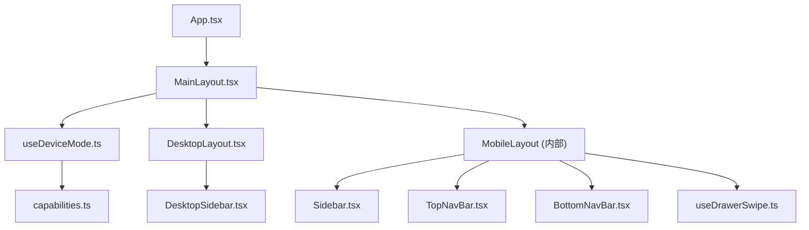
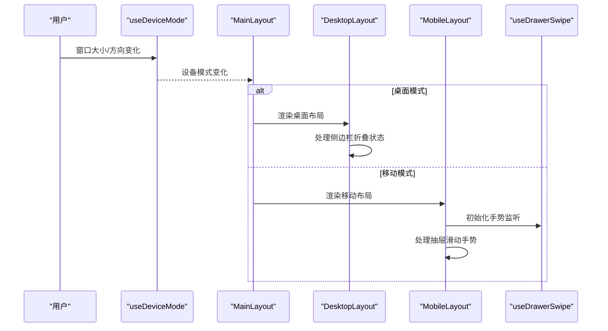
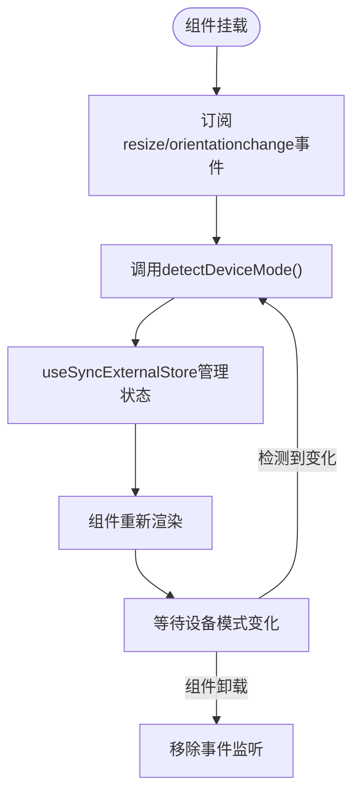
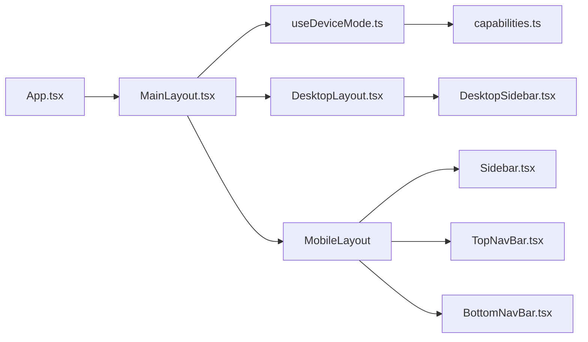

# 主布局组件 MainLayout

<cite>
**本文引用的文件**
- [src/components/layout/MainLayout.tsx](file://src/components/layout/MainLayout.tsx)
- [src/components/layout/Sidebar.tsx](file://src/components/layout/Sidebar.tsx)
- [src/components/layout/TopNavBar.tsx](file://src/components/layout/TopNavBar.tsx)
- [src/components/layout/BottomNavBar.tsx](file://src/components/layout/BottomNavBar.tsx)
- [src/components/layout/DesktopLayout.tsx](file://src/components/layout/DesktopLayout.tsx)
- [src/components/layout/DesktopSidebar.tsx](file://src/components/layout/DesktopSidebar.tsx)
- [src/hooks/useDrawerSwipe.ts](file://src/hooks/useDrawerSwipe.ts)
- [src/platform/useDeviceMode.ts](file://src/platform/useDeviceMode.ts)
- [src/platform/capabilities.ts](file://src/platform/capabilities.ts)
- [src/App.tsx](file://src/App.tsx)
- [src/types/index.ts](file://src/types/index.ts)
</cite>

## 更新摘要
**所做更改**
- 新增设备模式检测功能，支持自动在移动端和桌面端布局间切换
- 添加 DesktopLayout 组件用于桌面端布局展示
- 增强 MainLayout 作为布局分发外壳的功能
- 更新响应式布局架构说明

## 目录
1. [简介](#简介)
2. [项目结构](#项目结构)
3. [核心组件](#核心组件)
4. [架构总览](#架构总览)
5. [详细组件分析](#详细组件分析)
6. [依赖关系分析](#依赖关系分析)
7. [性能考量](#性能考量)
8. [故障排查指南](#故障排查指南)
9. [结论](#结论)
10. [附录：使用示例与最佳实践](#附录使用示例与最佳实践)

## 简介
MainLayout 是应用的根布局容器，负责：
- **设备模式检测**：自动识别当前设备类型（移动/桌面），并动态切换相应的布局方案
- **响应式全屏布局**：根据设备形态提供优化的视口高度冻结和布局适配
- **移动端抽屉导航**：侧边栏抽屉的滑动手势交互（任意位置横滑打开/收起）
- **桌面端侧边栏导航**：可折叠的左侧导航面板，支持状态持久化
- **顶部导航栏与底部导航栏的集成**：移动端特有的导航元素
- **输入框焦点管理**：聚焦时隐藏底部导航，失焦后恢复
- **业务数据透传**：将会话、模型、上下文用量等数据传递给子组件

该组件通过组合 MobileLayout、DesktopLayout、Sidebar、TopNavBar、BottomNavBar 以及手势 Hook useDrawerSwipe，形成统一的跨平台页面框架。

## 项目结构
MainLayout 位于 layout 目录下，作为布局分发器，根据设备模式选择相应的布局实现；App 作为入口将业务状态注入到 MainLayout。

**图表来源**
- [src/App.tsx:174-209](file://src/App.tsx#L174-L209)
- [src/components/layout/MainLayout.tsx:287-294](file://src/components/layout/MainLayout.tsx#L287-L294)
- [src/platform/useDeviceMode.ts:18-20](file://src/platform/useDeviceMode.ts#L18-L20)

**章节来源**
- [src/App.tsx:174-209](file://src/App.tsx#L174-L209)
- [src/components/layout/MainLayout.tsx:287-294](file://src/components/layout/MainLayout.tsx#L287-L294)

## 核心组件
- **MainLayout**：布局分发外壳，根据设备模式选择 MobileLayout 或 DesktopLayout
- **MobileLayout**：移动端布局实现，包含抽屉侧边栏、顶栏、底栏和手势交互
- **DesktopLayout**：桌面端布局实现，包含可折叠侧边栏和主内容区域
- **DesktopSidebar**：桌面端侧边栏，支持折叠/展开状态和模式页签
- **Sidebar**：移动端侧边栏，包含会话列表、搜索、筛选等功能
- **TopNavBar**：顶部导航栏，汉堡菜单、模型选择器、上下文用量环
- **BottomNavBar**：底部导航栏，Tab 切换功能
- **useDeviceMode**：设备模式检测 Hook，实时监听窗口变化
- **useDrawerSwipe**：左侧抽屉横向滑动手势 Hook

**章节来源**
- [src/components/layout/MainLayout.tsx:15-57](file://src/components/layout/MainLayout.tsx#L15-L57)
- [src/components/layout/MobileLayout.tsx:59-285](file://src/components/layout/MainLayout.tsx#L59-L285)
- [src/components/layout/DesktopLayout.tsx:19-65](file://src/components/layout/DesktopLayout.tsx#L19-L65)
- [src/components/layout/DesktopSidebar.tsx:27-132](file://src/components/layout/DesktopSidebar.tsx#L27-L132)

## 架构总览
MainLayout 采用**布局分发模式**，根据设备模式动态选择最优布局方案：

**图表来源**
- [src/components/layout/MainLayout.tsx:287-294](file://src/components/layout/MainLayout.tsx#L287-L294)
- [src/platform/useDeviceMode.ts:4-20](file://src/platform/useDeviceMode.ts#L4-L20)
- [src/platform/capabilities.ts:36-43](file://src/platform/capabilities.ts#L36-L43)

设备模式检测规则：
- **原生 Android**：始终返回 mobile
- **Electron 环境**：始终返回 desktop  
- **精确指针设备**（鼠标/触控板）：返回 desktop
- **触摸设备**：宽度 ≥1024px 为 desktop，否则为 mobile
- **兜底保护**：宽度 <480px 强制为 mobile

**章节来源**
- [src/platform/capabilities.ts:36-43](file://src/platform/capabilities.ts#L36-L43)

## 详细组件分析

### MainLayout 组件（布局分发器）
职责
- **设备模式检测**：使用 useDeviceMode Hook 实时获取当前设备类型
- **布局分发**：根据设备模式渲染对应的 MobileLayout 或 DesktopLayout
- **Props 透传**：保持两套布局共享相同的接口定义

关键 Props
- activeTab: TabMode，当前激活的标签页
- onTabChange: (tab: TabMode) => void，切换标签回调
- children: ReactNode，页面主体内容
- conversations?: Conversation[]，会话列表
- activeConversationId?: string，当前会话 ID
- models?: Model[]，可用模型列表
- selectedModel?: string，当前选中模型
- webSearchEnabled?: boolean，联网搜索开关
- artifactEnabled?: boolean，Artifact 功能开关
- realUsage?: UsageTotals，真实 token 用量
- contextLimit?: number，上下文上限
- segments?: ContextSegment[]，已压缩的上下文片段

**更新** 新增设备模式检测功能，支持自动布局切换

**章节来源**
- [src/components/layout/MainLayout.tsx:287-294](file://src/components/layout/MainLayout.tsx#L287-L294)
- [src/components/layout/MainLayout.tsx:15-57](file://src/components/layout/MainLayout.tsx#L15-L57)

### MobileLayout 组件（移动端布局）
职责
- **抽屉侧边栏**：实现横滑手势打开/收起侧边栏
- **输入焦点管理**：检测输入框聚焦状态，控制底部导航显示
- **视口高度冻结**：防止键盘弹出导致的布局抖动
- **原生平台适配**：处理 Capacitor 壳的特殊需求

关键特性
- 使用 useDrawerSwipe 实现流畅的抽屉手势
- 支持 ESC 键关闭侧边栏
- 处理 Android 返回键事件
- 智能滚动定位避免键盘遮挡

**章节来源**
- [src/components/layout/MainLayout.tsx:59-285](file://src/components/layout/MainLayout.tsx#L59-L285)

### DesktopLayout 组件（桌面端布局）
职责
- **可折叠侧边栏**：支持 localStorage 持久化的折叠状态
- **模式页签导航**：聊天、图片、收藏三个主要功能入口
- **主内容区域**：圆角卡片样式的内容展示区
- **顶部首页区**：与侧边栏等宽的固定高度区域

关键特性
- 侧边栏宽度：展开 224px，折叠 60px
- 状态持久化：折叠状态保存在 localStorage
- 响应式设计：自适应主内容区域宽度

**新增** 桌面端专用布局实现

**章节来源**
- [src/components/layout/DesktopLayout.tsx:19-65](file://src/components/layout/DesktopLayout.tsx#L19-L65)

### DesktopSidebar 组件（桌面端侧边栏）
职责
- **模式页签管理**：聊天、图片、收藏三个功能模块
- **折叠状态控制**：按钮切换侧边栏展开/折叠
- **BYOC 同步状态**：显示右下角同步状态指示点
- **工具提示**：折叠态下的悬停提示功能

关键特性
- 自定义 Tooltip 实现
- BYOC 同步状态可视化
- 平滑过渡动画效果

**新增** 桌面端侧边栏专用组件

**章节来源**
- [src/components/layout/DesktopSidebar.tsx:27-132](file://src/components/layout/DesktopSidebar.tsx#L27-L132)

### useDeviceMode Hook（设备模式检测）
职责
- **实时设备检测**：监听窗口 resize 和 orientationchange 事件
- **外部存储订阅**：使用 useSyncExternalStore 管理设备状态
- **响应式更新**：设备模式变化时自动触发组件重渲染

实现原理

**图表来源**
- [src/platform/useDeviceMode.ts:4-20](file://src/platform/useDeviceMode.ts#L4-L20)

**章节来源**
- [src/platform/useDeviceMode.ts:1-20](file://src/platform/useDeviceMode.ts#L1-L20)

### 设备模式检测逻辑（capabilities.ts）
职责
- **多平台兼容**：支持 Web、Electron、Capacitor 等多种运行环境
- **智能判断**：基于设备能力、指针类型、窗口尺寸综合判断
- **安全兜底**：确保极端情况下的合理默认值

检测规则优先级：
1. **原生 Android**：强制 mobile
2. **窗口宽度 <480px**：强制 mobile
3. **Electron 环境**：强制 desktop
4. **精确指针设备**：desktop
5. **触摸设备宽度 ≥1024px**：desktop
6. **其他情况**：mobile

**新增** 完整的设备模式检测算法

**章节来源**
- [src/platform/capabilities.ts:1-44](file://src/platform/capabilities.ts#L1-L44)

## 依赖关系分析
- **MainLayout** 依赖 useDeviceMode 进行设备检测，根据结果选择相应布局
- **DesktopLayout** 依赖 DesktopSidebar 实现桌面端导航
- **MobileLayout** 依赖 Sidebar、TopNavBar、BottomNavBar 实现移动端界面
- **所有布局** 都依赖 App 层提供的业务数据和状态管理

**图表来源**
- [src/App.tsx:174-209](file://src/App.tsx#L174-L209)
- [src/components/layout/MainLayout.tsx:287-294](file://src/components/layout/MainLayout.tsx#L287-L294)

**章节来源**
- [src/App.tsx:174-209](file://src/App.tsx#L174-L209)
- [src/components/layout/MainLayout.tsx:287-294](file://src/components/layout/MainLayout.tsx#L287-L294)

## 性能考量
- **设备模式缓存**：useDeviceMode 使用 useSyncExternalStore 避免不必要的重渲染
- **条件渲染优化**：根据设备模式只渲染对应布局，减少 DOM 节点数量
- **localStorage 访问优化**：桌面端侧边栏状态读取使用 try-catch 包裹
- **事件监听管理**：useDeviceMode 正确清理 resize 和 orientationchange 监听器
- **移动端手势优化**：拖动中禁用 CSS transition，保证跟手流畅性
- **视口高度冻结**：避免键盘弹出导致的 reflow 与抖动

## 故障排查指南
常见问题与解决思路
- **设备模式检测不准确**
  - 检查浏览器环境是否正确设置
  - 验证 window.innerWidth 和设备能力检测
  - 确认 Electron 环境下 electronAPI 的正确暴露
- **布局切换不生效**
  - 检查 useDeviceMode 的事件监听是否正常注册
  - 验证 detectDeviceMode 函数的返回值
  - 确认 MainLayout 的条件渲染逻辑
- **桌面端侧边栏状态丢失**
  - 检查 localStorage 是否可用
  - 验证 COLLAPSED_STORAGE_KEY 常量定义
  - 确认状态读写操作的异常处理
- **移动端手势冲突**
  - 检查 data-swipe-ignore 属性是否正确设置
  - 确认 INPUT/TEXTAREA 元素的特殊处理
  - 验证 touchAction 样式配置

**章节来源**
- [src/platform/useDeviceMode.ts:4-20](file://src/platform/useDeviceMode.ts#L4-L20)
- [src/platform/capabilities.ts:36-43](file://src/platform/capabilities.ts#L36-L43)
- [src/components/layout/DesktopLayout.tsx:10-32](file://src/components/layout/DesktopLayout.tsx#L10-L32)

## 结论
MainLayout 作为应用根布局，通过引入设备模式检测功能，实现了真正的跨平台响应式设计。它能够自动识别设备类型并在移动端抽屉导航和桌面端侧边栏导航之间无缝切换，为用户提供最适合当前设备的交互体验。配合 MobileLayout、DesktopLayout、DesktopSidebar 等组件，形成了完整的多平台布局解决方案。遵循本文的性能建议与最佳实践，可进一步提升用户体验与可维护性。

## 附录：使用示例与最佳实践

### 在应用中正确使用 MainLayout
- 在 App 中引入 MainLayout，并将 activeTab、onTabChange、conversations、activeConversationId、模型与上下文用量等状态传入
- 将各功能面板（ChatPanel、ImagePanel、FavoritesPanel、SettingsPanel）作为 children 渲染
- 根据 activeTab 条件传入 models、selectedModel、onModelChange、webSearchEnabled、artifactEnabled 等属性

参考路径
- [src/App.tsx:174-209](file://src/App.tsx#L174-L209)

### 设备模式检测最佳实践
- 利用 useDeviceMode Hook 获取实时设备状态
- 在需要特定设备行为的组件中使用设备模式判断
- 注意处理设备模式变化时的状态同步
- 为不同设备模式提供合适的 UI 和行为差异

参考路径
- [src/platform/useDeviceMode.ts:18-20](file://src/platform/useDeviceMode.ts#L18-L20)
- [src/platform/capabilities.ts:36-43](file://src/platform/capabilities.ts#L36-L43)

### 桌面端布局最佳实践
- 合理使用侧边栏折叠功能，提升空间利用率
- 利用 localStorage 持久化用户偏好设置
- 为折叠态提供清晰的视觉反馈和工具提示
- 确保主内容区域的响应式适配

参考路径
- [src/components/layout/DesktopLayout.tsx:10-32](file://src/components/layout/DesktopLayout.tsx#L10-L32)
- [src/components/layout/DesktopSidebar.tsx:54-60](file://src/components/layout/DesktopSidebar.tsx#L54-L60)

### 移动端布局最佳实践
- 在需要屏蔽手势的区域添加 data-swipe-ignore 属性
- 避免在 INPUT/TEXTAREA/可编辑区域或横向可滚动元素上触发抽屉手势
- 合理设置宽度与吸附阈值，确保打开/收起体验自然
- 正确处理输入框焦点状态，优化移动端输入体验

参考路径
- [src/hooks/useDrawerSwipe.ts:44-67](file://src/hooks/useDrawerSwipe.ts#L44-L67)
- [src/components/layout/MainLayout.tsx:117-142](file://src/components/layout/MainLayout.tsx#L117-L142)

### 响应式设计最佳实践
- 使用设备模式检测而非简单的媒体查询，提供更准确的设备识别
- 为不同设备模式提供专门的布局和交互方案
- 确保布局切换的平滑性和一致性
- 考虑边缘情况和回退机制

参考路径
- [src/platform/capabilities.ts:31-43](file://src/platform/capabilities.ts#L31-L43)
- [src/components/layout/MainLayout.tsx:287-294](file://src/components/layout/MainLayout.tsx#L287-L294)