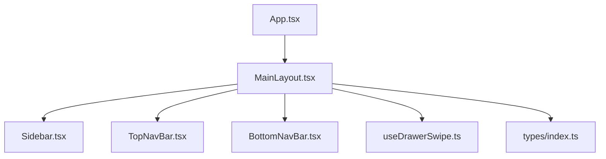
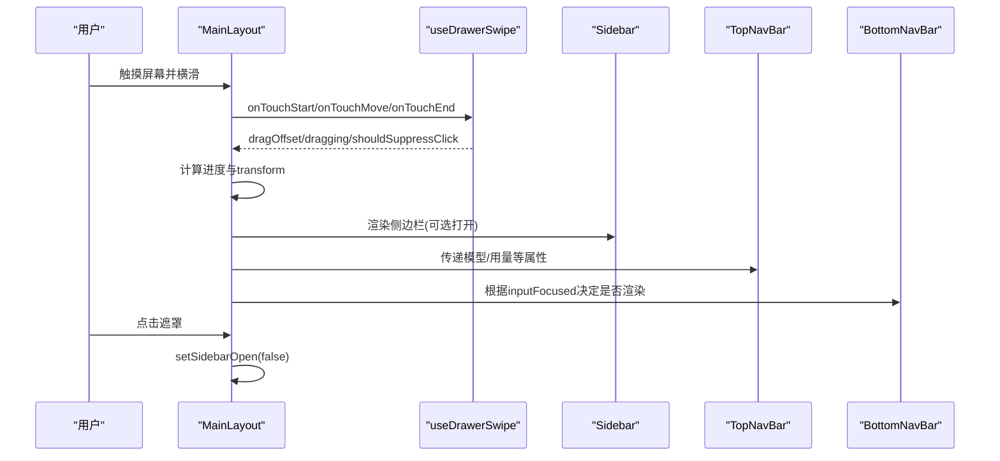
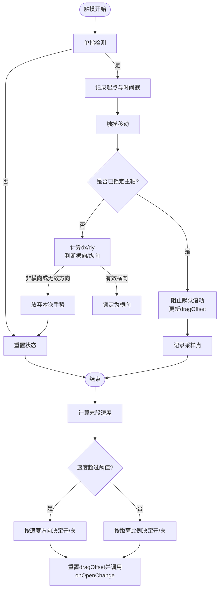
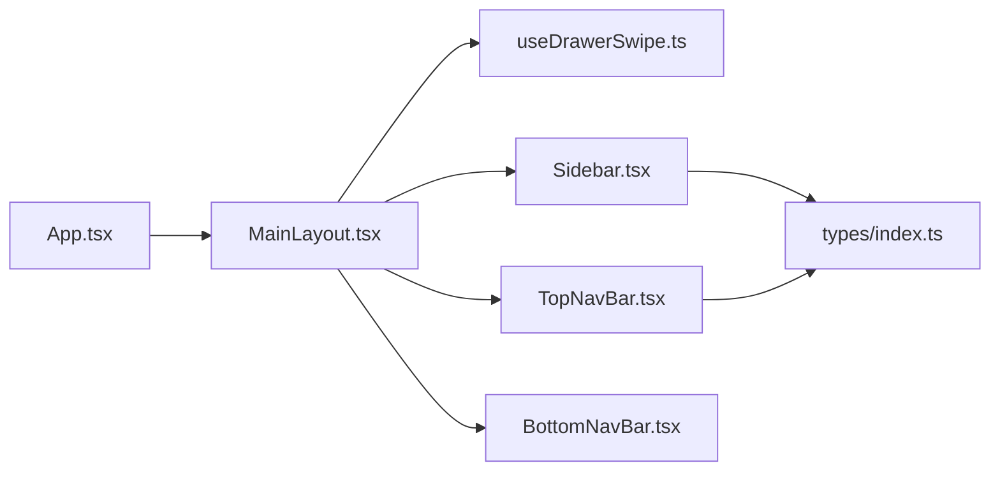

# 主布局组件 MainLayout

<cite>
**本文引用的文件**
- [src/components/layout/MainLayout.tsx](file://src/components/layout/MainLayout.tsx)
- [src/components/layout/Sidebar.tsx](file://src/components/layout/Sidebar.tsx)
- [src/components/layout/TopNavBar.tsx](file://src/components/layout/TopNavBar.tsx)
- [src/components/layout/BottomNavBar.tsx](file://src/components/layout/BottomNavBar.tsx)
- [src/hooks/useDrawerSwipe.ts](file://src/hooks/useDrawerSwipe.ts)
- [src/App.tsx](file://src/App.tsx)
- [src/types/index.ts](file://src/types/index.ts)
</cite>

## 目录
1. [简介](#简介)
2. [项目结构](#项目结构)
3. [核心组件](#核心组件)
4. [架构总览](#架构总览)
5. [详细组件分析](#详细组件分析)
6. [依赖关系分析](#依赖关系分析)
7. [性能考量](#性能考量)
8. [故障排查指南](#故障排查指南)
9. [结论](#结论)
10. [附录：使用示例与最佳实践](#附录使用示例与最佳实践)

## 简介
MainLayout 是应用的根布局容器，负责：
- 响应式全屏布局与视口高度冻结，避免键盘弹起导致页面抖动
- 侧边栏抽屉的滑动手势交互（任意位置横滑打开/收起）
- 顶部导航栏与底部导航栏的集成
- 输入框焦点管理（聚焦时隐藏底部导航，失焦后恢复）
- 将业务数据（会话、模型、上下文用量等）透传给子组件

该组件通过组合 Sidebar、TopNavBar、BottomNavBar 以及手势 Hook useDrawerSwipe，形成统一的页面骨架。

## 项目结构
MainLayout 位于 layout 目录下，与 Sidebar、TopNavBar、BottomNavBar 共同构成应用外壳；App 作为入口将业务状态注入到 MainLayout。

图表来源
- [src/App.tsx:97-128](file://src/App.tsx#L97-L128)
- [src/components/layout/MainLayout.tsx:1-10](file://src/components/layout/MainLayout.tsx#L1-L10)

章节来源
- [src/App.tsx:97-128](file://src/App.tsx#L97-L128)
- [src/components/layout/MainLayout.tsx:1-10](file://src/components/layout/MainLayout.tsx#L1-L10)

## 核心组件
- MainLayout：根布局容器，管理侧边栏开关、输入焦点、手势拖动、遮罩层、顶部/底部导航集成
- Sidebar：会话列表、搜索、筛选、批量操作、长按上下文菜单、重命名与删除确认
- TopNavBar：汉堡菜单、模型选择器、上下文用量环、新建对话按钮、上下文详情面板
- BottomNavBar：底部 Tab 切换（对话、收藏、我的）
- useDrawerSwipe：左侧抽屉横向滑动手势 Hook，处理触摸事件、主轴判定、速度/距离吸附、点击抑制

章节来源
- [src/components/layout/MainLayout.tsx:10-43](file://src/components/layout/MainLayout.tsx#L10-L43)
- [src/components/layout/Sidebar.tsx:12-26](file://src/components/layout/Sidebar.tsx#L12-L26)
- [src/components/layout/TopNavBar.tsx:9-32](file://src/components/layout/TopNavBar.tsx#L9-L32)
- [src/components/layout/BottomNavBar.tsx:4-13](file://src/components/layout/BottomNavBar.tsx#L4-L13)
- [src/hooks/useDrawerSwipe.ts:34-42](file://src/hooks/useDrawerSwipe.ts#L34-L42)

## 架构总览
MainLayout 在渲染时：
- 使用 useDrawerSwipe 提供 ref、dragOffset、dragging、shouldSuppressClick
- 根据 dragOffset 动态计算侧边栏与内容区的 transform，实现跟随手指的滑动效果
- 在侧边栏打开时显示半透明遮罩，支持点击关闭
- 监听输入框焦点变化控制底部导航显示
- 将 models、selectedModel、webSearchEnabled、artifactEnabled、上下文用量等属性透传到 TopNavBar

图表来源
- [src/components/layout/MainLayout.tsx:108-172](file://src/components/layout/MainLayout.tsx#L108-L172)
- [src/hooks/useDrawerSwipe.ts:107-197](file://src/hooks/useDrawerSwipe.ts#L107-L197)
- [src/components/layout/TopNavBar.tsx:77-165](file://src/components/layout/TopNavBar.tsx#L77-L165)
- [src/components/layout/BottomNavBar.tsx:15-36](file://src/components/layout/BottomNavBar.tsx#L15-L36)

## 详细组件分析

### MainLayout 组件
职责
- 管理侧边栏打开状态与手势拖动
- 管理输入框焦点以控制底部导航显示
- 冻结初始视口高度防止键盘弹出导致的布局抖动
- 透传业务数据给 TopNavBar 和 Sidebar

关键 Props
- activeTab: TabMode，当前激活的标签页
- onTabChange: (tab: TabMode) => void，切换标签回调
- children: ReactNode，页面主体内容
- conversations?: Conversation[]，会话列表
- activeConversationId?: string，当前会话 ID
- onSwitchConversation?: (id: string) => void，切换会话
- onNewConversation?: () => void，新建会话
- canCreateNewConversation?: boolean，是否允许新建会话
- onDeleteConversation?: (id: string) => void，删除单个会话
- onDeleteConversations?: (ids: string[]) => void，批量删除会话
- onToggleConversationFavorite?: (id: string) => void，收藏/取消收藏
- onRenameConversation?: (id: string, title: string) => void，重命名会话
- models?: Model[]，可用模型列表
- selectedModel?: string，当前选中模型
- onModelChange?: (modelId: string) => void，模型切换回调
- webSearchEnabled?: boolean，联网搜索开关
- onWebSearchToggle?: () => void，切换联网搜索
- artifactEnabled?: boolean，Artifact 功能开关
- onArtifactToggle?: () => void，切换 Artifact
- realUsage?: UsageTotals，真实 token 用量
- contextLimit?: number，上下文上限
- isCompacting?: boolean，是否正在压缩
- isAwaitingUsage?: boolean，是否等待用量更新
- onCompactActive?: () => void，触发压缩
- segments?: ContextSegment[]，已压缩的上下文片段
- onOpenSegment?: (segmentId: string) => void，打开某段摘要
- onDeleteSegment?: (segmentId: string) => void，回退某段摘要

输入框焦点管理
- 通过 onFocusIn/onBlurOut 检测 TEXTAREA 的聚焦与失焦
- 使用延迟定时器避免同区域元素切换时的闪烁
- 聚焦时隐藏底部导航，提升输入体验

侧边栏手势
- 使用 useDrawerSwipe 获取 ref、dragOffset、dragging、shouldSuppressClick
- 拖动中禁用 CSS transition，松手后按速度/距离吸附到最近状态
- 遮罩层透明度随进度变化，点击遮罩可关闭侧边栏

响应式与视口
- 冻结初始 window.innerHeight，避免键盘弹出导致 dvh 变化引起整页收缩
- 使用 touchAction: 'manipulation' 优化移动端触摸行为

章节来源
- [src/components/layout/MainLayout.tsx:10-43](file://src/components/layout/MainLayout.tsx#L10-L43)
- [src/components/layout/MainLayout.tsx:74-114](file://src/components/layout/MainLayout.tsx#L74-L114)
- [src/components/layout/MainLayout.tsx:116-201](file://src/components/layout/MainLayout.tsx#L116-L201)

### Sidebar 组件
职责
- 会话列表展示、搜索、筛选（全部/收藏）、批量选择与删除
- 长按呼出上下文菜单（导出、编辑标题、收藏/取消收藏、删除）
- 重命名与删除确认弹窗

交互细节
- 点击项先本地高亮再切换，提供即时反馈
- 长按触发上下文菜单，自动定位到可视区域内，必要时滚动或翻转方向
- 使用 createPortal 将菜单与遮罩挂载到 body，避免被祖先 overflow 裁剪

章节来源
- [src/components/layout/Sidebar.tsx:12-26](file://src/components/layout/Sidebar.tsx#L12-L26)
- [src/components/layout/Sidebar.tsx:66-84](file://src/components/layout/Sidebar.tsx#L66-L84)
- [src/components/layout/Sidebar.tsx:109-218](file://src/components/layout/Sidebar.tsx#L109-L218)
- [src/components/layout/Sidebar.tsx:220-263](file://src/components/layout/Sidebar.tsx#L220-L263)
- [src/components/layout/Sidebar.tsx:365-438](file://src/components/layout/Sidebar.tsx#L365-L438)
- [src/components/layout/Sidebar.tsx:440-554](file://src/components/layout/Sidebar.tsx#L440-L554)

### TopNavBar 组件
职责
- 汉堡菜单打开/关闭侧边栏
- 模型选择器（含联网搜索与 Artifact 开关）
- 上下文用量环与详情面板（压缩、查看片段）
- 新建对话按钮（受 canCreateNewConversation 控制）

章节来源
- [src/components/layout/TopNavBar.tsx:9-32](file://src/components/layout/TopNavBar.tsx#L9-L32)
- [src/components/layout/TopNavBar.tsx:77-165](file://src/components/layout/TopNavBar.tsx#L77-L165)

### BottomNavBar 组件
职责
- 底部 Tab 切换（对话、收藏、我的）
- 根据 activeTab 高亮当前项

章节来源
- [src/components/layout/BottomNavBar.tsx:4-13](file://src/components/layout/BottomNavBar.tsx#L4-L13)
- [src/components/layout/BottomNavBar.tsx:15-36](file://src/components/layout/BottomNavBar.tsx#L15-L36)

### useDrawerSwipe Hook
职责
- 监听触摸事件，实现左侧抽屉的横滑打开/收起
- 主轴锁定：首次位移超过阈值且满足方向条件才接管
- 忽略目标：输入框、可编辑区域、横向可滚动元素优先原生滚动
- 吸附策略：速度优先（末段窗口内速度），否则按距离阈值判断
- 点击抑制：手势结束后短暂屏蔽 click，避免误触遮罩关闭

算法流程

图表来源
- [src/hooks/useDrawerSwipe.ts:107-197](file://src/hooks/useDrawerSwipe.ts#L107-L197)

章节来源
- [src/hooks/useDrawerSwipe.ts:34-42](file://src/hooks/useDrawerSwipe.ts#L34-L42)
- [src/hooks/useDrawerSwipe.ts:44-67](file://src/hooks/useDrawerSwipe.ts#L44-L67)
- [src/hooks/useDrawerSwipe.ts:107-197](file://src/hooks/useDrawerSwipe.ts#L107-L197)

## 依赖关系分析
- MainLayout 依赖 useDrawerSwipe 实现手势，依赖 Sidebar、TopNavBar、BottomNavBar 完成 UI 组装
- App 将聊天状态、模型配置、上下文用量等注入到 MainLayout
- Sidebar 依赖类型 Conversation，TopNavBar 依赖 Model、ContextSegment、UsageTotals
- BottomNavBar 依赖 TabMode

图表来源
- [src/App.tsx:97-128](file://src/App.tsx#L97-L128)
- [src/components/layout/MainLayout.tsx:1-10](file://src/components/layout/MainLayout.tsx#L1-L10)
- [src/types/index.ts:125-175](file://src/types/index.ts#L125-L175)

章节来源
- [src/App.tsx:97-128](file://src/App.tsx#L97-L128)
- [src/components/layout/MainLayout.tsx:1-10](file://src/components/layout/MainLayout.tsx#L1-L10)
- [src/types/index.ts:125-175](file://src/types/index.ts#L125-L175)

## 性能考量
- 冻结视口高度：避免键盘弹出引起的 reflow 与抖动
- 拖动中禁用 CSS transition：减少合成开销，保证跟手流畅
- 使用 useMemo 对侧边栏数据进行过滤与分组，降低重复计算
- 使用 createPortal 将菜单与遮罩挂载到 body，避免复杂层级下的裁剪与重绘
- 输入焦点管理使用延迟定时器，减少频繁状态切换导致的闪烁
- 手势 Hook 使用 ref 保存高频变化的 open/onOpenChange/onSettle，避免 effect 频繁解绑/重绑监听

[本节为通用性能建议，不直接分析具体代码行]

## 故障排查指南
常见问题与解决思路
- 侧边栏无法打开/收起
  - 检查 useDrawerSwipe 的 enabled 与 width 是否正确传入
  - 确认手势起点未落在 INPUT/TEXTAREA/可编辑区域或横向可滚动元素内
- 拖动卡顿或页面滚动
  - 确保 touchmove 使用 passive: false 并正确 preventDefault
  - 检查是否有祖先元素拦截了事件或样式影响
- 点击遮罩后侧边栏立即关闭
  - 手势结束后会短暂屏蔽 click，若仍误触，检查 shouldSuppressClick 的使用时机
- 输入框聚焦时底部导航未隐藏
  - 确认 main 容器上绑定了 onFocusIn/onBlurOut，且检测的是 TEXTAREA
- 上下文用量环不显示或动画异常
  - 检查 TopNavBar 是否收到 realUsage 与 contextLimit，并在切换会话时 key 变化以重置状态

章节来源
- [src/hooks/useDrawerSwipe.ts:107-197](file://src/hooks/useDrawerSwipe.ts#L107-L197)
- [src/components/layout/MainLayout.tsx:74-114](file://src/components/layout/MainLayout.tsx#L74-L114)
- [src/components/layout/TopNavBar.tsx:77-165](file://src/components/layout/TopNavBar.tsx#L77-L165)

## 结论
MainLayout 作为应用根布局，整合了侧边栏手势、输入焦点管理、顶部/底部导航与业务数据透传，提供了稳定、流畅且可扩展的页面框架。配合 Sidebar、TopNavBar、BottomNavBar 与 useDrawerSwipe，实现了完整的移动端交互体验。遵循本文的性能建议与最佳实践，可进一步提升用户体验与可维护性。

[本节为总结性内容，不直接分析具体代码行]

## 附录：使用示例与最佳实践

### 在应用中正确使用 MainLayout
- 在 App 中引入 MainLayout，并将 activeTab、onTabChange、conversations、activeConversationId、模型与上下文用量等状态传入
- 将各功能面板（ChatPanel、ImagePanel、FavoritesPanel、SettingsPanel）作为 children 渲染
- 根据 activeTab 条件传入 models、selectedModel、onModelChange、webSearchEnabled、artifactEnabled 等属性

参考路径
- [src/App.tsx:97-128](file://src/App.tsx#L97-L128)

### 侧边栏手势最佳实践
- 在需要屏蔽手势的区域添加 data-swipe-ignore 属性
- 避免在 INPUT/TEXTAREA/可编辑区域或横向可滚动元素上触发抽屉手势
- 合理设置宽度与吸附阈值，确保打开/收起体验自然

参考路径
- [src/hooks/useDrawerSwipe.ts:44-67](file://src/hooks/useDrawerSwipe.ts#L44-L67)
- [src/hooks/useDrawerSwipe.ts:107-197](file://src/hooks/useDrawerSwipe.ts#L107-L197)

### 输入框焦点管理最佳实践
- 在 main 容器上绑定 onFocusIn/onBlurOut，检测 TEXTAREA 的聚焦与失焦
- 使用延迟定时器避免同区域切换时的闪烁
- 聚焦时隐藏底部导航，提升输入体验

参考路径
- [src/components/layout/MainLayout.tsx:74-93](file://src/components/layout/MainLayout.tsx#L74-L93)

### 顶部导航栏集成要点
- 传入 models、selectedModel、onModelChange 以启用模型选择器
- 传入 realUsage、contextLimit、isCompacting、isAwaitingUsage 以显示上下文用量环与面板
- 通过 onToggleSidebar 控制侧边栏开关

参考路径
- [src/components/layout/TopNavBar.tsx:9-32](file://src/components/layout/TopNavBar.tsx#L9-L32)
- [src/components/layout/TopNavBar.tsx:77-165](file://src/components/layout/TopNavBar.tsx#L77-L165)

### 底部导航栏集成要点
- 传入 activeTab 与 onTabChange，实现 Tab 切换
- 根据 inputFocused 决定是否渲染，避免遮挡输入

参考路径
- [src/components/layout/BottomNavBar.tsx:4-13](file://src/components/layout/BottomNavBar.tsx#L4-L13)
- [src/components/layout/BottomNavBar.tsx:15-36](file://src/components/layout/BottomNavBar.tsx#L15-L36)