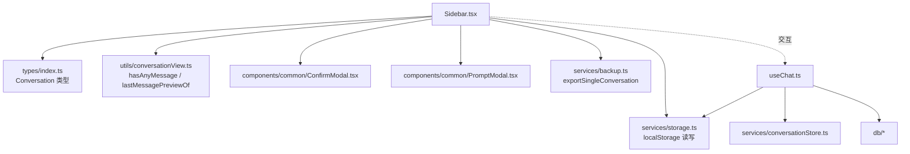
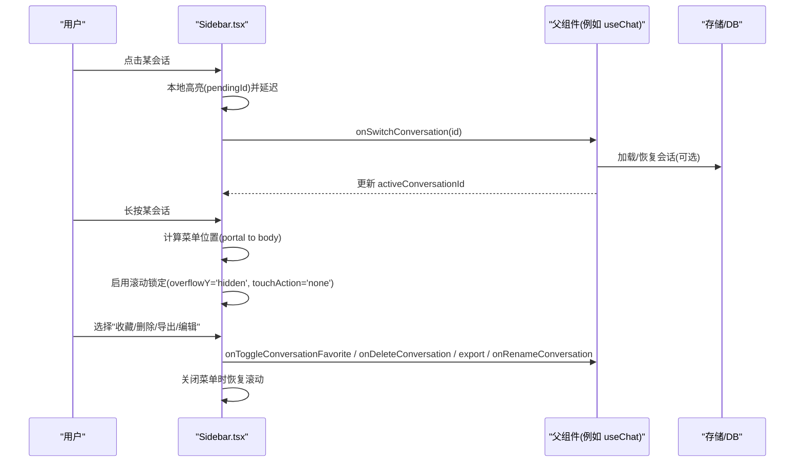
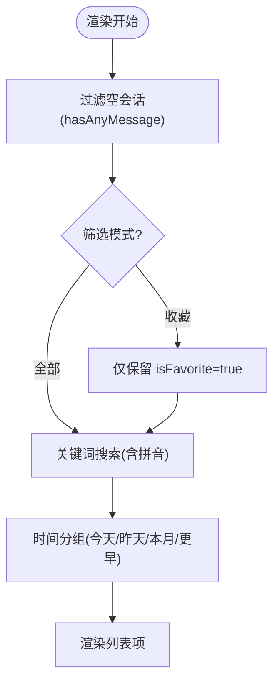
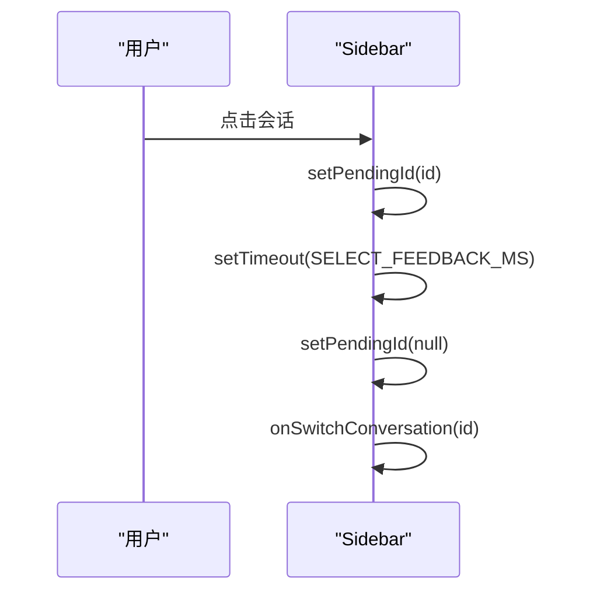
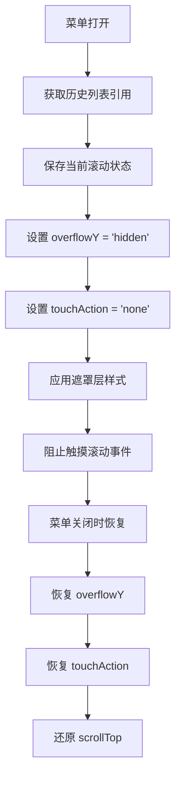
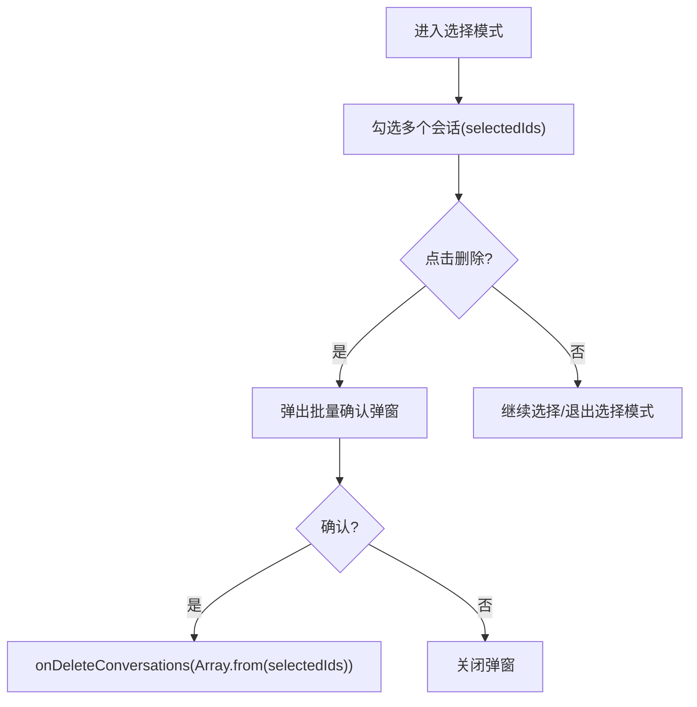
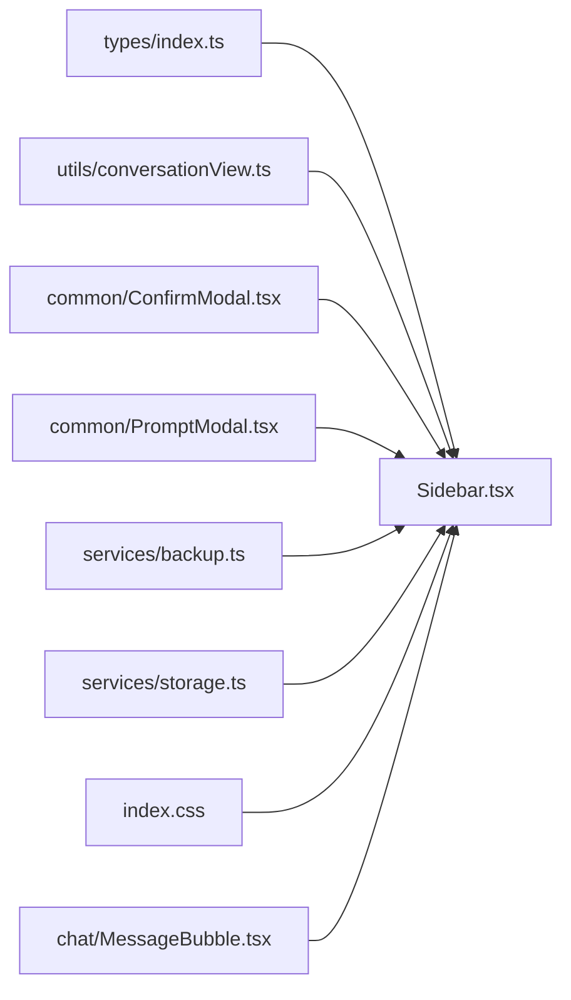

# 侧边栏组件 Sidebar

<cite>
**本文引用的文件**
- [Sidebar.tsx](file://src/components/layout/Sidebar.tsx)
- [ConversationList.tsx](file://src/components/chat/ConversationList.tsx)
- [index.ts（类型定义）](file://src/types/index.ts)
- [storage.ts](file://src/services/storage.ts)
- [conversationView.ts](file://src/utils/conversationView.ts)
- [ConfirmModal.tsx](file://src/components/common/ConfirmModal.tsx)
- [PromptModal.tsx](file://src/components/common/PromptModal.tsx)
- [backup.ts](file://src/services/backup.ts)
- [MessageBubble.tsx](file://src/components/chat/MessageBubble.tsx)
- [index.css](file://src/index.css)
</cite>

## 目录
1. [简介](#简介)
2. [项目结构](#项目结构)
3. [核心组件与能力](#核心组件与能力)
4. [架构总览](#架构总览)
5. [详细组件分析](#详细组件分析)
6. [依赖关系分析](#依赖关系分析)
7. [性能考量](#性能考量)
8. [故障排查指南](#故障排查指南)
9. [结论](#结论)
10. [附录：集成示例与样式定制](#附录：集成示例与样式定制)

## 简介
本章节面向使用方，系统性说明 Sidebar 侧边栏组件的功能特性、Props 接口、会话状态管理、批量操作、可访问性与样式定制要点。该组件负责会话列表的展示与管理，包括搜索过滤、分组显示、收藏切换、重命名、导出、删除（单个与批量）、长按上下文菜单等。

**最新更新**：增强了滚动锁定机制，当上下文菜单打开时，通过 CSS 属性操作（overflowY 设置为 'hidden'，touchAction 设置为 'none'）和增强遮罩组件（添加 touch-none 和 overscroll-none 类以及显式的 onTouchMove 处理器）来防止滚动干扰，确保在移动端和桌面端都能获得一致的交互体验。

## 项目结构
Sidebar 位于布局层，依赖通用弹窗、工具函数与备份服务；数据模型由 types 统一描述；会话持久化与恢复由上层 Hook 与服务协作完成。

图表来源
- [Sidebar.tsx:1-11](file://src/components/layout/Sidebar.tsx#L1-L11)
- [conversationView.ts:1-33](file://src/utils/conversationView.ts#L1-L33)
- [ConfirmModal.tsx:1-135](file://src/components/common/ConfirmModal.tsx#L1-L135)
- [backup.ts:1-257](file://src/services/backup.ts#L1-L257)
- [storage.ts:1-63](file://src/services/storage.ts#L1-L63)

章节来源
- [Sidebar.tsx:1-606](file://src/components/layout/Sidebar.tsx#L1-L606)
- [index.ts:143-175](file://src/types/index.ts#L143-L175)

## 核心组件与能力
- 会话列表渲染与分组：按"今天/昨天/本月/更早"分组，支持搜索（含拼音匹配）。
- 当前会话高亮：通过 activeConversationId 与 pendingId 实现点击反馈与高亮。
- 收藏功能：单条收藏/取消收藏，支持"所有/收藏"筛选。
- 重命名：长按菜单或双击（在 ConversationList 中）进入编辑，保存后回调父级更新。
- 导出：将单个会话导出为 JSON（包含图片 base64），便于跨设备迁移。
- 删除：支持单个删除与多选批量删除，均带确认弹窗。
- 长按上下文菜单：移动端友好，自动定位到可视区域，避免被滚动容器裁剪。
- **增强的滚动锁定**：当上下文菜单打开时，通过直接操作 DOM 元素的 overflowY 和 touchAction 属性来完全禁用滚动，同时遮罩层使用 touch-none 和 overscroll-none 类配合 onTouchMove 处理器阻止滚动事件传播。
- 可访问性：弹窗使用 dialog/aria-* 属性，按钮具备 title 提示。

章节来源
- [Sidebar.tsx:12-23](file://src/components/layout/Sidebar.tsx#L12-L23)
- [Sidebar.tsx:223-244](file://src/components/layout/Sidebar.tsx#L223-L244)
- [Sidebar.tsx:470-478](file://src/components/layout/Sidebar.tsx#L470-L478)
- [Sidebar.tsx:283-606](file://src/components/layout/Sidebar.tsx#L283-L606)
- [conversationView.ts:10-33](file://src/utils/conversationView.ts#L10-L33)
- [ConfirmModal.tsx:83-133](file://src/components/common/ConfirmModal.tsx#L83-L133)

## 架构总览
Sidebar 作为纯展示与交互入口，通过 Props 暴露事件给父组件处理业务逻辑（如新增会话、切换会话、删除、收藏、重命名、批量删除）。数据源 conversations 由上层状态提供，activeConversationId 用于高亮当前项。

图表来源
- [Sidebar.tsx:66-84](file://src/components/layout/Sidebar.tsx#L66-L84)
- [Sidebar.tsx:109-218](file://src/components/layout/Sidebar.tsx#L109-L218)
- [Sidebar.tsx:223-244](file://src/components/layout/Sidebar.tsx#L223-L244)
- [Sidebar.tsx:444-499](file://src/components/layout/Sidebar.tsx#L444-L499)

## 详细组件分析

### 组件 Props 接口
- conversations?: Conversation[] — 会话列表数据源，用于渲染与筛选。
- activeConversationId?: string — 当前激活会话 ID，用于高亮显示。
- onSwitchConversation?(id: string) — 切换会话回调。
- onNewConversation?() — 新建会话回调（由父组件决定行为）。
- onDeleteConversation?(id: string) — 删除单个会话回调。
- onDeleteConversations?(ids: string[]) — 批量删除回调。
- onToggleConversationFavorite?(id: string) — 收藏/取消收藏回调。
- onRenameConversation?(id: string, title: string) — 重命名回调。

章节来源
- [Sidebar.tsx:12-23](file://src/components/layout/Sidebar.tsx#L12-L23)
- [index.ts:143-175](file://src/types/index.ts#L143-L175)

### 会话列表与分组
- 过滤空会话：基于 hasAnyMessage，避免未加载消息导致列表为空。
- 搜索：支持标题模糊匹配与拼音匹配。
- 分组：按更新时间分为"今天/昨天/本月/更早"。

图表来源
- [Sidebar.tsx:246-263](file://src/components/layout/Sidebar.tsx#L246-L263)
- [conversationView.ts:10-23](file://src/utils/conversationView.ts#L10-L23)

章节来源
- [Sidebar.tsx:246-263](file://src/components/layout/Sidebar.tsx#L246-L263)
- [conversationView.ts:10-33](file://src/utils/conversationView.ts#L10-L33)

### 当前会话高亮与切换逻辑
- 点击项先设置 pendingId 进行本地高亮，短暂延迟后调用 onSwitchConversation，再清除 pendingId。
- 高亮优先级：pendingId 优先于 activeConversationId，确保视觉反馈连贯。

图表来源
- [Sidebar.tsx:66-84](file://src/components/layout/Sidebar.tsx#L66-L84)
- [Sidebar.tsx:373-405](file://src/components/layout/Sidebar.tsx#L373-L405)

章节来源
- [Sidebar.tsx:66-84](file://src/components/layout/Sidebar.tsx#L66-L84)
- [Sidebar.tsx:373-405](file://src/components/layout/Sidebar.tsx#L373-L405)

### 增强的滚动锁定机制

**最新更新**：实现了全面的滚动锁定机制，当上下文菜单打开时防止背景滚动干扰。

#### 实现原理
1. **DOM 属性直接操作**：通过 useEffect 监听 menuOpenId 变化，直接操作历史列表容器的 style.overflowY 和 style.touchAction 属性
2. **滚动位置保持**：在禁用滚动前保存 scrollTop，恢复时还原位置，避免滚动跳跃
3. **遮罩层增强**：上下文菜单遮罩层添加 touch-none 和 overscroll-none 类，配合 onTouchMove 处理器阻止滚动事件传播

#### 技术细节
- 使用 `scroller.style.overflowY = 'hidden'` 完全禁用垂直滚动
- 使用 `scroller.style.touchAction = 'none'` 阻止触摸手势触发滚动
- 遮罩层使用 `className="fixed inset-0 z-[150] bg-black/30 context-menu-overlay touch-none overscroll-none"`
- 添加 `onTouchMove={e => e.preventDefault()}` 处理器阻止滚动事件冒泡

图表来源
- [Sidebar.tsx:223-244](file://src/components/layout/Sidebar.tsx#L223-L244)
- [Sidebar.tsx:470-478](file://src/components/layout/Sidebar.tsx#L470-L478)

章节来源
- [Sidebar.tsx:223-244](file://src/components/layout/Sidebar.tsx#L223-L244)
- [Sidebar.tsx:470-478](file://src/components/layout/Sidebar.tsx#L470-L478)

### 收藏功能
- 通过长按菜单中的"收藏/取消收藏"触发 onToggleConversationFavorite。
- 支持"收藏"筛选模式，快速查看已收藏会话。

章节来源
- [Sidebar.tsx:330-353](file://src/components/layout/Sidebar.tsx#L330-L353)
- [Sidebar.tsx:477-486](file://src/components/layout/Sidebar.tsx#L477-L486)

### 重命名功能
- 长按菜单"编辑标题"打开 PromptModal，输入新标题后调用 onRenameConversation。
- ConversationList 也支持双击标题进入行内编辑。

章节来源
- [Sidebar.tsx:274-278](file://src/components/layout/Sidebar.tsx#L274-L278)
- [Sidebar.tsx:508-522](file://src/components/layout/Sidebar.tsx#L508-L522)
- [ConversationList.tsx:51-68](file://src/components/chat/ConversationList.tsx#L51-L68)
- [ConversationList.tsx:111-139](file://src/components/chat/ConversationList.tsx#L111-L139)

### 导出功能
- 长按菜单"导出"调用 exportSingleConversation，生成包含图片 base64 的 JSON 文件供下载。

章节来源
- [Sidebar.tsx:267-272](file://src/components/layout/Sidebar.tsx#L267-L272)
- [backup.ts:161-171](file://src/services/backup.ts#L161-L171)

### 删除功能（单个与批量）
- 单个删除：长按菜单"删除"，弹出 ConfirmModal 确认后调用 onDeleteConversation。
- 批量删除：进入选择模式，勾选多个会话后点击删除，弹出批量确认框，确认后调用 onDeleteConversations。

图表来源
- [Sidebar.tsx:302-363](file://src/components/layout/Sidebar.tsx#L302-L363)
- [Sidebar.tsx:539-553](file://src/components/layout/Sidebar.tsx#L539-L553)

章节来源
- [Sidebar.tsx:302-363](file://src/components/layout/Sidebar.tsx#L302-L363)
- [Sidebar.tsx:524-553](file://src/components/layout/Sidebar.tsx#L524-L553)

### 长按上下文菜单与定位
- 使用 createPortal 将菜单挂载到 body，避免被 overflow-y-auto 或 transform 祖先裁剪。
- 使用 useLayoutEffect 根据手指坐标与可视区域计算菜单位置，必要时翻转方向或启用内部滚动。

章节来源
- [Sidebar.tsx:86-218](file://src/components/layout/Sidebar.tsx#L86-L218)
- [Sidebar.tsx:444-499](file://src/components/layout/Sidebar.tsx#L444-L499)

### 可访问性支持
- 弹窗使用 role="dialog"、aria-modal、aria-labelledby、aria-describedby，提升屏幕阅读器体验。
- 按钮具备 title 提示，便于键盘导航与辅助技术识别。

章节来源
- [ConfirmModal.tsx:83-133](file://src/components/common/ConfirmModal.tsx#L83-L133)
- [Sidebar.tsx:302-363](file://src/components/layout/Sidebar.tsx#L302-L363)

## 依赖关系分析
- 类型依赖：Conversation 类型定义来自 types/index.ts。
- 视图工具：conversationView.ts 提供 hasAnyMessage、lastMessagePreviewOf。
- 弹窗组件：ConfirmModal、PromptModal 提供统一的确认与输入弹窗。
- 备份服务：backup.ts 提供 exportSingleConversation。
- 存储：storage.ts 提供 localStorage 读写（如记住上次活跃会话）。
- **样式系统**：Tailwind CSS v4 提供 touch-none 和 overscroll-none 实用类，自定义动画和样式在 index.css 中定义。

图表来源
- [index.ts:143-175](file://src/types/index.ts#L143-L175)
- [conversationView.ts:1-33](file://src/utils/conversationView.ts#L1-L33)
- [ConfirmModal.tsx:1-135](file://src/components/common/ConfirmModal.tsx#L1-L135)
- [PromptModal.tsx:1-200](file://src/components/common/PromptModal.tsx#L1-L200)
- [backup.ts:1-257](file://src/services/backup.ts#L1-L257)
- [storage.ts:1-63](file://src/services/storage.ts#L1-L63)
- [index.css:343-375](file://src/index.css#L343-L375)
- [MessageBubble.tsx:400-421](file://src/components/chat/MessageBubble.tsx#L400-L421)

章节来源
- [Sidebar.tsx:1-11](file://src/components/layout/Sidebar.tsx#L1-L11)
- [index.ts:143-175](file://src/types/index.ts#L143-L175)

## 性能考量
- 列表过滤与分组使用 useMemo 缓存，减少重复计算。
- 点击切换采用短延迟高亮，提升交互流畅度。
- 菜单使用 portal 与固定定位，避免复杂祖先导致的重排与裁剪。
- 会话预览使用 lastMessagePreviewOf，在未加载消息时回退到冗余字段，降低额外查询。
- **滚动锁定优化**：通过直接操作 DOM 样式而非重新渲染来禁用滚动，避免不必要的 React 重渲染。
- **事件处理优化**：使用 onTouchMove 处理器阻止滚动事件传播，减少浏览器默认行为的开销。

[本节为通用性能建议，不直接分析具体代码]

## 故障排查指南
- 列表无结果：检查 hasAnyMessage 过滤条件与搜索关键词；确认 totalMessageCount 与 messages 是否一致。
- 菜单被裁剪：确认菜单已 portal 到 body，且 useLayoutEffect 正确计算位置。
- 删除失败：确认 onDeleteConversation/onDeleteConversations 已正确传递并处理；检查 ConfirmModal 的 onConfirm 回调。
- 导出为空：确认从 DB 读取完整消息（非内存快照），参考 backup.ts 的导出流程。
- **滚动锁定问题**：检查 historyListRef 是否正确引用滚动容器，确认 useEffect 清理函数正确恢复滚动状态。
- **触摸事件冲突**：确认遮罩层的 onTouchMove 处理器正确阻止事件传播，检查 touch-none 和 overscroll-none 类是否生效。

章节来源
- [conversationView.ts:10-33](file://src/utils/conversationView.ts#L10-L33)
- [Sidebar.tsx:246-263](file://src/components/layout/Sidebar.tsx#L246-L263)
- [Sidebar.tsx:444-499](file://src/components/layout/Sidebar.tsx#L444-L499)
- [backup.ts:161-171](file://src/services/backup.ts#L161-L171)
- [Sidebar.tsx:223-244](file://src/components/layout/Sidebar.tsx#L223-L244)
- [Sidebar.tsx:470-478](file://src/components/layout/Sidebar.tsx#L470-L478)

## 结论
Sidebar 提供了完整的会话管理能力，涵盖搜索、分组、收藏、重命名、导出、删除（单个/批量）以及友好的长按菜单与可访问性支持。**最新的滚动锁定机制显著提升了用户体验**，通过在上下文菜单打开时完全禁用背景滚动，避免了移动端和桌面端的滚动干扰问题。通过清晰的 Props 接口与事件驱动设计，易于集成到不同父组件中，并与上层状态管理（如 useChat）协同工作。

[本节为总结性内容，不直接分析具体代码]

## 附录：集成示例与样式定制

### 集成与使用（步骤说明）
- 在父组件中维护 conversations 与 activeConversationId，并在切换/删除/收藏/重命名时更新状态。
- 将上述状态与回调以 Props 形式传入 Sidebar。
- 如需新建会话，实现 onNewConversation 并在父组件创建新会话记录。

章节来源
- [Sidebar.tsx:12-23](file://src/components/layout/Sidebar.tsx#L12-L23)
- [storage.ts:25-38](file://src/services/storage.ts#L25-L38)

### 样式定制选项
- 主题变量：组件广泛使用 CSS 变量（如 --color-bg-primary、--color-accent、--color-text-secondary 等），可通过全局样式覆盖以实现主题切换。
- 尺寸常量：组件定义了 SIDEBAR_WIDTH、COLLAPSED_WIDTH，可在外层容器控制宽度与折叠行为。
- 弹窗样式：ConfirmModal 与 PromptModal 使用统一的背景与边框变量，便于整体风格一致。
- **滚动锁定样式**：通过 Tailwind 的 touch-none 和 overscroll-none 类实现触摸滚动控制，配合自定义的 context-menu-overlay 和 context-menu-pop 动画类。
- **动画效果**：上下文菜单使用淡入和缩放动画，遮罩层使用模糊效果，提升视觉体验。

章节来源
- [Sidebar.tsx:25-27](file://src/components/layout/Sidebar.tsx#L25-L27)
- [ConfirmModal.tsx:83-133](file://src/components/common/ConfirmModal.tsx#L83-L133)
- [index.css:343-375](file://src/index.css#L343-L375)
- [index.css:227-237](file://src/index.css#L227-L237)