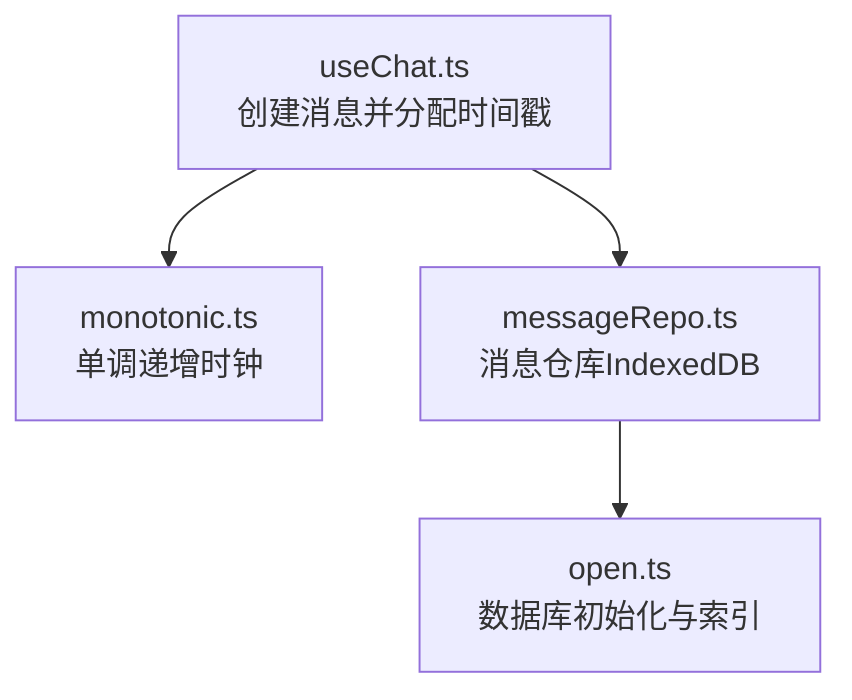
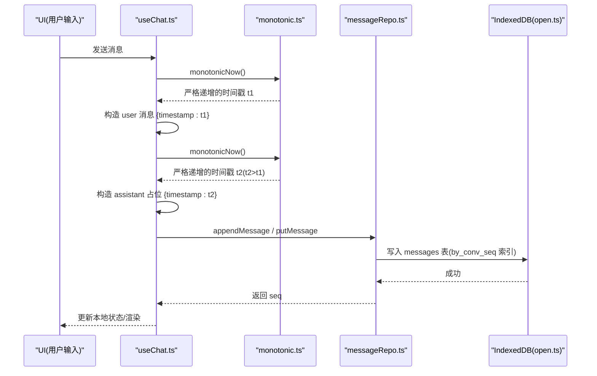
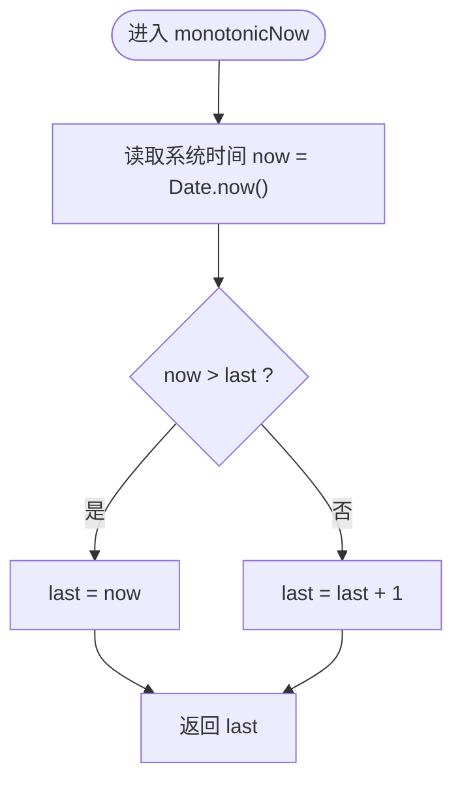
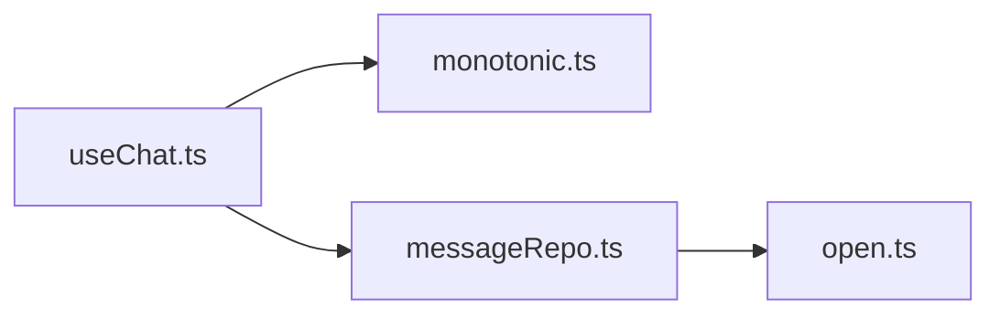

# 单调递增时钟工具

<cite>
**本文引用的文件**
- [src/utils/monotonic.ts](file://src/utils/monotonic.ts)
- [src/hooks/useChat.ts](file://src/hooks/useChat.ts)
- [src/db/messageRepo.ts](file://src/db/messageRepo.ts)
- [src/db/open.ts](file://src/db/open.ts)
</cite>

## 目录
1. [简介](#简介)
2. [项目结构](#项目结构)
3. [核心组件](#核心组件)
4. [架构总览](#架构总览)
5. [详细组件分析](#详细组件分析)
6. [依赖关系分析](#依赖关系分析)
7. [性能考量](#性能考量)
8. [故障排查指南](#故障排查指南)
9. [结论](#结论)

## 简介
本工具提供“严格单调递增的毫秒时间戳”，用于在高频、并发或同一毫秒内多次创建消息的场景中，保证“先发生的事件永远小于后发生的事件”。这解决了浏览器 Date.now() 可能返回相同值导致的排序歧义问题，确保消息在 UI 与 IndexedDB 中的稳定顺序，从而让基于时间戳的合并、分页、索引查询等路径具备可纠错能力。

## 项目结构
该工具位于 utils 层，被聊天 Hook 在创建用户消息与助手占位消息时调用；底层消息持久化通过 IndexedDB 按会话+序列号索引读写，保证全局一致的顺序。

图表来源
- [src/hooks/useChat.ts:690-718](file://src/hooks/useChat.ts#L690-L718)
- [src/utils/monotonic.ts:1-16](file://src/utils/monotonic.ts#L1-L16)
- [src/db/messageRepo.ts:1-200](file://src/db/messageRepo.ts#L1-L200)
- [src/db/open.ts:20-64](file://src/db/open.ts#L20-L64)

章节来源
- [src/utils/monotonic.ts:1-16](file://src/utils/monotonic.ts#L1-L16)
- [src/hooks/useChat.ts:690-718](file://src/hooks/useChat.ts#L690-L718)
- [src/db/messageRepo.ts:1-200](file://src/db/messageRepo.ts#L1-L200)
- [src/db/open.ts:20-64](file://src/db/open.ts#L20-L64)

## 核心组件
- 单调递增时钟：导出一个函数，每次调用返回严格大于上一次的值，且不小于当前系统时间。
- 使用点：在创建用户消息与助手占位消息时分别获取时间戳，确保 user < assistant 恒成立，且所有消息 timestamp 唯一且有序。
- 持久化与排序：消息以 [convId, seq] 复合键索引存储，读取均按 seq 升序；时间戳作为业务排序键与索引协同工作，避免同秒重复导致的不确定性。

章节来源
- [src/utils/monotonic.ts:1-16](file://src/utils/monotonic.ts#L1-L16)
- [src/hooks/useChat.ts:690-718](file://src/hooks/useChat.ts#L690-L718)
- [src/db/messageRepo.ts:1-200](file://src/db/messageRepo.ts#L1-L200)

## 架构总览
下图展示了从 UI 发起对话到消息落库的关键时序，以及单调递增时钟如何保障顺序一致性。

图表来源
- [src/hooks/useChat.ts:690-718](file://src/hooks/useChat.ts#L690-L718)
- [src/utils/monotonic.ts:1-16](file://src/utils/monotonic.ts#L1-L16)
- [src/db/messageRepo.ts:134-175](file://src/db/messageRepo.ts#L134-L175)
- [src/db/open.ts:20-64](file://src/db/open.ts#L20-L64)

## 详细组件分析

### 单调递增时钟实现
- 设计要点
  - 维护模块级 last 变量，记录上次返回值。
  - 每次调用取当前系统时间 now，返回 Math.max(now, last + 1)，保证严格递增且不回退。
  - 复杂度 O(1)，空间 O(1)。
- 适用场景
  - 同一毫秒内连续创建多条消息（如用户消息与助手占位消息）。
  - 需要稳定排序的合并、去重、冲突解决逻辑。
- 注意事项
  - 单进程单线程模型下行为确定；若未来引入多线程/Worker，需考虑共享状态隔离。
  - 仅保证相对顺序，不替代真实墙钟时间语义。

图表来源
- [src/utils/monotonic.ts:10-16](file://src/utils/monotonic.ts#L10-L16)

章节来源
- [src/utils/monotonic.ts:1-16](file://src/utils/monotonic.ts#L1-L16)

### 在聊天流程中的使用
- 创建用户消息与助手占位消息时，分别调用单调递增时钟，确保 user.timestamp < assistant.timestamp。
- 后续流式更新会覆盖助手消息内容，但保持其原始 timestamp 与位置不变，维持顺序稳定。
- 当存在联网搜索、压缩片段等复杂分支时，时间戳仍能保证最终合并后的顺序正确性。

章节来源
- [src/hooks/useChat.ts:690-718](file://src/hooks/useChat.ts#L690-L718)

### 与 IndexedDB 索引的协同
- 消息表通过复合索引 by_conv_seq（[convId, seq]）进行高效范围查询与游标遍历。
- 读操作统一按 seq 升序返回，保证 UI 展示顺序与写入顺序一致。
- 单调递增时间戳与 seq 共同构成“双重顺序保障”：时间戳用于业务排序与合并，seq 用于持久化顺序与冲突处理。

章节来源
- [src/db/messageRepo.ts:1-200](file://src/db/messageRepo.ts#L1-L200)
- [src/db/open.ts:20-64](file://src/db/open.ts#L20-L64)

## 依赖关系分析
- 直接依赖
  - useChat.ts 依赖 monotonic.ts 生成严格递增时间戳。
  - messageRepo.ts 依赖 open.ts 提供的数据库连接与索引定义。
- 间接影响
  - 任何依赖“按时间戳排序”的路径（如合并、分页、增量同步）都受益于单调递增时间戳带来的稳定性。
  - 若未来移除单调递增时钟，需评估对排序、合并与冲突解决的潜在影响。

图表来源
- [src/hooks/useChat.ts:690-718](file://src/hooks/useChat.ts#L690-L718)
- [src/utils/monotonic.ts:1-16](file://src/utils/monotonic.ts#L1-L16)
- [src/db/messageRepo.ts:1-200](file://src/db/messageRepo.ts#L1-L200)
- [src/db/open.ts:20-64](file://src/db/open.ts#L20-L64)

章节来源
- [src/hooks/useChat.ts:690-718](file://src/hooks/useChat.ts#L690-L718)
- [src/utils/monotonic.ts:1-16](file://src/utils/monotonic.ts#L1-L16)
- [src/db/messageRepo.ts:1-200](file://src/db/messageRepo.ts#L1-L200)
- [src/db/open.ts:20-64](file://src/db/open.ts#L20-L64)

## 性能考量
- 时间复杂度：单调递增时钟为 O(1) 计算，无 I/O。
- 内存占用：仅维护一个模块级变量，O(1)。
- 并发与序列化：消息写操作经会话级队列串行化，避免流式期间密集更新互相穿插，进一步降低顺序错乱风险。
- 索引效率：by_conv_seq 复合索引支持高效范围查询与反向游标，适合长会话分页加载。

## 故障排查指南
- 症状：同一毫秒内创建的多条消息顺序不稳定，或合并后出现错位。
  - 检查是否使用了单调递增时钟而非 Date.now()。
  - 确认创建用户消息与助手占位消息时分别调用单调递增时钟。
- 症状：IndexedDB 中消息顺序异常。
  - 确认写入走 messageRepo.ts 的 append/put 接口，由内部分配 seq 并写入 by_conv_seq 索引。
  - 检查是否存在绕过仓库直接写库的行为。
- 症状：多设备同步后顺序不一致。
  - 关注增量同步中对 seq 冲突的处理：若云端 seq 与本地冲突，应向后偏移以避免覆盖。
  - 确认 updatedAt/syncedAt 的正确刷新，避免全量覆盖循环。

章节来源
- [src/hooks/useChat.ts:690-718](file://src/hooks/useChat.ts#L690-L718)
- [src/db/messageRepo.ts:134-175](file://src/db/messageRepo.ts#L134-L175)
- [src/db/open.ts:20-64](file://src/db/open.ts#L20-L64)

## 结论
单调递增时钟以极简实现解决了高频创建消息时的时间戳碰撞问题，配合 IndexedDB 的 by_conv_seq 索引与会话级写队列，构建了稳定的消息顺序保障体系。建议在涉及时间排序、合并与冲突处理的任何新增路径中，继续使用单调递增时间戳，以确保系统的一致性与可纠错性。