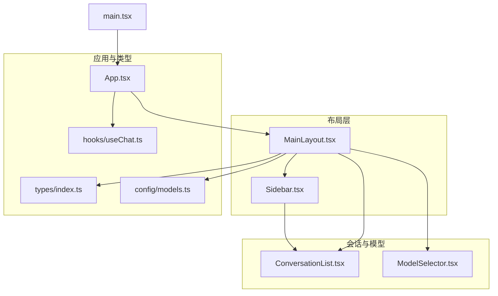
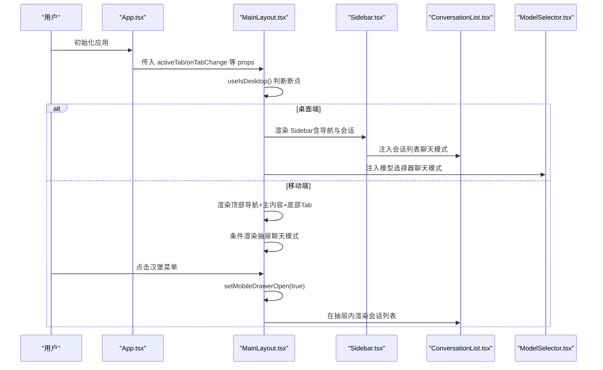
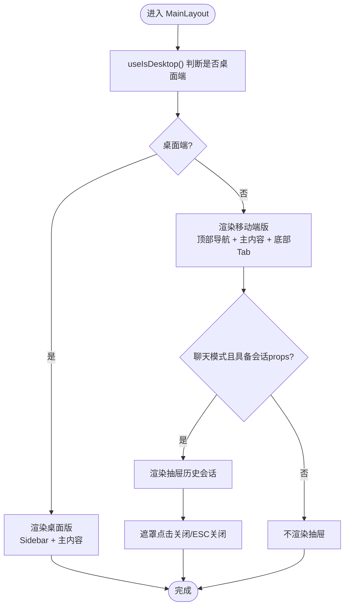
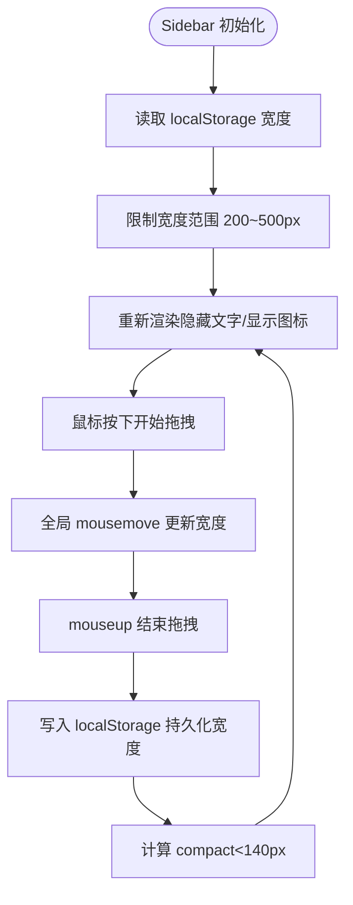
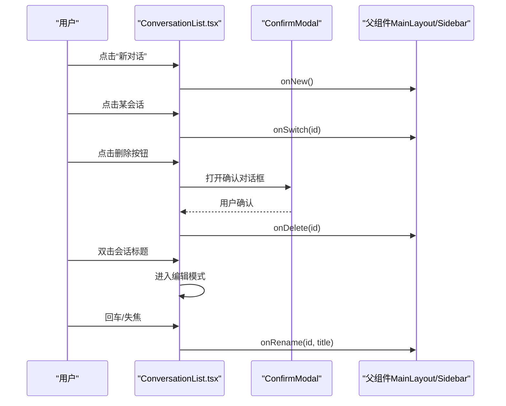
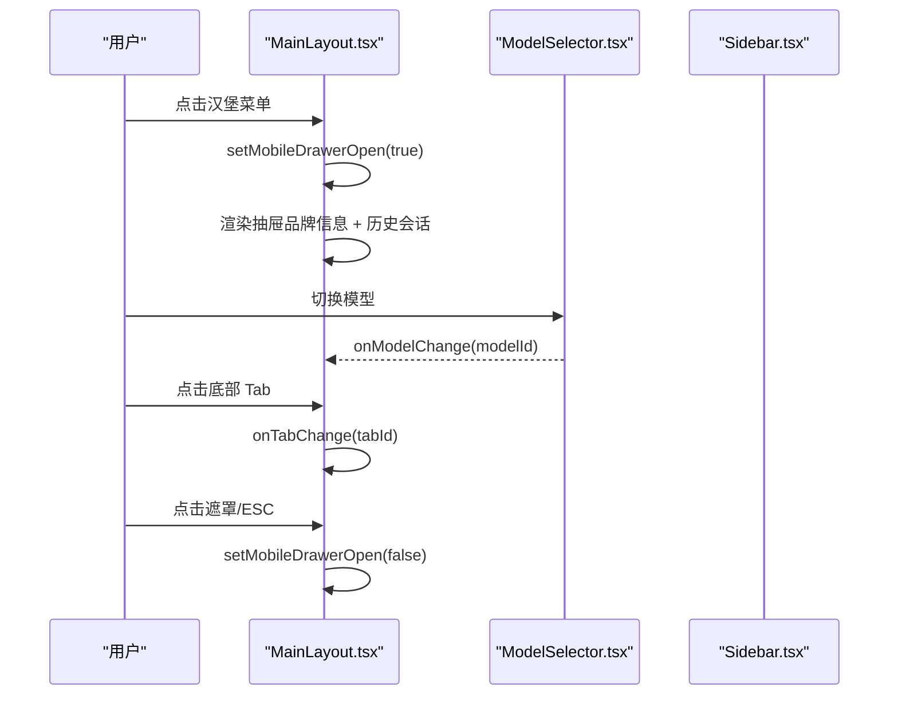
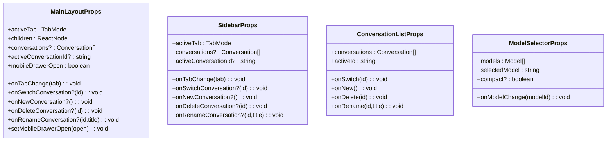
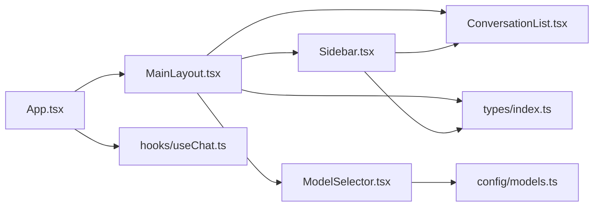

# 布局组件

<cite>
**本文引用的文件**
- [MainLayout.tsx](file://src/components/layout/MainLayout.tsx)
- [Sidebar.tsx](file://src/components/layout/Sidebar.tsx)
- [ConversationList.tsx](file://src/components/chat/ConversationList.tsx)
- [ModelSelector.tsx](file://src/components/common/ModelSelector.tsx)
- [App.tsx](file://src/App.tsx)
- [useChat.ts](file://src/hooks/useChat.ts)
- [models.ts](file://src/config/models.ts)
- [index.ts](file://src/types/index.ts)
- [main.tsx](file://src/main.tsx)
- [package.json](file://package.json)
</cite>

## 目录
1. [简介](#简介)
2. [项目结构](#项目结构)
3. [核心组件](#核心组件)
4. [架构总览](#架构总览)
5. [详细组件分析](#详细组件分析)
6. [依赖关系分析](#依赖关系分析)
7. [性能考量](#性能考量)
8. [故障排查指南](#故障排查指南)
9. [结论](#结论)
10. [附录](#附录)

## 简介
本文件聚焦 AIShop 的布局组件，系统性解析 MainLayout 主布局与 Sidebar 侧边栏的设计理念与实现细节，涵盖：
- 响应式布局策略与断点行为
- 导航栏与底部 Tab 的管理
- 会话列表在桌面端与移动端的差异化呈现
- Props 接口设计与状态/事件回调机制
- 移动端抽屉交互与 ESC 关闭
- 主题适配与样式覆盖最佳实践
- 扩展与自定义布局变体的方法

## 项目结构
布局组件位于 src/components/layout 目录，配合会话列表、模型选择器等子组件共同构成应用的骨架。类型定义集中在 src/types/index.ts，模型配置在 src/config/models.ts，应用入口在 src/main.tsx 与 src/App.tsx。

图表来源
- [MainLayout.tsx:1-227](file://src/components/layout/MainLayout.tsx#L1-L227)
- [Sidebar.tsx:1-197](file://src/components/layout/Sidebar.tsx#L1-L197)
- [ConversationList.tsx:1-171](file://src/components/chat/ConversationList.tsx#L1-L171)
- [ModelSelector.tsx:1-173](file://src/components/common/ModelSelector.tsx#L1-L173)
- [App.tsx:1-67](file://src/App.tsx#L1-L67)
- [useChat.ts:1-370](file://src/hooks/useChat.ts#L1-L370)
- [models.ts:1-228](file://src/config/models.ts#L1-L228)
- [index.ts:1-103](file://src/types/index.ts#L1-L103)
- [main.tsx:1-11](file://src/main.tsx#L1-L11)

章节来源
- [MainLayout.tsx:1-227](file://src/components/layout/MainLayout.tsx#L1-L227)
- [Sidebar.tsx:1-197](file://src/components/layout/Sidebar.tsx#L1-L197)
- [App.tsx:1-67](file://src/App.tsx#L1-L67)
- [main.tsx:1-11](file://src/main.tsx#L1-L11)

## 核心组件
- MainLayout：负责整体布局、响应式分支、移动端抽屉、顶部导航与底部 Tab 的渲染，并将会话列表与模型选择器注入到合适位置。
- Sidebar：桌面端侧边栏，包含导航菜单、会话列表（仅聊天模式）、拖拽调整宽度与折叠逻辑。
- ConversationList：会话列表组件，支持搜索、重命名、删除、新建等操作。
- ModelSelector：模型选择器，支持紧凑模式、固定定位与上下弹出菜单。
- 类型与配置：TabMode、Conversation、Model 等类型定义，以及聊天模型列表。

章节来源
- [MainLayout.tsx:11-23](file://src/components/layout/MainLayout.tsx#L11-L23)
- [Sidebar.tsx:8-18](file://src/components/layout/Sidebar.tsx#L8-L18)
- [ConversationList.tsx:7-14](file://src/components/chat/ConversationList.tsx#L7-L14)
- [ModelSelector.tsx:6-11](file://src/components/common/ModelSelector.tsx#L6-L11)
- [index.ts:40](file://src/types/index.ts#L40)

## 架构总览
MainLayout 作为根布局，根据设备宽度（断点 768px）决定渲染桌面版或移动端版。桌面端使用 Sidebar 作为左侧导航与会话面板，移动端则采用顶部胶囊式 ModelSelector、底部 Tab 与左侧抽屉（仅聊天模式）。

图表来源
- [App.tsx:46-64](file://src/App.tsx#L46-L64)
- [MainLayout.tsx:45-226](file://src/components/layout/MainLayout.tsx#L45-L226)
- [Sidebar.tsx:48-196](file://src/components/layout/Sidebar.tsx#L48-L196)
- [ConversationList.tsx:16-170](file://src/components/chat/ConversationList.tsx#L16-L170)
- [ModelSelector.tsx:43-172](file://src/components/common/ModelSelector.tsx#L43-L172)

## 详细组件分析

### MainLayout 主布局组件
设计理念
- 响应式布局：通过媒体查询判断是否为桌面端（断点 768px），分别渲染桌面版与移动端版。
- 会话管理：当处于聊天模式且具备必要 props 时，在桌面端显示 Sidebar 的会话列表，在移动端显示抽屉内的会话列表。
- 移动端抽屉：支持点击遮罩关闭、ESC 键关闭、切换 Tab 自动关闭，避免状态残留。
- 顶部导航与底部 Tab：移动端顶部居中放置 ModelSelector，右侧提供“新建会话”按钮；底部提供聊天/图片/视频三个 Tab。

关键实现要点
- 断点判断：useIsDesktop 使用本地状态初始化，并监听媒体查询变化，确保 SSR 场景安全。
- 会话可见性：showConversations 由 activeTab 与 props 的存在性共同决定，确保仅在聊天模式启用。
- 抽屉控制：useEffect 在 activeTab/isDesktop 变更时自动关闭抽屉；键盘事件监听 ESC 关闭抽屉。
- 桌面端：左侧 Sidebar + 右侧主内容区域。
- 移动端：顶部 header（汉堡菜单、ModelSelector、新建会话）、中部主内容、底部 Tab；抽屉内包含品牌信息、历史会话标题与会话列表。

图表来源
- [MainLayout.tsx:31-43](file://src/components/layout/MainLayout.tsx#L31-L43)
- [MainLayout.tsx:60-82](file://src/components/layout/MainLayout.tsx#L60-L82)
- [MainLayout.tsx:84-100](file://src/components/layout/MainLayout.tsx#L84-L100)
- [MainLayout.tsx:102-225](file://src/components/layout/MainLayout.tsx#L102-L225)

章节来源
- [MainLayout.tsx:31-43](file://src/components/layout/MainLayout.tsx#L31-L43)
- [MainLayout.tsx:60-82](file://src/components/layout/MainLayout.tsx#L60-L82)
- [MainLayout.tsx:84-100](file://src/components/layout/MainLayout.tsx#L84-L100)
- [MainLayout.tsx:102-225](file://src/components/layout/MainLayout.tsx#L102-L225)

### Sidebar 侧边栏组件
功能概述
- 导航菜单：包含聊天、图片、视频、音乐四个 Tab，当前激活项高亮。
- 会话列表：仅在聊天模式显示，使用 ConversationList 提供的 onSwitch/onNew/onDelete/onRename 回调。
- 拖拽调整宽度：支持鼠标拖拽调整侧边栏宽度，最小 200px，最大 500px，默认 224px；宽度持久化至 localStorage。
- 折叠逻辑：当宽度小于 140px 时，仅显示图标，隐藏文字标签，实现紧凑显示。

实现细节
- 宽度存储：读取 localStorage 中的 sidebar-width，若不存在或异常则回退默认值。
- 全局拖拽：在拖拽期间全局禁用文本选择与设置光标，保证流畅体验。
- 折叠判定：compact 依据宽度阈值计算，影响标题与文字的显示与否。
- 会话可见性：与 MainLayout 一致，仅在聊天模式启用。

图表来源
- [Sidebar.tsx:37-46](file://src/components/layout/Sidebar.tsx#L37-L46)
- [Sidebar.tsx:67-78](file://src/components/layout/Sidebar.tsx#L67-L78)
- [Sidebar.tsx:87-116](file://src/components/layout/Sidebar.tsx#L87-L116)
- [Sidebar.tsx:119](file://src/components/layout/Sidebar.tsx#L119)
- [Sidebar.tsx:121-196](file://src/components/layout/Sidebar.tsx#L121-L196)

章节来源
- [Sidebar.tsx:37-46](file://src/components/layout/Sidebar.tsx#L37-L46)
- [Sidebar.tsx:67-78](file://src/components/layout/Sidebar.tsx#L67-L78)
- [Sidebar.tsx:87-116](file://src/components/layout/Sidebar.tsx#L87-L116)
- [Sidebar.tsx:119](file://src/components/layout/Sidebar.tsx#L119)
- [Sidebar.tsx:121-196](file://src/components/layout/Sidebar.tsx#L121-L196)

### 会话列表管理
职责与交互
- 新建会话：通过 onNew 回调触发。
- 切换会话：点击列表项触发 onSwitch。
- 删除会话：通过 ConfirmModal 确认后触发 onDelete。
- 重命名会话：双击进入编辑模式，回车确认或失焦提交，Esc 取消。
- 搜索过滤：支持中英文关键词与拼音匹配，提升检索效率。

图表来源
- [ConversationList.tsx:69-75](file://src/components/chat/ConversationList.tsx#L69-L75)
- [ConversationList.tsx:98-100](file://src/components/chat/ConversationList.tsx#L98-L100)
- [ConversationList.tsx:140-149](file://src/components/chat/ConversationList.tsx#L140-L149)
- [ConversationList.tsx:129-137](file://src/components/chat/ConversationList.tsx#L129-L137)
- [ConversationList.tsx:155-167](file://src/components/chat/ConversationList.tsx#L155-L167)

章节来源
- [ConversationList.tsx:69-75](file://src/components/chat/ConversationList.tsx#L69-L75)
- [ConversationList.tsx:98-100](file://src/components/chat/ConversationList.tsx#L98-L100)
- [ConversationList.tsx:140-149](file://src/components/chat/ConversationList.tsx#L140-L149)
- [ConversationList.tsx:129-137](file://src/components/chat/ConversationList.tsx#L129-L137)
- [ConversationList.tsx:155-167](file://src/components/chat/ConversationList.tsx#L155-L167)

### 导航栏与底部 Tab
- 顶部导航：移动端顶部居中放置 ModelSelector（紧凑模式），左侧为汉堡菜单（仅聊天模式显示），右侧为“新建会话”按钮。
- 底部 Tab：提供聊天/图片/视频三个选项，当前项高亮。
- 抽屉行为：点击遮罩或点击抽屉内任意会话项均可关闭抽屉；ESC 键也可关闭抽屉。

图表来源
- [MainLayout.tsx:106-139](file://src/components/layout/MainLayout.tsx#L106-L139)
- [MainLayout.tsx:144-164](file://src/components/layout/MainLayout.tsx#L144-L164)
- [MainLayout.tsx:167-223](file://src/components/layout/MainLayout.tsx#L167-L223)
- [ModelSelector.tsx:107-126](file://src/components/common/ModelSelector.tsx#L107-L126)

章节来源
- [MainLayout.tsx:106-139](file://src/components/layout/MainLayout.tsx#L106-L139)
- [MainLayout.tsx:144-164](file://src/components/layout/MainLayout.tsx#L144-L164)
- [MainLayout.tsx:167-223](file://src/components/layout/MainLayout.tsx#L167-L223)
- [ModelSelector.tsx:107-126](file://src/components/common/ModelSelector.tsx#L107-L126)

### Props 接口设计与状态传递
- MainLayoutProps
  - activeTab/onTabChange：控制当前激活的 Tab 与切换回调
  - children：主内容区域
  - conversations/activeConversationId：会话数据与当前会话 ID
  - onSwitchConversation/onNewConversation/onDeleteConversation/onRenameConversation：会话 CRUD 回调
  - mobileDrawerOpen/setMobileDrawerOpen：移动端抽屉开关状态与 setter
- SidebarProps
  - 与 MainLayoutProps 中的会话相关 props 同构，用于桌面端侧边栏
- ConversationListProps
  - conversations/activeId：列表数据与当前选中项
  - onSwitch/onNew/onDelete/onRename：回调函数
- ModelSelectorProps
  - models/selectedModel/onModelChange：模型列表、当前模型与变更回调
  - compact：紧凑模式开关

图表来源
- [MainLayout.tsx:11-23](file://src/components/layout/MainLayout.tsx#L11-L23)
- [Sidebar.tsx:8-18](file://src/components/layout/Sidebar.tsx#L8-L18)
- [ConversationList.tsx:7-14](file://src/components/chat/ConversationList.tsx#L7-L14)
- [ModelSelector.tsx:6-11](file://src/components/common/ModelSelector.tsx#L6-L11)

章节来源
- [MainLayout.tsx:11-23](file://src/components/layout/MainLayout.tsx#L11-L23)
- [Sidebar.tsx:8-18](file://src/components/layout/Sidebar.tsx#L8-L18)
- [ConversationList.tsx:7-14](file://src/components/chat/ConversationList.tsx#L7-L14)
- [ModelSelector.tsx:6-11](file://src/components/common/ModelSelector.tsx#L6-L11)

### 响应式设计与移动端抽屉
- 断点设置：768px，使用 window.matchMedia 监听变化，SSR 安全初始化。
- 移动端抽屉：
  - 遮罩层：点击遮罩关闭抽屉
  - ESC 关闭：键盘事件监听
  - Tab 切换自动关闭：避免抽屉状态残留
  - 抽屉内容：品牌信息 + 历史会话标题 + 会话列表
- 顶部导航：居中 ModelSelector（紧凑模式），左右操作按钮，适配安全区

章节来源
- [MainLayout.tsx:31-43](file://src/components/layout/MainLayout.tsx#L31-L43)
- [MainLayout.tsx:69-82](file://src/components/layout/MainLayout.tsx#L69-L82)
- [MainLayout.tsx:102-225](file://src/components/layout/MainLayout.tsx#L102-L225)

### 布局定制最佳实践
- 主题适配
  - 使用 Tailwind CSS 类名进行颜色与边框控制，如 bg-black、border-gray-700、text-white 等，便于在全局样式中统一替换。
  - 通过 CSS 变量或主题包覆盖基础色板，避免硬编码颜色。
- 样式覆盖
  - 侧边栏宽度：通过修改默认宽度常量与最小/最大值，结合 localStorage 存储，实现个性化宽度偏好。
  - 折叠模式：通过调整 compact 阈值，控制图标与文字的显示策略。
  - 抽屉动画：调整过渡时长与缓动曲线，提升移动端交互体验。
- 扩展布局变体
  - 新增 Tab：在 MainLayout 的 MOBILE_TABS 与 Sidebar 的 tabs 中添加新项，确保对应 Panel 已实现。
  - 自定义抽屉内容：在抽屉 aside 区域扩展更多面板（如设置、收藏、历史记录等）。
  - 会话面板扩展：在 ConversationList 上增加筛选、排序、分组等功能，或引入虚拟滚动优化大数据集。

章节来源
- [Sidebar.tsx:27-35](file://src/components/layout/Sidebar.tsx#L27-L35)
- [Sidebar.tsx:119](file://src/components/layout/Sidebar.tsx#L119)
- [MainLayout.tsx:25-29](file://src/components/layout/MainLayout.tsx#L25-L29)
- [MainLayout.tsx:180-183](file://src/components/layout/MainLayout.tsx#L180-L183)

## 依赖关系分析
- MainLayout 依赖 Sidebar、ConversationList、ModelSelector、TabMode、Conversation 等类型。
- Sidebar 依赖 ConversationList、TabMode、Conversation 等类型。
- App 通过 useChat 提供会话数据与回调，传递给 MainLayout。
- ModelSelector 依赖模型配置 models.ts 中的 CHAT_MODELS。

图表来源
- [App.tsx:46-64](file://src/App.tsx#L46-L64)
- [MainLayout.tsx:1-10](file://src/components/layout/MainLayout.tsx#L1-L10)
- [Sidebar.tsx:1-6](file://src/components/layout/Sidebar.tsx#L1-L6)
- [ConversationList.tsx:1-6](file://src/components/chat/ConversationList.tsx#L1-L6)
- [ModelSelector.tsx:1-5](file://src/components/common/ModelSelector.tsx#L1-L5)
- [models.ts:1-2](file://src/config/models.ts#L1-L2)
- [useChat.ts:1-15](file://src/hooks/useChat.ts#L1-L15)

章节来源
- [App.tsx:46-64](file://src/App.tsx#L46-L64)
- [MainLayout.tsx:1-10](file://src/components/layout/MainLayout.tsx#L1-L10)
- [Sidebar.tsx:1-6](file://src/components/layout/Sidebar.tsx#L1-L6)
- [ConversationList.tsx:1-6](file://src/components/chat/ConversationList.tsx#L1-L6)
- [ModelSelector.tsx:1-5](file://src/components/common/ModelSelector.tsx#L1-L5)
- [models.ts:1-2](file://src/config/models.ts#L1-L2)
- [useChat.ts:1-15](file://src/hooks/useChat.ts#L1-L15)

## 性能考量
- 响应式监听：useIsDesktop 使用媒体查询监听，避免不必要的重渲染；SSR 场景通过初始值避免客户端与服务端不一致。
- 拖拽宽度：全局 mousemove/mouseup 监听仅在拖拽阶段生效，拖拽结束后恢复文档样式，减少副作用。
- 抽屉关闭：Tab 切换与桌面端切换时自动关闭抽屉，避免状态堆积导致的重复渲染。
- 会话列表：使用 useMemo 进行搜索过滤，降低渲染成本；输入框聚焦与选择在编辑模式下按需执行。

章节来源
- [MainLayout.tsx:31-43](file://src/components/layout/MainLayout.tsx#L31-L43)
- [Sidebar.tsx:87-116](file://src/components/layout/Sidebar.tsx#L87-L116)
- [MainLayout.tsx:69-82](file://src/components/layout/MainLayout.tsx#L69-L82)
- [ConversationList.tsx:30-38](file://src/components/chat/ConversationList.tsx#L30-L38)

## 故障排查指南
- 抽屉无法关闭
  - 检查 mobileDrawerOpen 状态是否正确传递至 MainLayout。
  - 确认 ESC 键盘事件监听是否生效（仅在抽屉打开时注册）。
- 模型选择器不显示
  - 确认传入的 models 是否为空，selectedModel 是否有效。
  - 检查 ModelSelector 的紧凑模式与定位逻辑。
- 会话列表不更新
  - 确认 onSwitch/onNew/onDelete/onRename 回调是否正确传递至 ConversationList。
  - 检查 conversations/activeId 是否同步更新。
- 侧边栏宽度异常
  - 检查 localStorage 中的 sidebar-width 是否被意外修改。
  - 确认最小/最大宽度阈值与默认宽度设置。

章节来源
- [MainLayout.tsx:74-82](file://src/components/layout/MainLayout.tsx#L74-L82)
- [ModelSelector.tsx:53-80](file://src/components/common/ModelSelector.tsx#L53-L80)
- [ConversationList.tsx:16-23](file://src/components/chat/ConversationList.tsx#L16-L23)
- [Sidebar.tsx:37-46](file://src/components/layout/Sidebar.tsx#L37-L46)

## 结论
AIShop 的布局组件通过清晰的 Props 设计与响应式策略，实现了桌面端与移动端的一致体验。Sidebar 提供了灵活的宽度调整与折叠能力，MainLayout 则在不同设备上智能切换布局与交互方式。借助 ConversationList 与 ModelSelector 的组合，用户可以在聊天模式下高效管理会话与模型。通过合理的样式覆盖与扩展策略，开发者可以轻松定制新的布局变体与功能模块。

## 附录
- 代码示例路径（不直接展示代码内容）
  - 扩展 MainLayout 的移动端抽屉：[MainLayout.tsx:167-223](file://src/components/layout/MainLayout.tsx#L167-L223)
  - 自定义 Sidebar 宽度与折叠：[Sidebar.tsx:27-35](file://src/components/layout/Sidebar.tsx#L27-L35)、[Sidebar.tsx:119](file://src/components/layout/Sidebar.tsx#L119)
  - 会话列表交互流程：[ConversationList.tsx:69-75](file://src/components/chat/ConversationList.tsx#L69-L75)、[ConversationList.tsx:98-100](file://src/components/chat/ConversationList.tsx#L98-L100)
  - 模型选择器紧凑模式：[ModelSelector.tsx:107-126](file://src/components/common/ModelSelector.tsx#L107-L126)
  - 应用入口与布局挂载：[main.tsx:6-9](file://src/main.tsx#L6-L9)、[App.tsx:46-64](file://src/App.tsx#L46-L64)