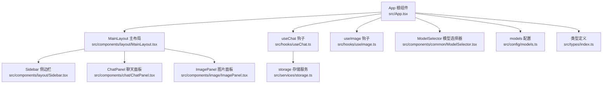
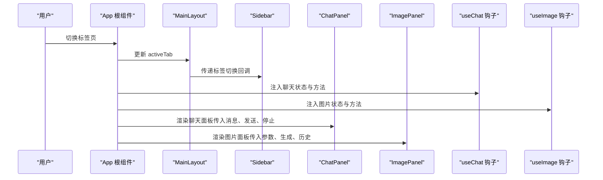
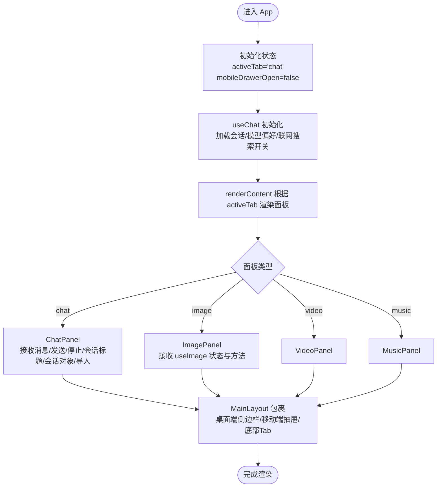
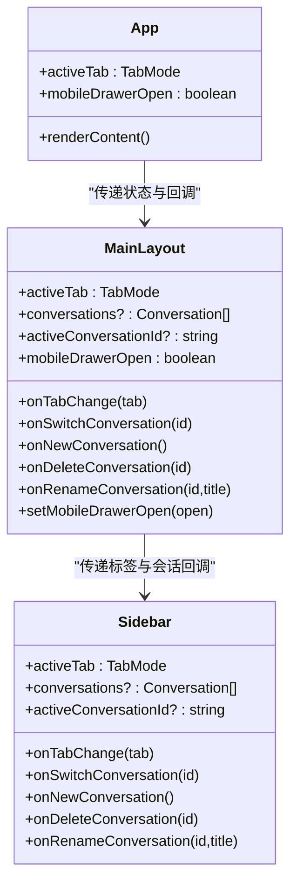
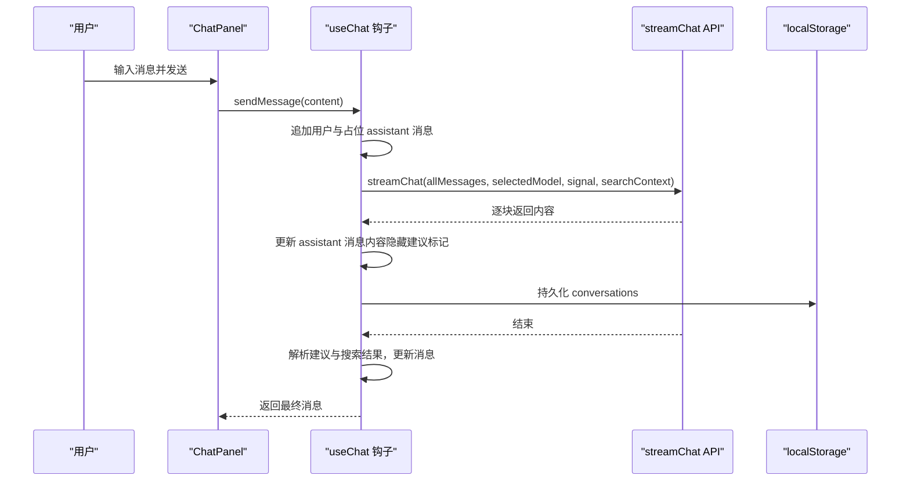
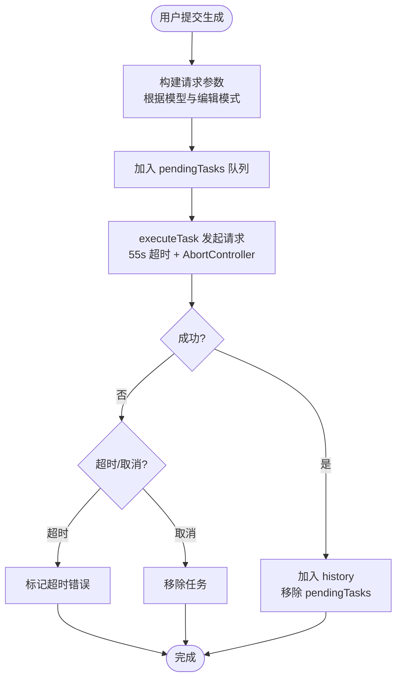
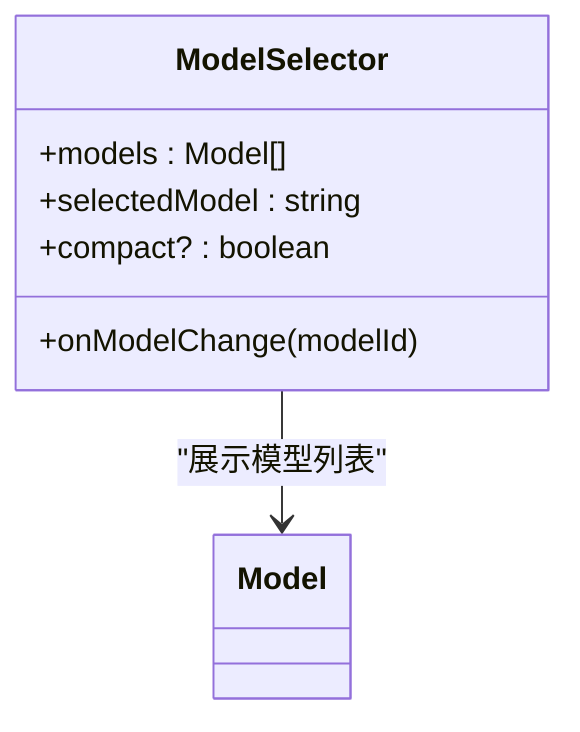
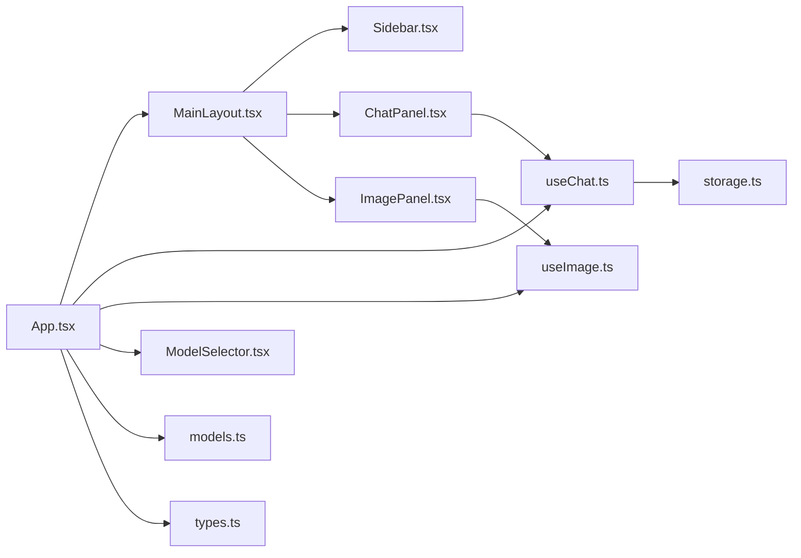

# 应用根组件

<cite>
**本文引用的文件**
- [src/App.tsx](file://src/App.tsx)
- [src/main.tsx](file://src/main.tsx)
- [src/components/layout/MainLayout.tsx](file://src/components/layout/MainLayout.tsx)
- [src/components/layout/Sidebar.tsx](file://src/components/layout/Sidebar.tsx)
- [src/components/chat/ChatPanel.tsx](file://src/components/chat/ChatPanel.tsx)
- [src/components/image/ImagePanel.tsx](file://src/components/image/ImagePanel.tsx)
- [src/components/common/ModelSelector.tsx](file://src/components/common/ModelSelector.tsx)
- [src/hooks/useChat.ts](file://src/hooks/useChat.ts)
- [src/hooks/useImage.ts](file://src/hooks/useImage.ts)
- [src/services/storage.ts](file://src/services/storage.ts)
- [src/config/models.ts](file://src/config/models.ts)
- [src/types/index.ts](file://src/types/index.ts)
</cite>

## 目录
1. [简介](#简介)
2. [项目结构](#项目结构)
3. [核心组件](#核心组件)
4. [架构总览](#架构总览)
5. [详细组件分析](#详细组件分析)
6. [依赖关系分析](#依赖关系分析)
7. [性能考量](#性能考量)
8. [故障排查指南](#故障排查指南)
9. [结论](#结论)
10. [附录](#附录)

## 简介
本文件面向 AIShop 的应用根组件 App，系统性梳理其整体架构设计、状态管理策略、路由配置与全局状态协调机制。重点覆盖：
- 活动标签页状态管理与动态内容渲染
- 移动设备抽屉状态与响应式布局
- 聊天钩子集成与会话持久化
- 组件间 Props 传递模式与事件处理方式
- 最佳实践与扩展建议

## 项目结构
App 作为应用入口，负责组织顶层布局、状态协调与功能模块的动态加载。主要文件与职责如下：
- src/App.tsx：应用根组件，集中管理活动标签页、移动端抽屉状态与聊天钩子
- src/main.tsx：应用入口，挂载 App
- src/components/layout/MainLayout.tsx：主布局容器，负责桌面端侧边栏与移动端抽屉、底部 Tab 栏
- src/components/layout/Sidebar.tsx：桌面端侧边栏，承载标签切换与会话列表
- src/components/chat/ChatPanel.tsx：聊天功能面板，负责消息渲染、输入与导出
- src/components/image/ImagePanel.tsx：图片生成功能面板，负责参数设置与历史展示
- src/components/common/ModelSelector.tsx：模型选择器，跨模块复用
- src/hooks/useChat.ts：聊天状态与业务逻辑钩子，含会话持久化、联网搜索、流式输出等
- src/hooks/useImage.ts：图片生成状态与业务逻辑钩子，含并发队列、参数联动、历史管理
- src/services/storage.ts：本地存储封装，负责会话持久化
- src/config/models.ts：模型配置常量，供各模块使用
- src/types/index.ts：类型定义，统一消息、会话、模型等类型

图表来源
- [src/App.tsx:1-67](file://src/App.tsx#L1-L67)
- [src/components/layout/MainLayout.tsx:1-227](file://src/components/layout/MainLayout.tsx#L1-L227)
- [src/components/layout/Sidebar.tsx:1-197](file://src/components/layout/Sidebar.tsx#L1-L197)
- [src/components/chat/ChatPanel.tsx:1-354](file://src/components/chat/ChatPanel.tsx#L1-L354)
- [src/components/image/ImagePanel.tsx:1-434](file://src/components/image/ImagePanel.tsx#L1-L434)
- [src/components/common/ModelSelector.tsx:1-173](file://src/components/common/ModelSelector.tsx#L1-L173)
- [src/hooks/useChat.ts:1-370](file://src/hooks/useChat.ts#L1-L370)
- [src/hooks/useImage.ts:1-393](file://src/hooks/useImage.ts#L1-L393)
- [src/services/storage.ts:1-66](file://src/services/storage.ts#L1-L66)
- [src/config/models.ts:1-228](file://src/config/models.ts#L1-L228)
- [src/types/index.ts:1-103](file://src/types/index.ts#L1-L103)

章节来源
- [src/App.tsx:1-67](file://src/App.tsx#L1-L67)
- [src/main.tsx:1-11](file://src/main.tsx#L1-L11)

## 核心组件
- App 根组件：集中持有活动标签页状态与移动端抽屉状态，注入聊天钩子，通过 MainLayout 统一布局与导航，根据 activeTab 动态渲染对应功能面板。
- MainLayout：负责桌面端侧边栏与移动端抽屉、底部 Tab 栏、会话列表、模型选择器等。在桌面端与移动端采用不同的布局策略，并在切换标签或屏幕尺寸变化时自动收起抽屉。
- useChat 钩子：封装聊天状态与业务逻辑，包括会话列表、当前会话、消息流式渲染、联网搜索、标题自动生成、会话导入导出等。
- useImage 钩子：封装图片生成状态与业务逻辑，包括模型参数联动、并发队列、任务重试/取消/关闭、历史管理等。
- ModelSelector：跨模块复用的模型选择器，支持紧凑模式与固定定位弹出菜单。
- storage：本地存储封装，负责会话持久化与模型偏好保存。
- models：模型配置常量，提供聊天与图片模型列表。
- 类型定义：统一的消息、会话、模型、任务等类型。

章节来源
- [src/App.tsx:11-67](file://src/App.tsx#L11-L67)
- [src/components/layout/MainLayout.tsx:45-227](file://src/components/layout/MainLayout.tsx#L45-L227)
- [src/hooks/useChat.ts:69-370](file://src/hooks/useChat.ts#L69-L370)
- [src/hooks/useImage.ts:128-393](file://src/hooks/useImage.ts#L128-L393)
- [src/components/common/ModelSelector.tsx:43-173](file://src/components/common/ModelSelector.tsx#L43-L173)
- [src/services/storage.ts:7-66](file://src/services/storage.ts#L7-L66)
- [src/config/models.ts:3-228](file://src/config/models.ts#L3-L228)
- [src/types/index.ts:1-103](file://src/types/index.ts#L1-L103)

## 架构总览
App 采用“根组件 + 布局容器 + 钩子 + 业务面板”的分层架构：
- 根组件负责状态与渲染决策
- 布局容器负责响应式布局与导航
- 钩子负责业务状态与副作用
- 业务面板负责具体功能交互

图表来源
- [src/App.tsx:11-67](file://src/App.tsx#L11-L67)
- [src/components/layout/MainLayout.tsx:45-227](file://src/components/layout/MainLayout.tsx#L45-L227)
- [src/components/layout/Sidebar.tsx:48-197](file://src/components/layout/Sidebar.tsx#L48-L197)
- [src/components/chat/ChatPanel.tsx:27-354](file://src/components/chat/ChatPanel.tsx#L27-L354)
- [src/components/image/ImagePanel.tsx:63-434](file://src/components/image/ImagePanel.tsx#L63-L434)
- [src/hooks/useChat.ts:69-370](file://src/hooks/useChat.ts#L69-L370)
- [src/hooks/useImage.ts:128-393](file://src/hooks/useImage.ts#L128-L393)

## 详细组件分析

### App 根组件分析
- 状态管理
  - 活动标签页：useState 控制当前激活的功能面板（chat/image/video/music）
  - 移动端抽屉：useState 控制抽屉展开/收起
  - 聊天钩子：useChat 提供消息、会话、联网搜索、流式输出等能力
- 全局状态协调
  - 通过 MainLayout 将 activeTab、onTabChange、会话列表与操作回调传递给侧边栏与抽屉
  - 根据 activeTab 条件渲染对应面板：ChatPanel、ImagePanel、VideoPanel、MusicPanel
- 渲染内容的条件逻辑
  - renderContent 使用 switch 分支，按 TabMode 返回对应面板组件
  - ChatPanel 接收消息、加载状态、发送与停止生成、会话标题与会话对象
  - ImagePanel、VideoPanel、MusicPanel 由 useImage 钩子驱动
- Props 传递模式
  - App -> MainLayout：activeTab、onTabChange、会话集合与操作、mobileDrawerOpen、setMobileDrawerOpen
  - MainLayout -> Sidebar：标签切换与会话操作回调
  - App -> ChatPanel：消息、加载状态、发送与停止、会话标题与会话对象、导入会话
  - App -> ImagePanel：useImage 返回的状态与方法
- 事件处理方式
  - 标签切换：onTabChange 回调更新 activeTab
  - 会话操作：onSwitchConversation/onNewConversation/onDeleteConversation/onRenameConversation
  - 抽屉控制：setMobileDrawerOpen 切换抽屉状态
- 聊天钩子集成
  - useChat 返回 messages、isLoading、sendMessage、stopGeneration、conversations、activeConversationId、switch/rename/delete/new/import 等
  - 会话持久化：通过 storage.ts 读写本地存储
  - 联网搜索：可选开启，搜索结果作为上下文注入流式输出
  - 流式渲染：逐块更新 assistant 消息内容，隐藏建议标记，最终解析建议与搜索结果

图表来源
- [src/App.tsx:11-67](file://src/App.tsx#L11-L67)
- [src/hooks/useChat.ts:69-370](file://src/hooks/useChat.ts#L69-L370)
- [src/hooks/useImage.ts:128-393](file://src/hooks/useImage.ts#L128-L393)
- [src/components/layout/MainLayout.tsx:45-227](file://src/components/layout/MainLayout.tsx#L45-L227)
- [src/components/chat/ChatPanel.tsx:27-354](file://src/components/chat/ChatPanel.tsx#L27-L354)
- [src/components/image/ImagePanel.tsx:63-434](file://src/components/image/ImagePanel.tsx#L63-L434)

章节来源
- [src/App.tsx:11-67](file://src/App.tsx#L11-L67)
- [src/hooks/useChat.ts:69-370](file://src/hooks/useChat.ts#L69-L370)
- [src/hooks/useImage.ts:128-393](file://src/hooks/useImage.ts#L128-L393)
- [src/services/storage.ts:7-66](file://src/services/storage.ts#L7-L66)

### MainLayout 与 Sidebar 分析
- 响应式布局
  - useIsDesktop 基于媒体查询判断是否桌面端
  - 桌面端：左侧 Sidebar + 主内容区域
  - 移动端：顶部模型选择器 + 主内容 + 底部 Tab + 左侧抽屉（仅聊天）
- 抽屉状态管理
  - 切换 activeTab 或屏幕尺寸变化时自动收起抽屉
  - ESC 键关闭抽屉
  - 移动端抽屉支持遮罩点击与滑动关闭
- 会话列表与模型选择器
  - 仅在聊天标签且具备会话数据时显示会话列表
  - 模型选择器在桌面端侧边栏与移动端顶部均可用
- Props 传递
  - App -> MainLayout：activeTab、onTabChange、会话集合与操作、mobileDrawerOpen、setMobileDrawerOpen
  - MainLayout -> Sidebar：标签切换与会话操作回调

图表来源
- [src/App.tsx:11-67](file://src/App.tsx#L11-L67)
- [src/components/layout/MainLayout.tsx:45-227](file://src/components/layout/MainLayout.tsx#L45-L227)
- [src/components/layout/Sidebar.tsx:48-197](file://src/components/layout/Sidebar.tsx#L48-L197)

章节来源
- [src/components/layout/MainLayout.tsx:31-82](file://src/components/layout/MainLayout.tsx#L31-L82)
- [src/components/layout/Sidebar.tsx:48-197](file://src/components/layout/Sidebar.tsx#L48-L197)

### useChat 钩子分析
- 状态与持久化
  - conversations：会话数组，首次加载失败时创建初始会话
  - activeId：当前会话 ID，持久化保存
  - webSearchEnabled：联网搜索开关，持久化保存
  - selectedModel：当前会话选中的模型 ID
- 会话管理
  - newConversation：新建会话，触发标题生成（条件满足时）
  - switchConversation：切换会话，触发标题生成（条件满足时）
  - deleteConversation：删除会话，确保至少保留一个会话
  - renameConversation：重命名会话
  - importConversation：导入 .aishop.json 文件，清理流式状态
- 消息与流式输出
  - sendMessage：追加用户与占位 assistant 消息，启动流式输出
  - stopGeneration：中断流式输出
  - 解析建议标记与搜索结果，更新消息内容与元数据
- 联网搜索
  - 可选开启，将搜索结果格式化为上下文注入流式输出
- 标题生成
  - fire-and-forget 异步生成标题，避免阻塞 UI

图表来源
- [src/components/chat/ChatPanel.tsx:27-354](file://src/components/chat/ChatPanel.tsx#L27-L354)
- [src/hooks/useChat.ts:135-250](file://src/hooks/useChat.ts#L135-L250)
- [src/services/storage.ts:19-25](file://src/services/storage.ts#L19-L25)

章节来源
- [src/hooks/useChat.ts:69-370](file://src/hooks/useChat.ts#L69-L370)
- [src/services/storage.ts:7-66](file://src/services/storage.ts#L7-L66)

### useImage 钩子分析
- 状态与参数联动
  - selectedModel：当前模型，持久化保存
  - uploadedImages：上传的参考图（base64），支持多图（受模型限制）
  - aspectRatio/size/quality：参数随模型与编辑模式变化而变化
- 并发队列
  - pendingTasks：待处理/错误任务列表，支持重试、取消、关闭
  - executeTask：发起请求，带 55s 超时与 AbortController
- 历史管理
  - history：生成历史，支持删除单条与清空
- 生成流程
  - generate：根据模型与参数构建请求，非阻塞执行
  - 支持编辑模式（上传参考图）与生成模式

图表来源
- [src/hooks/useImage.ts:228-286](file://src/hooks/useImage.ts#L228-L286)
- [src/hooks/useImage.ts:289-317](file://src/hooks/useImage.ts#L289-L317)
- [src/hooks/useImage.ts:320-342](file://src/hooks/useImage.ts#L320-L342)

章节来源
- [src/hooks/useImage.ts:128-393](file://src/hooks/useImage.ts#L128-L393)

### ModelSelector 组件分析
- 复用性与定位
  - 支持紧凑模式（全圆角、无边框）
  - 弹出菜单使用 createPortal 固定定位，避免祖先 overflow 影响
- 交互细节
  - 自适应上下空间，自动选择底部或顶部弹出
  - 支持键盘 ESC 关闭
  - 点击外部关闭

图表来源
- [src/components/common/ModelSelector.tsx:43-173](file://src/components/common/ModelSelector.tsx#L43-L173)
- [src/config/models.ts:3-228](file://src/config/models.ts#L3-L228)

章节来源
- [src/components/common/ModelSelector.tsx:43-173](file://src/components/common/ModelSelector.tsx#L43-L173)
- [src/config/models.ts:3-228](file://src/config/models.ts#L3-L228)

## 依赖关系分析
- 组件耦合
  - App 与 MainLayout 高内聚，通过 Props 传递实现低耦合
  - ChatPanel 与 useChat 强关联，但通过 Props 与 MainLayout 解耦
  - ImagePanel 与 useImage 强关联，通过 ModelSelector 与全局模型配置解耦
- 外部依赖
  - storage.ts 提供本地持久化能力
  - models.ts 提供模型配置常量
  - 类型定义统一约束各模块数据结构

图表来源
- [src/App.tsx:1-67](file://src/App.tsx#L1-L67)
- [src/components/layout/MainLayout.tsx:1-227](file://src/components/layout/MainLayout.tsx#L1-L227)
- [src/components/layout/Sidebar.tsx:1-197](file://src/components/layout/Sidebar.tsx#L1-L197)
- [src/components/chat/ChatPanel.tsx:1-354](file://src/components/chat/ChatPanel.tsx#L1-L354)
- [src/components/image/ImagePanel.tsx:1-434](file://src/components/image/ImagePanel.tsx#L1-L434)
- [src/hooks/useChat.ts:1-370](file://src/hooks/useChat.ts#L1-L370)
- [src/hooks/useImage.ts:1-393](file://src/hooks/useImage.ts#L1-L393)
- [src/services/storage.ts:1-66](file://src/services/storage.ts#L1-L66)
- [src/components/common/ModelSelector.tsx:1-173](file://src/components/common/ModelSelector.tsx#L1-L173)
- [src/config/models.ts:1-228](file://src/config/models.ts#L1-L228)
- [src/types/index.ts:1-103](file://src/types/index.ts#L1-L103)

章节来源
- [src/App.tsx:1-67](file://src/App.tsx#L1-L67)
- [src/hooks/useChat.ts:1-370](file://src/hooks/useChat.ts#L1-L370)
- [src/hooks/useImage.ts:1-393](file://src/hooks/useImage.ts#L1-L393)
- [src/services/storage.ts:1-66](file://src/services/storage.ts#L1-L66)
- [src/config/models.ts:1-228](file://src/config/models.ts#L1-L228)
- [src/types/index.ts:1-103](file://src/types/index.ts#L1-L103)

## 性能考量
- 渲染优化
  - App 通过 renderContent 的 switch 分支按需渲染，避免不必要的组件实例化
  - MainLayout 使用 useEffect 在标签切换时自动收起抽屉，减少残留状态带来的重绘
- 状态更新
  - useChat 使用 updateActiveConversation 与 setConversations 的精准更新，避免全量重渲染
  - useImage 使用 pendingTasks 与 history 的不可变更新策略，配合 useMemo 降低重渲染
- 流式渲染
  - useChat 逐块更新 assistant 消息内容，隐藏建议标记，避免中间状态闪烁
- 并发与超时
  - useImage 为每个任务创建独立 AbortController 与 55s 超时，防止长时间挂起
- 本地存储
  - useChat 与 useImage 在状态变更时异步持久化，避免阻塞主线程

## 故障排查指南
- 聊天面板无消息
  - 检查 useChat 的 messages 是否为空，确认 sendMessage 是否被调用
  - 确认 activeConversationId 与 conversations 数据一致性
- 流式输出卡顿或中断
  - 检查 AbortController 是否被意外 abort
  - 确认网络连接与 API 可用性
- 会话导入失败
  - 确认 .aishop.json 文件格式正确（app/version/conversation 字段）
  - 检查 FileReader 读取与 JSON 解析是否抛错
- 图片生成历史为空
  - 检查 localStorage 中的历史键是否存在
  - 确认 executeTask 是否成功加入 history
- 抽屉无法关闭
  - 检查 ESC 键事件绑定与 mobileDrawerOpen 状态更新
  - 确认遮罩点击事件是否阻止冒泡

章节来源
- [src/hooks/useChat.ts:231-247](file://src/hooks/useChat.ts#L231-L247)
- [src/components/chat/ChatPanel.tsx:181-206](file://src/components/chat/ChatPanel.tsx#L181-L206)
- [src/hooks/useImage.ts:247-286](file://src/hooks/useImage.ts#L247-L286)
- [src/components/layout/MainLayout.tsx:74-82](file://src/components/layout/MainLayout.tsx#L74-L82)

## 结论
App 根组件通过清晰的状态划分与 Props 传递，实现了功能模块的解耦与可扩展性。结合 useChat/useImage 钩子与 MainLayout 的响应式布局，形成了稳定、可维护的应用架构。建议在扩展新功能时遵循现有模式：将业务状态下沉至钩子、将通用 UI 抽象为可复用组件、通过 Props 与回调实现解耦。

## 附录
- 最佳实践
  - 状态提升：将共享状态提升至 App，通过 Props 传递给子组件
  - 组件解耦：通过回调函数与类型约束，避免直接依赖具体实现
  - 稳健性：为网络请求与文件操作添加错误处理与降级方案
  - 可测试性：将副作用隔离在钩子中，便于单元测试
- 扩展建议
  - 新增功能面板：在 App 的 renderContent 中新增分支，并在 MainLayout 中补充导航
  - 新增模型：在 models.ts 中添加模型配置，并在相应钩子中处理参数联动
  - 新增存储：在 storage.ts 中添加键值对，确保初始化与兼容性