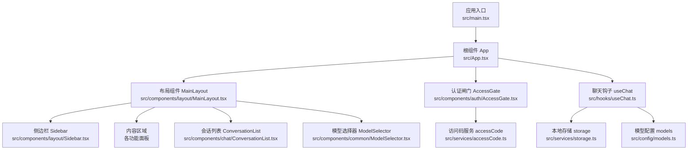
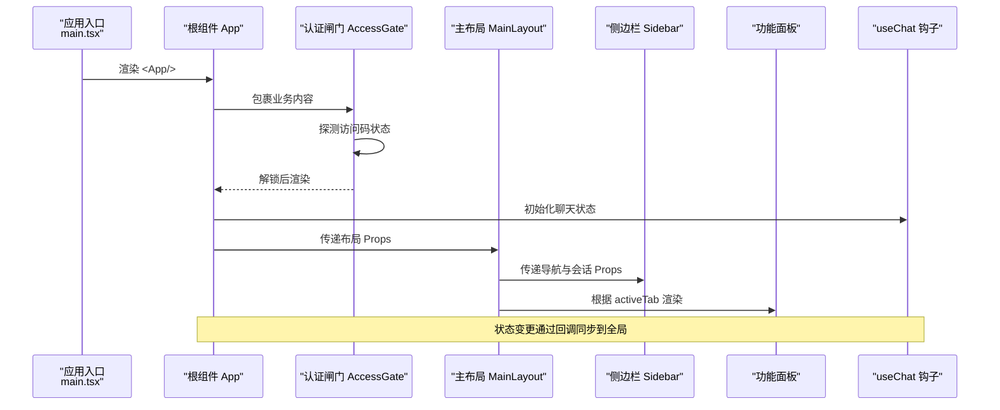
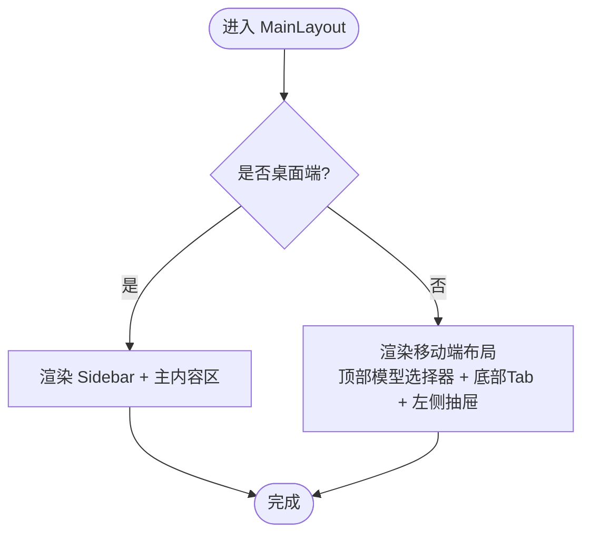
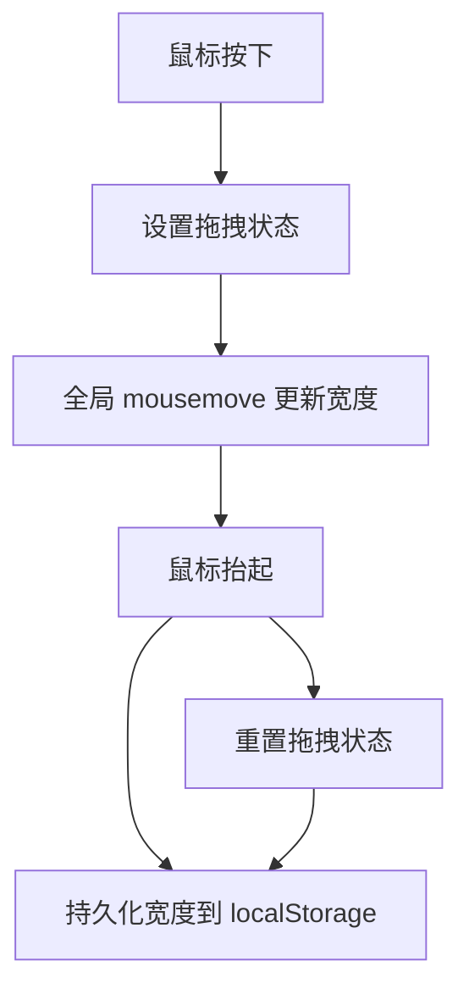
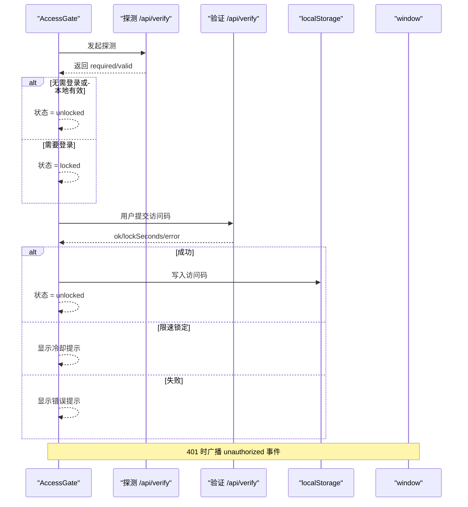
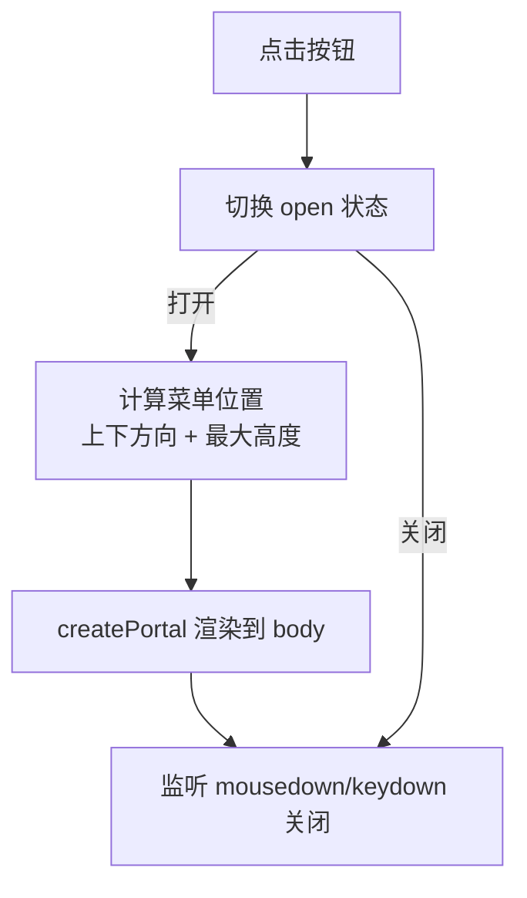
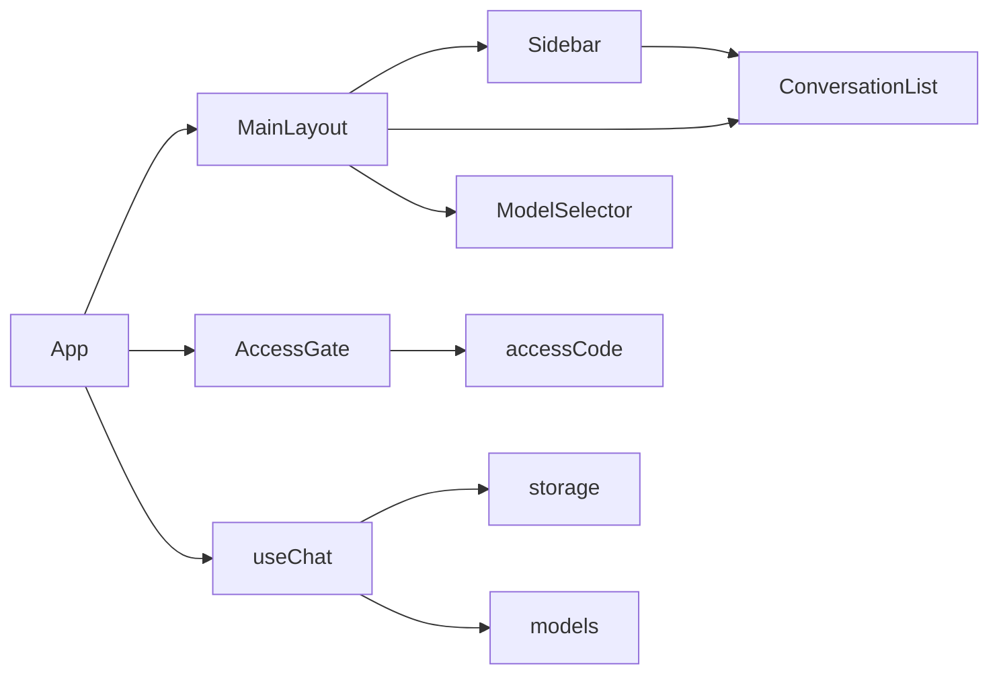

# 核心组件

<cite>
**本文引用的文件**
- [src/App.tsx](file://src/App.tsx)
- [src/main.tsx](file://src/main.tsx)
- [src/components/layout/MainLayout.tsx](file://src/components/layout/MainLayout.tsx)
- [src/components/layout/Sidebar.tsx](file://src/components/layout/Sidebar.tsx)
- [src/components/auth/AccessGate.tsx](file://src/components/auth/AccessGate.tsx)
- [src/components/common/ModelSelector.tsx](file://src/components/common/ModelSelector.tsx)
- [src/hooks/useChat.ts](file://src/hooks/useChat.ts)
- [src/services/accessCode.ts](file://src/services/accessCode.ts)
- [src/services/storage.ts](file://src/services/storage.ts)
- [src/config/models.ts](file://src/config/models.ts)
- [src/components/chat/ConversationList.tsx](file://src/components/chat/ConversationList.tsx)
- [src/types/index.ts](file://src/types/index.ts)
- [package.json](file://package.json)
</cite>

## 目录
1. [简介](#简介)
2. [项目结构](#项目结构)
3. [核心组件](#核心组件)
4. [架构总览](#架构总览)
5. [详细组件分析](#详细组件分析)
6. [依赖关系分析](#依赖关系分析)
7. [性能考量](#性能考量)
8. [故障排查指南](#故障排查指南)
9. [结论](#结论)
10. [附录](#附录)

## 简介
本文件聚焦 AIShop 的核心组件，系统性解析应用根组件 App 的结构与职责、布局组件 MainLayout 与 Sidebar 的设计与交互、认证组件 AccessGate 的访问控制机制、通用组件 ModelSelector 的实现与使用模式，并总结组件间通信、Props 传递与事件处理方式。同时提供最佳实践与性能优化建议，并给出可溯源的“代码片段路径”以便读者在仓库中定位实现细节。

## 项目结构
AIShop 采用以功能域划分的目录组织方式：
- 根组件与入口：src/App.tsx、src/main.tsx
- 布局与导航：src/components/layout/MainLayout.tsx、src/components/layout/Sidebar.tsx
- 认证与访问控制：src/components/auth/AccessGate.tsx、src/services/accessCode.ts
- 通用组件：src/components/common/ModelSelector.tsx、src/components/chat/ConversationList.tsx
- 状态与业务逻辑：src/hooks/useChat.ts、src/services/storage.ts、src/services/accessCode.ts
- 配置与类型：src/config/models.ts、src/types/index.ts
- 构建与依赖：package.json

图表来源
- [src/main.tsx:1-11](file://src/main.tsx#L1-L11)
- [src/App.tsx:1-74](file://src/App.tsx#L1-L74)
- [src/components/layout/MainLayout.tsx:1-227](file://src/components/layout/MainLayout.tsx#L1-L227)
- [src/components/layout/Sidebar.tsx:1-197](file://src/components/layout/Sidebar.tsx#L1-L197)
- [src/components/auth/AccessGate.tsx:1-150](file://src/components/auth/AccessGate.tsx#L1-L150)
- [src/components/common/ModelSelector.tsx:1-168](file://src/components/common/ModelSelector.tsx#L1-L168)
- [src/components/chat/ConversationList.tsx:1-171](file://src/components/chat/ConversationList.tsx#L1-L171)
- [src/hooks/useChat.ts:1-370](file://src/hooks/useChat.ts#L1-L370)
- [src/services/storage.ts:1-66](file://src/services/storage.ts#L1-L66)
- [src/config/models.ts:1-228](file://src/config/models.ts#L1-L228)
- [src/services/accessCode.ts:1-113](file://src/services/accessCode.ts#L1-L113)

章节来源
- [src/main.tsx:1-11](file://src/main.tsx#L1-L11)
- [src/App.tsx:1-74](file://src/App.tsx#L1-L74)

## 核心组件
本节从“状态管理、路由配置、全局状态协调”的角度，系统梳理 App 根组件的职责与实现要点。

- 状态管理与全局协调
  - App 统一持有当前激活标签页 activeTab、移动端抽屉开关 mobileDrawerOpen，并通过 useChat 钩子集中管理聊天相关的全局状态（消息、加载、错误、模型、会话等）。
  - 使用 useChat 返回的函数与状态驱动 ChatPanel、MainLayout、Sidebar、ModelSelector 等组件的渲染与交互。
- 路由配置与内容分发
  - App 通过 activeTab 切换不同功能面板（聊天、图片、视频、音乐），并根据 activeTab 控制侧边会话列表的可见性与交互。
- 全局状态协调
  - App 将 useChat 中的 conversations、activeConversationId、switch/rename/delete/new 等操作透传至 MainLayout/Sidebar/ConversationList，形成“自顶向下”的 Props 传递与“自底向上”的回调回调模式，确保状态一致性。

章节来源
- [src/App.tsx:11-71](file://src/App.tsx#L11-L71)
- [src/hooks/useChat.ts:69-370](file://src/hooks/useChat.ts#L69-L370)

## 架构总览
App 作为顶层容器，负责：
- 认证前置：在渲染任何业务内容之前，通过 AccessGate 进行访问控制。
- 布局编排：将 MainLayout 作为骨架，承载 Sidebar、内容区与移动端抽屉。
- 功能面板：依据 activeTab 渲染对应面板（当前为 ChatPanel 为主，其他面板占位）。
- 状态桥接：将 useChat 的状态与回调以 Props 的形式传递给布局与通用组件。

图表来源
- [src/main.tsx:6-10](file://src/main.tsx#L6-L10)
- [src/App.tsx:53-70](file://src/App.tsx#L53-L70)
- [src/components/auth/AccessGate.tsx:23-54](file://src/components/auth/AccessGate.tsx#L23-L54)
- [src/components/layout/MainLayout.tsx:45-57](file://src/components/layout/MainLayout.tsx#L45-L57)
- [src/components/layout/Sidebar.tsx:48-57](file://src/components/layout/Sidebar.tsx#L48-L57)
- [src/hooks/useChat.ts:69-370](file://src/hooks/useChat.ts#L69-L370)

## 详细组件分析

### App 根组件
- 结构与职责
  - 维护 activeTab、mobileDrawerOpen 两个基础状态。
  - 通过 useChat 获取消息、模型、会话、加载与错误状态，并计算当前会话标题。
  - 根据 activeTab 渲染对应面板（当前为 ChatPanel 为主）。
  - 将布局所需的会话列表、活动会话 ID、会话切换/新建/删除/重命名等回调传递给 MainLayout。
- 状态与 Props 传递
  - 从 useChat 读取 conversations、activeConversationId、messages、selectedModel、isLoading、error、webSearchEnabled 等。
  - 将 onSwitchConversation/onNewConversation/onDeleteConversation/onRenameConversation 等回调传递给布局组件。
- 事件与交互
  - ChatPanel 提供 onMobileMenuClick 回调，用于在移动端打开抽屉。
  - ChatPanel 提供 onImportConversation 回调，用于导入会话。

章节来源
- [src/App.tsx:11-71](file://src/App.tsx#L11-L71)
- [src/hooks/useChat.ts:69-370](file://src/hooks/useChat.ts#L69-L370)

### 布局组件 MainLayout
- 设计目标
  - 在桌面端提供固定侧边栏与主内容区；在移动端提供顶部胶囊式模型选择器、底部 Tab 栏与左侧抽屉。
  - 通过 useIsDesktop 媒体查询判断设备类型，动态切换布局。
- 关键特性
  - 桌面端：Sidebar + 主内容区，Sidebar 仅在聊天模式显示会话列表。
  - 移动端：顶部居中 ModelSelector、右侧新建会话按钮；底部 Tab；左侧抽屉仅聊天模式可用。
  - 抽屉行为：切换 Tab 或进入桌面端时自动收起；ESC 键支持关闭。
  - 会话列表：当满足条件时显示，支持新建、切换、删除、重命名。
- Props 传递模式
  - 从 App 传入 activeTab、onTabChange、conversations、activeConversationId、onSwitchConversation/onNewConversation/onDeleteConversation/onRenameConversation、mobileDrawerOpen/setMobileDrawerOpen。
  - 从 MainLayout 传入 Sidebar 与 ConversationList，形成“自顶向下”的单向数据流。

图表来源
- [src/components/layout/MainLayout.tsx:84-100](file://src/components/layout/MainLayout.tsx#L84-L100)
- [src/components/layout/MainLayout.tsx:102-225](file://src/components/layout/MainLayout.tsx#L102-L225)

章节来源
- [src/components/layout/MainLayout.tsx:45-227](file://src/components/layout/MainLayout.tsx#L45-L227)

### 侧边栏 Sidebar
- 设计目标
  - 提供多模块导航（聊天、图片、视频、音乐），在聊天模式下显示会话列表。
  - 支持宽度拖拽调整与持久化，折叠态仅显示图标。
- 关键特性
  - 拖拽调整宽度：全局 mousemove/mouseup 监听，禁用文本选择，限制最小/最大宽度。
  - 折叠态：宽度低于阈值时隐藏文字，仅保留图标。
  - 会话列表：在聊天模式下显示，支持新建、切换、删除、重命名。
- 交互与事件
  - 鼠标按下触发拖拽，鼠标抬起结束拖拽。
  - 双击拖动手柄重置宽度。
  - 通过 localStorage 持久化宽度。

图表来源
- [src/components/layout/Sidebar.tsx:80-116](file://src/components/layout/Sidebar.tsx#L80-L116)
- [src/components/layout/Sidebar.tsx:173-194](file://src/components/layout/Sidebar.tsx#L173-L194)

章节来源
- [src/components/layout/Sidebar.tsx:48-197](file://src/components/layout/Sidebar.tsx#L48-L197)

### 认证组件 AccessGate
- 机制概述
  - 启动时探测服务端访问码策略与本地存储的有效性，决定初始状态（checking/unlocked/locked）。
  - 若需要登录，展示密码输入表单；提交后调用服务端验证，成功后写入本地存储并解锁。
  - 监听全局 unauthorized 事件，收到 401 时自动锁回登录界面。
- 表单与错误处理
  - 输入为空时提示；验证失败时区分“密码错误”“被限速锁定（含分钟级冷却）”等情况。
  - 提交过程中禁用按钮，避免重复提交。
- 与服务端协作
  - 通过 /api/verify 接口进行探测与验证；服务端通过 X-Access-Code 请求头校验。
  - 401 时清除本地访问码并广播自定义事件，触发 AccessGate 锁定。

图表来源
- [src/components/auth/AccessGate.tsx:23-81](file://src/components/auth/AccessGate.tsx#L23-L81)
- [src/services/accessCode.ts:66-110](file://src/services/accessCode.ts#L66-L110)

章节来源
- [src/components/auth/AccessGate.tsx:23-150](file://src/components/auth/AccessGate.tsx#L23-L150)
- [src/services/accessCode.ts:1-113](file://src/services/accessCode.ts#L1-L113)

### 通用组件 ModelSelector
- 功能概述
  - 在聊天模式下提供胶囊式模型选择器，支持点击展开查看全部模型，支持按 Provider 显示图标。
  - 弹出菜单通过 createPortal 渲染到 document.body，避免父级 overflow 影响定位。
- 交互与定位
  - 根据按钮位置与窗口空间自动决定“向下”或“向上”弹出，并限制最大高度。
  - 监听窗口 resize 与 scroll 事件，动态更新菜单位置。
  - 支持点击外部或按 Esc 关闭菜单。
- Props 与回调
  - 接收 models、selectedModel、onModelChange，onModelChange 由上层（如 MainLayout/ChatPanel）提供。

图表来源
- [src/components/common/ModelSelector.tsx:52-79](file://src/components/common/ModelSelector.tsx#L52-L79)
- [src/components/common/ModelSelector.tsx:81-98](file://src/components/common/ModelSelector.tsx#L81-L98)
- [src/components/common/ModelSelector.tsx:123-164](file://src/components/common/ModelSelector.tsx#L123-L164)

章节来源
- [src/components/common/ModelSelector.tsx:42-168](file://src/components/common/ModelSelector.tsx#L42-L168)

### 组件间通信与 Props 传递模式
- 自顶向下（Top-down）
  - App -> MainLayout -> Sidebar/ConversationList/ModelSelector
  - App -> ChatPanel（聊天面板）
- 自底向上（Bottom-up）
  - Sidebar/ConversationList/ModelSelector 通过回调（onTabChange/onSwitch/onNew/onDelete/onRename/onModelChange）通知 App 更新状态。
- 事件处理
  - MainLayout 在移动端监听 ESC 键关闭抽屉；Sidebar 监听全局 mousemove/mouseup；ModelSelector 监听 mousedown/keydown。
- 数据一致性
  - useChat 返回的状态与回调在 App 中统一管理，确保聊天消息、模型、会话、加载状态等跨组件一致。

章节来源
- [src/App.tsx:53-70](file://src/App.tsx#L53-L70)
- [src/components/layout/MainLayout.tsx:69-82](file://src/components/layout/MainLayout.tsx#L69-L82)
- [src/components/layout/Sidebar.tsx:87-116](file://src/components/layout/Sidebar.tsx#L87-L116)
- [src/components/common/ModelSelector.tsx:81-98](file://src/components/common/ModelSelector.tsx#L81-L98)

## 依赖关系分析
- 组件依赖
  - App 依赖 useChat、AccessGate、MainLayout、ChatPanel 等。
  - MainLayout 依赖 Sidebar、ConversationList、ModelSelector。
  - Sidebar 依赖 ConversationList。
  - ModelSelector 依赖公共图标资源（/public/providers/*）。
- 服务与配置
  - useChat 依赖 storage（localStorage）、models（模型配置）、webSearch（可选联网搜索）、titleGenerator（标题生成）。
  - accessCode 依赖 localStorage 与 /api/verify 接口。
- 类型与配置
  - types/index.ts 定义了 Message、Conversation、Model、TabMode 等核心类型。
  - config/models.ts 提供 CHAT_MODELS/IMAGE_MODELS 等模型清单。

图表来源
- [src/App.tsx:1-10](file://src/App.tsx#L1-L10)
- [src/components/layout/MainLayout.tsx:1-7](file://src/components/layout/MainLayout.tsx#L1-L7)
- [src/components/layout/Sidebar.tsx:1-4](file://src/components/layout/Sidebar.tsx#L1-L4)
- [src/components/common/ModelSelector.tsx:1-4](file://src/components/common/ModelSelector.tsx#L1-L4)
- [src/hooks/useChat.ts:1-15](file://src/hooks/useChat.ts#L1-L15)
- [src/services/storage.ts:1-66](file://src/services/storage.ts#L1-L66)
- [src/config/models.ts:1-228](file://src/config/models.ts#L1-L228)
- [src/services/accessCode.ts:1-113](file://src/services/accessCode.ts#L1-L113)

章节来源
- [src/types/index.ts:1-103](file://src/types/index.ts#L1-L103)
- [src/config/models.ts:1-228](file://src/config/models.ts#L1-L228)
- [src/services/storage.ts:1-66](file://src/services/storage.ts#L1-L66)
- [src/services/accessCode.ts:1-113](file://src/services/accessCode.ts#L1-L113)

## 性能考量
- 渲染与重绘
  - MainLayout 使用媒体查询与 useEffect 控制抽屉状态，避免不必要的重渲染。
  - Sidebar 的拖拽通过全局事件与局部状态结合，减少频繁重算。
- 事件监听
  - ModelSelector 在打开时才注册 mousedown/keydown 监听，关闭时清理，降低全局事件开销。
- 数据持久化
  - useChat 将 conversations 与 webSearchEnabled 持久化到 localStorage，避免每次刷新重建。
- 流式渲染
  - useChat 的流式生成通过增量更新最后一条 assistant 消息，避免全量重渲染。
- 资源加载
  - ModelSelector 的 Provider 图标按需加载，注意在 /public/providers 下的资源可用性。

[本节为通用性能建议，不直接分析特定文件，故无章节来源]

## 故障排查指南
- 访问码相关
  - 症状：页面一直停留在“正在校验访问权限”或反复弹出登录框。
  - 排查：检查 /api/verify 是否可达；确认浏览器 localStorage 存储是否被清理；留意服务端返回 401 时的限速冷却。
- 401 未解锁
  - 症状：输入正确访问码后仍提示错误或被锁定。
  - 排查：确认 onModelChange 回调是否正确传递；检查服务端 X-Access-Code 校验逻辑。
- 移动端抽屉无法关闭
  - 症状：移动端抽屉无法通过 ESC 关闭或点击遮罩关闭。
  - 排查：确认 MainLayout 的键盘事件与遮罩点击事件绑定是否生效。
- 模型选择器菜单位置异常
  - 症状：菜单出现在屏幕外或被遮挡。
  - 排查：检查 createPortal 渲染目标与窗口滚动/缩放事件监听；确认按钮位置计算逻辑。
- 会话列表搜索无效
  - 症状：搜索关键词无效或无结果。
  - 排查：确认 PinyinMatch 的引入与过滤逻辑；检查输入大小写与空白字符处理。

章节来源
- [src/components/auth/AccessGate.tsx:56-81](file://src/components/auth/AccessGate.tsx#L56-L81)
- [src/components/layout/MainLayout.tsx:74-82](file://src/components/layout/MainLayout.tsx#L74-L82)
- [src/components/common/ModelSelector.tsx:52-79](file://src/components/common/ModelSelector.tsx#L52-L79)
- [src/components/chat/ConversationList.tsx:30-38](file://src/components/chat/ConversationList.tsx#L30-L38)

## 结论
AIShop 的核心组件围绕“根组件 App + 布局组件 MainLayout + 侧边栏 Sidebar + 认证闸门 AccessGate + 通用组件 ModelSelector + useChat 钩子”的组合构建。App 通过 useChat 实现全局状态管理与内容分发，MainLayout/Sidebar 提供响应式布局与会话管理，AccessGate 实现访问控制，ModelSelector 提供模型切换能力。组件间通过明确的 Props 传递与回调实现解耦与一致性。遵循本文的最佳实践与性能建议，可进一步提升用户体验与系统稳定性。

[本节为总结性内容，不直接分析特定文件，故无章节来源]

## 附录

### 组件使用最佳实践
- Props 传递
  - 优先使用“自顶向下”的单向数据流，避免跨层级共享状态。
  - 将回调函数（onSwitch/onNew/onDelete/onRename/onModelChange）从 App 传递至布局与通用组件，确保状态一致性。
- 事件处理
  - 在组件卸载时清理全局事件监听（如 Sidebar 的 mousemove/mouseup、ModelSelector 的 mousedown/keydown）。
  - 对于移动端交互（ESC 关闭抽屉），确保在合适时机绑定与解绑。
- 状态持久化
  - 使用 localStorage 持久化会话列表、模型选择、联网搜索开关等用户偏好。
- 性能优化
  - 对长列表（会话列表）使用 useMemo 进行过滤与渲染优化。
  - 流式渲染时仅更新最后一条消息，避免全量重渲染。
  - 模型选择器菜单通过 createPortal 渲染，减少 DOM 层级影响。

### 使用场景与代码片段路径
- 在 App 中渲染聊天面板并传递状态
  - [src/App.tsx:21-51](file://src/App.tsx#L21-L51)
- 在 MainLayout 中传递布局 Props
  - [src/App.tsx:55-68](file://src/App.tsx#L55-L68)
- 在 Sidebar 中显示会话列表
  - [src/components/layout/Sidebar.tsx:160-169](file://src/components/layout/Sidebar.tsx#L160-L169)
- 在 MainLayout 中显示移动端抽屉
  - [src/components/layout/MainLayout.tsx:166-223](file://src/components/layout/MainLayout.tsx#L166-L223)
- 在 AccessGate 中处理登录与错误
  - [src/components/auth/AccessGate.tsx:56-81](file://src/components/auth/AccessGate.tsx#L56-L81)
- 在 ModelSelector 中选择模型
  - [src/components/common/ModelSelector.tsx:142-147](file://src/components/common/ModelSelector.tsx#L142-L147)
- 在 useChat 中管理会话与消息
  - [src/hooks/useChat.ts:135-250](file://src/hooks/useChat.ts#L135-L250)
- 在 storage 中持久化会话
  - [src/services/storage.ts:19-25](file://src/services/storage.ts#L19-L25)