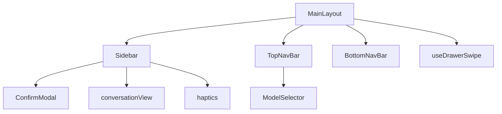
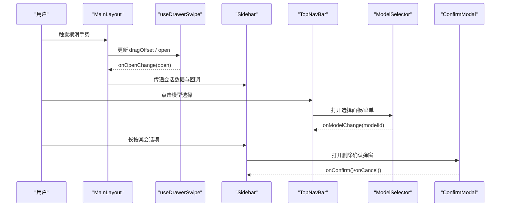
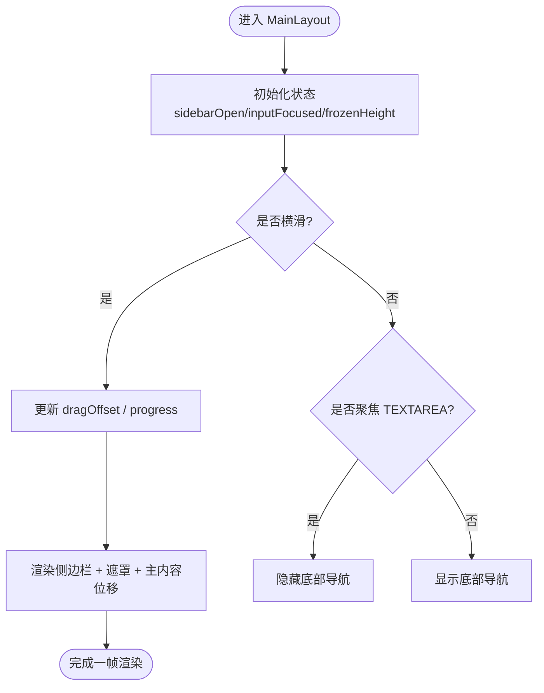
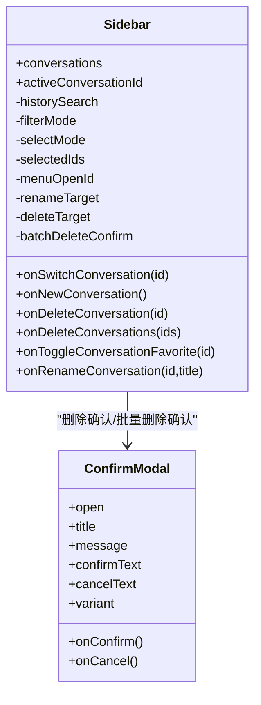
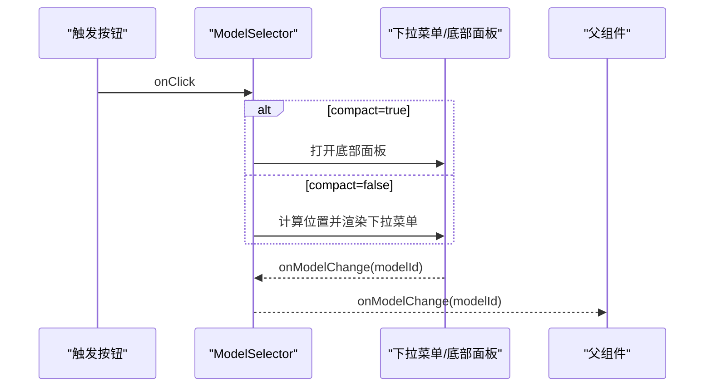
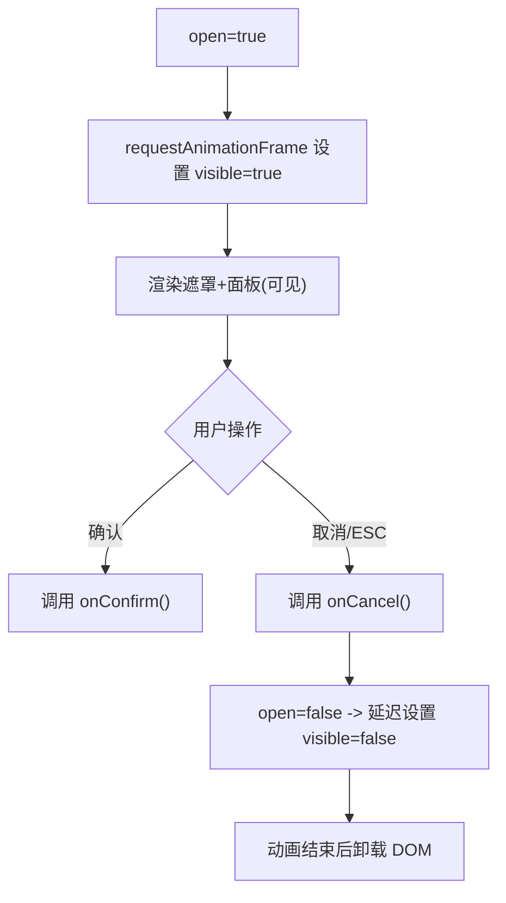
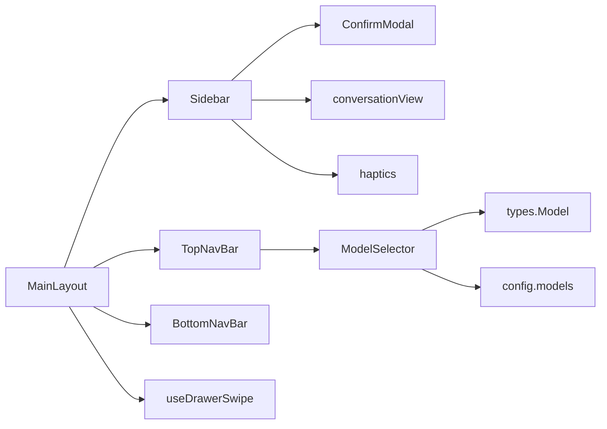

# 核心组件

<cite>
**本文引用的文件**
- [MainLayout.tsx](file://src/components/layout/MainLayout.tsx)
- [Sidebar.tsx](file://src/components/layout/Sidebar.tsx)
- [ModelSelector.tsx](file://src/components/common/ModelSelector.tsx)
- [ConfirmModal.tsx](file://src/components/common/ConfirmModal.tsx)
- [TopNavBar.tsx](file://src/components/layout/TopNavBar.tsx)
- [BottomNavBar.tsx](file://src/components/layout/BottomNavBar.tsx)
- [useDrawerSwipe.ts](file://src/hooks/useDrawerSwipe.ts)
- [haptics.ts](file://src/utils/haptics.ts)
- [conversationView.ts](file://src/utils/conversationView.ts)
- [index.ts（类型定义）](file://src/types/index.ts)
- [models.ts（模型配置）](file://src/config/models.ts)
</cite>

## 目录
1. [简介](#简介)
2. [项目结构](#项目结构)
3. [核心组件](#核心组件)
4. [架构总览](#架构总览)
5. [详细组件分析](#详细组件分析)
6. [依赖关系分析](#依赖关系分析)
7. [性能考量](#性能考量)
8. [故障排查指南](#故障排查指南)
9. [结论](#结论)
10. [附录：Props 与事件、样式定制、可访问性与国际化](#附录props-与事件样式定制可访问性与国际化)

## 简介
本文件聚焦 AIShop 的核心 UI 组件，重点解析布局组件 MainLayout 与 Sidebar 的设计实现，以及通用组件 ModelSelector 与 ConfirmModal 的功能特性、使用方式与扩展点。文档涵盖响应式布局、导航逻辑、状态管理、组合模式、最佳实践、可访问性支持与国际化适配建议，并提供实际使用路径指引。

## 项目结构
- 布局层：MainLayout 负责整体页面容器、侧边栏抽屉手势、顶部/底部导航集成；Sidebar 提供会话列表、搜索、筛选、批量操作、上下文菜单等。
- 通用层：ModelSelector 提供多模型选择器（下拉或底部面板），ConfirmModal 提供确认弹窗。
- 工具与钩子：useDrawerSwipe 处理横向滑动手势；haptics 提供触感反馈；conversationView 提供会话预览与空判断。
- 类型与配置：types/index.ts 定义消息、会话、模型等数据结构；config/models.ts 提供模型清单与分组映射。

图表来源
- [MainLayout.tsx:1-205](file://src/components/layout/MainLayout.tsx#L1-L205)
- [Sidebar.tsx:1-557](file://src/components/layout/Sidebar.tsx#L1-L557)
- [TopNavBar.tsx:36-82](file://src/components/layout/TopNavBar.tsx#L36-L82)
- [BottomNavBar.tsx:1-37](file://src/components/layout/BottomNavBar.tsx#L1-L37)
- [useDrawerSwipe.ts:1-218](file://src/hooks/useDrawerSwipe.ts#L1-L218)
- [conversationView.ts:1-33](file://src/utils/conversationView.ts#L1-L33)
- [haptics.ts:1-60](file://src/utils/haptics.ts#L1-L60)

章节来源
- [MainLayout.tsx:1-205](file://src/components/layout/MainLayout.tsx#L1-L205)
- [Sidebar.tsx:1-557](file://src/components/layout/Sidebar.tsx#L1-L557)

## 核心组件
- MainLayout：应用级布局容器，管理侧边栏打开/关闭、输入框聚焦时隐藏底部导航、横滑手势控制、遮罩与过渡动画、TopNavBar 与 BottomNavBar 的集成。
- Sidebar：会话历史列表，支持搜索、收藏过滤、时间分组、长按上下文菜单、批量删除、重命名、导出、收藏切换等。
- ModelSelector：模型选择器，支持紧凑模式（底部面板）与非紧凑模式（固定定位下拉菜单），按厂商分组显示，带图标与选中态。
- ConfirmModal：可复用的确认弹窗，支持多种变体、ESC 关闭、背景滚动锁定、无障碍属性与过渡动画。

章节来源
- [MainLayout.tsx:10-205](file://src/components/layout/MainLayout.tsx#L10-L205)
- [Sidebar.tsx:12-557](file://src/components/layout/Sidebar.tsx#L12-L557)
- [ModelSelector.tsx:7-320](file://src/components/common/ModelSelector.tsx#L7-L320)
- [ConfirmModal.tsx:5-135](file://src/components/common/ConfirmModal.tsx#L5-L135)

## 架构总览
MainLayout 作为根容器，通过 useDrawerSwipe 监听横向滑动，驱动 Sidebar 的显隐与主内容区位移；TopNavBar 承载模型选择、新建对话、上下文用量指示等；BottomNavBar 提供 Tab 切换。Sidebar 内部维护本地交互状态（搜索、筛选、批量选择、菜单位置等），并通过回调将业务动作上抛给父组件。ModelSelector 根据 compact 模式决定渲染为底部面板或下拉菜单，并计算最优弹出位置。ConfirmModal 以 Portal 渲染到 body，避免被祖先 transform 裁剪，同时提供键盘与无障碍支持。

图表来源
- [MainLayout.tsx:95-118](file://src/components/layout/MainLayout.tsx#L95-L118)
- [useDrawerSwipe.ts:69-218](file://src/hooks/useDrawerSwipe.ts#L69-L218)
- [Sidebar.tsx:109-218](file://src/components/layout/Sidebar.tsx#L109-L218)
- [ModelSelector.tsx:69-178](file://src/components/common/ModelSelector.tsx#L69-L178)
- [ConfirmModal.tsx:34-66](file://src/components/common/ConfirmModal.tsx#L34-L66)

## 详细组件分析

### MainLayout 组件
- 职责
  - 管理侧边栏打开/关闭状态与横滑手势。
  - 在输入框聚焦时隐藏底部导航，避免遮挡。
  - 集成 TopNavBar 与 BottomNavBar，透传模型、联网搜索、Artifact、上下文用量等能力。
  - 通过 createPortal 或绝对定位实现遮罩与内容位移。
- 关键交互
  - 横滑手势：基于 useDrawerSwipe，支持速度优先与距离兜底的吸附策略。
  - ESC 关闭侧边栏。
  - 输入框聚焦检测：TEXTAREA 聚焦时隐藏底部导航，失焦延迟恢复。
- 状态与副作用
  - sidebarOpen、inputFocused、dragOffset、frozenHeight。
  - 监听 keydown 关闭侧边栏；冻结初始视口高度防止键盘弹起导致 dvh 变化。
- 组合与透传
  - 向 Sidebar 传入会话数据与回调（切换、新建、删除、收藏、重命名）。
  - 向 TopNavBar 传入模型、开关、用量、片段等。
- 性能与体验
  - 拖动中禁用 CSS transition，松手后由 CSS 完成吸附动画。
  - 遮罩透明度与进度同步，避免闪烁。

图表来源
- [MainLayout.tsx:74-118](file://src/components/layout/MainLayout.tsx#L74-L118)
- [useDrawerSwipe.ts:69-218](file://src/hooks/useDrawerSwipe.ts#L69-L218)

章节来源
- [MainLayout.tsx:10-205](file://src/components/layout/MainLayout.tsx#L10-L205)

### Sidebar 组件
- 职责
  - 会话列表展示与交互：搜索、收藏过滤、时间分组、预览文本。
  - 长按上下文菜单：导出、编辑标题、收藏/取消收藏、删除。
  - 批量选择与批量删除。
  - 重命名与删除确认弹窗。
- 关键交互
  - 点击延迟切换：先高亮再切换，提升反馈感。
  - 长按菜单：记录指针坐标，portal 到 body，动态计算位置，避免被 overflow 裁剪。
  - 搜索：支持拼音匹配与关键词过滤。
  - 时间分组：今天、昨天、本月、更早。
- 状态与副作用
  - 本地状态：historySearch、filterMode、selectMode、selectedIds、menuOpenId、renameTarget、deleteTarget、batchDeleteConfirm。
  - 使用 useLayoutEffect 计算菜单位置，避免绘制闪烁。
  - 使用 haptic 提供触感反馈。
- 数据与工具
  - hasAnyMessage、lastMessagePreviewOf 用于过滤与预览。
  - 导出会话调用备份服务。

图表来源
- [Sidebar.tsx:12-557](file://src/components/layout/Sidebar.tsx#L12-L557)
- [ConfirmModal.tsx:5-135](file://src/components/common/ConfirmModal.tsx#L5-L135)

章节来源
- [Sidebar.tsx:12-557](file://src/components/layout/Sidebar.tsx#L12-L557)
- [conversationView.ts:1-33](file://src/utils/conversationView.ts#L1-L33)
- [haptics.ts:1-60](file://src/utils/haptics.ts#L1-L60)

### ModelSelector 组件
- 职责
  - 提供模型选择入口，支持两种形态：
    - 非紧凑模式：固定定位下拉菜单，自动计算 top/bottom 放置与最大高度。
    - 紧凑模式：打开底部面板（ModelBottomSheet），适合移动端输入区域。
  - 按厂商分组显示，支持深色图标圆形背景。
- 关键交互
  - 打开/关闭：compact 模式切换底部面板；非 compact 模式使用 portal 下拉菜单。
  - 定位计算：基于按钮 getBoundingClientRect，考虑窗口 resize/scroll，确保不溢出。
  - 外部点击与 ESC 关闭。
- 状态与副作用
  - open、animVisible、mounted、pos、showBottomSheet。
  - useEffect/useLayoutEffect 管理动画与定位。
- 数据与配置
  - 模型数组、当前选中模型、变更回调。
  - 可选 webSearchEnabled、artifactEnabled 及对应回调（仅 compact 模式使用）。

图表来源
- [ModelSelector.tsx:69-178](file://src/components/common/ModelSelector.tsx#L69-L178)
- [ModelSelector.tsx:184-316](file://src/components/common/ModelSelector.tsx#L184-L316)

章节来源
- [ModelSelector.tsx:7-320](file://src/components/common/ModelSelector.tsx#L7-L320)

### ConfirmModal 组件
- 职责
  - 提供统一的确认弹窗，支持 danger/warning/info 三种变体。
  - 通过 Portal 渲染到 body，避免被祖先 transform 裁剪。
  - 支持 ESC 关闭、背景滚动锁定、过渡动画。
- 关键交互
  - 打开：requestAnimationFrame 触发进入动画。
  - 关闭：延迟设置 visible，保证退出动画播放完毕后再卸载 DOM。
  - 点击遮罩取消。
- 无障碍
  - role="dialog"、aria-modal="true"、aria-labelledby、aria-describedby。
- 样式与主题
  - 使用 CSS 变量与 Tailwind 类名，便于主题化。

图表来源
- [ConfirmModal.tsx:34-81](file://src/components/common/ConfirmModal.tsx#L34-L81)
- [ConfirmModal.tsx:83-135](file://src/components/common/ConfirmModal.tsx#L83-L135)

章节来源
- [ConfirmModal.tsx:5-135](file://src/components/common/ConfirmModal.tsx#L5-L135)

## 依赖关系分析
- MainLayout 依赖
  - Sidebar：侧边栏内容与交互。
  - TopNavBar/BottomNavBar：导航与 Tab 切换。
  - useDrawerSwipe：横滑手势。
  - haptics：触感反馈。
- Sidebar 依赖
  - ConfirmModal：删除确认。
  - conversationView：会话空判断与预览。
  - haptics：长按反馈。
- ModelSelector 依赖
  - types.Model：模型数据结构。
  - config.models：模型清单与分组映射。
- ConfirmModal 依赖
  - React Portal：挂载到 body。
  - CSS 变量/Tailwind：样式主题。

图表来源
- [MainLayout.tsx:1-205](file://src/components/layout/MainLayout.tsx#L1-L205)
- [Sidebar.tsx:1-557](file://src/components/layout/Sidebar.tsx#L1-L557)
- [ModelSelector.tsx:1-320](file://src/components/common/ModelSelector.tsx#L1-L320)
- [ConfirmModal.tsx:1-135](file://src/components/common/ConfirmModal.tsx#L1-L135)
- [useDrawerSwipe.ts:1-218](file://src/hooks/useDrawerSwipe.ts#L1-L218)
- [conversationView.ts:1-33](file://src/utils/conversationView.ts#L1-L33)
- [haptics.ts:1-60](file://src/utils/haptics.ts#L1-L60)
- [index.ts:109-175](file://src/types/index.ts#L109-L175)
- [models.ts:1-284](file://src/config/models.ts#L1-L284)

章节来源
- [index.ts:109-175](file://src/types/index.ts#L109-L175)
- [models.ts:1-284](file://src/config/models.ts#L1-L284)

## 性能考量
- 手势与渲染
  - 拖动中禁用 CSS transition，减少重排；松手后交由 CSS 完成吸附动画。
  - 使用 requestAnimationFrame 与 useLayoutEffect 进行测量与定位，避免闪烁。
- 列表与过滤
  - 使用 useMemo 缓存过滤与分组结果，减少重复计算。
  - 会话空判断与预览使用工具函数，避免直接读取未加载消息导致的误判。
- 弹窗与遮罩
  - 使用 Portal 避免祖先 transform 影响定位；延迟卸载保证动画完整。
- 触感反馈
  - haptics 封装平台差异，失败静默降级，不影响主流程。

[本节为通用指导，无需具体文件引用]

## 故障排查指南
- 侧边栏无法拉出或卡顿
  - 检查 useDrawerSwipe 的 enabled 与 width 是否正确传入。
  - 确认触摸事件未被其他元素拦截（如 input/textarea 或横向滚动容器）。
  - 参考手势忽略规则：data-swipe-ignore、INPUT/TEXTAREA/SELECT、可编辑区域、横向可滚动元素。
- 菜单位置异常或被裁剪
  - 确认菜单已 portal 到 body，并使用 useLayoutEffect 计算位置。
  - 检查 visualViewport 与偏移量，避免浏览器工具栏占用空间导致截断。
- 模型选择器弹出位置错误
  - 检查按钮 ref 与 getBoundingClientRect 调用时机（需在 DOM 渲染后）。
  - 监听 resize/scroll 重新计算位置。
- 确认弹窗无法关闭或滚动异常
  - 确认 ESC 监听与 body.overflow 恢复逻辑正确执行。
  - 检查是否在 effect 清理中移除监听器。

章节来源
- [useDrawerSwipe.ts:44-67](file://src/hooks/useDrawerSwipe.ts#L44-L67)
- [Sidebar.tsx:148-205](file://src/components/layout/Sidebar.tsx#L148-L205)
- [ModelSelector.tsx:118-158](file://src/components/common/ModelSelector.tsx#L118-L158)
- [ConfirmModal.tsx:50-66](file://src/components/common/ConfirmModal.tsx#L50-L66)

## 结论
MainLayout 与 Sidebar 构成了 AIShop 的核心布局与导航骨架，结合 useDrawerSwipe 提供了流畅的横滑体验；ModelSelector 与 ConfirmModal 提供了通用的交互能力，具备良好的可复用性与可扩展性。通过合理的状态管理、Portal 渲染、动画与无障碍支持，这些组件能够在多端设备上保持一致的体验。建议在项目中遵循本文档的组合模式与最佳实践，以确保一致性与可维护性。

[本节为总结，无需具体文件引用]

## 附录：Props 与事件、样式定制、可访问性与国际化

### Props 接口定义（摘要）
- MainLayout
  - activeTab、onTabChange、children、conversations、activeConversationId、onSwitchConversation、onNewConversation、canCreateNewConversation、onDeleteConversation、onDeleteConversations、onToggleConversationFavorite、onRenameConversation、models、selectedModel、onModelChange、webSearchEnabled、onWebSearchToggle、artifactEnabled、onArtifactToggle、realUsage、contextLimit、isCompacting、isAwaitingUsage、onCompactActive、segments、onOpenSegment、onDeleteSegment。
- Sidebar
  - conversations、activeConversationId、onSwitchConversation、onNewConversation、onDeleteConversation、onDeleteConversations、onToggleConversationFavorite、onRenameConversation。
- ModelSelector
  - models、selectedModel、onModelChange、compact、webSearchEnabled、onWebSearchToggle、artifactEnabled、onArtifactToggle。
- ConfirmModal
  - open、title、message、confirmText、cancelText、variant、onConfirm、onCancel。

章节来源
- [MainLayout.tsx:10-43](file://src/components/layout/MainLayout.tsx#L10-L43)
- [Sidebar.tsx:12-21](file://src/components/layout/Sidebar.tsx#L12-L21)
- [ModelSelector.tsx:7-16](file://src/components/common/ModelSelector.tsx#L7-L16)
- [ConfirmModal.tsx:7-16](file://src/components/common/ConfirmModal.tsx#L7-L16)

### 事件处理与回调
- 侧边栏
  - onSwitchConversation：切换会话并收起侧边栏。
  - onDeleteConversation/onDeleteConversations：单删/批删。
  - onToggleConversationFavorite：收藏/取消收藏。
  - onRenameConversation：重命名。
- 模型选择器
  - onModelChange：选择模型后回调父组件。
- 确认弹窗
  - onConfirm/onCancel：确认后执行业务逻辑，取消则关闭弹窗。

章节来源
- [Sidebar.tsx:72-80](file://src/components/layout/Sidebar.tsx#L72-L80)
- [Sidebar.tsx:477-496](file://src/components/layout/Sidebar.tsx#L477-L496)
- [ModelSelector.tsx:198-229](file://src/components/common/ModelSelector.tsx#L198-L229)
- [ConfirmModal.tsx:113-129](file://src/components/common/ConfirmModal.tsx#L113-L129)

### 样式定制指南
- 使用 CSS 变量与 Tailwind 类名进行主题化，例如：
  - 背景色：var(--color-bg-primary)、var(--color-bg-elevated)。
  - 强调色：var(--color-accent)、var(--color-accent-soft)。
  - 边框与文字：var(--color-border)、var(--color-text-primary)、var(--color-text-secondary)。
- 组件内多处使用上述变量，便于全局换肤。
- 对于深色图标 provider，使用圆形白底包裹以提升对比度。

章节来源
- [Sidebar.tsx:283-363](file://src/components/layout/Sidebar.tsx#L283-L363)
- [ModelSelector.tsx:245-261](file://src/components/common/ModelSelector.tsx#L245-L261)
- [ConfirmModal.tsx:83-135](file://src/components/common/ConfirmModal.tsx#L83-L135)

### 可访问性支持
- ConfirmModal
  - role="dialog"、aria-modal="true"、aria-labelledby、aria-describedby。
  - ESC 关闭，阻止背景滚动。
- 其他组件
  - 按钮具备语义化标签与焦点样式。
  - 图标按钮提供 title 或 aria-label（可根据需要补充）。

章节来源
- [ConfirmModal.tsx:83-135](file://src/components/common/ConfirmModal.tsx#L83-L135)

### 国际化适配
- 当前文案多为硬编码字符串（如“对话”、“收藏”、“我的”、“删除”、“确认”、“取消”等）。
- 建议方案
  - 抽取文案至 i18n 资源文件，按语言包组织。
  - 在组件中通过 i18n hook 获取文案，替换硬编码字符串。
  - 对动态文案（如“选中的 N 个会话”）使用插值。
- 注意事项
  - 保持按钮与提示文案简洁，避免过长导致布局问题。
  - 对日期分组（今天、昨天、本月、更早）也需国际化。

[本节为通用指导，无需具体文件引用]

### 组合使用模式与最佳实践
- 在 App 层集中管理会话、模型、Tab 等状态，通过 props 下传给 MainLayout。
- MainLayout 将侧边栏相关回调透传给 Sidebar，将模型与开关透传给 TopNavBar。
- Sidebar 内部维护本地交互状态，仅通过回调上报业务变更，保持单向数据流。
- ModelSelector 根据设备与布局选择 compact 模式，提升移动端体验。
- ConfirmModal 用于所有危险操作的二次确认，统一视觉与行为。

章节来源
- [MainLayout.tsx:174-198](file://src/components/layout/MainLayout.tsx#L174-L198)
- [Sidebar.tsx:508-553](file://src/components/layout/Sidebar.tsx#L508-L553)
- [ModelSelector.tsx:69-104](file://src/components/common/ModelSelector.tsx#L69-L104)