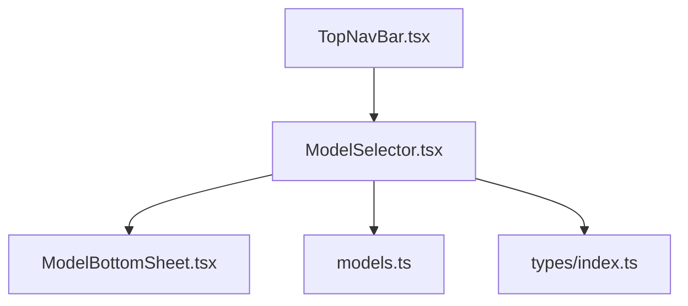
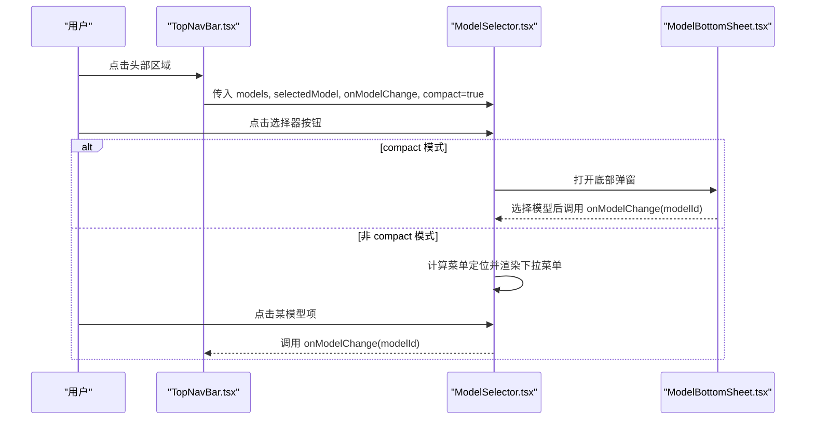
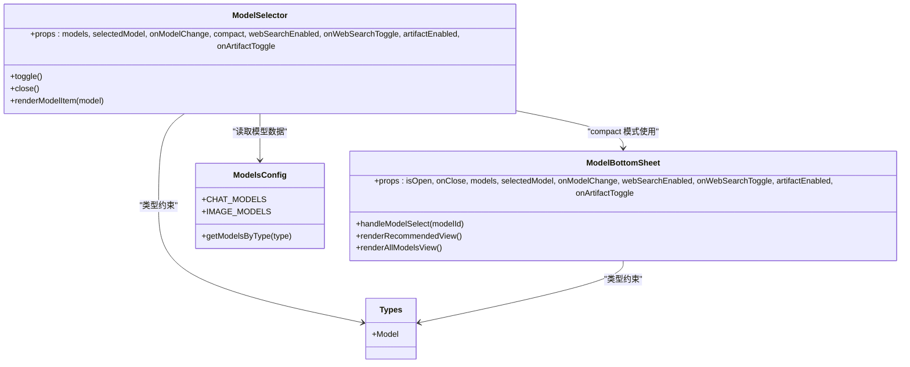

# 模型选择器 ModelSelector

<cite>
**本文引用的文件**
- [ModelSelector.tsx](file://src/components/common/ModelSelector.tsx)
- [ModelBottomSheet.tsx](file://src/components/common/ModelBottomSheet.tsx)
- [models.ts](file://src/config/models.ts)
- [index.ts](file://src/types/index.ts)
- [TopNavBar.tsx](file://src/components/layout/TopNavBar.tsx)
</cite>

## 目录
1. [简介](#简介)
2. [项目结构](#项目结构)
3. [核心组件](#核心组件)
4. [架构总览](#架构总览)
5. [详细组件分析](#详细组件分析)
6. [依赖关系分析](#依赖关系分析)
7. [性能考量](#性能考量)
8. [故障排查指南](#故障排查指南)
9. [结论](#结论)
10. [附录：使用示例与主题适配](#附录使用示例与主题适配)

## 简介
ModelSelector 是一个通用的 AI 模型选择器组件，支持在桌面端下拉菜单与移动端底部弹窗两种交互形态。它提供以下能力：
- 多厂商模型分组展示（Anthropic、OpenAI、Google、xAI、国内模型等）
- 当前选中模型的图标、名称显示
- 紧凑模式下的“联网搜索”和“Artifact”开关集成
- 键盘与外部点击关闭的无障碍交互
- 基于 Provider 的图标映射与深色图标背景适配

该组件通过 props 暴露最小化接口，由上层业务组件传入模型列表、当前选中项以及变更回调，实现松耦合复用。

## 项目结构
- 组件层
  - src/components/common/ModelSelector.tsx：主选择器组件，负责触发按钮、弹出定位、分组渲染、事件处理
  - src/components/common/ModelBottomSheet.tsx：紧凑模式下的底部弹窗，包含推荐模型视图与全部模型视图
- 配置与类型
  - src/config/models.ts：模型数据定义（聊天、图像等），以及按类型获取模型的函数
  - src/types/index.ts：Model 类型定义，包含 id、name、provider、type、能力、价格等字段
- 使用位置
  - src/components/layout/TopNavBar.tsx：在顶部导航栏中引入 ModelSelector，并传入 compact 模式及高级功能开关

图表来源
- [TopNavBar.tsx:89-98](file://src/components/layout/TopNavBar.tsx#L89-L98)
- [ModelSelector.tsx:1-6](file://src/components/common/ModelSelector.tsx#L1-L6)
- [ModelBottomSheet.tsx:1-5](file://src/components/common/ModelBottomSheet.tsx#L1-L5)
- [models.ts:1-2](file://src/config/models.ts#L1-L2)
- [index.ts:109-123](file://src/types/index.ts#L109-L123)

章节来源
- [TopNavBar.tsx:89-98](file://src/components/layout/TopNavBar.tsx#L89-L98)
- [ModelSelector.tsx:1-6](file://src/components/common/ModelSelector.tsx#L1-L6)
- [ModelBottomSheet.tsx:1-5](file://src/components/common/ModelBottomSheet.tsx#L1-L5)
- [models.ts:1-2](file://src/config/models.ts#L1-L2)
- [index.ts:109-123](file://src/types/index.ts#L109-L123)

## 核心组件
- ModelSelector
  - 职责：渲染触发按钮、计算弹出菜单定位、分组渲染模型列表、处理打开/关闭、ESC 与外部点击关闭；compact 模式下切换为底部弹窗
  - 关键特性：
    - 动态定位：根据视口空间自动选择上/下弹出方向，避免溢出
    - 分组排序：按预设顺序对厂商分组进行排序展示
    - 图标适配：深色图标 provider 使用圆形白底容器提升对比度
    - 动画过渡：进入/退出时透明度与缩放过渡
    - 可访问性：role="listbox" 列表、ESC 关闭、外部点击关闭
- ModelBottomSheet
  - 职责：紧凑模式下的底部弹窗，提供推荐模型横向滚动视图与全部模型纵向列表视图，支持“联网搜索”和“Artifact”开关
  - 关键特性：
    - 推荐模型优先展示，点击“更多”进入全部模型视图
    - 分组展示与选中高亮
    - 平滑视图切换动画

章节来源
- [ModelSelector.tsx:69-178](file://src/components/common/ModelSelector.tsx#L69-L178)
- [ModelBottomSheet.tsx:109-168](file://src/components/common/ModelBottomSheet.tsx#L109-L168)

## 架构总览
ModelSelector 作为入口，根据 compact 属性决定渲染路径：
- 非紧凑模式：使用 createPortal 将菜单挂载到 body，计算固定坐标并渲染分组列表
- 紧凑模式：渲染 ModelBottomSheet，内部维护推荐/全部视图状态与切换动画

图表来源
- [TopNavBar.tsx:89-98](file://src/components/layout/TopNavBar.tsx#L89-L98)
- [ModelSelector.tsx:69-104](file://src/components/common/ModelSelector.tsx#L69-L104)
- [ModelSelector.tsx:245-317](file://src/components/common/ModelSelector.tsx#L245-L317)
- [ModelBottomSheet.tsx:147-150](file://src/components/common/ModelBottomSheet.tsx#L147-L150)

## 详细组件分析

### Props 接口定义
- models: Model[] — 模型列表，来源于配置或业务逻辑过滤后的结果
- selectedModel: string — 当前选中的模型 ID
- onModelChange: (modelId: string) => void — 模型变更回调，用于更新父级状态
- compact?: boolean — 是否启用紧凑模式（默认 false）。开启后使用底部弹窗而非下拉菜单
- webSearchEnabled?: boolean — 紧凑模式下“联网搜索”开关状态
- onWebSearchToggle?: () => void — 紧凑模式下“联网搜索”开关回调
- artifactEnabled?: boolean — 紧凑模式下“Artifact”开关状态
- onArtifactToggle?: () => void — 紧凑模式下“Artifact”开关回调

章节来源
- [ModelSelector.tsx:7-16](file://src/components/common/ModelSelector.tsx#L7-L16)
- [ModelBottomSheet.tsx:6-16](file://src/components/common/ModelBottomSheet.tsx#L6-L16)

### 模型信息展示逻辑
- 图标映射
  - 通过 PROVIDER_ICON_MAP 将 provider 名称映射到 /public/providers/ 下的 SVG 文件名
  - getProviderIcon 返回完整 URL，供 img 标签加载
  - DARK_ICON_PROVIDERS 指定需要白色圆形背景的 provider，以提升对比度
- 分组与排序
  - PROVIDER_GROUP_MAP 将 provider 映射为显示组名（如“国内模型”）
  - GROUP_ORDER 控制分组显示顺序，未识别的组排在末尾
- 渲染细节
  - 触发按钮显示当前模型的图标与名称，右侧带设置图标
  - 下拉菜单使用 role="listbox"，每个模型项包含图标、名称，选中态高亮
  - 紧凑模式下，底部弹窗包含推荐模型横向卡片与全部模型纵向列表，选中项带边框与勾选标识

章节来源
- [ModelSelector.tsx:18-55](file://src/components/common/ModelSelector.tsx#L18-L55)
- [ModelSelector.tsx:184-230](file://src/components/common/ModelSelector.tsx#L184-L230)
- [ModelSelector.tsx:245-317](file://src/components/common/ModelSelector.tsx#L245-L317)
- [ModelBottomSheet.tsx:18-55](file://src/components/common/ModelBottomSheet.tsx#L18-L55)
- [ModelBottomSheet.tsx:184-369](file://src/components/common/ModelBottomSheet.tsx#L184-L369)

### 交互行为与键盘导航
- 打开/关闭
  - 点击按钮切换 open 状态；compact 模式直接打开底部弹窗
  - 外部点击（mousedown）与 ESC 键关闭菜单
- 定位计算
  - 使用 useLayoutEffect + requestAnimationFrame 测量按钮位置，计算上下可用空间，选择最佳 placement
  - 监听 resize 与 scroll 事件重新计算，确保菜单始终可见
- 列表交互
  - 非 compact 模式：点击模型项调用 onModelChange 并关闭菜单
  - compact 模式：底部弹窗内选择模型后调用 onModelChange 并关闭弹窗
- 可访问性
  - 列表使用 role="listbox"，便于屏幕阅读器识别
  - 按钮具备清晰的语义与焦点样式

章节来源
- [ModelSelector.tsx:106-178](file://src/components/common/ModelSelector.tsx#L106-L178)
- [ModelSelector.tsx:118-158](file://src/components/common/ModelSelector.tsx#L118-L158)
- [ModelSelector.tsx:295-313](file://src/components/common/ModelSelector.tsx#L295-L313)

### 价格信息与能力显示
- 价格信息
  - Model 类型包含 price.input 与 price.output 字符串字段，用于展示输入/输出单价
  - 当前 ModelSelector 的下拉菜单仅展示图标与名称；如需展示价格，可在 renderModelItem 中扩展 UI
- 能力显示
  - Model 类型包含 inputCapabilities 与 outputCapabilities，可用于能力筛选或提示
  - 当前组件未直接使用这些字段，可在扩展时加入能力标签或筛选逻辑

章节来源
- [index.ts:109-123](file://src/types/index.ts#L109-L123)
- [models.ts:3-235](file://src/config/models.ts#L3-L235)

### 实际使用示例
- 在顶部导航栏中使用紧凑模式，并传递高级功能开关
  - 传入 models、selectedModel、onModelChange
  - compact 设为 true，同时传入 webSearchEnabled、onWebSearchToggle、artifactEnabled、onArtifactToggle
  - 参考路径：[TopNavBar.tsx:89-98](file://src/components/layout/TopNavBar.tsx#L89-L98)
- 在非紧凑模式下使用下拉菜单
  - 传入 models、selectedModel、onModelChange，compact 保持默认 false
  - 菜单将自动定位并渲染分组列表

章节来源
- [TopNavBar.tsx:89-98](file://src/components/layout/TopNavBar.tsx#L89-L98)
- [ModelSelector.tsx:69-104](file://src/components/common/ModelSelector.tsx#L69-L104)

### 自定义样式与主题适配
- CSS 变量
  - 组件大量使用 CSS 变量（如 --color-accent、--color-bg-elevated、--color-text-tertiary 等）进行主题化
  - 可通过全局样式覆盖这些变量以适配不同主题
- 深色图标背景
  - 针对 OpenAI、xAI、Xiaomi 等 provider，使用白色半透明圆形背景提升对比度
- 响应式布局
  - 紧凑模式使用底部弹窗，适合移动端；非紧凑模式使用固定定位下拉菜单，适合桌面端
- 扩展建议
  - 若需展示价格或能力，可在 renderModelItem 中添加额外 UI，并使用现有 CSS 变量保持一致风格

章节来源
- [ModelSelector.tsx:209-227](file://src/components/common/ModelSelector.tsx#L209-L227)
- [ModelSelector.tsx:291-293](file://src/components/common/ModelSelector.tsx#L291-L293)
- [ModelBottomSheet.tsx:250-297](file://src/components/common/ModelBottomSheet.tsx#L250-L297)

## 依赖关系分析
- 组件依赖
  - ModelSelector 依赖 ModelBottomSheet（compact 模式）、React DOM Portal、Lucide 图标
  - ModelBottomSheet 依赖 BottomSheet（基础弹窗容器）、Lucide 图标
- 数据依赖
  - 模型数据来自 models.ts，类型定义来自 types/index.ts
- 使用方依赖
  - TopNavBar 作为使用方，传入必要 props 并处理状态更新

图表来源
- [ModelSelector.tsx:1-6](file://src/components/common/ModelSelector.tsx#L1-L6)
- [ModelBottomSheet.tsx:1-5](file://src/components/common/ModelBottomSheet.tsx#L1-L5)
- [models.ts:275-284](file://src/config/models.ts#L275-L284)
- [index.ts:109-123](file://src/types/index.ts#L109-L123)

章节来源
- [ModelSelector.tsx:1-6](file://src/components/common/ModelSelector.tsx#L1-L6)
- [ModelBottomSheet.tsx:1-5](file://src/components/common/ModelBottomSheet.tsx#L1-L5)
- [models.ts:275-284](file://src/config/models.ts#L275-L284)
- [index.ts:109-123](file://src/types/index.ts#L109-L123)

## 性能考量
- 定位计算优化
  - 使用 useLayoutEffect 与 requestAnimationFrame 确保 DOM 完全渲染后再测量，减少重排
  - 监听 resize 与 scroll 事件时及时清理，避免内存泄漏
- 动画与卸载
  - 打开时通过两次 rAF 触发进入动画；关闭时延迟卸载 DOM，保证动画完成
- 列表渲染
  - 分组与排序仅在必要时执行，避免频繁重算
- 建议
  - 若模型数量较大，可考虑虚拟滚动或分页加载
  - 图标资源建议使用缓存策略，减少重复请求

章节来源
- [ModelSelector.tsx:106-158](file://src/components/common/ModelSelector.tsx#L106-L158)
- [ModelSelector.tsx:106-116](file://src/components/common/ModelSelector.tsx#L106-L116)

## 故障排查指南
- 菜单被遮挡或溢出
  - 检查父容器是否存在 overflow:hidden 影响定位；组件已使用 fixed 定位与 portal 解决
  - 确认窗口尺寸变化后是否正确重新计算定位
- 图标不显示
  - 确认 public/providers/ 目录下存在对应 SVG 文件
  - 检查 BASE_URL 环境变量是否正确
- 选中态异常
  - 确认 selectedModel 与 models 中的 id 一致
  - 检查 onModelChange 是否正确更新父级状态
- 紧凑模式开关无效
  - 确认 compact 为 true 且传入了必要的 webSearchEnabled/onWebSearchToggle、artifactEnabled/onArtifactToggle

章节来源
- [ModelSelector.tsx:118-158](file://src/components/common/ModelSelector.tsx#L118-L158)
- [ModelSelector.tsx:160-178](file://src/components/common/ModelSelector.tsx#L160-L178)
- [ModelSelector.tsx:18-55](file://src/components/common/ModelSelector.tsx#L18-L55)

## 结论
ModelSelector 提供了灵活、可复用的模型选择能力，支持桌面与移动端两种交互形态，具备良好的可访问性与主题适配能力。通过最小化的 props 接口与清晰的分组展示逻辑，开发者可以快速集成到不同场景中，并根据需求扩展价格与能力信息的展示。

## 附录：使用示例与主题适配
- 基本用法（非紧凑模式）
  - 传入 models、selectedModel、onModelChange，compact 保持默认 false
  - 菜单将自动定位并渲染分组列表
- 紧凑模式（移动端）
  - 设置 compact 为 true，并传入 webSearchEnabled、onWebSearchToggle、artifactEnabled、onArtifactToggle
  - 底部弹窗将展示推荐模型与全部模型，支持开关控制
- 主题适配
  - 通过 CSS 变量覆盖颜色与背景，确保与整体主题一致
  - 深色图标 provider 自动使用白色背景提升可读性

章节来源
- [TopNavBar.tsx:89-98](file://src/components/layout/TopNavBar.tsx#L89-L98)
- [ModelSelector.tsx:69-104](file://src/components/common/ModelSelector.tsx#L69-L104)
- [ModelSelector.tsx:245-317](file://src/components/common/ModelSelector.tsx#L245-L317)
- [ModelBottomSheet.tsx:184-369](file://src/components/common/ModelBottomSheet.tsx#L184-L369)