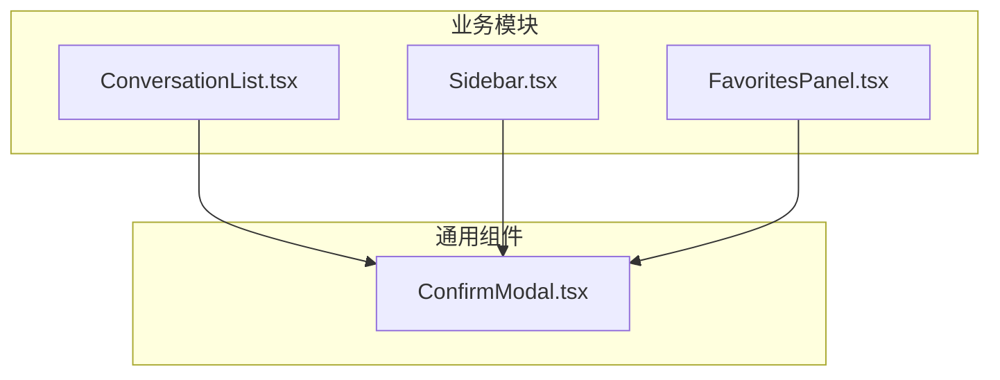
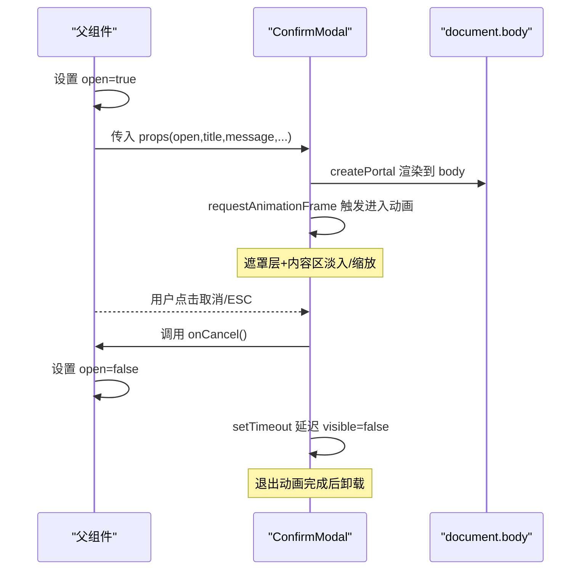
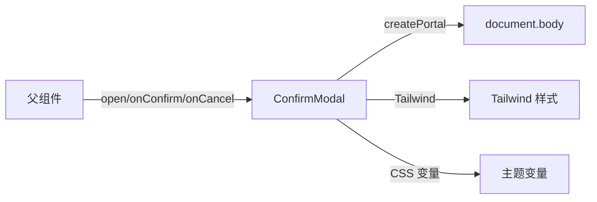

# 确认模态框 ConfirmModal

<cite>
**本文引用的文件**
- [ConfirmModal.tsx](file://src/components/common/ConfirmModal.tsx)
- [ConversationList.tsx](file://src/components/chat/ConversationList.tsx)
- [Sidebar.tsx](file://src/components/layout/Sidebar.tsx)
- [FavoritesPanel.tsx](file://src/components/artifact/FavoritesPanel.tsx)
</cite>

## 目录
1. [简介](#简介)
2. [项目结构](#项目结构)
3. [核心组件](#核心组件)
4. [架构总览](#架构总览)
5. [详细组件分析](#详细组件分析)
6. [依赖关系分析](#依赖关系分析)
7. [性能与可访问性](#性能与可访问性)
8. [故障排查指南](#故障排查指南)
9. [结论](#结论)
10. [附录：使用示例与最佳实践](#附录使用示例与最佳实践)

## 简介
ConfirmModal 是一个通用、可复用的“确认”模态框组件，用于在用户执行不可逆或重要操作前进行二次确认。它提供以下能力：
- 标准确认对话框：标题、消息、确认/取消按钮
- 多种视觉主题（danger/warning/info）
- 键盘事件支持（按 ESC 关闭）
- 遮罩层点击关闭
- 打开/关闭过渡动画
- 通过 Portal 渲染到 body，避免父级 transform/overflow 导致的定位问题
- 基础的可访问性属性（dialog、aria-modal、aria-labelledby、aria-describedby）

该组件以受控模式工作，由父组件通过 open 状态控制显示与隐藏，并通过 onConfirm/onCancel 回调处理业务逻辑。

## 项目结构
ConfirmModal 位于通用组件目录中，被多个页面模块复用，包括聊天会话列表、侧边栏、收藏面板等。

图表来源
- [ConfirmModal.tsx:1-135](file://src/components/common/ConfirmModal.tsx#L1-L135)
- [ConversationList.tsx:1-175](file://src/components/chat/ConversationList.tsx#L1-L175)
- [Sidebar.tsx:1-557](file://src/components/layout/Sidebar.tsx#L1-L557)
- [FavoritesPanel.tsx:1-312](file://src/components/artifact/FavoritesPanel.tsx#L1-L312)

章节来源
- [ConfirmModal.tsx:1-135](file://src/components/common/ConfirmModal.tsx#L1-L135)

## 核心组件
ConfirmModal 是一个函数式 React 组件，采用受控模式：
- 通过 open 布尔值控制是否显示
- 通过 title、message 设置标题和正文
- 通过 confirmText、cancelText 自定义按钮文案
- 通过 variant 选择主题色（danger/warning/info）
- 通过 onConfirm、onCancel 处理确认与取消行为

内部实现要点：
- 使用 requestAnimationFrame 触发进入动画，使用 setTimeout 延迟退出动画，保证过渡效果完整
- 使用 createPortal 将弹窗挂载到 document.body，避免父容器 transform/overflow 影响定位
- 监听 ESC 键关闭并阻止背景滚动
- 为遮罩层添加 backdrop-blur 和半透明背景，提升聚焦感
- 为内容区域添加 dialog 语义与 ARIA 属性，提升可访问性

章节来源
- [ConfirmModal.tsx:1-135](file://src/components/common/ConfirmModal.tsx#L1-L135)

## 架构总览
ConfirmModal 作为独立 UI 原子组件，被上层业务组件以“状态 + 回调”的方式集成。典型调用流程如下：

图表来源
- [ConfirmModal.tsx:34-81](file://src/components/common/ConfirmModal.tsx#L34-L81)
- [ConfirmModal.tsx:84-133](file://src/components/common/ConfirmModal.tsx#L84-L133)

## 详细组件分析

### Props 接口定义
- open: boolean
  - 控制模态框是否显示。true 时显示，false 时隐藏。
- title: string
  - 模态框标题文本。
- message: string
  - 模态框正文提示文本。
- confirmText?: string
  - 确认按钮文案，默认值为“确认”。
- cancelText?: string
  - 取消按钮文案，默认值为“取消”。
- variant?: 'danger' | 'warning' | 'info'
  - 主题变体，决定确认按钮的颜色与焦点环样式。
- onConfirm: () => void
  - 用户点击确认按钮时的回调。
- onCancel: () => void
  - 用户点击取消按钮、遮罩层或按下 ESC 时的回调。

章节来源
- [ConfirmModal.tsx:7-16](file://src/components/common/ConfirmModal.tsx#L7-L16)
- [ConfirmModal.tsx:18-22](file://src/components/common/ConfirmModal.tsx#L18-L22)

### 显示控制与动画
- 可见性状态：
  - mounted = open || visible：确保退出动画期间 DOM 仍保留
  - shown = open && visible：仅当两者都为 true 时才应用开启样式
- 进入动画：
  - 当 open 变为 true，使用 requestAnimationFrame 下一帧将 visible 设为 true，触发淡入与缩放
- 退出动画：
  - 当 open 变为 false，使用 setTimeout(200ms) 将 visible 设为 false，完成退出动画后再卸载
- 遮罩层与面板：
  - 遮罩层：固定定位、z-index 较高、半透明背景、模糊效果
  - 面板：圆角、阴影、边框、内边距、居中布局

章节来源
- [ConfirmModal.tsx:34-81](file://src/components/common/ConfirmModal.tsx#L34-L81)

### 键盘事件与可访问性
- 键盘事件：
  - 监听 window keydown，当按下 ESC 时调用 onCancel，并阻止默认行为
  - 打开时锁定 body 滚动（overflow:hidden），关闭时恢复
- 可访问性：
  - 根容器 role="presentation"
  - 内容容器 role="dialog"，aria-modal="true"
  - 标题与消息分别设置 id，并通过 aria-labelledby、aria-describedby 关联
  - 确认按钮 autoFocus，便于键盘快速操作

章节来源
- [ConfirmModal.tsx:50-66](file://src/components/common/ConfirmModal.tsx#L50-L66)
- [ConfirmModal.tsx:84-133](file://src/components/common/ConfirmModal.tsx#L84-L133)

### 自定义内容与样式定制
- 当前版本不支持直接插入自定义内容节点；如需扩展，可在组件内部增加 children 插槽并在消息下方渲染
- 样式定制建议：
  - 通过 CSS 变量覆盖主题色（如 --color-bg-base、--color-text-primary 等）
  - 通过 Tailwind 类名调整尺寸、间距、圆角等
  - 通过 variant 切换确认按钮颜色（danger/warning/info）

章节来源
- [ConfirmModal.tsx:18-22](file://src/components/common/ConfirmModal.tsx#L18-L22)
- [ConfirmModal.tsx:84-133](file://src/components/common/ConfirmModal.tsx#L84-L133)

### 实际使用场景与示例路径
以下为项目中真实使用 ConfirmModal 的场景与对应代码位置（不包含具体代码内容，仅提供路径以便查阅）：
- 删除单个会话确认
  - 组件：ConversationList
  - 入口：[ConversationList.tsx:159-171](file://src/components/chat/ConversationList.tsx#L159-L171)
- 侧边栏删除单个会话确认
  - 组件：Sidebar
  - 入口：[Sidebar.tsx:524-537](file://src/components/layout/Sidebar.tsx#L524-L537)
- 侧边栏批量删除确认
  - 组件：Sidebar
  - 入口：[Sidebar.tsx:539-553](file://src/components/layout/Sidebar.tsx#L539-L553)
- 收藏项删除确认
  - 组件：FavoritesPanel
  - 入口：[FavoritesPanel.tsx:296-308](file://src/components/artifact/FavoritesPanel.tsx#L296-L308)

章节来源
- [ConversationList.tsx:159-171](file://src/components/chat/ConversationList.tsx#L159-L171)
- [Sidebar.tsx:524-553](file://src/components/layout/Sidebar.tsx#L524-L553)
- [FavoritesPanel.tsx:296-308](file://src/components/artifact/FavoritesPanel.tsx#L296-L308)

## 依赖关系分析
ConfirmModal 的依赖与耦合情况：
- 外部依赖：
  - React hooks：useState、useEffect
  - React DOM：createPortal
  - CSS 框架：Tailwind 类名
  - CSS 变量：主题色与文本色
- 内部耦合：
  - 与父组件通过 open/onConfirm/onCancel 解耦，无直接状态共享
  - 通过 Portal 渲染到 body，避免与父级布局耦合
- 潜在风险：
  - 若父组件未正确管理 open 状态，可能导致无法关闭或重复渲染
  - 若全局样式变量缺失，可能影响外观一致性

图表来源
- [ConfirmModal.tsx:1-3](file://src/components/common/ConfirmModal.tsx#L1-L3)
- [ConfirmModal.tsx:84-133](file://src/components/common/ConfirmModal.tsx#L84-L133)

章节来源
- [ConfirmModal.tsx:1-3](file://src/components/common/ConfirmModal.tsx#L1-L3)
- [ConfirmModal.tsx:84-133](file://src/components/common/ConfirmModal.tsx#L84-L133)

## 性能与可访问性
- 性能特性：
  - 使用 requestAnimationFrame 与 setTimeout 控制动画时序，减少重排
  - 通过 mounted 派生值保持 DOM 直到退出动画结束，避免闪烁
  - Portal 渲染到 body，避免复杂祖先层级导致的布局计算开销
- 可访问性：
  - 使用 dialog 语义与 ARIA 属性，辅助技术可识别模态框
  - ESC 关闭与焦点管理（autoFocus 确认按钮）提升键盘体验
  - 遮罩层点击关闭，符合常见交互预期

章节来源
- [ConfirmModal.tsx:34-81](file://src/components/common/ConfirmModal.tsx#L34-L81)
- [ConfirmModal.tsx:50-66](file://src/components/common/ConfirmModal.tsx#L50-L66)
- [ConfirmModal.tsx:84-133](file://src/components/common/ConfirmModal.tsx#L84-L133)

## 故障排查指南
常见问题与解决思路：
- 模态框不显示
  - 检查父组件是否正确设置 open=true
  - 检查是否在渲染树中存在多个同名 ID（aria-labelledby/aria-describedby）
- 无法关闭
  - 检查 onOpen 与 onClose 是否成对更新 open 状态
  - 检查是否有其他事件冒泡阻止了点击遮罩或 ESC 事件
- 样式异常
  - 检查 CSS 变量是否已定义（--color-bg-base、--color-text-primary 等）
  - 检查 Tailwind 配置是否生效
- 滚动被锁定
  - 确认组件打开时 body.overflow 被设置为 hidden，关闭后恢复

章节来源
- [ConfirmModal.tsx:50-66](file://src/components/common/ConfirmModal.tsx#L50-L66)
- [ConfirmModal.tsx:84-133](file://src/components/common/ConfirmModal.tsx#L84-L133)

## 结论
ConfirmModal 提供了简洁、稳定、可访问的确认模态框能力，适合在各类业务场景中复用。其受控模式、动画过渡、键盘支持与 Portal 渲染使其具备良好的用户体验与工程化价值。建议在需要用户确认的重要操作中统一使用该组件，以保持交互一致性与可维护性。

## 附录：使用示例与最佳实践
- 基本用法
  - 在父组件中维护 open 状态，并在 onConfirm/onCancel 中更新状态
  - 参考路径：
    - [ConversationList.tsx:159-171](file://src/components/chat/ConversationList.tsx#L159-L171)
    - [Sidebar.tsx:524-537](file://src/components/layout/Sidebar.tsx#L524-L537)
- 批量操作确认
  - 在批量删除前弹出确认，确认后执行批量删除并重置选择状态
  - 参考路径：
    - [Sidebar.tsx:539-553](file://src/components/layout/Sidebar.tsx#L539-L553)
- 主题选择
  - 危险操作使用 danger，警告操作使用 warning，信息提示使用 info
  - 参考路径：
    - [ConfirmModal.tsx:18-22](file://src/components/common/ConfirmModal.tsx#L18-L22)
- 可访问性与键盘支持
  - 确保 ESC 能关闭，遮罩层点击能关闭
  - 参考路径：
    - [ConfirmModal.tsx:50-66](file://src/components/common/ConfirmModal.tsx#L50-L66)
    - [ConfirmModal.tsx:84-133](file://src/components/common/ConfirmModal.tsx#L84-L133)