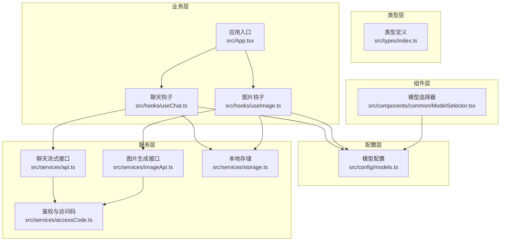
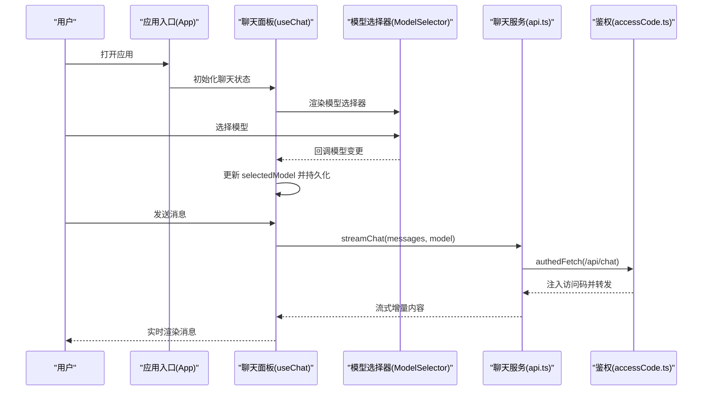
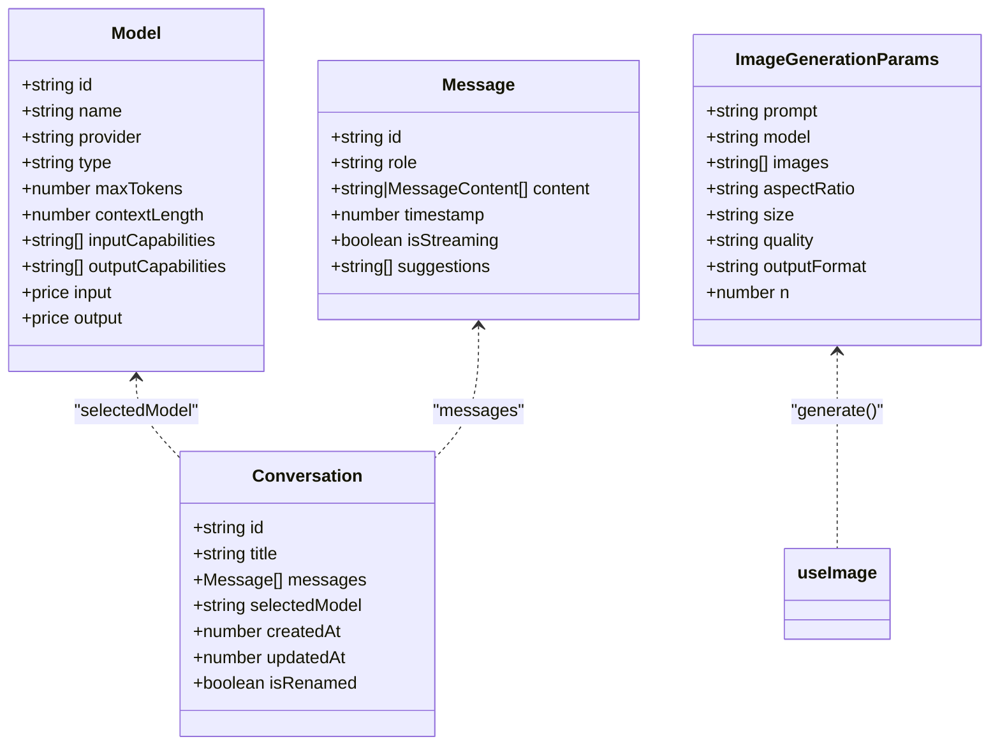
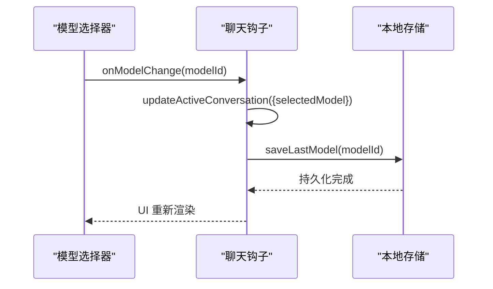
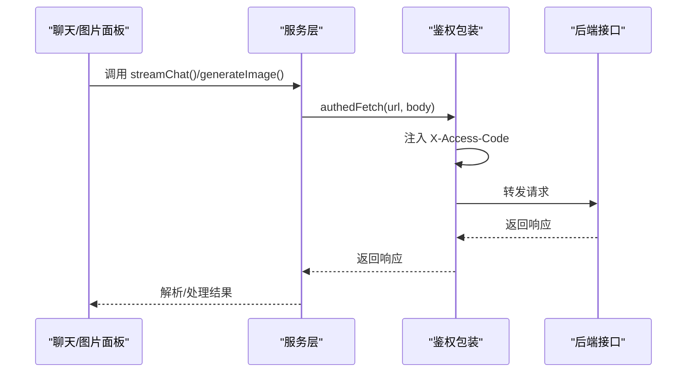
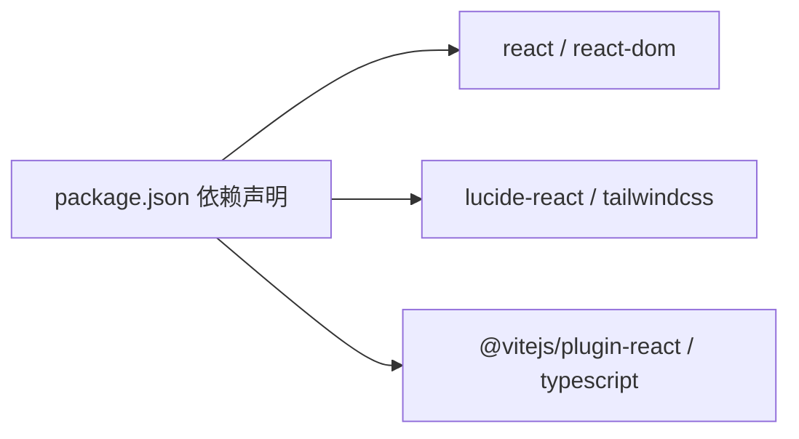

# 模型配置管理

<cite>
**本文引用的文件**
- [src/config/models.ts](file://src/config/models.ts)
- [src/types/index.ts](file://src/types/index.ts)
- [src/components/common/ModelSelector.tsx](file://src/components/common/ModelSelector.tsx)
- [src/hooks/useChat.ts](file://src/hooks/useChat.ts)
- [src/hooks/useImage.ts](file://src/hooks/useImage.ts)
- [src/services/api.ts](file://src/services/api.ts)
- [src/services/imageApi.ts](file://src/services/imageApi.ts)
- [src/services/accessCode.ts](file://src/services/accessCode.ts)
- [src/services/storage.ts](file://src/services/storage.ts)
- [src/App.tsx](file://src/App.tsx)
- [需求文档.md](file://需求文档.md)
- [package.json](file://package.json)
</cite>

## 目录
1. [简介](#简介)
2. [项目结构](#项目结构)
3. [核心组件](#核心组件)
4. [架构总览](#架构总览)
5. [详细组件分析](#详细组件分析)
6. [依赖关系分析](#依赖关系分析)
7. [性能考虑](#性能考虑)
8. [故障排查指南](#故障排查指南)
9. [结论](#结论)
10. [附录](#附录)

## 简介
本文件面向 AIShop 的模型配置管理系统，系统性阐述模型定义、能力矩阵与价格配置的设计与实现；模型类型系统的接口规范、数据结构与类型约束；模型切换机制的动态加载、配置管理与状态同步；不同模型提供商的集成方式（API 密钥管理、请求格式适配与响应处理）；以及模型扩展的开发指南（新增模型流程、配置格式与测试方法）。同时提供性能监控与优化建议（响应时间统计、错误率分析与资源使用）、版本管理与向后兼容策略。

## 项目结构
AIShop 采用前端单页应用架构，核心围绕“模型配置 + 业务面板 + 服务层”的分层组织：
- 配置层：集中定义各模型的能力、上下文长度、价格等元数据
- 类型层：统一声明消息、模型、会话、媒体等数据结构
- 业务层：聊天与图片生成等面板逻辑，负责状态管理与交互
- 服务层：封装 API 调用、鉴权、存储与并发控制
- 组件层：通用选择器、布局与面板组件

图表来源
- [src/config/models.ts:1-228](file://src/config/models.ts#L1-L228)
- [src/types/index.ts:1-103](file://src/types/index.ts#L1-L103)
- [src/hooks/useChat.ts:1-370](file://src/hooks/useChat.ts#L1-L370)
- [src/hooks/useImage.ts:1-393](file://src/hooks/useImage.ts#L1-L393)
- [src/services/api.ts:1-83](file://src/services/api.ts#L1-L83)
- [src/services/imageApi.ts:1-41](file://src/services/imageApi.ts#L1-L41)
- [src/services/accessCode.ts:1-113](file://src/services/accessCode.ts#L1-L113)
- [src/services/storage.ts:1-66](file://src/services/storage.ts#L1-L66)
- [src/components/common/ModelSelector.tsx:1-168](file://src/components/common/ModelSelector.tsx#L1-L168)
- [src/App.tsx:1-74](file://src/App.tsx#L1-L74)

章节来源
- [src/config/models.ts:1-228](file://src/config/models.ts#L1-L228)
- [src/types/index.ts:1-103](file://src/types/index.ts#L1-L103)
- [src/App.tsx:1-74](file://src/App.tsx#L1-L74)

## 核心组件
- 模型配置中心：集中维护各模型的标识、名称、提供商、类型、上下文长度、最大输出令牌数、输入/输出能力矩阵与价格配置，并提供按类型查询的工厂方法
- 类型系统：统一的消息、模型、会话、媒体与图片生成参数的数据结构，确保跨模块一致性
- 模型选择器：基于 Provider 的图标映射与弹出菜单，支持动态定位与键盘/点击外层关闭
- 聊天与图片钩子：封装模型切换、消息流式传输、并发队列、超时与重试、历史持久化等
- 服务层：统一的带访问码鉴权的 fetch 包装、聊天流式解析、图片生成请求与错误处理、本地存储

章节来源
- [src/config/models.ts:1-228](file://src/config/models.ts#L1-L228)
- [src/types/index.ts:1-103](file://src/types/index.ts#L1-L103)
- [src/components/common/ModelSelector.tsx:1-168](file://src/components/common/ModelSelector.tsx#L1-L168)
- [src/hooks/useChat.ts:1-370](file://src/hooks/useChat.ts#L1-L370)
- [src/hooks/useImage.ts:1-393](file://src/hooks/useImage.ts#L1-L393)
- [src/services/api.ts:1-83](file://src/services/api.ts#L1-L83)
- [src/services/imageApi.ts:1-41](file://src/services/imageApi.ts#L1-L41)
- [src/services/accessCode.ts:1-113](file://src/services/accessCode.ts#L1-L113)
- [src/services/storage.ts:1-66](file://src/services/storage.ts#L1-L66)

## 架构总览
系统以“配置驱动 + 钩子管理 + 服务封装”的方式实现模型配置管理与业务交互：

图表来源
- [src/App.tsx:1-74](file://src/App.tsx#L1-L74)
- [src/hooks/useChat.ts:135-250](file://src/hooks/useChat.ts#L135-L250)
- [src/components/common/ModelSelector.tsx:42-167](file://src/components/common/ModelSelector.tsx#L42-L167)
- [src/services/api.ts:13-82](file://src/services/api.ts#L13-L82)
- [src/services/accessCode.ts:37-57](file://src/services/accessCode.ts#L37-L57)

## 详细组件分析

### 模型配置与类型系统
- 模型定义：每个模型包含唯一 id、显示名称、提供商、类型（chat/image/video/music）、上下文长度、最大输出令牌数、输入/输出能力数组、价格对象（输入/输出）
- 查询工厂：按类型返回对应模型集合，便于 UI 动态渲染
- 类型约束：通过 TypeScript 接口严格约束消息、会话、媒体与图片参数字段，减少运行期错误

图表来源
- [src/types/index.ts:25-38](file://src/types/index.ts#L25-L38)
- [src/types/index.ts:9-23](file://src/types/index.ts#L9-L23)
- [src/types/index.ts:58-66](file://src/types/index.ts#L58-L66)
- [src/types/index.ts:69-78](file://src/types/index.ts#L69-L78)

章节来源
- [src/config/models.ts:3-179](file://src/config/models.ts#L3-L179)
- [src/types/index.ts:25-38](file://src/types/index.ts#L25-L38)
- [src/types/index.ts:9-23](file://src/types/index.ts#L9-L23)
- [src/types/index.ts:58-66](file://src/types/index.ts#L58-L66)
- [src/types/index.ts:69-78](file://src/types/index.ts#L69-L78)

### 模型切换机制与状态同步
- 动态加载：聊天与图片面板分别从模型配置中读取可用模型集，UI 根据类型筛选渲染
- 配置管理：聊天面板持久化最近使用的模型；图片面板持久化图片模型与历史
- 状态同步：模型变更通过回调更新活动会话的 selectedModel，并写入本地存储

图表来源
- [src/components/common/ModelSelector.tsx:142-158](file://src/components/common/ModelSelector.tsx#L142-L158)
- [src/hooks/useChat.ts:104-110](file://src/hooks/useChat.ts#L104-L110)
- [src/services/storage.ts:39-51](file://src/services/storage.ts#L39-L51)

章节来源
- [src/components/common/ModelSelector.tsx:42-167](file://src/components/common/ModelSelector.tsx#L42-L167)
- [src/hooks/useChat.ts:104-110](file://src/hooks/useChat.ts#L104-L110)
- [src/services/storage.ts:39-51](file://src/services/storage.ts#L39-L51)

### 不同模型提供商的集成方式
- API 密钥管理：通过访问码鉴权包装器统一注入请求头，401 时清除本地访问码并广播事件，由门禁组件引导重新登录
- 请求格式适配：聊天流式接口将消息转换为统一结构；图片生成接口根据模型类型设置尺寸、宽高比、质量等参数
- 响应处理：聊天流式解析增量内容；图片生成校验返回的 URL 数组并处理上游错误详情

图表来源
- [src/services/api.ts:13-82](file://src/services/api.ts#L13-L82)
- [src/services/imageApi.ts:8-40](file://src/services/imageApi.ts#L8-L40)
- [src/services/accessCode.ts:37-57](file://src/services/accessCode.ts#L37-L57)

章节来源
- [src/services/accessCode.ts:37-57](file://src/services/accessCode.ts#L37-L57)
- [src/services/api.ts:13-82](file://src/services/api.ts#L13-L82)
- [src/services/imageApi.ts:8-40](file://src/services/imageApi.ts#L8-L40)

### 模型扩展开发指南
- 新增模型步骤
  - 在模型配置中添加条目，填写 id、name、provider、type、上下文长度、最大输出、能力矩阵与价格
  - 如需 UI 图标，补充 Provider 到图标文件的映射
  - 若为图片模型，完善尺寸/比例/质量等参数的默认值与选项
- 配置格式
  - 使用统一的 Model 接口字段，确保类型安全
  - 能力矩阵与价格字段遵循现有结构，便于 UI 展示与后续统计
- 测试方法
  - 单元测试：验证模型查询工厂按类型返回正确集合
  - 集成测试：模拟聊天/图片生成流程，覆盖成功与错误路径
  - 用户验收：在不同 Provider 下对比输入输出能力与价格显示

章节来源
- [src/config/models.ts:3-179](file://src/config/models.ts#L3-L179)
- [src/components/common/ModelSelector.tsx:13-29](file://src/components/common/ModelSelector.tsx#L13-L29)
- [src/hooks/useImage.ts:18-37](file://src/hooks/useImage.ts#L18-L37)
- [src/types/index.ts:25-38](file://src/types/index.ts#L25-L38)

### 性能监控与优化建议
- 响应时间统计
  - 在服务层记录请求开始与结束时间，计算平均延迟与 P95/P99
  - 对不同 Provider 与模型维度聚合统计，识别慢调用
- 错误率分析
  - 分类统计 4xx/5xx、超时、鉴权失败等错误占比
  - 结合错误详情字段定位上游问题
- 资源使用
  - 控制并发队列大小，避免内存与连接池耗尽
  - 图片生成前进行压缩与裁剪，降低网络与存储压力
- 优化建议
  - 启用请求缓存（如适用）与预热连接
  - 对高频模型建立长连接或复用连接
  - UI 层节流渲染，避免大量消息时的重排

[本节为通用指导，无需特定文件来源]

### 版本管理与向后兼容
- 版本策略
  - 语义化版本：小版本用于新增模型与能力，补丁版本修复缺陷
  - 配置迁移：新增字段时提供默认值，避免旧数据报错
- 兼容性保障
  - 类型系统引入可选字段与默认值，保证旧会话与历史数据可用
  - 模型配置新增 Provider 或能力时，UI 侧做存在性检查与降级显示

章节来源
- [src/services/storage.ts:12-13](file://src/services/storage.ts#L12-L13)
- [src/types/index.ts:25-38](file://src/types/index.ts#L25-L38)

## 依赖关系分析
- 模块耦合
  - 配置层与类型层低耦合，通过接口契约解耦
  - 业务钩子依赖配置与服务层，形成清晰的单向依赖
- 外部依赖
  - React 生态与 UI 库，Vite 构建工具链
  - 服务端通过访问码鉴权，避免前端硬编码密钥

图表来源
- [package.json:12-37](file://package.json#L12-L37)

章节来源
- [package.json:12-37](file://package.json#L12-L37)

## 性能考虑
- 流式传输：聊天采用流式接口，提升首包延迟体验
- 并发控制：图片生成使用独立 AbortController 与超时，避免阻塞
- 本地持久化：模型与会话状态本地存储，减少重复加载
- UI 渲染：模型选择器使用固定定位与 Portal，避免布局抖动

[本节为通用指导，无需特定文件来源]

## 故障排查指南
- 鉴权失败
  - 现象：401 错误并弹回登录
  - 处理：清除本地访问码，重新输入并验证
- 请求超时
  - 现象：图片生成任务标记为错误
  - 处理：检查网络与上游服务状态，必要时重试
- 数据不一致
  - 现象：导入会话后流式状态异常
  - 处理：导入时清理流式标记，确保 UI 正常

章节来源
- [src/services/accessCode.ts:49-54](file://src/services/accessCode.ts#L49-L54)
- [src/hooks/useImage.ts:265-282](file://src/hooks/useImage.ts#L265-L282)
- [src/hooks/useChat.ts:326-332](file://src/hooks/useChat.ts#L326-L332)

## 结论
AIShop 的模型配置管理系统以“配置驱动 + 类型安全 + 服务封装”为核心，实现了模型定义、能力矩阵、价格配置与切换机制的统一管理。通过访问码鉴权、流式传输与并发控制，系统在易用性与性能之间取得平衡。建议在后续迭代中进一步完善监控指标、错误分类与缓存策略，持续提升用户体验与稳定性。

## 附录
- 相关文档与参考
  - 需求文档中提供了模型价格与请求示例的参考表格，可用于对照与回归测试
  - 图像生成 API 参考文档位于 ImageGenAPI 目录，便于理解不同模型的请求差异

章节来源
- [需求文档.md:39-55](file://需求文档.md#L39-L55)