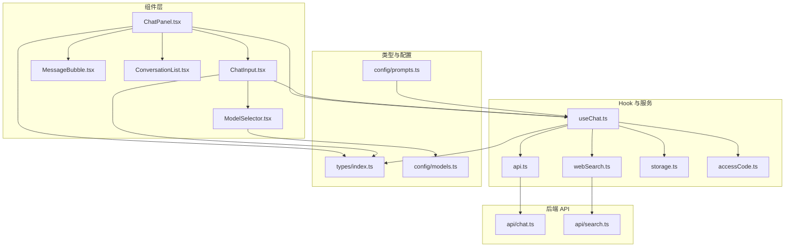
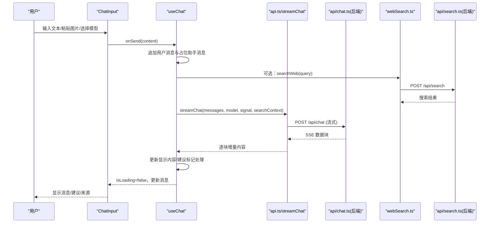
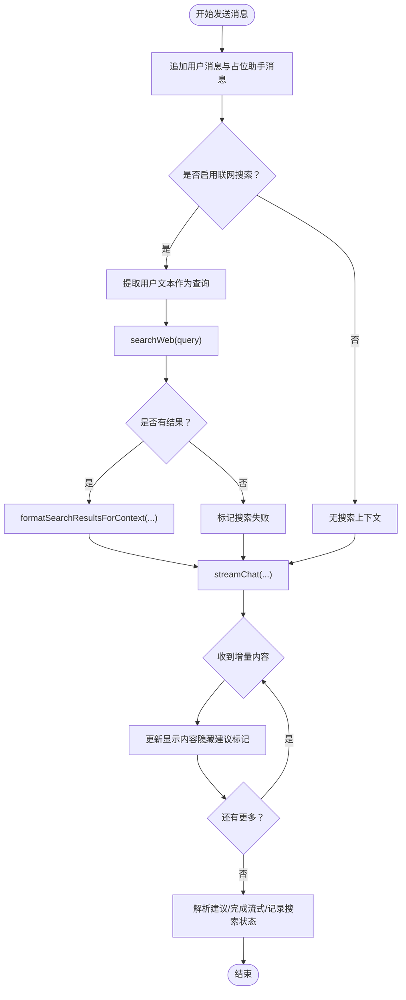
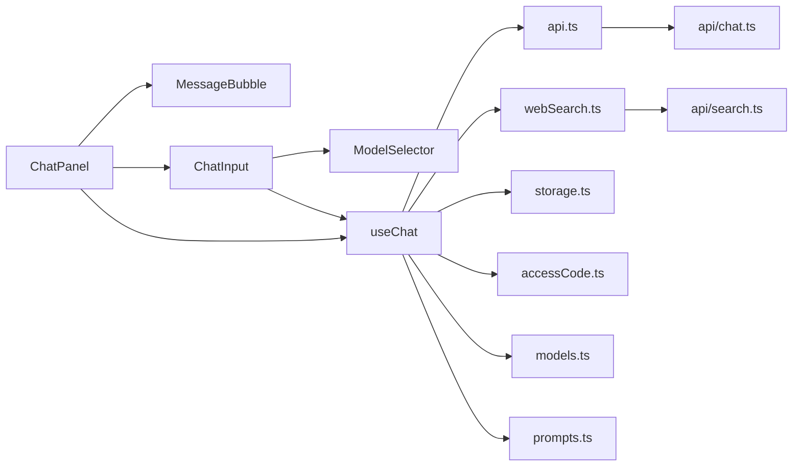

# 聊天功能

<cite>
**本文引用的文件**
- [ChatPanel.tsx](file://src/components/chat/ChatPanel.tsx)
- [ChatInput.tsx](file://src/components/chat/ChatInput.tsx)
- [ConversationList.tsx](file://src/components/chat/ConversationList.tsx)
- [MessageBubble.tsx](file://src/components/chat/MessageBubble.tsx)
- [useChat.ts](file://src/hooks/useChat.ts)
- [api.ts](file://src/services/api.ts)
- [storage.ts](file://src/services/storage.ts)
- [webSearch.ts](file://src/services/webSearch.ts)
- [accessCode.ts](file://src/services/accessCode.ts)
- [models.ts](file://src/config/models.ts)
- [prompts.ts](file://src/config/prompts.ts)
- [index.ts](file://src/types/index.ts)
- [chat.ts](file://api/chat.ts)
- [search.ts](file://api/search.ts)
- [ModelSelector.tsx](file://src/components/common/ModelSelector.tsx)
</cite>

## 目录
1. [简介](#简介)
2. [项目结构](#项目结构)
3. [核心组件](#核心组件)
4. [架构总览](#架构总览)
5. [详细组件分析](#详细组件分析)
6. [依赖关系分析](#依赖关系分析)
7. [性能考量](#性能考量)
8. [故障排查指南](#故障排查指南)
9. [结论](#结论)
10. [附录](#附录)

## 简介
本文件面向 AIShop 的聊天功能，围绕聊天面板 ChatPanel、输入组件 ChatInput、会话管理与消息气泡 MessageBubble 展开，同时详解 useChat Hook 的状态管理、流式 API 处理、错误处理与状态同步机制，并说明与后端 API 的集成方式（请求格式、响应处理、连接管理）。文档提供从基础使用到性能优化与常见问题的完整指引。

## 项目结构
聊天功能由以下模块协同构成：
- 组件层：ChatPanel、ChatInput、MessageBubble、ConversationList、ModelSelector
- 状态与业务：useChat Hook
- 类型与配置：types、models、prompts
- 服务层：api（流式聊天）、webSearch（联网搜索）、storage（本地持久化）、accessCode（访问码鉴权）
- 后端 API：Vercel Edge Functions（chat.ts、search.ts）

图表来源
- [ChatPanel.tsx:1-369](file://src/components/chat/ChatPanel.tsx#L1-L369)
- [ChatInput.tsx:1-230](file://src/components/chat/ChatInput.tsx#L1-L230)
- [MessageBubble.tsx:1-124](file://src/components/chat/MessageBubble.tsx#L1-L124)
- [ConversationList.tsx:1-171](file://src/components/chat/ConversationList.tsx#L1-L171)
- [useChat.ts:1-370](file://src/hooks/useChat.ts#L1-L370)
- [api.ts:1-83](file://src/services/api.ts#L1-L83)
- [webSearch.ts:1-58](file://src/services/webSearch.ts#L1-L58)
- [storage.ts:1-66](file://src/services/storage.ts#L1-L66)
- [accessCode.ts:1-113](file://src/services/accessCode.ts#L1-L113)
- [models.ts:1-228](file://src/config/models.ts#L1-L228)
- [prompts.ts:1-31](file://src/config/prompts.ts#L1-L31)
- [index.ts:1-103](file://src/types/index.ts#L1-L103)
- [chat.ts:1-50](file://api/chat.ts#L1-L50)
- [search.ts:1-66](file://api/search.ts#L1-L66)

章节来源
- [ChatPanel.tsx:1-369](file://src/components/chat/ChatPanel.tsx#L1-L369)
- [ChatInput.tsx:1-230](file://src/components/chat/ChatInput.tsx#L1-L230)
- [MessageBubble.tsx:1-124](file://src/components/chat/MessageBubble.tsx#L1-L124)
- [ConversationList.tsx:1-171](file://src/components/chat/ConversationList.tsx#L1-L171)
- [useChat.ts:1-370](file://src/hooks/useChat.ts#L1-L370)
- [api.ts:1-83](file://src/services/api.ts#L1-L83)
- [webSearch.ts:1-58](file://src/services/webSearch.ts#L1-L58)
- [storage.ts:1-66](file://src/services/storage.ts#L1-L66)
- [accessCode.ts:1-113](file://src/services/accessCode.ts#L1-L113)
- [models.ts:1-228](file://src/config/models.ts#L1-L228)
- [prompts.ts:1-31](file://src/config/prompts.ts#L1-L31)
- [index.ts:1-103](file://src/types/index.ts#L1-L103)
- [chat.ts:1-50](file://api/chat.ts#L1-L50)
- [search.ts:1-66](file://api/search.ts#L1-L66)

## 核心组件
- ChatPanel：负责消息区域渲染、输入区接入、会话导出、拖拽导入、滚动行为与空态引导。
- ChatInput：负责文本输入、粘贴/文件上传图片、多模态内容组装、发送与停止控制。
- MessageBubble：负责消息内容渲染（文本/Markdown/多模态）、联网搜索标识与来源展示、建议按钮。
- ConversationList：负责会话列表、搜索、重命名、删除确认与切换。
- useChat Hook：负责会话状态、消息流式接收、联网搜索、标题自动生成、导入导出、模型与搜索开关持久化。

章节来源
- [ChatPanel.tsx:13-32](file://src/components/chat/ChatPanel.tsx#L13-L32)
- [ChatInput.tsx:7-15](file://src/components/chat/ChatInput.tsx#L7-L15)
- [MessageBubble.tsx:6-10](file://src/components/chat/MessageBubble.tsx#L6-L10)
- [ConversationList.tsx:7-14](file://src/components/chat/ConversationList.tsx#L7-L14)
- [useChat.ts:69-369](file://src/hooks/useChat.ts#L69-L369)

## 架构总览
前端通过 useChat Hook 管理状态，调用服务层 api.ts 的 streamChat 实现流式响应；当开启联网搜索时，通过 webSearch.ts 调用 /api/search 获取上下文；访问控制通过 accessCode.ts 注入 X-Access-Code 头并处理 401；最终由 ChatPanel/ChatInput/MessageBubble 渲染 UI。

图表来源
- [ChatInput.tsx:31-54](file://src/components/chat/ChatInput.tsx#L31-L54)
- [useChat.ts:135-250](file://src/hooks/useChat.ts#L135-L250)
- [api.ts:13-83](file://src/services/api.ts#L13-L83)
- [chat.ts:11-49](file://api/chat.ts#L11-L49)
- [webSearch.ts:20-46](file://src/services/webSearch.ts#L20-L46)
- [search.ts:11-65](file://api/search.ts#L11-L65)

## 详细组件分析

### ChatPanel：消息显示、输入处理与用户交互
- 消息区域与滚动：监听容器滚动以判断是否自动滚动到底部；在用户发送新消息时强制恢复自动滚动。
- 空态引导：当无消息时展示欢迎语与快捷操作按钮，点击后通过 sendMessage 触发。
- 导出功能：支持导出为 Markdown 与 JSON；JSON 导出包含版本、应用标识与会话元数据。
- 拖拽导入：支持拖拽 .aishop.json 文件，校验 app/version/conversation 后导入。
- 输入区接入：将 sendMessage、isLoading、stopGeneration、模型与搜索开关传递给 ChatInput。

章节来源
- [ChatPanel.tsx:46-78](file://src/components/chat/ChatPanel.tsx#L46-L78)
- [ChatPanel.tsx:92-165](file://src/components/chat/ChatPanel.tsx#L92-L165)
- [ChatPanel.tsx:167-217](file://src/components/chat/ChatPanel.tsx#L167-L217)
- [ChatPanel.tsx:348-356](file://src/components/chat/ChatPanel.tsx#L348-L356)

### ChatInput：多模态输入、文件上传与输入验证
- 文本输入：自动高度调整、Enter 发送、Shift+Enter 换行。
- 多模态内容：支持粘贴图片（ClipboardEvent）与文件选择（onChange），转换为 base64 并预览；发送时将文本与图片打包为 MessageContent 数组。
- 发送与停止：根据 isLoading 控制按钮状态；发送后清空输入与图片预览。
- 模型选择：通过 ModelSelector 选择模型，变更后持久化到 localStorage。

章节来源
- [ChatInput.tsx:25-54](file://src/components/chat/ChatInput.tsx#L25-L54)
- [ChatInput.tsx:56-69](file://src/components/chat/ChatInput.tsx#L56-L69)
- [ChatInput.tsx:71-89](file://src/components/chat/ChatInput.tsx#L71-L89)
- [ChatInput.tsx:91-106](file://src/components/chat/ChatInput.tsx#L91-L106)
- [ChatInput.tsx:112-228](file://src/components/chat/ChatInput.tsx#L112-L228)
- [ModelSelector.tsx:42-167](file://src/components/common/ModelSelector.tsx#L42-L167)

### MessageBubble：消息渲染与交互元素
- 文本渲染：用户消息直接展示；助手消息使用 ReactMarkdown + GFM 插件渲染，支持代码块、表格等。
- 流式指示：isStreaming 为真时显示闪烁光标。
- 多模态：当 content 为数组时，分别渲染文本与图片。
- 网络搜索反馈：展示“已联网搜索/搜索失败”徽章与来源链接。
- 建议按钮：在助手消息末尾展示 suggestions，点击回调至 ChatPanel 的 onSuggestionClick。

章节来源
- [MessageBubble.tsx:12-54](file://src/components/chat/MessageBubble.tsx#L12-L54)
- [MessageBubble.tsx:65-122](file://src/components/chat/MessageBubble.tsx#L65-L122)

### ConversationList：会话列表与管理
- 过滤与搜索：支持中英文关键词与拼音匹配；双击进入重命名；支持删除确认。
- 交互：点击切换会话；新建会话按钮；删除按钮在 hover 时显示。
- 与 useChat 对接：通过 onSwitch/onNew/onDelete/onRename 与 Hook 交互。

章节来源
- [ConversationList.tsx:16-38](file://src/components/chat/ConversationList.tsx#L16-L38)
- [ConversationList.tsx:47-64](file://src/components/chat/ConversationList.tsx#L47-L64)
- [ConversationList.tsx:93-152](file://src/components/chat/ConversationList.tsx#L93-L152)

### useChat Hook：状态管理、流式处理与会话生命周期
- 状态与持久化：conversations、activeId、selectedModel、webSearchEnabled；通过 storage.ts 读写 localStorage。
- 发送消息：构建用户消息与占位助手消息；可选联网搜索上下文；调用 streamChat 获取增量内容；结束后解析建议标记、设置 isStreaming=false、记录搜索状态与来源。
- 建议标记处理：getDisplayContent 在流式过程中隐藏 <<<SUGGESTIONS>>> 等标记，避免中间态闪现；parseSuggestions 提取建议列表。
- 停止生成：AbortController 中断流式请求。
- 会话管理：新建、切换、删除、重命名、导入；导入时清理 isStreaming 状态。
- 标题生成：triggerTitleGeneration 使用专用模型生成标题，仅在必要时触发。

图表来源
- [useChat.ts:135-250](file://src/hooks/useChat.ts#L135-L250)
- [webSearch.ts:48-57](file://src/services/webSearch.ts#L48-L57)
- [api.ts:13-83](file://src/services/api.ts#L13-L83)

章节来源
- [useChat.ts:69-369](file://src/hooks/useChat.ts#L69-L369)
- [storage.ts:7-25](file://src/services/storage.ts#L7-L25)
- [webSearch.ts:20-57](file://src/services/webSearch.ts#L20-L57)
- [prompts.ts:22-25](file://src/config/prompts.ts#L22-L25)

### 类型与配置：数据结构与模型
- Message/MessageContent：支持字符串或多部分（文本/图片）；扩展字段包括 isStreaming、suggestions、webSearched、webSearchFailed、searchResults。
- Conversation：包含 id、title、messages、selectedModel、时间戳与重命名标记。
- Model：模型清单，含 provider、能力、价格等；ModelSelector 依据 provider 映射图标。
- 系统提示词：统一管理，末尾建议标记格式固定，便于 Hook 解析。

章节来源
- [index.ts:9-23](file://src/types/index.ts#L9-L23)
- [index.ts:58-66](file://src/types/index.ts#L58-L66)
- [models.ts:3-179](file://src/config/models.ts#L3-L179)
- [prompts.ts:22-25](file://src/config/prompts.ts#L22-L25)

## 依赖关系分析
- 组件依赖：ChatPanel 依赖 MessageBubble 与 ChatInput；ChatInput 依赖 ModelSelector；ConversationList 与 useChat 交互。
- Hook 依赖：useChat 依赖 api.ts（流式）、webSearch.ts（联网搜索）、storage.ts（持久化）、accessCode.ts（鉴权）、models.ts（模型）、prompts.ts（系统提示）。
- 后端依赖：api.ts 依赖 /api/chat；webSearch.ts 依赖 /api/search；accessCode.ts 依赖 /api/verify。

图表来源
- [ChatPanel.tsx:11-12](file://src/components/chat/ChatPanel.tsx#L11-L12)
- [ChatInput.tsx:3](file://src/components/chat/ChatInput.tsx#L3)
- [useChat.ts:3-15](file://src/hooks/useChat.ts#L3-L15)
- [api.ts:1-7](file://src/services/api.ts#L1-L7)
- [webSearch.ts:1-5](file://src/services/webSearch.ts#L1-L5)
- [accessCode.ts:1-5](file://src/services/accessCode.ts#L1-L5)
- [chat.ts:11-19](file://api/chat.ts#L11-L19)
- [search.ts:11-18](file://api/search.ts#L11-L18)

章节来源
- [useChat.ts:1-16](file://src/hooks/useChat.ts#L1-L16)
- [api.ts:1-7](file://src/services/api.ts#L1-L7)
- [webSearch.ts:1-5](file://src/services/webSearch.ts#L1-L5)
- [accessCode.ts:1-5](file://src/services/accessCode.ts#L1-L5)
- [chat.ts:11-19](file://api/chat.ts#L11-L19)
- [search.ts:11-18](file://api/search.ts#L11-L18)

## 性能考量
- 流式渲染优化：useChat 通过 getDisplayContent 在流式过程中隐藏建议标记，减少不必要的重渲染与视觉闪烁。
- 滚动行为：ChatPanel 仅在靠近底部时自动滚动，避免频繁滚动导致的布局抖动。
- 输入自适应高度：ChatInput 动态计算 textarea 高度，限制最大高度，提升移动端体验。
- 本地持久化：storage.ts 使用 localStorage 存储会话与模型选择，避免每次刷新重新加载。
- 搜索降级：webSearch.ts 在异常时返回空结果，不影响主流程。
- 建议生成异步：titleGenerator 采用 fire-and-forget 方式，避免阻塞消息发送。

章节来源
- [useChat.ts:52-67](file://src/hooks/useChat.ts#L52-L67)
- [ChatPanel.tsx:56-78](file://src/components/chat/ChatPanel.tsx#L56-L78)
- [ChatInput.tsx:65-69](file://src/components/chat/ChatInput.tsx#L65-L69)
- [storage.ts:19-25](file://src/services/storage.ts#L19-L25)
- [webSearch.ts:42-46](file://src/services/webSearch.ts#L42-L46)
- [useChat.ts:118-133](file://src/hooks/useChat.ts#L118-L133)

## 故障排查指南
- 流式响应中断：点击停止按钮会触发 AbortController.abort()，确保 isLoading 状态及时复位。
- 401 未授权：accessCode.ts 在收到 401 时清除本地访问码并广播事件，前端应监听并引导重新登录。
- 搜索失败：webSearch.ts 捕获异常并返回空结果；useChat 中标记 webSearchFailed，MessageBubble 展示黄色警告。
- 导入文件格式错误：ChatPanel 在拖拽导入时校验 app/version/conversation 字段，不匹配时提示“不支持的文件格式”。

章节来源
- [useChat.ts:252-255](file://src/hooks/useChat.ts#L252-L255)
- [accessCode.ts:49-54](file://src/services/accessCode.ts#L49-L54)
- [webSearch.ts:42-46](file://src/services/webSearch.ts#L42-L46)
- [ChatPanel.tsx:204-216](file://src/components/chat/ChatPanel.tsx#L204-L216)

## 结论
AIShop 的聊天功能以 useChat Hook 为核心，结合 ChatPanel/ChatInput/MessageBubble 实现了多模态输入、流式响应、联网搜索与会话管理。通过明确的数据结构、完善的错误处理与本地持久化策略，系统在可用性与性能之间取得平衡。建议在生产环境中进一步关注网络波动下的稳定性与可观察性，以及对不同模型能力的适配与提示词优化。

## 附录

### 使用示例与最佳实践
- 智能对话
  - 在 ChatInput 中输入文本或粘贴图片，点击发送或按 Enter。
  - 若需要联网增强，可在 ChatPanel 顶部启用“联网搜索”，系统会自动拼接搜索结果作为上下文。
  - 建议按钮由后端系统提示词末尾的标记生成，点击可快速延续话题。
- 会话历史管理
  - 使用 ConversationList 新建、切换、重命名与删除会话；支持搜索对话标题。
  - 通过 ChatPanel 的导出功能将当前会话导出为 Markdown 或 JSON，便于归档与分享。
- 流式响应处理
  - 发送后助手消息将以增量形式逐步呈现；可通过“停止生成”中断请求。
  - 建议标记在流式过程中会被隐藏，最终一次性展示，避免阅读干扰。

章节来源
- [ChatInput.tsx:31-54](file://src/components/chat/ChatInput.tsx#L31-L54)
- [useChat.ts:174-250](file://src/hooks/useChat.ts#L174-L250)
- [MessageBubble.tsx:107-119](file://src/components/chat/MessageBubble.tsx#L107-L119)
- [ConversationList.tsx:69-75](file://src/components/chat/ConversationList.tsx#L69-L75)
- [ChatPanel.tsx:92-165](file://src/components/chat/ChatPanel.tsx#L92-L165)